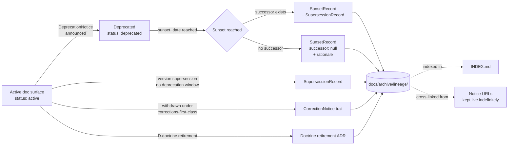

<!-- [KFM_META_BLOCK_V2]
doc_id: kfm://doc/<TODO-uuid>
title: Archived Lineage Records
type: standard
version: v1
status: draft
owners: <TODO: Governance Steward + Release Authority>
created: 2026-05-15
updated: 2026-05-15
policy_label: public
related:
  - docs/doctrine/lifecycle-law.md
  - docs/doctrine/corrections-first-class.md
  - docs/doctrine/derived-stays-derived.md
  - docs/doctrine/authority-ladder.md
  - docs/governance/deprecation-process.md
  - docs/governance/DECISION_LOG.md
  - docs/architecture/release-and-publication.md
tags: [kfm, archive, lineage, supersession, deprecation, governance]
notes:
  - "Directory purpose is INFERRED from sibling doctrine and prior project work; NEEDS VERIFICATION against the live repository."
  - "All paths below the index table are PROPOSED until inspected on disk."
[/KFM_META_BLOCK_V2] -->

# 🗂 Archived Lineage Records

> Append-only archive of supersession trails for retired KFM documentation surfaces, schemas, routes, and governance artifacts — the documentary side of "corrections are first-class."


<!-- TODO — replace placeholder Shields targets once the docs CI surface is verified. -->

**Status:** `draft` · **Owners:** `TODO — Governance Steward + Release Authority` <sub>NEEDS VERIFICATION</sub> · **Last updated:** `2026-05-15`

> [!IMPORTANT]
> This archive holds **documentary lineage** — the supersession trail between *retired* and *successor* documentation surfaces. It is **not** the data-lineage store, **not** the evidence store, and **not** where active deprecation notices live. See [§4 — Exclusions](#4-exclusions) before adding anything here.

---

## Contents

1. [Scope](#1-scope)
2. [Repo fit](#2-repo-fit)
3. [Inputs — what belongs here](#3-inputs--what-belongs-here)
4. [Exclusions — what does not](#4-exclusions--what-does-not)
5. [Directory layout](#5-directory-layout)
6. [Lineage flow (RETIRED → ARCHIVED)](#6-lineage-flow-retired--archived)
7. [Append-only invariant](#7-append-only-invariant)
8. [Record categories](#8-record-categories)
9. [File naming and identifiers](#9-file-naming-and-identifiers)
10. [Authoring workflow](#10-authoring-workflow)
11. [FAQ](#11-faq)
12. [Related docs](#12-related-docs)
13. [Appendix](#13-appendix)

---

## 1. Scope

This directory is the **canonical home for archived lineage records** in the KFM documentation tree. A lineage record is the durable, human-readable artifact that connects a *retired* documentation surface to its *successor* — capturing what was replaced, when, by what, and under whose authority.

The directory exists because KFM's deprecation doctrine fixes two rules that, together, demand a dedicated archive:

1. **Retired documents are not deleted.** They remain at their original paths with a `SUNSET — see successor` banner so anchors and links continue to resolve. `[CONFIRMED via deprecation-process doctrine.]`
2. **Every supersession produces a governed artifact** — a `SupersessionRecord`, a `SunsetRecord`, or a doctrine-level retirement ADR. Those artifacts must be findable in one place, indexed, and queryable. **INFERRED — this directory is that place.**

Without a single canonical archive, supersession trails fragment across `CHANGELOG.md`, individual doc footers, and the ADR log — and the question "what replaced this?" becomes a grep job rather than a lookup.

> [!NOTE]
> The directory's **existence and exact purpose** are INFERRED from sibling doctrine. The live repository was not inspected in this drafting session; treat every claim about layout and contents as **PROPOSED** until verified.

[⬆ Back to top](#-archived-lineage-records)

---

## 2. Repo fit

This directory sits in the documentation tree, downstream of governance and adjacent to (but distinct from) the data-lineage and evidence stores.

| Direction   | Surface                                                   | Relationship                                                                                | Status                  |
|-------------|------------------------------------------------------------|---------------------------------------------------------------------------------------------|-------------------------|
| Upstream    | `docs/governance/deprecation-process.md`                  | Defines `DeprecationNotice` and `SunsetRecord` shapes that arrive here at sunset.           | **NEEDS VERIFICATION**  |
| Upstream    | `docs/doctrine/corrections-first-class.md`                | Establishes `CorrectionNotice` and `SupersessionRecord` as first-class artifacts.            | **CONFIRMED doctrine**  |
| Upstream    | `docs/doctrine/lifecycle-law.md`                          | Establishes that publication is a governed transition with declared correction/rollback.    | **CONFIRMED doctrine**  |
| Sibling     | `docs/governance/DECISION_LOG.md`                         | Indexes the *decisions* that produced supersessions; this archive holds their *artifacts*.  | **NEEDS VERIFICATION**  |
| Sibling     | `docs/adr/`                                               | ADRs that authorize doctrine-level retirements link here from their `Supersession` section. | **NEEDS VERIFICATION**  |
| Downstream  | Public catalog `notice URL`s                              | Notice URLs remain live indefinitely; this archive is one of their backing stores.          | **PROPOSED**            |
| Distinct    | Evidence store (`EvidenceBundle` / `EvidenceRef` storage) | Holds *data* provenance, not *documentation* supersession. Different shape, different home. | **CONFIRMED — distinct**|
| Distinct    | PROV-O attestation store                                  | Holds W3C PROV serializations for data and decisions. *EXTERNAL standard.*                  | **CONFIRMED — distinct**|

> [!WARNING]
> The most common mistake is to treat this directory as a general-purpose archive. It is **not**. It holds *supersession lineage for documentation surfaces*. Data lineage, evidence trails, and PROV-O attestations live elsewhere — see [§4 — Exclusions](#4-exclusions--what-does-not).

[⬆ Back to top](#-archived-lineage-records)

---

## 3. Inputs — what belongs here

A record belongs in this archive when **all four** of the following are true:

1. The subject is a **documentation surface** — a doctrine doc, ADR, schema document, public-API route description, layer specification, runbook, or governance artifact.
2. The surface has reached its **sunset date** (per `deprecation-process.md`) **or** has been **superseded** by a newer authoritative version.
3. A governed artifact (`SupersessionRecord`, `SunsetRecord`, or doctrine-retirement ADR) documents the transition.
4. The successor — if any — has been identified and recorded in the artifact's `successor` field (or `successor: null` with `no_successor_rationale` populated).

The table below summarizes the accepted record shapes. Field names match the project's governance doctrine.

| Record kind             | Produced by                            | Trigger                                                | Successor field           |
|--------------------------|-----------------------------------------|--------------------------------------------------------|---------------------------|
| `SupersessionRecord`    | doctrine-doc folding, schema rev-up    | a newer version replaces an older one                 | `successor_id` (required) |
| `SunsetRecord`          | `DeprecationNotice` at sunset          | a deprecated surface reaches `sunset_date`            | `successor_id` or `null` + rationale |
| Retirement ADR          | doctrine-level retirements             | a `D-doctrine`-severity deprecation                   | linked in ADR body        |
| `CorrectionNotice` trail| withdrawn / corrected surfaces         | a surface is withdrawn under `corrections-first-class`| `replaces_notice` chain   |

> [!TIP]
> If you cannot point to a governed artifact that documents the transition, the record does not belong here yet — it belongs in active governance until that artifact is produced.

[⬆ Back to top](#-archived-lineage-records)

---

## 4. Exclusions — what does not

Items below look like they might belong here but do not. Each row gives the correct destination.

| Out of scope                                       | Why                                                                         | Goes instead to                                            |
|----------------------------------------------------|------------------------------------------------------------------------------|------------------------------------------------------------|
| The retired document itself                        | Retired docs remain **in place** with a SUNSET banner — they are not moved.  | Original path, with `status: deprecated` in its meta block |
| Active `DeprecationNotice` artifacts (pre-sunset)  | They are still doing work; not yet historical.                              | The active notices area <sub>NEEDS VERIFICATION</sub>      |
| Data-lineage records (PROV-O attestations on data) | Different shape, different store, different consumers.                      | The PROV-O attestation store                               |
| `EvidenceBundle` / `EvidenceRef` history           | Evidence is governed by `corrections-first-class.md`, not this archive.     | The evidence store                                         |
| Rollback transcripts of *data* releases            | Data rollback is a release-plane concern, not a documentation concern.      | `docs/runbooks/RB-ROLLBACK-EXECUTION.md` and audit log     |
| ADR working drafts                                 | Drafts live with active ADRs; only the *retirement* trail lands here.       | `docs/adr/` working area                                   |
| `CHANGELOG.md` entries                             | The changelog is the *carrier*; the archive holds the *governed artifact*.  | `CHANGELOG.md` stays at repo root                          |
| AI-generated drafts not yet signed off             | Drafts have no archive identity until promoted via the authority ladder.    | Working branches; tracked via `AIReceipt`                  |

> [!CAUTION]
> Moving a retired doc into this directory **breaks anchors** at its original path and violates the deprecation invariant *"retired docs remain at their paths."* Do not do this even to tidy.

[⬆ Back to top](#-archived-lineage-records)

---

## 5. Directory layout

The layout below is **PROPOSED**. It mirrors the record categories in [§8](#8-record-categories) and the deprecation doctrine's surface taxonomy. Confirm against the live repository before relying on any specific subdirectory.

```text
docs/archive/lineage/
├── README.md                          # this file
├── INDEX.md                           # generated registry of every record (PROPOSED)
├── supersession-records/              # SupersessionRecord artifacts
│   └── KFM-SUP-NNNN-<slug>.md
├── sunset-records/                    # SunsetRecord artifacts (post-sunset deprecations)
│   └── KFM-SUN-NNNN-<slug>.md
├── doctrine-retirements/              # ADR-backed doctrine-doc retirements
│   └── KFM-D-doctrine-NNNN-<slug>.md
├── correction-trails/                 # CorrectionNotice supersession chains
│   └── KFM-COR-NNNN-<slug>.md
└── _schemas/                          # JSON Schemas for the four record shapes (PROPOSED)
    ├── supersession_record.schema.json
    ├── sunset_record.schema.json
    ├── doctrine_retirement.schema.json
    └── correction_trail.schema.json
```

> [!NOTE]
> The tree above is **PROPOSED**. Subdirectory names, identifier prefixes (`KFM-SUP`, `KFM-SUN`, `KFM-COR`), and the `_schemas/` colocation are all NEEDS VERIFICATION. If the project's existing ADR numbering already covers doctrine retirements, the `doctrine-retirements/` subdirectory may collapse into a cross-link rather than a separate file home.

[⬆ Back to top](#-archived-lineage-records)

---

## 6. Lineage flow (RETIRED → ARCHIVED)

The diagram below shows how a documentation surface moves from **active** to **deprecated** to **archived lineage** — and where each step's governed artifact lives. The KFM pipeline stages `RAW → WORK/QUARANTINE → PROCESSED → CATALOG/TRIPLET → PUBLISHED` are preserved verbatim where they appear.



> [!WARNING]
> The diagram is **conceptual**. The exact surfaces that produce each artifact, the timing of the index write, and whether public notice URLs are served from this directory or from a separate published surface are all **NEEDS VERIFICATION** against the live release pipeline.

[⬆ Back to top](#-archived-lineage-records)

---

## 7. Append-only invariant

> [!IMPORTANT]
> **This directory is append-only.** Records are never edited in place. Corrections to a record are themselves new records (a follow-up `SupersessionRecord` whose `replaces_record` field points at the prior entry). Deletions are never permitted. This mirrors the project-wide append-only audit invariant established by `corrections-first-class.md`.

Concretely:

- A typo in an archived record is fixed by publishing a follow-up record, not by editing the original. **[CONFIRMED doctrine.]**
- A record whose successor itself gets retired produces a new entry that links forward — the older entries remain, and the chain grows. **[CONFIRMED doctrine.]**
- A record cannot be "withdrawn" from the archive. If a supersession decision is reversed, that reversal is itself a new record (`reason: cancellation`, `replaces_record: <original>`). **[CONFIRMED via deprecation-process FAQ.]**
- Anchors inside archived records are stable. Downstream docs and external integrators rely on them remaining resolvable. **[INFERRED — confirm with whoever owns external integrator commitments.]**

Tooling that touches this directory must therefore be **insert-only**. Any tool that issues a `git rm` or an in-place edit against a file under `docs/archive/lineage/` is in violation of doctrine and should fail CI.

[⬆ Back to top](#-archived-lineage-records)

---

## 8. Record categories

The four accepted record shapes, with their distinguishing tests. Field names use project doctrine spelling.

| Category                  | Distinguishing test                                                                         | Schema (PROPOSED)                       |
|---------------------------|---------------------------------------------------------------------------------------------|------------------------------------------|
| **SupersessionRecord**    | A newer version replaces an older one *without* a planned-deprecation window.               | `_schemas/supersession_record.schema.json` |
| **SunsetRecord**          | A deprecated surface has reached its `sunset_date`. Pairs with the original `DeprecationNotice`. | `_schemas/sunset_record.schema.json`     |
| **Doctrine retirement**   | A `D-doctrine`-severity deprecation has completed; the retirement is ADR-backed.            | `_schemas/doctrine_retirement.schema.json` |
| **Correction trail**      | A surface was *withdrawn* (not deprecated) under `corrections-first-class`; the trail chains every `CorrectionNotice` from withdrawal to final disposition. | `_schemas/correction_trail.schema.json`  |

> [!TIP]
> If a surface change is hard to classify, the default disposition is **withdrawal** (`CorrectionNotice`), not deprecation. The same defaulting rule applies here — when in doubt, file a **correction trail**, not a sunset record. `[CONFIRMED via corrections-first-class + deprecation-process.]`

[⬆ Back to top](#-archived-lineage-records)

---

## 9. File naming and identifiers

Identifiers are **stable**, **monotonically allocated**, and **never reused**. The format below is **PROPOSED**; align it with the project's existing ADR / decision-log numbering before publishing externally.

| Kind                     | Prefix      | Example                                  |
|--------------------------|-------------|------------------------------------------|
| SupersessionRecord       | `KFM-SUP`   | `KFM-SUP-0042-evidence-bundle-v1-to-v2.md` |
| SunsetRecord             | `KFM-SUN`   | `KFM-SUN-0017-api-v1-claims.md`          |
| Doctrine retirement      | `KFM-DR`    | `KFM-DR-0003-truth-posture-folded.md`    |
| Correction trail         | `KFM-COR`   | `KFM-COR-0009-aerial-imagery-rights.md`  |

```text
<PREFIX>-<NNNN>-<short-kebab-slug>.md
```

> [!NOTE]
> Identifier prefixes are **PROPOSED**. If the project's existing identifier conventions already cover these categories — for example, if `KFM-D-NNNN` from the Decision Log subsumes doctrine retirements — collapse the corresponding prefix and add a cross-link in `INDEX.md` rather than introducing a new namespace.

[⬆ Back to top](#-archived-lineage-records)

---

## 10. Authoring workflow

The flow below is **PROPOSED** and assumes the deprecation-process and corrections-first-class doctrines are in force. Confirm against any existing runbook before treating it as the official path.

1. The governed artifact (`DeprecationNotice`, `CorrectionNotice`, ADR) is **already** authored upstream and signed off through the authority ladder. *This directory does not originate decisions.*
2. At the triggering event (sunset reached, supersession released, ADR accepted), the responsible role files a new record in the appropriate subdirectory.
3. The record validates against its schema (`_schemas/*.schema.json` — **PROPOSED**).
4. `INDEX.md` is updated. If `INDEX.md` is generator-driven, the generator runs and the resulting diff is committed. **[PROPOSED — generator does not exist yet.]**
5. CI rejects any `git rm` or in-place edit under `docs/archive/lineage/` other than `INDEX.md` regeneration. **[PROPOSED enforcement.]**
6. The retired doc's footer or banner is updated to cite the new record by ID. The retired doc itself is **not** moved.
7. If the surface had a public `notice URL`, that URL's payload is regenerated to include the new record's identifier.

> [!WARNING]
> Step 1 is not optional. A record may not be written to this directory in advance of the governed artifact that authorizes it. Writing a `SunsetRecord` before the `DeprecationNotice` reaches its sunset date — or a `SupersessionRecord` before the successor is released — violates the authority ladder.

[⬆ Back to top](#-archived-lineage-records)

---

## 11. FAQ

<details>
<summary><b>Is this where I put the retired doc itself?</b></summary>

No. Retired docs remain at their original paths so anchors and external links continue to resolve. This directory holds the *governed record of the supersession*, not the retired material. See [§4](#4-exclusions--what-does-not).

</details>

<details>
<summary><b>Where does data lineage go?</b></summary>

Not here. Data lineage — `EvidenceBundle` / `EvidenceRef` trails, PROV-O attestations on artifacts, rollback transcripts of *data* releases — is governed by `corrections-first-class.md` and the project's evidence-model doc, and lives in the evidence and provenance stores. This archive is for the *documentation* side. *EXTERNAL standard referenced for context: [W3C PROV-O](https://www.w3.org/TR/prov-o/).*

</details>

<details>
<summary><b>Can I edit a typo in an archived record?</b></summary>

No. File a follow-up record whose `replaces_record` field points at the original; the original stays in place. The append-only invariant applies even to typos. The follow-up record may set `reason: editorial_correction` so the chain remains readable.

</details>

<details>
<summary><b>Can a deprecation be cancelled after the record is filed?</b></summary>

A *deprecation* can be cancelled before sunset by publishing a follow-up `DeprecationNotice` with `reason: cancellation` — and in that case **no `SunsetRecord` is ever filed here**. Once a `SunsetRecord` has been filed, the sunset has happened and the record stands. A later "we want this surface back" decision is a *new* surface launch, not an undo. `[CONFIRMED via deprecation-process FAQ.]`

</details>

<details>
<summary><b>What if a record has no successor?</b></summary>

Set `successor: null` and populate `no_successor_rationale` with a clear statement. The most common legitimate cases are: the surface was experimental and is being abandoned; the surface duplicated another (point to the canonical one); or the underlying source no longer exists. `[CONFIRMED via deprecation-process FAQ.]`

</details>

<details>
<summary><b>Can AI write entries here?</b></summary>

AI may **draft** record prose, summarize the supersession context, and suggest the successor link. AI may **not** decide that a record belongs here, set the identifier, sign off on the filing, or modify an existing record. The draft is preserved as an `AIReceipt` attached to the filing. `[CONFIRMED via ai-as-assistant.md.]`

</details>

<details>
<summary><b>Why not put this under `docs/governance/`?</b></summary>

Governance docs *direct* lineage decisions; this archive *holds* their outcomes. Keeping the active governance docs and the historical archive in different homes prevents the active surfaces from being polluted by historical bulk, and lets the archive grow indefinitely without bloating governance landing pages. **INFERRED — confirm against repo convention.**

</details>

[⬆ Back to top](#-archived-lineage-records)

---

## 12. Related docs

The links below are **PROPOSED** paths. Replace each with a verified relative path once confirmed against the live repository.

- [`docs/doctrine/lifecycle-law.md`](../../doctrine/lifecycle-law.md) — establishes the publication lifecycle and the correction/rollback requirement.
- [`docs/doctrine/corrections-first-class.md`](../../doctrine/corrections-first-class.md) — defines `CorrectionNotice`, `RollbackPlan`, `SupersessionRecord`.
- [`docs/doctrine/derived-stays-derived.md`](../../doctrine/derived-stays-derived.md) — separates carrier retirement from canonical-evidence retention.
- [`docs/doctrine/authority-ladder.md`](../../doctrine/authority-ladder.md) — the sign-off authority for filings under each record category.
- [`docs/governance/deprecation-process.md`](../../governance/deprecation-process.md) — defines `DeprecationNotice` and `SunsetRecord`.
- [`docs/governance/DECISION_LOG.md`](../../governance/DECISION_LOG.md) — indexes the *decisions* that produced records here.
- [`docs/adr/`](../../adr/) — ADRs backing doctrine-level retirements.
- *EXTERNAL* — [W3C PROV-O](https://www.w3.org/TR/prov-o/) — referenced for distinction between *data* lineage and *documentation* lineage.

> [!NOTE]
> Related-doc paths above are **PROPOSED**. If a sibling doc has not yet been created, leave the link in place and add a `NEEDS VERIFICATION` annotation rather than removing it — the missing link itself is useful navigation.

[⬆ Back to top](#-archived-lineage-records)

---

## 13. Appendix

<details>
<summary><b>Glossary (project-doctrine terms used in this file)</b></summary>

| Term                                                                 | Meaning in this document                                                                                  |
|----------------------------------------------------------------------|------------------------------------------------------------------------------------------------------------|
| `RAW`, `WORK`, `QUARANTINE`, `PROCESSED`, `CATALOG`, `TRIPLET`, `PUBLISHED` | KFM pipeline stages, used as written in project doctrine.                                                  |
| `EvidenceBundle`                                                     | Doctrine-level KFM concept; the container of `EvidenceRef` entries for an item.                            |
| `EvidenceRef`                                                        | Doctrine-level KFM concept; a single provenance entry inside an `EvidenceBundle`.                          |
| `DeprecationNotice`                                                  | Governed artifact announcing a planned retirement; defined in `deprecation-process.md`.                    |
| `SunsetRecord`                                                       | Governed artifact filed here when a deprecated surface reaches its `sunset_date`.                          |
| `SupersessionRecord`                                                 | Governed artifact filed here when a newer version replaces an older one without a deprecation window.      |
| `CorrectionNotice`                                                   | Governed artifact published when a surface is withdrawn or corrected.                                       |
| `RollbackPlan`                                                       | Governed artifact attached to every `PUBLISHED` release; defined in `corrections-first-class.md`.           |
| `AIReceipt`                                                          | Provenance entry attached to any AI-drafted artifact; defined in `ai-as-assistant.md`.                      |
| Authority ladder                                                     | KFM's role-based sign-off ordering for governed actions; defined in `authority-ladder.md`.                  |

</details>

<details>
<summary><b>What this document does not establish</b></summary>

- It does not establish any path, module name, route, schema file, or test as existing in the repository.
- It does not override the project's deprecation, corrections, or lifecycle doctrines on any point.
- It does not authorize any retirement or supersession on its own — the authority for those decisions lives in the upstream governance artifacts.
- It does not commit to any specific identifier scheme (`KFM-SUP`, `KFM-SUN`, etc.) over the project's existing numbering.

</details>

<details>
<summary><b>Open verification items</b></summary>

1. Confirm `docs/archive/lineage/` is the intended canonical path for this archive.
2. Confirm the four record categories (supersession / sunset / doctrine retirement / correction trail) match the project's existing taxonomy.
3. Confirm whether `INDEX.md` is hand-maintained or generator-driven.
4. Confirm whether identifier prefixes should be new (`KFM-SUP` / `KFM-SUN` / `KFM-DR` / `KFM-COR`) or fold into existing schemes (e.g., `KFM-D-NNNN`).
5. Confirm whether the `_schemas/` subdirectory is colocated here or lives under a central `schemas/` tree.
6. Confirm whether public `notice URL`s are served from this directory or from a separate published surface.
7. Confirm the CI enforcement of the append-only invariant (path, workflow file).
8. Identify owners and replace the `TODO` line.

</details>

[⬆ Back to top](#-archived-lineage-records)

---

**Related:** [Lifecycle Law](../../doctrine/lifecycle-law.md) · [Corrections are first-class](../../doctrine/corrections-first-class.md) · [Deprecation process](../../governance/deprecation-process.md) · [Decision Log](../../governance/DECISION_LOG.md)
**Last updated:** 2026-05-15
[⬆ Back to top](#-archived-lineage-records)

