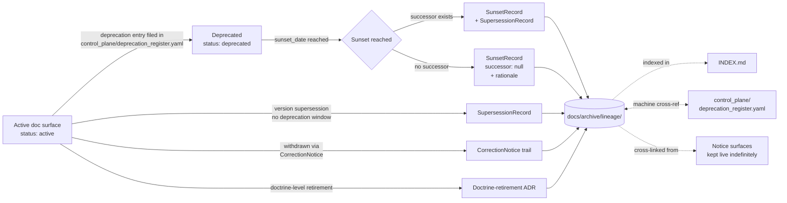

<!-- [KFM_META_BLOCK_V2]
doc_id: kfm://doc/<TODO-uuid>
title: Archived Lineage Records
type: standard
version: v1.1
status: draft
owners:
  primary: Docs steward
  co_authoring: [Release authority, Correction reviewer]
  notes: "Owner roles CONFIRMED per Atlas v1.1 Ch. 24.7.1; specific named individuals are TODO."
created: 2026-05-15
updated: 2026-05-25
policy_label: public
related:
  - docs/doctrine/directory-rules.md
  - docs/doctrine/lifecycle-law.md
  - docs/doctrine/authority-ladder.md
  - docs/doctrine/truth-posture.md
  - docs/doctrine/trust-membrane.md
  - docs/registers/DRIFT_REGISTER.md
  - docs/registers/CANONICAL_LINEAGE_EXPLORATORY.md
  - docs/adr/
  - docs/atlases/
  - docs/archive/exploratory/
  - docs/archive/deprecated/
  - control_plane/deprecation_register.yaml
tags: [kfm, archive, lineage, supersession, deprecation, governance, append-only]
directory_rules_basis:
  - "§6.1 — docs/archive/ explicitly listed with lineage/, exploratory/, deprecated/ sub-areas (CONFIRMED v1.3)."
  - "§14.2 — deprecation register is the machine-side partner at control_plane/deprecation_register.yaml."
  - "§15  — per-root README contract; see §13 of this file."
notes:
  - "Directory placement CONFIRMED via Directory Rules v1.3 §6.1."
  - "Doctrine references in §12 (lifecycle-law, authority-ladder, truth-posture, trust-membrane, directory-rules) are CONFIRMED canonical homes under docs/doctrine/."
  - "Per-doc paths under that root remain NEEDS VERIFICATION against a mounted repo."
  - "Identifier prefixes (KFM-SUP, KFM-SUN, KFM-DR, KFM-COR) remain PROPOSED pending ADR per Directory Rules §2.4(5)."
[/KFM_META_BLOCK_V2] -->

# 🗂 Archived Lineage Records

> Append-only archive of **documentation-surface** supersession trails — the human-readable side of "corrections are first-class." Object-class supersession (EvidenceBundle, Schema, Policy, ReleaseManifest, Atlas) lives **with the object**, not here.


<!-- TODO — replace placeholder Shields targets once the docs CI surface is verified. -->

**Status:** `draft` · **Primary owner:** Docs steward <sub>(role CONFIRMED · person TODO)</sub> · **Co-authoring:** Release authority, Correction reviewer · **Last updated:** `2026-05-25`

> [!IMPORTANT]
> This archive holds **documentary lineage** — the supersession trail between *retired* and *successor* **documentation surfaces** (ADRs, doctrine docs, runbooks, layer specs, governance artifacts). It is **not** the data-lineage store, **not** the evidence store, **not** the bundle registry, **not** the audit-ledger tombstone store, and **not** where active `DeprecationNotice` records live. See [§4 — Exclusions](#4-exclusions--what-does-not) before adding anything here.

---

## Contents

1. [Scope](#1-scope)
2. [Repo fit](#2-repo-fit)
3. [Inputs — what belongs here](#3-inputs--what-belongs-here)
4. [Exclusions — what does not](#4-exclusions--what-does-not)
5. [Directory layout](#5-directory-layout)
6. [Lineage flow (RETIRED → ARCHIVED)](#6-lineage-flow-retired--archived)
7. [Append-only invariant](#7-append-only-invariant)
8. [Record categories](#8-record-categories)
9. [File naming and identifiers](#9-file-naming-and-identifiers)
10. [Authoring workflow](#10-authoring-workflow)
11. [FAQ](#11-faq)
12. [Related docs](#12-related-docs)
13. [Per-root README contract](#13-per-root-readme-contract)
14. [Appendix](#14-appendix)

---

## 1. Scope

This directory is the **canonical home for archived lineage records of documentation surfaces** in the KFM tree. A lineage record is the durable, human-readable artifact that connects a *retired* documentation surface to its *successor* — capturing what was replaced, when, by what, and under whose authority.

The directory exists because KFM's lifecycle law (`docs/doctrine/lifecycle-law.md`) and the deprecation discipline in Directory Rules §14.2 together demand a dedicated archive. Two rules drive the requirement:

1. **Retired documents are not deleted.** They remain at their original paths with a `SUNSET — see successor` banner so anchors and external links continue to resolve. **[CONFIRMED via Directory Rules §14.2 deprecation discipline.]**
2. **Every supersession produces a governed artifact** — a `SupersessionRecord`, a `SunsetRecord`, a doctrine-retirement ADR, or a `CorrectionNotice` chain. Those artifacts must be findable in one place, indexed, and queryable. **[CONFIRMED via Atlas v1.1 Ch. 24.8 "Master Stale-State and Supersession Reference."]**

Without a single canonical archive, supersession trails fragment across `CHANGELOG.md`, individual doc footers, and the ADR log — and the question "what replaced this?" becomes a grep job rather than a lookup.

> [!NOTE]
> **Directory placement** is **CONFIRMED** via Directory Rules v1.3 §6.1, which lists `docs/archive/` with `lineage/`, `exploratory/`, and `deprecated/` as named sub-areas. **Files inside this directory** remain **NEEDS VERIFICATION** until inspected against a mounted repo.

[⬆ Back to top](#-archived-lineage-records)

---

## 2. Repo fit

This directory sits in the documentation tree, downstream of governance and adjacent to (but distinct from) the data-lineage and evidence stores.

| Direction      | Surface                                                       | Relationship                                                                                                  | Status                  |
|----------------|----------------------------------------------------------------|---------------------------------------------------------------------------------------------------------------|-------------------------|
| Upstream       | `docs/doctrine/lifecycle-law.md`                              | Establishes publication as a governed state transition with declared correction/rollback.                     | **CONFIRMED doctrine**  |
| Upstream       | `docs/doctrine/authority-ladder.md`                           | Defines sign-off authority (Docs steward, Release authority, Correction reviewer) for filings here.           | **CONFIRMED doctrine**  |
| Upstream       | `docs/doctrine/truth-posture.md`                              | Defines the cite-or-abstain stance these records preserve.                                                    | **CONFIRMED doctrine**  |
| Upstream       | `docs/doctrine/directory-rules.md` §14.2                       | Defines structural-move discipline; the deprecation entry it requires references back to records here.        | **CONFIRMED via §14.2** |
| Sibling        | `docs/archive/exploratory/`                                   | Archived exploratory work that did not become canon. Distinct from supersession trails for canonical surfaces.| **CONFIRMED via §6.1**  |
| Sibling        | `docs/archive/deprecated/`                                    | Archived content that was deprecated without a successor (collapsed scope, abandoned surface).                | **CONFIRMED via §6.1**  |
| Sibling        | `docs/adr/`                                                   | ADRs that authorize doctrine-level retirements link here from their `Supersession` section.                   | **CONFIRMED via §6.1**  |
| Sibling        | `docs/registers/DRIFT_REGISTER.md`                            | Open drift entries — the **detection** surface; this archive is the **disposition** surface once resolved.    | **CONFIRMED via §14.1** |
| Machine partner| `control_plane/deprecation_register.yaml`                     | Machine-readable deprecation register required by §14.2; cross-links to records here by ID.                   | **CONFIRMED via §14.2** |
| Downstream     | Public notice surfaces                                        | Notice URLs remain live indefinitely; this archive is one of their backing stores.                            | **PROPOSED**            |
| Distinct       | Evidence store (`EvidenceBundle` / `EvidenceRef`)             | Holds *data* provenance, not *documentation* supersession. Different shape, different home.                   | **CONFIRMED — distinct**|
| Distinct       | Bundle registry (per Atlas v1.1 Ch. 24.8.2)                   | EvidenceBundle supersession links live in the bundle registry, not here.                                      | **CONFIRMED — distinct**|
| Distinct       | Audit ledger tombstones (`data/AUDIT/receipts/YYYY/MM/...`)   | Tombstones for revoked runs live in the append-only audit ledger; this archive does not duplicate them.       | **CONFIRMED — distinct**|

> [!WARNING]
> The most common mistake is to treat this directory as a general-purpose archive. It is **not**. It holds *supersession lineage for documentation surfaces*. Object-class supersession (EvidenceBundle, Schema, Policy, ReleaseManifest, AIReceipt, Atlas) lives **with the object** — see [§4 — Exclusions](#4-exclusions--what-does-not) and Atlas v1.1 Ch. 24.8.2.

[⬆ Back to top](#-archived-lineage-records)

---

## 3. Inputs — what belongs here

A record belongs in this archive when **all four** of the following are true:

1. The subject is a **documentation surface** — a doctrine doc, ADR, runbook, layer specification, governance artifact, public-API description doc, or schema documentation page. (Not the schema file itself.)
2. The surface has reached its **sunset date** (per Directory Rules §14.2) **or** has been **superseded** by a newer authoritative version.
3. A governed artifact (`SupersessionRecord`, `SunsetRecord`, doctrine-retirement ADR, or `CorrectionNotice` chain) documents the transition.
4. The successor — if any — has been identified and recorded in the artifact's `successor` field (or `successor: null` with `no_successor_rationale` populated).

The table below summarizes the accepted record shapes. The four shapes are PROPOSED until ratified by an ADR per Directory Rules §2.4(5); the *underlying transitions* they record are CONFIRMED doctrine.

| Record kind             | Produced by                                       | Trigger                                                | Successor field           |
|--------------------------|---------------------------------------------------|--------------------------------------------------------|---------------------------|
| `SupersessionRecord`     | Doc rev-up, ADR rev-up, runbook rev-up           | a newer version replaces an older one                  | `successor_id` (required) |
| `SunsetRecord`           | Sunset of an entry in `deprecation_register.yaml`| a deprecated surface reaches its sunset date           | `successor_id` or `null` + rationale |
| Doctrine-retirement ADR  | Doctrine-level retirements                       | a doctrine doc is folded, withdrawn, or replaced       | linked in ADR body        |
| `CorrectionNotice` trail | Withdrawn / corrected surfaces                   | a surface is withdrawn via the correction pathway      | `replaces_notice` chain   |

> [!TIP]
> If you cannot point to a governed artifact that documents the transition, the record does not belong here yet — it belongs in active governance until that artifact is produced. **A docs-only retirement without a signed-off artifact is not yet a lineage record.**

[⬆ Back to top](#-archived-lineage-records)

---

## 4. Exclusions — what does not

Items below look like they might belong here but do not. Each row gives the correct destination.

| Out of scope                                              | Why                                                                              | Goes instead to                                                          |
|-----------------------------------------------------------|-----------------------------------------------------------------------------------|---------------------------------------------------------------------------|
| The retired document itself                               | Retired docs remain **in place** with a SUNSET banner — they are not moved.       | Original path, with `status: deprecated` in its meta block                |
| Active deprecation entries (pre-sunset)                   | They are still doing work; not yet historical.                                    | `control_plane/deprecation_register.yaml` <sub>CONFIRMED via §14.2</sub>  |
| Object-class supersession (EvidenceBundle, Schema, Policy)| Per Atlas v1.1 Ch. 24.8.2 these live with the object — bundle registry, schema header, ADR + policy file, etc. | Bundle registry / schema header / ADR + policy / version register         |
| Atlas / supplement supersession                           | Per Atlas v1.1 Appendix G precedent, Atlas supersession lives in the Atlas itself as an Appendix. | Inside the Atlas / supplement (e.g., v1.0 App. E, v1.1 App. G)            |
| ReleaseManifest history                                   | Lives in the manifest history + rollback chain.                                   | `release/` history; rollback target chain                                 |
| Data-lineage (PROV-O attestations on data)                | Different shape, different store, different consumers.                            | Provenance store; STAC/DCAT/PROV catalog                                  |
| `EvidenceBundle` / `EvidenceRef` history                  | Governed by evidence doctrine, not by this archive.                               | Bundle registry; evidence store                                           |
| Audit-ledger tombstones (revoked runs)                    | Tombstones are append-only entries in the audit ledger; not doc surfaces.         | `data/AUDIT/receipts/YYYY/MM/...` (per Idea C5-09 tombstone discipline)   |
| AIReceipts                                                | Per Atlas v1.1 Ch. 24.8.2, AIReceipts are **never superseded retroactively** — a new answer is a new receipt with cross-reference. | Two distinct AIReceipts, cross-referenced; not collapsed into a record here. |
| Rollback transcripts of *data* releases                   | Data rollback is a release-plane concern, not a documentation concern.            | `release/` rollback chain; `RollbackCard` + `CorrectionNotice`            |
| Open drift entries                                        | Drift is the *detection* surface, awaiting disposition.                           | `docs/registers/DRIFT_REGISTER.md`                                        |
| ADR working drafts                                        | Drafts live with active ADRs; only the *retirement* trail lands here.             | `docs/adr/` working area                                                  |
| `CHANGELOG.md` entries                                    | The changelog is the *carrier*; the archive holds the *governed artifact*.        | `CHANGELOG.md` stays at repo root                                         |
| AI-generated drafts not yet signed off                    | Per the AI rule, AI is interpretive — no archive identity until promoted.         | Working branches; tracked via `AIReceipt`                                 |

> [!CAUTION]
> Moving a retired doc into this directory **breaks anchors** at its original path and violates the deprecation invariant *"retired docs remain at their paths."* Do not do this even to tidy.

[⬆ Back to top](#-archived-lineage-records)

---

## 5. Directory layout

The top-level placement (`docs/archive/lineage/`) is **CONFIRMED** per Directory Rules v1.3 §6.1. The internal subdirectory structure below is **PROPOSED**; verify against the mounted repo before relying on a specific name.

```text
docs/archive/lineage/
├── README.md                          # this file
├── INDEX.md                           # registry of every record (PROPOSED — generator-driven)
├── supersession-records/              # SupersessionRecord artifacts (PROPOSED layout)
│   └── KFM-SUP-NNNN-<slug>.md
├── sunset-records/                    # SunsetRecord artifacts (post-sunset deprecations)
│   └── KFM-SUN-NNNN-<slug>.md
├── doctrine-retirements/              # ADR-backed doctrine-doc retirements
│   └── KFM-DR-NNNN-<slug>.md          # cross-links to docs/adr/ADR-NNNN-*.md
└── correction-trails/                 # CorrectionNotice chains for withdrawn surfaces
    └── KFM-COR-NNNN-<slug>.md
```

> [!NOTE]
> **Schemas live elsewhere.** Per ADR-0001 the schema home is `schemas/contracts/v1/...`; any JSON Schemas validating the four record shapes (e.g., `supersession_record.schema.json`) live there — not under `docs/archive/lineage/_schemas/`. Co-locating schemas with docs would create a parallel schema home, which is ADR-class per Directory Rules §2.4(5).

> [!NOTE]
> Subdirectory names and identifier prefixes (`KFM-SUP`, `KFM-SUN`, `KFM-DR`, `KFM-COR`) are **PROPOSED**. If the project's existing ADR or Decision-Log numbering subsumes a category (e.g., doctrine retirements via `ADR-NNNN`), collapse the corresponding prefix into a cross-link rather than introducing a new namespace.

[⬆ Back to top](#-archived-lineage-records)

---

## 6. Lineage flow (RETIRED → ARCHIVED)

The diagram shows how a documentation surface moves from **active** to **deprecated** to **archived lineage** — and where each step's governed artifact lives. The KFM pipeline stages `RAW → WORK/QUARANTINE → PROCESSED → CATALOG/TRIPLET → PUBLISHED` are preserved verbatim where they appear.



> [!WARNING]
> The diagram is **conceptual**. The exact surfaces that produce each artifact, the timing of the index write, and whether public notice surfaces are served from this directory or from a separate published surface are **NEEDS VERIFICATION** against the live release pipeline.

[⬆ Back to top](#-archived-lineage-records)

---

## 7. Append-only invariant

> [!IMPORTANT]
> **This directory is append-only.** Records are never edited in place. Corrections to a record are themselves new records (a follow-up `SupersessionRecord` whose `replaces_record` field points at the prior entry). Deletions are never permitted. This mirrors the project-wide append-only audit invariant (per Idea C1-06 audit-ledger discipline and Atlas v1.1 Ch. 24.8 supersession reference).

Concretely:

- A typo in an archived record is fixed by publishing a follow-up record, not by editing the original. **[CONFIRMED via append-only doctrine.]**
- A record whose successor itself gets retired produces a new entry that links forward — the older entries remain, and the chain grows. **[CONFIRMED.]**
- A record cannot be "withdrawn" from the archive. If a supersession decision is reversed, that reversal is itself a new record (`reason: cancellation`, `replaces_record: <original>`). **[CONFIRMED — analogous to Idea C5-09 tombstone discipline.]**
- Anchors inside archived records are stable. Downstream docs and external integrators rely on them remaining resolvable. **[INFERRED — confirm with whoever owns external integrator commitments.]**

Tooling that touches this directory must therefore be **insert-only**. Any tool that issues a `git rm` or an in-place edit against a file under `docs/archive/lineage/` (other than `INDEX.md` regeneration) is in violation of doctrine and should fail CI. **[PROPOSED enforcement; CI rule home NEEDS VERIFICATION.]**

[⬆ Back to top](#-archived-lineage-records)

---

## 8. Record categories

The four accepted record shapes, with their distinguishing tests. Field names use project doctrine spelling.

| Category                  | Distinguishing test                                                                         | Schema home (per ADR-0001)                            |
|---------------------------|---------------------------------------------------------------------------------------------|--------------------------------------------------------|
| **SupersessionRecord**    | A newer version replaces an older one *without* a planned-deprecation window.               | `schemas/contracts/v1/lineage/supersession_record.schema.json` <sub>PROPOSED</sub> |
| **SunsetRecord**          | A deprecated surface has reached its sunset date. Pairs with the `deprecation_register.yaml` entry. | `schemas/contracts/v1/lineage/sunset_record.schema.json` <sub>PROPOSED</sub>     |
| **Doctrine retirement**   | A doctrine-level deprecation has completed; the retirement is ADR-backed.                   | `schemas/contracts/v1/lineage/doctrine_retirement.schema.json` <sub>PROPOSED</sub> |
| **Correction trail**      | A surface was *withdrawn* (not deprecated); the trail chains every `CorrectionNotice`.       | `schemas/contracts/v1/lineage/correction_trail.schema.json` <sub>PROPOSED</sub>  |

> [!TIP]
> If a surface change is hard to classify, the default disposition is **withdrawal** (`CorrectionNotice`), not deprecation — fail-safe-toward-correction. The same defaulting applies here: when in doubt, file a **correction trail**, not a sunset record. **[PROPOSED defaulting rule; confirm against the correction-discipline doctrine when authored.]**

[⬆ Back to top](#-archived-lineage-records)

---

## 9. File naming and identifiers

Identifiers are **stable**, **monotonically allocated**, and **never reused**. The prefix scheme below is **PROPOSED** and would require an ADR to ratify per Directory Rules §2.4(5) (creating a parallel identifier home). If the project's existing ADR / Decision-Log numbering already covers a category, fold into that namespace.

| Kind                     | Prefix (PROPOSED) | Example                                  |
|--------------------------|-------------------|------------------------------------------|
| SupersessionRecord       | `KFM-SUP`         | `KFM-SUP-0042-evidence-bundle-doc-v1-to-v2.md` |
| SunsetRecord             | `KFM-SUN`         | `KFM-SUN-0017-api-v1-claims-doc.md`      |
| Doctrine retirement      | `KFM-DR`          | `KFM-DR-0003-truth-posture-folded.md`    |
| Correction trail         | `KFM-COR`         | `KFM-COR-0009-aerial-imagery-rights.md`  |

```text
<PREFIX>-<NNNN>-<short-kebab-slug>.md
```

> [!NOTE]
> **Open ADR question.** Per Directory Rules §2.4(5), introducing a new identifier family is ADR-class. The four prefixes above are placeholders pending an explicit ADR (working title: *"Documentation-lineage identifier namespace"*). Until then, references to these IDs in commits and PRs should carry the qualifier `(PROPOSED ID, ADR pending)`.

[⬆ Back to top](#-archived-lineage-records)

---

## 10. Authoring workflow

The flow below is **PROPOSED** and consistent with Directory Rules §14.1 (routine moves) and §14.2 (structural moves). Confirm against any existing runbook before treating it as the official path.

1. **The governed artifact is authored upstream** — `DeprecationNotice` entry in `control_plane/deprecation_register.yaml`, `CorrectionNotice`, or ADR — and signed off through the authority ladder (`docs/doctrine/authority-ladder.md`). *This directory does not originate decisions.*
2. **Trigger event** — sunset reached, supersession released, ADR accepted. The responsible role files a new record in the appropriate subdirectory.
3. **Schema validation** — the record validates against its `schemas/contracts/v1/lineage/*.schema.json` (PROPOSED).
4. **Index update** — `INDEX.md` is updated. If `INDEX.md` is generator-driven, the generator runs and the resulting diff is committed. **[Generator does not yet exist — PROPOSED.]**
5. **Machine cross-reference** — the corresponding entry in `control_plane/deprecation_register.yaml` is updated with the new record ID. **[CONFIRMED requirement via §14.2; tooling NEEDS VERIFICATION.]**
6. **CI enforcement** — CI rejects any `git rm` or in-place edit under `docs/archive/lineage/` other than `INDEX.md` regeneration. **[PROPOSED enforcement.]**
7. **Retired-doc footer update** — the retired doc's footer or banner cites the new record by ID. The retired doc itself is **not** moved.
8. **Notice surface refresh** — if the surface had a public notice URL, that URL's payload is regenerated to include the new record's identifier.

**Authority required.** Per Atlas v1.1 Ch. 24.7.2, **correction / rollback** requires *Author / detector + correction reviewer + release authority*, and **atlas / supplement publication** requires *docs steward + at least one subsystem owner*. Lineage record filings inherit the lower bound: **at minimum the Docs steward must sign off**, plus the role whose surface is being retired.

> [!WARNING]
> Step 1 is not optional. A record may not be written to this directory in advance of the governed artifact that authorizes it. Writing a `SunsetRecord` before the deprecation entry reaches its sunset date — or a `SupersessionRecord` before the successor is released — violates the authority ladder.

[⬆ Back to top](#-archived-lineage-records)

---

## 11. FAQ

<details>
<summary><b>Is this where I put the retired doc itself?</b></summary>

No. Retired docs remain at their original paths so anchors and external links continue to resolve. This directory holds the *governed record of the supersession*, not the retired material. See [§4](#4-exclusions--what-does-not).

</details>

<details>
<summary><b>Where does Atlas supersession go?</b></summary>

**Inside the Atlas itself**, as an appendix. The precedent is Atlas v1.0 Appendix E (Supersession and lineage) extended by Atlas v1.1 Appendix G (v1.0 → v1.1 lineage and supersession record). The Atlas pattern is intentional: the Atlas's own lineage chain is part of the artifact, not external to it. Per Atlas v1.1 Ch. 24.8.2, the required lineage artifact for an Atlas / supplement is the *atlas / supplement supersession appendix*, not a file in this directory.

</details>

<details>
<summary><b>Where does data lineage go?</b></summary>

Not here. Data lineage — `EvidenceBundle` / `EvidenceRef` trails, PROV-O attestations on artifacts, rollback transcripts of *data* releases — is governed by the evidence doctrine and lives in the bundle registry, the evidence store, and the audit ledger (`data/AUDIT/receipts/...`). This archive is for the *documentation* side. *EXTERNAL standard referenced for context: [W3C PROV-O](https://www.w3.org/TR/prov-o/).*

</details>

<details>
<summary><b>Where do EvidenceBundle, Schema, Policy, and ReleaseManifest supersessions go?</b></summary>

**With the object itself**, per Atlas v1.1 Ch. 24.8.2:

| Object class                              | Required lineage artifact                                                  |
|-------------------------------------------|-----------------------------------------------------------------------------|
| `SourceDescriptor`                        | Supersession entry in source register.                                      |
| `EvidenceBundle`                          | EvidenceBundle + CorrectionNotice + supersession link.                       |
| `GeographyVersion`                        | Version register entry + crosswalk.                                         |
| Schema (`schemas/contracts/v1/...`)       | ADR + supersession link in schema header.                                   |
| Policy                                    | ADR + supersession link.                                                    |
| `ReleaseManifest`                         | Manifest history + rollback chain.                                          |
| `AIReceipt`                               | Two distinct AIReceipts with cross-reference (never superseded retroactively).|
| Atlas / supplement                        | Atlas / supplement supersession appendix.                                   |

This archive does not duplicate any of those.

</details>

<details>
<summary><b>Can I edit a typo in an archived record?</b></summary>

No. File a follow-up record whose `replaces_record` field points at the original; the original stays in place. The append-only invariant applies even to typos. The follow-up record may set `reason: editorial_correction` so the chain remains readable.

</details>

<details>
<summary><b>Can a deprecation be cancelled after the record is filed?</b></summary>

A *deprecation* can be cancelled before sunset by publishing a follow-up entry in `control_plane/deprecation_register.yaml` with `reason: cancellation` — and in that case **no `SunsetRecord` is ever filed here**. Once a `SunsetRecord` has been filed, the sunset has happened and the record stands. A later "we want this surface back" decision is a *new* surface launch, not an undo. **[PROPOSED — confirm against the deprecation-process runbook when authored.]**

</details>

<details>
<summary><b>What if a record has no successor?</b></summary>

Set `successor: null` and populate `no_successor_rationale` with a clear statement. Common legitimate cases: the surface was experimental and is being abandoned (consider whether the archive lane should be `docs/archive/exploratory/` instead); the surface duplicated another (point to the canonical one); or the underlying source no longer exists.

</details>

<details>
<summary><b>How does this relate to the audit-ledger tombstones?</b></summary>

They are different stores serving different objects. The audit-ledger tombstones (under `data/AUDIT/receipts/YYYY/MM/...`, per Idea C5-09) preserve **run-level** revocations: an emitted run is invalidated, a tombstone receipt is appended pointing at the retracted `run_id`. This archive preserves **documentation-surface** supersessions. A single event can produce both (e.g., a retired runbook that referenced a now-tombstoned run); the two artifacts cross-reference but neither subsumes the other.

</details>

<details>
<summary><b>Can AI write entries here?</b></summary>

AI may **draft** record prose, summarize the supersession context, and suggest the successor link. AI may **not** decide that a record belongs here, set the identifier, sign off on the filing, or modify an existing record. Per the operating contract, AI is interpretive — never the root truth source. The draft is preserved as an `AIReceipt` attached to the filing.

</details>

<details>
<summary><b>Why not put this under <code>docs/governance/</code> or <code>control_plane/</code>?</b></summary>

Governance docs (under `docs/governance/`) *direct* lineage decisions; this archive *holds* their outcomes. The machine-readable register (`control_plane/deprecation_register.yaml`) is the *active* machine state; this archive is the *historical* human-readable surface. Keeping the active governance docs, the machine register, and the historical archive in distinct homes prevents any one of them from being polluted by another's scope. **[CONFIRMED via Directory Rules v1.3 §6.1 + §14.2.]**

</details>

[⬆ Back to top](#-archived-lineage-records)

---

## 12. Related docs

The paths below cite Directory Rules v1.3 §6.1 placements. Per-doc paths under `docs/doctrine/` are CONFIRMED canonical homes; the **presence** of every specific file in a mounted repo remains NEEDS VERIFICATION.

**Doctrine (canonical homes CONFIRMED via Directory Rules v1.3 §6.1):**

- [`docs/doctrine/directory-rules.md`](../../doctrine/directory-rules.md) — placement law; §6.1 names this directory; §14.2 names the deprecation register.
- [`docs/doctrine/lifecycle-law.md`](../../doctrine/lifecycle-law.md) — publication lifecycle and the correction/rollback requirement.
- [`docs/doctrine/authority-ladder.md`](../../doctrine/authority-ladder.md) — sign-off authority for filings under each record category.
- [`docs/doctrine/truth-posture.md`](../../doctrine/truth-posture.md) — cite-or-abstain stance these records preserve.
- [`docs/doctrine/trust-membrane.md`](../../doctrine/trust-membrane.md) — public-surface boundary; notice URLs and this archive sit on the public side.

**Registers and machine partners:**

- [`docs/registers/DRIFT_REGISTER.md`](../../registers/DRIFT_REGISTER.md) — the *detection* surface for placement/governance drift; resolution may produce a record here.
- [`docs/registers/CANONICAL_LINEAGE_EXPLORATORY.md`](../../registers/CANONICAL_LINEAGE_EXPLORATORY.md) — classification register that decides whether material is canonical, lineage, or exploratory.
- [`control_plane/deprecation_register.yaml`](../../../control_plane/deprecation_register.yaml) — machine-readable deprecation register (Directory Rules §14.2).
- [`docs/adr/`](../../adr/) — ADRs backing doctrine-level retirements.
- [`docs/atlases/`](../../atlases/) — Atlas / supplement supersession lives in-document per Atlas v1.1 App. G precedent (NOT in this archive).

**Sibling archive lanes (Directory Rules §6.1):**

- [`docs/archive/exploratory/`](../exploratory/) — superseded exploratory work that did not become canon.
- [`docs/archive/deprecated/`](../deprecated/) — archived content deprecated without a successor.

**External standards (context only):**

- *EXTERNAL* — [W3C PROV-O](https://www.w3.org/TR/prov-o/) — referenced for the *data* vs *documentation* lineage distinction.
- *EXTERNAL* — [SLSA provenance](https://slsa.dev/) — referenced by the audit-ledger discipline this archive does not duplicate.

> [!NOTE]
> Related-doc **paths** are CONFIRMED via Directory Rules §6.1; per-doc **presence** in the mounted repo remains NEEDS VERIFICATION. Missing files should leave the link in place and add a `NEEDS VERIFICATION` annotation rather than removing it — the missing link itself is useful navigation.

[⬆ Back to top](#-archived-lineage-records)

---

## 13. Per-root README contract

Directory Rules §15 requires every canonical root and compatibility root to carry a `README.md` answering a fixed set of questions in order. This section instantiates that contract for `docs/archive/lineage/`.

| Field | Value |
|---|---|
| **Purpose** | Append-only canonical archive of supersession lineage records for KFM **documentation surfaces** (ADRs, doctrine docs, runbooks, layer specs, governance artifacts). |
| **Authority level** | **archive** (per Directory Rules §6.1 list `docs/archive/{lineage,exploratory,deprecated}`). |
| **Status** | `PROPOSED` for this README; `CONFIRMED` for the directory's place in the canonical tree. |
| **What belongs here** | `SupersessionRecord`, `SunsetRecord`, doctrine-retirement ADR references, `CorrectionNotice` trails — see §3 and §8. |
| **What does NOT belong here** | Retired docs themselves; object-class supersessions (live with the object per Atlas v1.1 Ch. 24.8.2); audit-ledger tombstones; data-lineage / PROV-O attestations; active deprecation entries — see §4. |
| **Inputs** | Sign-off from the authority ladder upstream: `control_plane/deprecation_register.yaml` entries at sunset; ADR acceptances; correction-pathway withdrawals. |
| **Outputs** | A discoverable, indexed, append-only lineage chain for every retired documentation surface. Cross-referenced by ID from `control_plane/deprecation_register.yaml` and from the retired docs' SUNSET banners. |
| **Validation** | Schema check against `schemas/contracts/v1/lineage/*.schema.json` (PROPOSED); append-only CI rule (PROPOSED); `INDEX.md` regeneration check (PROPOSED). |
| **Review burden** | Docs steward (primary) + the role whose surface is being retired. Sensitive-lane retirements add Correction reviewer + Release authority per Atlas v1.1 Ch. 24.7.2. |
| **Related folders** | `docs/adr/`, `docs/registers/`, `docs/archive/exploratory/`, `docs/archive/deprecated/`, `control_plane/`, `docs/atlases/`. |
| **ADRs** | ADR-pending — *Documentation-lineage identifier namespace* (per Directory Rules §2.4(5)). Cross-link to `docs/adr/ADR-0001-schema-home.md` for the schema-home rule applied here. |
| **Last reviewed** | `2026-05-25` |

[⬆ Back to top](#-archived-lineage-records)

---

## 14. Appendix

<details>
<summary><b>Glossary (project-doctrine terms used in this file)</b></summary>

| Term                                                                       | Meaning in this document                                                                                            |
|----------------------------------------------------------------------------|---------------------------------------------------------------------------------------------------------------------|
| `RAW`, `WORK`, `QUARANTINE`, `PROCESSED`, `CATALOG`, `TRIPLET`, `PUBLISHED` | KFM pipeline stages, used as written in project doctrine (Directory Rules §0, lifecycle-law).                       |
| `EvidenceBundle`                                                           | Doctrine-level KFM concept; the container of `EvidenceRef` entries for an item. Supersessions live in the bundle registry. |
| `EvidenceRef`                                                              | Doctrine-level KFM concept; a single provenance entry inside an `EvidenceBundle`.                                    |
| `SupersessionRecord`                                                       | Governed artifact filed here when a newer doc-surface version replaces an older one without a deprecation window.    |
| `SunsetRecord`                                                             | Governed artifact filed here when a deprecated surface reaches its sunset date.                                      |
| `CorrectionNotice`                                                         | Governed artifact published when a surface is withdrawn or corrected (per Atlas v1.1 Ch. 24.6.1 correction transition). |
| `RollbackCard`                                                             | Governed artifact attached to every `PUBLISHED` release as a rollback target (per Atlas v1.1 Ch. 24.6.1).             |
| `AIReceipt`                                                                | Provenance entry attached to any AI-drafted artifact. Never superseded retroactively (Atlas v1.1 Ch. 24.8.2).         |
| `ReleaseManifest`                                                          | Governed artifact issued by Release authority for every PUBLISHED transition (Atlas v1.1 Ch. 24.7.1).                 |
| Authority ladder                                                           | KFM's role-based sign-off ordering (Docs steward, Release authority, Correction reviewer, Sensitivity reviewer, Rights-holder rep, Source steward, Domain steward, AI surface steward). |
| Deprecation register                                                       | Machine-readable register at `control_plane/deprecation_register.yaml`; required by Directory Rules §14.2.            |
| Drift register                                                             | Detection surface at `docs/registers/DRIFT_REGISTER.md`; bridges repo state and doctrine.                            |

</details>

<details>
<summary><b>What this document does not establish</b></summary>

- It does not establish any path, module name, route, schema file, or test as **present** in a mounted repository.
- It does not override the project's lifecycle, authority-ladder, or trust-membrane doctrines on any point.
- It does not authorize any retirement or supersession on its own — the authority for those decisions lives in the upstream governance artifacts.
- It does not commit to any specific identifier scheme (`KFM-SUP`, `KFM-SUN`, `KFM-DR`, `KFM-COR`) over the project's existing numbering; the scheme remains PROPOSED pending ADR per Directory Rules §2.4(5).
- It does not subsume object-class supersession (EvidenceBundle, Schema, Policy, ReleaseManifest, AIReceipt, Atlas), which lives with the object per Atlas v1.1 Ch. 24.8.2.

</details>

<details>
<summary><b>Open verification items</b></summary>

1. Confirm `docs/archive/lineage/` is present in the mounted repo (placement is CONFIRMED via Directory Rules §6.1; **presence** is NEEDS VERIFICATION).
2. Confirm the four record categories (supersession / sunset / doctrine retirement / correction trail) match the project's existing taxonomy.
3. Confirm whether `INDEX.md` is hand-maintained or generator-driven, and if generator-driven, where the generator lives (probably `tools/qa/` or `tools/registers/`).
4. **Open ADR (per Directory Rules §2.4(5)):** Documentation-lineage identifier namespace — adopt `KFM-SUP` / `KFM-SUN` / `KFM-DR` / `KFM-COR`, or fold into existing schemes (e.g., `ADR-NNNN`).
5. Confirm the JSON Schemas for the four record shapes are authored at `schemas/contracts/v1/lineage/` (per ADR-0001).
6. Confirm whether public notice surfaces are served from this directory or from a separate published surface.
7. Confirm the CI enforcement of the append-only invariant — workflow path, rule home, and bypass discipline for `INDEX.md` regeneration.
8. Identify named owners and replace the TODO line in the meta block.
9. Confirm the cross-reference convention between records here and entries in `control_plane/deprecation_register.yaml`.
10. Confirm whether `docs/governance/deprecation-process.md` and `docs/doctrine/corrections-first-class.md` (referenced in the original v1 of this README) are the canonical homes for the corresponding doctrines, or whether those doctrines are folded into existing files (`directory-rules.md` §14, `lifecycle-law.md`).

</details>

<details>
<summary><b>v1 → v1.1 changelog (this README)</b></summary>

- **Status upgrades.** Directory placement promoted from INFERRED to CONFIRMED via Directory Rules v1.3 §6.1. Doctrine references in §12 promoted to CONFIRMED canonical homes under `docs/doctrine/`.
- **Owner specificity.** Generic "TODO" owners replaced with concrete authority-ladder roles (Docs steward primary; Release authority + Correction reviewer co-authoring) per Atlas v1.1 Ch. 24.7.1.
- **Terminology fix.** `RollbackPlan` corrected to `RollbackCard` per Atlas v1.1 Ch. 24.6.1 and Ch. 24.7.1.
- **Object-class scoping.** Added explicit FAQ and Exclusions rows clarifying that EvidenceBundle / Schema / Policy / ReleaseManifest / AIReceipt / Atlas supersessions live **with the object** per Atlas v1.1 Ch. 24.8.2 — not here.
- **Atlas precedent.** Added explicit reference to Atlas v1.0 Appendix E + v1.1 Appendix G as the in-document supersession pattern for atlases / supplements.
- **Machine partner.** Added `control_plane/deprecation_register.yaml` as the machine-readable register per Directory Rules §14.2, with cross-references throughout.
- **Audit-ledger distinction.** Added FAQ row and Exclusions row distinguishing this archive from audit-ledger tombstones (`data/AUDIT/receipts/...`, per Idea C5-09).
- **Schema home.** Removed proposed `_schemas/` subdirectory; per ADR-0001 schemas for record shapes live at `schemas/contracts/v1/lineage/`, not co-located here.
- **Per-root README Contract.** New §13 instantiates the Directory Rules §15 README contract template.
- **Identifier ADR flag.** Made explicit that the `KFM-SUP` / `KFM-SUN` / `KFM-DR` / `KFM-COR` namespace introduction is ADR-class per Directory Rules §2.4(5).

</details>

[⬆ Back to top](#-archived-lineage-records)

---

**Related:** [Directory Rules](../../doctrine/directory-rules.md) · [Lifecycle Law](../../doctrine/lifecycle-law.md) · [Authority Ladder](../../doctrine/authority-ladder.md) · [Drift Register](../../registers/DRIFT_REGISTER.md) · [Deprecation Register (machine)](../../../control_plane/deprecation_register.yaml)
**Last updated:** 2026-05-25
[⬆ Back to top](#-archived-lineage-records)
