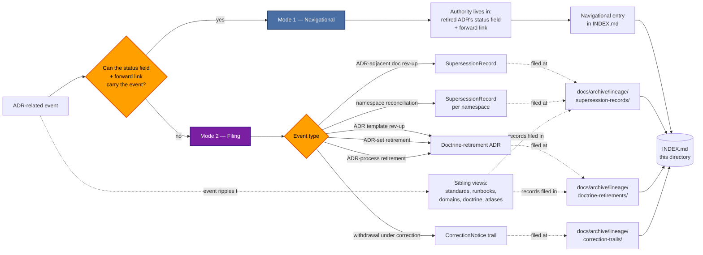

<!-- [KFM_META_BLOCK_V2]
doc_id: kfm://doc/<TODO-uuid>
title: Archived Lineage — Architecture Decision Records (ADRs)
type: standard
version: v1
status: draft
owners:
  primary: Docs steward
  co_authoring: [subsystem owner relevant to ADR subject, Release authority (if public-surface scope), Correction reviewer (if correction-trail)]
  notes: "Roles CONFIRMED per Atlas v1.1 Ch. 24.7.1. Docs steward owns 'ADR index' per the same chapter. Per Atlas Ch. 24.7.2, ADR acceptance requires at least one subsystem owner beyond the author."
created: 2026-05-25
updated: 2026-05-25
policy_label: public
related:
  - docs/archive/lineage/README.md
  - docs/archive/lineage/standards/README.md
  - docs/archive/lineage/runbooks/README.md
  - docs/archive/lineage/domains/README.md
  - docs/archive/lineage/doctrine/README.md
  - docs/archive/lineage/atlases/README.md
  - docs/adr/
  - docs/doctrine/directory-rules.md
  - docs/registers/DRIFT_REGISTER.md
  - control_plane/deprecation_register.yaml
tags: [kfm, archive, lineage, adr, supersession, navigational, dual-mode, reflexive, authority-source]
subject_taxonomy:
  adr_namespaces:
    - name: main
      pattern: "ADR-NNNN"
      status: CONFIRMED in use
      confirmed_authored: [ADR-0001, ADR-0003]
    - name: atlas-backlog
      pattern: "ADR-S-NN"
      status: PROPOSED (Atlas Ch. 24.12)
      open_items: [ADR-S-01, ADR-S-02, ADR-S-03, ADR-S-04, ADR-S-05, ADR-S-06, ADR-S-07, ADR-S-08, ADR-S-09, ADR-S-10, ADR-S-11, ADR-S-12, ADR-S-13, ADR-S-14, ADR-S-15]
    - name: doctrine-synthesis-backlog
      pattern: "ADR-S-NN (CONFLICTING mapping)"
      status: PROPOSED (Doctrine Synthesis §49) — conflicts with atlas-backlog
      conflict: "Same ADR-S-NN identifiers used for different topics"
    - name: sub-typed
      pattern: "ADR-S-XX-NN (e.g., ADR-S-FIN-01)"
      status: PROPOSED (Doctrine Synthesis OPEN-VR-14)
      open_items: [ADR-S-FIN-01]
    - name: open-dr
      pattern: "OPEN-DR-NN"
      status: PROPOSED (Directory Rules §18)
      open_items: [OPEN-DR-01, OPEN-DR-02, OPEN-DR-03, OPEN-DR-04, OPEN-DR-05, OPEN-DR-06, OPEN-DR-07, OPEN-DR-08, OPEN-DR-09, OPEN-DR-10]
directory_rules_basis:
  - "§2.1   — Authority order: accepted ADRs that explicitly amend Directory Rules are layer 2 (just below KFM core invariants)."
  - "§2.4   — ADR template (id/title/status/date/context/decision/consequences/alternatives) and the rule: 'Superseded ADRs MUST be retained with status: superseded and a forward link.'"
  - "§6.1   — docs/archive/{lineage,exploratory,deprecated} sub-areas (CONFIRMED v1.3)."
  - "§18    — OPEN-DR-01 through OPEN-DR-10 open questions that will produce ADRs on resolution."
  - "Atlas v1.1 Ch. 24.7.2 — ADR acceptance: at least one subsystem owner beyond the author."
  - "Atlas v1.1 Ch. 24.11.5 — ADR completeness governance health indicator (100% for Directory Rules §2.4 cases)."
  - "Atlas v1.1 Ch. 24.12 — Open-ADR Backlog (ADR-S-01..15)."
  - "Doctrine Synthesis §49 — alternate ADR-S backlog mapping (CONFLICTING with Atlas Ch. 24.12)."
notes:
  - "The subfolder 'adr/' under docs/archive/lineage/ is a PROPOSED domain-segmented view, NEEDS VERIFICATION against ADR."
  - "DUAL-MODE INDEX: navigational entries point at ADRs with status: superseded; filing entries cross-reference records in parent category lanes."
  - "ADR internal supersession is ALWAYS in-document via the status field; this view never duplicates the in-ADR forward link."
  - "REFLEXIVE: ADRs are the authority for retirements in every sibling view, including this one's own existence. See §1."
  - "CONFIRMED conflict between Atlas Ch. 24.12 and Doctrine Synthesis §49 ADR-S-NN mappings — a near-term lineage candidate; see §8 worked example."
[/KFM_META_BLOCK_V2] -->

# ⚖ Archived Lineage — Architecture Decision Records (ADRs)

> **Dual-mode reflexive view**: a navigational index pointing OUT to ADRs marked `status: superseded` in `docs/adr/`, **and** a true filing surface for the narrow set of ADR-adjacent events the `status` field cannot capture. The view is reflexive because **ADRs are the authority for retirements in every other sibling view**.


<!-- TODO — replace placeholder Shields targets once the docs CI surface is verified. -->

**Status:** `draft` · **Primary owner:** Docs steward <sub>(role CONFIRMED · person TODO)</sub> · **Co-authoring:** subsystem owner relevant to ADR subject, Release authority (if public-surface scope), Correction reviewer (if correction-trail) · **Last updated:** `2026-05-25`

> [!IMPORTANT]
> This directory is a **curatorial view**, not a parallel filing surface. ADR files themselves remain at `docs/adr/` per Directory Rules §6.1. Records about ADR-adjacent retirements (Mode 2) are **filed** in the parent's record-category lanes — `docs/archive/lineage/{supersession-records,sunset-records,doctrine-retirements,correction-trails}/`. This `adr/` subdirectory holds **only** a README, a dual-mode `INDEX.md`, and cross-references. Filing a record directly here creates parallel authority (Directory Rules §2.4(5)) and is **prohibited**.

> [!CAUTION]
> **ADR internal supersession is OUT OF SCOPE.** Per Directory Rules §2.4, "Superseded ADRs MUST be retained with `status: superseded` and a forward link to the replacing ADR." The `status` field IS the in-document supersession primitive for ADRs — the same way Atlas App. E/G is for atlases. **This view never duplicates the in-ADR forward link.** See §4.

> [!WARNING]
> **REFLEXIVE AUTHORITY.** ADRs are the authority for retirement events in **every** sibling view — `standards/`, `runbooks/`, `domains/`, `doctrine/`, `atlases/`, and this view. The parent-archive identifier-namespace question is itself an open ADR. When **this view's** governing ADR lands, the record of that landing belongs here. The recursion is intentional and well-defined; see §1 and §12.

---

## Contents

1. [Scope](#1-scope)
2. [Repo fit](#2-repo-fit)
3. [Inputs — what this view indexes](#3-inputs--what-this-view-indexes)
4. [Exclusions — what does not belong here](#4-exclusions--what-does-not-belong-here)
5. [Directory layout](#5-directory-layout)
6. [Index ↔ category mapping (dual-mode)](#6-index--category-mapping-dual-mode)
7. [Subject-curation flow](#7-subject-curation-flow)
8. [Worked example — ADR-0001 hypothetical + namespace reconciliation](#8-worked-example--adr-0001-hypothetical--namespace-reconciliation)
9. [Tracked ADRs and lineage candidates](#9-tracked-adrs-and-lineage-candidates)
10. [Authoring workflow](#10-authoring-workflow)
11. [ADR status-field vs filing-entry interaction](#11-adr-status-field-vs-filing-entry-interaction)
12. [FAQ](#12-faq)
13. [Related docs](#13-related-docs)
14. [Per-root README contract](#14-per-root-readme-contract)
15. [Appendix](#15-appendix)

---

## 1. Scope

This directory provides a **dual-mode subject-curated view** of supersession lineage for **Architecture Decision Records** under `docs/adr/`. It exists because:

- ADRs sit near the **top of the authority order** (Directory Rules §2.1, layer 2 — just below KFM core invariants and doctrine). They are the authoritative ratification mechanism for every structural change. **[CONFIRMED via Directory Rules v1.3 §2.1.]**
- ADRs **are the authority for retirements** in every other sibling view. The parent archive's record categories (`KFM-SUP-*`, `KFM-SUN-*`, `KFM-DR-*`, `KFM-COR-*`) all reference ADRs as the upstream governance step that justifies a record. This makes the lineage of ADRs themselves a foundational subject. **[CONFIRMED via parent README §8 + Directory Rules §2.4.]**
- ADRs have a **built-in supersession primitive**: the `status: superseded` field and mandatory forward link per Directory Rules §2.4. This is the in-document equivalent of Atlas Appendix G or a doctrine-doc §-changelog. Routine ADR supersession is solved by that primitive — but **edge cases exist** (ADR-adjacent doc retirements, ADR-set retirements, numbering-scheme reconciliations, ADR-process changes) that the `status` field cannot capture. **[CONFIRMED via Directory Rules v1.3 §2.4.]**
- KFM has **at least five ADR namespaces in tension** — `ADR-NNNN` (main), `ADR-S-NN` (Atlas Open-ADR Backlog), the conflicting Doctrine Synthesis backlog mapping, sub-typed `ADR-S-XX-NN`, and `OPEN-DR-NN` from Directory Rules §18. Reconciling these is itself an ADR-class event that will produce records here. **[CONFIRMED via Atlas Ch. 24.12 + Doctrine Synthesis §49 + Directory Rules §18.]**

The directory is **navigational and selectively filing**. ADR internal authority always remains with the ADR itself; this view never overrides it.

> [!NOTE]
> **Status.** The placement of `docs/archive/` with `lineage/`, `exploratory/`, `deprecated/` sub-areas is **CONFIRMED** via Directory Rules v1.3 §6.1. The **subject-segmented sub-lane `adr/`** is **PROPOSED**. The **dual-mode INDEX framing** is **PROPOSED** pending the resolution of the parent-archive identifier-namespace ADR. **The recursion is intentional**: that very ADR, when it lands, gets a navigational entry HERE.

[⬆ Back to top](#-archived-lineage--architecture-decision-records-adrs)

---

## 2. Repo fit

This subfolder is a curated reflexive lens. It sits **inside** the documentation-surface lineage archive and points outward to active ADRs (where the `status` field carries lineage), to the parent category lanes (where edge-case records live), and to **every sibling view** (which cite ADRs as their authority source).

| Direction       | Surface                                                              | Relationship                                                                                                              | Status                  |
|-----------------|----------------------------------------------------------------------|---------------------------------------------------------------------------------------------------------------------------|-------------------------|
| Parent          | [`docs/archive/lineage/README.md`](../README.md)                     | Defines record categories and append-only invariant. This view inherits both, with the dual-mode + reflexive extensions.   | **CONFIRMED**           |
| Subject source  | [`docs/adr/`](../../../adr/)                                          | Active ADRs landing. Subject material of every entry indexed here.                                                          | **CONFIRMED home per §6.1** |
| In-ADR primitive | Each ADR's `status` field + forward link                            | The **authoritative location** for ADR internal supersession per Directory Rules §2.4. **Navigational entries here point at these.** | **CONFIRMED authority** |
| Filing lanes    | `docs/archive/lineage/{supersession-records,sunset-records,doctrine-retirements,correction-trails}/` | Where Mode 2 filing-entry records actually live. Navigational entries have no record file in these lanes.                   | **PROPOSED**            |
| Sibling views (downstream) | [`standards/`](../standards/) · [`runbooks/`](../runbooks/) · [`domains/`](../domains/) · [`doctrine/`](../doctrine/) · [`atlases/`](../atlases/) | The five other subject views. **All of them cite ADRs as their authority source.** When an ADR resolves and produces records in those views, this view's INDEX points at the resolving ADR. | **AUTHORED**            |
| Machine partner | [`control_plane/deprecation_register.yaml`](../../../../control_plane/deprecation_register.yaml) | Machine-readable register (Directory Rules §14.2). ADR-adjacent deprecation entries map here.                              | **CONFIRMED via §14.2** |
| Drift detector  | [`docs/registers/DRIFT_REGISTER.md`](../../../registers/DRIFT_REGISTER.md) | Open drift entries that an ADR resolves get linked here when the ADR is accepted.                                          | **CONFIRMED via §14.1** |
| Governance health | Atlas v1.1 Ch. 24.11.5 ("ADR completeness")                        | This view's coverage is a direct input to the "ADR completeness" governance health indicator. Target: 100% for Directory Rules §2.4 cases. | **CONFIRMED indicator** |
| Distinct        | Individual ADR files (e.g., `docs/adr/ADR-0001-schema-home.md`)      | The retired ADR remains at its `docs/adr/` path with `status: superseded` and a forward link. **Never moved here.**         | **CONFIRMED — distinct**|

[⬆ Back to top](#-archived-lineage--architecture-decision-records-adrs)

---

## 3. Inputs — what this view indexes

This view operates in two modes, mirroring the `atlases/` sibling but with the `status` field as the in-document primitive instead of an in-document appendix.

### Mode 1 — Navigational entries (no record file; pointer to in-ADR `status: superseded`)

| Entry class                              | Example                                                                                              | What `INDEX.md` records                                                  |
|------------------------------------------|-------------------------------------------------------------------------------------------------------|---------------------------------------------------------------------------|
| **Routine ADR supersession**             | A future ADR-NNNN supersedes ADR-0001 (schema home); ADR-0001 gets `status: superseded` + forward link. | `entry_type: navigational` + `adr_id: ADR-0001` + `superseded_by_adr: ADR-NNNN` |
| **Rejected ADR**                         | An ADR is reviewed and rejected; `status: rejected` is set; no successor.                              | `entry_type: navigational` + `adr_status_at_event: rejected` + `successor_id: null` + `no_successor_rationale` |
| **Withdrawal during draft**              | A `status: proposed` ADR is withdrawn before acceptance; status field updated.                          | `entry_type: navigational` + `adr_status_at_event: withdrawn` + brief rationale |

### Mode 2 — Filing entries (true record in parent category lane)

| Entry class                              | Example                                                                                              | Likely record category                |
|------------------------------------------|-------------------------------------------------------------------------------------------------------|----------------------------------------|
| **ADR-adjacent doc retirement**          | `docs/adr/README.md` or `docs/adr/INDEX.md` rev-up with major scope change; prior surface retired.    | `SupersessionRecord`                  |
| **ADR template rev-up**                  | The ADR template fields enumerated in Directory Rules §2.4 are revised (e.g., a new mandatory field). | Doctrine-retirement ADR (because the template is doctrine-level) |
| **Numbering-scheme reconciliation**      | Atlas Ch. 24.12 `ADR-S-NN` and Doctrine Synthesis §49 `ADR-S-NN` conflict resolved by unifying or splitting namespaces. | `SupersessionRecord` per affected namespace |
| **ADR-set retirement**                   | An entire ADR family is retired (e.g., the entire `ADR-S-NN` Atlas backlog folded into the main `ADR-NNNN` sequence). | Doctrine-retirement ADR + per-namespace `SupersessionRecord` |
| **ADR-process retirement**               | The ADR-acceptance process itself is revised (e.g., changing required co-signers per Atlas Ch. 24.7.2). | Doctrine-retirement ADR               |
| **Withdrawal under correction**          | An ADR is withdrawn because its decision was materially wrong (extreme; the resulting downstream rollback is the broader event). | `CorrectionNotice` trail              |

### The discriminating test

> **Can the lineage event be fully captured by setting the affected ADR's `status` field and adding a forward link?**
>
> - **Yes** → Mode 1 (navigational).
> - **No** → Mode 2 (filing), with a written justification in the record file.

The discriminating test is the dividing line between Mode 1 and Mode 2.

> [!TIP]
> **Default to Mode 1.** Directory Rules §2.4 mandates `status: superseded` + forward link for every ADR supersession. Mode 2 is for events that touch the ADR ecosystem (template, namespaces, process, adjacent docs) but don't fit inside any single ADR's `status` field.

[⬆ Back to top](#-archived-lineage--architecture-decision-records-adrs)

---

## 4. Exclusions — what does not belong here

| Out of scope                                                          | Why                                                                              | Goes instead to                                                          |
|-----------------------------------------------------------------------|-----------------------------------------------------------------------------------|---------------------------------------------------------------------------|
| **Routine ADR `status` transitions** (e.g., `proposed` → `accepted`)  | The `status` field IS the lineage record for ADR lifecycle. Routine transitions need no archive entry. | Inside the ADR itself (`status` field; `date` field).                    |
| **In-ADR forward links** (e.g., ADR-0001 → ADR-NNNN supersession)     | Per Directory Rules §2.4, this is mandatory in-document. This view points AT the in-ADR link, never duplicates it. | Inside the retired ADR (forward-link clause).                            |
| **The retired ADR itself**                                            | Retired ADRs remain at their `docs/adr/` path with `status: superseded`. Never moved here. | Original path under `docs/adr/`.                                         |
| **The actual record file** (`KFM-SUP-NNNN-*.md`, etc.)                | Records live in the parent's category lanes; filing here creates parallel authority. | `docs/archive/lineage/<category>/KFM-<PREFIX>-NNNN-<slug>.md`            |
| **Per-doc retirements** in sibling-view scope                         | Those go to the appropriate sibling view (`standards/`, `runbooks/`, `domains/`, `doctrine/`, `atlases/`). The ADR that drove the retirement may be referenced here, but the *doc* retirement record is filed via the sibling. | Sibling subject view's `INDEX.md`                                        |
| **Active deprecation entries** (pre-sunset)                           | Still doing governance work; not yet historical.                                  | `control_plane/deprecation_register.yaml`                                |
| **Schema / contract / policy supersession**                           | Per Atlas Ch. 24.8.2, schemas use in-header pattern; policies use ADR + link.     | Schema header + ADR; policy file + ADR                                   |
| **Open `DRIFT_REGISTER.md` entries**                                  | Drift is detection-stage; not yet an ADR acceptance.                              | `docs/registers/DRIFT_REGISTER.md`                                       |
| **Open `OPEN-DR-NN` items** (Directory Rules §18) not yet resolved    | These are open *questions* not yet ADR-class actions. They go into drift / backlog until an ADR is drafted. | Directory Rules §18 / DRIFT_REGISTER                                     |
| **Open `OPEN-VR-NN` items** (Doctrine Synthesis verification backlog) | These are verification questions, not retirement events.                          | Doctrine Synthesis §48 verification register                              |
| **ADR working drafts**                                                | Drafts at `status: proposed` are active governance work, not retirements.         | `docs/adr/` working area                                                  |
| **AI-generated retirement proposals**                                 | Drafts have no archive identity until promoted via authority ladder.              | Working branches; tracked via `AIReceipt`                                |

> [!CAUTION]
> **The §2.4 mandate is the load-bearing rule for this view.** "Superseded ADRs MUST be retained with `status: superseded` and a forward link" is non-negotiable per Directory Rules. This view's Mode 2 filing surface is a **narrow exception** for events the `status` field cannot carry. The default disposition for any ADR supersession is: set `status: superseded` on the retired ADR, add the forward link, and add a Mode 1 navigational entry here pointing at it.

[⬆ Back to top](#-archived-lineage--architecture-decision-records-adrs)

---

## 5. Directory layout

The subfolder is **PROPOSED**; its placement under `docs/archive/lineage/` inherits the CONFIRMED parent path (Directory Rules §6.1) but the subject-segmented sub-lane itself awaits ADR ratification. The layout is intentionally minimal — this is a view, not a filing surface.

```text
docs/archive/lineage/adr/
├── README.md          # this file
└── INDEX.md           # dual-mode cross-listing (PROPOSED — generator-driven)
                       #   - navigational entries: point at ADRs with status: superseded/rejected/withdrawn
                       #   - filing entries: cross-reference records in parent category lanes
```

For Mode 2 filing entries, the records themselves remain at:

```text
docs/archive/lineage/
├── supersession-records/KFM-SUP-NNNN-<slug>.md
├── sunset-records/KFM-SUN-NNNN-<slug>.md
├── doctrine-retirements/KFM-DR-NNNN-<slug>.md
└── correction-trails/KFM-COR-NNNN-<slug>.md
```

For Mode 1 navigational entries, the **authority lives inside the ADR itself**:

```text
docs/adr/
├── ADR-0001-schema-home.md                       # status: accepted (CONFIRMED authored)
├── ADR-0003-policy-singular-is-canonical.md      # status: accepted (CONFIRMED authored)
├── README.md                                      # ADR index (NEEDS VERIFICATION)
└── (future ADRs — main ADR-NNNN + ADR-S-NN backlog resolutions)
```

> [!NOTE]
> ADR file presence under `docs/adr/` is **PROPOSED**: ADR-0001 (schema home) is CONFIRMED authored per Directory Rules §2.4(3) cross-references and Atlas Ch. 24.1.3. ADR-0003 (policy singular is canonical) is CONFIRMED authored. Other ADRs (ADR-0002, the full ADR-S-NN backlog) are PROPOSED / pending. Mounted-repo presence remains NEEDS VERIFICATION.

[⬆ Back to top](#-archived-lineage--architecture-decision-records-adrs)

---

## 6. Index ↔ category mapping (dual-mode)

`INDEX.md` is the only durable artifact in this directory besides the README. The schema below extends the parent schema with **six ADR-specific columns**, including the critical `entry_type` discriminator.

| INDEX column                  | Source                                              | Notes                                                                                       |
|--------------------------------|-----------------------------------------------------|----------------------------------------------------------------------------------------------|
| `entry_type`                  | **MANDATORY** — `navigational` or `filing`         | Discriminates the two modes. Drives which other columns are required.                       |
| `adr_id`                      | **MANDATORY** *(ADR-specific)*                     | The ADR identifier — e.g., `ADR-0001`, `ADR-0003`, `ADR-S-15`, `ADR-S-FIN-01`.               |
| `adr_namespace`               | Subject taxonomy *(ADR-specific)*                  | `main` (`ADR-NNNN`) · `atlas-backlog` (`ADR-S-NN`) · `doctrine-synthesis-backlog` (CONFLICTING `ADR-S-NN`) · `sub-typed` (`ADR-S-XX-NN`) · `open-dr` (`OPEN-DR-NN`). |
| `adr_status_at_event`         | Mandatory for Mode 1 *(ADR-specific)*              | `superseded` · `rejected` · `withdrawn`. The status the ADR carries after the event.         |
| `superseded_by_adr`           | Optional for Mode 1 *(ADR-specific)*               | The forward-link target. Null for rejected/withdrawn without successor.                      |
| `affects_other_views`         | List *(ADR-specific)*                              | Sibling views whose `INDEX.md` is touched by the same event (e.g., `[standards, atlases]` for ADR-S-06 PROV.md resolution). |
| `record_id`                   | Filename stem in parent category lane *(filing only)* | e.g., `KFM-SUP-0042`. **Null for navigational.**                                              |
| `category`                    | Parent subdirectory *(filing only)*                 | `supersession` · `sunset` · `doctrine-retirement` · `correction-trail`. **Null for navigational.** |
| `subject_path`                | Field inside the record *(filing only)*            | e.g., `docs/adr/README.md`, `docs/adr/TEMPLATE.md`. Null for navigational.                   |
| `successor_id`                | Field inside the record *(filing only)*            | Successor record ID or `null` + `no_successor_rationale`. Null for navigational.             |
| `retired_at`                  | Field inside the record / ADR `date`              | ISO date. For navigational, may use the ADR `date` field of the superseding ADR.             |
| `authority_ladder_signoff`    | Mandatory for Mode 2 *(parent-archive standard)*  | Comma-separated role list per Atlas v1.1 Ch. 24.7.2.                                          |
| `deprecation_register_entry`  | `control_plane/deprecation_register.yaml`           | Cross-ref ID if sunset-class.                                                                 |

### Required fields by mode

| Field                          | Navigational (Mode 1) | Filing (Mode 2)                |
|--------------------------------|------------------------|---------------------------------|
| `entry_type`                   | **REQUIRED**           | **REQUIRED**                    |
| `adr_id`                       | **REQUIRED**           | **REQUIRED**                    |
| `adr_namespace`                | **REQUIRED**           | **REQUIRED**                    |
| `adr_status_at_event`          | **REQUIRED**           | Optional                        |
| `superseded_by_adr`            | Conditional (required if status=superseded) | null                  |
| `record_id`                    | null                   | **REQUIRED**                    |
| `category`                     | null                   | **REQUIRED**                    |
| `subject_path`                 | null                   | **REQUIRED**                    |
| `successor_id`                 | null                   | **REQUIRED**                    |
| `authority_ladder_signoff`     | null (ADR-internal)    | **REQUIRED**                    |
| `retired_at`                   | Optional (ADR `date`)  | **REQUIRED**                    |
| `affects_other_views`          | Optional               | Optional (often populated)      |

> [!IMPORTANT]
> The `entry_type` and `adr_id` fields are the load-bearing discriminators. A row missing either is invalid. CI must reject any INDEX row that lacks `entry_type` + `adr_id` or that has the wrong required-field set for its declared type.

[⬆ Back to top](#-archived-lineage--architecture-decision-records-adrs)

---

## 7. Subject-curation flow

The diagram shows the two paths an ADR-related event takes through the dual-mode INDEX. The first decision gate is whether the event has a natural in-ADR home via the `status` field.



> [!WARNING]
> The diagram is **conceptual**. No ADR has been retired yet in the corpus. The flow is exercised against the worked example in §8.

[⬆ Back to top](#-archived-lineage--architecture-decision-records-adrs)

---

## 8. Worked example — ADR-0001 hypothetical + namespace reconciliation

### Primary — hypothetical future supersession of ADR-0001 (Mode 1)

**ADR-0001** ratifies the schema-home rule (`schemas/contracts/v1/...` as canonical) and is **CONFIRMED authored**. Atlas Ch. 24.12 ADR-S-01 explicitly asks: "Confirm `schemas/contracts/v1/...` as canonical schema home (or amend)." If a future ADR amends ADR-0001 — for example, splitting receipts into per-domain homes per ADR-S-03 — that's the textbook Mode 1 case.

**State today (CONFIRMED):** ADR-0001 is `status: accepted`. ADR-S-01 (the question of whether to confirm or amend) is `PROPOSED` in Atlas Ch. 24.12 backlog.

**When ADR-S-01 resolves with amendment (PROPOSED flow):**

1. A new ADR-NNNN is drafted (e.g., `ADR-0007-receipt-class-home.md`) with the amended rule.
2. Through the authority ladder (Atlas Ch. 24.7.2: at least one subsystem owner beyond the author), the new ADR moves to `status: accepted`.
3. **ADR-0001's `status` field is updated** to `superseded`. A mandatory forward link to ADR-0007 is added per Directory Rules §2.4.
4. A Mode 1 navigational entry is added to this view's `INDEX.md` with `adr_id: ADR-0001`, `adr_status_at_event: superseded`, `superseded_by_adr: ADR-0007`.
5. **No record file is created** in any parent category lane for this event — the in-ADR forward link is the authoritative record.
6. Atlas Ch. 24.12 backlog row ADR-S-01 is updated to `resolved` with a link to ADR-0007.

**Sketch of the Mode 1 navigational INDEX row:**

| entry_type      | adr_id     | adr_namespace | adr_status_at_event | superseded_by_adr | affects_other_views                       | record_id | category | retired_at  |
|------------------|------------|----------------|----------------------|--------------------|--------------------------------------------|-----------|----------|-------------|
| `navigational`   | `ADR-0001` | `main`         | `superseded`         | `ADR-0007`         | `[standards, domains]` *(if cascade)*      | null      | null     | `2026-XX-XX` |

### Secondary — ADR-S-NN namespace reconciliation (Mode 2)

**CONFIRMED conflict in the corpus**: Atlas v1.1 Ch. 24.12 and Doctrine Synthesis §49 both define an "ADR-S-NN" backlog **with conflicting mappings**. For example:

| Identifier   | Atlas Ch. 24.12 mapping                | Doctrine Synthesis §49 mapping            |
|---------------|----------------------------------------|-------------------------------------------|
| ADR-S-06     | AI surface boundary                    | `PROV.md` vs `PROVENANCE.md` naming       |
| ADR-S-07     | 3D admission policy                    | Validator exit-code contract              |
| ADR-S-08     | Frontier Matrix cell semantics         | Promotion-gates A–G letter binding        |
| ADR-S-09     | Reviewer separation-of-duties          | Governed-AI adapter contract              |
| ADR-S-10     | Stale-state propagation                | OCI registry + signing-chain choice       |
| ADR-S-11     | Story / export receipt policy          | Cross-lane join policy                    |
| ADR-S-12     | Connector cadence and quarantine       | Two-person-rule scope for T3/T4           |
| ADR-S-13     | Drift register triage                  | (further conflict)                        |
| ADR-S-14     | Cross-lane join policy                 | (further conflict)                        |
| ADR-S-15     | Doctrine artifact lifecycle            | Atlas/supplement lifecycle                |

This is a **real near-term lineage candidate**. Resolution will require an ADR that reconciles the two namespaces. Possible resolution paths:

| Path | Outcome                                                              | Effect on this view                                                          |
|------|-----------------------------------------------------------------------|-------------------------------------------------------------------------------|
| **A** | Atlas mapping prevails; Doctrine Synthesis §49 is retired.            | Mode 2 `SupersessionRecord` filed for the Doctrine Synthesis §49 mapping; Atlas mapping ratified. Per-view records may also land in sibling views. |
| **B** | Doctrine Synthesis mapping prevails; Atlas Ch. 24.12 is amended.       | Mode 2 `SupersessionRecord` for the Atlas mapping; Atlas v1.2 (or App. G addendum) reflects the amended Ch. 24.12. |
| **C** | Both retired; numbering scheme unified into the main `ADR-NNNN` sequence. | Doctrine-retirement ADR (Mode 2) filed for both legacy namespaces; entire `ADR-S-NN` family folds into `ADR-NNNN`. |

**Sketch of a Path C Mode 2 INDEX row:**

| entry_type | adr_id (the resolving ADR) | adr_namespace | adr_status_at_event | record_id     | category             | subject_path                                | affects_other_views                              | retired_at  |
|------------|-----------------------------|----------------|----------------------|---------------|----------------------|----------------------------------------------|---------------------------------------------------|-------------|
| `filing`   | `ADR-NNNN` *(new)*          | `main`         | `accepted`           | `KFM-DR-NNNN` | doctrine-retirement  | `docs/adr/` (the entire ADR-S-NN namespace) | `[standards, runbooks, domains, doctrine, atlases]` | `2026-XX-XX` |

> [!TIP]
> Until ADR resolution, **nothing about these examples is filed here**. The conflict itself is tracked at `docs/registers/DRIFT_REGISTER.md` as an open drift; Atlas Ch. 24.12 backlog rows ADR-S-06 through ADR-S-15 remain `PROPOSED`.

[⬆ Back to top](#-archived-lineage--architecture-decision-records-adrs)

---

## 9. Tracked ADRs and lineage candidates

This table inventories the ADR population currently in scope, drawn from Atlas v1.1 Ch. 24.12, Directory Rules §18, and Doctrine Synthesis §49.

### Confirmed authored ADRs (`adr_namespace: main`)

| ADR ID       | Title                                       | Status       | Notes                                                                |
|---------------|---------------------------------------------|---------------|-----------------------------------------------------------------------|
| `ADR-0001`   | Schema home rule (`schemas/contracts/v1/...`) | `accepted`   | Referenced as authority for SourceDescriptor schema home (Atlas Ch. 24.1.3). |
| `ADR-0003`   | Policy singular is canonical (`policy/`)    | `accepted`   | Confirms `policy/` over `policies/` per OPEN-DR resolution.          |

> [!NOTE]
> ADR-0002 is **NEEDS VERIFICATION** — its existence and topic in the mounted repo are not confirmed by indexed sources. The numbering gap is itself a question.

### Atlas Open-ADR Backlog (`adr_namespace: atlas-backlog`, PROPOSED)

| ADR-S | Atlas Ch. 24.12 / DIRRULES §18.c topic                              | Status      | Likely sibling view(s) affected on resolution                   |
|--------|----------------------------------------------------------------------|--------------|------------------------------------------------------------------|
| S-01  | Schema home — confirm/amend ADR-0001                                | `proposed`   | None directly (schemas have in-header lineage); main `ADR-NNNN`. |
| S-02  | Doctrine artifact placement (`docs/dossiers/` vs `docs/atlases/`)   | `proposed`   | `atlases/`                                                       |
| S-03  | Receipt class home (top-level vs per-domain)                        | `proposed`   | None directly (receipts have in-header lineage).                 |
| S-04  | Source-role vocabulary v1                                           | `proposed`   | (governance; not placement)                                       |
| S-05  | Sensitivity tier scheme (T0–T4)                                     | `proposed`   | `domains/` (primary worked example)                              |
| S-06  | AI surface boundary                                                 | `proposed`   | (governance)                                                      |
| S-07  | 3D admission policy                                                 | `proposed`   | `domains/` (Planetary/3D); `atlases/` (Atlas Ch. 24.7.3 supplements) |
| S-08  | Frontier Matrix cell semantics                                      | `proposed`   | `domains/` (cross-cutting)                                       |
| S-09  | Reviewer separation-of-duties threshold                             | `proposed`   | `doctrine/` (authority-ladder.md)                                |
| S-10  | Stale-state propagation                                             | `proposed`   | (governance)                                                      |
| S-11  | Story / export receipt policy                                       | `proposed`   | (governance)                                                      |
| S-12  | Connector cadence and quarantine recovery                           | `proposed`   | `runbooks/`                                                      |
| S-13  | Drift register triage                                               | `proposed`   | (governance)                                                      |
| S-14  | Cross-lane join policy                                              | `proposed`   | `domains/`                                                       |
| S-15  | Doctrine artifact / atlas-supplement lifecycle                      | `proposed`   | `atlases/` (primary worked example)                              |

### Doctrine Synthesis §49 Backlog (`adr_namespace: doctrine-synthesis-backlog`, PROPOSED — **CONFLICTING mapping**)

The Doctrine Synthesis §49 backlog uses identical `ADR-S-NN` identifiers for **different topics**. Confirmed conflicts on ADR-S-06 through ADR-S-15 — see §8 secondary worked example for the table. Resolution of this conflict is itself an open question (PROPOSED ADR pending).

### Sub-typed ADR namespaces (`adr_namespace: sub-typed`, PROPOSED)

| ADR-S-XX     | Topic                                        | Source                                           |
|---------------|----------------------------------------------|--------------------------------------------------|
| `ADR-S-FIN-01` | FinOps / cost-record object family         | Doctrine Synthesis OPEN-VR-14                    |

### Directory Rules §18 open questions (`adr_namespace: open-dr`, PROPOSED)

| OPEN-DR    | Topic                                                                          | Likely sibling view(s) affected                  |
|-------------|--------------------------------------------------------------------------------|---------------------------------------------------|
| OPEN-DR-01 | `PROV.md` vs `PROVENANCE.md`                                                  | `standards/` (primary worked example)            |
| OPEN-DR-02 | `docs/runbooks/<domain>/` subfolder vs flat                                   | `runbooks/` (primary worked example)             |
| OPEN-DR-03 | Validator exit-code contract                                                  | `runbooks/`                                       |
| OPEN-DR-04 | Filename casing in `docs/standards/`                                          | `standards/`                                      |
| OPEN-DR-05 | `docs/standards/` population backlog                                          | (not ADR-class; verification backlog)             |
| OPEN-DR-06 | `apps/web/` vs `apps/explorer-web/` for Focus Mode                            | (not in scope for this view; apps lineage)       |
| OPEN-DR-07 | Validator orchestrator path                                                   | `runbooks/`                                       |
| OPEN-DR-08 | *(NEEDS VERIFICATION)*                                                         | TBD                                               |
| OPEN-DR-09 | *(NEEDS VERIFICATION)*                                                         | TBD                                               |
| OPEN-DR-10 | Sole-renderer adoption (Cesium retirement)                                    | `domains/` (Planetary/3D)                        |

### Lineage events to watch (near-term candidates)

| Event                                                                | Likely INDEX entry type                          | Driving ADR                       |
|-----------------------------------------------------------------------|---------------------------------------------------|------------------------------------|
| ADR-0001 amended by future ADR (e.g., per ADR-S-03)                  | Mode 1 (navigational)                            | ADR-S-01 + ADR-S-03                |
| Atlas Ch. 24.12 vs Doctrine Synthesis §49 namespace reconciliation   | Mode 2 (filing — supersession or doctrine-retirement) | New ADR (pending)                  |
| ADR template rev-up (Directory Rules §2.4 fields revised)            | Mode 2 (filing — doctrine-retirement)            | New ADR (pending)                  |
| `docs/adr/README.md` major rev-up                                    | Mode 2 (filing — supersession)                   | Docs steward authoring (no ADR needed unless structural) |
| Identifier-namespace ADR for parent archive lands                    | Mode 2 (filing — meta-event) **AND** seed for every sibling view | ADR-pending (the parent's own gating question) |

[⬆ Back to top](#-archived-lineage--architecture-decision-records-adrs)

---

## 10. Authoring workflow

The flow below is **PROPOSED** and handles both modes with separate paths. Confirm against any existing runbook before treating it as official.

### Mode 1 (Navigational entry) — when an ADR's `status` field carries the event

1. **ADR drafted and reviewed.** A successor ADR (e.g., `ADR-0007`) is drafted at `status: proposed`.
2. **ADR accepted.** Through the authority ladder (Atlas Ch. 24.7.2: at least one subsystem owner beyond the author), the new ADR moves to `status: accepted`.
3. **Retired ADR's `status` field updated.** The retired ADR (e.g., `ADR-0001`) is edited in-document — `status: superseded` is set; a mandatory forward link to the successor is added per Directory Rules §2.4. **The retired ADR file remains at its original path.**
4. **Navigational entry added to this view's `INDEX.md`** with `entry_type: navigational`, `adr_id` (retired), `adr_status_at_event: superseded`, `superseded_by_adr` (successor).
5. **Downstream cascade**: For every sibling view in `affects_other_views`, the corresponding view's Docs steward is notified. Each sibling view may file its own records (in Mode 2 of *that* view) referencing this ADR.
6. **No record file is created in any parent category lane for this view's Mode 1 entry.** The in-ADR forward link is the authoritative record.

### Mode 2 (Filing entry) — when the event cannot be carried by any ADR's `status` field

1. **Justification.** Before filing in Mode 2, the Docs steward articulates why no `status: superseded` + forward link can carry the event (e.g., the event affects the ADR template; the event reconciles two namespaces; the event retires an entire ADR family). The justification is recorded in the record file.
2. **Upstream governance.** An ADR is drafted for the meta-event (e.g., "Reconcile Atlas and Doctrine Synthesis ADR-S backlogs into the main ADR-NNNN sequence"). Per Directory Rules §2.4, doctrine-level changes are ADR-class.
3. **ADR accepted.** The meta-event ADR reaches `status: accepted` through the authority ladder.
4. **Record filed in the parent category lane.** Almost always `docs/archive/lineage/doctrine-retirements/KFM-DR-NNNN-<slug>.md` for namespace and template events; `supersession-records/` for adjacent-doc rev-ups.
5. **Filing entry added to this view's `INDEX.md`** with `entry_type: filing` and the full filing-mode field set.
6. **Downstream cascade**: For every sibling view in `affects_other_views`, parallel filings may be needed in those views' INDEX cross-references.
7. **Atlas Ch. 24.11.5 governance health update**: The "ADR completeness" indicator is checked — every Directory Rules §2.4 case should have an accepted ADR backing it.

### Cross-view considerations

When an ADR resolves and its primary record lives in a sibling view (e.g., ADR-S-05 sensitivity tier scheme drives records in `docs/archive/lineage/domains/`), this view's `INDEX.md` gains a **Mode 1 navigational entry** for the ADR (because the ADR itself transitions from `proposed` to `accepted` — not a `status: superseded` transition, but a state-change worth recording).

> [!IMPORTANT]
> The **ADR completeness governance health indicator** (Atlas Ch. 24.11.5: 100% for Directory Rules §2.4 cases) is partially measured by this view's coverage. Routine ADR `status` transitions don't need entries here; but every Mode 2 event represents a doctrine-significant structural change that the indicator should reflect.

[⬆ Back to top](#-archived-lineage--architecture-decision-records-adrs)

---

## 11. ADR status-field vs filing-entry interaction

This view's dual-mode INDEX is its defining characteristic. The `status` field inside each ADR and this view's `entry_type` discriminator work in concert.

### Side-by-side comparison

| Aspect                                  | Mode 1 — Navigational                                    | Mode 2 — Filing                                          |
|------------------------------------------|-----------------------------------------------------------|-----------------------------------------------------------|
| **Authority for lineage record**        | Inside the retired ADR (`status: superseded` + forward link per §2.4) | The record file under `docs/archive/lineage/<category>/` |
| **Mandatory per Directory Rules §2.4?** | Yes — the `status` field + forward link is mandatory     | No — filing entries are exceptions to the in-ADR pattern |
| **Record file in parent category lane?** | No                                                       | Yes                                                       |
| **ADR change scope**                    | Single ADR (status: accepted → superseded)               | Multiple ADRs, the template, a namespace, the process     |
| **Authority ladder co-sign**            | Standard ADR-acceptance (Atlas Ch. 24.7.2)               | Docs steward + subsystem owner + (often) Release authority |
| **Affects sibling views?**              | Often (when the ADR governed retirements there)          | Almost always (meta-events ripple widely)                 |
| **Frequency**                           | Routine (every ADR supersession produces one)            | Rare (meta-events are infrequent)                         |
| **Discoverable from**                   | Sibling-view INDEX cross-references; `docs/adr/README.md`; this view's INDEX | This view's INDEX; parent category lane                  |

### When the status field can carry the event

- **ADR supersession**: `status: accepted` → `status: superseded` + forward link. ✅ Mode 1.
- **ADR rejection**: `status: proposed` → `status: rejected` + rationale. ✅ Mode 1.
- **ADR withdrawal during draft**: `status: proposed` → `status: withdrawn` + brief reason. ✅ Mode 1.

### When the status field cannot carry the event

- **The ADR template itself changes** (e.g., a new mandatory field is added per Directory Rules §2.4 amendment). ❌ Mode 2 — affects every ADR; no single `status` field can represent it.
- **Two ADR namespaces reconciled or split** (e.g., the §8 secondary worked example). ❌ Mode 2 — affects multiple ADRs across namespaces.
- **An entire ADR family retired** (e.g., all `ADR-S-NN` rolled into `ADR-NNNN`). ❌ Mode 2 — too many ADRs for in-document handling.
- **The ADR-acceptance process itself changes** (e.g., new co-signer requirements per Atlas Ch. 24.7.2 amendment). ❌ Mode 2 — meta-process, not a single ADR's state.
- **An ADR-adjacent doc retires** (e.g., `docs/adr/README.md` rev-up). ❌ Mode 2 — the adjacent doc isn't an ADR.

### The discriminating question — restated

> **Does the lineage event live inside a single ADR's `status` field + forward link?**
>
> - **Yes** → Mode 1.
> - **No** → Mode 2, with a written justification in the record file.

> [!CAUTION]
> **The §2.4 mandate must hold.** Even when a Mode 2 filing is needed (e.g., template rev-up), every ADR affected by the meta-event STILL gets its individual `status` field updated per §2.4. The Mode 2 record captures the **meta-event**; the in-ADR `status` updates capture each affected ADR's individual lineage. **Both happen.** A Mode 2 filing does not exempt the affected ADRs from the §2.4 in-document rule.

[⬆ Back to top](#-archived-lineage--architecture-decision-records-adrs)

---

## 12. FAQ

<details>
<summary><b>Why does this view exist if every superseded ADR has an in-document forward link?</b></summary>

For three reasons:

1. **Navigation matters.** With at least 5 ADR namespaces in tension (main, atlas-backlog, doctrine-synthesis-backlog, sub-typed, open-dr), a reviewer asking "what ADRs have been retired and what replaced them?" needs a single entry point. Mode 1 solves this.
2. **Edge cases exist.** Template rev-ups, namespace reconciliations, ADR-set retirements, ADR-process changes — none of these fit inside a single ADR's `status` field. Mode 2 handles them.
3. **Cross-view authority audit.** Because ADRs are the authority for retirements in every sibling view, an "ADR completeness" governance health audit (Atlas Ch. 24.11.5) needs a curated catalog of which ADRs back which retirements. This view provides that catalog.

</details>

<details>
<summary><b>What's the relationship between this view and <code>docs/adr/README.md</code>?</b></summary>

`docs/adr/README.md` is the **active ADR landing** — it indexes accepted, proposed, and rejected ADRs in their current state. This view is the **archive lineage** — it tracks the history of ADR transitions and meta-events. The two complement each other:

- New ADR? Listed in `docs/adr/README.md`. No entry here (yet).
- ADR superseded? `status: superseded` set in the retired ADR; navigational entry added here.
- ADR template revised? Meta-event ADR filed; this view gets a Mode 2 filing entry.

</details>

<details>
<summary><b>Why is this view "reflexive"?</b></summary>

ADRs are the authority for retirements in **every** other sibling view. Every prior sibling I authored references "ADR-pending..." for some open question. When those ADRs land:

- They produce records in the sibling views (those views' Mode 2 filings or doctrine-retirements).
- They also produce navigational entries HERE (because the ADR is now `status: accepted` and tied to records elsewhere).

The reflexivity is also self-applying: **the ADR that ratifies this view's existence** (the parent-archive identifier-namespace ADR) belongs HERE when it lands. The view documents its own genesis.

</details>

<details>
<summary><b>Does ADR-0001 → ADR-0007 supersession produce a record here?</b></summary>

**No record file** — only a **Mode 1 navigational entry**. The authoritative record is ADR-0001's `status: superseded` field + forward link to ADR-0007, per Directory Rules §2.4. The Mode 1 entry here just points at it.

</details>

<details>
<summary><b>What about the ADR-S-NN namespace conflict between Atlas Ch. 24.12 and Doctrine Synthesis §49?</b></summary>

That's a **real near-term lineage candidate** — see §8 secondary worked example. Resolution will produce a Mode 2 filing entry (likely doctrine-retirement class) for whichever mapping is retired, or both if a unification path is taken. The three resolution paths (A/B/C) in §8 anticipate the possibilities.

</details>

<details>
<summary><b>What about <code>OPEN-DR-NN</code> items? Are those ADRs?</b></summary>

**Not yet.** `OPEN-DR-NN` items in Directory Rules §18 are **open questions** that will produce ADRs on resolution. Until then, they're tracked in `DRIFT_REGISTER.md` and Directory Rules §18 itself. When an OPEN-DR is resolved by an ADR:

- The ADR is drafted, accepted, and added to `docs/adr/`.
- The OPEN-DR is marked `resolved` in Directory Rules §18 (an in-document changelog entry).
- This view's INDEX gains a **Mode 1** entry (for the new ADR's `status: accepted` state) and possibly a **Mode 2** entry (if the resolution had cascading meta-effects, e.g., changing a naming convention across many files).

</details>

<details>
<summary><b>What if an ADR is rejected? Does it land here?</b></summary>

**Yes** — Mode 1, with `adr_status_at_event: rejected`. The ADR remains at its `docs/adr/` path with `status: rejected` and a rationale; this view's INDEX gains a navigational entry. Rejection rationale is useful historical context for future ADRs in the same problem space.

</details>

<details>
<summary><b>What about <code>status: withdrawn</code> ADRs?</b></summary>

Treated like rejection — Mode 1 with `adr_status_at_event: withdrawn`. The ADR was proposed but not accepted; the author withdrew it before formal review concluded. The historical record matters for future ADR authors in the same space.

</details>

<details>
<summary><b>Can an ADR be "un-retired" if context changes?</b></summary>

**No** — per the append-only invariant. If a retired ADR's decision becomes relevant again, a **new** ADR is drafted that re-establishes the prior decision (citing the original ADR-NNNN's rationale). The original ADR keeps `status: superseded` permanently; the new ADR is its own entity. The Mode 1 navigational entry remains; a second Mode 1 entry is added for the new ADR.

</details>

<details>
<summary><b>How does this view interact with the sibling <code>doctrine/</code> view?</b></summary>

Doctrine docs (`directory-rules.md`, `lifecycle-law.md`, etc.) are the highest authority; ADRs sit just below. When an ADR amends a doctrine doc, both views may have entries:

- The **doctrine** view's INDEX gets an entry for the doctrine-doc retirement (filing-class, mandatory ADR backing).
- This view's INDEX gets an entry for the amending ADR (Mode 1 navigational or Mode 2 filing depending on the change type).
- The two entries cross-reference each other.

This is similar to how doctrine retirements interact with sibling views — ADRs are the authority layer; doctrine is the higher authority that ADRs amend.

</details>

<details>
<summary><b>How does this differ from the five sibling views?</b></summary>

Structurally similar to `atlases/` (dual-mode); substantively distinct in three ways:

1. **In-document primitive is the `status` field** (not an App. E/G appendix or a §-changelog).
2. **Reflexive authority** — ADRs are the upstream authority for retirements in every sibling view, so this view is "above" them in the dependency graph.
3. **Multiple namespaces in tension** — no other sibling has 5+ competing identifier schemes to track and reconcile.

</details>

<details>
<summary><b>Can AI draft entries?</b></summary>

AI may **draft** INDEX prose, suggest discriminating-test classifications, and propose cascade analyses (which sibling views are affected). AI may **not** set `entry_type`, decide which mode applies, or sign off on Mode 2 filings — and AI definitely cannot accept an ADR. Per the AI rule, AI is interpretive — never the root truth source.

</details>

[⬆ Back to top](#-archived-lineage--architecture-decision-records-adrs)

---

## 13. Related docs

The paths below cite Directory Rules v1.3 §6.1 placements. Per-doc paths under `docs/adr/` are CONFIRMED **homes** per §6.1; **presence** of any specific file remains NEEDS VERIFICATION except for ADR-0001 and ADR-0003.

**Parent archive and siblings (CONFIRMED canonical):**

- [`docs/archive/lineage/README.md`](../README.md) — parent archive, record categories, append-only invariant.
- [`docs/archive/lineage/standards/README.md`](../standards/README.md) — sibling subject view (external standards).
- [`docs/archive/lineage/runbooks/README.md`](../runbooks/README.md) — sibling subject view (operational runbooks).
- [`docs/archive/lineage/domains/README.md`](../domains/README.md) — sibling subject view (domain documentation).
- [`docs/archive/lineage/doctrine/README.md`](../doctrine/README.md) — sibling subject view (foundational doctrine).
- [`docs/archive/lineage/atlases/README.md`](../atlases/README.md) — sibling subject view (atlases, supplements, dossiers).
- [`docs/archive/exploratory/`](../../exploratory/) — superseded exploratory work (sibling, distinct purpose).
- [`docs/archive/deprecated/`](../../deprecated/) — archived content without successors (sibling, distinct purpose).

**Active subject material (CONFIRMED home per §6.1; per-file presence varies):**

- [`docs/adr/`](../../../adr/) — active ADRs landing.
- [`docs/adr/ADR-0001-schema-home.md`](../../../adr/ADR-0001-schema-home.md) — schema home rule (CONFIRMED authored).
- [`docs/adr/ADR-0003-policy-singular-is-canonical.md`](../../../adr/ADR-0003-policy-singular-is-canonical.md) — policy singular canonical (CONFIRMED authored).
- `docs/adr/README.md` *(NEEDS VERIFICATION)* — ADR landing page.

**Doctrine (CONFIRMED homes per Directory Rules §6.1):**

- [`docs/doctrine/directory-rules.md`](../../../doctrine/directory-rules.md) — §2.4 ADR template + supersession rule (load-bearing for this view).
- [`docs/doctrine/lifecycle-law.md`](../../../doctrine/lifecycle-law.md) — publication and supersession discipline.
- [`docs/doctrine/authority-ladder.md`](../../../doctrine/authority-ladder.md) — Docs steward role + subsystem owner co-sign for ADR acceptance.

**Atlas references (CONFIRMED doctrine; backlog source):**

- *Atlas v1.1 Ch. 24.7.2* — Reviewer role and separation-of-duties (ADR acceptance: at least one subsystem owner).
- *Atlas v1.1 Ch. 24.11.5* — ADR completeness governance health indicator (100% for Directory Rules §2.4 cases).
- *Atlas v1.1 Ch. 24.12* — Open-ADR Backlog (ADR-S-01 through ADR-S-15) — basis for §9 inventory.

**Doctrine Synthesis references (CONFIRMED CONFLICTING with Atlas):**

- *Doctrine Synthesis §48* — Open verification register (OPEN-VR-NN).
- *Doctrine Synthesis §49* — ADR backlog with conflicting ADR-S-NN mapping (basis for §8 secondary worked example).

**Directory Rules open questions:**

- [`docs/doctrine/directory-rules.md`](../../../doctrine/directory-rules.md) §18 — OPEN-DR-01 through OPEN-DR-10.
- §18.c — ADR backlog cross-reference table (CONFIRMED source).

**Registers and machine partners:**

- [`docs/registers/DRIFT_REGISTER.md`](../../../registers/DRIFT_REGISTER.md) — open drift entries that ADRs resolve.
- [`docs/registers/CANONICAL_LINEAGE_EXPLORATORY.md`](../../../registers/CANONICAL_LINEAGE_EXPLORATORY.md) — canonical / lineage / exploratory classification.
- [`control_plane/deprecation_register.yaml`](../../../../control_plane/deprecation_register.yaml) — machine-readable deprecation register (Directory Rules §14.2).

> [!NOTE]
> ADR file presence under `docs/adr/` is partially CONFIRMED (ADR-0001, ADR-0003) and partially NEEDS VERIFICATION (most others). Mounted-repo inspection would resolve the rest.

[⬆ Back to top](#-archived-lineage--architecture-decision-records-adrs)

---

## 14. Per-root README contract

Directory Rules §15 requires every canonical root and compatibility root to carry a `README.md` with a fixed shape. This subdirectory is not a canonical or compatibility root (it is a curated view under one), but the §15 contract is applied here as a courtesy and a forcing function.

| Field                  | Value                                                                                                                                          |
|------------------------|------------------------------------------------------------------------------------------------------------------------------------------------|
| **Purpose**            | Dual-mode reflexive view for ADR lineage — navigational pointer to in-ADR `status: superseded` + forward link; selective filing surface for ADR-adjacent meta-events that the `status` field cannot carry. |
| **Authority level**    | **archive — dual-mode view** (not a filing surface for Mode 1; selective filing surface via parent category lanes for Mode 2 edge cases).      |
| **Status**             | `PROPOSED` for this subfolder convention and dual-mode framing; `CONFIRMED` for the parent `docs/archive/lineage/` placement (Directory Rules §6.1); `CONFIRMED` for ADR template + supersession rule (Directory Rules §2.4). |
| **What belongs here**  | This README and a dual-mode `INDEX.md` containing navigational entries (Mode 1) and filing-entry cross-references (Mode 2) — see §3, §11.       |
| **What does NOT belong here** | Record files themselves (parallel-authority risk); routine ADR `status` transitions (in-document); the retired ADRs (stay at `docs/adr/`); per-doc retirements that are sibling-view scope; schema / policy supersession (in-header / ADR); open `OPEN-DR-NN` items pre-resolution — see §4. |
| **Inputs**             | Accepted ADR for Mode 1 entry (the new ADR that supersedes); upstream governance sign-off + accepted meta-event ADR for Mode 2 entries; record file presence in parent category lane for Mode 2. |
| **Outputs**            | A discoverable single-point-of-entry index for all ADR lineage events, with full cross-view authority traceability. Feeds the "ADR completeness" governance health indicator (Atlas Ch. 24.11.5). |
| **Validation**         | INDEX `entry_type` + `adr_id` discriminator check — PROPOSED; mode-dependent required-field check — PROPOSED; `superseded_by_adr` resolution to a real ADR for Mode 1 — PROPOSED; namespace conflict-detection check (Atlas Ch. 24.12 vs Doctrine Synthesis §49) — PROPOSED; append-only CI rule inherited from parent — PROPOSED. |
| **Review burden**      | Docs steward (primary) + subsystem owner per ADR subject (Atlas Ch. 24.7.2) + Release authority for public-surface scope + Correction reviewer for correction-trail filings. |
| **Related folders**    | `docs/archive/lineage/{supersession-records,sunset-records,doctrine-retirements,correction-trails}/`, `docs/archive/lineage/{standards,runbooks,domains,doctrine,atlases}/`, `docs/adr/`, `docs/registers/`, `control_plane/`. |
| **ADRs**               | **ADR-pending** — subject-segmented sub-lanes under `docs/archive/lineage/`; **the parent-archive identifier-namespace ADR** (the very ADR that ratifies this view's existence); **ADR-S-NN namespace reconciliation** (Atlas Ch. 24.12 vs Doctrine Synthesis §49); plus all 15 atlas-backlog items + 10 OPEN-DR items as long-term tracking. |
| **Last reviewed**      | `2026-05-25`                                                                                                                                   |

[⬆ Back to top](#-archived-lineage--architecture-decision-records-adrs)

---

## 15. Appendix

<details>
<summary><b>Glossary (project-doctrine terms used in this file)</b></summary>

| Term                                                                       | Meaning in this document                                                                                                          |
|----------------------------------------------------------------------------|------------------------------------------------------------------------------------------------------------------------------------|
| ADR (Architecture Decision Record)                                         | A governance record ratifying a structural / doctrine-level decision per Directory Rules §2.4. Mandatory template fields: id, title, status, date, context, decision, consequences, alternatives. |
| `status` field                                                              | The in-document supersession primitive per §2.4. Values: `proposed` · `accepted` · `superseded` · `rejected`. Mandatory `status: superseded` + forward link on supersession. |
| ADR-NNNN                                                                   | Main ADR identifier (e.g., `ADR-0001`, `ADR-0003`). Four-digit numbering. CONFIRMED in use.                                       |
| ADR-S-NN                                                                   | Atlas Open-ADR Backlog identifier (Atlas Ch. 24.12). PROPOSED. CONFIRMED CONFLICT with Doctrine Synthesis §49 mapping.            |
| ADR-S-XX-NN                                                                | Sub-typed ADR identifier (e.g., `ADR-S-FIN-01` for FinOps). PROPOSED.                                                              |
| OPEN-DR-NN                                                                 | Directory Rules §18 open-question identifier. PROPOSED. Resolution by ADR produces an ADR-NNNN.                                    |
| OPEN-VR-NN                                                                 | Doctrine Synthesis §48 open verification register identifier. PROPOSED. Some may produce ADRs on resolution.                       |
| Mode 1 (Navigational entry)                                                 | INDEX row pointing AT an ADR with `status: superseded` (or rejected/withdrawn). No record file in parent category lane.            |
| Mode 2 (Filing entry)                                                       | INDEX row cross-referencing a record file in a parent category lane. Used for events the `status` field cannot carry.              |
| `entry_type`                                                                 | INDEX column discriminator: `navigational` or `filing`. Determines which other columns are required.                                |
| Reflexive authority                                                        | This view's recursive property: ADRs are the authority for retirements in every sibling view, including this view's own existence. |
| Cross-view authority audit                                                  | The discipline of checking that every retirement record across all sibling views has an accepted ADR backing it (Atlas Ch. 24.11.5 indicator). |
| Subject-curated view                                                       | A directory that organizes references by subject, without re-filing the underlying records.                                        |
| Parallel filing authority                                                  | Two homes claiming the same governing role over the same artifact class — prohibited by Directory Rules §2.4(5).                    |
| `INDEX.md`                                                                  | The dual-mode cross-listing file in this directory.                                                                                |
| Authority ladder                                                           | Role-based sign-off ordering per Atlas v1.1 Ch. 24.7.1; for ADR acceptance: author + at least one subsystem owner (Ch. 24.7.2).    |
| Append-only invariant                                                      | Records and INDEX entries cannot be edited in place; corrections produce a successor entry, never an edit.                          |

</details>

<details>
<summary><b>ADR namespaces — quick reference</b></summary>

| Namespace                            | Pattern               | Source                                 | Status                                |
|---------------------------------------|------------------------|-----------------------------------------|----------------------------------------|
| **Main**                             | `ADR-NNNN`            | Directory Rules §2.4                    | **CONFIRMED in use** (ADR-0001, ADR-0003) |
| **Atlas backlog**                    | `ADR-S-NN`            | Atlas v1.1 Ch. 24.12                    | **PROPOSED** (S-01 through S-15)         |
| **Doctrine Synthesis backlog**       | `ADR-S-NN` (conflicting) | Doctrine Synthesis §49               | **PROPOSED** — **CONFLICTS** with atlas-backlog mapping |
| **Sub-typed**                        | `ADR-S-XX-NN`         | Doctrine Synthesis OPEN-VR-14           | **PROPOSED** (e.g., ADR-S-FIN-01)        |
| **Open Directory-Rules questions**   | `OPEN-DR-NN`          | Directory Rules §18                     | **PROPOSED** (DR-01 through DR-10)       |

</details>

<details>
<summary><b>The CONFIRMED authored ADRs — quick reference</b></summary>

| ADR ID       | Title                                       | Status      | Source                                                                |
|---------------|---------------------------------------------|--------------|------------------------------------------------------------------------|
| **ADR-0001** | Schema home rule (`schemas/contracts/v1/...`) | `accepted` | Directory Rules §2.4(3); Atlas Ch. 24.1.3 cross-reference             |
| **ADR-0003** | Policy singular is canonical (`policy/`)    | `accepted` | OPEN-DR resolution                                                     |

> ADR-0002 numbering gap is NEEDS VERIFICATION.

</details>

<details>
<summary><b>What this document does not establish</b></summary>

- It does not establish the `adr/` subfolder under `docs/archive/lineage/` as ratified doctrine — that requires an ADR analogous to Directory Rules §18 OPEN-DR-02.
- It does not resolve the Atlas Ch. 24.12 vs Doctrine Synthesis §49 namespace conflict.
- It does not resolve any of the 15 ADR-S-NN items, 10 OPEN-DR-NN items, or any sub-typed ADR.
- It does not authorize any ADR retirement on its own — the authority for those decisions lives in the ADR-acceptance process (Atlas Ch. 24.7.2).
- It does not assert any retired ADR in the mounted repo beyond ADR-0001 and ADR-0003 (whose existence is corroborated by indexed sources).
- It does not duplicate any in-ADR `status: superseded` + forward link — Mode 1 entries are pointers only.
- It does not commit to the dual-mode framing as ratified doctrine — the parent-archive identifier-namespace ADR may collapse, preserve, or expand it.
- It does not override Directory Rules §2.4 — the `status` field + forward link rule remains mandatory and primary.
- It does not extend KFM authority to unrecognized ADR namespace patterns.

</details>

<details>
<summary><b>Open verification items</b></summary>

1. **ADR — subject-segmented sub-lanes under `docs/archive/lineage/`.** Ratify or reject; if ratified, decide whether subject sub-lanes are *views* (current PROPOSED design) or *filing lanes*.
2. **Resolve ADR-S-NN namespace conflict** (Atlas Ch. 24.12 vs Doctrine Synthesis §49) — primary near-term lineage candidate (see §8).
3. **Confirm ADR-0002 status** — does it exist? What topic? Is the numbering gap intentional?
4. Confirm `docs/archive/lineage/adr/` is the intended path for this subject view.
5. Confirm `INDEX.md` is hand-maintained or generator-driven; locate the generator (likely `tools/qa/` or `tools/registers/` — NEEDS VERIFICATION).
6. Confirm `docs/adr/README.md` exists as an active doc surface and how it relates to this archive view.
7. Confirm the full ADR inventory beyond ADR-0001 and ADR-0003 (the numbering gap question above is part of this).
8. Define the six ADR-specific INDEX fields' schema home (record schema vs INDEX schema; PROPOSED — INDEX schema for the discriminator).
9. Confirm CI enforcement covers the **mode-dependent required-field validation** for this view's dual-mode INDEX.
10. Confirm whether `OPEN-DR-08` and `OPEN-DR-09` exist (the inventory in §9 has them as NEEDS VERIFICATION).
11. Confirm the sub-typed namespace pattern — is `ADR-S-FIN-01` the only one, or is there a broader subtype scheme planned?
12. Identify named owners and replace placeholders in the meta block.
13. Identify how this view feeds the "ADR completeness" governance health indicator (Atlas Ch. 24.11.5) — direct INDEX query, or via a dashboard?

</details>

[⬆ Back to top](#-archived-lineage--architecture-decision-records-adrs)

---

**Related:** [Parent archive](../README.md) · [Sibling: standards lineage](../standards/README.md) · [Sibling: runbooks lineage](../runbooks/README.md) · [Sibling: domains lineage](../domains/README.md) · [Sibling: doctrine lineage](../doctrine/README.md) · [Sibling: atlases lineage](../atlases/README.md) · [Active ADRs](../../../adr/) · [Directory Rules](../../../doctrine/directory-rules.md) · [Drift Register](../../../registers/DRIFT_REGISTER.md) · [Deprecation Register (machine)](../../../../control_plane/deprecation_register.yaml)
**Last updated:** 2026-05-25
[⬆ Back to top](#-archived-lineage--architecture-decision-records-adrs)
