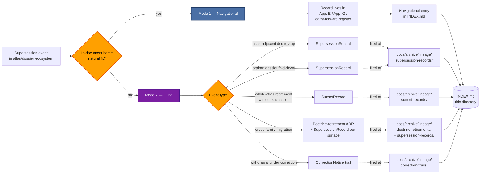

<!-- [KFM_META_BLOCK_V2]
doc_id: kfm://doc/<TODO-uuid>
title: Archived Lineage — Atlases, Supplements, and Dossiers
type: standard
version: v1
status: draft
owners:
  primary: Docs steward
  co_authoring: [KFM Domain Synthesizer (atlas-author role), subsystem owner(s) of affected scope, Release authority]
  notes: "Roles CONFIRMED per Atlas v1.1 Ch. 24.7.1. 'KFM Domain Synthesizer' is the atlas-author role (process-level, not a named person) per Atlas v1.1 G.5 assembly procedure."
created: 2026-05-25
updated: 2026-05-25
policy_label: public
related:
  - docs/archive/lineage/README.md
  - docs/archive/lineage/standards/README.md
  - docs/archive/lineage/runbooks/README.md
  - docs/archive/lineage/domains/README.md
  - docs/archive/lineage/doctrine/README.md
  - docs/atlases/
  - docs/doctrine/directory-rules.md
  - docs/adr/
  - docs/registers/DRIFT_REGISTER.md
  - control_plane/deprecation_register.yaml
tags: [kfm, archive, lineage, atlases, supplements, dossiers, supersession, navigational, dual-mode]
subject_taxonomy:
  atlas_families:
    - name: domains-culmination-atlas
      editions: [v1.0, v1.1]
      status: CONFIRMED authored
    - name: idea-index-category-atlas
      passes: [Pass 10, Pass 22, Pass 23, Pass 31, Pass 32]
      status: CONFIRMED authored (multi-pass)
    - name: consolidated-deduplicated-atlas
      editions: [Pass 23 + Pass 32 consolidated]
      status: CONFIRMED authored
  dossier_families:
    - name: domain-dossier
      short_names: [DOM-HYD, DOM-SOIL, DOM-HAB, DOM-FAUNA, DOM-FLORA, DOM-AG, DOM-GEOL, DOM-AIR, DOM-HAZ, DOM-ROADS, DOM-SETTLE, DOM-ARCH, DOM-PEOPLE, DOM-HF]
      status: CONFIRMED corpus references
    - name: reference-doctrine
      short_names: [ENCY, MAP-MASTER, INDEX-18, GAI, UIAI, UNIFIED]
      status: CONFIRMED corpus references
directory_rules_basis:
  - "§6.1   — docs/archive/{lineage,exploratory,deprecated} (CONFIRMED v1.3)."
  - "§6.1   — docs/atlases/ home per ADR-S-02 (PROPOSED canonical; ADR-pending)."
  - "Atlas v1.1 Ch. 24.7.2 — atlas/supplement publication: Docs steward + at least one subsystem owner."
  - "Atlas v1.1 Ch. 24.8.2 — Atlas / supplement supersession lives IN-DOCUMENT (App. E/G precedent). Drives §4 exclusion."
  - "Atlas v1.1 Ch. 24.12 ADR-S-02 — dossier home question (secondary worked example)."
  - "Atlas v1.1 Ch. 24.12 ADR-S-15 — Atlas / supplement lifecycle (primary worked example; governs this view's scope)."
notes:
  - "The subfolder 'atlases/' under docs/archive/lineage/ is a PROPOSED domain-segmented view, NEEDS VERIFICATION against ADR."
  - "DUAL-MODE INDEX: this view's INDEX.md contains both navigational entries (pointers to in-document App. E/G) AND true filings (records in parent category lanes). The entry_type column distinguishes them."
  - "Per Atlas v1.1 Ch. 24.8.2, atlas/supplement internal supersession is ALWAYS in-document; this view never duplicates an in-document App. E/G."
  - "All paths to specific files under docs/archive/lineage/atlases/ remain PROPOSED until inspected against a mounted repo."
[/KFM_META_BLOCK_V2] -->

# 🧭 Archived Lineage — Atlases, Supplements, and Dossiers

> **Dual-mode** subject view: a navigational index pointing OUT to in-document supersession appendices across the KFM atlas ecosystem, **and** a true filing surface for the narrow edge cases the in-document pattern cannot handle (atlas-adjacent docs, cross-family events, orphan dossier supersession).


<!-- TODO — replace placeholder Shields targets once the docs CI surface is verified. -->

**Status:** `draft` · **Primary owner:** Docs steward <sub>(role CONFIRMED · person TODO)</sub> · **Co-authoring:** KFM Domain Synthesizer (atlas-author role), affected subsystem owner(s), Release authority · **Last updated:** `2026-05-25`

> [!IMPORTANT]
> This directory is a **curatorial view**, not a parallel filing surface. Records that DO land in the parent category lanes are **filed** at `docs/archive/lineage/{supersession-records,sunset-records,doctrine-retirements,correction-trails}/`. This `atlases/` subdirectory holds **only** a README, a dual-mode `INDEX.md`, and cross-references. Filing a record file directly here creates parallel authority (Directory Rules §2.4(5)) and is **prohibited**.

> [!CAUTION]
> **Atlas / supplement internal supersession is OUT OF SCOPE.** Per Atlas v1.1 Ch. 24.8.2, the required lineage artifact for an atlas, supplement, or dossier is the **atlas / supplement supersession appendix** — the v1.0 → v1.1 record lives in v1.1 Appendix G (complementing v1.0 Appendix E); pass-card supersession lives in each pass atlas's carry-forward register. **This view never duplicates an in-document appendix.** See §4.

> [!WARNING]
> **Dual-mode INDEX.** Unlike the four sibling views (`standards/`, `runbooks/`, `domains/`, `doctrine/`), this view's `INDEX.md` contains two distinct row types. **Navigational entries** (`entry_type: navigational`) point OUT to in-document App. E/G locations — no record file exists in the parent category lanes. **Filing entries** (`entry_type: filing`) follow the normal sibling pattern — a record file exists in the parent category lanes, and this row cross-references it. The two modes are explicitly distinguished in §11.

---

## Contents

1. [Scope](#1-scope)
2. [Repo fit](#2-repo-fit)
3. [Inputs — what this view indexes](#3-inputs--what-this-view-indexes)
4. [Exclusions — what does not belong here](#4-exclusions--what-does-not-belong-here)
5. [Directory layout](#5-directory-layout)
6. [Index ↔ category mapping (dual-mode)](#6-index--category-mapping-dual-mode)
7. [Subject-curation flow](#7-subject-curation-flow)
8. [Worked example — ADR-S-15 + ADR-S-02](#8-worked-example--adr-s-15--adr-s-02)
9. [Tracked atlases, supplements, and dossiers](#9-tracked-atlases-supplements-and-dossiers)
10. [Authoring workflow](#10-authoring-workflow)
11. [Navigational vs filing entries](#11-navigational-vs-filing-entries)
12. [FAQ](#12-faq)
13. [Related docs](#13-related-docs)
14. [Per-root README contract](#14-per-root-readme-contract)
15. [Appendix](#15-appendix)

---

## 1. Scope

This directory provides a **dual-mode subject-curated view** of supersession lineage for the KFM **atlas / supplement / dossier ecosystem** — the published reference documents (typically PDFs under `docs/atlases/`) that synthesize doctrine, idea cards, and domain knowledge into citable editions.

It exists because:

- KFM operates at least **three atlas families** plus **fourteen named dossiers** (see §9). Each atlas family evolves on its own cadence and uses its own in-document supersession primitive — Domains Culmination Atlas uses App. E + App. G; Idea Index Pass atlases use the carry-forward register; the Consolidated Atlas uses its own deduplication manifest. A reviewer asking "where do I find the v1.0 → v1.1 record?" needs a single answer. This view is that answer. **[CONFIRMED via Atlas v1.1 §2.1 + Appendix G + Pass 23/32 Consolidated Atlas evidence.]**
- Atlas internal lineage is **strictly in-document** per Atlas v1.1 Ch. 24.8.2. But a small number of atlas-related events sit **outside** any single atlas's interior — `docs/atlases/README.md` rev-ups; cross-family migrations (e.g., Idea Index Pass family folded into Domains Culmination family); orphan dossier supersession (e.g., `[DOM-HF]` thin-slice fold-down before any atlas-edition bump). These need a true filing surface, which this view provides via the parent's category lanes. **[CONFIRMED via Atlas v1.1 Ch. 24.8.2 + Atlas v1.1 §2.1 dossier list + Atlas Ch. 24.12 ADR-S-02 and ADR-S-15 backlog.]**
- Atlas v1.1 Ch. 24.12 **ADR-S-15** ("Atlas / supplement lifecycle: cadence of revisions; deprecation rule; supersession path") is the open question that directly governs this view's scope. Until ADR-S-15 lands, the dual-mode framing in §11 is the safest interpretation of the constraints. **[CONFIRMED via Atlas v1.1 Ch. 24.12.]**

The directory is **navigational and selectively filing**, not authoritative. Atlas internal authority remains with the atlas PDF itself; this view never overrides it.

> [!NOTE]
> **Status.** The placement of `docs/archive/` with `lineage/`, `exploratory/`, `deprecated/` sub-areas is **CONFIRMED** via Directory Rules v1.3 §6.1. The **subject-segmented sub-lane `atlases/`** is **PROPOSED** — an explicit ADR is needed to ratify domain-segmented views. The **dual-mode INDEX framing** is also **PROPOSED** pending ADR-S-15 resolution.

[⬆ Back to top](#-archived-lineage--atlases-supplements-and-dossiers)

---

## 2. Repo fit

This subfolder is a curated lens with a dual-mode index. It sits **inside** the documentation-surface lineage archive and points outward to active atlas/supplement/dossier surfaces, to the in-document appendices where atlas-internal lineage lives, and to the parent category lanes where atlas-adjacent records actually live.

| Direction       | Surface                                                              | Relationship                                                                                                              | Status                  |
|-----------------|----------------------------------------------------------------------|---------------------------------------------------------------------------------------------------------------------------|-------------------------|
| Parent          | [`docs/archive/lineage/README.md`](../README.md)                     | Defines record categories and append-only invariant. This view inherits both, with the dual-mode extension.               | **CONFIRMED**           |
| Subject home    | [`docs/atlases/`](../../../atlases/)                                  | Active atlases / supplements / dossiers (PROPOSED home per ADR-S-02). Subject material of every entry indexed here.       | **PROPOSED home · CONFIRMED contents** |
| In-doc appendices | Each atlas's own App. E / App. G / carry-forward register          | The **authoritative location** for atlas internal supersession per Ch. 24.8.2. **Navigational entries here point at these.** | **CONFIRMED authority** |
| Filing lanes    | `docs/archive/lineage/{supersession-records,sunset-records,doctrine-retirements,correction-trails}/` | Where filing-mode records actually live. Navigational entries have no record file in these lanes.                          | **PROPOSED**            |
| Sibling views   | [`docs/archive/lineage/standards/`](../standards/) · [`runbooks/`](../runbooks/) · [`domains/`](../domains/) · [`doctrine/`](../doctrine/) | The four other subject views. This view is structurally distinct from all four (dual-mode is unique).                       | **AUTHORED**            |
| Machine partner | [`control_plane/deprecation_register.yaml`](../../../../control_plane/deprecation_register.yaml) | Machine-readable register required by Directory Rules §14.2. Atlas-adjacent deprecation entries map here.                  | **CONFIRMED via §14.2** |
| ADR backing     | [`docs/adr/`](../../../adr/)                                         | Cross-family migrations and structural atlas changes are ADR-backed; this view links to them.                              | **CONFIRMED home**      |
| Drift detector  | [`docs/registers/DRIFT_REGISTER.md`](../../../registers/DRIFT_REGISTER.md) | Open drift entries about atlas / dossier placement (e.g., ADR-S-02 dossier home question) get linked here when resolved.   | **CONFIRMED via §14.1** |
| Cross-citation registers | Atlas v1.1 Ch. 24.13 (Atlas ↔ Dossier ↔ Responsibility-Root Crosswalk) | The canonical map of every atlas / dossier to its responsibility root; this view's tracked inventory in §9 derives from it. | **CONFIRMED via Ch. 24.13** |
| Distinct        | Individual atlas PDFs (e.g., `KFM_Domains_Culmination_Atlas_v1_1.pdf`) | The retired atlas remains at its `docs/atlases/<file>.pdf` path with an in-document SUNSET note in the next edition's App. G. **Never moved here.** | **CONFIRMED — distinct**|
| Distinct        | The retired atlas / dossier itself                                   | Stays at its original path with whatever in-edition supersession note its successor provides.                              | **CONFIRMED — distinct**|

[⬆ Back to top](#-archived-lineage--atlases-supplements-and-dossiers)

---

## 3. Inputs — what this view indexes

This view indexes **four distinct entry classes**, divided across the two modes:

### Mode 1 — Navigational entries (no record file; pointer to in-document supersession)

| Entry class                              | Example                                                                                              | What `INDEX.md` records                                                  |
|------------------------------------------|-------------------------------------------------------------------------------------------------------|---------------------------------------------------------------------------|
| **Atlas edition lineage pointer**        | Atlas v1.0 → v1.1 lineage record (lives in v1.1 Appendix G).                                          | `entry_type: navigational` + `in_document_appendix_ref: "Atlas v1.1 App. G §G.1-G.6"` |
| **Pass-card carry-forward pointer**      | Pass 22 → Pass 23 carry-forward (lives in Pass 23 carry-forward register).                            | `entry_type: navigational` + `in_document_appendix_ref: "Pass 23 carry-forward register"` |

### Mode 2 — Filing entries (true record in parent category lane)

| Entry class                              | Example                                                                                              | Likely record category                |
|------------------------------------------|-------------------------------------------------------------------------------------------------------|----------------------------------------|
| **Atlas-adjacent doc surface retirement** | `docs/atlases/README.md` is rev-ed with a major scope change; the prior README is retired.            | `SupersessionRecord`                  |
| **Cross-family migration**               | Atlas Pass-card family is folded into Domains Culmination family (or vice-versa); structural enough that no single in-document appendix can capture it. | Doctrine-retirement ADR + `SupersessionRecord` per affected surface |
| **Orphan dossier supersession**          | `[DOM-HF]` thin-slice fold-down before any atlas edition bumps; the dossier as a file is retired.    | `SupersessionRecord`                  |
| **Whole-atlas retirement without successor** | An atlas family is abandoned (rare; would require ADR per Directory Rules §2.4).                 | `SunsetRecord` (`successor: null` + rationale) |
| **Withdrawal under correction**          | An atlas/dossier is withdrawn because its claims were materially wrong (extreme — rare).              | `CorrectionNotice` trail              |

### The discriminating test

> **Does the supersession event have a natural home inside the atlas/supplement/dossier itself?**
>
> - **Yes** → in-document (App. E/G / carry-forward register / similar). This view gets a **navigational entry**.
> - **No** → parent category lane. This view gets a **filing entry**.

The discriminating test is the dividing line between Mode 1 and Mode 2.

> [!TIP]
> When in doubt, **prefer Mode 1**. The in-document precedent (Atlas Ch. 24.8.2) is the strict default. Mode 2 is reserved for events the in-document pattern genuinely cannot capture. If you're filing a Mode 2 entry, you should be able to articulate why no in-document appendix could carry the event.

[⬆ Back to top](#-archived-lineage--atlases-supplements-and-dossiers)

---

## 4. Exclusions — what does not belong here

| Out of scope                                                          | Why                                                                              | Goes instead to                                                          |
|-----------------------------------------------------------------------|-----------------------------------------------------------------------------------|---------------------------------------------------------------------------|
| **Atlas / supplement / dossier internal supersession** (e.g., Atlas v1.0 → v1.1) | Per Atlas v1.1 Ch. 24.8.2, atlas internal lineage **lives in-document** as an App. E/G or equivalent. This view points at the in-document location via Mode 1 — it does **not** duplicate the content. | Inside the atlas / supplement itself (App. E / App. G / carry-forward register / equivalent) |
| **Pass-card carry-forward state** (e.g., Pass 22 → Pass 23 UNCHANGED) | Each pass atlas's carry-forward register IS the supersession primitive for that family. | In the pass atlas's carry-forward register                                |
| **Within-pass card body edits** (e.g., expanded Pass 32 addendum)     | Card-level lineage is handled by the pass atlas's `spec_hash` + carry-forward fields. | In the pass atlas's card metadata                                         |
| **The retired atlas / supplement / dossier itself**                   | Retired editions remain at their original path; the successor edition cites them in its App. E/G or carry-forward register. | Original path (e.g., `docs/atlases/KFM_Domains_Culmination_Atlas_v1_0.pdf`) |
| **The actual record file** (`KFM-SUP-NNNN-*.md`, etc.)                | Records live in the parent's category lanes; filing here creates parallel authority. | `docs/archive/lineage/<category>/KFM-<PREFIX>-NNNN-<slug>.md`            |
| **Per-domain doc retirements** under `docs/domains/<domain>/`         | Those go to the sibling `domains/` view.                                          | [`docs/archive/lineage/domains/`](../domains/)                            |
| **Doctrine-doc retirements** under `docs/doctrine/`                   | Those go to the sibling `doctrine/` view.                                          | [`docs/archive/lineage/doctrine/`](../doctrine/)                          |
| **Standards profile retirements** under `docs/standards/`             | Those go to the sibling `standards/` view.                                         | [`docs/archive/lineage/standards/`](../standards/)                        |
| **Runbook retirements** under `docs/runbooks/`                        | Those go to the sibling `runbooks/` view.                                          | [`docs/archive/lineage/runbooks/`](../runbooks/)                          |
| Active deprecation entries (pre-sunset)                               | Still doing governance work; not yet historical.                                  | `control_plane/deprecation_register.yaml` <sub>CONFIRMED via §14.2</sub> |
| Object-class supersession (EvidenceBundle, ReleaseManifest, etc.)     | Lives with the object per Atlas Ch. 24.8.2.                                       | Bundle registry / manifest history / source register                     |
| ADR working drafts                                                    | Drafts live with active ADRs; only the *retirement* trail lands here.             | `docs/adr/` working area                                                 |
| Open `DRIFT_REGISTER.md` entries                                      | Drift is detection-stage; not yet a retirement.                                   | `docs/registers/DRIFT_REGISTER.md`                                       |
| AI-generated retirement proposals                                     | Drafts have no archive identity until promoted via authority ladder.              | Working branches; tracked via `AIReceipt`                                |

> [!CAUTION]
> **The Ch. 24.8.2 exclusion is the load-bearing rule for this view.** The in-document App. E/G pattern is the established KFM precedent. This view's Mode 2 filing surface is a **narrow exception** justified only when no in-document appendix can carry the event. The default disposition for any atlas-related supersession is: file it in the next edition's appendix, and add a Mode 1 navigational entry here pointing at it.

[⬆ Back to top](#-archived-lineage--atlases-supplements-and-dossiers)

---

## 5. Directory layout

The subfolder is **PROPOSED**; its placement under `docs/archive/lineage/` inherits the CONFIRMED parent path (Directory Rules §6.1) but the subject-segmented sub-lane itself awaits ADR ratification. The layout is intentionally minimal — this is a view, not a filing surface.

```text
docs/archive/lineage/atlases/
├── README.md          # this file
└── INDEX.md           # dual-mode cross-listing (PROPOSED — generator-driven)
                       #   - navigational entries: point OUT to in-document App. E/G
                       #   - filing entries: cross-reference records in parent category lanes
```

For Mode 2 filing entries, the records themselves remain at:

```text
docs/archive/lineage/
├── supersession-records/KFM-SUP-NNNN-<slug>.md
├── sunset-records/KFM-SUN-NNNN-<slug>.md
├── doctrine-retirements/KFM-DR-NNNN-<slug>.md
└── correction-trails/KFM-COR-NNNN-<slug>.md
```

For Mode 1 navigational entries, the **authority lives inside the atlas itself**:

```text
docs/atlases/
├── KFM_Domains_Culmination_Atlas_v1_0.pdf      # contains App. E (its own internal lineage)
├── KFM_Domains_Culmination_Atlas_v1_1.pdf      # contains App. G (v1.0 → v1.1 record)
├── KFM_Pass_22_Idea_Index_...pdf               # contains carry-forward register
├── KFM_Pass_23_Idea_Index_...pdf               # carry-forward references Pass 22
├── KFM_Pass_32_Idea_Index_...pdf               # carry-forward references Pass 31
└── KFM_Pass_23_Pass_32_Consolidated_Atlas.pdf  # contains its own deduplication manifest
```

> [!NOTE]
> Atlas file presence under `docs/atlases/` is **PROPOSED** per Atlas v1.1 G.4 ("PROPOSED repo placement: `docs/atlases/KFM_Domains_Culmination_Atlas_v1_1.pdf`") and Atlas Ch. 24.12 ADR-S-02 (dossier home question). Mounted-repo presence remains NEEDS VERIFICATION.

[⬆ Back to top](#-archived-lineage--atlases-supplements-and-dossiers)

---

## 6. Index ↔ category mapping (dual-mode)

`INDEX.md` is the only durable artifact in this directory besides the README. The schema below extends the parent schema with **six atlas-specific columns**, including the critical `entry_type` discriminator that distinguishes Mode 1 (navigational) from Mode 2 (filing).

| INDEX column                  | Source                                              | Notes                                                                                       |
|--------------------------------|-----------------------------------------------------|----------------------------------------------------------------------------------------------|
| `entry_type`                  | **MANDATORY** — `navigational` or `filing`         | Discriminates the two modes. Drives which other columns are required.                       |
| `record_id`                   | Filename stem in parent category lane *(filing only)* | e.g., `KFM-SUP-0042`. **Null for navigational entries.**                                     |
| `category`                    | Parent subdirectory *(filing only)*                 | `supersession` · `sunset` · `doctrine-retirement` · `correction-trail`. **Null for navigational.** |
| `atlas_family`                | Subject taxonomy *(atlas-specific)*                | One of `domains-culmination-atlas` · `idea-index-category-atlas` · `consolidated-deduplicated-atlas` · `domain-dossier` · `reference-doctrine`. |
| `edition_or_pass`             | Subject identifier *(atlas-specific)*              | e.g., `v1.1`, `Pass 23`, `Pass 32`, `[DOM-HF]`. The specific edition / pass / dossier short-name. |
| `in_document_appendix_ref`    | Pointer *(atlas-specific; mandatory for navigational)* | e.g., `"Atlas v1.1 App. G §G.1-G.6"`, `"Pass 23 carry-forward register"`. **Mandatory for navigational entries; null for filing entries.** |
| `cross_family_event`          | Boolean *(atlas-specific)*                         | `true` if the event spans multiple atlas families (e.g., Idea Index → Domains Culmination fold). Typically `true` for filing-mode entries. |
| `requires_edition_bump`       | Boolean *(atlas-specific; filing only)*            | `true` if the filing event implies the next atlas edition must be authored to fully capture the change in App. E/G. |
| `subject_path`                | Field inside the record *(filing only)*            | e.g., `docs/atlases/README.md`, `docs/atlases/KFM_DOM_HF_thin_slice.pdf`. Null for navigational. |
| `successor_id`                | Field inside the record *(filing only)*            | Successor record ID or `null` + `no_successor_rationale`. Null for navigational.             |
| `retired_at`                  | Field inside the record *(filing only)*            | ISO date. For navigational, may use the in-document appendix's recorded date.                |
| `authority_ladder_signoff`    | Field inside the record *(filing only)*            | Comma-separated role list per Atlas v1.1 Ch. 24.7.1.                                          |
| `adr_ref`                     | Mandatory for filing-mode doctrine-retirements; optional for navigational | e.g., `ADR-S-02`, `ADR-S-15`. Cross-family migrations always carry an ADR.                  |
| `deprecation_register_entry`  | `control_plane/deprecation_register.yaml`           | Cross-ref ID; required for sunset-class filing records.                                       |

### Required fields by mode

| Field                          | Navigational (Mode 1) | Filing (Mode 2)                |
|--------------------------------|------------------------|---------------------------------|
| `entry_type`                   | **REQUIRED**           | **REQUIRED**                    |
| `atlas_family`                 | **REQUIRED**           | **REQUIRED**                    |
| `edition_or_pass`              | **REQUIRED**           | **REQUIRED**                    |
| `in_document_appendix_ref`     | **REQUIRED**           | null                            |
| `record_id`                    | null                   | **REQUIRED**                    |
| `category`                     | null                   | **REQUIRED**                    |
| `subject_path`                 | null                   | **REQUIRED**                    |
| `successor_id`                 | null                   | **REQUIRED**                    |
| `retired_at`                   | Optional               | **REQUIRED**                    |
| `authority_ladder_signoff`     | null (atlas internal)  | **REQUIRED**                    |
| `adr_ref`                      | Optional               | **REQUIRED** for cross-family   |
| `cross_family_event`           | Typically `false`      | Often `true`                    |
| `requires_edition_bump`        | null                   | Optional                        |

> [!IMPORTANT]
> The `entry_type` discriminator is the load-bearing field. A row missing `entry_type` is invalid. CI must reject any INDEX row that lacks `entry_type` or that has the wrong required-field set for its declared type.

[⬆ Back to top](#-archived-lineage--atlases-supplements-and-dossiers)

---

## 7. Subject-curation flow

The diagram shows the two paths a supersession event takes through the dual-mode INDEX. The first decision gate is whether the event has a natural in-document home.



> [!WARNING]
> The diagram is **conceptual**. No atlas-related retirement has yet occurred; the flow is exercised against the open ADR-S-02 and ADR-S-15 questions in §8. Concrete tooling for `INDEX.md` is **PROPOSED · NEEDS VERIFICATION**.

[⬆ Back to top](#-archived-lineage--atlases-supplements-and-dossiers)

---

## 8. Worked example — ADR-S-15 + ADR-S-02

This view is governed by two open ADRs from Atlas v1.1 Ch. 24.12. Both produce interesting and distinct lineage events on resolution.

### Primary — ADR-S-15 (Atlas / supplement lifecycle)

**Atlas v1.1 Ch. 24.12 ADR-S-15** asks: "Atlas / supplement lifecycle: cadence of revisions; deprecation rule; supersession path." Resolution will determine:

- Whether the App. E/G in-document pattern is the **only** valid supersession path (Mode 1 only; Mode 2 deprecated as a concept).
- Whether structured cross-family migrations are permitted **only** via doctrine-retirement ADR + in-document appendices on both sides (Mode 1 dominates; Mode 2 narrows).
- Whether a deprecation cadence (e.g., "every atlas family must publish at least one App. G-style supersession appendix annually, even if empty") is mandated.

**Three resolution paths:**

| Path | Outcome                                                              | Effect on this view                                                          |
|------|-----------------------------------------------------------------------|-------------------------------------------------------------------------------|
| **A** | ADR-S-15 ratifies the App. E/G pattern as the only valid supersession; Mode 2 is closed. | This view collapses to **Mode 1 only**. `entry_type: filing` becomes invalid; the README is updated; existing filing entries (if any) get migrated to in-document appendices. |
| **B** | ADR-S-15 keeps the dual-mode framing as-is; adds cadence and deprecation rules. | This view continues operating as designed. The README's §11 is amended with the cadence specifics. |
| **C** | ADR-S-15 expands Mode 2 (e.g., permits more event types to file in parent lanes). | This view's Mode 2 grows; `entry_type` discriminator becomes the dominant filter. |

**Until ADR-S-15 lands**, this view operates under Path B as the safest interpretation. New entries default to Mode 1 unless the event genuinely cannot be carried by an in-document appendix.

### Secondary — ADR-S-02 (dossier home: `docs/dossiers/` vs `docs/atlases/`)

**Atlas v1.1 Ch. 24.12 ADR-S-02** asks: "Should domain dossiers live under `docs/dossiers/` or `docs/atlases/`?" Resolution will potentially produce a **filing entry** in this view.

**State today (CONFIRMED):** Atlas v1.1 G.4 sets a PROPOSED repo placement at `docs/atlases/KFM_Domains_Culmination_Atlas_v1_1.pdf`. Per-domain dossiers ([DOM-HYD], [DOM-FAUNA], etc.) are referenced as separate artifacts but their canonical home is open per ADR-S-02.

**When the ADR resolves (PROPOSED flow):**

1. ADR-S-02 picks `docs/atlases/` or `docs/dossiers/`.
2. If `docs/atlases/`: no migration; dossiers are confirmed at their current PROPOSED home. No record here.
3. If `docs/dossiers/`: every dossier file moves from PROPOSED `docs/atlases/` to the new `docs/dossiers/` home under Directory Rules §14.1 (routine move) or §14.2 (structural move per ADR-S-02).
   - **If dossiers had ever existed under `docs/atlases/`** in the mounted repo: a `SupersessionRecord` is filed for the home change (rename-only event). Filing entry in this view.
   - **If dossiers were never under `docs/atlases/`** (placement remained PROPOSED through ADR resolution): no record here; the open question simply closes.
4. `docs/atlases/README.md` is updated to reflect the new home; if the prior README's scope changes materially, **that** rev-up may itself be a filing entry.

**Sketch of a filing-mode INDEX row** (hypothetical, if dossiers had migrated):

| entry_type | atlas_family   | edition_or_pass | in_document_appendix_ref | record_id     | category     | subject_path                                    | adr_ref     | cross_family_event |
|------------|----------------|------------------|---------------------------|---------------|--------------|--------------------------------------------------|-------------|---------------------|
| `filing`   | `domain-dossier` | `[DOM-HF]`     | null                      | `KFM-SUP-NNNN` | supersession | `docs/atlases/KFM_DOM_HF_thin_slice.pdf` (PROPOSED retired path) | `ADR-S-02`  | `false`             |

**Sketch of a navigational-mode INDEX row** (Atlas v1.0 → v1.1 — lives in v1.1 App. G):

| entry_type      | atlas_family               | edition_or_pass | in_document_appendix_ref          | record_id | category | subject_path | adr_ref |
|------------------|----------------------------|------------------|------------------------------------|-----------|----------|--------------|---------|
| `navigational`   | `domains-culmination-atlas` | `v1.0 → v1.1`   | `Atlas v1.1 Appendix G §G.1-G.6`  | null      | null     | null         | null    |

> [!TIP]
> Until the ADRs land, **nothing about these examples is filed here**. Pre-resolution status is tracked at `docs/registers/DRIFT_REGISTER.md` + Atlas Ch. 24.12 backlog rows ADR-S-02 and ADR-S-15.

[⬆ Back to top](#-archived-lineage--atlases-supplements-and-dossiers)

---

## 9. Tracked atlases, supplements, and dossiers

This table inventories the atlas/supplement/dossier population currently in scope, drawn from Atlas v1.1 §2.1, Ch. 24.13, and corpus references. **PROPOSED** placement under `docs/atlases/` per ADR-S-02 pending; **CONFIRMED authored** where noted.

### Atlas families

| Atlas family                          | Editions / passes (CONFIRMED authored)                          | In-document supersession primitive                       | Open lineage candidate (per Ch. 24.12)                |
|----------------------------------------|------------------------------------------------------------------|-----------------------------------------------------------|--------------------------------------------------------|
| **Domains Culmination Atlas**          | v1.0 (2026-05-11); v1.1 (2026-05-12; current edition)            | App. E (v1.0 internal) + App. G (v1.0 → v1.1 record)      | ADR-S-15 (lifecycle).                                  |
| **Idea Index Category Atlas** (pass-card family) | Pass 10, Pass 22, Pass 23, Pass 31 (referenced as baseline), Pass 32 | Carry-forward register inside each pass atlas             | ADR-S-15 (lifecycle); cadence question.                |
| **Consolidated / Deduplicated Atlas**  | Pass 23 + Pass 32 consolidated (referenced; SHA-256 prefix `0bd0e9ca…`) | Deduplication manifest + non-card material register       | ADR-S-15 (lifecycle); may become its own family.       |

### Domain dossiers (per Atlas v1.1 §2.1)

| Short-name      | Domain                                  | Status                                          |
|------------------|------------------------------------------|--------------------------------------------------|
| `[DOM-HYD]`     | Hydrology dossier                       | **CONFIRMED corpus reference**                   |
| `[DOM-SOIL]`    | Soil dossier                            | **CONFIRMED corpus reference**                   |
| `[DOM-HAB]`     | Habitat dossier                         | **CONFIRMED corpus reference**                   |
| `[DOM-FAUNA]`   | Fauna dossier                           | **CONFIRMED corpus reference**                   |
| `[DOM-FLORA]`   | Flora dossier                           | **CONFIRMED corpus reference**                   |
| `[DOM-AG]`      | Agriculture dossier                     | **CONFIRMED corpus reference**                   |
| `[DOM-GEOL]`    | Geology dossier                         | **CONFIRMED corpus reference**                   |
| `[DOM-AIR]`     | Atmosphere/Air dossier                  | **CONFIRMED corpus reference**                   |
| `[DOM-HAZ]`     | Hazards dossier                         | **CONFIRMED corpus reference**                   |
| `[DOM-ROADS]`   | Roads/Rail/Trade dossier                | **CONFIRMED corpus reference**                   |
| `[DOM-SETTLE]`  | Settlements/Infrastructure dossier      | **CONFIRMED corpus reference**                   |
| `[DOM-ARCH]`    | Archaeology dossier                     | **CONFIRMED corpus reference**                   |
| `[DOM-PEOPLE]`  | People/DNA/Land dossier                 | **CONFIRMED corpus reference**                   |
| `[DOM-HF]`      | Habitat+Fauna thin slice (paired)       | **CONFIRMED corpus reference** — fold-down candidate (Atlas Ch. 24.13 notes "Pairs with Fauna under thin-slice plan"). |

### Reference-doctrine supplements

| Short-name      | Document                                                                | Status                                                                       |
|------------------|--------------------------------------------------------------------------|------------------------------------------------------------------------------|
| `[ENCY]`        | KFM Encyclopedia (master domain/object/source/capability spine)         | **CONFIRMED corpus reference**                                               |
| `[MAP-MASTER]`  | MapLibre Master (renderer/tiles/Drawer/Focus Mode doctrine)             | **CONFIRMED corpus reference**                                               |
| `[INDEX-18]`    | Pass 18 Idea Index (representation/APIs/validation expansion)           | **CONFIRMED corpus reference**                                               |
| `[GAI]`         | Governed AI dossier (AIReceipt doctrine)                                | **CONFIRMED corpus reference**                                               |
| `[UIAI]`        | Whole UI + AI report                                                    | **CONFIRMED corpus reference**                                               |
| `[UNIFIED]`     | Unified / pipeline lineage roadmap                                      | **CONFIRMED corpus reference**                                               |
| `[DDD]`         | DDD Reference (Domain-Driven Design, Eric Evans 2015)                   | **EXTERNAL — CC-BY 4.0 licensed third-party reference**. Not KFM-authored; not retirable in the KFM sense. |

> [!NOTE]
> `[DDD]` is an external reference document. It cannot be retired by KFM; its presence in this inventory is for completeness of the citation network only. If KFM ever moves to a different DDD reference, that's a citation-network update across many KFM docs, not a retirement event here.

### Cross-family lineage events to watch

| Event                                                                | Likely INDEX entry type                  | Driving ADR        |
|-----------------------------------------------------------------------|-------------------------------------------|---------------------|
| Atlas v1.1 → v1.2 (or → v2.0)                                        | Mode 1 (navigational; lives in next edition's App.) | ADR-S-15            |
| Pass 32 → Pass 33                                                    | Mode 1 (carry-forward register in Pass 33)         | ADR-S-15            |
| Consolidated Atlas update (e.g., Pass 23+32 → Pass 23+32+33)         | Mode 1 (deduplication manifest)                     | ADR-S-15            |
| `[DOM-HF]` fold-down into separate `[DOM-HAB]` + `[DOM-FAUNA]`       | Mode 2 (orphan dossier supersession)                | None directly; per-dossier review |
| Idea Index family folded into Domains Culmination family             | Mode 2 (cross-family migration) — would require ADR | Future ADR (not yet enumerated) |
| Dossier home moves from `docs/atlases/` to `docs/dossiers/`          | Mode 2 (rename-only) if files existed; else closes drift only | ADR-S-02            |
| `docs/atlases/README.md` major rev-up                                | Mode 2 (atlas-adjacent doc supersession)            | None directly; Docs steward |

[⬆ Back to top](#-archived-lineage--atlases-supplements-and-dossiers)

---

## 10. Authoring workflow

The flow below is **PROPOSED** and handles both modes with separate paths. Confirm against any existing runbook before treating it as official.

### Mode 1 (Navigational entry) — when an atlas/supplement/dossier publishes a new edition

1. **Edition assembly.** The atlas/supplement/dossier author (typically the KFM Domain Synthesizer process for Domains Culmination atlas; the pass-cards generator for Idea Index family) assembles the new edition with its own in-document supersession appendix (App. E / App. G / carry-forward register / equivalent).
2. **Edition publication.** Per Atlas v1.1 Ch. 24.7.2, atlas / supplement publication requires Docs steward + at least one subsystem owner sign-off. This produces the new edition file.
3. **In-document supersession appendix authored.** The appendix is part of the new edition's own content (e.g., Atlas v1.1 App. G §G.1-G.6). This is where the authoritative lineage record lives. **No record file is created in `docs/archive/lineage/<category>/`.**
4. **Navigational entry added to this view's `INDEX.md`**. The row has `entry_type: navigational` and points at the in-document appendix via `in_document_appendix_ref`. Fields like `record_id`, `category`, `subject_path`, `authority_ladder_signoff` are `null`.
5. **`docs/atlases/README.md` cross-link.** If the atlas landing README maintains an editions table, it is updated to reflect the new edition.

### Mode 2 (Filing entry) — when an event cannot be carried by any in-document appendix

1. **Justification.** Before filing in Mode 2, the responsible role articulates why no in-document appendix can carry the event. The justification is recorded in the record itself. This is the load-bearing step that protects the Ch. 24.8.2 default.
2. **Upstream governance signs off.** A `DeprecationNotice` (`control_plane/deprecation_register.yaml`), `CorrectionNotice`, or ADR is authored and accepted through the authority ladder. Cross-family migrations are ADR-mandatory per Directory Rules §2.4.
3. **Atlas-edition-bump check.** If the filing-mode event implies the next atlas edition must capture the change in App. G (or equivalent), that follow-on edition is queued; `requires_edition_bump` is `true` in the INDEX row.
4. **Trigger event.** Sunset reached, supersession released, ADR accepted.
5. **Record filed in the parent category lane** — `docs/archive/lineage/<category>/KFM-<PREFIX>-NNNN-<slug>.md`. **Never filed here.**
6. **Authority-ladder co-signing.** Per Atlas v1.1 Ch. 24.7.2:
   - **Atlas-adjacent doc rev-up**: Docs steward + Atlas author role.
   - **Orphan dossier supersession**: Docs steward + relevant Domain steward (if domain-specific).
   - **Cross-family migration**: Docs steward + at least one subsystem owner per affected family + ADR.
   - **Whole-atlas retirement without successor**: Docs steward + Release authority + at least one subsystem owner.
   - **Withdrawal under correction**: Docs steward + Correction reviewer + Release authority.
7. **Filing entry added to this view's `INDEX.md`**. The row has `entry_type: filing` and includes the full filing-mode field set (`record_id`, `category`, `subject_path`, `successor_id`, etc.).
8. **SUNSET banner.** The retired atlas-adjacent doc keeps its banner and cites the new record ID.
9. **Atlas Ch. 24.13 crosswalk consistency check.** Cross-family migrations may invalidate Atlas v1.1 Ch. 24.13 crosswalk rows; queue the update for the next atlas edition.

> [!WARNING]
> Mode 1 is the **default**. Mode 2 is the **narrow exception**. If the responsible role cannot articulate a clear reason why no in-document appendix can carry the event, the event belongs in Mode 1, not Mode 2. The Ch. 24.8.2 in-document precedent is doctrinal; Mode 2 is the exception, not the rule.

[⬆ Back to top](#-archived-lineage--atlases-supplements-and-dossiers)

---

## 11. Navigational vs filing entries

This view's dual-mode `INDEX.md` is its defining characteristic. The two modes serve different audiences and obey different rules.

### Side-by-side comparison

| Aspect                                  | Mode 1 — Navigational                                    | Mode 2 — Filing                                          |
|------------------------------------------|-----------------------------------------------------------|-----------------------------------------------------------|
| **Purpose**                             | Pointer to in-document App. E/G / carry-forward register | Cross-reference to a record file in parent category lane  |
| **Authority of the lineage record**     | Inside the atlas itself (Ch. 24.8.2)                     | The record file under `docs/archive/lineage/<category>/` |
| **Record file in parent category lane?** | No                                                       | Yes                                                       |
| **Required INDEX columns**              | `entry_type`, `atlas_family`, `edition_or_pass`, `in_document_appendix_ref` | `entry_type`, `atlas_family`, `edition_or_pass`, `record_id`, `category`, `subject_path`, `successor_id`, `retired_at`, `authority_ladder_signoff` |
| **ADR required?**                       | Typically no (atlas editions don't require external ADR) | Often yes (cross-family migrations are always ADR-backed) |
| **Triggers**                            | Atlas edition publication; new pass atlas; consolidated atlas update | Atlas-adjacent doc rev-up; orphan dossier supersession; cross-family migration; whole-atlas retirement; withdrawal |
| **Append-only invariant**               | Yes (navigational entries are append-only; cannot be edited) | Yes (parent archive append-only inherited)               |
| **Frequency**                           | Higher (every atlas edition produces one)               | Lower (rare events)                                       |
| **Audience**                            | Discoverability — readers asking "where is the v1.0 → v1.1 record?" | Auditors — readers asking "what was retired and why?"   |
| **Validation**                          | `in_document_appendix_ref` resolves to a real location in a real atlas/supplement/dossier file | Record file exists; mandatory fields populated; ADR (if applicable) is accepted |

### When to use each mode

**Use Mode 1 when:**

- An atlas/supplement/dossier publishes a new edition with an in-document supersession appendix (App. E, App. G, carry-forward register, deduplication manifest).
- A pass-card atlas carries forward prior content via its carry-forward register.
- A consolidated atlas updates its deduplication manifest.
- Any event where the in-document pattern naturally handles the lineage.

**Use Mode 2 when:**

- An atlas-adjacent doc surface (`docs/atlases/README.md`, `docs/atlases/INDEX.md`, navigation/orientation docs) is rev-ed with a major scope change.
- A dossier is retired/folded **before** any atlas edition can incorporate the change (orphan supersession).
- Two atlas families are merged or one is split (cross-family migration; ADR-backed).
- An atlas family is abandoned without a successor (whole-atlas retirement).
- An atlas/supplement/dossier is withdrawn because its claims were materially wrong (CorrectionNotice trail).

### The discriminating question — restated

> **Can this lineage event be fully captured inside the next edition's in-document appendix without distortion?**
>
> - **Yes** → Mode 1.
> - **No** → Mode 2, with a written justification in the record file.

If a reviewer is uncertain, default to Mode 1 and consult the atlas author role + Docs steward.

> [!CAUTION]
> **Do not split events across modes.** A single supersession event must be entirely Mode 1 or entirely Mode 2 — never both. If part of an event has a natural in-document home and part does not, the part without a natural home belongs in Mode 2 as a separate, scoped record; the part with a natural home gets a Mode 1 navigational entry; and the two INDEX rows cross-reference each other via the record's `notes` field. This is rare and should be reviewed by Docs steward.

[⬆ Back to top](#-archived-lineage--atlases-supplements-and-dossiers)

---

## 12. FAQ

<details>
<summary><b>Why does this view exist if Atlas Ch. 24.8.2 says atlas supersession is in-document?</b></summary>

For two reasons:

1. **Navigation matters.** Atlas Ch. 24.8.2 says the **authoritative record** lives in-document — it does not forbid a navigational index pointing AT those in-document locations. The KFM atlas ecosystem has at least three families with different in-document primitives (App. E/G, carry-forward register, deduplication manifest); finding the right one without an index is hard. Mode 1 solves this.
2. **Edge cases exist.** Some atlas-related events have no natural in-document home — atlas-adjacent README rev-ups, cross-family migrations, orphan dossier supersessions. Mode 2 handles these via the parent category lanes, with the in-document precedent still applying wherever it can.

The dual-mode design is the resolution. ADR-S-15 will ratify or replace it.

</details>

<details>
<summary><b>Does Atlas v1.0 → v1.1 produce a record here?</b></summary>

**No record file** — only a **navigational entry** in this view's `INDEX.md`. The authoritative record lives in Atlas v1.1 Appendix G §G.1-G.6. The Mode 1 entry here just points at it. Per Ch. 24.8.2, the in-document appendix IS the lineage artifact; this view never duplicates it.

</details>

<details>
<summary><b>Does Pass 22 → Pass 23 produce a record here?</b></summary>

**No record file** — only a **navigational entry**. The authoritative record lives in Pass 23's carry-forward register. The carry-forward primitive is the pass-card family's in-document supersession appendix equivalent. Mode 1 covers it.

</details>

<details>
<summary><b>What if a dossier is folded into another before any atlas edition can incorporate the change?</b></summary>

That's the **orphan dossier supersession** case — Mode 2. A `SupersessionRecord` is filed in `docs/archive/lineage/supersession-records/` for the retired dossier; the INDEX gets a Mode 2 filing entry. If a future atlas edition then references the fold (e.g., next Domains Culmination Atlas edition's App. G), a Mode 1 navigational entry is added pointing at that App. G for the same event — but the two are linked via the record's `notes` field. This is the rare "cross-mode" case mentioned in §11.

</details>

<details>
<summary><b>How does the dual-mode design interact with the append-only invariant?</b></summary>

Both modes are append-only. A navigational entry cannot be edited in place; if the in-document appendix it points at moves (e.g., re-numbered from App. G to App. H), a follow-up navigational entry is added pointing at the new location, and the original entry remains. The append-only invariant applies recursively across both modes.

</details>

<details>
<summary><b>Can a navigational entry exist before its in-document appendix is authored?</b></summary>

**No.** Per the discriminating test in §11, the in-document appendix must exist before a Mode 1 entry can point at it. Pre-publication entries fail validation. If the atlas edition is in flight, wait until publication; the navigational entry follows the publication, not the other way around.

</details>

<details>
<summary><b>How does this view interact with the sibling <code>doctrine/</code> view?</b></summary>

Atlas supplements often function doctrinally — Atlas Ch. 24 introduces 14 master registers that consolidate doctrine. But the **atlas PDF itself** is a dossier-class artifact (under `docs/atlases/`), not a doctrine doc (under `docs/doctrine/`). So:

- An atlas edition publication produces a Mode 1 entry HERE.
- A doctrine doc retirement that's triggered BY an atlas edition (e.g., a doctrine paragraph folded because Atlas Ch. 24 now consolidates it) produces a doctrine-retirement record in the sibling `doctrine/` view.

The two views may cross-reference each other for the same conceptual event.

</details>

<details>
<summary><b>What's the relationship to ADR-S-02 (dossier home question)?</b></summary>

Open. If ADR-S-02 picks `docs/atlases/` (current PROPOSED home), no migration; no record. If it picks `docs/dossiers/`, every dossier file moves, and a `SupersessionRecord` may be filed if dossiers had been authored under the prior home in the mounted repo. See §8.

</details>

<details>
<summary><b>What's the relationship to ADR-S-15 (atlas / supplement lifecycle)?</b></summary>

**ADR-S-15 is the master open question that directly governs this view's scope.** Until it resolves, this view operates under the safest interpretation (Mode 1 default; Mode 2 narrow exception). When ADR-S-15 lands, this README may need substantial revision per the three paths in §8. The current draft is robust to all three outcomes — Path A collapses Mode 2; Path B preserves the design; Path C expands Mode 2.

</details>

<details>
<summary><b>How does this differ from the four sibling views?</b></summary>

Structurally identical (navigational view, not a filing surface, inherits parent record categories); substantively distinct in **two ways**:

1. **Dual-mode INDEX.** Standards, runbooks, domains, and doctrine all operate single-mode (every INDEX row points at a record file in a parent category lane). This view is the only one with `entry_type: navigational` as a first-class concept, driven by Atlas Ch. 24.8.2 in-document precedent.
2. **Atlas/dossier ecosystem scope.** The other four views scope to specific responsibility roots (`docs/standards/`, `docs/runbooks/`, `docs/domains/`, `docs/doctrine/`). This view scopes to `docs/atlases/` PLUS the cross-family ecosystem of dossiers and supplements that may or may not live under that root pending ADR-S-02.

</details>

<details>
<summary><b>Can AI draft entries?</b></summary>

AI may **draft** index prose, propose navigational pointers, and suggest discriminating-test classifications. AI may **not** decide which mode applies, set the `entry_type`, or sign off on Mode 2 filings. The Docs steward + atlas author role make those calls. Per the AI rule, AI is interpretive — never the root truth source.

</details>

[⬆ Back to top](#-archived-lineage--atlases-supplements-and-dossiers)

---

## 13. Related docs

The paths below cite Directory Rules v1.3 §6.1 placements and Atlas Ch. 24.13 crosswalk. Per-doc placement under `docs/atlases/` is PROPOSED pending ADR-S-02.

**Parent archive and siblings (CONFIRMED canonical):**

- [`docs/archive/lineage/README.md`](../README.md) — parent archive, record categories, append-only invariant.
- [`docs/archive/lineage/standards/README.md`](../standards/README.md) — sibling subject view (external standards).
- [`docs/archive/lineage/runbooks/README.md`](../runbooks/README.md) — sibling subject view (operational runbooks).
- [`docs/archive/lineage/domains/README.md`](../domains/README.md) — sibling subject view (domain documentation).
- [`docs/archive/lineage/doctrine/README.md`](../doctrine/README.md) — sibling subject view (foundational doctrine).
- [`docs/archive/exploratory/`](../../exploratory/) — superseded exploratory work (sibling, distinct purpose).
- [`docs/archive/deprecated/`](../../deprecated/) — archived content without successors (sibling, distinct purpose).

**Active subject material (PROPOSED home per ADR-S-02; presence NEEDS VERIFICATION):**

- [`docs/atlases/`](../../../atlases/) — active atlases / supplements / dossiers landing.
- `docs/atlases/KFM_Domains_Culmination_Atlas_v1_0.pdf` — Domains Culmination Atlas v1.0 (App. E lineage source).
- `docs/atlases/KFM_Domains_Culmination_Atlas_v1_1.pdf` — Domains Culmination Atlas v1.1 (App. G lineage source).
- `docs/atlases/KFM_Pass_10_Idea_Index_..._Dossier.pdf` — Pass 10 Idea Index.
- `docs/atlases/KFM_Pass_22_Idea_Index_..._Dossier.pdf` — Pass 22 baseline.
- `docs/atlases/KFM_Pass_23_Idea_Index_..._Dossier.pdf` — Pass 23 (carry-forward from Pass 22).
- `docs/atlases/KFM_Pass_32_Idea_Index_..._Dossier.pdf` — Pass 32 (carry-forward from Pass 31).
- `docs/atlases/KFM_Pass_23_Pass_32_Consolidated_Atlas.pdf` — Consolidated/deduplicated.

**Doctrine (CONFIRMED homes per Directory Rules §6.1):**

- [`docs/doctrine/directory-rules.md`](../../../doctrine/directory-rules.md) — §6.1 (`docs/atlases/` PROPOSED home per ADR-S-02).
- [`docs/doctrine/lifecycle-law.md`](../../../doctrine/lifecycle-law.md) — publication and supersession discipline.
- [`docs/doctrine/authority-ladder.md`](../../../doctrine/authority-ladder.md) — Docs steward + Atlas author role + subsystem owner co-signing.

**Atlas v1.1 chapters (CONFIRMED authority for this view's scope):**

- *Atlas v1.1 §2.1* — Domain-to-dossier map (basis for §9 inventory).
- *Atlas v1.1 Ch. 24.7.2* — Reviewer role and separation-of-duties (atlas/supplement publication requires Docs steward + at least one subsystem owner).
- *Atlas v1.1 Ch. 24.8.2* — Object class supersession rules; **atlas / supplement supersession lives in-document** (basis for §4 exclusion and Mode 1 navigational entries).
- *Atlas v1.1 Ch. 24.12 ADR-S-02* — Dossier home (secondary worked example §8).
- *Atlas v1.1 Ch. 24.12 ADR-S-15* — Atlas / supplement lifecycle (primary worked example §8; governs this view's scope).
- *Atlas v1.1 Ch. 24.13* — Atlas section ↔ dossier ↔ responsibility-root crosswalk (basis for §9 inventory).
- *Atlas v1.0 Appendix E + v1.1 Appendix G* — In-document supersession precedent.
- *Pass 22/23/31/32 carry-forward registers* — pass-card family's in-document supersession primitive.
- *Pass 23 + Pass 32 Consolidated Atlas deduplication manifest* — consolidated-family's in-document primitive.

**Registers and machine partners:**

- [`docs/registers/DRIFT_REGISTER.md`](../../../registers/DRIFT_REGISTER.md) — pre-resolution drift on atlas/dossier placement (e.g., ADR-S-02 status).
- [`docs/registers/CANONICAL_LINEAGE_EXPLORATORY.md`](../../../registers/CANONICAL_LINEAGE_EXPLORATORY.md) — canonical / lineage / exploratory classification.
- [`control_plane/deprecation_register.yaml`](../../../../control_plane/deprecation_register.yaml) — machine-readable deprecation register (Directory Rules §14.2).
- [`docs/adr/`](../../../adr/) — ADRs backing cross-family migrations and structural atlas changes.

**External standards (`EXTERNAL` — context only):**

- *Eric Evans, Domain-Driven Design Reference: Definitions and Pattern Summaries (2015)* — referenced as `[DDD]` in Atlas v1.1 source family index; **CC-BY 4.0** licensed external work. *EXTERNAL standard reference; not a KFM repo claim.*

> [!NOTE]
> Per-atlas **filename** presence and casing under `docs/atlases/` remains NEEDS VERIFICATION until inspected in a mounted repo. The Atlas v1.1 G.4 PROPOSED placement is the working basis.

[⬆ Back to top](#-archived-lineage--atlases-supplements-and-dossiers)

---

## 14. Per-root README contract

Directory Rules §15 requires every canonical root and compatibility root to carry a `README.md` with a fixed shape. This subdirectory is not a canonical or compatibility root (it is a curated view under one), but the §15 contract is applied here as a courtesy and a forcing function.

| Field                  | Value                                                                                                                                          |
|------------------------|------------------------------------------------------------------------------------------------------------------------------------------------|
| **Purpose**            | Dual-mode navigational + selective filing view for supersession lineage across the KFM atlas / supplement / dossier ecosystem.                  |
| **Authority level**    | **archive — dual-mode view** (not a filing surface for Mode 1; selective filing surface via parent category lanes for Mode 2 edge cases).      |
| **Status**             | `PROPOSED` for this subfolder convention and dual-mode framing; `CONFIRMED` for the parent `docs/archive/lineage/` placement (Directory Rules §6.1); `PROPOSED` for the `docs/atlases/` subject home per ADR-S-02. |
| **What belongs here**  | This README and a dual-mode `INDEX.md` containing navigational entries (Mode 1) and filing-entry cross-references (Mode 2) — see §3, §11.       |
| **What does NOT belong here** | Record files themselves (parallel-authority risk); atlas/supplement/dossier **internal** supersession (in-document per Ch. 24.8.2); per-domain / doctrine / runbook / standards retirements (siblings); routine pass-card carry-forward state — see §4. |
| **Inputs**             | Atlas / supplement / dossier edition publications (Mode 1); upstream governance sign-off for edge-case events (Mode 2); record file presence in parent category lane (Mode 2); entries in `control_plane/deprecation_register.yaml` for sunset-class filings. |
| **Outputs**            | A discoverable single-point-of-entry index for all atlas-related lineage events, regardless of whether the authority lives in-document or in the parent archive. Cross-linked from `docs/atlases/README.md`, retired SUNSET banners, and Atlas Ch. 24.12 backlog rows ADR-S-02 / ADR-S-15. |
| **Validation**         | INDEX `entry_type` discriminator check — PROPOSED; mode-dependent required-field check — PROPOSED; `in_document_appendix_ref` resolution check for Mode 1 — PROPOSED; record-file-presence check for Mode 2 — PROPOSED; append-only CI rule inherited from parent — PROPOSED. |
| **Review burden**      | Docs steward (primary) + Atlas author role (KFM Domain Synthesizer) + affected subsystem owner(s) per Atlas Ch. 24.7.2. Cross-family migrations add Release authority + ADR. |
| **Related folders**    | `docs/archive/lineage/{supersession-records,sunset-records,doctrine-retirements,correction-trails}/`, `docs/archive/lineage/{standards,runbooks,domains,doctrine}/`, `docs/atlases/`, `docs/adr/`, `docs/registers/`, `control_plane/`. |
| **ADRs**               | **ADR-pending** — subject-segmented sub-lanes under `docs/archive/lineage/`; **ADR-S-15** (atlas/supplement lifecycle — governs this view's scope, primary worked example); **ADR-S-02** (dossier home — secondary worked example); plus parent-README identifier-namespace ADR. |
| **Last reviewed**      | `2026-05-25`                                                                                                                                   |

[⬆ Back to top](#-archived-lineage--atlases-supplements-and-dossiers)

---

## 15. Appendix

<details>
<summary><b>Glossary (project-doctrine terms used in this file)</b></summary>

| Term                                                                       | Meaning in this document                                                                                                          |
|----------------------------------------------------------------------------|------------------------------------------------------------------------------------------------------------------------------------|
| Atlas                                                                       | A KFM-authored synthesis document (typically PDF) consolidating doctrine, idea cards, and cross-domain knowledge into a citable edition. Example: Kansas Frontier Matrix Domains Culmination Atlas v1.1. |
| Supplement                                                                  | A subordinate KFM document published as an extension of an atlas (e.g., supplements to Atlas Ch. 24).                              |
| Dossier                                                                     | A KFM-authored per-domain reference document (e.g., `[DOM-HYD]` hydrology dossier). Per Atlas v1.1 §2.1 inventory.                  |
| Atlas family                                                                | A series of related editions under a common naming convention. KFM has three CONFIRMED: Domains Culmination Atlas, Idea Index Category Atlas (pass-cards), Consolidated/Deduplicated Atlas. |
| Mode 1 (Navigational entry)                                                 | An INDEX row pointing OUT to an in-document App. E/G / carry-forward register / equivalent. No record file in parent category lane. |
| Mode 2 (Filing entry)                                                       | An INDEX row cross-referencing a record file filed in a parent category lane. Used for events the in-document pattern cannot carry. |
| `entry_type`                                                                 | INDEX column discriminator: `navigational` or `filing`. Determines which other columns are required.                                |
| `in_document_appendix_ref`                                                  | Mandatory Mode 1 column: a pointer like `"Atlas v1.1 App. G §G.1-G.6"` or `"Pass 23 carry-forward register"`.                       |
| Carry-forward register                                                      | The pass-card family's in-document supersession primitive — a section listing each card's `Carry-forward state` (UNCHANGED / EXPANDED / SUPERSEDED). |
| Deduplication manifest                                                      | The Consolidated Atlas's in-document supersession primitive — a manifest enumerating shared stable IDs, A-only and B-only IDs, and conflict resolution rules. |
| Supersession-by-extension                                                   | KFM's dominant evolution pattern: new editions extend, prior text preserved verbatim. Established by Atlas v1.0 → v1.1 (App. G) and inherited across the ecosystem. |
| `[DOM-*]` short-name                                                        | Atlas v1.1 §2.1 short-name for a per-domain dossier (e.g., `[DOM-HF]` = Habitat+Fauna thin slice).                                 |
| Cross-family event                                                          | A supersession spanning multiple atlas families (e.g., Idea Index → Domains Culmination). Typically Mode 2, ADR-backed.            |
| Orphan dossier supersession                                                 | A dossier-class retirement before any atlas edition can incorporate it. Mode 2 (filing) by definition.                              |
| KFM Domain Synthesizer                                                      | The atlas-author role (process-level, not a named person) per Atlas v1.1 PDF metadata and G.5 assembly procedure.                  |

</details>

<details>
<summary><b>The three atlas families and their in-document primitives — quick reference</b></summary>

| Atlas family                          | Editions (CONFIRMED authored)                                | In-document supersession primitive                              | Mode 1 reference example                                          |
|----------------------------------------|---------------------------------------------------------------|------------------------------------------------------------------|--------------------------------------------------------------------|
| **Domains Culmination Atlas**          | v1.0 (2026-05-11); v1.1 (2026-05-12; current)                | Appendix E (v1.0 internal); Appendix G (v1.0 → v1.1 record)      | `"Atlas v1.1 Appendix G §G.1-G.6"`                                |
| **Idea Index Category Atlas** (pass-cards) | Pass 10, Pass 22, Pass 23, Pass 31, Pass 32              | Per-pass carry-forward register (`Carry-forward state` per card) | `"Pass 23 carry-forward register"` / `"Pass 32 carry-forward register"` |
| **Consolidated / Deduplicated Atlas**  | Pass 23 + Pass 32 consolidated (SHA-256 prefix `0bd0e9ca…`)   | Deduplication manifest + non-card material register              | `"Pass 23+32 Consolidated Atlas deduplication manifest"`          |

</details>

<details>
<summary><b>What this document does not establish</b></summary>

- It does not establish the `atlases/` subfolder under `docs/archive/lineage/` as ratified doctrine — that requires an ADR analogous to Directory Rules §18 OPEN-DR-02.
- It does not resolve ADR-S-02 (dossier home) or ADR-S-15 (atlas/supplement lifecycle).
- It does not override Atlas v1.1 Ch. 24.8.2 — atlas internal supersession remains in-document.
- It does not authorize any atlas/supplement/dossier retirement on its own — the authority for those decisions lives in the upstream edition publication (Mode 1) or the upstream governance artifacts (Mode 2).
- It does not assert any retired atlas/dossier in the mounted repo — no retirement has been filed yet; the worked examples are hypothetical.
- It does not duplicate any in-document App. E/G content — Mode 1 entries are pointers only.
- It does not commit to the dual-mode framing as ratified doctrine — ADR-S-15 may collapse, preserve, or expand it (see §8 Paths A/B/C).
- It does not extend KFM authority to external references like `[DDD]` (which is CC-BY 4.0 third-party content).

</details>

<details>
<summary><b>Open verification items</b></summary>

1. **ADR — subject-segmented sub-lanes under `docs/archive/lineage/`.** Ratify or reject; if ratified, decide whether subject sub-lanes are *views* (current PROPOSED design) or *filing lanes*.
2. **Resolve ADR-S-15** (atlas/supplement lifecycle) — directly governs this view's scope and the dual-mode framing.
3. **Resolve ADR-S-02** (dossier home question — `docs/dossiers/` vs `docs/atlases/`) — may produce a filing-mode record here if dossiers had been authored under the prior home.
4. Confirm `docs/archive/lineage/atlases/` is the intended path for this subject view.
5. Confirm `INDEX.md` is hand-maintained or generator-driven; locate the generator (likely `tools/qa/` or `tools/registers/` — NEEDS VERIFICATION).
6. Confirm `docs/atlases/` presence in the mounted repo and inventory which atlas/supplement/dossier files actually exist there.
7. Confirm Atlas v1.1 G.4's PROPOSED placement at `docs/atlases/KFM_Domains_Culmination_Atlas_v1_1.pdf` (and v1.0 retention path).
8. Define the six atlas-specific INDEX fields' schema home (record schema vs INDEX schema; PROPOSED — INDEX schema for the discriminator since it determines validation rules).
9. Confirm CI enforcement covers the **mode-dependent required-field validation** for this view's dual-mode INDEX.
10. Confirm whether Pass 31 atlas is a real authored edition or only a "referenced baseline" within Pass 32's carry-forward (Pass 32 carry-forward notes cite "Pass 31 baseline carrier" but no Pass 31 PDF is directly cited in inspected sources).
11. Confirm the role naming for the atlas-author role — "KFM Domain Synthesizer" is the PDF-metadata author for Atlas v1.1; whether this is a named human role or a process-level designation remains UNKNOWN.
12. Identify named owners and replace placeholders in the meta block.

</details>

[⬆ Back to top](#-archived-lineage--atlases-supplements-and-dossiers)

---

**Related:** [Parent archive](../README.md) · [Sibling: standards lineage](../standards/README.md) · [Sibling: runbooks lineage](../runbooks/README.md) · [Sibling: domains lineage](../domains/README.md) · [Sibling: doctrine lineage](../doctrine/README.md) · [Active atlases](../../../atlases/) · [Directory Rules](../../../doctrine/directory-rules.md) · [ADR index](../../../adr/) · [Drift Register](../../../registers/DRIFT_REGISTER.md) · [Deprecation Register (machine)](../../../../control_plane/deprecation_register.yaml)
**Last updated:** 2026-05-25
[⬆ Back to top](#-archived-lineage--atlases-supplements-and-dossiers)
