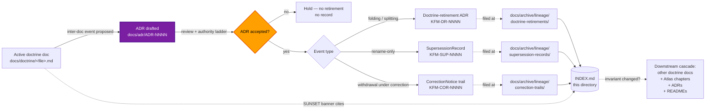

<!-- [KFM_META_BLOCK_V2]
doc_id: kfm://doc/<TODO-uuid>
title: Archived Lineage — Doctrine Documents
type: standard
version: v1
status: draft
owners:
  primary: Docs steward
  co_authoring: [subsystem owner(s) of affected doctrine, Release authority, Correction reviewer]
  notes: "Roles CONFIRMED per Atlas v1.1 Ch. 24.7.1. Co-authoring subsystem owners vary by which doctrine doc is retired — see §10 reflexive co-signing table."
created: 2026-05-25
updated: 2026-05-25
policy_label: public
related:
  - docs/archive/lineage/README.md
  - docs/archive/lineage/standards/README.md
  - docs/archive/lineage/runbooks/README.md
  - docs/archive/lineage/domains/README.md
  - docs/doctrine/README.md
  - docs/doctrine/directory-rules.md
  - docs/doctrine/lifecycle-law.md
  - docs/doctrine/authority-ladder.md
  - docs/doctrine/truth-posture.md
  - docs/doctrine/trust-membrane.md
  - docs/adr/
  - docs/registers/DRIFT_REGISTER.md
  - control_plane/deprecation_register.yaml
tags: [kfm, archive, lineage, doctrine, supersession, navigational, adr-mandatory, reflexive]
subject_taxonomy:
  confirmed_doctrine_docs:
    - directory-rules.md
    - lifecycle-law.md
    - authority-ladder.md
    - truth-posture.md
    - trust-membrane.md
  proposed_doctrine_docs:
    - corrections-first-class.md
    - derived-stays-derived.md
directory_rules_basis:
  - "§2.1   — Authority order: KFM core invariants and doctrine are layer 1 (highest)."
  - "§2.4   — ADR is required for any structural / doctrine-level change."
  - "§6.1   — docs/doctrine/ explicit enumeration (5 confirmed doctrine docs)."
  - "§6.1   — docs/archive/{lineage,exploratory,deprecated} sub-areas (CONFIRMED v1.3)."
  - "§21    — v1.2 → v1.3 changelog — in-document supersession precedent."
  - "Atlas v1.0 App. E + v1.1 App. G — in-document supersession-by-extension precedent."
  - "Atlas v1.1 Ch. 24.7.2 — atlas / supplement publication requires Docs steward + subsystem owner."
notes:
  - "The subfolder 'doctrine/' under docs/archive/lineage/ is a PROPOSED domain-segmented view, NEEDS VERIFICATION against ADR (analogous to OPEN-DR-02)."
  - "Records themselves live in the parent's flat record-category lanes; this directory is a navigational index, not a parallel filing authority."
  - "In-document version bumps (e.g., Directory Rules v1.2 → v1.3) DO NOT land here per §4."
  - "Every record indexed here is ADR-backed — the adr_ref field is mandatory and never null."
  - "directory-rules.md is itself one of the docs this view tracks; the self-referential wrinkle is documented in §1 and §12."
[/KFM_META_BLOCK_V2] -->

# 📜 Archived Lineage — Doctrine Documents

> Subject-indexed, navigational view of supersession lineage records pertaining to retired or superseded **foundational doctrine documents** under [`docs/doctrine/`](../../../doctrine/). Records remain filed by category in the parent archive — this directory curates them by doctrine doc.


<!-- TODO — replace placeholder Shields targets once the docs CI surface is verified. -->

**Status:** `draft` · **Primary owner:** Docs steward <sub>(role CONFIRMED · person TODO)</sub> · **Co-authoring:** subsystem owner(s) of affected doctrine, Release authority, Correction reviewer · **Last updated:** `2026-05-25`

> [!IMPORTANT]
> This directory is a **curatorial view**, not a parallel filing surface. Records are **filed** in the parent's record-category lanes — `docs/archive/lineage/{supersession-records,sunset-records,doctrine-retirements,correction-trails}/`. This `doctrine/` subdirectory holds **only** a README, an `INDEX.md`, and cross-references. Filing a record directly here creates parallel authority (Directory Rules §2.4(5)) and is **prohibited**.

> [!CAUTION]
> **In-document version bumps do not land here.** Doctrine docs use **supersession-by-extension** with in-document changelogs (e.g., Directory Rules v1.0 → v1.1 → v1.2 → v1.3 lives in `directory-rules.md` §21; Atlas v1.0 → v1.1 lives in v1.1 App. G). Routine version bumps within a single doctrine doc are **out of scope**. This view scopes only to **inter-doc events** — folding, splitting, renaming, or withdrawing a doctrine doc as a whole. See §4.

> [!WARNING]
> **Every record indexed here is ADR-backed.** Per Directory Rules §2.4, any structural or doctrine-level change requires an ADR. There is no equivalent of "routine doctrine retirement." The `adr_ref` INDEX field is **mandatory and never null** for records in this view.

---

## Contents

1. [Scope](#1-scope)
2. [Repo fit](#2-repo-fit)
3. [Inputs — what this view indexes](#3-inputs--what-this-view-indexes)
4. [Exclusions — what does not belong here](#4-exclusions--what-does-not-belong-here)
5. [Directory layout](#5-directory-layout)
6. [Index ↔ category mapping](#6-index--category-mapping)
7. [Subject-curation flow](#7-subject-curation-flow)
8. [Worked example — `corrections-first-class.md` and `derived-stays-derived.md`](#8-worked-example--corrections-first-classmd-and-derived-stays-derivedmd)
9. [Tracked doctrine docs and lineage candidates](#9-tracked-doctrine-docs-and-lineage-candidates)
10. [Authoring workflow](#10-authoring-workflow)
11. [Reflexive-authority protocol](#11-reflexive-authority-protocol)
12. [FAQ](#12-faq)
13. [Related docs](#13-related-docs)
14. [Per-root README contract](#14-per-root-readme-contract)
15. [Appendix](#15-appendix)

---

## 1. Scope

This directory provides a **subject-curated index** of lineage records that pertain to retired or superseded **foundational doctrine documents** under `docs/doctrine/`. It exists because:

- Doctrine docs sit at the **top of the authority order** (Directory Rules §2.1, layer 1 — above ADRs, this document, per-root READMEs, and dossiers). Their retirement events are the highest-impact lineage events KFM can produce. Curating them by subject makes the doctrinal continuity readable in one place. **[CONFIRMED via Directory Rules v1.3 §2.1.]**
- KFM doctrine evolves via **supersession-by-extension** with in-document changelogs (Directory Rules v1.0→v1.3 §21; Atlas v1.0→v1.1 App. G). Within-doc version lineage is solved in-place. **Inter-doc events** — folding two docs into one, splitting one into two, renaming the canonical path, withdrawing a doc — are different in kind: they leave a residue at the old path that needs archiving. That residue is what this view indexes. **[CONFIRMED via Directory Rules v1.3 §0 + §21; Atlas v1.0 App. E + v1.1 App. G.]**
- Every doctrine-level retirement is **ADR-backed** per Directory Rules §2.4. The `KFM-DR-NNNN` (doctrine-retirement) category in the parent README §8 was created for exactly this kind of event. **[CONFIRMED via Directory Rules v1.3 §2.4 + parent README §8.]**

The directory is **navigational**, not authoritative. The four record categories established by [`../README.md`](../README.md) §8 — `SupersessionRecord`, `SunsetRecord`, doctrine-retirement ADR, and `CorrectionNotice` trail — remain the **only** filing surfaces. For this view, **doctrine-retirement ADR is the dominant category** by a wide margin.

> [!NOTE]
> **Self-referential wrinkle.** One of the docs this view tracks — `docs/doctrine/directory-rules.md` — is also the authority that defines `docs/archive/lineage/`'s very placement (§6.1). If `directory-rules.md` is ever retired (extreme hypothetical), this README's authority basis shifts to whichever doctrine doc supersedes it. The append-only invariant of the archive ensures the prior structure remains queryable; the new structure is documented in the doctrine-retirement ADR.

[⬆ Back to top](#-archived-lineage--doctrine-documents)

---

## 2. Repo fit

This subfolder is a curated lens. It sits **inside** the documentation-surface lineage archive and points outward to active doctrine, to the ADRs that govern doctrine retirement, and to the category lanes where records actually live.

| Direction       | Surface                                                              | Relationship                                                                                                              | Status                  |
|-----------------|----------------------------------------------------------------------|---------------------------------------------------------------------------------------------------------------------------|-------------------------|
| Parent          | [`docs/archive/lineage/README.md`](../README.md)                     | Defines record categories and append-only invariant. This view inherits both.                                              | **CONFIRMED**           |
| Subject source  | [`docs/doctrine/README.md`](../../../doctrine/README.md)             | Active doctrine landing. Subject material of every record indexed here.                                                    | **CONFIRMED home per §6.1** |
| Subject sources | `docs/doctrine/{directory-rules,lifecycle-law,authority-ladder,truth-posture,trust-membrane}.md` | The 5 CONFIRMED doctrine docs per Directory Rules §6.1.                                                                    | **CONFIRMED enumeration · NEEDS VERIFICATION in mounted repo** |
| Subject sources (PROPOSED) | `docs/doctrine/{corrections-first-class,derived-stays-derived}.md` | PROPOSED doctrine docs referenced in earlier session work; their existence and canonical home is **OPEN ADR question**.   | **PROPOSED · ADR-pending** |
| Authority partner | [`docs/adr/`](../../../adr/)                                       | Doctrine-retirement records here **must** cross-link to an accepted ADR. The ADR is the authority; the record is the residue. | **CONFIRMED home**      |
| Filing lanes    | `docs/archive/lineage/{supersession-records,sunset-records,doctrine-retirements,correction-trails}/` | Where indexed records **actually** live. Doctrine-retirements (`KFM-DR-NNNN`) dominate.                                    | **PROPOSED**            |
| Sibling views   | [`docs/archive/lineage/standards/`](../standards/) · [`runbooks/`](../runbooks/) · [`domains/`](../domains/) | Other subject views. All four siblings share the parent's structure; this one differs in ADR-mandatory and inter-doc-only scoping. | **AUTHORED**            |
| Machine partner | [`control_plane/deprecation_register.yaml`](../../../../control_plane/deprecation_register.yaml) | Machine-readable register required by Directory Rules §14.2. Doctrine-retirement entries tagged `subject: doctrine/<doc>` map here. | **CONFIRMED via §14.2** |
| Drift detector  | [`docs/registers/DRIFT_REGISTER.md`](../../../registers/DRIFT_REGISTER.md) | Open drift entries about doctrine docs (e.g., naming variances, scope ambiguities) get linked here when the resolving ADR lands. | **CONFIRMED via §14.1** |
| Cross-citation registers | Atlas v1.1 Ch. 24.13 (Atlas ↔ Dossier ↔ Responsibility-Root Crosswalk), Atlas Ch. 24.14 (Object Family × Domain Matrix) | Doctrine retirements may invalidate authority citations across these registers; the `affects_atlas_chapters` INDEX field tracks the ripple. | **CONFIRMED context**   |
| Distinct        | In-document version-bump changelogs (e.g., `directory-rules.md` §21; Atlas App. G) | Doctrine docs handle version bumps **in-document** via supersession-by-extension. **Not indexed here** — see §4.            | **CONFIRMED — distinct**|
| Distinct        | The retired doctrine doc **itself**                                  | Stays at its original path under `docs/doctrine/` with a SUNSET banner. Never moved here.                                  | **CONFIRMED — distinct**|

[⬆ Back to top](#-archived-lineage--doctrine-documents)

---

## 3. Inputs — what this view indexes

A lineage record qualifies for indexing here when **all four** are true:

1. The **subject** is a markdown documentation surface under `docs/doctrine/<file>.md` — one of the five CONFIRMED doctrine docs, a PROPOSED doctrine doc (if authored standalone), or any future doctrine doc added by ADR.
2. The retirement is an **inter-doc event** — folding, splitting, renaming, withdrawing the doc as a whole. **Not** a within-doc version bump (those use the doc's own §-changelog per the Directory Rules / Atlas precedent).
3. A governed lineage **record exists** in one of the parent's category lanes — overwhelmingly `doctrine-retirements/` (Cat. 3); occasionally `supersession-records/` (renames without scope change) or `correction-trails/` (withdrawal under error).
4. An **accepted ADR** backs the retirement. Per Directory Rules §2.4, doctrine-level changes are ADR-class. `adr_ref` is mandatory.

The inter-doc event taxonomy:

| Event class                                  | Example                                                                                              | Likely record category                | ADR class                          |
|----------------------------------------------|-------------------------------------------------------------------------------------------------------|----------------------------------------|-------------------------------------|
| **Doctrine-doc folding**                     | Two doctrine docs are merged into one (e.g., `truth-posture.md` + `trust-membrane.md` → unified posture doc). | Doctrine-retirement ADR (`KFM-DR`)   | Mandatory ADR per §2.4(2)/(5)       |
| **Doctrine-doc splitting**                   | One doctrine doc is split into multiple (e.g., `directory-rules.md` §14 deprecation discipline extracted to its own doc). | Doctrine-retirement ADR (old retired) or `SupersessionRecord` (one of the new docs becomes the canonical successor) | Mandatory ADR per §2.4(5)           |
| **Doctrine-doc renaming**                    | `directory-rules.md` → `placement-doctrine.md` (no scope change, name only).                          | `SupersessionRecord` (rename-only)    | Mandatory ADR per §2.4(1) (renaming) |
| **Doctrine-doc home-question resolution**    | Atlas Ch. 24.12 **ADR-S-02** — should domain dossiers live under `docs/dossiers/` or `docs/atlases/`? Analogous question for doctrine. | `SupersessionRecord` or doctrine-retirement ADR | Mandatory ADR                       |
| **Standalone vs folded resolution**          | A PROPOSED doctrine doc (e.g., `corrections-first-class.md`) is authored standalone, then later folded into `lifecycle-law.md` by ADR. | Doctrine-retirement ADR (standalone retired) | Mandatory ADR                       |
| **Withdrawal under correction**              | A doctrine doc is withdrawn because its claims were materially wrong (extreme — KFM doctrinal correction). | `CorrectionNotice` trail              | Mandatory ADR + Correction reviewer |
| **Compatibility-root promotion / retirement** | A compatibility root is promoted to canonical or a canonical root is deprecated; the relevant doctrine paragraph is retired. | Doctrine-retirement ADR               | Mandatory ADR per §2.4(2)           |

> [!TIP]
> If the change can be accommodated by adding a `vN.M` section + changelog to the existing doctrine doc, **it is not an inter-doc event** — handle it with supersession-by-extension and update the doc's own changelog. This view captures only events where the doc as a whole comes off the active surface.

[⬆ Back to top](#-archived-lineage--doctrine-documents)

---

## 4. Exclusions — what does not belong here

| Out of scope                                                    | Why                                                                              | Goes instead to                                                          |
|-----------------------------------------------------------------|-----------------------------------------------------------------------------------|---------------------------------------------------------------------------|
| **Within-doc version bumps** (e.g., Directory Rules v1.2 → v1.3) | Doctrine docs use supersession-by-extension with in-document changelogs (e.g., `directory-rules.md` §21). v1.0 text is preserved verbatim, later versions are additive. The retirement event is the **named version**, recorded in §21, not in this archive. | The doctrine doc's own `§N` changelog (e.g., Directory Rules §21).        |
| **Atlas / supplement supersession** (e.g., Atlas v1.0 → v1.1)   | Per Atlas v1.1 Ch. 24.8.2, atlas supersession lives in-document (App. E / App. G). The Atlas isn't even a doctrine doc — it's a dossier-class artifact under `docs/atlases/`. | Inside the Atlas / supplement itself.                                    |
| **Per-domain doc retirements** (e.g., `docs/domains/<domain>/<file>.md`) | Those go to the sibling `docs/archive/lineage/domains/` view.                     | [`docs/archive/lineage/domains/`](../domains/)                            |
| **Runbook / standards doc retirements**                         | Those go to the sibling views for runbooks and standards.                          | [`docs/archive/lineage/{runbooks,standards}/`](../)                       |
| The retired doctrine doc itself                                 | Retired docs remain at their `docs/doctrine/<file>.md` path with a SUNSET banner. | Original path, with `status: deprecated` in its meta block                |
| The **actual** record file (`KFM-DR-NNNN-*.md`, etc.)           | Records live in the parent's category lanes; filing here creates parallel authority. | `docs/archive/lineage/<category>/KFM-<PREFIX>-NNNN-<slug>.md`            |
| ADR working drafts                                              | Drafts live with active ADRs; only the *retirement* trail lands here.             | `docs/adr/` working area                                                 |
| Active deprecation entries (pre-sunset)                         | Still doing governance work; not yet historical.                                  | `control_plane/deprecation_register.yaml` <sub>CONFIRMED via §14.2</sub> |
| Schema / contract / policy supersession                         | Per Atlas v1.1 Ch. 24.8.2, schemas use in-header pattern; policies use ADR + link. | Schema header + ADR; policy file + ADR                                   |
| Open `DRIFT_REGISTER.md` entries                                | Drift is detection-stage; not yet a retirement.                                   | `docs/registers/DRIFT_REGISTER.md`                                       |
| Compatibility-root mirror edits (e.g., `policies/` vs `policy/`) | Mirror evolution follows canonical; mirror-only edits don't retire the doctrine doc describing them. | Compatibility-root README + canonical doctrine                           |
| AI-generated retirement proposals                               | Drafts have no archive identity until promoted via authority ladder.              | Working branches; tracked via `AIReceipt`                                |

> [!CAUTION]
> **The within-doc version-bump exclusion is the most consequential.** Directory Rules v1.0 → v1.1 → v1.2 → v1.3 has produced four version steps already, and every one stayed in-document per the v1.3 §0 "Supersedes v1.2" line + §21 changelog. None of those events landed in this archive, and none should. The pattern is intentional: doctrine evolves by extension, prior text is preserved verbatim, the doc retains a single canonical path. Inter-doc events are the rare exception, not the rule.

[⬆ Back to top](#-archived-lineage--doctrine-documents)

---

## 5. Directory layout

The subfolder is **PROPOSED**; its placement under `docs/archive/lineage/` inherits the CONFIRMED parent path (Directory Rules §6.1) but the subject-segmented sub-lane itself awaits ADR ratification. The layout is intentionally minimal — this is a view, not a filing surface.

```text
docs/archive/lineage/doctrine/
├── README.md          # this file
└── INDEX.md           # curated cross-listing of doctrine-doc retirement records (PROPOSED — generator-driven)
```

No `KFM-SUP-*`, `KFM-SUN-*`, `KFM-DR-*`, or `KFM-COR-*` record files live here. Those remain at:

```text
docs/archive/lineage/
├── supersession-records/KFM-SUP-NNNN-<slug>.md
├── sunset-records/KFM-SUN-NNNN-<slug>.md
├── doctrine-retirements/KFM-DR-NNNN-<slug>.md   ← dominant category for this view
└── correction-trails/KFM-COR-NNNN-<slug>.md
```

`INDEX.md` cross-references the subset of those records whose `subject` field names a file under `docs/doctrine/`.

> [!NOTE]
> Because doctrine retirements are rare and ADR-backed, this view's `INDEX.md` is expected to grow slowly. A doctrine doc may sit on the active surface for years before any inter-doc event occurs. This is by design.

[⬆ Back to top](#-archived-lineage--doctrine-documents)

---

## 6. Index ↔ category mapping

`INDEX.md` is the only durable artifact in this directory besides the README. The schema below extends the parent schema with five doctrine-specific columns. `adr_ref` is **mandatory** — never null.

| INDEX column                  | Source                                              | Notes                                                                                       |
|--------------------------------|-----------------------------------------------------|----------------------------------------------------------------------------------------------|
| `record_id`                   | Filename stem in the parent category lane          | e.g., `KFM-DR-0042`                                                                          |
| `category`                    | Parent subdirectory                                 | Almost always `doctrine-retirement`; rarely `supersession` (renames) or `correction-trail`.   |
| `subject_path`                | Field inside the record                            | e.g., `docs/doctrine/truth-posture.md`                                                       |
| `doctrine_doc`                | Subject taxonomy *(doctrine-specific)*             | The doctrine doc filename — one of the 5 CONFIRMED or future-added docs.                     |
| `kfm_invariant_changed`       | Field inside the record *(doctrine-specific)*      | Boolean. `true` if the retirement changes a KFM core invariant (lifecycle, trust membrane, cite-or-abstain, watcher-as-non-publisher, authority ladder). |
| `affects_downstream_doctrine` | Field inside the record *(doctrine-specific)*      | List of other doctrine docs whose authority basis citations need updating.                   |
| `affects_atlas_chapters`      | Field inside the record *(doctrine-specific)*      | Atlas v1.1 chapters whose authority citation changes (e.g., Atlas Ch. 24.13 cites `directory-rules.md` §5). |
| `pre_adr_drift_resolved`      | Field inside the record *(doctrine-specific)*      | List of `DRIFT_REGISTER.md` entries that resolve with this record.                           |
| `successor_id`                | Field inside the record                            | Successor record ID, or successor doctrine-doc path. May be a fold target (the doc absorbing the retired content). |
| `retired_at`                  | Field inside the record                            | ISO date.                                                                                     |
| `adr_ref`                     | **MANDATORY** — never null for this view           | e.g., `ADR-0003`, `ADR-S-02`. Doctrine retirement without ADR is invalid per Directory Rules §2.4. |
| `authority_ladder_signoff`    | Field inside the record                            | Comma-separated role list — Docs steward + subsystem owner(s) per §10 / §11.                  |
| `deprecation_register_entry`  | `control_plane/deprecation_register.yaml`           | Cross-ref ID; required if the retirement had a deprecation window.                            |

> [!IMPORTANT]
> The five doctrine-specific columns come from fields **inside** the record file. If `adr_ref` is missing or `null`, the record fails validation and cannot be indexed — the ADR must be drafted, reviewed, and accepted **before** the record is filed. There is no exception.

[⬆ Back to top](#-archived-lineage--doctrine-documents)

---

## 7. Subject-curation flow

The diagram shows how a doctrine-doc retirement flows through ADR acceptance and lands as a cross-reference in this view's `INDEX.md`. The ADR-mandatory gate is explicit.



> [!WARNING]
> The diagram is **conceptual**. No doctrine doc has been retired yet; the flow is exercised against the open question in §8 as a worked example. The ADR-mandatory gate (purple) and acceptance gate (orange) are the load-bearing nodes — every other step is mechanical once they clear.

[⬆ Back to top](#-archived-lineage--doctrine-documents)

---

## 8. Worked example — `corrections-first-class.md` and `derived-stays-derived.md`

The cleanest concrete candidates for this view are two PROPOSED doctrine docs referenced in earlier session work but **not** in Directory Rules §6.1's confirmed enumeration:

- `docs/doctrine/corrections-first-class.md` — the doctrine that "corrections are first-class artifacts" per KFM core invariant §10.9.
- `docs/doctrine/derived-stays-derived.md` — the doctrine that "derived artifacts are not sovereign truth" per KFM core invariant §10.7.

**State today (CONFIRMED ambiguity):** Both names are referenced in prior-session work; neither is in Directory Rules v1.3 §6.1's CONFIRMED enumeration of `docs/doctrine/` files. The corresponding **principles** are confirmed doctrine (they appear as KFM core invariants in the AI Build Operating Contract §10), but the **file homes** are open: either each becomes a standalone doctrine doc, or each is folded into an existing doctrine doc (`lifecycle-law.md` is the natural home for `corrections-first-class.md`; `truth-posture.md` or `trust-membrane.md` for `derived-stays-derived.md`).

**The home question is ADR-class** per Directory Rules §2.4(1) — adding, removing, or renaming a doctrine doc is structural and requires an ADR.

**Three resolution paths and the lineage events each produces:**

| Path | Outcome                                                              | Lineage event                                                                 | Record category               |
|------|-----------------------------------------------------------------------|--------------------------------------------------------------------------------|-------------------------------|
| **A** | ADR creates both as standalone doctrine docs (new files authored).   | *No retirement event* — net addition only. Nothing lands here.                | (no record)                   |
| **B** | ADR folds both into existing doctrine docs (no new files; principles handled by section additions to `lifecycle-law.md` and `truth-posture.md`). | *No retirement event* — but Directory Rules §6.1 enumeration may need updating in a v1.4 in-document changelog. Nothing lands here. | (no record)                   |
| **C** | ADR creates them standalone first, then a **later** ADR folds them into existing doctrine docs (e.g., as KFM matures and the standalone framing proves unnecessary). | **Doctrine-retirement ADR** filed for each standalone doc; both filings land here. | `doctrine-retirements/KFM-DR-NNNN` × 2 |

**Sketch of a Path C INDEX row** (hypothetical; for illustration only):

| record_id     | category             | subject_path                                         | doctrine_doc                  | kfm_invariant_changed | affects_downstream_doctrine | affects_atlas_chapters | adr_ref     |
|---------------|----------------------|-------------------------------------------------------|-------------------------------|------------------------|------------------------------|------------------------|-------------|
| `KFM-DR-NNNN` | doctrine-retirement  | `docs/doctrine/corrections-first-class.md`           | `corrections-first-class.md`  | `false` (principle preserved, only the surface changes) | `[lifecycle-law.md]` (fold target) | `[Ch. 24.6 row "Correction (PUBLISHED → PUBLISHED')"]` | `ADR-NNNN`  |
| `KFM-DR-NNNN+1` | doctrine-retirement | `docs/doctrine/derived-stays-derived.md`              | `derived-stays-derived.md`    | `false` (principle preserved) | `[truth-posture.md]` (fold target) | `[Ch. 24.9 Anti-Pattern Register]`   | `ADR-NNNN`  |

**Why this is a useful worked example** even though no record exists yet:

1. It demonstrates that **null successor is acceptable** for fold-into-existing events — the successor is the absorbing doc, not a peer-level new doc.
2. It demonstrates `kfm_invariant_changed: false` — the **principle** is unchanged; only the **surface** moves. Most fold events look like this.
3. It demonstrates the **downstream-doctrine cascade**: when `corrections-first-class.md` folds into `lifecycle-law.md`, every doc that cites `docs/doctrine/corrections-first-class.md` (the prior parent README I revised cites it — see §12 below) needs its citations updated. The `affects_downstream_doctrine` field tracks the fan-out.

> [!TIP]
> Until the ADRs land, **the home question is tracked in `DRIFT_REGISTER.md`**, not here. New citations from other docs should treat `corrections-first-class.md` and `derived-stays-derived.md` as PROPOSED locations and add `NEEDS VERIFICATION` annotations. Do not invent the files just to make citations resolve.

### Secondary candidate — doctrine-doc home dispute (analogous to `OPEN-DR-01` for standards)

A second class of candidate is a future home-dispute analogous to Directory Rules §18 OPEN-DR-01 (`PROV.md` vs `PROVENANCE.md`) but applied to a doctrine doc. For example, if `directory-rules.md` were ever proposed for rename to `placement-doctrine.md` (no scope change, name only), that would be a `SupersessionRecord` (rename-only) with `adr_ref` set to the renaming ADR. The doc-surface continuity rule (Directory Rules §14.1 routine move) applies.

[⬆ Back to top](#-archived-lineage--doctrine-documents)

---

## 9. Tracked doctrine docs and lineage candidates

This table inventories the doctrine-doc population currently in scope, drawn from Directory Rules v1.3 §6.1 illustrative listing and from PROPOSED docs in earlier session work. **PROPOSED** in scope; **CONFIRMED enumeration** at the v1.3 §6.1 level.

| Doctrine doc                          | Authority basis                                                                 | Authored?                                    | Open lineage candidate                                          |
|----------------------------------------|----------------------------------------------------------------------------------|----------------------------------------------|------------------------------------------------------------------|
| `docs/doctrine/directory-rules.md`     | Canonical placement & lifecycle doctrine (`[DIRRULES]`). Current: **v1.3**.      | **CONFIRMED** (in §6.1; v1.0 → v1.3 in-doc)  | Hypothetical rename only (e.g., to `placement-doctrine.md`).     |
| `docs/doctrine/lifecycle-law.md`       | Publication lifecycle and correction/rollback invariant.                          | **CONFIRMED** (in §6.1)                      | Potential fold target for `corrections-first-class.md`.          |
| `docs/doctrine/authority-ladder.md`    | Role-based sign-off ordering (Atlas v1.1 Ch. 24.7.1).                            | **CONFIRMED** (in §6.1)                      | Reflexive-authority case — see §11.                              |
| `docs/doctrine/truth-posture.md`       | Cite-or-abstain stance; never-flatten-uncertainty rule.                          | **CONFIRMED** (in §6.1)                      | Potential fold target for `derived-stays-derived.md`.            |
| `docs/doctrine/trust-membrane.md`      | Public-surface boundary; deny-by-default for sensitive lanes.                    | **CONFIRMED** (in §6.1)                      | Potential fold target for `derived-stays-derived.md` (alt).      |
| `docs/doctrine/corrections-first-class.md` | KFM core invariant §10.9 — corrections are first-class artifacts.            | **PROPOSED** (referenced in prior-session work; not in §6.1) | Home question — see §8.                                          |
| `docs/doctrine/derived-stays-derived.md` | KFM core invariant §10.7 — derived artifacts are not sovereign truth.          | **PROPOSED** (referenced in prior-session work; not in §6.1) | Home question — see §8.                                          |

**KFM core invariants and their nominal doctrine docs (per AI Build Operating Contract §10):**

| Core invariant                                         | Nominal doctrine doc (PROPOSED or CONFIRMED)                            |
|--------------------------------------------------------|--------------------------------------------------------------------------|
| §10.1 Lifecycle law                                    | `lifecycle-law.md` <sub>CONFIRMED</sub>                                  |
| §10.2 Public trust membrane                            | `trust-membrane.md` <sub>CONFIRMED</sub>                                 |
| §10.3 Cite-or-abstain                                  | `truth-posture.md` <sub>CONFIRMED</sub>                                  |
| §10.4 Policy-aware and fail-closed                     | (none yet; PROPOSED candidate `policy-posture.md` not in §6.1)           |
| §10.5 AI is interpretive                               | (governed AI doctrine in `[GAI]` dossier; not under `docs/doctrine/`)    |
| §10.6 `EvidenceBundle` outranks generated language     | `truth-posture.md` (covers via cite-or-abstain) <sub>CONFIRMED</sub>     |
| §10.7 Derived artifacts are not sovereign truth        | `derived-stays-derived.md` <sub>PROPOSED — home question</sub>           |
| §10.8 Promotion is auditable                           | `lifecycle-law.md` (covers via lifecycle + receipts) <sub>CONFIRMED</sub> |
| §10.9 Corrections are first-class                      | `corrections-first-class.md` <sub>PROPOSED — home question</sub>         |
| §10.10 Deterministic identity where practical          | (cross-cutting; not yet a dedicated doctrine doc)                        |

> [!NOTE]
> The mapping above is **INFERRED** from the operating contract §10. Confirming which invariant has a dedicated doctrine doc vs being covered as a section inside another requires inspecting the mounted repo. The home questions for §10.7 and §10.9 are the most actionable open items and the basis for the §8 worked example.

[⬆ Back to top](#-archived-lineage--doctrine-documents)

---

## 10. Authoring workflow

The flow below is **PROPOSED** and inherits the parent archive's workflow with **two doctrine-specific gates**: an accepted ADR must precede the record, and reflexive co-signing applies per §11. Confirm against any existing runbook before treating it as official.

1. **ADR drafted and accepted.** Per Directory Rules §2.4, any structural doctrine-level change requires an ADR. Draft, review, and accept the ADR **before** filing the record. An ADR in `proposed` status cannot back a record here.
2. **Cascade analysis.** Before drafting the record, the Docs steward walks:
   - Other `docs/doctrine/<file>.md` files for citations of the retiring doc (populates `affects_downstream_doctrine`).
   - Atlas v1.1 chapters whose authority basis cites the retiring doc (populates `affects_atlas_chapters` — e.g., Ch. 24.13 cites `directory-rules.md` §5).
   - `DRIFT_REGISTER.md` entries that resolve with the retirement (populates `pre_adr_drift_resolved`).
   - All four sibling subject views (`standards/`, `runbooks/`, `domains/`, this view's own README) for any cross-link that may need updating.
3. **Invariant-change classification.** Determine whether the retirement changes a KFM core invariant (lifecycle, trust membrane, cite-or-abstain, watcher-as-non-publisher, authority ladder). Most fold/split events preserve invariants; renames always preserve invariants; withdrawals under correction may change invariants. The classification populates `kfm_invariant_changed`.
4. **Trigger event.** ADR is accepted and the structural change is executed (e.g., fold complete; rename complete; file withdrawn).
5. **Record filed in the parent category lane** — almost always `docs/archive/lineage/doctrine-retirements/KFM-DR-NNNN-<slug>.md`. **Never filed here.**
6. **Reflexive authority co-signing** per §11. The co-signers depend on which doctrine doc is affected.
7. **Index cross-listing.** A row is added to this view's `INDEX.md` (generator-driven if available, otherwise hand-maintained by Docs steward).
8. **SUNSET banner.** The retired doc at `docs/doctrine/<file>.md` keeps its banner and gains a citation to the new record ID and the ADR.
9. **Cross-doctrine notification.** For every doctrine doc in `affects_downstream_doctrine`, the corresponding subsystem owner is notified and citation updates are queued (handled in each downstream doc's own §-changelog, not by editing this view's archive).
10. **Atlas chapter notification.** For every Atlas chapter in `affects_atlas_chapters`, the next Atlas edition's App. G-equivalent gains a line noting the doctrine-doc citation refresh. Atlas v1.1 Ch. 24.13's crosswalk specifically calls out `[DIRRULES]` citations — those rows need refresh if the affected doctrine doc is `directory-rules.md`.
11. **Drift resolution.** Every entry in `pre_adr_drift_resolved` is closed in `DRIFT_REGISTER.md` with a link to the ADR and the record.
12. **Compatibility / mirror sweep.** If the retired doctrine doc described a canonical/compatibility split (e.g., `policy/` vs `policies/`), inspect compatibility-root READMEs for stale citations — those edits land in the compatibility README, not here.

> [!WARNING]
> Step 1 (accepted ADR) is **non-negotiable**. An accepted ADR is the entry ticket. There is no shortcut, no emergency override, and no "we'll write the ADR later." If the change is too urgent to wait for ADR acceptance, the change isn't a doctrine retirement — it's something else (drift, correction, or a stop-the-world incident handled outside the lineage system).

[⬆ Back to top](#-archived-lineage--doctrine-documents)

---

## 11. Reflexive-authority protocol

Doctrine retirements are unique in that **the doc being retired may itself define the authority required to retire it**. This is most acute for `authority-ladder.md`, but applies in subtler ways to all five confirmed doctrine docs. This section codifies the co-signing matrix.

**Per-doctrine-doc co-signing requirements** (in addition to Docs steward primary sign-off):

| Doctrine doc being retired              | Required co-signers (Atlas v1.1 Ch. 24.7.2 mapping)                                          | Notes                                                                       |
|------------------------------------------|-----------------------------------------------------------------------------------------------|------------------------------------------------------------------------------|
| `directory-rules.md`                    | At least one of each canonical-root subsystem owner (apps, packages, schemas, contracts, policy, data, release) | Directory Rules is structural; retirement affects every root. Broad sign-off required. |
| `lifecycle-law.md`                      | Release authority + at least one subsystem owner with publication scope (apps/governed-api, release) | Lifecycle changes touch every promotion gate.                                |
| `authority-ladder.md`                   | **Every named role in the ladder being retired**: Source steward, Domain steward, Sensitivity reviewer, Rights-holder rep, Release authority, Correction reviewer, AI surface steward, Docs steward | **Most reflexive case.** Retiring the ladder requires all the roles the ladder defines. |
| `truth-posture.md`                      | AI surface steward + Correction reviewer + at least one subsystem owner                       | Touches cite-or-abstain stance; AI surfaces and corrections are most exposed. |
| `trust-membrane.md`                     | API engineer (governed API) + UI/map engineer + Security reviewer                             | Touches public-surface boundary; security and UI are most exposed.           |
| Future doctrine doc (e.g., `corrections-first-class.md`) | Docs steward + Correction reviewer + at least one subsystem owner                | Co-signing follows the principle the doc encodes.                            |

**The reflexive-authority paradox and its resolution:**

The textbook concern is "what if `authority-ladder.md` is retired and the very ladder it defines is needed to sign off on its own retirement?" The KFM resolution per Atlas v1.1 Ch. 24.7.2 maturity note is that **the prior version of the ladder remains in force until the successor version is accepted**. The supersession-by-extension precedent means the retired doc's roles continue to operate until the moment of acceptance; the new doc's roles begin operating from that moment forward. There is no authority gap.

This is mechanically the same as how Atlas v1.0 → v1.1 worked: v1.0 retained authority over its original content even after v1.1 was published. The retired doc is **not** authority-free; it is **prior-edition authority**.

> [!CAUTION]
> The reflexive protocol **does not gate authoring** — it gates **acceptance**. A draft retirement ADR can be prepared by anyone with edit access; it cannot be accepted (and therefore cannot back a record here) until all required co-signers have signed off. CI should fail any PR that attempts to add an INDEX row whose ADR does not carry the required signatures.

[⬆ Back to top](#-archived-lineage--doctrine-documents)

---

## 12. FAQ

<details>
<summary><b>Why is there a <code>doctrine/</code> subfolder if records don't live in it?</b></summary>

Because doctrine retirements are rare, high-impact, and deeply cited across the rest of the repo. When a reviewer asks "what doctrine docs have ever been retired, and what does each retirement cascade through?" they should be able to answer it in one place. The trade-off is that this directory must be **strictly navigational** — filing records here would create parallel authority with the parent's category lanes. The subfolder is PROPOSED (analogous to Directory Rules §18 OPEN-DR-02); an ADR may eventually replace it with a tag-based view inside the parent's `INDEX.md`.

</details>

<details>
<summary><b>Does Directory Rules v1.2 → v1.3 land here?</b></summary>

**No.** Directory Rules uses supersession-by-extension with an in-document §21 changelog. v1.0 text is preserved verbatim in §§1–20; v1.1, v1.2, and v1.3 additions are visibly marked. The named-version retirement event lives in the §21 changelog, **not** in this archive. The same applies to any other doctrine doc's version bumps.

</details>

<details>
<summary><b>Does Atlas v1.0 → v1.1 land here?</b></summary>

**No, for two reasons.** First, the Atlas isn't a doctrine doc — it's a dossier-class artifact under `docs/atlases/`. Second, even within its own scope, the Atlas uses in-document App. E / App. G supersession per Ch. 24.8.2 — the lineage is inside the v1.1 PDF. Both rules push this out of scope here; if anything Atlas-related landed in the lineage archive, it would land in the sibling `domains/` view's exclusion list, not here.

</details>

<details>
<summary><b>What about the self-referential case — what if <code>directory-rules.md</code> itself is retired?</b></summary>

Extreme hypothetical, but the protocol is well-defined:

1. An ADR retiring `directory-rules.md` (or renaming it, or splitting it) is drafted.
2. The retirement is **structural** per its own §2.4(1) — adding/removing/renaming a canonical root or doctrine doc is ADR-class.
3. Because Directory Rules **defines** `docs/archive/lineage/` (§6.1), the retirement ADR must explicitly carry forward that placement, or specify the new placement, or retire the archive itself. The successor must answer the question "where does this view live now?"
4. The retirement record is filed at `docs/archive/lineage/doctrine-retirements/KFM-DR-NNNN-directory-rules-<event>.md` — **at the path the prior Directory Rules defined**.
5. From the moment the new doctrine doc is accepted, all future records use the new placement (if any) — but the historical record at the old path remains queryable per the append-only invariant.

The append-only invariant ensures the doctrinal history is recoverable across this kind of transition.

</details>

<details>
<summary><b>Why must every record here be ADR-backed?</b></summary>

Because Directory Rules §2.4 says so. The five ADR-required cases enumerated there all apply to doctrine-doc retirements:

- §2.4(1) — adding, removing, or renaming a canonical root (doctrine docs are not roots, but the policy applies by analogy because doctrine docs **define** the roots).
- §2.4(2) — promoting / deprecating a canonical or compatibility root (doctrine docs describe the canonical/compatibility split; retiring such a doc requires reauthoring the rule).
- §2.4(5) — creating a parallel home for any of schemas/contracts/policy/sources/registries/releases/proofs/receipts. Doctrine docs describe these homes; folding/splitting touches the rule.
- §2.4(6) — bending any KFM core invariant. Doctrine docs encode invariants directly.

No category of doctrine-doc retirement falls outside the ADR requirement. The `adr_ref` field's mandatoriness is doctrinal, not bureaucratic.

</details>

<details>
<summary><b>What's the difference between this view and just searching <code>docs/adr/</code>?</b></summary>

The ADR is the **authority** for a doctrine retirement; the record in `doctrine-retirements/` is the **residue** of executing it. They contain different things:

- The ADR says "we are folding X into Y, here is why, here is the migration plan, here is the rollback plan." It is forward-looking and ratified at acceptance time.
- The record says "X was retired on date T per ADR-N, cascading into doctrine docs A, B, atlas chapters C, D, drift entries E, F." It is backward-looking and filed after the change executes.

This view cross-references the records — not the ADRs themselves. ADRs are searched in `docs/adr/`. Records are indexed here. Both are necessary; neither subsumes the other.

</details>

<details>
<summary><b>Can a doctrine retirement happen without changing a KFM core invariant?</b></summary>

Yes, and most do. The `kfm_invariant_changed` boolean is `false` for:

- Renames (e.g., `directory-rules.md` → `placement-doctrine.md`).
- Folds where the principle is preserved on the absorbing doc.
- Splits where the original scope is fully covered by the children.

The boolean is `true` only for retirements that **change a KFM core invariant** (rare). Those carry the highest review burden and may themselves trigger Atlas-level supersession-by-extension at the next Atlas edition.

</details>

<details>
<summary><b>Does this view interact with the <code>SLSA</code>, <code>cosign</code>, <code>Rekor</code> attestation chain?</b></summary>

Indirectly. Doctrine retirements may invalidate or supersede policy-as-code rules that the attestation chain enforces (e.g., signing policies). When a doctrine-doc retirement affects policy enforcement, the corresponding policy-as-code change has its own supersession in the schema/policy header per Atlas Ch. 24.8.2 — that doesn't land here. But the doctrine-doc retirement itself may reference the policy update as a downstream effect via `affects_downstream_doctrine` or similar.

</details>

<details>
<summary><b>How does this view interact with PROPOSED doctrine docs like <code>corrections-first-class.md</code>?</b></summary>

Until the home-question ADR resolves (see §8), PROPOSED doctrine docs do **not** appear in `INDEX.md`. They appear in this README's §9 inventory as tracking entries with the home question flagged. Once the ADR resolves:

- If standalone authoring + later fold (Path C in §8): two retirement records eventually land here.
- If folded immediately (Path B): the principle is documented in section additions to existing doctrine docs; no retirement event; nothing here.
- If standalone permanently (Path A): no retirement event unless and until a future fold ADR is filed.

</details>

<details>
<summary><b>How does this differ from the three sibling views?</b></summary>

Same structural pattern (navigational view, not a filing surface, inherits parent record categories), but with three distinguishing constraints:

1. **ADR-mandatory.** Standards, runbooks, and domain-doc retirements can happen with various trigger artifacts. Doctrine retirements require an accepted ADR — no exceptions.
2. **In-document version bumps are excluded.** Standards profiles, runbooks, and domain docs may or may not use supersession-by-extension. Doctrine docs consistently do, so version bumps stay in-doc.
3. **Reflexive-authority protocol.** Doctrine docs may define the very authority required to retire them. §11 codifies the resolution; no sibling view has this concern.

</details>

<details>
<summary><b>Can AI draft a doctrine-retirement record?</b></summary>

AI may **draft** record prose, summarize the ADR rationale, and propose cascade analysis (which downstream doctrine docs, Atlas chapters, drift entries are affected). AI may **not** decide that a doctrine retirement is warranted, set the ADR, or sign off. The relevant subsystem owners and the Docs steward make those calls. Per the AI rule, AI is interpretive — never the root truth source.

</details>

[⬆ Back to top](#-archived-lineage--doctrine-documents)

---

## 13. Related docs

The paths below cite Directory Rules v1.3 §6.1 placements. Per-doc paths under `docs/doctrine/` are CONFIRMED **homes** per §6.1; **presence** in a mounted repo remains NEEDS VERIFICATION.

**Parent archive and siblings (CONFIRMED canonical):**

- [`docs/archive/lineage/README.md`](../README.md) — parent archive, record categories, append-only invariant.
- [`docs/archive/lineage/standards/README.md`](../standards/README.md) — sibling subject view (external standards).
- [`docs/archive/lineage/runbooks/README.md`](../runbooks/README.md) — sibling subject view (operational runbooks).
- [`docs/archive/lineage/domains/README.md`](../domains/README.md) — sibling subject view (domain documentation).
- [`docs/archive/exploratory/`](../../exploratory/) — superseded exploratory work (sibling, distinct purpose).
- [`docs/archive/deprecated/`](../../deprecated/) — archived content without successors (sibling, distinct purpose).

**Active subject material (CONFIRMED home per §6.1; presence NEEDS VERIFICATION):**

- [`docs/doctrine/README.md`](../../../doctrine/README.md) — active doctrine landing.
- [`docs/doctrine/directory-rules.md`](../../../doctrine/directory-rules.md) — canonical placement & lifecycle doctrine; **defines this archive's own placement** via §6.1.
- [`docs/doctrine/lifecycle-law.md`](../../../doctrine/lifecycle-law.md) — publication and supersession discipline.
- [`docs/doctrine/authority-ladder.md`](../../../doctrine/authority-ladder.md) — role-based sign-off; basis for §10 + §11 protocols.
- [`docs/doctrine/truth-posture.md`](../../../doctrine/truth-posture.md) — cite-or-abstain stance preserved by records here.
- [`docs/doctrine/trust-membrane.md`](../../../doctrine/trust-membrane.md) — public-surface boundary; deny-by-default discipline.

**Proposed subject material (NEEDS VERIFICATION / ADR-pending):**

- `docs/doctrine/corrections-first-class.md` *(PROPOSED — see §8)*.
- `docs/doctrine/derived-stays-derived.md` *(PROPOSED — see §8)*.

**ADR authority (CONFIRMED home):**

- [`docs/adr/`](../../../adr/) — every record indexed here cross-links to an ADR here.
- [`docs/adr/ADR-0001-schema-home.md`](../../../adr/ADR-0001-schema-home.md) — schema-home rule (precedent for doctrine-doc ADR shape).

**Atlas references (CONFIRMED doctrine; in-document for Atlas-level supersession):**

- *Atlas v1.0 Appendix E + v1.1 Appendix G* — in-document supersession-by-extension precedent that doctrine docs follow.
- *Atlas v1.1 Ch. 24.7* — Reviewer role and separation-of-duties matrix (basis for §10 + §11 protocols).
- *Atlas v1.1 Ch. 24.8.2* — Object class supersession rules; **atlas / supplement supersession lives in-document** (precedent applied to doctrine).
- *Atlas v1.1 Ch. 24.12* — Open-ADR Backlog including ADR-S-15 (Atlas / supplement lifecycle) — analogous doctrine-doc lifecycle ADR pending.
- *Atlas v1.1 Ch. 24.13* — Atlas section ↔ dossier ↔ responsibility-root crosswalk — cascade target when doctrine-doc retirement touches `[DIRRULES]` citations.

**Operating contract:**

- *AI Build Operating Contract §10* — KFM core invariants (§10.1 through §10.10); basis for §9 invariant-to-doc mapping.

**Registers and machine partners:**

- [`docs/registers/DRIFT_REGISTER.md`](../../../registers/DRIFT_REGISTER.md) — drift entries resolved by doctrine retirements populate `pre_adr_drift_resolved`.
- [`docs/registers/CANONICAL_LINEAGE_EXPLORATORY.md`](../../../registers/CANONICAL_LINEAGE_EXPLORATORY.md) — canonical / lineage / exploratory classification.
- [`control_plane/deprecation_register.yaml`](../../../../control_plane/deprecation_register.yaml) — machine-readable deprecation register (Directory Rules §14.2).

> [!NOTE]
> Related-doc **paths** cite Directory Rules §6.1 placements. Per-doc **presence** in the mounted repo remains NEEDS VERIFICATION — leave links in place with `NEEDS VERIFICATION` annotations rather than removing them.

[⬆ Back to top](#-archived-lineage--doctrine-documents)

---

## 14. Per-root README contract

Directory Rules §15 requires every canonical root and compatibility root to carry a `README.md` with a fixed shape. This subdirectory is not a canonical or compatibility root (it is a curated view under one), but the §15 contract is applied here as a courtesy and a forcing function.

| Field                  | Value                                                                                                                                          |
|------------------------|------------------------------------------------------------------------------------------------------------------------------------------------|
| **Purpose**            | Navigational subject-index of supersession lineage records pertaining to foundational doctrine documents under `docs/doctrine/`.               |
| **Authority level**    | **archive — navigational view** (not a filing surface; records live in parent category lanes).                                                 |
| **Status**             | `PROPOSED` for this subfolder convention; `CONFIRMED` for the parent `docs/archive/lineage/` placement and the `docs/doctrine/` tree per Directory Rules §6.1. |
| **What belongs here**  | This README and an `INDEX.md` cross-listing **inter-doc** doctrine retirements filed in parent category lanes — see §3.                        |
| **What does NOT belong here** | Record files themselves (parallel-authority risk); the retired doc (stays at `docs/doctrine/`); **in-document version bumps** (e.g., Directory Rules v1.2 → v1.3 in §21 changelog); Atlas / supplement supersession; per-domain / runbook / standards retirements (siblings); schema / policy supersession — see §4. |
| **Inputs**             | **Accepted ADR (mandatory)**; sign-off from authority ladder upstream **including required reflexive co-signers per §11**; record file presence in parent category lane; entries in `control_plane/deprecation_register.yaml` if there was a deprecation window. |
| **Outputs**            | A discoverable subject-curated cross-reference for retired doctrine docs, with cascade tracking (downstream doctrine, Atlas chapters, drift register) and KFM-invariant change classification. Cross-linked from `docs/doctrine/README.md`, retired SUNSET banners, ADRs, and Atlas Ch. 24.12 backlog entries when they resolve. |
| **Validation**         | INDEX integrity check (every row points at a real record file) — PROPOSED; `adr_ref` mandatory-presence check (no null) — PROPOSED; cascade-field schema check — PROPOSED; append-only CI rule inherited from parent — PROPOSED. |
| **Review burden**      | Docs steward (primary) + reflexive subsystem owners per §11. **Every entry is ADR-backed** — the ADR itself carries the heaviest review burden. |
| **Related folders**    | `docs/archive/lineage/{supersession-records,sunset-records,doctrine-retirements,correction-trails}/`, `docs/archive/lineage/{standards,runbooks,domains}/`, `docs/doctrine/`, `docs/adr/`, `docs/registers/`, `control_plane/`, `docs/atlases/`. |
| **ADRs**               | **ADR-pending** — subject-segmented sub-lanes under `docs/archive/lineage/`; doctrine-doc home questions for `corrections-first-class.md` and `derived-stays-derived.md` (worked example §8); plus parent-README identifier-namespace ADR. |
| **Last reviewed**      | `2026-05-25`                                                                                                                                   |

[⬆ Back to top](#-archived-lineage--doctrine-documents)

---

## 15. Appendix

<details>
<summary><b>Glossary (project-doctrine terms used in this file)</b></summary>

| Term                                                                       | Meaning in this document                                                                                                          |
|----------------------------------------------------------------------------|------------------------------------------------------------------------------------------------------------------------------------|
| Doctrine doc                                                               | A markdown documentation surface under `docs/doctrine/<file>.md` carrying KFM-wide governance authority.                            |
| Inter-doc event                                                            | A retirement event affecting the doctrine doc as a whole — folding, splitting, renaming, withdrawing. The scope of this view.       |
| In-document version bump                                                   | A version step (e.g., v1.2 → v1.3) handled inside the doctrine doc's own §-changelog via supersession-by-extension. **Not in scope** here. |
| Supersession-by-extension                                                  | KFM's dominant doctrinal-evolution pattern: new versions extend, prior text is preserved verbatim, removal of the extension yields the prior version unchanged. Established by Atlas v1.0 → v1.1 + Directory Rules v1.0 → v1.3. |
| Reflexive authority                                                        | The case where a doctrine doc defines the very authority required to retire it (most acute for `authority-ladder.md`).               |
| KFM core invariant                                                         | One of the §10.x invariants in the AI Build Operating Contract — lifecycle, trust membrane, cite-or-abstain, etc. The `kfm_invariant_changed` INDEX boolean flags retirements that touch any of these. |
| Cascade analysis                                                           | The §10 step 2 walk through downstream doctrine, Atlas chapters, drift entries, and sibling views to identify all surfaces affected by a doctrine retirement. |
| `KFM-DR-NNNN`                                                              | The doctrine-retirement record category from parent README §8 — the dominant category for this view.                                |
| `adr_ref`                                                                  | INDEX column marking the accepted ADR backing the retirement. **Mandatory and never null** for any record indexed here.             |
| Subject-curated view                                                       | A directory that organizes references by subject, without re-filing the underlying records.                                        |
| Parallel filing authority                                                  | Two homes claiming the same governing role over the same artifact class — prohibited by Directory Rules §2.4(5).                    |
| `INDEX.md`                                                                  | The cross-listing file in this directory; derivative of parent-lane records and the deprecation register.                          |
| Authority ladder                                                           | Role-based sign-off ordering per Atlas v1.1 Ch. 24.7.1.                                                                            |

</details>

<details>
<summary><b>The 5 confirmed doctrine docs + 2 proposed — quick reference</b></summary>

| # | Doctrine doc                          | Status                                          | Authority basis                                                                 |
|---|----------------------------------------|--------------------------------------------------|----------------------------------------------------------------------------------|
| 1 | `docs/doctrine/directory-rules.md`     | **CONFIRMED** (Directory Rules v1.3, in §6.1)    | Canonical placement & lifecycle doctrine `[DIRRULES]`.                           |
| 2 | `docs/doctrine/lifecycle-law.md`       | **CONFIRMED** (in §6.1)                          | Publication lifecycle and correction/rollback invariant.                          |
| 3 | `docs/doctrine/authority-ladder.md`    | **CONFIRMED** (in §6.1)                          | Role-based sign-off ordering (Atlas v1.1 Ch. 24.7.1).                            |
| 4 | `docs/doctrine/truth-posture.md`       | **CONFIRMED** (in §6.1)                          | Cite-or-abstain stance; never-flatten-uncertainty rule.                          |
| 5 | `docs/doctrine/trust-membrane.md`      | **CONFIRMED** (in §6.1)                          | Public-surface boundary; deny-by-default for sensitive lanes.                    |
| 6 | `docs/doctrine/corrections-first-class.md` | **PROPOSED** (prior-session reference; not in §6.1) | KFM core invariant §10.9. Home question open.                                     |
| 7 | `docs/doctrine/derived-stays-derived.md` | **PROPOSED** (prior-session reference; not in §6.1) | KFM core invariant §10.7. Home question open.                                     |

</details>

<details>
<summary><b>What this document does not establish</b></summary>

- It does not establish the `doctrine/` subfolder under `docs/archive/lineage/` as ratified doctrine — that requires an ADR analogous to Directory Rules §18 OPEN-DR-02.
- It does not resolve the `corrections-first-class.md` or `derived-stays-derived.md` home questions.
- It does not authorize any doctrine-doc retirement on its own — the authority for those decisions lives in accepted ADRs.
- It does not assert any retired doctrine doc in the mounted repo — no doctrine doc retirement has been filed yet; the worked example is hypothetical.
- It does not override the parent archive's record categories or append-only invariant.
- It does not override the in-document supersession-by-extension precedent for doctrine version bumps (Directory Rules v1.0 → v1.3; Atlas v1.0 → v1.1).
- It does not substitute for the reflexive-authority co-signers required per §11 — those are real role-holders signing real ADRs.
- It does not create or authorize a new identifier prefix or filing lane.

</details>

<details>
<summary><b>Open verification items</b></summary>

1. **ADR — subject-segmented sub-lanes under `docs/archive/lineage/`.** Ratify or reject; if ratified, decide whether subject sub-lanes are *views* (current PROPOSED design) or *filing lanes* (would require rewriting this README).
2. **Resolve the `corrections-first-class.md` and `derived-stays-derived.md` home questions** — see §8.
3. Confirm `docs/archive/lineage/doctrine/` is the intended path for this subject view, vs. alternatives such as a tag-based view in the parent `INDEX.md`.
4. Confirm `INDEX.md` is hand-maintained or generator-driven; locate the generator (likely `tools/qa/` or `tools/registers/` — NEEDS VERIFICATION).
5. Confirm the 5 doctrine-doc files in §9 are present in the mounted repo and have current `<file>.md` content.
6. Confirm Atlas Ch. 24.12 ADR-S-15 (Atlas / supplement lifecycle) — its resolution may produce analogous doctrine-doc lifecycle guidance.
7. Define the 5 doctrine-specific INDEX fields' schema (likely `record schema for durability`, same approach as runbooks `tool_pins_at_retirement` and domains `sensitivity_lane`/`affects_other_domains`/`rights_holder_review`).
8. Confirm CI enforcement covers the **mandatory `adr_ref` presence** check for this view.
9. Confirm the reflexive-authority co-signing matrix in §11 against the named individuals in `docs/doctrine/authority-ladder.md` (when that file is inspected).
10. Identify named owners and replace placeholders in the meta block.

</details>

[⬆ Back to top](#-archived-lineage--doctrine-documents)

---

**Related:** [Parent archive](../README.md) · [Sibling: standards lineage](../standards/README.md) · [Sibling: runbooks lineage](../runbooks/README.md) · [Sibling: domains lineage](../domains/README.md) · [Active doctrine](../../../doctrine/README.md) · [Directory Rules](../../../doctrine/directory-rules.md) · [ADR index](../../../adr/) · [Drift Register](../../../registers/DRIFT_REGISTER.md) · [Deprecation Register (machine)](../../../../control_plane/deprecation_register.yaml)
**Last updated:** 2026-05-25
[⬆ Back to top](#-archived-lineage--doctrine-documents)
