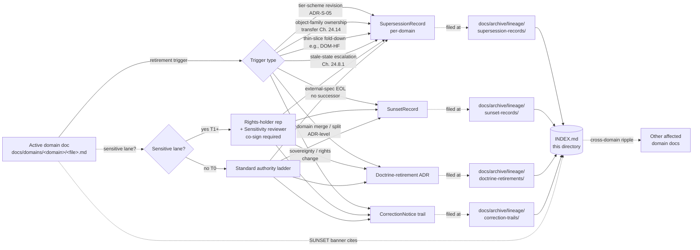

<!-- [KFM_META_BLOCK_V2]
doc_id: kfm://doc/<TODO-uuid>
title: Archived Lineage — Domain Documentation
type: standard
version: v1
status: draft
owners:
  primary: Docs steward
  co_authoring: [Domain steward (per retired surface), Sensitivity reviewer, Release authority, Correction reviewer]
  notes: "All roles CONFIRMED per Atlas v1.1 Ch. 24.7.1. Domain steward is per-domain; the specific named individual varies by which domain doc is retired."
created: 2026-05-25
updated: 2026-05-25
policy_label: public
related:
  - docs/archive/lineage/README.md
  - docs/archive/lineage/standards/README.md
  - docs/archive/lineage/runbooks/README.md
  - docs/domains/README.md
  - docs/doctrine/directory-rules.md
  - docs/doctrine/authority-ladder.md
  - docs/atlases/
  - docs/registers/DRIFT_REGISTER.md
  - control_plane/deprecation_register.yaml
tags: [kfm, archive, lineage, domains, supersession, navigational, sensitivity-aware]
subject_taxonomy:
  cross_cutting: [spatial-foundation, frontier-matrix, planetary-3d]
  domains:
    - hydrology
    - soil
    - habitat
    - fauna
    - flora
    - agriculture
    - geology
    - atmosphere-air
    - hazards
    - roads-rail-trade
    - settlements-infrastructure
    - archaeology
    - people-dna-land
directory_rules_basis:
  - "§6.1   — docs/archive/{lineage,exploratory,deprecated} (CONFIRMED v1.3)."
  - "§6.1   — docs/domains/<domain>/ tree enumeration (CONFIRMED v1.3 illustrative listing)."
  - "Atlas v1.1 Ch. 24.7.1 / 24.7.2 — Domain steward and separation-of-duties for sensitive lanes."
  - "Atlas v1.1 Ch. 24.8.2 — Atlas / supplement supersession lives IN-DOCUMENT, not here (see §4)."
  - "Atlas v1.1 Ch. 24.13 — Atlas section ↔ dossier ↔ responsibility-root crosswalk."
  - "Atlas v1.1 Ch. 24.14 — Object Family × Domain reference matrix (drives affects_other_domains)."
  - "Atlas v1.1 Ch. 24.12 ADR-S-05 — sensitivity tier scheme (worked example)."
notes:
  - "The subfolder 'domains/' under docs/archive/lineage/ is a PROPOSED domain-segmented view, NEEDS VERIFICATION against ADR (analogous to OPEN-DR-02 itself)."
  - "Records themselves live in the parent's flat record-category lanes; this directory is a navigational index, not a parallel filing authority."
  - "All paths to specific files under docs/archive/lineage/domains/ remain PROPOSED until inspected against a mounted repo."
  - "Atlas-level supersession is NOT in scope here — the Atlas uses in-document App. E + App. G per Ch. 24.8.2."
[/KFM_META_BLOCK_V2] -->

# 🗺 Archived Lineage — Domain Documentation

> Subject-indexed, navigational view of supersession lineage records pertaining to retired or superseded **per-domain documentation surfaces** under [`docs/domains/`](../../../domains/). Records remain filed by category in the parent archive — this directory curates them by domain.


<!-- TODO — replace placeholder Shields targets once the docs CI surface is verified. -->

**Status:** `draft` · **Primary owner:** Docs steward <sub>(role CONFIRMED · person TODO)</sub> · **Co-authoring:** per-domain Domain steward, Sensitivity reviewer (sensitive lanes), Release authority, Correction reviewer · **Last updated:** `2026-05-25`

> [!IMPORTANT]
> This directory is a **curatorial view**, not a parallel filing surface. Documentation-surface lineage records are **filed** in the parent's record-category lanes — `docs/archive/lineage/{supersession-records,sunset-records,doctrine-retirements,correction-trails}/`. This `domains/` subdirectory holds **only** a README, an `INDEX.md`, and cross-references. Filing a record directly here creates parallel authority (Directory Rules §2.4(5)) and is **prohibited**.

> [!CAUTION]
> **Sensitive-lane retirements get higher review burden.** Atlas v1.1 Ch. 24.5 establishes deny-by-default for archaeology coordinates, rare fauna/flora occurrences, living-person fields, DNA data, and critical infrastructure detail. Retiring a doc surface on any of those lanes requires Sensitivity reviewer + Rights-holder representative co-sign per Ch. 24.7.2. The append-only invariant of this archive does **not** soften that requirement — see §10.

> [!WARNING]
> **Atlas-level supersession is out of scope.** The Kansas Frontier Matrix Domains Culmination Atlas uses in-document Appendix E + Appendix G for v1.0 → v1.1 lineage per Ch. 24.8.2. **Do not file Atlas supersession records here** — they live inside the Atlas itself. This view scopes only to retirable markdown surfaces **under `docs/domains/`**.

---

## Contents

1. [Scope](#1-scope)
2. [Repo fit](#2-repo-fit)
3. [Inputs — what this view indexes](#3-inputs--what-this-view-indexes)
4. [Exclusions — what does not belong here](#4-exclusions--what-does-not-belong-here)
5. [Directory layout](#5-directory-layout)
6. [Index ↔ category mapping](#6-index--category-mapping)
7. [Subject-curation flow](#7-subject-curation-flow)
8. [Worked example — ADR-S-05](#8-worked-example--adr-s-05-sensitivity-tier-scheme-revision)
9. [Tracked domains and lineage candidates](#9-tracked-domains-and-lineage-candidates)
10. [Authoring workflow](#10-authoring-workflow)
11. [Sensitive-lane retirement protocol](#11-sensitive-lane-retirement-protocol)
12. [FAQ](#12-faq)
13. [Related docs](#13-related-docs)
14. [Per-root README contract](#14-per-root-readme-contract)
15. [Appendix](#15-appendix)

---

## 1. Scope

This directory provides a **subject-curated index** of lineage records that pertain to retired or superseded **per-domain documentation surfaces** under `docs/domains/`. It exists because:

- KFM tracks **13 domains plus 3 cross-cutting categories** (Spatial Foundation, Frontier Matrix, Planetary/3D), each with potentially multiple doc surfaces (READMEs, architecture notes, dossier links, layer specs). This is the largest population of any subject view under the archive, so curation matters more here than for standards or runbooks. **[CONFIRMED via Directory Rules v1.3 §6.1 + Atlas v1.1 Ch. 24.13.]**
- Domain docs interact with **sensitivity tiers, rights, and sovereignty** in ways that other subject views do not. Atlas v1.1 Ch. 24.5 and Ch. 24.7.2 require extra review when retiring a doc surface on a sensitive lane — the workflow here builds that in. **[CONFIRMED via Atlas v1.1 Ch. 24.5 + Ch. 24.7.2.]**
- Domain docs can **ripple across lanes** via the Object Family × Domain matrix (Atlas Ch. 24.14). A retirement in one domain can invalidate cross-references in others; the index here tracks that fan-out. **[CONFIRMED via Atlas v1.1 Ch. 24.14.]**

The directory is **navigational**, not authoritative. The four record categories established by [`../README.md`](../README.md) §8 — `SupersessionRecord`, `SunsetRecord`, doctrine-retirement ADR, and `CorrectionNotice` trail — remain the **only** filing surfaces.

> [!NOTE]
> **Status.** The placement of `docs/archive/` with `lineage/`, `exploratory/`, `deprecated/` sub-areas is **CONFIRMED** via Directory Rules v1.3 §6.1. The **subject-segmented sub-lane `domains/`** below `docs/archive/lineage/` is **PROPOSED** — an explicit ADR is needed to ratify domain-segmented views (analogous to Directory Rules §18 OPEN-DR-02 for runbooks).

[⬆ Back to top](#-archived-lineage--domain-documentation)

---

## 2. Repo fit

This subfolder is a curated lens. It sits **inside** the documentation-surface lineage archive and points outward to active domain docs, to the dossiers they reference, and to the category lanes where records actually live.

| Direction       | Surface                                                              | Relationship                                                                                                              | Status                  |
|-----------------|----------------------------------------------------------------------|---------------------------------------------------------------------------------------------------------------------------|-------------------------|
| Parent          | [`docs/archive/lineage/README.md`](../README.md)                     | Defines record categories and append-only invariant. This view inherits both.                                              | **CONFIRMED**           |
| Subject source  | [`docs/domains/README.md`](../../../domains/README.md)               | Active per-domain documentation landing. Subject material of every record indexed here.                                    | **CONFIRMED home per §6.1** |
| Subject sources | `docs/domains/{hydrology,soil,habitat,fauna,flora,agriculture,geology,atmosphere,hazards,roads-rail-trade,settlements-infrastructure,archaeology,people-dna-land}/` | The 13 KFM domain lanes per Directory Rules §6.1. **NEEDS VERIFICATION** in mounted repo.                                  | **AUTHORED tree · NEEDS VERIFICATION** |
| Cross-cutting   | Spatial Foundation, Frontier Matrix, Planetary/3D contexts            | Cross-domain doctrine artifacts referenced by every domain; lineage events touching these affect all domains.              | **CONFIRMED context**   |
| Dossier source  | [`docs/atlases/`](../../../atlases/)                                 | Dossier PDFs (per ADR-S-02). Dossier supersession uses **in-document App. E/G**, **not this view** — see §4.               | **CONFIRMED — distinct**|
| Filing lanes    | `docs/archive/lineage/{supersession-records,sunset-records,doctrine-retirements,correction-trails}/` | Where indexed records **actually** live. This view does not duplicate them.                                                | **PROPOSED**            |
| Sibling views   | [`docs/archive/lineage/standards/`](../standards/)                   | Sibling subject view for external-standards profiles.                                                                      | **AUTHORED**            |
| Sibling views   | [`docs/archive/lineage/runbooks/`](../runbooks/)                     | Sibling subject view for operational runbooks.                                                                             | **AUTHORED**            |
| Machine partner | [`control_plane/deprecation_register.yaml`](../../../../control_plane/deprecation_register.yaml) | Machine-readable register required by Directory Rules §14.2. Entries tagged `subject: domains/<domain>` map here.          | **CONFIRMED via §14.2** |
| Policy partners | `policy/sensitivity/{fauna,flora,archaeology,infrastructure,people}/`, `policy/consent/people/` | Sensitive-lane retirements cross-reference current sensitivity / consent policy.                                          | **CONFIRMED home per Atlas Ch. 24.13** |
| Drift detector  | [`docs/registers/DRIFT_REGISTER.md`](../../../registers/DRIFT_REGISTER.md) | Open entries about domain-doc drift get linked here when resolved.                                                         | **CONFIRMED via §14.1** |
| ADR backing     | [`docs/adr/`](../../../adr/)                                         | Doctrine-level retirements of a domain doc surface produce an ADR (e.g., ADR-S-05); this view links to it.                | **CONFIRMED home**      |
| Distinct        | The retired doc **itself**                                           | Stays at its original `docs/domains/<domain>/<file>.md` path with a SUNSET banner. Never moved here.                       | **CONFIRMED — distinct**|

[⬆ Back to top](#-archived-lineage--domain-documentation)

---

## 3. Inputs — what this view indexes

A lineage record qualifies for indexing here when **all three** are true:

1. The **subject** is a markdown documentation surface under `docs/domains/<domain>/` — a per-domain README, architecture note, design brief, ownership note, or other governance artifact. Cross-cutting docs (Spatial Foundation, Frontier Matrix, Planetary/3D) that primarily live under `docs/architecture/` or `docs/atlases/` are out of scope unless they also have a presence under `docs/domains/`.
2. A governed lineage **record exists** in one of the parent's category lanes (`supersession-records/`, `sunset-records/`, `doctrine-retirements/`, `correction-trails/`).
3. The record has been **signed off** through the authority ladder — **including** any sensitivity / rights-holder co-signers required for the retired surface's lane per Atlas v1.1 Ch. 24.7.2.

Domain docs have a distinctive event taxonomy driven by sensitivity, ownership, and cross-domain ripple:

| Event class                                  | Example                                                                                              | Likely record category                | Special review              |
|----------------------------------------------|-------------------------------------------------------------------------------------------------------|----------------------------------------|------------------------------|
| **Sensitivity-tier scheme revision**         | Atlas v1.1 Ch. 24.12 **ADR-S-05** resolves with a new T0–T4 / Tx mapping; every domain's posture doc is superseded. | `SupersessionRecord` (per-domain) or doctrine-retirement ADR | Sensitivity reviewer required across affected lanes. |
| **Object-family ownership transfer**         | An Object Family × Domain matrix (Atlas Ch. 24.14) row changes owner; the prior owner's doc loses authority over that family. | `SupersessionRecord`                  | Domain stewards of both domains; Docs steward. |
| **Sovereignty / rights-state change**        | A rights-holder communication changes the release posture for an archaeology, people, or DNA lane.    | `CorrectionNotice` trail or `SupersessionRecord` | Rights-holder rep + Sensitivity reviewer **mandatory**. |
| **Thin-slice fold-down**                     | The [DOM-HF] Habitat+Fauna thin slice is folded into separate full [DOM-HAB] / [DOM-FAUNA] doc sets.    | `SupersessionRecord` (paired)         | Both Domain stewards. |
| **Domain merge or split** *(doctrine-level)* | Two domain lanes are merged (or one split); an ADR documents the move.                                 | Doctrine-retirement ADR               | Atlas / supplement update + Directory Rules §2.4(1) consideration. |
| **Cross-domain boundary refinement**         | A boundary clause (e.g., "Habitat owns HabitatPatch; Fauna owns OccurrenceRecord") is sharpened, retiring an older ambiguous doc. | `SupersessionRecord`                  | Both Domain stewards. |
| **Withdrawal under correction**              | A domain doc is withdrawn because its claims were materially wrong (e.g., misattributed source role). | `CorrectionNotice` trail              | Correction reviewer + Release authority. |
| **Stale-state escalation**                   | A doc surface is retired because dependent source freshness, geography version, or model version churn has aged it out beyond tolerance (Atlas Ch. 24.8.1). | `SupersessionRecord` (cadence-only)   | Domain steward; Sensitivity reviewer if sensitive lane. |

> [!TIP]
> If you cannot point to a governed record in a parent category lane, there is nothing to index — the record must exist first, then be cross-listed here.

[⬆ Back to top](#-archived-lineage--domain-documentation)

---

## 4. Exclusions — what does not belong here

| Out of scope                                                    | Why                                                                              | Goes instead to                                                          |
|-----------------------------------------------------------------|-----------------------------------------------------------------------------------|---------------------------------------------------------------------------|
| **Atlas / supplement supersession** (e.g., Atlas v1.0 → v1.1)   | Per Atlas v1.1 Ch. 24.8.2, atlas supersession lives **inside the atlas** as an Appendix (App. E / App. G precedent). | Inside the Atlas / supplement itself                                     |
| The retired domain doc itself                                   | Retired docs remain at their `docs/domains/<domain>/<file>.md` path with a SUNSET banner. | Original path, with `status: deprecated` in its meta block                |
| The **actual** record file (`KFM-SUP-NNNN-*.md`, etc.)          | Records live in the parent's category lanes; filing here creates parallel authority. | `docs/archive/lineage/<category>/KFM-<PREFIX>-NNNN-<slug>.md`            |
| Active deprecation entries (pre-sunset)                         | Still doing governance work; not yet historical.                                  | `control_plane/deprecation_register.yaml` <sub>CONFIRMED via §14.2</sub> |
| Schema / contract / policy supersession                         | Per Atlas v1.1 Ch. 24.8.2, schemas use in-header pattern; policies use ADR + link. | Schema header + ADR; policy file + ADR                                   |
| **Object-class** supersession (EvidenceBundle, ReleaseManifest, etc.) | Lives with the object per Atlas Ch. 24.8.2 — bundle registry, manifest history, etc. | Bundle registry / manifest history / source register                     |
| Per-domain dossier rev-ups (PDFs under `docs/atlases/`)         | Dossiers are reference artifacts; their supersession lives in-document like the Atlas. | Inside the dossier itself (App. E pattern)                               |
| Sensitivity-policy YAML rev-ups (e.g., `policy/sensitivity/archaeology/<file>.yaml`) | Policy supersession is policy-side, governed by ADR + in-file link.                  | `policy/` ADR + supersession link                                        |
| Source-rights changes (without a doc-surface retirement)        | Rights changes drive policy/source-register updates, not necessarily doc retirement. | `data/registry/` + source register supersession                          |
| `RunReceipt` / `ModelRunReceipt` outputs                        | Runtime emissions are audit-ledger material, not doc lineage.                     | Audit ledger / `data/receipts/`                                          |
| Domain-data lineage (PROV-O on processed datasets)              | Data lineage uses the bundle registry + PROV-O store; not this archive.            | Bundle registry; provenance store                                        |
| ADR working drafts                                              | Drafts live with active ADRs; only the *retirement* trail lands here.             | `docs/adr/` working area                                                 |
| Open `DRIFT_REGISTER.md` entries                                | Drift is detection-stage; not yet a retirement.                                   | `docs/registers/DRIFT_REGISTER.md`                                       |
| AI-generated retirement proposals                               | AI is interpretive; no archive identity until promoted via authority ladder.       | Working branches; tracked via `AIReceipt`                                |

> [!CAUTION]
> **The Atlas exclusion is doctrinally important.** Atlas v1.1 Appendix G is the precedent: when v1.0 → v1.1, the supersession appendix lives inside v1.1 itself. Filing a record here for an Atlas edition bump duplicates the in-document chain and violates Ch. 24.8.2. If a per-domain *doc surface* is retired **as a consequence** of an Atlas edition bump, that downstream retirement is in scope here — but the Atlas bump itself is not.

[⬆ Back to top](#-archived-lineage--domain-documentation)

---

## 5. Directory layout

The subfolder is **PROPOSED**; its placement under `docs/archive/lineage/` inherits the CONFIRMED parent path (Directory Rules §6.1) but the subject-segmented sub-lane itself awaits ADR ratification. The layout is intentionally minimal — this is a view, not a filing surface.

```text
docs/archive/lineage/domains/
├── README.md          # this file
└── INDEX.md           # curated cross-listing of domain-relevant records (PROPOSED — generator-driven)
```

No `KFM-SUP-*`, `KFM-SUN-*`, `KFM-DR-*`, or `KFM-COR-*` record files live here. Those remain at:

```text
docs/archive/lineage/
├── supersession-records/KFM-SUP-NNNN-<slug>.md
├── sunset-records/KFM-SUN-NNNN-<slug>.md
├── doctrine-retirements/KFM-DR-NNNN-<slug>.md
└── correction-trails/KFM-COR-NNNN-<slug>.md
```

`INDEX.md` cross-references the subset of those records whose `subject` field names a file under `docs/domains/<domain>/`.

> [!NOTE]
> If a future ADR ratifies subject-segmented filing **lanes** (not just views), or if the volume of domain-doc records warrants further sub-segmentation by domain (e.g., `docs/archive/lineage/domains/archaeology/`), the layout would change. Those decisions are explicitly out of scope for this README; do not pre-empt them.

[⬆ Back to top](#-archived-lineage--domain-documentation)

---

## 6. Index ↔ category mapping

`INDEX.md` is the only durable artifact in this directory besides the README. The schema below extends the standards/ and runbooks/ sibling schemas with three domain-specific columns: `sensitivity_lane`, `affects_other_domains`, and `rights_holder_review`.

| INDEX column                  | Source                                              | Notes                                                                                       |
|--------------------------------|-----------------------------------------------------|----------------------------------------------------------------------------------------------|
| `record_id`                   | Filename stem in the parent category lane          | e.g., `KFM-SUP-0042`                                                                         |
| `category`                    | Parent subdirectory                                 | `supersession` · `sunset` · `doctrine-retirement` · `correction-trail`                        |
| `subject_path`                | Field inside the record                            | e.g., `docs/domains/archaeology/PUBLIC_RELEASE_POSTURE.md` (PROPOSED filename)                |
| `domain`                      | Subject taxonomy                                    | One of the 13 domains, or `cross-cutting/{spatial-foundation,frontier-matrix,planetary-3d}`. |
| `sensitivity_lane`            | Field inside the record *(domain-specific)*        | `T0` · `T1` · `T2` · `T4` · `mixed` per Atlas v1.1 Ch. 24.5.                                  |
| `affects_other_domains`       | Field inside the record *(domain-specific)*        | List of other domains touched by Object Family × Domain ripple (Atlas Ch. 24.14).            |
| `rights_holder_review`        | Field inside the record *(domain-specific)*        | Boolean. Mandatory `true` for archaeology and people-dna-land per Ch. 24.7.2.                |
| `successor_id`                | Field inside the record                            | Successor record ID or `null` + `no_successor_rationale`                                     |
| `retired_at`                  | Field inside the record                            | ISO date                                                                                      |
| `authority_ladder_signoff`    | Field inside the record                            | Comma-separated role list per Atlas v1.1 Ch. 24.7.1.                                          |
| `deprecation_register_entry`  | `control_plane/deprecation_register.yaml`           | Cross-ref ID; required for sunset-class records.                                              |
| `adr_ref`                     | If doctrine-retirement                              | e.g., `ADR-NNNN` or `ADR-S-NN` from Atlas Ch. 24.12 backlog.                                  |

> [!IMPORTANT]
> `INDEX.md` is **derivative**. The three domain-specific columns (`sensitivity_lane`, `affects_other_domains`, `rights_holder_review`) come from fields **inside** the record file. If those fields are absent on a record, the record fails validation and cannot be indexed — the missing fields must be populated by the responsible Domain steward before the record is filed in its parent category lane.

[⬆ Back to top](#-archived-lineage--domain-documentation)

---

## 7. Subject-curation flow

The diagram shows how a domain-doc retirement event flows through the parent archive and lands as a cross-reference in this view's `INDEX.md`. Sensitive-lane retirements take an additional review path; the diagram makes that explicit.



> [!WARNING]
> The diagram is **conceptual**. No domain doc has yet been retired in the corpus; the flow is exercised against the open ADR-S-05 case in §8 as a worked example only. Concrete tooling for `INDEX.md` is **PROPOSED · NEEDS VERIFICATION**.

[⬆ Back to top](#-archived-lineage--domain-documentation)

---

## 8. Worked example — `ADR-S-05` (sensitivity tier scheme revision)

The cleanest concrete candidate for this view is Atlas v1.1 Ch. 24.12 **ADR-S-05**: "Sensitivity tier scheme (T0–T4) — adopt as canonical or revise." The current T0–T4 scheme is **PROPOSED** in this supplement; an ADR will either ratify it as-is or revise it. Either outcome is a **cross-domain doctrine update** that touches every domain's public-release posture.

**State today (CONFIRMED):** The T0–T4 scheme is documented across Atlas v1.1 chapters and per-domain object-family rows (Ch. 24.14). It is **PROPOSED** at the supplement level. Whether each domain has a separate `PUBLICATION_POSTURE.md` (or similar) doc surface under `docs/domains/<domain>/` is **NEEDS VERIFICATION**.

**When the ADR resolves (PROPOSED flow):**

1. ADR-S-05 lands with a final tier scheme (e.g., keeps T0–T4, adds a Tx provisional bucket, or maps to a different vocabulary).
2. For **each** domain whose `docs/domains/<domain>/<file>.md` documents the prior posture, a `SupersessionRecord` is filed at `docs/archive/lineage/supersession-records/KFM-SUP-NNNN-<domain>-tier-scheme-revision.md` (PROPOSED ID, ADR-pending per parent README §9).
3. Each record populates the domain-specific INDEX fields:
   - `domain`: e.g., `archaeology`
   - `sensitivity_lane`: e.g., `T4` (deny-by-default)
   - `affects_other_domains`: `[]` for tier-scheme revisions (each domain's record is independent; cross-ripple comes from object-family transfers, not tier revisions)
   - `rights_holder_review`: `true` for archaeology and people-dna-land; `false` otherwise
4. **For sensitive lanes (archaeology, fauna rare-occurrence, flora rare-plant, people/DNA, critical infrastructure):**
   - Sensitivity reviewer co-signs
   - Rights-holder representative co-signs (archaeology, people-dna-land mandatory)
   - Release authority co-signs the bundle
5. **This view's `INDEX.md`** gains one row per affected domain. For ADR-S-05, that's potentially 13+ rows in a single batch (one per domain, plus cross-cutting if applicable).
6. Retired posture docs keep SUNSET banners pointing at the new posture doc plus the record ID.
7. Atlas v1.1 Ch. 24.5 is itself amended — but per §4 above, that **Atlas-level amendment** lives in the next Atlas edition's in-document App. E/G, **not here**. Only the downstream per-domain doc retirements land in this view.
8. Directory Rules drift register (`docs/registers/DRIFT_REGISTER.md`) entries that referenced the prior tier scheme are resolved with links to the new records.

### Sketch of an INDEX row

| record_id     | category     | subject_path                                              | domain        | sensitivity_lane | affects_other_domains | rights_holder_review | successor_id | adr_ref     |
|---------------|--------------|------------------------------------------------------------|---------------|------------------|------------------------|----------------------|--------------|-------------|
| `KFM-SUP-NNNN` | supersession | `docs/domains/archaeology/PUBLIC_RELEASE_POSTURE.md` *(PROPOSED filename)* | `archaeology` | `T4` | `[]` | `true` | `KFM-SUP-NNNN` *(self — pointed at new posture doc)* | `ADR-S-05` |

> [!TIP]
> Until ADR-S-05 lands, **nothing about this example is filed here**. The T0–T4 scheme remains the PROPOSED working basis (Atlas v1.1 Ch. 24.5); reviewers should design retirements for whichever scheme ADR-S-05 ratifies. The pre-resolution status is tracked at `docs/registers/DRIFT_REGISTER.md` + Atlas Ch. 24.12 ADR-S-05.

### Secondary candidate — `[DOM-HF]` thin-slice fold-down

A separate, smaller-scoped candidate: the **Habitat+Fauna thin-slice dossier** ([DOM-HF]) is referenced in Atlas v1.1 as a paired thin slice. When KFM matures enough to fold the thin slice into separate full [DOM-HAB] and [DOM-FAUNA] dossier coverage, any `docs/domains/habitat/` or `docs/domains/fauna/` doc surface tied specifically to the thin-slice framing is superseded. This is a **paired** supersession event — one record per affected doc, with `affects_other_domains` populated linking the two records.

[⬆ Back to top](#-archived-lineage--domain-documentation)

---

## 9. Tracked domains and lineage candidates

This table inventories the domain population currently in scope, drawn from Atlas v1.1 §2.1 (Domain-to-dossier map), Ch. 24.13 (Atlas ↔ dossier ↔ responsibility-root crosswalk), and Directory Rules v1.3 §6.1 (`docs/domains/` tree). **PROPOSED** in scope; **CONFIRMED** doctrine.

| Domain                       | Short-name | `docs/domains/` lane            | Sensitivity default (Atlas Ch. 24.5)          | Open lineage candidate                                              |
|-------------------------------|------------|---------------------------------|------------------------------------------------|----------------------------------------------------------------------|
| Spatial Foundation            | (spine)    | *(cross-cutting; primarily `docs/architecture/`)* | `T0`                                          | **ADR-S-05** if tier scheme revised across spatial product layer.    |
| Hydrology                     | [DOM-HYD]  | `docs/domains/hydrology/`       | `T0` (regulatory NFHL; observational gauges) | **ADR-S-05**; first proof-slice candidate per roadmap phase 5.       |
| Soil                          | [DOM-SOIL] | `docs/domains/soil/`            | `T0`                                          | **ADR-S-05**.                                                        |
| Habitat                       | [DOM-HAB] [DOM-HF] | `docs/domains/habitat/` | `T0` mostly; `T1` for stewardship zones      | **ADR-S-05**; [DOM-HF] thin-slice fold-down.                         |
| Fauna                         | [DOM-FAUNA] [DOM-HF] | `docs/domains/fauna/` | `T4` default for occurrence; `T1` via generalization | **ADR-S-05**; rare-species posture changes; [DOM-HF] fold-down.       |
| Flora                         | [DOM-FLORA] | `docs/domains/flora/`           | `T4` default for rare-plant records; `T1` via generalization | **ADR-S-05**; ethnobotanical context governance shifts.              |
| Agriculture                   | [DOM-AG]   | `docs/domains/agriculture/`     | `T0` aggregate; `T1`/`T2` field-candidate    | **ADR-S-05**; aggregation-receipt scheme changes.                    |
| Geology / Natural Resources   | [DOM-GEOL] | `docs/domains/geology/`         | `T0` aggregate; `T2` detail in sensitive contexts | **ADR-S-05**.                                                        |
| Atmosphere / Air              | [DOM-AIR]  | `docs/domains/atmosphere/`      | `T0`                                          | **ADR-S-05**; source-role anti-collapse refinement (Atlas Ch. 24.1). |
| Hazards                       | [DOM-HAZ]  | `docs/domains/hazards/`         | `T0`                                          | **ADR-S-05**; alert-authority boundary refinement (KFM is never alert authority). |
| Roads / Rail / Trade          | [DOM-ROADS] | `docs/domains/roads-rail-trade/` | `T0` mostly; `T2`/`T4` for sensitive condition detail | **ADR-S-05**; network-identity governance refinements.               |
| Settlements / Infrastructure  | [DOM-SETTLE] | `docs/domains/settlements-infrastructure/` | `T0` (settlements); `T4` default for critical infrastructure | **ADR-S-05**; critical-asset deny-lane scope changes.                |
| Archaeology / Cultural Heritage | [DOM-ARCH] | `docs/domains/archaeology/`    | `T4` default; `T1` generalized only after steward review | **ADR-S-05**; sovereignty review path changes; site-coord exposure rules. |
| People / Genealogy / DNA / Land | [DOM-PEOPLE] | `docs/domains/people-dna-land/` | `T1`/`T2` (living-person denied; aggregate `T0`); `T4` DNA | **ADR-S-05**; consent regime changes; living-person posture revisions. |
| Frontier Matrix               | (spine)    | *(cross-cutting; `docs/atlases/` and `contracts/matrix/`)* | `T0` matrix; per-cell varies | **ADR-S-08** (Frontier Matrix cell semantics); cell-release rules.   |
| Planetary / 3D / Digital Twin | (spine)    | *(cross-cutting; primarily `docs/architecture/maplibre-3d.md`)* | `T0` / `T1` / `T2` / `T4` by content sensitivity | **ADR-S-07** (3D admission policy); **OPEN-DR-10** (sole-renderer adoption — Cesium retirement). |

**Sensitive lanes summary (`rights_holder_review: true` mandatory):**

- **Archaeology** — sovereignty review path, deny-default for site coordinates per Atlas Ch. 24.13.
- **People / Genealogy / DNA / Land** — living-person, DNA, and person-parcel lanes deny-default per Atlas Ch. 24.13.
- **Fauna (rare-occurrence)** — generalization required before release.
- **Flora (rare-plant)** — generalization required; ethnobotanical context.
- **Settlements / Infrastructure (critical)** — `T4` default for critical detail.

> [!NOTE]
> "**Open lineage candidate**" lists ADR-S items from the Atlas v1.1 Ch. 24.12 backlog and Directory Rules §18 OPEN-DR items whose resolution would likely produce records here. None of these are **filed** yet; the backlog itself is the catalyst for this view's first real entries.

[⬆ Back to top](#-archived-lineage--domain-documentation)

---

## 10. Authoring workflow

The flow below is **PROPOSED** and inherits the parent archive's workflow with one mandatory addition for sensitive lanes (Sensitivity reviewer + Rights-holder rep co-sign — see §11). Confirm against any existing runbook before treating it as official.

1. **Upstream governance signs off.** A `DeprecationNotice` (in `control_plane/deprecation_register.yaml`), `CorrectionNotice`, or ADR is authored and accepted through the authority ladder.
2. **Sensitivity classification.** Before drafting the record, the responsible Domain steward classifies the retired doc surface's sensitivity lane per Atlas v1.1 Ch. 24.5 (`T0`/`T1`/`T2`/`T4`/`mixed`). This classification populates the `sensitivity_lane` INDEX field and determines required co-signers.
3. **Cross-domain ripple analysis.** The Domain steward walks Atlas Ch. 24.14 (Object Family × Domain matrix) and identifies any other domain whose docs cite or depend on the retired surface. The list populates `affects_other_domains`.
4. **Trigger event.** Sunset reached, supersession released, ADR accepted.
5. **Record filed in the parent category lane** — `docs/archive/lineage/<category>/KFM-<PREFIX>-NNNN-<slug>.md`. **Never filed here.**
6. **Authority-ladder co-signing.** Per Atlas v1.1 Ch. 24.7.2:
   - **Routine domain doc** (T0, non-sensitive): Docs steward + Domain steward.
   - **Sensitive lane** (T1+): Docs steward + Domain steward + Sensitivity reviewer.
   - **Sovereignty / consent-bearing** (archaeology, people-dna-land): + Rights-holder rep **mandatory**.
   - **Any public surface affected**: + Release authority.
   - **Correction-trail (procedural error)**: + Correction reviewer.
7. **Index cross-listing.** A row is added to this view's `INDEX.md` (generator-driven if available, otherwise hand-maintained by Docs steward).
8. **SUNSET banner update.** The retired doc at `docs/domains/<domain>/<file>.md` keeps its banner and gains a citation to the new record ID.
9. **`docs/domains/README.md` cross-link.** The active domains landing README is updated to point at the new record via this view's `INDEX.md`.
10. **Cross-domain notification.** For every domain in `affects_other_domains`, the corresponding Domain steward is notified and their docs are checked for cross-references that may need updating (per the append-only invariant, the *other* domain's docs are not edited as part of the retirement — they may need their own subsequent supersession records if their claims are invalidated).
11. **Atlas Ch. 24 register consistency check.** If the retirement is driven by an ADR-S item (e.g., ADR-S-05), the Atlas Ch. 24.12 backlog row is updated to `resolved` with a link to the record.

> [!WARNING]
> Step 2 (sensitivity classification) and Step 6 (authority-ladder co-signing with the right co-signers for the lane) are **non-negotiable** for sensitive lanes. The append-only nature of this archive means a record filed with insufficient sign-off cannot be retracted — only superseded by a follow-up record. Get the sign-off right the first time.

[⬆ Back to top](#-archived-lineage--domain-documentation)

---

## 11. Sensitive-lane retirement protocol

Sensitive-lane domain-doc retirements get extra protocol on top of §10. This section codifies the mandatory additions per Atlas v1.1 Ch. 24.7.2.

**Lanes requiring this protocol** (mandatory `rights_holder_review: true` in the INDEX row):

| Lane                                                            | Mandatory co-signers (in addition to §10 step 6)               |
|------------------------------------------------------------------|-----------------------------------------------------------------|
| **Archaeology / Cultural Heritage** — site coordinates, cultural temporal periods | Sensitivity reviewer + Rights-holder rep (sovereignty)         |
| **People / Genealogy / DNA / Land** — living-person fields, DNA, person-parcel | Sensitivity reviewer + Rights-holder rep (consent regime)      |
| **Fauna — rare-species occurrence**                              | Sensitivity reviewer                                            |
| **Flora — rare-plant records, ethnobotanical context**           | Sensitivity reviewer + Rights-holder rep (ethnobotanical)       |
| **Settlements / Infrastructure — critical-asset detail**         | Sensitivity reviewer (release authority for any public scope)   |

**Protocol additions** (on top of §10):

1. **Pre-retirement sensitivity audit.** Before drafting the record, the Sensitivity reviewer audits the retired doc surface to confirm:
   - No sensitive geometry, identifier, sequence, or context will become harder to redact post-retirement.
   - The SUNSET banner does not reveal information the retired doc had been redacting.
   - The successor doc's posture is at least as restrictive as the retired doc's posture.
2. **Rights-holder communication trail.** For sovereignty (archaeology) and consent-regime (people-dna-land) retirements, the Rights-holder representative documents the communication trail (or its waiver) and attaches it to the record as evidence.
3. **Deny-by-default carry-forward.** If the retired doc described a deny-by-default lane, the successor doc must explicitly carry the deny-by-default forward — `successor: null` is **not** acceptable for sensitive lanes without a documented `no_successor_rationale` reviewed by Release authority.
4. **Cross-domain ripple check (heightened).** Sensitive-lane retirements automatically flag every domain in `affects_other_domains` for a parallel sensitivity audit before that domain's docs are edited in response.
5. **Stale-state propagation rule.** Per Atlas Ch. 24.8.1, if a sensitive-lane doc is retired due to stale-state escalation (source freshness, rights status change, policy version), the dependent claims in other domains are marked stale until their own records are filed.

> [!CAUTION]
> **The sensitivity protocol does not gate authoring** — it gates **sign-off**. A draft record can be prepared by anyone with edit access; it cannot be merged or added to `INDEX.md` until all required co-signers have signed off. CI should fail any PR that attempts to add an INDEX row whose record file does not carry the required signatures.

[⬆ Back to top](#-archived-lineage--domain-documentation)

---

## 12. FAQ

<details>
<summary><b>Why is there a <code>domains/</code> subfolder if records don't live in it?</b></summary>

Because subject-curated navigation matters most for the largest population. KFM has 13 domains plus 3 cross-cutting categories — the lineage volume here will eventually be the largest of any subject view. The trade-off is that this directory must be **strictly navigational** — filing records here would create parallel authority with the parent's category lanes. The subfolder is PROPOSED (analogous to Directory Rules §18 OPEN-DR-02); an ADR may eventually replace it with a tag-based view inside the parent's `INDEX.md`.

</details>

<details>
<summary><b>Does Atlas v1.0 → v1.1 supersession get indexed here?</b></summary>

**No.** Per Atlas v1.1 Ch. 24.8.2, the required lineage artifact for an Atlas / supplement is the *atlas / supplement supersession appendix* — Atlas v1.0 used Appendix E and v1.1 added Appendix G. That pattern is intentional and is **in-document**. Filing an Atlas supersession record here duplicates the in-document chain. This view is for **per-domain doc surfaces** under `docs/domains/`, not for the Atlas or per-domain dossiers.

</details>

<details>
<summary><b>What about per-domain dossier PDF rev-ups (e.g., [DOM-HYD] v1 → v2)?</b></summary>

Same pattern as the Atlas — dossiers use in-document App. E for supersession. Only retirements of **`docs/domains/<domain>/*.md` files** (architecture notes, READMEs, governance docs) land here. The dossier referenced by a retired domain doc may itself be unchanged.

</details>

<details>
<summary><b>How does the cross-domain ripple work?</b></summary>

When a retirement in domain A invalidates a claim in domain B's docs (typically via the Object Family × Domain matrix at Atlas Ch. 24.14), domain B is listed in `affects_other_domains` on A's record. Domain B's Domain steward is notified. Domain B's docs are **not** edited as part of A's retirement (the append-only invariant respects domain ownership); instead, if B's claims need updating, B files its own supersession record, which is independently indexed here and cross-links to A's.

</details>

<details>
<summary><b>What if a retirement spans every domain at once (like ADR-S-05)?</b></summary>

That's a normal case for tier-scheme revisions. The expected pattern is one `SupersessionRecord` per affected domain (each with its own `domain` and `sensitivity_lane` fields), all referencing the same `adr_ref`. INDEX.md gains one row per record. The records are filed as a batch; the ADR itself is also referenced as a doctrine-retirement-class record in the `doctrine-retirements/` lane if the ADR rises to that level — but tier-scheme revision typically stays at supersession level per domain.

</details>

<details>
<summary><b>Can a domain-doc retirement be cancelled?</b></summary>

Pre-record-filing: yes, the upstream `DeprecationNotice` can be cancelled per the parent README §11 FAQ. Post-record-filing: no — the record stands. A later "we want this back" decision is a *new* domain-doc launch, not an undo. The append-only invariant applies recursively.

</details>

<details>
<summary><b>How does sensitive-lane retirement interact with redaction receipts?</b></summary>

A `RedactionReceipt` documents a *transformation* (e.g., generalizing rare-species coords to grid cells). It is not a doc-surface retirement and does not land here. If, however, a *doc surface describing a now-superseded redaction profile* is retired (e.g., the doc described an old grid resolution that has been deprecated by a new one), then that doc retirement does land here. The receipt itself stays in its operational store.

</details>

<details>
<summary><b>What about sovereignty review for archaeology and people-dna-land?</b></summary>

Per Atlas v1.1 Ch. 24.7.2, Rights-holder representative co-sign is **mandatory** for those lanes. The INDEX field `rights_holder_review` is `true` for any record in those lanes. The protocol in §11 documents the communication trail. Sovereignty review is not gated on KFM doctrine alone — it depends on rights-holder communication, which has its own cadence and may delay record filing. That delay is acceptable and expected.

</details>

<details>
<summary><b>How does this differ from the <code>standards/</code> and <code>runbooks/</code> sibling views?</b></summary>

Structurally identical (navigational view; not a filing surface; inherits parent record categories); substantively distinct in three ways:

1. **Larger population** — 13 domains + 3 cross-cutting categories vs ~5 active standards and ~13 recommended runbook categories.
2. **Sensitivity / rights interlock** — sensitive lanes need Sensitivity reviewer + Rights-holder rep co-sign; standards and runbooks rarely do.
3. **Cross-domain ripple** — domain retirements can fan out to multiple other domains via Object Family × Domain matrix; standards and runbooks have weaker ripple.

The `INDEX.md` schemas differ in the domain-specific columns (`sensitivity_lane`, `affects_other_domains`, `rights_holder_review`). The parent record schema is the same across all three views.

</details>

<details>
<summary><b>Can AI draft an <code>INDEX.md</code> row?</b></summary>

AI may **draft** index prose and propose cross-references, but for sensitive lanes the AI draft is treated with extra caution: AI does not classify sensitivity, identify rights-holder representatives, or sign off. The Sensitivity reviewer and Rights-holder representative make those calls. AI drafts are preserved as `AIReceipt`s attached to the record.

</details>

[⬆ Back to top](#-archived-lineage--domain-documentation)

---

## 13. Related docs

The paths below cite Directory Rules v1.3 §6.1 placements. Per-doc paths under `docs/domains/` are CONFIRMED **lane homes** per §6.1; **presence** of any specific file remains NEEDS VERIFICATION.

**Parent archive and siblings (CONFIRMED canonical):**

- [`docs/archive/lineage/README.md`](../README.md) — parent archive, record categories, append-only invariant.
- [`docs/archive/lineage/standards/README.md`](../standards/README.md) — sibling subject view (external standards).
- [`docs/archive/lineage/runbooks/README.md`](../runbooks/README.md) — sibling subject view (operational runbooks).
- [`docs/archive/exploratory/`](../../exploratory/) — superseded exploratory work (sibling, distinct purpose).
- [`docs/archive/deprecated/`](../../deprecated/) — archived content without successors (sibling, distinct purpose).

**Active subject material (CONFIRMED home per §6.1; presence NEEDS VERIFICATION):**

- [`docs/domains/README.md`](../../../domains/README.md) — active domains landing.
- `docs/domains/hydrology/` · `docs/domains/soil/` · `docs/domains/habitat/` · `docs/domains/fauna/` · `docs/domains/flora/` · `docs/domains/agriculture/` · `docs/domains/geology/` · `docs/domains/atmosphere/` · `docs/domains/hazards/` · `docs/domains/roads-rail-trade/` · `docs/domains/settlements-infrastructure/` · `docs/domains/archaeology/` · `docs/domains/people-dna-land/` — the 13 domain lanes.

**Doctrine (CONFIRMED homes per §6.1):**

- [`docs/doctrine/directory-rules.md`](../../../doctrine/directory-rules.md) — §6.1 (`docs/domains/` tree).
- [`docs/doctrine/lifecycle-law.md`](../../../doctrine/lifecycle-law.md) — publication and supersession discipline.
- [`docs/doctrine/authority-ladder.md`](../../../doctrine/authority-ladder.md) — Domain steward + Sensitivity reviewer + Rights-holder rep + Release authority + Correction reviewer roles.
- [`docs/doctrine/truth-posture.md`](../../../doctrine/truth-posture.md) — cite-or-abstain stance preserved by records here.
- [`docs/doctrine/trust-membrane.md`](../../../doctrine/trust-membrane.md) — public-surface boundary; deny-by-default for sensitive lanes.

**Atlas references (CONFIRMED doctrine; in-document for Atlas-level supersession):**

- *Atlas v1.1 §2.1* — Domain-to-dossier map (basis for §9 inventory).
- *Atlas v1.1 Ch. 24.5* — Sensitivity / rights tier reference (T0–T4).
- *Atlas v1.1 Ch. 24.7* — Reviewer role and separation-of-duties matrix (basis for §10 / §11 protocols).
- *Atlas v1.1 Ch. 24.8* — Stale-state and supersession reference.
- *Atlas v1.1 Ch. 24.8.2* — Object class supersession rules; **Atlas / supplement supersession lives in-document** (basis for §4 Atlas exclusion).
- *Atlas v1.1 Ch. 24.12 ADR-S-05* — Sensitivity tier scheme adoption (worked example for §8).
- *Atlas v1.1 Ch. 24.12 ADR-S-08* — Frontier Matrix cell semantics.
- *Atlas v1.1 Ch. 24.13* — Atlas section ↔ dossier ↔ responsibility-root crosswalk.
- *Atlas v1.1 Ch. 24.14* — Object Family × Domain reference matrix (basis for `affects_other_domains`).
- *Atlas v1.0 App. E + v1.1 App. G* — Atlas-level supersession precedent (in-document).

**Registers and machine partners:**

- [`docs/registers/DRIFT_REGISTER.md`](../../../registers/DRIFT_REGISTER.md) — open-drift detection surface.
- [`docs/registers/CANONICAL_LINEAGE_EXPLORATORY.md`](../../../registers/CANONICAL_LINEAGE_EXPLORATORY.md) — canonical / lineage / exploratory classification.
- [`control_plane/deprecation_register.yaml`](../../../../control_plane/deprecation_register.yaml) — machine-readable deprecation register (Directory Rules §14.2).
- [`docs/adr/`](../../../adr/) — ADRs backing doctrine-level retirements.
- `policy/sensitivity/{fauna,flora,archaeology,infrastructure,people}/` · `policy/consent/people/` — sensitivity / consent policy homes (Atlas Ch. 24.13 crosswalk).

> [!NOTE]
> Related-doc **paths** cite Directory Rules §6.1 and Atlas Ch. 24.13 placements. Per-doc **presence** in the mounted repo remains NEEDS VERIFICATION — leave links in place with `NEEDS VERIFICATION` annotations rather than removing them.

[⬆ Back to top](#-archived-lineage--domain-documentation)

---

## 14. Per-root README contract

Directory Rules §15 requires every canonical root and compatibility root to carry a `README.md` with a fixed shape. This subdirectory is not a canonical or compatibility root (it is a curated view under one), but the §15 contract is applied here as a courtesy and a forcing function.

| Field                  | Value                                                                                                                                          |
|------------------------|------------------------------------------------------------------------------------------------------------------------------------------------|
| **Purpose**            | Navigational subject-index of supersession lineage records pertaining to per-domain documentation surfaces under `docs/domains/`.              |
| **Authority level**    | **archive — navigational view** (not a filing surface; records live in parent category lanes).                                                 |
| **Status**             | `PROPOSED` for this subfolder convention; `CONFIRMED` for the parent `docs/archive/lineage/` placement and the `docs/domains/` tree per Directory Rules §6.1. |
| **What belongs here**  | This README and an `INDEX.md` cross-listing domain-relevant records filed in parent category lanes — see §3.                                   |
| **What does NOT belong here** | Record files themselves (parallel-authority risk); the retired doc (stays at `docs/domains/`); **Atlas / supplement supersession** (in-document per Ch. 24.8.2); per-domain dossier rev-ups (in-document); schema / policy supersession (in-header / ADR); object-class supersession — see §4. |
| **Inputs**             | Sign-off from authority ladder upstream **including required Sensitivity reviewer + Rights-holder rep for sensitive lanes** per §11; record file presence in parent category lane; entries in `control_plane/deprecation_register.yaml`. |
| **Outputs**            | A discoverable subject-curated cross-reference for retired domain docs, with sensitivity awareness and cross-domain ripple tracking. Cross-linked from `docs/domains/README.md`, retired SUNSET banners, and Atlas Ch. 24.12 backlog entries when they resolve. |
| **Validation**         | INDEX integrity check (every row points at a real record file) — PROPOSED; sensitivity-classification field presence check — PROPOSED; rights-holder-review boolean check for archaeology / people-dna-land lanes — PROPOSED; append-only CI rule inherited from parent — PROPOSED. |
| **Review burden**      | Docs steward (primary) + per-retirement Domain steward + Sensitivity reviewer for T1+ lanes + Rights-holder representative for archaeology / people-dna-land + Release authority for any public scope, per Atlas v1.1 Ch. 24.7.2. |
| **Related folders**    | `docs/archive/lineage/{supersession-records,sunset-records,doctrine-retirements,correction-trails}/`, `docs/archive/lineage/{standards,runbooks}/`, `docs/domains/`, `docs/atlases/`, `policy/sensitivity/`, `docs/registers/`, `control_plane/`, `docs/adr/`. |
| **ADRs**               | **ADR-pending** — subject-segmented sub-lanes under `docs/archive/lineage/`; **ADR-S-05** (sensitivity tier scheme) is the headline driver; **ADR-S-07** (3D admission); **ADR-S-08** (Frontier Matrix cell semantics); **OPEN-DR-10** (sole-renderer adoption); plus parent-README identifier-namespace ADR. |
| **Last reviewed**      | `2026-05-25`                                                                                                                                   |

[⬆ Back to top](#-archived-lineage--domain-documentation)

---

## 15. Appendix

<details>
<summary><b>Glossary (project-doctrine terms used in this file)</b></summary>

| Term                                                                       | Meaning in this document                                                                                                          |
|----------------------------------------------------------------------------|------------------------------------------------------------------------------------------------------------------------------------|
| Per-domain doc surface                                                     | A markdown file under `docs/domains/<domain>/` — README, architecture note, ownership doc, governance artifact. Subject material here.|
| Dossier                                                                    | A reference PDF (typically under `docs/atlases/` per ADR-S-02). Dossier supersession is **in-document**, not here.                  |
| Atlas / supplement                                                         | The Kansas Frontier Matrix Domains Culmination Atlas (v1.0, v1.1) and its supplements. Supersession is **in-document** (App. E / G). |
| `sensitivity_lane`                                                         | Domain-specific INDEX column: `T0` / `T1` / `T2` / `T4` / `mixed` per Atlas v1.1 Ch. 24.5.                                          |
| `affects_other_domains`                                                    | Domain-specific INDEX column: list of other domains whose docs cite the retired surface (via Atlas Ch. 24.14 Object Family × Domain matrix). |
| `rights_holder_review`                                                     | Domain-specific INDEX column: boolean. Mandatory `true` for archaeology and people-dna-land per Ch. 24.7.2.                        |
| Object Family × Domain matrix                                              | The Atlas Ch. 24.14 register that says which domain owns each object family and which other domains cite it.                       |
| Sensitive lane                                                             | Any lane defaulting to T1+ per Atlas Ch. 24.5 — archaeology, rare fauna/flora, people/DNA, critical infrastructure.                  |
| Rights-holder representative                                               | Authority-ladder role (Atlas Ch. 24.7.1) confirming sovereignty, cultural-heritage, or consent-based release decisions.            |
| Sensitivity reviewer                                                       | Authority-ladder role (Atlas Ch. 24.7.1) reviewing redaction, generalization, withholding, and tier decisions.                     |
| Subject-curated view                                                       | A directory that organizes references by subject, without re-filing the underlying records.                                        |
| Parallel filing authority                                                  | Two homes claiming the same governing role over the same artifact class — prohibited by Directory Rules §2.4(5).                    |
| `INDEX.md`                                                                  | The cross-listing file in this directory; derivative of parent-lane records and the deprecation register.                          |
| `SupersessionRecord` / `SunsetRecord` / Doctrine-retirement ADR / `CorrectionNotice` trail | The four record categories established by the parent README §8.                                                                    |
| Authority ladder                                                           | Role-based sign-off ordering per Atlas v1.1 Ch. 24.7.1.                                                                            |
| ADR-S-NN                                                                    | Atlas v1.1 Ch. 24.12 Open-ADR Backlog identifier; e.g., ADR-S-05 is the sensitivity tier scheme case.                              |
| Short-name (e.g., [DOM-HYD], [DOM-FAUNA])                                  | Atlas dossier short-name from §2.1 source ledger.                                                                                  |

</details>

<details>
<summary><b>The 13 domains plus 3 cross-cutting categories — reference</b></summary>

| # | Domain                              | Short-name           | Atlas v1.0 Ch. | Sensitivity default                        |
|---|-------------------------------------|----------------------|----------------|---------------------------------------------|
| — | Spatial Foundation                  | (spine)              | 3              | `T0`                                        |
| 1 | Hydrology                           | [DOM-HYD]            | 4              | `T0`                                        |
| 2 | Soil                                | [DOM-SOIL]           | 5              | `T0`                                        |
| 3 | Habitat                             | [DOM-HAB] [DOM-HF]   | 6              | `T0` / `T1`                                 |
| 4 | Fauna                               | [DOM-FAUNA] [DOM-HF] | 7              | `T4` default / `T1` generalized             |
| 5 | Flora                               | [DOM-FLORA]          | 8              | `T4` default / `T1` generalized             |
| 6 | Agriculture                         | [DOM-AG]             | 9              | `T0` aggregate / `T1`/`T2` field            |
| 7 | Geology / Natural Resources         | [DOM-GEOL]           | 10             | `T0` aggregate / `T2` detail                |
| 8 | Atmosphere / Air                    | [DOM-AIR]            | 11             | `T0`                                        |
| 9 | Hazards                             | [DOM-HAZ]            | 12             | `T0`                                        |
| 10 | Roads / Rail / Trade               | [DOM-ROADS]          | 13             | `T0` / `T2`-`T4` sensitive condition        |
| 11 | Settlements / Infrastructure        | [DOM-SETTLE]         | 14             | `T0` / `T4` critical                        |
| 12 | Archaeology / Cultural Heritage    | [DOM-ARCH]           | 15             | `T4` default                                |
| 13 | People / Genealogy / DNA / Land    | [DOM-PEOPLE]         | 16             | `T1`/`T2` / `T4` DNA                        |
| — | Frontier Matrix                     | (spine)              | 17             | `T0` matrix; per-cell varies                |
| — | Planetary / 3D / Digital Twin       | (spine)              | 18             | `T0` / `T1` / `T2` / `T4` by content        |

</details>

<details>
<summary><b>What this document does not establish</b></summary>

- It does not establish the `domains/` subfolder under `docs/archive/lineage/` as ratified doctrine — that requires an ADR analogous to Directory Rules §18 OPEN-DR-02.
- It does not resolve ADR-S-05 (sensitivity tier scheme), ADR-S-07 (3D admission), ADR-S-08 (Frontier Matrix cell semantics), or OPEN-DR-10.
- It does not create or authorize a new identifier prefix or filing lane.
- It does not assert any retired domain doc in the mounted repo — no domain doc retirement has been filed yet; the worked examples are hypothetical.
- It does not override the parent archive's record categories or append-only invariant.
- It does not override Atlas v1.1 Ch. 24.8.2 on Atlas / supplement / dossier supersession (those remain in-document).
- It does not authorize any retirement on its own — the authority for those decisions lives in the upstream governance artifacts.
- It does not substitute for the Sensitivity reviewer or Rights-holder representative roles — sensitive-lane retirements require their real sign-off, not a checklist proxy.

</details>

<details>
<summary><b>Open verification items</b></summary>

1. **ADR — subject-segmented sub-lanes under `docs/archive/lineage/`.** Ratify or reject; if ratified, decide whether subject sub-lanes are *views* (current PROPOSED design) or *filing lanes* (would require rewriting this README).
2. **Resolve ADR-S-05** (sensitivity tier scheme) — first concrete event likely to populate `INDEX.md` with a batch of records.
3. **Resolve ADR-S-07** (3D admission policy) — affects Planetary/3D cross-cutting docs.
4. **Resolve ADR-S-08** (Frontier Matrix cell semantics) — affects the matrix spine.
5. **Resolve OPEN-DR-10** (sole-renderer adoption) — would retire any Cesium-related cross-cutting docs.
6. Confirm `docs/archive/lineage/domains/` is the intended path for this subject view, vs. alternatives such as a tag-based view in the parent `INDEX.md` or domain-specific sub-views (e.g., `docs/archive/lineage/domains/archaeology/`).
7. Confirm `INDEX.md` is hand-maintained or generator-driven; locate the generator (likely `tools/qa/` or `tools/registers/` — NEEDS VERIFICATION).
8. Confirm Domain steward naming for each of the 13 domains in `docs/doctrine/authority-ladder.md`.
9. Confirm the per-domain `docs/domains/<domain>/` lanes are present in the mounted repo and what doc surfaces they currently contain.
10. Define the `sensitivity_lane` / `affects_other_domains` / `rights_holder_review` field schema and decide whether they live in the record JSON Schema or in this INDEX schema (PROPOSED — record schema for durability; same approach as runbooks `tool_pins_at_retirement`).
11. Confirm whether Spatial Foundation, Frontier Matrix, and Planetary/3D — listed as cross-cutting — have any presence under `docs/domains/` or live exclusively under `docs/architecture/` and `docs/atlases/`.
12. Identify named owners and replace placeholders in the meta block.

</details>

[⬆ Back to top](#-archived-lineage--domain-documentation)

---

**Related:** [Parent archive](../README.md) · [Sibling: standards lineage](../standards/README.md) · [Sibling: runbooks lineage](../runbooks/README.md) · [Active domains](../../../domains/README.md) · [Directory Rules](../../../doctrine/directory-rules.md) · [Drift Register](../../../registers/DRIFT_REGISTER.md) · [Deprecation Register (machine)](../../../../control_plane/deprecation_register.yaml)
**Last updated:** 2026-05-25
[⬆ Back to top](#-archived-lineage--domain-documentation)
