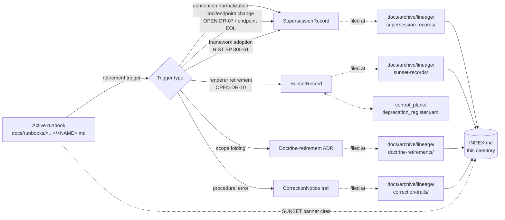

<!-- [KFM_META_BLOCK_V2]
doc_id: kfm://doc/<TODO-uuid>
title: Archived Lineage — Runbooks
type: standard
version: v1
status: draft
owners:
  primary: Docs steward
  co_authoring: [Release authority, Correction reviewer]
  notes: "Roles CONFIRMED per Atlas v1.1 Ch. 24.7.1. The role owning docs/runbooks/ (Ops steward / Release steward / Domain steward depending on subject) is INFERRED and remains NEEDS VERIFICATION against authority-ladder.md."
created: 2026-05-25
updated: 2026-05-25
policy_label: public
related:
  - docs/archive/lineage/README.md
  - docs/runbooks/README.md
  - docs/runbooks/fauna/SOURCE_REFRESH_RUNBOOK.md
  - docs/doctrine/directory-rules.md
  - docs/doctrine/authority-ladder.md
  - docs/registers/DRIFT_REGISTER.md
  - control_plane/deprecation_register.yaml
tags: [kfm, archive, lineage, runbooks, supersession, navigational, operational]
directory_rules_basis:
  - "§6.1   — docs/archive/{lineage,exploratory,deprecated} (CONFIRMED v1.3)."
  - "§6.1.b — docs/runbooks/ operational-procedures contract (CONFIRMED v1.1, NEEDS VERIFICATION)."
  - "§18 OPEN-DR-02 — runbook subfolder vs flat (worked example for this view)."
  - "§18 OPEN-DR-07 — validator orchestrator location (operationally relevant)."
  - "§18 OPEN-DR-10 — MapLibre sole-renderer (Cesium-related runbook retirement candidate)."
notes:
  - "The subfolder 'runbooks/' under docs/archive/lineage/ is a PROPOSED domain-segmented view, NEEDS VERIFICATION against ADR (analogous to OPEN-DR-02 itself)."
  - "Records themselves live in the parent's flat record-category lanes; this directory is a navigational index, not a parallel filing authority."
  - "All paths to specific files under docs/archive/lineage/runbooks/ remain PROPOSED until inspected against a mounted repo."
[/KFM_META_BLOCK_V2] -->

# 🛠 Archived Lineage — Runbooks

> Subject-indexed, navigational view of supersession lineage records pertaining to retired or superseded **operational runbooks** under [`docs/runbooks/`](../../../runbooks/). Records remain filed by category in the parent archive — this directory curates them by subject.


<!-- TODO — replace placeholder Shields targets once the docs CI surface is verified. -->

**Status:** `draft` · **Primary owner:** Docs steward <sub>(role CONFIRMED · person TODO)</sub> · **Co-authoring:** Release authority, Correction reviewer · **Last updated:** `2026-05-25`

> [!IMPORTANT]
> This directory is a **curatorial view**, not a parallel filing surface. Documentation-surface lineage records are **filed** in the parent's record-category lanes — `docs/archive/lineage/{supersession-records,sunset-records,doctrine-retirements,correction-trails}/`. This `runbooks/` subdirectory holds **only** a README, an `INDEX.md`, and cross-references. Filing a record directly here creates parallel authority (Directory Rules §2.4(5)) and is **prohibited**.

> [!WARNING]
> **Subfolder convention is PROPOSED.** The parent archive is organized by **record category**; this `runbooks/` subfolder is organized by **subject**. The choice is itself an instance of the very question this view's worked example tracks — Directory Rules §18 **OPEN-DR-02** (subfolder vs flat). Until an ADR ratifies subject-segmented views under `docs/archive/lineage/`, this directory exists as a navigational aid only.

---

## Contents

1. [Scope](#1-scope)
2. [Repo fit](#2-repo-fit)
3. [Inputs — what this view indexes](#3-inputs--what-this-view-indexes)
4. [Exclusions — what does not belong here](#4-exclusions--what-does-not-belong-here)
5. [Directory layout](#5-directory-layout)
6. [Index ↔ category mapping](#6-index--category-mapping)
7. [Subject-curation flow](#7-subject-curation-flow)
8. [Worked example — OPEN-DR-02](#8-worked-example--open-dr-02-subfolder-vs-flat)
9. [Tracked runbooks and lineage candidates](#9-tracked-runbooks-and-lineage-candidates)
10. [Authoring workflow](#10-authoring-workflow)
11. [FAQ](#11-faq)
12. [Related docs](#12-related-docs)
13. [Per-root README contract](#13-per-root-readme-contract)
14. [Appendix](#14-appendix)

---

## 1. Scope

This directory provides a **subject-curated index** of lineage records that pertain to retired or superseded **operational runbooks** under `docs/runbooks/`. It exists because:

- Runbooks change more often than most documentation surfaces. Operational procedures are tied to tool versions, source endpoints, validator orchestrators, and incident-response frameworks; any of these can drive a runbook supersession without a doctrine-level change. **[INFERRED operational pattern from Directory Rules v1.1 §6.1.b + §18 OPEN-DR-07.]**
- KFM already tracks one open runbook-convention question (Directory Rules §18 **OPEN-DR-02**) whose ADR resolution will likely produce a batch of `SupersessionRecord`s — exactly what this view is meant to index. **[CONFIRMED via Directory Rules v1.1 §18 OPEN-DR-02.]**
- The recommended runbook set per Build Manual §23 covers thirteen categories (source intake, watcher, rights review, sensitivity review, evidence resolution, citation validation, domain release, PMTiles publication, COG publication, AI Focus Mode, security incident, correction/withdrawal, repo drift) — a population large enough that subject curation has operational value. **[CONFIRMED via Unified Implementation Architecture Build Manual §23.]**

The directory is **navigational**, not authoritative. The four record categories established by [`../README.md`](../README.md) §8 — `SupersessionRecord`, `SunsetRecord`, doctrine-retirement ADR, and `CorrectionNotice` trail — remain the **only** filing surfaces.

> [!NOTE]
> **Status.** The placement of `docs/archive/` with `lineage/`, `exploratory/`, `deprecated/` sub-areas is **CONFIRMED** via Directory Rules v1.3 §6.1. The **subject-segmented sub-lane `runbooks/`** below `docs/archive/lineage/` is **PROPOSED** — an explicit ADR is needed to ratify domain-segmented views. The `docs/runbooks/` placement contract itself is marked **NEEDS VERIFICATION** in Directory Rules v1.1 §6.1.b.

[⬆ Back to top](#-archived-lineage--runbooks)

---

## 2. Repo fit

This subfolder is a curated lens. It sits **inside** the documentation-surface lineage archive and points outward to active runbooks and to the category lanes where records actually live.

| Direction       | Surface                                                              | Relationship                                                                                                              | Status                  |
|-----------------|----------------------------------------------------------------------|---------------------------------------------------------------------------------------------------------------------------|-------------------------|
| Parent          | [`docs/archive/lineage/README.md`](../README.md)                     | Defines record categories and append-only invariant. This view inherits both.                                              | **CONFIRMED**           |
| Subject source  | [`docs/runbooks/README.md`](../../../runbooks/README.md)             | Active operational runbooks tracked by KFM. Subject material of every record indexed here.                                | **CONFIRMED home per §6.1.b** |
| Subject source  | `docs/runbooks/fauna/SOURCE_REFRESH_RUNBOOK.md`                      | Authored fauna source-refresh runbook (Pattern A). **NEEDS VERIFICATION** in mounted repo.                                | **AUTHORED · NEEDS VERIFICATION** |
| Filing lanes    | `docs/archive/lineage/{supersession-records,sunset-records,doctrine-retirements,correction-trails}/` | Where indexed records **actually** live. This view does not duplicate them.                                                | **PROPOSED**            |
| Machine partner | [`control_plane/deprecation_register.yaml`](../../../../control_plane/deprecation_register.yaml) | Machine-readable register required by Directory Rules §14.2. Entries tagged `subject: runbooks` map here.                  | **CONFIRMED via §14.2** |
| Operational partner | `tools/validate_all.py` *(CONFIRMED at commit `b6a279…`)* or `tools/validators/validate_all.py` *(v1.1 doctrine)* | The validator orchestrator invoked by CI- and validation-class runbooks. Location dispute is **OPEN-DR-07**.                | **CONFIRMED dispute**   |
| Drift detector  | [`docs/registers/DRIFT_REGISTER.md`](../../../registers/DRIFT_REGISTER.md) | Open entries about runbook drift (e.g., subfolder Pattern A vs flat Pattern B) get linked here when resolved.              | **CONFIRMED via §14.1** |
| ADR backing     | [`docs/adr/`](../../../adr/)                                         | Doctrine-level retirements of a runbook (e.g., post-OPEN-DR-02 normalization) produce an ADR; this view links to it.       | **CONFIRMED home**      |
| Sibling lanes   | `docs/archive/lineage/{<other-subject>}/`                            | Other subject-segmented views (e.g., `standards/` — authored as a sibling). Convention question applies to all.            | **PROPOSED**            |
| Distinct        | The retired runbook **itself**                                       | Stays at its original path under `docs/runbooks/` with a SUNSET banner. Never moved here.                                  | **CONFIRMED — distinct**|

[⬆ Back to top](#-archived-lineage--runbooks)

---

## 3. Inputs — what this view indexes

A lineage record qualifies for indexing here when **all three** are true:

1. The **subject** is a documentation surface under `docs/runbooks/` — an operational procedure for source refresh, rollback drill, validation run, incident response, evaluator workflow, or steward review per Directory Rules §6.1.b.
2. A governed lineage **record exists** in one of the parent's category lanes (`supersession-records/`, `sunset-records/`, `doctrine-retirements/`, `correction-trails/`).
3. The record has been **signed off** through the authority ladder (`docs/doctrine/authority-ladder.md`) and made part of the archive — drafts and in-flight ADRs are not indexed.

Runbooks have a distinctive operational churn that produces a richer event taxonomy than other doc surfaces:

| Event class                                  | Example                                                                                              | Likely record category               |
|----------------------------------------------|-------------------------------------------------------------------------------------------------------|---------------------------------------|
| **Path-convention normalization**            | Directory Rules §18 **OPEN-DR-02** resolves Pattern A (subfolder) vs Pattern B (flat).                | `SupersessionRecord` (rename-only)    |
| **Tool-orchestrator change**                 | Directory Rules §18 **OPEN-DR-07** resolves validator orchestrator location; runbooks invoking the legacy path are revised or retired. | `SupersessionRecord` (tool-target update) or doctrine-retirement ADR |
| **Renderer-decision adoption**               | Directory Rules §18 **OPEN-DR-10** retires Cesium; any Cesium-specific operational runbook is retired without successor. | `SunsetRecord` (no successor + rationale) |
| **Source endpoint EOL**                      | An upstream connector endpoint reaches end-of-life; the corresponding source-refresh runbook is superseded by the new-endpoint version. | `SupersessionRecord`                  |
| **Framework adoption (NIST SP 800-61)**      | Existing ad-hoc incident-response runbook is superseded by the NIST SP 800-61-aligned framework per Atlas KFM-P8-PROG-0014. | `SupersessionRecord` or doctrine-retirement ADR |
| **Scope folding** *(doctrine-level)*         | Multiple correction/withdrawal runbooks fold into a single `CORRECTION_AND_ROLLBACK_RUNBOOK.md`.       | Doctrine-retirement ADR               |
| **Withdrawal under correction**              | A runbook is withdrawn because its procedure was materially wrong (e.g., a destructive `rm` recommended in error). | `CorrectionNotice` trail              |
| **Drill-cadence revision**                   | Rollback drill cadence revised; old cadence-specific runbook retired without procedural change.        | `SupersessionRecord` (cadence-only)   |

> [!TIP]
> If you cannot point to a governed record in a parent category lane, there is nothing to index — the record must exist first, then be cross-listed here.

[⬆ Back to top](#-archived-lineage--runbooks)

---

## 4. Exclusions — what does not belong here

| Out of scope                                                    | Why                                                                              | Goes instead to                                                          |
|-----------------------------------------------------------------|-----------------------------------------------------------------------------------|---------------------------------------------------------------------------|
| The retired runbook itself                                      | Retired docs remain at their `docs/runbooks/<...>/<NAME>.md` path with a SUNSET banner. | Original path, with `status: deprecated` in its meta block                |
| The **actual** record file (`KFM-SUP-NNNN-*.md`, etc.)          | Records live in the parent's category lanes; filing here creates parallel authority. | `docs/archive/lineage/<category>/KFM-<PREFIX>-NNNN-<slug>.md`            |
| Active deprecation entries (pre-sunset)                         | Still doing governance work; not yet historical.                                  | `control_plane/deprecation_register.yaml` <sub>CONFIRMED via §14.2</sub> |
| Routine runbook edits (typo fix, link update, clarification)    | Not a supersession — handled in-place via normal PR.                              | Normal PR against the runbook file                                       |
| New runbook authoring (e.g., a `PMTILES_PUBLICATION_RUNBOOK.md`)| New work belongs in active doctrine, not the archive.                              | `docs/runbooks/...` (new file)                                           |
| Tool-version bumps that don't retire the runbook                | Runbooks may pin tool versions inline; bumping the pin is not a retirement.       | Normal PR; in-doc version-table update                                   |
| **Data**-rollback transcripts (`RollbackCard` outputs)          | Data rollback is a release-plane concern; runbook lineage is about the *procedure*, not its executions. | `release/` rollback chain + `RollbackCard`                              |
| `RunReceipt` / `LoopValidationReport` outputs                   | Runtime emissions from running a runbook are not lineage records for the runbook itself. | Audit ledger / `data/receipts/`                                          |
| ADR working drafts                                              | Drafts live with active ADRs; only the *retirement* trail lands here.             | `docs/adr/` working area                                                 |
| AI-drafted procedure suggestions                                | Drafts have no archive identity until promoted via authority ladder.              | Working branches; tracked via `AIReceipt`                                |
| Open `DRIFT_REGISTER.md` entries (e.g., OPEN-DR-02 pre-ADR)     | Drift is detection-stage; not yet a retirement.                                   | `docs/registers/DRIFT_REGISTER.md`                                       |

> [!CAUTION]
> Filing a record file directly under `docs/archive/lineage/runbooks/` (rather than cross-listing one filed in a parent category lane) creates a parallel filing surface and is **prohibited** under Directory Rules §2.4(5). The append-only invariant of the parent archive applies recursively: nothing here may be edited in place or removed; the only file that updates is `INDEX.md`.

[⬆ Back to top](#-archived-lineage--runbooks)

---

## 5. Directory layout

The subfolder is **PROPOSED**; its placement under `docs/archive/lineage/` inherits the CONFIRMED parent path (Directory Rules §6.1) but the subject-segmented sub-lane itself awaits ADR ratification. The layout is intentionally minimal — this is a view, not a filing surface.

```text
docs/archive/lineage/runbooks/
├── README.md          # this file
└── INDEX.md           # curated cross-listing of runbook-relevant records (PROPOSED — generator-driven)
```

No `KFM-SUP-*`, `KFM-SUN-*`, `KFM-DR-*`, or `KFM-COR-*` record files live here. Those remain at:

```text
docs/archive/lineage/
├── supersession-records/KFM-SUP-NNNN-<slug>.md
├── sunset-records/KFM-SUN-NNNN-<slug>.md
├── doctrine-retirements/KFM-DR-NNNN-<slug>.md
└── correction-trails/KFM-COR-NNNN-<slug>.md
```

`INDEX.md` in this directory then **cross-references** the subset of those records whose `subject` field names a file under `docs/runbooks/`.

> [!NOTE]
> If a future ADR ratifies subject-segmented filing **lanes** (not just views), the layout would change to mirror the parent's category lanes inside `runbooks/`. That decision is explicitly out of scope for this README.

[⬆ Back to top](#-archived-lineage--runbooks)

---

## 6. Index ↔ category mapping

`INDEX.md` is the only durable artifact in this directory besides the README. It maps each runbook-relevant record back to its filing lane:

| INDEX column                  | Source                                              | Notes                                                                       |
|--------------------------------|-----------------------------------------------------|------------------------------------------------------------------------------|
| `record_id`                   | Filename stem in the parent category lane          | e.g., `KFM-SUP-0042`                                                         |
| `category`                    | Parent subdirectory                                 | `supersession` · `sunset` · `doctrine-retirement` · `correction-trail`        |
| `subject_path`                | Field inside the record                            | e.g., `docs/runbooks/fauna/SOURCE_REFRESH_RUNBOOK.md`                        |
| `runbook_class`               | Subject taxonomy (per Build Manual §23)            | `source-intake` · `watcher` · `rights-review` · `sensitivity-review` · `evidence` · `release` · `pmtiles` · `cog` · `ai-focus` · `incident` · `correction` · `drift` |
| `successor_id`                | Field inside the record                            | Successor record ID or `null` + `no_successor_rationale`                     |
| `retired_at`                  | Field inside the record                            | ISO date                                                                     |
| `tool_pins_at_retirement`     | Field inside the record *(runbook-specific)*       | Snapshot of tool versions the runbook targeted at retirement; helps audit replay-determinism (Doctrine Synthesis §28). |
| `authority_ladder_signoff`    | Field inside the record                            | Comma-separated role list per Atlas v1.1 Ch. 24.7.1                          |
| `deprecation_register_entry`  | `control_plane/deprecation_register.yaml`           | Cross-ref ID; required for sunset-class records                              |
| `adr_ref`                     | If doctrine-retirement                              | e.g., `ADR-NNNN`                                                             |

> [!IMPORTANT]
> `INDEX.md` is **derivative**. It contains no claim that does not appear in a record file or the machine register. The `tool_pins_at_retirement` column is runbook-specific and supports KFM's replay-determinism discipline — without it, "why did this runbook get retired?" cannot be reconstructed from the tool versions in play at the time.

[⬆ Back to top](#-archived-lineage--runbooks)

---

## 7. Subject-curation flow

The diagram shows how a runbook retirement event flows through the parent archive and lands as a cross-reference in this view's `INDEX.md`.



> [!WARNING]
> The diagram is **conceptual**. Only one runbook is currently confirmed authored (`docs/runbooks/fauna/SOURCE_REFRESH_RUNBOOK.md`), and it is not retired. The flow is exercised against the open OPEN-DR-02 case in §8 as a worked example only. Concrete tooling for `INDEX.md` is **PROPOSED · NEEDS VERIFICATION**.

[⬆ Back to top](#-archived-lineage--runbooks)

---

## 8. Worked example — `OPEN-DR-02` (subfolder vs flat)

The cleanest concrete candidate for this view is Directory Rules §18 **OPEN-DR-02**: the convention dispute between Pattern A (domain-segment subfolder, e.g., `docs/runbooks/fauna/SOURCE_REFRESH_RUNBOOK.md`) and Pattern B (flat with domain prefix, e.g., `docs/runbooks/fauna_source_refresh.md`). The runbook **content** is the same in both; only the **placement** is in dispute.

**State today (CONFIRMED):** Pattern A is in use for the one authored runbook (`fauna/SOURCE_REFRESH_RUNBOOK.md`). Some prior planning artifacts assumed Pattern B. Directory Rules v1.1 §6.1.b explicitly recommends Pattern A for any domain that already has a domain-segmented runbook in flight, **pending ADR**.

**When the ADR resolves (PROPOSED flow):**

1. ADR picks a canonical pattern — say Pattern A (the §6.1.b interim recommendation; the other is also defensible).
2. If any Pattern B runbooks exist in the repo at that time, each is moved under git per Directory Rules §14.1 (routine move) and gets a SUNSET banner at its old flat path pointing at the new subfolder path.
3. A **single** `SupersessionRecord` is filed for the convention normalization — `docs/archive/lineage/supersession-records/KFM-SUP-NNNN-runbook-convention-pattern-b-to-a.md` (PROPOSED ID, ADR-pending per parent README §9). It enumerates every Pattern B runbook moved and its new Pattern A target.
4. **This view's `INDEX.md`** gains one row covering the batch, with `runbook_class: convention-normalization` and `tool_pins_at_retirement: n/a` (rename-only event):

   | record_id     | category     | subject_path             | runbook_class      | successor_id | retired_at  | adr_ref |
   |---------------|--------------|--------------------------|--------------------|--------------|-------------|---------|
   | `KFM-SUP-NNNN` | supersession | `docs/runbooks/*` (batch — see record body) | convention-normalization | same record (rename-only) | `YYYY-MM-DD` | `ADR-NNNN` |

5. `docs/runbooks/README.md` updates its naming-convention section to cite the ADR.
6. Directory Rules §18 OPEN-DR-02 status flips from `open` to `resolved`, with a link to the ADR and the record.
7. The §13.5 anti-pattern row "Runbook subfolder/flat drift" (Directory Rules v1.1) becomes enforceable rather than advisory; any future PR introducing the retired pattern is rejected by lint.

> [!TIP]
> Until the ADR lands, **nothing about this example is filed here**. The pre-resolution drift is tracked at `docs/registers/DRIFT_REGISTER.md`. New authors SHOULD adopt Pattern A for any domain that already has a domain-segmented runbook in flight, per Directory Rules v1.1 §6.1.b.

### Second candidate — `OPEN-DR-07` (validator orchestrator location)

A separate, related candidate is Directory Rules §18 **OPEN-DR-07**: the dispute between `tools/validators/validate_all.py` (v1.1 doctrine path) and `tools/validate_all.py` (CONFIRMED at commit `b6a279…`). When that ADR resolves, every CI-class or validation-class runbook that invokes the non-canonical path will be edited in place (not retired) — **unless** a runbook is tied specifically to the legacy path semantics, in which case a `SupersessionRecord` lands here with `runbook_class: tool-target-update` and a populated `tool_pins_at_retirement` field.

[⬆ Back to top](#-archived-lineage--runbooks)

---

## 9. Tracked runbooks and lineage candidates

This table inventories the runbook population currently in scope, drawn from the recommended set in the *Unified Implementation Architecture Build Manual* §23 plus prior-session authoring. **PROPOSED** in scope; **CONFIRMED authored** only where noted.

| Runbook class            | Recommended runbook (Build Manual §23)                 | Authored?                              | Open lineage candidate                                   |
|---------------------------|---------------------------------------------------------|----------------------------------------|----------------------------------------------------------|
| `source-intake`           | Source intake — admit/deny/quarantine                  | **PROPOSED in corpus** — not yet authored | None until authored.                                     |
| `watcher`                 | Source watcher — material-change configuration         | **PROPOSED in corpus** — not yet authored | None until authored.                                     |
| `source-refresh`          | Source refresh (per-domain)                            | **CONFIRMED authored** (`fauna/SOURCE_REFRESH_RUNBOOK.md`, prior session) | **OPEN-DR-02** — path-convention dispute applies.        |
| `rights-review`           | Rights review — license/terms/attribution              | **PROPOSED in corpus** — not yet authored | None until authored.                                     |
| `sensitivity-review`      | Sensitivity review — rare species, archaeology, etc.   | **PROPOSED in corpus** — not yet authored | None until authored.                                     |
| `evidence`                | Evidence resolution (`EvidenceRef` → `EvidenceBundle`) | **PROPOSED in corpus** — not yet authored | None until authored.                                     |
| `citation-validation`     | Citation validation                                     | **PROPOSED in corpus** — not yet authored | None until authored.                                     |
| `release`                 | Domain release — promote domain layer/report/story     | **PROPOSED in corpus** — not yet authored | None until authored.                                     |
| `pmtiles`                 | PMTiles publication — build, attest, host, verify       | **PROPOSED in corpus** — not yet authored | None until authored.                                     |
| `cog`                     | COG publication — build, verify, catalog, release       | **PROPOSED in corpus** — not yet authored | None until authored.                                     |
| `ai-focus`                | AI Focus Mode — adapter / prompt safety                 | **PROPOSED in corpus** — not yet authored | None until authored.                                     |
| `incident`                | Security incident — NIST SP 800-61                      | **PROPOSED in corpus** — not yet authored | Framework-adoption supersession likely on first authoring. |
| `correction`              | Correction / withdrawal — notice, supersede, invalidate, rollback | **PROPOSED in corpus** — not yet authored | None until authored.                                     |
| `drift`                   | Repo drift — record and resolve                         | **PROPOSED in corpus** — not yet authored | None until authored.                                     |

**Convention-class events affecting multiple classes (no specific runbook required):**

- **OPEN-DR-02** — Pattern A vs Pattern B normalization. Could touch every runbook in the repo on a single ADR.
- **OPEN-DR-07** — validator orchestrator path. Touches `citation-validation`, `release`, `pmtiles`, `cog`, `drift` classes specifically.
- **OPEN-DR-10** — MapLibre as sole renderer. Would retire any Cesium-specific operational runbook if such existed (per current evidence, none exist).

> [!NOTE]
> "Authored" means a prior Claude session produced a file matching the name; **presence in the mounted repo remains NEEDS VERIFICATION** per Directory Rules v1.1 §6.1.b note. Repo-state is not implied here.

[⬆ Back to top](#-archived-lineage--runbooks)

---

## 10. Authoring workflow

The flow below is **PROPOSED** and identical to the parent archive's workflow with two runbook-specific touches (tool-pin capture; cross-link to validator orchestrator). Confirm against any existing runbook-process runbook before treating it as official.

1. **Upstream governance signs off.** A `DeprecationNotice` (in `control_plane/deprecation_register.yaml`), `CorrectionNotice`, ADR, or convention-normalization decision is authored and accepted through the authority ladder.
2. **Trigger event.** Sunset reached, supersession released, ADR accepted.
3. **Tool-pin snapshot captured.** Before the record is written, the responsible role captures the tool/orchestrator versions and source-endpoint URLs the retired runbook targeted at the moment of retirement. This becomes the `tool_pins_at_retirement` field.
4. **Record filed in the parent category lane** — `docs/archive/lineage/<category>/KFM-<PREFIX>-NNNN-<slug>.md`. **Never filed here.**
5. **Index cross-listing.** A row is added to this view's `INDEX.md` (generator-driven if available, otherwise hand-maintained by Docs steward).
6. **SUNSET banner update.** The retired runbook at `docs/runbooks/<...>/<NAME>.md` keeps its banner and gains a citation to the new record ID.
7. **`docs/runbooks/README.md` cross-link.** If the runbooks landing README maintains a "retired" callout, it is updated to point at the new record via this view's `INDEX.md`.
8. **Directory Rules §18 resolution.** If the event resolves an `OPEN-DR-` entry (e.g., OPEN-DR-02, OPEN-DR-07), the entry's status flips to `resolved` and links to the record.

**Authority required.** Per Atlas v1.1 Ch. 24.7.2:

- **Convention-normalization supersession** (rename-only, no procedural change): Docs steward + at least one subsystem owner per Directory Rules.
- **Tool-target update supersession** (procedure references new orchestrator path): Docs steward + the steward owning the tool (e.g., Domain steward for validator orchestrator).
- **Framework-adoption supersession** (e.g., adopting NIST SP 800-61): Docs steward + Security reviewer + Release authority.
- **Sunset without successor** (e.g., Cesium runbook retired by OPEN-DR-10): Docs steward + Release authority + the steward owning the retired surface.
- **Doctrine-level scope fold**: Docs steward + at least one subsystem owner + ADR.
- **Correction-trail withdrawal** (procedural error in retired runbook): Docs steward + Correction reviewer + Release authority.

> [!WARNING]
> Step 3 (tool-pin snapshot) is **mandatory for runbooks** and is the runbook-specific addition to the parent workflow. Without it, the record loses the operational context that would let a future investigator reconstruct *why* the runbook was retired — KFM's replay-determinism posture (Doctrine Synthesis §28) depends on this evidence.

[⬆ Back to top](#-archived-lineage--runbooks)

---

## 11. FAQ

<details>
<summary><b>Why is there a <code>runbooks/</code> subfolder if records don't live in it?</b></summary>

Because subject-curated navigation matters: when an operator asks "what's the lineage history of our runbooks?" they should be able to answer it in one place. The trade-off is that this directory must be **strictly navigational** — filing records here would create parallel authority with the parent's category lanes. The subfolder is PROPOSED (analogous to Directory Rules §18 OPEN-DR-02); an ADR may eventually replace it with a tag-based view inside the parent's `INDEX.md`.

</details>

<details>
<summary><b>Is filing a record file under this directory ever allowed?</b></summary>

No, not under current doctrine. The parent README §4 prohibits parallel filing surfaces, and this view explicitly opts in to that prohibition. If a future ADR converts subject-segmented views into subject-segmented **lanes**, that ADR will rewrite this README; until then, file in the parent category lanes only.

</details>

<details>
<summary><b>Does a tool-version bump retire a runbook?</b></summary>

Usually no. Most runbooks carry an inline version table or tool-pin block; bumping a pin is a normal PR, not a supersession. A runbook is retired only when its **procedure** is invalidated — for example, when the orchestrator path itself moves (OPEN-DR-07), when an upstream endpoint reaches EOL and the runbook's whole flow must change, or when a framework like NIST SP 800-61 displaces an earlier ad-hoc approach.

</details>

<details>
<summary><b>What about <code>RunReceipt</code>s and <code>LoopValidationReport</code>s — those are emitted by running a runbook, not by the runbook itself, right?</b></summary>

Correct. Those are runtime emissions and belong to the audit ledger / `data/receipts/`, not here. This archive indexes lineage records about the **runbook documents themselves**, not about specific runs.

</details>

<details>
<summary><b>How does this view interact with rollback runbooks specifically?</b></summary>

The runbook describing **how to perform a rollback** is a doc surface; if it is retired or superseded, a record lands in the parent category lane and is cross-listed here. The **`RollbackCard` produced when a rollback actually executes** is a release-plane artifact and lives in `release/` per parent archive §4. These are two distinct objects with two distinct homes — do not conflate them.

</details>

<details>
<summary><b>What if OPEN-DR-02 resolves in favor of Pattern B (flat) instead of Pattern A (subfolder)?</b></summary>

The flow in §8 is symmetric. The ADR picks one canonical pattern; the other becomes the subject of a `SupersessionRecord`. If the canonical pick is Pattern B, then the authored `fauna/SOURCE_REFRESH_RUNBOOK.md` (Pattern A) is moved to `fauna_source_refresh.md` (or similar) under Directory Rules §14.1, a SUNSET banner is added at the old subfolder path, and a record is filed.

</details>

<details>
<summary><b>How does this differ from the <code>standards/</code> sibling view?</b></summary>

Structurally identical; substantively distinct. The `standards/` view indexes lineage for **external-standards profiles** under `docs/standards/`, anchored on OPEN-DR-01 (PROV.md ↔ PROVENANCE.md). This `runbooks/` view indexes lineage for **operational procedures** under `docs/runbooks/`, anchored on OPEN-DR-02 (subfolder vs flat). Both inherit the parent archive's append-only invariant and record categories. They are independent navigational lenses over the same parent.

</details>

<details>
<summary><b>Can AI draft an <code>INDEX.md</code> row?</b></summary>

AI may **draft** index prose and propose cross-references, but the index row's truth value depends entirely on the existence of the referenced record file and the captured tool-pin snapshot. The Docs steward signs off; the draft is preserved as an `AIReceipt`. Per the AI rule, AI is interpretive — never the root truth source.

</details>

[⬆ Back to top](#-archived-lineage--runbooks)

---

## 12. Related docs

The paths below cite Directory Rules v1.3 §6.1 placements. Per-doc paths under `docs/runbooks/` are CONFIRMED **homes** per Directory Rules §6.1.b; **presence** in a mounted repo remains NEEDS VERIFICATION.

**Parent archive (CONFIRMED canonical):**

- [`docs/archive/lineage/README.md`](../README.md) — parent archive, record categories, append-only invariant.
- [`docs/archive/lineage/standards/README.md`](../standards/README.md) — sibling subject view (external standards).
- [`docs/archive/exploratory/`](../../exploratory/) — superseded exploratory work (sibling, distinct purpose).
- [`docs/archive/deprecated/`](../../deprecated/) — archived content without successors (sibling, distinct purpose).

**Active subject material (CONFIRMED home per §6.1.b; presence NEEDS VERIFICATION):**

- [`docs/runbooks/README.md`](../../../runbooks/README.md) — active runbooks landing; per-domain subfolder vs flat convention pending OPEN-DR-02.
- [`docs/runbooks/fauna/SOURCE_REFRESH_RUNBOOK.md`](../../../runbooks/fauna/SOURCE_REFRESH_RUNBOOK.md) — authored Pattern A exemplar.

**Doctrine (CONFIRMED homes per §6.1):**

- [`docs/doctrine/directory-rules.md`](../../../doctrine/directory-rules.md) — §6.1.b, §18 OPEN-DR-02 / -07 / -10.
- [`docs/doctrine/lifecycle-law.md`](../../../doctrine/lifecycle-law.md) — publication and supersession discipline.
- [`docs/doctrine/authority-ladder.md`](../../../doctrine/authority-ladder.md) — sign-off authority for filings indexed here.
- [`docs/doctrine/truth-posture.md`](../../../doctrine/truth-posture.md) — cite-or-abstain stance preserved by records here.

**Registers and machine partners:**

- [`docs/registers/DRIFT_REGISTER.md`](../../../registers/DRIFT_REGISTER.md) — open-drift detection surface (e.g., OPEN-DR-02 lives here pre-ADR).
- [`docs/registers/CANONICAL_LINEAGE_EXPLORATORY.md`](../../../registers/CANONICAL_LINEAGE_EXPLORATORY.md) — canonical/lineage/exploratory classification.
- [`control_plane/deprecation_register.yaml`](../../../../control_plane/deprecation_register.yaml) — machine-readable deprecation register (Directory Rules §14.2).
- [`docs/adr/`](../../../adr/) — ADRs backing convention normalizations and doctrine-level retirements.

**Architectural references (CONFIRMED corpus):**

- *Unified Implementation Architecture Build Manual* §23 — the canonical "Runbooks to create" set; basis for §9 above.
- *Atlas v1.1 Ch. 24.7* — role definitions and separation-of-duties matrix; basis for §10 authority requirements.
- *KFM Encyclopedia* (for `KFM-P8-PROG-0014`) — NIST SP 800-61 incident-response framework adoption.

**External standards (`EXTERNAL` — context only):**

- NIST — *SP 800-61 Computer Security Incident Handling Guide* — the framework KFM aligns to for incident runbooks per Atlas KFM-P8-PROG-0014. *EXTERNAL standard reference; not a KFM repo claim.*

> [!NOTE]
> Related-doc **paths** cite Directory Rules §6.1 placements. Per-doc **presence** in the mounted repo remains NEEDS VERIFICATION — leave links in place with `NEEDS VERIFICATION` annotations rather than removing them.

[⬆ Back to top](#-archived-lineage--runbooks)

---

## 13. Per-root README contract

Directory Rules §15 requires every canonical root and compatibility root to carry a `README.md` with a fixed shape. This subdirectory is not a canonical or compatibility root (it is a curated view under one), but the §15 contract is applied here as a courtesy and a forcing function.

| Field                  | Value                                                                                                                                          |
|------------------------|------------------------------------------------------------------------------------------------------------------------------------------------|
| **Purpose**            | Navigational subject-index of supersession lineage records pertaining to operational runbooks under `docs/runbooks/`.                          |
| **Authority level**    | **archive — navigational view** (not a filing surface; records live in parent category lanes).                                                 |
| **Status**             | `PROPOSED` for this subfolder convention; `CONFIRMED` for the parent `docs/archive/lineage/` placement (Directory Rules §6.1); `NEEDS VERIFICATION` for the `docs/runbooks/` contract itself (per §6.1.b note). |
| **What belongs here**  | This README and an `INDEX.md` cross-listing runbook-relevant records filed in parent category lanes — see §3.                                   |
| **What does NOT belong here** | Record files themselves (parallel-authority risk); the retired runbook (stays at `docs/runbooks/`); active deprecation entries; routine in-place edits; `RunReceipt`s / rollback transcripts — see §4. |
| **Inputs**             | Sign-off from authority ladder upstream; record file presence in a parent category lane; entries in `control_plane/deprecation_register.yaml`; tool-pin snapshot per §10 step 3. |
| **Outputs**            | A discoverable subject-curated cross-reference for retired runbooks. Cross-linked from `docs/runbooks/README.md`, retired SUNSET banners, and Directory Rules §18 entries when they resolve. |
| **Validation**         | INDEX integrity check (every row points at a real record file) — PROPOSED; tool-pin schema check — PROPOSED; append-only CI rule inherited from parent — PROPOSED. |
| **Review burden**      | Docs steward (primary) + the steward owning the retired runbook's subject. Sensitive-lane retirements add Sensitivity reviewer + Release authority per Atlas v1.1 Ch. 24.7.2.  |
| **Related folders**    | `docs/archive/lineage/{supersession-records,sunset-records,doctrine-retirements,correction-trails}/`, `docs/archive/lineage/standards/`, `docs/runbooks/`, `docs/registers/`, `control_plane/`, `docs/adr/`. |
| **ADRs**               | **ADR-pending** — subject-segmented sub-lanes under `docs/archive/lineage/`; OPEN-DR-02 (subfolder vs flat); OPEN-DR-07 (validator orchestrator location); OPEN-DR-10 (sole-renderer adoption); plus parent-README identifier-namespace ADR. |
| **Last reviewed**      | `2026-05-25`                                                                                                                                   |

[⬆ Back to top](#-archived-lineage--runbooks)

---

## 14. Appendix

<details>
<summary><b>Glossary (project-doctrine terms used in this file)</b></summary>

| Term                                                                     | Meaning in this document                                                                                                          |
|--------------------------------------------------------------------------|------------------------------------------------------------------------------------------------------------------------------------|
| Operational runbook                                                      | A KFM-authored procedure document under `docs/runbooks/` describing how to operate a workflow per Directory Rules §6.1.b.          |
| `tool_pins_at_retirement`                                                | Runbook-specific INDEX column snapshotting tool/orchestrator versions and source-endpoint URLs at the moment of runbook retirement. |
| `RunReceipt` / `LoopValidationReport`                                    | Runtime emissions from executing a runbook or loop; live in the audit ledger, not here.                                            |
| `RollbackCard`                                                           | Release-plane artifact produced when a rollback executes; lives in `release/`, not here.                                           |
| Subject-curated view                                                     | A directory that organizes references by subject, without re-filing the underlying records.                                        |
| Parallel filing authority                                                | Two homes claiming the same governing role over the same artifact class — prohibited by Directory Rules §2.4(5).                    |
| `INDEX.md`                                                                | The cross-listing file in this directory; derivative of parent-lane records and the deprecation register.                          |
| `SupersessionRecord` / `SunsetRecord` / Doctrine-retirement ADR / `CorrectionNotice` trail | The four record categories established by the parent README §8.                                                                    |
| Authority ladder                                                         | Role-based sign-off ordering (Docs steward, Release authority, Correction reviewer, Sensitivity reviewer, …) per Atlas v1.1 Ch. 24.7.1. |
| OPEN-DR-NN                                                                | Directory Rules §18 open-question identifier; e.g., OPEN-DR-02 is the runbook subfolder-vs-flat case.                              |
| Pattern A / Pattern B                                                    | The two runbook-placement patterns under Directory Rules §6.1.b: A = domain-segment subfolder, B = flat with domain prefix.        |

</details>

<details>
<summary><b>Runbook classes (per Build Manual §23) — reference</b></summary>

| Class                  | Purpose (Build Manual §23)                                                |
|------------------------|----------------------------------------------------------------------------|
| `source-intake`        | Admit / deny / quarantine a new source.                                    |
| `watcher`              | Configure a material-change watcher safely.                                |
| `source-refresh`       | Refresh sources for a domain (e.g., `fauna/SOURCE_REFRESH_RUNBOOK.md`).    |
| `rights-review`        | Resolve license, terms, attribution, public-release posture.               |
| `sensitivity-review`   | Handle rare species, archaeology, living person, DNA, infrastructure, cultural sensitivity. |
| `evidence`             | Resolve `EvidenceRef` to `EvidenceBundle`.                                 |
| `citation-validation`  | Validate claim support.                                                    |
| `release`              | Promote a domain layer, report, or story.                                  |
| `pmtiles`              | Build, attest, host, verify Range/CORS, rollback for PMTiles.              |
| `cog`                  | Build, verify, catalog, release for Cloud-Optimized GeoTIFF.               |
| `ai-focus`             | Add a model adapter or Focus Mode prompt safely.                           |
| `incident`             | Security incident — triage, patch, communicate (NIST SP 800-61 aligned).   |
| `correction`           | Issue correction notice, supersede claim, invalidate cache, rollback.      |
| `drift`                | Record and resolve path/schema/policy drift.                               |

</details>

<details>
<summary><b>What this document does not establish</b></summary>

- It does not establish the `runbooks/` subfolder under `docs/archive/lineage/` as ratified doctrine — that requires an ADR analogous to Directory Rules §18 OPEN-DR-02.
- It does not resolve OPEN-DR-02, OPEN-DR-07, or OPEN-DR-10.
- It does not create or authorize a new identifier prefix or filing lane.
- It does not assert any retired runbook in the mounted repo — at the time of writing, the only authored runbook (`fauna/SOURCE_REFRESH_RUNBOOK.md`) is not retired; the worked example in §8 is hypothetical pending OPEN-DR-02 resolution.
- It does not override the parent archive's record categories or append-only invariant.
- It does not authorize any retirement on its own — the authority for those decisions lives in the upstream governance artifacts.

</details>

<details>
<summary><b>Open verification items</b></summary>

1. **ADR — subject-segmented sub-lanes under `docs/archive/lineage/`.** Ratify or reject; if ratified, decide whether subject sub-lanes are *views* (current PROPOSED design) or *filing lanes* (would require rewriting this README).
2. **Resolve OPEN-DR-02** (Pattern A subfolder vs Pattern B flat) — first concrete event likely to populate `INDEX.md`.
3. **Resolve OPEN-DR-07** (validator orchestrator location) — affects every CI-class and validation-class runbook.
4. **Resolve OPEN-DR-10** (sole-renderer adoption) — would retire any Cesium-specific operational runbook if such existed.
5. Confirm `docs/archive/lineage/runbooks/` is the intended path for this subject view, vs. an alternative such as a tag-based view in the parent `INDEX.md`.
6. Confirm `INDEX.md` is hand-maintained or generator-driven; locate the generator (likely `tools/qa/` or `tools/registers/` — NEEDS VERIFICATION).
7. Confirm the role owning `docs/runbooks/` in `docs/doctrine/authority-ladder.md` — likely Docs steward + Release steward + per-domain Domain steward, but the primary owner is INFERRED.
8. Confirm the CI enforcement of the append-only invariant covers this subdirectory.
9. Define the `tool_pins_at_retirement` field schema and decide whether it lives in the record JSON Schema or in this INDEX schema (PROPOSED — record schema for durability).
10. Identify named owners and replace placeholders in the meta block.

</details>

[⬆ Back to top](#-archived-lineage--runbooks)

---

**Related:** [Parent archive](../README.md) · [Sibling: standards lineage](../standards/README.md) · [Active runbooks](../../../runbooks/README.md) · [Directory Rules](../../../doctrine/directory-rules.md) · [Drift Register](../../../registers/DRIFT_REGISTER.md) · [Deprecation Register (machine)](../../../../control_plane/deprecation_register.yaml)
**Last updated:** 2026-05-25
[⬆ Back to top](#-archived-lineage--runbooks)
