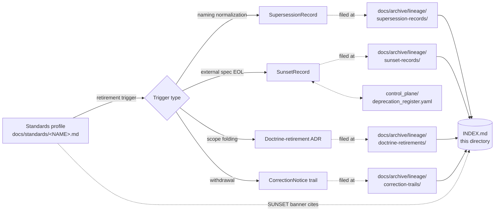

<!-- [KFM_META_BLOCK_V2]
doc_id: kfm://doc/<TODO-uuid>
title: Archived Lineage — Standards Profiles
type: standard
version: v1
status: draft
owners:
  primary: Docs steward
  co_authoring: [Standards steward, Correction reviewer]
  notes: "Roles CONFIRMED per Atlas v1.1 Ch. 24.7.1; 'Standards steward' is INFERRED as the docs/standards/ owner (PROPOSED naming, NEEDS VERIFICATION)."
created: 2026-05-25
updated: 2026-05-25
policy_label: public
related:
  - docs/archive/lineage/README.md
  - docs/standards/README.md
  - docs/standards/PROV.md
  - docs/standards/ISO-19115.md
  - docs/standards/OAI-PMH.md
  - docs/standards/OGC-API-TILES.md
  - docs/standards/PMTILES.md
  - docs/doctrine/directory-rules.md
  - docs/registers/DRIFT_REGISTER.md
  - control_plane/deprecation_register.yaml
tags: [kfm, archive, lineage, standards, supersession, navigational]
directory_rules_basis:
  - "§6.1   — docs/archive/{lineage,exploratory,deprecated} (CONFIRMED v1.3)."
  - "§6.1.a — docs/standards/ external-standards-profile contract (CONFIRMED v1.1)."
  - "§18 OPEN-DR-01 — PROV.md vs PROVENANCE.md naming dispute (worked example)."
  - "§18 OPEN-DR-02 — runbook subfolder vs flat (analogous convention question for this lane)."
notes:
  - "The subfolder 'standards/' under docs/archive/lineage/ is a PROPOSED domain-segmented view, NEEDS VERIFICATION against ADR."
  - "Records themselves live in the parent's flat record-category lanes; this directory is a navigational index, not a parallel filing authority."
  - "All paths to specific files under docs/archive/lineage/standards/ remain PROPOSED until inspected against a mounted repo."
[/KFM_META_BLOCK_V2] -->

# 📚 Archived Lineage — Standards Profiles

> Subject-indexed, navigational view of supersession lineage records pertaining to retired or superseded **external standards profiles** under [`docs/standards/`](../../../standards/). Records remain filed by category in the parent archive — this directory curates them by subject.


<!-- TODO — replace placeholder Shields targets once the docs CI surface is verified. -->

**Status:** `draft` · **Primary owner:** Docs steward <sub>(role CONFIRMED · person TODO)</sub> · **Co-authoring:** Standards steward, Correction reviewer · **Last updated:** `2026-05-25`

> [!IMPORTANT]
> This directory is a **curatorial view**, not a parallel filing surface. Documentation-surface lineage records are **filed** in the parent's record-category lanes — `docs/archive/lineage/{supersession-records,sunset-records,doctrine-retirements,correction-trails}/`. This `standards/` subdirectory holds **only** a README, an `INDEX.md`, and cross-references. Filing a record directly here creates parallel authority (Directory Rules §2.4(5)) and is **prohibited**.

> [!WARNING]
> **Subfolder convention is PROPOSED.** The parent archive (`docs/archive/lineage/`) is organized by **record category** — this `standards/` subfolder is organized by **subject**. The choice is analogous to runbook Pattern A (`docs/runbooks/fauna/`) and is subject to the same open question (Directory Rules §18 OPEN-DR-02). An ADR is needed to ratify subject-segmented views under `docs/archive/lineage/`. Until then, this directory exists as a navigational aid only.

---

## Contents

1. [Scope](#1-scope)
2. [Repo fit](#2-repo-fit)
3. [Inputs — what this view indexes](#3-inputs--what-this-view-indexes)
4. [Exclusions — what does not belong here](#4-exclusions--what-does-not-belong-here)
5. [Directory layout](#5-directory-layout)
6. [Index ↔ category mapping](#6-index--category-mapping)
7. [Subject-curation flow](#7-subject-curation-flow)
8. [Worked example — OPEN-DR-01](#8-worked-example--open-dr-01-provmd--provenancemd)
9. [Tracked standards and lineage candidates](#9-tracked-standards-and-lineage-candidates)
10. [Authoring workflow](#10-authoring-workflow)
11. [FAQ](#11-faq)
12. [Related docs](#12-related-docs)
13. [Per-root README contract](#13-per-root-readme-contract)
14. [Appendix](#14-appendix)

---

## 1. Scope

This directory provides a **subject-curated index** of lineage records that pertain to retired or superseded **external standards profiles** under `docs/standards/`. It exists because:

- Standards profiles have a distinctive churn pattern — naming normalization (e.g., `PROV.md` vs `PROVENANCE.md`), external version bumps, KFM extension drift, scope folding — that is easier to navigate when surfaced by subject than scattered across the four flat record-category lanes. **[INFERRED operational value.]**
- The KFM corpus already tracks one open standards-naming question (Directory Rules §18 **OPEN-DR-01**) whose ADR resolution will produce exactly the kind of record this view is meant to index. **[CONFIRMED via Directory Rules v1.1 §18 OPEN-DR-01.]**

The directory is **navigational**, not authoritative. The four record categories established by [`../README.md`](../README.md) §8 — `SupersessionRecord`, `SunsetRecord`, doctrine-retirement ADR, and `CorrectionNotice` trail — remain the **only** filing surfaces. Records filed here would create a parallel authority and violate Directory Rules §2.4(5).

> [!NOTE]
> **Status.** The placement of `docs/archive/` with `lineage/`, `exploratory/`, and `deprecated/` sub-areas is **CONFIRMED** via Directory Rules v1.3 §6.1. The **subject-segmented sub-lane `standards/`** below `docs/archive/lineage/` is **PROPOSED** — an explicit ADR is needed to ratify domain-segmented views, analogous to OPEN-DR-02 for runbooks. Until ratified, treat this directory as illustrative.

[⬆ Back to top](#-archived-lineage--standards-profiles)

---

## 2. Repo fit

This subfolder is a curated lens. It sits **inside** the documentation-surface lineage archive and points outward to active standards and to the category lanes where records actually live.

| Direction       | Surface                                                              | Relationship                                                                                                              | Status                  |
|-----------------|----------------------------------------------------------------------|---------------------------------------------------------------------------------------------------------------------------|-------------------------|
| Parent          | [`docs/archive/lineage/README.md`](../README.md)                     | Defines record categories and append-only invariant. This view inherits both.                                             | **CONFIRMED**           |
| Subject source  | [`docs/standards/README.md`](../../../standards/README.md)           | Active external-standards profiles tracked by KFM. Subject material of every record indexed here.                          | **CONFIRMED via §6.1.a**|
| Subject sources | `docs/standards/{ISO-19115,OAI-PMH,OGC-API-TILES,PMTILES,PROV}.md`   | Authored external-standards profiles (CONFIRMED authored prior session; **NEEDS VERIFICATION** in mounted repo).            | **AUTHORED · NEEDS VERIFICATION** |
| Filing lanes    | `docs/archive/lineage/{supersession-records,sunset-records,doctrine-retirements,correction-trails}/` | Where indexed records **actually** live. This view does not duplicate them.                                                | **PROPOSED**            |
| Machine partner | [`control_plane/deprecation_register.yaml`](../../../../control_plane/deprecation_register.yaml) | Machine-readable register required by Directory Rules §14.2. Entries tagged with `subject: standards` map here.            | **CONFIRMED via §14.2** |
| Drift detector  | [`docs/registers/DRIFT_REGISTER.md`](../../../registers/DRIFT_REGISTER.md) | Open entries about standards-file drift (e.g., `PROV.md` ↔ `PROVENANCE.md`) get linked here when resolved.                 | **CONFIRMED via §14.1** |
| ADR backing     | [`docs/adr/`](../../../adr/)                                         | Doctrine-level retirements of a standards profile produce an ADR; this view links to it.                                  | **CONFIRMED home**      |
| Sibling lanes   | `docs/archive/lineage/{<other-subject>}/`                            | Other subject-segmented views (PROPOSED, none authored yet). Convention question per §18 OPEN-DR-02.                       | **PROPOSED**            |
| Distinct        | The retired standards profile **itself**                             | Stays at its original path under `docs/standards/` with a SUNSET banner. Never moved here.                                | **CONFIRMED — distinct**|

[⬆ Back to top](#-archived-lineage--standards-profiles)

---

## 3. Inputs — what this view indexes

A lineage record qualifies for indexing here when **all three** are true:

1. The **subject** is a documentation surface under `docs/standards/` — an external-standards profile (e.g., `ISO-19115.md`, `OAI-PMH.md`, `OGC-API-TILES.md`, `PMTILES.md`, `PROV.md`) or a KFM-coined topical standards document (e.g., `SENSITIVITY_RUBRIC.md`, `REDACTION_DETERMINISM.md`, `SMART_SYNC.md`).
2. A governed lineage **record exists** in one of the parent's category lanes (`supersession-records/`, `sunset-records/`, `doctrine-retirements/`, `correction-trails/`) per parent README §8.
3. The record has been **signed off** through the authority ladder (`docs/doctrine/authority-ladder.md`) and made part of the archive — drafts and in-flight ADRs are not indexed.

Inputs typically arise from one of three event classes:

| Event class                                | Example                                                                                  | Likely record category               |
|--------------------------------------------|-------------------------------------------------------------------------------------------|---------------------------------------|
| **Naming normalization**                   | Directory Rules §18 **OPEN-DR-01** resolves `PROV.md` vs `PROVENANCE.md`.                 | `SupersessionRecord`                  |
| **External-spec deprecation absorbed by KFM** | An external standard reaches end-of-life and KFM retires its conformance profile.        | `SunsetRecord` (+ machine register entry) |
| **Scope folding** *(doctrine-level)*       | Two KFM-topical standards documents (e.g., `SIGNING.md` and a future `ATTESTATION.md`) are folded into one. | Doctrine-retirement ADR               |
| **Withdrawal under correction**            | A profile is withdrawn because its claims were materially wrong (rare but possible).      | `CorrectionNotice` trail              |

> [!TIP]
> If you cannot point to a governed record in a parent category lane, there is nothing to index — the record must exist first, then be cross-listed here.

[⬆ Back to top](#-archived-lineage--standards-profiles)

---

## 4. Exclusions — what does not belong here

| Out of scope                                              | Why                                                                              | Goes instead to                                                          |
|-----------------------------------------------------------|-----------------------------------------------------------------------------------|---------------------------------------------------------------------------|
| The retired standards profile itself                      | Retired docs remain at their `docs/standards/<NAME>.md` path with a SUNSET banner. | Original path, with `status: deprecated` in its meta block               |
| The **actual** record file (`KFM-SUP-NNNN-*.md`, etc.)    | Records live in the parent's category lanes; filing here creates parallel authority. | `docs/archive/lineage/<category>/KFM-<PREFIX>-NNNN-<slug>.md`            |
| Active deprecation entries (pre-sunset)                   | Still doing governance work; not yet historical.                                  | `control_plane/deprecation_register.yaml` <sub>CONFIRMED via §14.2</sub> |
| **External-spec** version bumps (e.g., STAC 1.0 → 1.1)    | Handled inside the standards profile via its own version block, not by retiring the profile. | `docs/standards/<NAME>.md` version block                                 |
| **Internal** schema supersession                          | Schemas use the in-header pattern per Atlas v1.1 Ch. 24.8.2.                       | Schema header + ADR + supersession link                                  |
| Crosswalk drift (e.g., DCAT ↔ STAC field mappings)        | A crosswalk drift is data-quality, not doc-surface retirement.                    | Crosswalk validator + `EvidenceBundle`                                   |
| New standards-profile **authorship** (e.g., `STAC.md`)    | New work belongs in active doctrine, not the archive.                              | `docs/standards/<NAME>.md` (new file)                                    |
| Open `DRIFT_REGISTER.md` entries                          | Drift is detection-stage; not yet a sunset.                                       | `docs/registers/DRIFT_REGISTER.md`                                       |
| The `PROV.md` ↔ `PROVENANCE.md` question **pre-ADR**      | The dispute is still open (Directory Rules §18 OPEN-DR-01); no record yet exists. | `docs/registers/DRIFT_REGISTER.md` + ADR backlog                         |

> [!CAUTION]
> Filing a record file directly under `docs/archive/lineage/standards/` (rather than cross-listing one filed in a parent category lane) creates a parallel filing surface and is **prohibited** under Directory Rules §2.4(5). The append-only invariant of the parent archive applies recursively: nothing here may be edited in place or removed; the only file that updates is `INDEX.md`.

[⬆ Back to top](#-archived-lineage--standards-profiles)

---

## 5. Directory layout

The subfolder is **PROPOSED**; its placement under `docs/archive/lineage/` inherits the CONFIRMED parent path (Directory Rules §6.1) but the subject-segmented sub-lane itself awaits ADR ratification (analogous to §18 OPEN-DR-02). The layout is intentionally minimal — this is a view, not a filing surface.

```text
docs/archive/lineage/standards/
├── README.md          # this file
└── INDEX.md           # curated cross-listing of standards-relevant records (PROPOSED — generator-driven)
```

No `KFM-SUP-*`, `KFM-SUN-*`, `KFM-DR-*`, or `KFM-COR-*` record files live here. Those remain at:

```text
docs/archive/lineage/
├── supersession-records/KFM-SUP-NNNN-<slug>.md
├── sunset-records/KFM-SUN-NNNN-<slug>.md
├── doctrine-retirements/KFM-DR-NNNN-<slug>.md
└── correction-trails/KFM-COR-NNNN-<slug>.md
```

`INDEX.md` in this directory then **cross-references** the subset of those records whose `subject` field equals `standards` (or names a file under `docs/standards/`).

> [!NOTE]
> If a future ADR ratifies subject-segmented filing **lanes** (not just views), the layout would change to mirror the parent's category lanes inside `standards/`. That decision is explicitly out of scope for this README; do not pre-empt it by filing records here.

[⬆ Back to top](#-archived-lineage--standards-profiles)

---

## 6. Index ↔ category mapping

`INDEX.md` is the only durable artifact in this directory besides the README. It maps each standards-relevant record back to its filing lane:

| INDEX column            | Source                                              | Notes                                                                |
|--------------------------|-----------------------------------------------------|----------------------------------------------------------------------|
| `record_id`             | Filename stem in the parent category lane          | e.g., `KFM-SUP-0042`                                                 |
| `category`              | Parent subdirectory                                | `supersession` · `sunset` · `doctrine-retirement` · `correction-trail` |
| `subject_path`          | Field inside the record                            | e.g., `docs/standards/PROV.md` (or its successor)                    |
| `successor_id`          | Field inside the record                            | Successor record ID or `null` + `no_successor_rationale`             |
| `retired_at`            | Field inside the record                            | ISO date                                                             |
| `authority_ladder_signoff` | Field inside the record                         | Comma-separated role list per Atlas v1.1 Ch. 24.7.1                  |
| `deprecation_register_entry` | `control_plane/deprecation_register.yaml`    | Cross-ref ID; required for sunset-class records                      |
| `adr_ref`               | If doctrine-retirement                             | e.g., `ADR-NNNN`                                                     |

> [!IMPORTANT]
> `INDEX.md` is **derivative**. It contains no claim that does not appear in a record file or the machine register. If a generator produces it, the generator is the authority for accuracy; if it is hand-maintained, the Docs steward is. Generator location is **PROPOSED — NEEDS VERIFICATION** (likely `tools/qa/` or `tools/registers/`).

[⬆ Back to top](#-archived-lineage--standards-profiles)

---

## 7. Subject-curation flow

The diagram shows how a standards-profile retirement event flows through the parent archive and lands as a cross-reference in this view's `INDEX.md`.



> [!WARNING]
> The diagram is **conceptual**. No standards profile has yet been retired; the flow is exercised against the open `OPEN-DR-01` case in §8 as a worked example only. Concrete tooling (generator, CI rule) for `INDEX.md` is **PROPOSED · NEEDS VERIFICATION**.

[⬆ Back to top](#-archived-lineage--standards-profiles)

---

## 8. Worked example — `OPEN-DR-01` (`PROV.md` ↔ `PROVENANCE.md`)

The clearest concrete candidate for this view is Directory Rules §18 **OPEN-DR-01**: the naming variance between the prior-session-authored `docs/standards/PROV.md` and the corpus-referenced `docs/standards/PROVENANCE.md`. The document **content** is the same in both; only the **filename** is in dispute.

**State today (CONFIRMED):** Both names are referenced in the corpus; only `PROV.md` is authored. The dispute is open and tracked at Directory Rules §18 OPEN-DR-01.

**When the ADR resolves (PROPOSED flow):**

1. ADR picks a canonical filename — say `PROV.md` (one defensible outcome; the other is equally defensible).
2. The non-canonical name is **deprecated** with a sunset entry in `control_plane/deprecation_register.yaml` (or, if no file under that name was ever authored, the deprecation step is skipped and we go straight to step 3).
3. A `SupersessionRecord` is filed at `docs/archive/lineage/supersession-records/KFM-SUP-NNNN-prov-naming.md` (PROPOSED prefix per parent README §9, ADR-pending).
4. The retired filename (if it was ever a real file) keeps a SUNSET banner pointing at the canonical name.
5. **This view's `INDEX.md`** gains a row:

   | record_id     | category     | subject_path             | successor_id | retired_at  | adr_ref |
   |---------------|--------------|--------------------------|--------------|-------------|---------|
   | `KFM-SUP-NNNN` | supersession | `docs/standards/PROVENANCE.md` (or `PROV.md`) | `KFM-SUP-NNNN` | `YYYY-MM-DD` | `ADR-NNNN` |

6. The active filename's profile gains an `aliases:` entry in its meta block citing the retired name and the supersession record ID.
7. Directory Rules §18 OPEN-DR-01 status flips from `open` to `resolved`, with a link to the ADR and the record.

> [!TIP]
> Until the ADR lands, **nothing about this example is filed here**. The pre-resolution drift is tracked at `docs/registers/DRIFT_REGISTER.md`, and the canonical filename for cross-references remains `PROV.md` per Directory Rules v1.1 §18 OPEN-DR-01 ("treat the authored `PROV.md` as the live artifact").

[⬆ Back to top](#-archived-lineage--standards-profiles)

---

## 9. Tracked standards and lineage candidates

This table inventories the external-standards profiles currently in scope for this view, and flags any open question that **could** produce a record indexed here. The list is sourced from Directory Rules v1.1 §6.1 / §18 and v1.2 OPEN-DR-05 — **PROPOSED** in scope, **CONFIRMED authored** in source.

| Profile filename        | Subject                                          | Authored?                          | Open lineage candidate                                   |
|--------------------------|--------------------------------------------------|------------------------------------|----------------------------------------------------------|
| `ISO-19115.md`           | Geographic metadata (ISO 19115)                  | **CONFIRMED authored** (prior session) | None known.                                              |
| `OAI-PMH.md`             | OAI-PMH 2.0 harvest                              | **CONFIRMED authored** (prior session) | None known.                                              |
| `OGC-API-TILES.md`       | OGC API Tiles v1.0                               | **CONFIRMED authored** (prior session) | None known.                                              |
| `PMTILES.md`             | PMTiles v3                                       | **CONFIRMED authored** (prior session) | None known.                                              |
| `PROV.md`                | W3C PROV-O / PAV                                 | **CONFIRMED authored** (prior session) | **OPEN-DR-01** — naming dispute with `PROVENANCE.md`.    |
| `SIGNING.md`             | Artifact signing (per Pass-10 C1-03)             | **PROPOSED in corpus** — not yet authored | n/a until authored.                                      |
| `SENSITIVITY_RUBRIC.md`  | Sensitivity rubric (per Pass-10 C6-01)           | **PROPOSED in corpus** — not yet authored | n/a until authored.                                      |
| `REDACTION_DETERMINISM.md` | Redaction determinism (per Pass-10 C6-03)      | **PROPOSED in corpus** — not yet authored | n/a until authored.                                      |
| `SMART_SYNC.md`          | Smart sync (per Pass-10 C3-01)                   | **PROPOSED in corpus** — not yet authored | n/a until authored.                                      |
| `STAC.md`                | SpatioTemporal Asset Catalog                     | **NEEDS VERIFICATION** (OPEN-DR-05 backlog) | n/a until authored.                                      |
| `DCAT.md`                | Data Catalog Vocabulary                          | **NEEDS VERIFICATION** (OPEN-DR-05 backlog) | n/a until authored.                                      |
| `JSON-LD.md`             | JSON-LD                                          | **NEEDS VERIFICATION** (OPEN-DR-05 backlog) | n/a until authored.                                      |
| `SLSA.md`                | SLSA provenance                                  | **NEEDS VERIFICATION** (OPEN-DR-05 backlog) | n/a until authored.                                      |
| `OPA.md`                 | Open Policy Agent                                | **NEEDS VERIFICATION** (OPEN-DR-05 backlog) | n/a until authored.                                      |
| `CIDOC-CRM.md`           | CIDOC Conceptual Reference Model                 | **NEEDS VERIFICATION** (OPEN-DR-05 backlog) | n/a until authored.                                      |
| `OPENLINEAGE.md`         | OpenLineage events                               | **NEEDS VERIFICATION** (OPEN-DR-05 backlog) | n/a until authored.                                      |

> [!NOTE]
> "Authored" means a prior Claude session produced a file matching the name; **presence in the mounted repo remains NEEDS VERIFICATION** per Directory Rules v1.1 §6.1 note. Repo-state is not implied here.

[⬆ Back to top](#-archived-lineage--standards-profiles)

---

## 10. Authoring workflow

The flow below is **PROPOSED** and identical to the parent archive's workflow with one added step (index cross-listing). Confirm against any existing runbook before treating it as official.

1. **Upstream governance signs off.** A `DeprecationNotice` (in `control_plane/deprecation_register.yaml`), `CorrectionNotice`, or ADR is authored and accepted through the authority ladder (`docs/doctrine/authority-ladder.md`). *This directory does not originate decisions.*
2. **Trigger event.** Sunset reached, supersession released, ADR accepted.
3. **Record filed in the parent category lane** — `docs/archive/lineage/<category>/KFM-<PREFIX>-NNNN-<slug>.md`. **Never filed here.**
4. **Index cross-listing.** A row is added to this view's `INDEX.md` (generator-driven if available, otherwise hand-maintained by Docs steward).
5. **SUNSET banner update.** The retired profile under `docs/standards/<NAME>.md` keeps its banner and gains a citation to the new record ID.
6. **`docs/standards/README.md` cross-link.** If the standards landing README maintains a "retired" callout, it is updated to point at the new record via this view's `INDEX.md`.
7. **Directory Rules §18 resolution.** If the event resolves an `OPEN-DR-` entry (e.g., OPEN-DR-01), the entry's status flips to `resolved` and links to the record.

**Authority required.** Per Atlas v1.1 Ch. 24.7.2:

- **Standards-naming supersession** (no sensitivity, no rights change): Docs steward + Standards steward.
- **Sunset of a standards profile** (external spec EOL): Docs steward + Standards steward + Release authority.
- **Doctrine-level scope fold** (multiple profiles merged): Docs steward + at least one subsystem owner + ADR (Directory Rules §2.4 amendment if it crosses canonical root boundaries).
- **Correction-trail withdrawal**: Docs steward + Correction reviewer + Release authority.

> [!WARNING]
> The order above is mandatory. Writing an `INDEX.md` row before the record file exists, or before the upstream governance artifact is signed off, violates the authority ladder.

[⬆ Back to top](#-archived-lineage--standards-profiles)

---

## 11. FAQ

<details>
<summary><b>Why is there a <code>standards/</code> subfolder if records don't live in it?</b></summary>

Because subject-curated navigation matters: when reviewers ask "what's the lineage history of our standards profiles?" they should be able to answer it in one place. The trade-off is that this directory must be **strictly navigational** — filing records here would create parallel authority with the parent's category lanes. The subfolder is PROPOSED (per Directory Rules §18 analogous OPEN-DR-02); an ADR may eventually replace it with a tag-based view inside the parent's `INDEX.md`.

</details>

<details>
<summary><b>Is filing a record file under this directory ever allowed?</b></summary>

No, not under current doctrine. The parent README §4 prohibits parallel filing surfaces, and this view explicitly opts in to that prohibition. If a future ADR converts subject-segmented views into subject-segmented **lanes**, that ADR will rewrite this README; until then, file in the parent category lanes only.

</details>

<details>
<summary><b>What happens if <code>OPEN-DR-01</code> resolves in favor of <code>PROVENANCE.md</code> instead of <code>PROV.md</code>?</b></summary>

The flow in §8 is symmetric. The ADR picks one canonical name; the other becomes a `SupersessionRecord` subject. If the canonical pick is `PROVENANCE.md`, then `PROV.md` (the authored prior-session file) becomes the **retired** subject, gains a SUNSET banner, and the record indexes here. The actual file rename / move proceeds under Directory Rules §14.1 (routine move).

</details>

<details>
<summary><b>How is this different from <code>docs/standards/README.md</code>?</b></summary>

`docs/standards/README.md` is the **active** standards landing — purpose, conformance posture, naming convention (UPPERCASE-WITH-HYPHENS for external standards), per Directory Rules §6.1.a. This directory's README is the **historical** lineage view — what was retired, when, and what replaced it. Active doctrine and historical lineage are different concerns and live in different places.

</details>

<details>
<summary><b>Does this view cover internal KFM topical standards (<code>SENSITIVITY_RUBRIC.md</code>, etc.)?</b></summary>

Yes, when authored and later retired. Directory Rules §6.1.a admits both classes of file under `docs/standards/`: external standards (UPPERCASE-WITH-HYPHENS) and KFM-coined topical documents (UPPERCASE_WITH_UNDERSCORES). Lineage records pertaining to either class are indexed here. The mixed-casing convention itself is tracked at OPEN-DR-04 — note that OPEN-DR-04 is a **naming**, not retirement, question and does not by itself produce a record here.

</details>

<details>
<summary><b>What about <code>STAC.md</code>, <code>DCAT.md</code>, and the OPEN-DR-05 backlog?</b></summary>

Those profiles are not yet authored. When authored, they enter §9 above as "CONFIRMED authored." If any is subsequently retired or superseded, a record lands in the parent's category lane and an `INDEX.md` row is added here. **OPEN-DR-05 itself is not a retirement — it is an authoring backlog.**

</details>

<details>
<summary><b>Can AI draft an <code>INDEX.md</code> row?</b></summary>

AI may **draft** index prose and propose cross-references, but the index row's truth value depends entirely on the existence of the referenced record file. The Docs steward signs off; the draft is preserved as an `AIReceipt`. Per the AI rule, AI is interpretive — never the root truth source.

</details>

[⬆ Back to top](#-archived-lineage--standards-profiles)

---

## 12. Related docs

The paths below cite Directory Rules v1.3 §6.1 placements. Per-doc paths under `docs/standards/` are CONFIRMED **homes** per Directory Rules §6.1.a; **presence** in a mounted repo remains NEEDS VERIFICATION.

**Parent archive (CONFIRMED canonical):**

- [`docs/archive/lineage/README.md`](../README.md) — parent archive, record categories, append-only invariant.
- [`docs/archive/exploratory/`](../../exploratory/) — superseded exploratory work (sibling, distinct purpose).
- [`docs/archive/deprecated/`](../../deprecated/) — archived content without successors (sibling, distinct purpose).

**Active subject material (CONFIRMED home per §6.1.a; presence NEEDS VERIFICATION):**

- [`docs/standards/README.md`](../../../standards/README.md) — active external-standards landing; naming convention.
- [`docs/standards/ISO-19115.md`](../../../standards/ISO-19115.md) — authored.
- [`docs/standards/OAI-PMH.md`](../../../standards/OAI-PMH.md) — authored.
- [`docs/standards/OGC-API-TILES.md`](../../../standards/OGC-API-TILES.md) — authored.
- [`docs/standards/PMTILES.md`](../../../standards/PMTILES.md) — authored.
- [`docs/standards/PROV.md`](../../../standards/PROV.md) — authored; OPEN-DR-01 naming candidate.

**Doctrine (CONFIRMED homes per §6.1):**

- [`docs/doctrine/directory-rules.md`](../../../doctrine/directory-rules.md) — §6.1, §6.1.a, §18 OPEN-DR-01 / -02 / -04 / -05.
- [`docs/doctrine/lifecycle-law.md`](../../../doctrine/lifecycle-law.md) — publication and supersession discipline.
- [`docs/doctrine/authority-ladder.md`](../../../doctrine/authority-ladder.md) — sign-off authority for filings indexed here.
- [`docs/doctrine/truth-posture.md`](../../../doctrine/truth-posture.md) — cite-or-abstain stance preserved by records here.

**Registers and machine partners:**

- [`docs/registers/DRIFT_REGISTER.md`](../../../registers/DRIFT_REGISTER.md) — open-drift detection surface (e.g., OPEN-DR-01 lives here pre-ADR).
- [`docs/registers/CANONICAL_LINEAGE_EXPLORATORY.md`](../../../registers/CANONICAL_LINEAGE_EXPLORATORY.md) — canonical/lineage/exploratory classification.
- [`control_plane/deprecation_register.yaml`](../../../../control_plane/deprecation_register.yaml) — machine-readable deprecation register (Directory Rules §14.2).
- [`docs/adr/`](../../../adr/) — ADRs backing doctrine-level retirements.

**External standards (`EXTERNAL` — context only):**

- W3C — *PROV-O*, https://www.w3.org/TR/prov-o/ — the standard whose KFM profile is `PROV.md`. *EXTERNAL standard reference; not a KFM repo claim.*

> [!NOTE]
> Related-doc **paths** cite Directory Rules §6.1 placements. Per-doc **presence** in the mounted repo remains NEEDS VERIFICATION — leave links in place with `NEEDS VERIFICATION` annotations rather than removing them.

[⬆ Back to top](#-archived-lineage--standards-profiles)

---

## 13. Per-root README contract

Directory Rules §15 requires every canonical root and compatibility root to carry a `README.md` with a fixed shape. This subdirectory is not a canonical or compatibility root (it is a curated view under one), but the §15 contract is applied here as a courtesy and a forcing function.

| Field                  | Value                                                                                                                                          |
|------------------------|------------------------------------------------------------------------------------------------------------------------------------------------|
| **Purpose**            | Navigational subject-index of supersession lineage records pertaining to external-standards profiles under `docs/standards/`.                  |
| **Authority level**    | **archive — navigational view** (not a filing surface; records live in parent category lanes).                                                 |
| **Status**             | `PROPOSED` for this subfolder convention; `CONFIRMED` for the parent `docs/archive/lineage/` placement (Directory Rules §6.1).                 |
| **What belongs here**  | This README and an `INDEX.md` cross-listing standards-relevant records filed in parent category lanes — see §3.                                |
| **What does NOT belong here** | Record files themselves (parallel-authority risk); the retired profile (stays at `docs/standards/`); active deprecation entries; external-spec version bumps — see §4. |
| **Inputs**             | Sign-off from authority ladder upstream; record file presence in a parent category lane; entries in `control_plane/deprecation_register.yaml`. |
| **Outputs**            | A discoverable subject-curated cross-reference for retired standards profiles. Cross-linked from `docs/standards/README.md`, retired SUNSET banners, and Directory Rules §18 entries when they resolve. |
| **Validation**         | INDEX integrity check (every row points at a real record file) — PROPOSED; append-only CI rule inherited from parent — PROPOSED.               |
| **Review burden**      | Docs steward (primary) + Standards steward. Sensitive-lane retirements add Correction reviewer + Release authority per Atlas v1.1 Ch. 24.7.2.   |
| **Related folders**    | `docs/archive/lineage/{supersession-records,sunset-records,doctrine-retirements,correction-trails}/`, `docs/standards/`, `docs/registers/`, `control_plane/`, `docs/adr/`. |
| **ADRs**               | **ADR-pending** — subject-segmented sub-lanes under `docs/archive/lineage/` (analogous to Directory Rules §18 OPEN-DR-02 for runbooks); plus parent-README identifier-namespace ADR. |
| **Last reviewed**      | `2026-05-25`                                                                                                                                   |

[⬆ Back to top](#-archived-lineage--standards-profiles)

---

## 14. Appendix

<details>
<summary><b>Glossary (project-doctrine terms used in this file)</b></summary>

| Term                                      | Meaning in this document                                                                                                  |
|-------------------------------------------|---------------------------------------------------------------------------------------------------------------------------|
| External-standards profile                | A KFM-authored conformance document under `docs/standards/` describing how KFM aligns with an external standard.           |
| KFM-topical standards document            | A KFM-coined document under `docs/standards/` (e.g., `SENSITIVITY_RUBRIC.md`) using UPPERCASE_WITH_UNDERSCORES per §6.1.a.  |
| Subject-curated view                      | A directory that organizes references by subject, without re-filing the underlying records.                                |
| Parallel filing authority                 | Two homes claiming the same governing role over the same artifact class — prohibited by Directory Rules §2.4(5).            |
| `INDEX.md`                                 | The cross-listing file in this directory; derivative of parent-lane records and the deprecation register.                  |
| `SupersessionRecord` / `SunsetRecord` / Doctrine-retirement ADR / `CorrectionNotice` trail | The four record categories established by the parent README §8.                                                            |
| Authority ladder                          | Role-based sign-off ordering (Docs steward, Standards steward, Correction reviewer, Release authority, …) per Atlas v1.1 Ch. 24.7.1. |
| OPEN-DR-NN                                | Directory Rules §18 open-question identifier; e.g., OPEN-DR-01 is the `PROV.md` ↔ `PROVENANCE.md` naming case.              |

</details>

<details>
<summary><b>What this document does not establish</b></summary>

- It does not establish the `standards/` subfolder under `docs/archive/lineage/` as ratified doctrine — that requires an ADR analogous to Directory Rules §18 OPEN-DR-02.
- It does not create or authorize a new identifier prefix or filing lane.
- It does not assert any retired standards profile in the mounted repo — at the time of writing, no `docs/standards/*.md` profile has been retired; the worked example in §8 is hypothetical pending OPEN-DR-01 resolution.
- It does not override the parent archive's record categories or append-only invariant.
- It does not constitute the resolution of OPEN-DR-01, OPEN-DR-02, OPEN-DR-04, or OPEN-DR-05.

</details>

<details>
<summary><b>Open verification items</b></summary>

1. **ADR — subject-segmented sub-lanes under `docs/archive/lineage/`.** Ratify or reject; if ratified, decide whether subject sub-lanes are *views* (current PROPOSED design) or *filing lanes* (would require rewriting this README).
2. Confirm `docs/archive/lineage/standards/` is the intended path for this subject view, vs. `docs/archive/lineage/by-subject/standards/` or a tag-based view in the parent `INDEX.md`.
3. Confirm `INDEX.md` is hand-maintained or generator-driven; locate the generator if any (likely `tools/qa/` or `tools/registers/` — NEEDS VERIFICATION).
4. Confirm the "Standards steward" role exists in `docs/doctrine/authority-ladder.md` or whether the responsibility falls to a different named role (e.g., "Domain steward" with `docs/standards/` as scope).
5. Confirm the CI enforcement of the append-only invariant covers this subdirectory.
6. Identify named owners and replace placeholders in the meta block.
7. Resolve Directory Rules §18 OPEN-DR-01 (PROV.md ↔ PROVENANCE.md) — first concrete event likely to populate `INDEX.md`.
8. Resolve OPEN-DR-04 (filename casing convention) by per-root README in `docs/standards/README.md` or by ADR.
9. Track OPEN-DR-05 (authoring backlog: STAC, DCAT, JSON-LD, SLSA, OPA, CIDOC-CRM, OPENLINEAGE) — no records expected here until those files exist and are later retired.

</details>

[⬆ Back to top](#-archived-lineage--standards-profiles)

---

**Related:** [Parent archive](../README.md) · [Active standards](../../../standards/README.md) · [Directory Rules](../../../doctrine/directory-rules.md) · [Drift Register](../../../registers/DRIFT_REGISTER.md) · [Deprecation Register (machine)](../../../../control_plane/deprecation_register.yaml)
**Last updated:** 2026-05-25
[⬆ Back to top](#-archived-lineage--standards-profiles)
