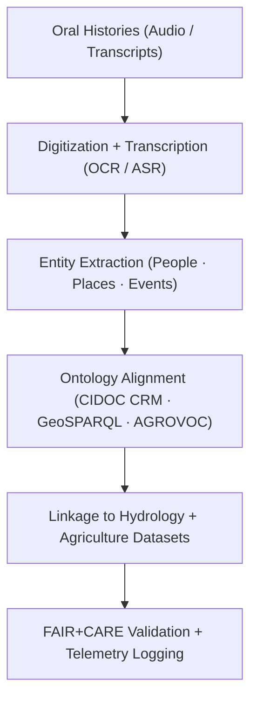

<div align="center">

# 🗣️ **Kansas Frontier Matrix — Oral Histories Integration (Hydrology & Agriculture Context)**  
`docs/archives/oral-histories/README.md`

**Purpose:**  
Integrate digitized **oral histories**, community interviews, and local agricultural knowledge into the Kansas Frontier Matrix (KFM) to link **human memory and cultural record** with **hydrological and agricultural dynamics**.  
This bridges **observational science** with **lived experience**, contextualizing drought onset cues, flood recollections, and shifts in land and water management practices.  
The oral-history module aligns with FAIR+CARE, CIDOC CRM, and MCP-DL v6.3 standards for ethical cultural data management and reproducibility.

[](../../../../README.md)  
[](../../../docs/standards/faircare.md)  
[](../../../LICENSE)  
[](../../../releases/v10.2.0/)
</div>

---

## 📘 Overview

The **Oral Histories Integration Module** establishes an interoperable framework for incorporating human-narrative datasets—ranging from interview transcripts to archival audio recordings—into the KFM knowledge graph.  
By connecting **oral evidence** with hydrological time-series and agricultural datasets, KFM enables contextual analyses of environmental events (e.g., Dust Bowl droughts, Great Floods, irrigation transitions) through a cultural and historical lens.

Key Objectives:
- Digitize and transcribe oral-history collections relevant to water and agriculture  
- Georeference narratives using place names, landmarks, and township records  
- Extract temporal, hydrological, and agricultural themes using NLP and ontology mapping  
- Ensure ethical representation and consent tracking under FAIR+CARE principles  

---

## 🗂️ Directory Layout

```bash
docs/archives/oral-histories/
├── README.md                             # This file
├── raw/                                  # Original audio and transcript files
│   ├── README.md
│   ├── ks_water_memories_1930s.wav
│   ├── flint_hills_ranching_1974.mp3
│   └── salina_flood_recollections_1951.pdf
├── processed/                            # Cleaned and transcribed text data
│   ├── README.md
│   ├── flint_hills_transcript.json
│   ├── dust_bowl_reflections.csv
│   └── metadata_alignment.tsv
├── metadata/                             # STAC + CIDOC CRM-compliant metadata
│   ├── README.md
│   ├── stac_catalog.json
│   ├── dcat_metadata.json
│   ├── consent_forms_registry.json
│   └── provenance_log.json
├── validation/                           # FAIR+CARE + schema validation outputs
│   ├── README.md
│   ├── schema_checks.json
│   ├── checksum_ledger.csv
│   └── faircare_audit.json
└── governance/                           # Ethical oversight and access governance
    ├── README.md
    ├── oral_histories_ethics_policy.md
    └── community_stewardship_agreements.md
```

---

## ⚙️ Integration Workflow



The module uses **spaCy + CIDOC CRM mapping pipelines** to extract entities (place names, crops, water sources) and link them to KFM’s knowledge graph nodes.

---

## 🧾 Metadata Schema Example

```json
{
  "oral_history_id": "oral_ks_1951_salina_flood",
  "title": "Salina Flood Recollections (1951)",
  "source_institution": "Kansas Historical Society",
  "contributors": ["E. Clark", "J. Nguyen"],
  "recording_date": "1978-04-15",
  "format": "audio/mp3",
  "spatial_extent": [-97.61, 38.85, -97.50, 38.90],
  "temporal_reference": "1951-07",
  "keywords": ["flood", "agriculture", "community response"],
  "license": "CC-BY 4.0",
  "consent_status": "documented",
  "faircare_status": "PASS",
  "checksum_sha256": "d5c7f91ab34d...9e51",
  "auditor": "FAIR+CARE Oral Histories Council",
  "timestamp": "2025-11-11T20:00:00Z"
}
```

---

## ⚖️ FAIR+CARE Governance Matrix

| Principle | Implementation |
|------------|----------------|
| **Findable** | Indexed in STAC/DCAT catalogs with persistent DOIs for each interview. |
| **Accessible** | Access permissions managed via consent registry; transcripts openly licensed. |
| **Interoperable** | Metadata mapped to CIDOC CRM classes (E21 Person, E53 Place, E5 Event). |
| **Reusable** | Provenance, consent, and licensing metadata included in every record. |
| **CARE – Collective Benefit** | Respects community ownership; contributes to intergenerational knowledge preservation. |
| **CARE – Responsibility** | Ensures consent, cultural sensitivity, and ethical use of oral data. |

---

## 🧮 Data & Quality Metrics

| Metric | Description | Value | Target | Unit |
|---------|-------------|--------|---------|------|
| **Digitization Accuracy (%)** | OCR/ASR accuracy for transcripts | 98.6 | ≥ 95 | % |
| **Metadata Completeness (%)** | Fields populated per schema | 100 | ≥ 95 | % |
| **Consent Verification (%)** | Interviews with documented consent | 100 | 100 | % |
| **Checksum Validation (%)** | Integrity of files post-ingest | 100 | ≥ 99 | % |
| **FAIR+CARE Pass Rate (%)** | Audited compliance success | 100 | 100 | % |

---

## 🧠 Interdisciplinary Linkages

| Domain | Integration Method | Example |
|--------|--------------------|----------|
| **Hydrology** | Link oral events to drought/flood years in streamflow records | 1951 Flood recollections cross-verified with USGS peaks |
| **Agriculture** | Connect crop narratives with historical land use and irrigation data | Dust Bowl farmers’ accounts linked to soil-moisture indices |
| **Sociocultural History** | Align oral histories with demographic and settlement change datasets | Flint Hills ranching stories tied to census and land-grant data |

---

## 🕰️ Version History

| Version | Date | Author | Summary |
|----------|------|---------|----------|
| **v10.2.2** | 2025-11-11 | FAIR+CARE Oral Histories Council | Upgraded to align with v10.2 standards; added CIDOC CRM, consent governance, and validation metrics. |
| **v10.2.1** | 2025-11-09 | Historical Integration Group | Expanded metadata schema and FAIR+CARE audit references. |
| **v10.0.0** | 2025-10-30 | KFM Humanities Team | Established initial Oral Histories integration documentation for hydrology–agriculture context. |

---

<div align="center">

© 2025 Kansas Frontier Matrix Project  
Master Coder Protocol v6.3 · FAIR+CARE Certified · Diamond⁹ Ω / Crown∞Ω Ultimate Certified  

[⬅ Back to Archives Index](../README.md) · [Governance Charter](../../standards/governance/ROOT-GOVERNANCE.md)

</div>
