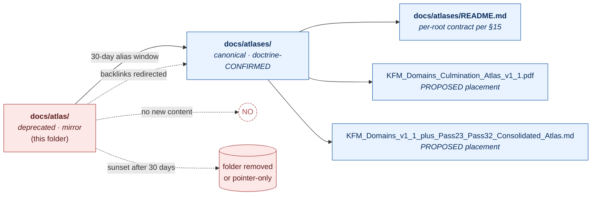

<!-- [KFM_META_BLOCK_V2]
doc_id: kfm://doc/PATH_TBD_AFTER_REPO_INSPECTION
title: docs/atlas/ — Deprecated Compatibility Mirror
type: standard
version: v1
status: draft
owners: OWNER_TBD (docs steward; placement steward)
created: 2026-05-25
updated: 2026-05-25
policy_label: public
related:
  - docs/atlases/
  - docs/atlases/README.md
  - docs/adr/ADR-S-02-docs-dossiers-vs-docs-atlases.md
  - docs/doctrine/directory-rules.md
  - docs/registers/DRIFT_REGISTER.md
  - control_plane/deprecation_register.yaml
tags: [kfm, docs, atlas, compatibility, mirror, deprecated, migration]
notes:
  - "This is a compatibility/mirror README for a deprecated path. Canonical lane is docs/atlases/."
  - "Sunset window: 30 days from migration adoption (PROPOSED; exact start NEEDS VERIFICATION)."
  - "Doctrine basis: directory-rules.md v1.2 §6.1, §13.5; KFM Repository Structure Guiding Document migration plan; Atlas v1.1 Appendix G; ADR-S-02."
  - "Owner, doc_id, exact sunset date are placeholders pending mounted-repo inspection and ADR-S-02 acceptance."
[/KFM_META_BLOCK_V2] -->

# `docs/atlas/` — Deprecated Compatibility Mirror

> A 30-day transitional alias for the canonical atlas lane. **Do not add files here.** New atlases, dossiers, and master registers live under [`docs/atlases/`](../atlases/).

<!-- Impact block -->

> [!IMPORTANT]
> **Status:** `DEPRECATED` (doctrine-CONFIRMED) / `PROPOSED` sunset date pending ADR-S-02 acceptance and mounted-repo migration timestamp.
> **Owner:** `OWNER_TBD` — docs steward + placement steward.
> **Canonical lane:** [`docs/atlases/`](../atlases/) — go there for every atlas, dossier, master register, and crosswalk.
> **Sunset:** 30 days after migration adoption (per *KFM Repository Structure Guiding Document* migration plan). Exact calendar date `NEEDS VERIFICATION` against `control_plane/deprecation_register.yaml`.
> **Truth posture:** `CONFIRMED` doctrine (lane choice) / `PROPOSED` implementation (this README's presence and the alias mechanics) / `UNKNOWN` repo depth until a mounted repo is inspected.

**Quick jumps:** [Purpose](#1-purpose) · [Why this folder is deprecated](#2-why-this-folder-is-deprecated) · [Authority level](#3-authority-level) · [Status](#4-status) · [What belongs here](#5-what-belongs-here) · [What does NOT belong here](#6-what-does-not-belong-here) · [Inputs](#7-inputs) · [Outputs](#8-outputs) · [Migration map](#9-migration-map) · [Validation](#10-validation) · [Review burden](#11-review-burden) · [Related folders](#12-related-folders) · [ADRs](#13-adrs-and-open-dr-references) · [Verification checklist](#14-verification-checklist) · [Rollback](#15-rollback) · [Last reviewed](#16-last-reviewed)

---

## 1. Purpose

`PROPOSED — This folder is a **transitional compatibility mirror** for the canonical atlas lane at [`docs/atlases/`](../atlases/).` It exists only to keep old backlinks from breaking during the 30-day migration window and to surface a clear pointer to the canonical lane. It does not own any atlas content, master register, or doctrine artifact.

`CONFIRMED doctrine — "one canonical lane per doctrine artifact class; Atlas v1.1 Appendix G proposes `docs/atlases/`."` (`directory-rules.md` v1.2 §6.1, §13.5; *KFM Repository Structure Guiding Document*, Migration plan row `Docs naming`.)

---

## 2. Why this folder is deprecated

`CONFIRMED — `docs/atlas/` (singular) and `docs/atlases/` (plural) were both observed in the corpus as live doc lanes.` (`directory-rules.md` v1.2 §13.5 row "Docs naming duplication".) That is parallel-authority drift per §2.4(5): one canonical lane per doctrine artifact class.

`CONFIRMED resolution — Pick `docs/atlases/` per §6.1 / Atlas v1.1 Appendix G; deprecate or mirror `docs/atlas/`.` (`directory-rules.md` v1.2 §13.5; Atlas v1.1 Appendix G; *KFM Repository Structure Guiding Document* migration table row `Docs naming`.)

`CONFIRMED rationale — Atlas v1.1 Appendix G fixes the canonical citation form at `docs/atlases/KFM_Domains_Culmination_Atlas_v1_1.pdf` (PROPOSED placement per Directory Rules §5 / §6.1).` Plural matches the artifact class (a folder of *atlases*), aligns with Encyclopedia §12 cadence rules (which already reference `docs/atlases/`), and matches the corpus's own cross-references.

> [!NOTE]
> The diagram reflects the migration topology described in `directory-rules.md` v1.2 §13.5 and the *KFM Repository Structure Guiding Document* migration plan. The two PDF/Markdown filenames shown are `PROPOSED` placements per Atlas v1.1 Appendix G and the polished-markdown carrier's front matter; mounted-repo presence is `NEEDS VERIFICATION`.

[↑ back to top](#top)

---

## 3. Authority level

`CONFIRMED — Compatibility root; class **mirror / deprecated / transitional**.` (`directory-rules.md` §8.1 compatibility-root classes; §15 README contract.)

| Class | Applies? | Notes |
|---|:---:|---|
| Canonical | ❌ | Canonical doc-lane authority belongs to `docs/atlases/`. |
| Implementation-bearing | ❌ | No code, schemas, or fixtures live here. |
| Generated | ❌ | Not a build-output sink. |
| Compatibility — **mirror** | ✅ | Preserves old backlinks. |
| Compatibility — **deprecated** | ✅ | Slated for removal after the sunset window. |
| Compatibility — **transitional** | ✅ | Exists only for the migration window. |
| Compatibility — legacy / external-export | ❌ | Not the right framing here. |
| Archive | ❌ | Archival doctrine lives in `docs/registers/` and superseded-edition lineage in the atlas itself (Atlas v1.0 Appendix E; v1.1 Appendix G). |
| Exploratory | ❌ | Exploratory work routes through `docs/registers/CANONICAL_LINEAGE_EXPLORATORY.md`. |

[↑ back to top](#top)

---

## 4. Status

- **Doctrine status:** `CONFIRMED — DEPRECATED.` (`directory-rules.md` v1.2 §6.1, §13.5; *KFM Repository Structure Guiding Document* migration plan.)
- **Mounted-repo presence:** `UNKNOWN` — no mounted repo, workflow run, or `control_plane/deprecation_register.yaml` entry was inspected in this session.
- **Sunset date:** `PROPOSED` — 30 days from the migration manifest's `git_sha_after` timestamp. `NEEDS VERIFICATION` once `control_plane/deprecation_register.yaml` carries a concrete `sunset_date`.
- **ADR linkage:** `ADR-S-02` (`docs/dossiers/` vs `docs/atlases/`) is the governing ADR-class question per Atlas v1.1 polished-carrier open-question register row 3 and `directory-rules.md` v1.1 §18.b. ADR acceptance `NEEDS VERIFICATION`.

[↑ back to top](#top)

---

## 5. What belongs here

`PROPOSED — During the sunset window, this folder MAY contain **only**:`

1. **This `README.md`** — the deprecation notice you are reading.
2. **Pointer pages** that redirect a specific historical backlink to its `docs/atlases/` target. Each pointer page MUST:
   - State `DEPRECATED — see <canonical path>` in its first non-meta line.
   - Carry a `KFM_META_BLOCK_V2` with `status: deprecated` and a `related:` link to its canonical target.
   - Carry no atlas content of its own — no chapters, no tables, no registers, no master atlases, no crosswalks.
3. **Nothing else.**

> [!WARNING]
> Adding a real atlas, dossier, master register, crosswalk, or any new authoring artifact under `docs/atlas/` reintroduces the parallel-authority drift that this migration is closing. PRs that do so should be refused at review per `directory-rules.md` §2.4(5) and routed to `docs/atlases/`.

[↑ back to top](#top)

---

## 6. What does NOT belong here

`CONFIRMED via doctrine — none of the following may live under `docs/atlas/`:`

- New atlases (any edition, any domain set).
- New master registers, master atlases, master matrices.
- Dossier prose, encyclopedia content, capability crosswalks.
- ADRs (those live under `docs/adr/`).
- Drift register entries (those live under `docs/registers/DRIFT_REGISTER.md`).
- Machine schemas (`schemas/contracts/v1/...`), policy bundles (`policy/`), validators (`tools/`), fixtures (`fixtures/`), tests (`tests/`).
- Receipts, proofs, EvidenceBundles, release manifests, promotion decisions, rollback cards, correction notices, catalog records, published layers, SBOMs, attestations, signatures.
- Machine registers (those live under `control_plane/`).
- Generated QA output or temporary artifacts (those live under `artifacts/qa/` or `artifacts/temporary/`).
- New PDFs whose canonical placement is `docs/atlases/<name>.pdf`.

[↑ back to top](#top)

---

## 7. Inputs

`PROPOSED:`

- **Migration manifest** — the `migrations/data/` or equivalent entry that records the `docs/atlas/ → docs/atlases/` move with `git_sha_before` and `git_sha_after`. (`directory-rules.md` §14.2.4.)
- **Deprecation register entry** — `control_plane/deprecation_register.yaml` row with `sunset_date`. (`directory-rules.md` §14.2.5.)
- **Backlink scan output** — output of a docs link-scanner identifying every `[…](docs/atlas/...)` reference in the repo so it can be redirected to `docs/atlases/...`.

[↑ back to top](#top)

---

## 8. Outputs

`PROPOSED:`

- **A single deprecation notice** (this README).
- **Optional pointer pages** during the sunset window, each redirecting one specific old backlink.
- **Zero trust-bearing or doctrine-bearing artifacts.** This folder produces no atlas, no register, no contract, no schema, no policy, no decision, no receipt.

[↑ back to top](#top)

---

## 9. Migration map

`CONFIRMED at doctrine level / PROPOSED at implementation level.` The migration follows `directory-rules.md` §14.2 (structural moves) and the *KFM Repository Structure Guiding Document* migration row `Docs naming`.

| Old path (this folder) | Canonical destination | Status | Notes |
|---|---|---|---|
| `docs/atlas/` (the folder itself) | `docs/atlases/` | `PROPOSED — alias for 30 days, then remove` | Per §13.5 row "Docs naming duplication". |
| `docs/atlas/<any-atlas-pdf>` | `docs/atlases/<atlas-pdf>` | `NEEDS VERIFICATION` | Move under `git mv`; preserve history; update backlinks. |
| `docs/atlas/KFM_Domains_Culmination_Atlas_v1_1.pdf` *(if present in legacy lane)* | `docs/atlases/KFM_Domains_Culmination_Atlas_v1_1.pdf` | `PROPOSED placement` | Per Atlas v1.1 Appendix G G.4 row "PROPOSED repo placement". Mounted-repo presence at either path is `NEEDS VERIFICATION`. |
| `docs/atlas/KFM_Domains_v1_1_plus_Pass23_Pass32_Consolidated_Atlas.md` *(if present in legacy lane)* | `docs/atlases/KFM_Domains_v1_1_plus_Pass23_Pass32_Consolidated_Atlas.md` | `PROPOSED placement` | Per the polished-carrier front-matter "Proposed file home" row. Mounted-repo presence at either path is `NEEDS VERIFICATION`. |
| Any other historic file under `docs/atlas/` | `docs/atlases/<same-name>` *(default rule)* | `NEEDS VERIFICATION` | If the file's class is not an atlas (e.g., it's actually a register, ADR, or dossier), route to its responsibility root instead — `docs/registers/`, `docs/adr/`, or `docs/dossiers/` — per Directory Rules §6.1. |

> [!NOTE]
> **Migration discipline (summary).** Move under `git mv`; update references in code, docs, schemas, fixtures, tests, workflows; add an entry to `control_plane/deprecation_register.yaml` with `sunset_date`; verify rollback via a dry-run rollback card; close the migration by removing the mirror only after the verification window passes. (`directory-rules.md` §14.2.)

[↑ back to top](#top)

---

## 10. Validation

`PROPOSED — the following checks should run while this mirror is live:`

- **Link-check** confirms no internal repo link points to `docs/atlas/<path>` after the migration manifest is closed.
- **Path-drift scan** flags any new file landing under `docs/atlas/` that is not a pointer page conforming to §5.
- **README-contract check** confirms this README still carries all `directory-rules.md` §15 sections.
- **Deprecation-register check** confirms the row for `docs/atlas/` exists in `control_plane/deprecation_register.yaml` with a non-empty `sunset_date`.
- **Drift-register coverage check** confirms an entry exists in `docs/registers/DRIFT_REGISTER.md` for the duration of the sunset window.

> [!CAUTION]
> Concrete validator command names (e.g., `python tools/validate_all.py`) are `NEEDS VERIFICATION` against the mounted repo; do not invoke a specific entry-point in CI from this README without confirming it. The validator-orchestrator entry-point is under `OPEN-DR-07` per `directory-rules.md` v1.1 §18.b.

[↑ back to top](#top)

---

## 11. Review burden

`PROPOSED:`

- **`OWNER_TBD` — docs steward** (primary): owns the migration manifest, deprecation register entry, and removal at sunset.
- **`OWNER_TBD` — placement / governance steward** (secondary): reviews any PR that touches this folder during the sunset window.
- **Affected subsystem owners**: any team whose docs previously linked into `docs/atlas/` is responsible for updating their own backlinks before sunset.

[↑ back to top](#top)

---

## 12. Related folders

| Folder | Relationship |
|---|---|
| [`docs/atlases/`](../atlases/) | **Canonical lane.** This is where every atlas, dossier carrier, master register, and crosswalk lives. |
| [`docs/adr/`](../adr/) | Home of `ADR-S-02` and any superseding ADR for the docs-lane choice. |
| [`docs/registers/`](../registers/) | Home of `DRIFT_REGISTER.md` and the verification backlog tracking this migration. |
| [`docs/doctrine/`](../doctrine/) | Home of `directory-rules.md`, which is the authority for this deprecation. |
| `control_plane/` | Home of `deprecation_register.yaml`, which carries the machine-readable sunset entry. |
| `migrations/data/` (or equivalent) | Home of the migration manifest with `git_sha_before` / `git_sha_after`. |

> All relative links are `PROPOSED` from this file's location (`docs/atlas/README.md`). They are `NEEDS VERIFICATION` against a mounted repo.

[↑ back to top](#top)

---

## 13. ADRs and OPEN-DR references

| Identifier | Subject | Status | Source |
|---|---|---|---|
| **ADR-S-02** | `docs/dossiers/` vs `docs/atlases/` — formal selection of the atlas lane and treatment of `docs/atlas/` as deprecated alias | `Open` / `NEEDS VERIFICATION` acceptance | `directory-rules.md` v1.2 §6.1, §13.5; Atlas v1.1 Appendix G; polished-carrier open-question register row 3 |
| **OPEN-DR-01** | `PROV.md` vs `PROVENANCE.md` naming (related lane-naming family) | `Open — deferred to ADR` | `directory-rules.md` v1.1 §18.b |
| **`directory-rules.md` §6.1** | Canonical `docs/` tree and lane choices | `CONFIRMED doctrine` | `directory-rules.md` v1.2 |
| **`directory-rules.md` §13.5** | Anti-patterns table row "Docs naming duplication" | `CONFIRMED at commit b6a279…` | `directory-rules.md` v1.2 |
| **`directory-rules.md` §14.2** | Structural-move discipline | `CONFIRMED doctrine` | `directory-rules.md` v1.2 |

[↑ back to top](#top)

---

## 14. Verification checklist

- [ ] Confirm `docs/atlases/` exists and carries a per-root `README.md` per `directory-rules.md` §15.
- [ ] Confirm `ADR-S-02` is filed under `docs/adr/` (path and number per the ADR ledger).
- [ ] Confirm `control_plane/deprecation_register.yaml` carries a `docs/atlas/` row with a concrete `sunset_date`.
- [ ] Confirm a migration manifest exists under `migrations/data/` (or equivalent) with `git_sha_before` and `git_sha_after`.
- [ ] Confirm a `docs/registers/DRIFT_REGISTER.md` entry tracks this migration for the duration of the sunset window.
- [ ] Confirm every internal repo backlink to `docs/atlas/<anything>` has been redirected to `docs/atlases/<anything>` before sunset.
- [ ] Confirm no new file has landed under `docs/atlas/` other than this README or a conforming pointer page (per §5).
- [ ] Confirm `OWNER_TBD` placeholders in this README have been resolved before this folder is removed.
- [ ] Confirm the canonical-citation form for the Domains Culmination Atlas (Atlas v1.1 Appendix G G.4) resolves to `docs/atlases/KFM_Domains_Culmination_Atlas_v1_1.pdf`.

[↑ back to top](#top)

---

## 15. Rollback

Rollback is required when the migration weakens source integrity, breaks stable links that cannot be redirected within the sunset window, creates an ambiguous citation form for the Domains Culmination Atlas or the polished-markdown carrier, or otherwise reintroduces parallel-authority drift in a worse form than it resolves.

`PROPOSED rollback path:` restore the legacy folder as a writable mirror by reverting the migration manifest's `git_sha_after`, re-mirroring any moved files at their `docs/atlas/` paths, removing the `sunset_date` from `control_plane/deprecation_register.yaml`, and opening a follow-on ADR superseding ADR-S-02.

**Rollback target:** `ROLLBACK_TARGET_TBD` — record the migration manifest `git_sha_before` here once known.

> [!WARNING]
> Rollback that re-publishes atlas content at `docs/atlas/<path>` after a canonical edition has been cited from `docs/atlases/<path>` MUST emit a `CorrectionNotice` against any released artifact that depended on the canonical path. (Per `directory-rules.md` §14.3 rename-changes-identity discipline, applied to citation paths.)

[↑ back to top](#top)

---

## 16. Last reviewed

| Field | Value |
|---|---|
| Last reviewed | `2026-05-25` |
| Reviewer | `OWNER_TBD` (docs steward) |
| Next review | Sunset date (PROPOSED: migration `git_sha_after` + 30 days; `NEEDS VERIFICATION`) |

---

<strong>Appendix A — Evidence basis (source ledger)</strong>

| Source | Status | Supports | Limits |
|---|---|---|---|
| `directory-rules.md` v1.2 §6.1 (`docs/` tree) | `CONFIRMED doctrine` | `docs/atlases/` is the canonical lane; `docs/atlas/` is duplicate drift. | Does not prove mounted-repo presence of either folder. |
| `directory-rules.md` v1.2 §13.5 row "Docs naming duplication" | `CONFIRMED at commit b6a279…` | The two paths both observed; canonical resolution is `docs/atlases/`. | Commit-pinned doctrine claim, not a current `ls` of the working tree. |
| `directory-rules.md` v1.2 §14.2 (structural moves) | `CONFIRMED doctrine` | Migration discipline, mirror window, deprecation register entry, dry-run rollback. | Does not prescribe an exact sunset calendar date. |
| *KFM Repository Structure Guiding Document* — Migration plan row `Docs naming` | `CONFIRMED doctrine` | "`docs/atlas/` → `docs/atlases/`, 30-day mirror window, restore old folder alias and update backlinks." | Does not name a mounted-repo path. |
| *KFM Repository Structure Guiding Document* — `docs/` root contract row | `CONFIRMED doctrine` | `docs/` is the canonical human-facing control plane; PROPOSED cleanup for duplicate atlas paths. | Refers to "duplicate atlas/temporary/registry paths" as PROPOSED cleanup. |
| Atlas v1.1 Appendix G G.4 | `CONFIRMED edition statement` | `docs/atlases/KFM_Domains_Culmination_Atlas_v1_1.pdf` is the PROPOSED canonical placement. | Atlas explicitly notes "Final repo placement, file naming, and the review record … NEEDS VERIFICATION." |
| Polished-markdown carrier front matter (Pass 23/32 consolidated atlas) | `CONFIRMED carrier statement` | Lane choice `docs/atlases/` is doctrine-CONFIRMED; alias `docs/atlas/` for 30 days. | Mounted-repo presence at the exact carrier path remains `NEEDS VERIFICATION`. |
| Polished-markdown carrier open-question register row 3 | `Open — deferred to ADR` | Names `ADR-S-02` as the governing ADR-class question. | ADR acceptance status is not stated. |
| KFM Encyclopedia §12 maintenance table | `CONFIRMED reference` | "New atlas edition lands in `docs/atlases/` → Update §3 Edition Lineage and §6 cross-references." | Confirms `docs/atlases/` is the working canonical lane in other doctrine. |

**Memory is not evidence.** No mounted repo, CI run, workflow, dashboard, or branch state was inspected for this README. Every implementation claim above is bounded to doctrine.

<strong>Appendix B — Reading order if you arrived here from a stale link</strong>

1. Stop reading content at `docs/atlas/`. Nothing here is canonical.
2. Go to [`docs/atlases/`](../atlases/) and read its `README.md`.
3. For the Domains Culmination Atlas, the canonical edition is **Atlas v1.1** (`KFM_Domains_Culmination_Atlas_v1_1.pdf`, PROPOSED placement at `docs/atlases/`).
4. For the Pass-card consolidation, the canonical carrier is `KFM_Domains_v1_1_plus_Pass23_Pass32_Consolidated_Atlas.md` (PROPOSED placement at `docs/atlases/`).
5. For doctrine questions about *why* the lane is plural, read `directory-rules.md` §6.1 and §13.5 row "Docs naming duplication".
6. For the ADR-class resolution, see `ADR-S-02`.

[↑ back to top](#top)
