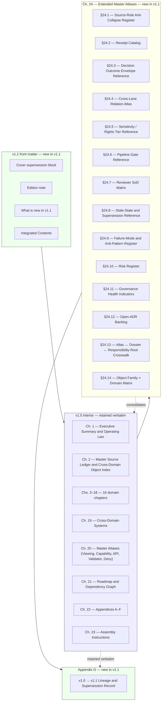

<!-- [KFM_META_BLOCK_V2]
doc_id: kfm://doc/NEEDS-VERIFICATION
title: KFM Domains Culmination Atlas v1.1 — Source-A Carrier
type: standard
version: v0.1
status: draft
owners: OWNER_TBD
created: 2026-05-25
updated: 2026-05-25
policy_label: public
related:
  - docs/atlases/Kansas_Frontier_Matrix_-_Domains_v1_1___Pass_23_32_Consolidated_Atlas.md
  - docs/atlases/kfm-domains-v1.1-pass23-32-consolidated-atlas.md
  - docs/atlases/domains-v1.1.md
  - docs/atlases/domains-v1.1-ch14.md
  - docs/atlases/receipt-catalog.md
  - docs/atlases/pipeline-gate-reference.md
  - docs/atlases/maplibre-master.md
  - docs/doctrine/directory-rules.md
tags: [kfm, atlas, source-a, v1.1, doctrine, carrier]
notes:
  - Carrier for Source A only (Kansas Frontier Matrix Domains Culmination Atlas v1.1) — distinguished from the consolidated artifact (Source A + Source B + wrapper + v1.3 overlay).
  - Treats Atlas v1.1 as a standalone citable artifact, per its own cover supersession block (v1.0 remains standalone-citable; same principle extends to v1.1).
  - This file brings the atlas-family carrier count under docs/atlases/ to four naming variants; surfaced in §11 as a CONFLICTED naming-convention item, ADR-pending.
  - Owners, doc_id, related-path verification all remain placeholders.
[/KFM_META_BLOCK_V2] -->

# KFM Domains Culmination Atlas v1.1 — Source-A Carrier

> **A carrier for the *Domains Culmination Atlas v1.1* as a standalone citable artifact — front matter, v1.0 interior (chs. 1–23, retained verbatim), Chapter 24 (Extended Master Atlases, 14 sections), and Appendix G (v1.0 → v1.1 Lineage).**
> Distinct from the consolidated atlas (Source A + Source B + wrapper + v1.3 overlay).
> Authority lives in Atlas v1.1 itself; this file routes readers into it.

<p align="center">
  
  
  
  
  
  
  
  
</p>

**Quick jump:** [Purpose](#1-purpose-and-role) · [Source A defined](#2-what-source-a-is) · [Cover block](#3-cover-supersession-block) · [Edition note](#4-edition-note) · [What's new](#5-what-is-new-in-v11) · [Integrated contents](#6-integrated-contents) · [v1.0 interior](#7-v10-interior-chs-1-23) · [Ch. 24](#8-chapter-24--extended-master-atlases) · [App. G](#9-appendix-g--v10--v11-lineage) · [Reversibility](#10-reversibility-property) · [Vs consolidated](#11-distinction-from-the-consolidated-atlas) · [Naming](#12-naming-convention-reconciliation-conflicted) · [Verification](#15-verification-checklist)

> [!IMPORTANT]
> **Status:** `PROPOSED file` / `CONFIRMED doctrine` (Atlas v1.1 cover supersession block, front matter, Integrated Contents, Ch. 24 §§24.1–24.14, Appendix G) / `UNKNOWN repo implementation depth`
> **Owner:** `OWNER_TBD`
> **Proposed path:** `docs/atlases/domains-atlas-v1.1.md`
> **Filename pattern:** kebab-lowercase, **noun-phrase "domains-atlas"** — new variant in `docs/atlases/`; **`CONFLICTED`** with three prior atlas-family carriers. See §12.
> **Truth posture:** *Atlas v1.1 (Source A) is doctrine.* This file is a carrier. EvidenceBundle and the per-domain dossiers remain authoritative. Atlas v1.1's own non-collapse rule applies recursively: registers are navigational aids; this carrier is a navigational aid one level further out.

> [!NOTE]
> **Evidence boundary.** Every structural claim about Source A (its title, author, date, page count, integrated contents, the v1.0→v1.1 supersession discipline, the non-introduction rule, the conflict rule, the truth-label vocabulary) is `CONFIRMED doctrine` reproduced from Atlas v1.1 front matter. **This file is a navigation carrier; it does NOT re-render the chapter texts** — those live in the full-text Markdown carrier and in the source PDF. **Repo implementation depth and the existence of `docs/atlases/KFM_Domains_Culmination_Atlas_v1_1.pdf` (the PROPOSED home for Source A as a PDF) remain `UNKNOWN`** — no mounted repo was inspected.

---

## 1. Purpose and role

The Kansas Frontier Matrix Domains Culmination Atlas v1.1 — call it **Source A** here for precision — is one of the two artifacts that the consolidated atlas wraps. Source A is the domain-doctrine atlas: 177 pages covering 16 domain chapters, 4 cross-cutting chapters, master atlases, roadmap, appendices, assembly instructions, plus the v1.1 additions (front matter, Chapter 24 with 14 master-atlas registers, Appendix G).

This file is the **navigation carrier for Source A standalone** — distinguished from:

- the **top-level carrier** (`docs/atlases/kfm-domains-v1.1-pass23-32-consolidated-atlas.md`), which covers Source A + Source B + wrapper + v1.3 overlay together;
- the **domain-focused carrier** (`docs/atlases/domains-v1.1.md`), which covers only Source A's 16 domain chapters (chs. 3–18);
- the **per-chapter carriers** (e.g., `docs/atlases/domains-v1.1-ch14.md`), which cover a single domain chapter inline at A–N granularity;
- the **chapter-specific carriers** (`receipt-catalog.md` for §24.2, `pipeline-gate-reference.md` for §24.6, `maplibre-master.md` for the Master MapLibre doc + v1.3 overlay).

**Why a Source-A carrier exists at all.** Atlas v1.1's own cover block establishes the principle: *"v1.0 remains a standalone, citable artifact in its own right."* The same reasoning extends to v1.1 itself. The consolidated atlas (with Pass 23/32 cards and the v1.3 overlay) is **not** Source A; it **wraps** Source A. Maintainers who need to cite, version, or amend the Domains Atlas as a doctrinal artifact — without entangling Pass 23/32's pass-card register, the consolidation wrapper, or the conditional v1.3 overlay — need a carrier scoped to Source A only.

**This file is not authority.** Three non-collapse rules apply:

1. **Atlas v1.1 (Source A) wins on wording.** Where this carrier paraphrases, the atlas is authoritative.
2. **Chapter 24 registers do not override v1.0 domain chapters.** Per Atlas v1.1 conflict rule (§3 of this carrier reproduces it).
3. **Carriers do not override carriers' sources.** The full-text Markdown conversion is closer to Source A's wording than this navigation carrier; the source PDF is closer still.

---

## 2. What Source A is

> **Doctrinal anchor:** consolidation wrapper, p. 5 (Source A metadata); Atlas v1.1 front matter (cover, edition note, what is new, integrated contents).

| Field | Value (`CONFIRMED`) |
|---|---|
| **Title** | *Kansas Frontier Matrix Domains Culmination Atlas, v1.1* |
| **Author** | KFM Domain Synthesizer |
| **Date** | 2026-05-12 (v1.1 cover); 2026-05-11 (v1.0 cover, retained verbatim inside) |
| **Subject** | Kansas Frontier Matrix governed-evidence atlas, v1.1 (supersedes v1.0 by integrated extension) |
| **PDF format** | PDF 1.5 |
| **SHA-256 prefix** | `a0dda5f85fc7787642c38605…` |
| **Embedded-file treatment** | None detected |
| **Pages** | 177 |
| **PROPOSED PDF home** | `docs/atlases/KFM_Domains_Culmination_Atlas_v1_1.pdf` (per Atlas v1.1 front matter; mounted-repo presence `NEEDS VERIFICATION`) |
| **Standalone status** | `CONFIRMED` — v1.1 is a standalone citable artifact; v1.0 retained within is also standalone-citable per Atlas v1.1 cover. |

---

## 3. Cover supersession block

> **Source:** Atlas v1.1 cover (consolidated artifact p. 7 / Source A p. 1).
> Reproduced verbatim — this is the operating-law preamble for Source A.

> **CONFIRMED doctrine:** this v1.1 document supersedes the Kansas Frontier Matrix Domains Culmination Atlas, v1.0 (2026-05-11), as the single current edition of the Atlas. v1.0 content is retained verbatim as the doctrinal core of v1.1 (interior pages); no chapter, table, appendix, or rule of v1.0 is rewritten, deleted, or contradicted. v1.1 adds Chapter 24 (Extended Master Atlases) and Appendix G (v1.0 → v1.1 Lineage and Supersession Record). Removal of v1.1 is reversible: v1.0 remains a standalone, citable artifact in its own right. `[ENCY] [DIRRULES]`

### 3.1 Cover-block sub-rules

| Rule | Status |
|---|---|
| v1.1 supersedes v1.0 as single current edition. | `CONFIRMED doctrine`. |
| v1.0 content is retained **verbatim** as the doctrinal core. | `CONFIRMED doctrine`. |
| **No** v1.0 chapter / table / appendix / rule is rewritten, deleted, or contradicted. | `CONFIRMED doctrine`. |
| v1.1 adds **Chapter 24** and **Appendix G** — and only those. | `CONFIRMED doctrine`. |
| **Removal of v1.1 is reversible.** v1.0 remains standalone-citable. | `CONFIRMED doctrine` — see §10. |

---

## 4. Edition note

> **Source:** Atlas v1.1 front matter "Edition note" (Source A p. 2).
> Reproduced verbatim.

> **CONFIRMED edition statement:** this PDF is v1.1 of the Kansas Frontier Matrix Domains Culmination Atlas. It is the current edition. It supersedes v1.0 (dated 2026-05-11) by integrated extension — v1.1 retains every page of v1.0 verbatim as its doctrinal core, then adds Chapter 24 (Extended Master Atlases) and Appendix G (v1.0 → v1.1 Lineage and Supersession Record). Where this front-matter section references 'v1.0 ch. N' the reader can find it at the corresponding chapter in the interior pages of this document. `[ENCY] [DIRRULES]`

### 4.1 Supersession scope rules (verbatim)

> **CONFIRMED scope of the supersession:** v1.1 does not rewrite v1.0. **No** chapter, table, appendix, figure-to-generate, validator catalogue entry, supersession-ledger row, or assembly instruction in v1.0 is deleted, contradicted, or altered. Removal of v1.1 (front matter + Chapter 24 + Appendix G) yields v1.0 back in its original form. This is the v1.0 lineage rule (Atlas v1.0 Appendix E) applied to v1.0 itself: **supersession is by extension, not by overwrite**. `[ENCY] [DIRRULES]`

> **CONFIRMED truth labels:** v1.1 uses the same four labels as v1.0 — `CONFIRMED`, `PROPOSED`, `NEEDS VERIFICATION`, `UNKNOWN`. Chapter 24 sections consolidate doctrine from v1.0 and the source dossiers; v1.1 introduces **no new domain, no new lifecycle phase, no new authority root, and no new object family**. Doing any of those would require an ADR per `directory-rules.md` §2.4 and is out of scope for an extension edition. `[DIRRULES]`

> **CONFIRMED non-collapse rule** (inherited from v1.0 and the dossier corpus): nothing in v1.1 — not Chapter 24, not the lineage appendix, not this front matter — lets summaries, tables, registers, or master atlases substitute for evidence, policy, review state, source authority, or release state. The registers in Chapter 24 are **navigational aids**. `EvidenceBundle` and the governing dossiers remain authoritative. `[ENCY] [GAI]`

### 4.2 Conflict rule (verbatim)

> **CONFIRMED conflict rule:** where a Chapter 24 register and a v1.0 section appear to disagree, **v1.0 retains authority for the original claim** and the conflict is filed to `docs/registers/DRIFT_REGISTER.md` per Directory Rules §2.5 to be resolved by an ADR or correction notice. **Chapter 24 does not override v1.0.** `[DIRRULES]`

> [!IMPORTANT]
> This conflict rule recurses one level out: where **this carrier** and Atlas v1.1 (Source A) appear to disagree, **Source A retains authority** and the conflict is filed to `docs/registers/DRIFT_REGISTER.md`. This carrier does not override Source A.

---

## 5. What is new in v1.1

> **Source:** Atlas v1.1 front matter "What is new in v1.1" (Source A p. 3–4). All rows `CONFIRMED`.

| Addition | Posture vs. v1.0 |
|---|---|
| **Front matter** — edition note, what is new, integrated contents. | New surface only; introduces nothing into v1.0's substance. |
| **Chapter 24** — Extended Master Atlases (14 sections). | Consolidates doctrine already present in v1.0 and the source dossiers; introduces no new domain / phase / authority / object family. |
| **Appendix G** — v1.0 → v1.1 Lineage and Supersession Record. | Complements v1.0 Appendix E (v1.0's own supersession ledger) without altering it. |

Per the v1.1 non-introduction rule (§4.1 reproduced above), v1.1 adds **organization**, not **substance**. The 14 Chapter 24 registers consolidate per-domain content (chs. 3–18 K, L, M, N blocks; §24.6 consolidates per-domain block H; §24.4 consolidates per-domain block F; §24.13 extends §2.1; §24.14 extends Appendix C) and the validator catalogue and figure-to-generate list, but they do not introduce new doctrine.

---

## 6. Integrated contents

> **Source:** Atlas v1.1 "Integrated Contents" (Source A p. 4–5). `CONFIRMED structure`.

Source A is composed of three parts, in this order:



> **Location key:** `front` = front-matter section; `v1.0` = v1.0 interior pages retained verbatim; `v1.1` = new Ch. 24 + Appendix G.

---

## 7. v1.0 interior (chs. 1–23)

> **Source:** Atlas v1.1 Integrated Contents; v1.0 interior retained verbatim.
> Page references in the v1.0 interior remain valid against v1.0's internal numbering; v1.1 introduces no new numbering for v1.0 chapters.

| Ch. | Title | Carrier coverage |
|---|---|---|
| **1** | Executive Summary and Operating Law | — |
| **2** | Master Source Ledger and Cross-Domain Object Index | — |
| **3** | Spatial Foundation | `docs/atlases/domains-v1.1.md` §3 row 3 |
| **4** | Hydrology | `domains-v1.1.md` §3 row 4 |
| **5** | Soil | `domains-v1.1.md` §3 row 5 |
| **6** | Habitat | `domains-v1.1.md` §3 row 6 |
| **7** | Fauna | `domains-v1.1.md` §3 row 7 |
| **8** | Flora | `domains-v1.1.md` §3 row 8 |
| **9** | Agriculture | `domains-v1.1.md` §3 row 9 |
| **10** | Geology / Natural Resources | `domains-v1.1.md` §3 row 10 |
| **11** | Atmosphere / Air | `domains-v1.1.md` §3 row 11 |
| **12** | Hazards | `domains-v1.1.md` §3 row 12 |
| **13** | Roads / Rail / Trade Routes | `domains-v1.1.md` §3 row 13 |
| **14** | **Settlements / Infrastructure** | **`docs/atlases/domains-v1.1-ch14.md`** ✓ |
| **15** | Archaeology / Cultural Heritage | `domains-v1.1.md` §3 row 15 |
| **16** | People / Genealogy / DNA / Land Ownership | `domains-v1.1.md` §3 row 16 |
| **17** | Frontier Matrix | `domains-v1.1.md` §3 row 17 |
| **18** | Planetary / 3D / Digital Twin / Synthetic | `domains-v1.1.md` §3 row 18; `docs/atlases/maplibre-master.md` §3 (v1.3 overlay touches this chapter) |
| **19** | Cross-Domain Systems | `docs/atlases/maplibre-master.md` §2 (MapLibre UI + Evidence Drawer + Focus Mode row) |
| **20** | Master Atlases (Viewing, Capability/Action, API, Validator/Test, Deny + Sensitivity) | Extended by Ch. 24; see §8. |
| **21** | Roadmap and Dependency Graph | — |
| **22** | Appendices A–F (glossary, source family, object family, directory rules, supersession, self-check) | Cited by `docs/atlases/domains-v1.1.md` §2. |
| **23** | Assembly Instructions | — |

> **`✓`** marks chapters with dedicated per-chapter dossier carriers in this session. Sibling per-chapter carriers (`domains-v1.1-ch3.md` through `domains-v1.1-ch18.md` minus ch14) are `PROPOSED, none authored`.

---

## 8. Chapter 24 — Extended Master Atlases

> **Source:** Atlas v1.1 Ch. 24 preamble: *"Chapter 24 is the v1.1 extension to the Master Atlases of Atlas v1.0 (ch. 20). v1.0 ch. 20 covers five master atlases — Viewing Mode, Capability/Action, API Surface, Validator/Test, and Deny-by-Default + Sensitivity. Chapter 24 adds fourteen further registers."*
> **Authority rule:** *"The master tables in Chapter 24 are navigational, not authoritative. EvidenceBundle, the source dossiers, and the schemas/contracts under `schemas/contracts/v1/…` (per Directory Rules §7.4 / ADR-0001) remain the canonical sources for any claim. A Chapter 24 table that disagrees with v1.0 is treated as a drift entry, not as a correction."*

| § | Title | Consolidates | Companion carrier |
|---|---|---|---|
| **24.1** | Source-Role Anti-Collapse Register | v1.0 §20.4 + §23.3 figure list. | — *(candidate: `source-role-anti-collapse.md`)* |
| **24.2** | **Master Receipt Catalog** | v1.0 chs. 3–18 (per-domain K. and L. items) + §20.2. | **`docs/atlases/receipt-catalog.md`** ✓ |
| **24.3** | Decision Outcome Envelope Reference | v1.0 chs. 3–18 (J. tables) + §20.2 / §20.3. | — *(candidate: `decision-outcome-envelope.md`)* |
| **24.4** | Cross-Lane Relation Atlas | v1.0 chs. 3–18 (F. Cross-lane relations). | Referenced by `domains-v1.1.md` §7, `domains-v1.1-ch14.md` §F.1. |
| **24.5** | Sensitivity / Rights Tier Reference (T0–T4) | Extends v1.0 §20.5 Deny-by-Default Register. | Referenced by `domains-v1.1.md` §8, `domains-v1.1-ch14.md` §I.1. |
| **24.6** | **Master Pipeline Gate Reference** (RAW → PUBLISHED) | v1.0 chs. 3–18 (H. Pipeline shape tables). | **`docs/atlases/pipeline-gate-reference.md`** ✓ |
| **24.7** | Reviewer Role and Separation-of-Duties Matrix | New register. | — |
| **24.8** | Stale-State and Supersession Reference | v1.0 chs. 3–18 (M. items) + v1.0 §22 App. E. | — |
| **24.9** | Failure-Mode and Anti-Pattern Register | `directory-rules.md` §13 + v1.0 §19 guardrails. | Referenced by `docs/atlases/maplibre-master.md` §9. |
| **24.10** | Risk Register and Threat Posture | New register; 15 risks. | — |
| **24.11** | Governance Health Indicators | New register; 5 indicator categories. | — |
| **24.12** | Open-ADR Backlog (15 `ADR-S` items) | v1.0 chs. 3–18 (N. Verification backlog) + v1.0 Appendix F. | Referenced from §13. |
| **24.13** | Atlas ↔ Dossier ↔ Responsibility-Root Crosswalk | Extends v1.0 §2.1 with responsibility root from `directory-rules.md` §5. | Referenced by `domains-v1.1.md` §10, `domains-v1.1-ch14.md` §14. |
| **24.14** | Object Family × Domain Reference Matrix | Extends v1.0 Appendix C with own/cite/owner-by per object family. | Referenced by `domains-v1.1.md` §8.2, `domains-v1.1-ch14.md` §15. |

> Sections marked **`✓`** have dedicated sub-carriers in this session. The remainder are accessible via the full-text Markdown carrier and the source PDF.

---

## 9. Appendix G — v1.0 → v1.1 Lineage

> **Source:** Atlas v1.1 Appendix G. `CONFIRMED doctrine`.

Appendix G is **new in v1.1**. It complements v1.0 Appendix E (which is v1.0's own supersession ledger) without altering it.

| Field | Content |
|---|---|
| **Operative rule** | Supersession by **extension**, not by overwrite. |
| **Reversibility** | Removal of v1.1 (front matter + Ch. 24 + Appendix G) yields v1.0 back in its original form. See §10. |
| **What v1.1 retains** | Every page, table, appendix, figure-to-generate, validator catalogue entry, supersession-ledger row, and assembly instruction of v1.0. |
| **What v1.1 adds** | Front matter (edition note, what's new, integrated contents); Ch. 24 (14 master-atlas sections); Appendix G (this lineage record). |
| **What v1.1 changes in v1.0** | **Nothing.** No row of v1.0 is altered. |
| **Relationship to v1.0 App. E** | App. G complements App. E; App. E is **not** modified. |

---

## 10. Reversibility property

> **Source:** Atlas v1.1 cover supersession block + Edition note §4.1 verbatim above. `CONFIRMED doctrine`.

The reversibility property is the doctrinal cornerstone of v1.1's extension discipline:

```text
   Atlas v1.1
     = v1.1 front matter
     + v1.0 interior (verbatim)
     + v1.1 Chapter 24
     + v1.1 Appendix G

   Remove v1.1 (front matter + Ch. 24 + Appendix G)
     → yields v1.0 in its original form
     → v1.0 remains standalone-citable
```

This property has two operational consequences:

1. **Citing v1.0 is still legitimate.** If a downstream artifact needs to cite the Domains Atlas as it existed on 2026-05-11, v1.0 is the citation target, not v1.1 minus its v1.1 additions. v1.0 has its own identity.
2. **Future supersession should follow the same discipline.** Any v1.2 (or successor) should retain v1.0 verbatim and retain v1.1 verbatim, adding new sections without overwriting prior content. This is the v1.0 lineage rule (Atlas v1.0 Appendix E) applied recursively.

> [!NOTE]
> Reversibility does **not** apply to the **v1.3 renderer-decision overlay** (`maplibre-master.md` §3). That overlay reverses a previously canonical rule (§17 of `directory-rules.md`) and is conditional on ADR-OPEN-DR-10 acceptance. The overlay is therefore **not** an Atlas v1.2; it is doctrine-target language applied externally to Source A.

---

## 11. Distinction from the consolidated atlas

> **Source:** consolidation wrapper p. 1–6 (generated wrapper); Atlas v1.1 front matter for Source A standalone status.

| Element | Source A only (this carrier) | Consolidated atlas (top-level carrier) |
|---|---|---|
| **Pages** | 177 | 1,279 |
| **Content** | Atlas v1.1 only: front matter + v1.0 interior verbatim + Ch. 24 + Appendix G. | Source A + Source B (Pass 23/32) + generated wrapper + Conversion Continuity skeleton. |
| **Pass 23/32 cards** | Not included. | 1,607 cards across 13 categories. |
| **v1.3 Renderer Decision Overlay** | Not part of Source A; introduced in the Markdown conversion only. | Present in the Markdown conversion of the consolidated atlas. |
| **PDF/UA conformance** | `NEEDS VERIFICATION` (per consolidation wrapper). | `NEEDS VERIFICATION`. |
| **Reversibility discipline** | v1.1 removable → yields v1.0. | The consolidation itself is reversible (Source A and Source B remain separately citable). |
| **Citable as a standalone artifact** | Yes — per Atlas v1.1 cover. | Yes — but Source A and Source B can also be cited independently. |
| **Top-level carrier path** | `docs/atlases/domains-atlas-v1.1.md` (this file). | `docs/atlases/kfm-domains-v1.1-pass23-32-consolidated-atlas.md`. |

**The relationship.** Source A is an input to the consolidated atlas, not its output. Anyone working with the Domains Culmination Atlas as a doctrinal artifact in isolation should use this carrier. Anyone working with the full Pass 23/32 register, the v1.3 overlay, or the consolidation wrapper should use the top-level carrier.

---

## 12. Naming-convention reconciliation (`CONFLICTED`)

> [!WARNING]
> **`CONFLICTED`** — this file is the **fifth** atlas-family path under `docs/atlases/`, and the **fourth** Markdown carrier file in the family. Reconciliation is `NEEDS VERIFICATION` and **blocks coherent next steps** for the atlas-carrier hierarchy. Resolution belongs in the atlas-Markdown naming ADR (proposed in `kfm-domains-v1.1-pass23-32-consolidated-atlas.md` §11).

### 12.1 Atlas-family paths under `docs/atlases/` (current state)

| Path | Scope | Authored in / present where |
|---|---|---|
| `docs/atlases/KFM_Domains_Culmination_Atlas_v1_1.pdf` | Source A as PDF. | `PROPOSED file home` (Atlas v1.1 front matter); mounted-repo presence `NEEDS VERIFICATION`. |
| `docs/atlases/Kansas_Frontier_Matrix_-_Domains_v1_1___Pass_23_32_Consolidated_Atlas.md` | Full-text Markdown conversion of the consolidated artifact. | `CONFIRMED file presence` in `/mnt/project/`. |
| `docs/atlases/kfm-domains-v1.1-pass23-32-consolidated-atlas.md` | Top-level navigation carrier for the consolidated artifact. | Session-authored; `PROPOSED file`. |
| `docs/atlases/domains-v1.1.md` | Domain-focused carrier (16 domain chapters of Source A). | Session-authored; `PROPOSED file`. |
| `docs/atlases/domains-v1.1-ch14.md` | Per-chapter dossier carrier (Atlas Ch. 14). | Session-authored; `PROPOSED file`. |
| **`docs/atlases/domains-atlas-v1.1.md`** *(this file)* | Source A only as a citable artifact. | Session-authored; `PROPOSED file`. |

### 12.2 Naming variants now in play

| Pattern | Examples | Authors |
|---|---|---|
| **Title-as-filename (PDF→Markdown conversion)** | `Kansas_Frontier_Matrix_-_Domains_v1_1___Pass_23_32_Consolidated_Atlas.md` | Conversion artifact. |
| **Underscored UpperCase (Atlas-proposed PDF home)** | `KFM_Domains_Culmination_Atlas_v1_1.pdf` | Atlas v1.1 front matter. |
| **Kebab-lowercase, `kfm-…` prefix** | `kfm-domains-v1.1-pass23-32-consolidated-atlas.md` | Session-authored top-level carrier. |
| **Kebab-lowercase, `domains-…` family** | `domains-v1.1.md`, `domains-v1.1-ch14.md`, **`domains-atlas-v1.1.md`** *(this file)* | Session-authored. |

### 12.3 The unresolved question

The session has now produced multiple kebab-lowercase carriers in the `domains-…` family (`domains-v1.1.md`, `domains-v1.1-ch14.md`, this file) plus one carrier in the `kfm-domains-…` family (the top-level consolidated carrier). The distinction was **emergent** from the kind of source artifact each carrier addresses:

- `kfm-domains-v1.1-pass23-32-consolidated-atlas.md` — the consolidated artifact (Source A + Source B + wrapper + overlay), explicitly named with `pass23-32` to reflect its scope.
- `domains-v1.1.md` / `domains-v1.1-ch14.md` / `domains-atlas-v1.1.md` — Source A and subsets of Source A.

But this emergent pattern is not yet doctrine. The atlas-Markdown naming ADR should formalize whether:

| Direction | What it would mean |
|---|---|
| **A. Use `domains-…` for Source A and `kfm-domains-…-pass…-consolidated-atlas` for the consolidated artifact.** | Current emergent pattern. Distinction is semantic (Source A vs. consolidated). |
| **B. Use only `kfm-…` prefixed names for all atlas-family carriers.** | More consistent prefix; requires rename of `domains-v1.1.md`, `domains-v1.1-ch14.md`, `domains-atlas-v1.1.md`. |
| **C. Use only `domains-…` family for all atlas-family carriers.** | Drops `kfm-` prefix; rename `kfm-domains-v1.1-pass23-32-consolidated-atlas.md` to `domains-v1.1-pass23-32-consolidated-atlas.md`. |
| **D. Adopt a different filename hierarchy entirely** (e.g., subdirectory per source: `docs/atlases/v1.1/`, `docs/atlases/consolidated/`). | More structural change; requires migration. |

> **Recommended:** the ADR should choose between directions A, B, C, or D and **apply consistently**. **This file does not make that decision** — it carries the current emergent pattern (direction A) while flagging it as `CONFLICTED`.

### 12.4 Implication for further authoring

Until the ADR resolves, **new atlas-family carriers should be deferred** unless their scope is genuinely distinct from existing carriers. The current set covers:

- The full consolidated artifact (top-level carrier).
- Source A standalone (this file).
- Source A's 16 domain chapters as a set (`domains-v1.1.md`).
- One Source A domain chapter (`domains-v1.1-ch14.md`).
- Three chapter-specific subcarriers (`receipt-catalog.md`, `pipeline-gate-reference.md`, `maplibre-master.md`).

Further per-domain carriers (`domains-v1.1-ch3.md` … `ch18.md` minus ch14) and further Ch. 24 sub-carriers (`source-role-anti-collapse.md`, `decision-outcome-envelope.md`, etc.) are all `PROPOSED, none authored`. Their filenames are conditional on the ADR resolution.

---

## 13. Cross-references

| Reference | Role | Status |
|---|---|---|
| **Atlas v1.1 (Source A)** | **Primary doctrinal anchor for every section of this carrier.** | `CONFIRMED doctrine` |
| Atlas v1.1 cover supersession block | §3. | `CONFIRMED doctrine` |
| Atlas v1.1 front matter (Edition note, What is new, Integrated Contents) | §4, §5, §6. | `CONFIRMED doctrine` |
| Atlas v1.0 chs. 1–23 (retained verbatim inside v1.1) | §7. | `CONFIRMED doctrine` |
| Atlas v1.1 Ch. 24 §§24.1–24.14 | §8. | `CONFIRMED doctrine` |
| Atlas v1.1 Appendix G | §9. | `CONFIRMED doctrine` |
| Consolidation wrapper pp. 1–6 (generated front matter of the consolidated artifact) | §2 (Source A metadata); §11 (distinction from consolidated). | `CONFIRMED` |
| `docs/atlases/Kansas_Frontier_Matrix_-_Domains_v1_1___Pass_23_32_Consolidated_Atlas.md` | Full-text Markdown of the consolidated artifact; authoritative on wording. | `CONFIRMED file presence` |
| `docs/atlases/kfm-domains-v1.1-pass23-32-consolidated-atlas.md` | Top-level navigation carrier for the consolidated artifact. | `PROPOSED file` |
| `docs/atlases/domains-v1.1.md` | Domain-focused carrier (16 domain chapters). | `PROPOSED file` |
| `docs/atlases/domains-v1.1-ch14.md` | Per-chapter dossier carrier (Atlas Ch. 14). | `PROPOSED file` |
| `docs/atlases/receipt-catalog.md` | Atlas §24.2 (Receipt Catalog) sub-carrier. | `PROPOSED file` |
| `docs/atlases/pipeline-gate-reference.md` | Atlas §24.6 (Pipeline Gate Reference) sub-carrier. | `PROPOSED file` |
| `docs/atlases/maplibre-master.md` | Master MapLibre v2.1 + v1.3 overlay carrier. | `PROPOSED file` |
| `directory-rules.md` v1.2 §6.1 | `docs/atlases/` lane choice. | `CONFIRMED at commit b6a279…` |
| `directory-rules.md` §2.4, §2.5, §7.4 | Cited by Atlas v1.1 conflict rule (§4.2) and authority rule (§8 preamble). | `CONFIRMED at commit b6a279…` |
| `KFM_Encyclopedia.md` | Cross-corroborates per-domain dossier-tag mapping referenced by `domains-v1.1.md`. | `CONFIRMED corpus presence` |
| `kfm_unified_doctrine_synthesis.md` | Cross-document doctrine synthesis. | `CONFIRMED corpus presence` |

---

## 14. ADR backlog

> **Source:** Atlas v1.1 §24.12 *Master Open-ADR Backlog* — 15 entries (`ADR-S-01` … `ADR-S-15`).

| ADR-S | Title (`PROPOSED`) | Relation to this carrier |
|---|---|---|
| **S-02** | Doctrine artifact placement under `docs/` (`dossiers/` vs `atlases/`). | §11–§12 (placement of this file in `docs/atlases/`). |
| **S-15** | Doctrine artifact lifecycle: revision cadence; deprecation rule; supersession path. | §10 reversibility; §12.3–§12.4 carrier proliferation. |
| **(new, proposed)** | Atlas-Markdown naming convention under `docs/atlases/` (resolving the four-variant `CONFLICTED` state in §12). | Entire §12; recommended directions A / B / C / D. |
| **(new, proposed)** | Atlas-carrier hierarchy and scope discipline. | §11; defines when a new carrier is justified (genuine scope distinction) vs. when it is duplication. |
| **(referenced)** | ADR-OPEN-DR-10 (renderer decision; from `maplibre-3d.md` Appendix B). | §10 note (v1.3 overlay is not part of Source A). |

> Filing direction: S-01 through S-15 exist in the atlas backlog. New proposals here are deliberately unnumbered. The atlas-Markdown naming ADR is the **blocking item** for further per-chapter and Ch. 24 sub-carrier authoring.

---

## 15. Verification checklist

- [ ] Confirm the target path `docs/atlases/domains-atlas-v1.1.md` does not already exist; resolve `docs/atlas/` mirror collisions.
- [ ] **Naming reconciliation (§12)**: open the atlas-Markdown naming ADR; pick direction A, B, C, or D; apply consistently; rename or alias as needed; record migration in `docs/registers/DRIFT_REGISTER.md`.
- [ ] **Atlas-carrier hierarchy ADR**: confirm whether this carrier's Source-A-only scope is justified as a distinct file, or whether it should be merged into the top-level carrier as a "Source A perspective" section.
- [ ] Confirm `OWNER_TBD` — docs steward.
- [ ] Confirm `doc_id` allocation convention; do not invent UUIDs.
- [ ] Confirm sibling carriers exist or are in active authoring: top-level, domain-focused, per-chapter, three Ch. 24 sub-carriers.
- [ ] Confirm `docs/atlases/KFM_Domains_Culmination_Atlas_v1_1.pdf` exists as the PROPOSED PDF home or is tracked.
- [ ] Confirm §2 Source A metadata (title, author, date, page count, SHA-256 prefix) matches the source PDF.
- [ ] Confirm §3 cover supersession block, §4 Edition note, §4.1 supersession scope rules, §4.2 conflict rule are reproduced **verbatim** from Atlas v1.1 front matter.
- [ ] Confirm §6 Mermaid diagram's three-part structure (front matter + v1.0 interior + Ch. 24 + Appendix G) matches Atlas v1.1 Integrated Contents.
- [ ] Confirm §7 chapter list matches Atlas v1.1 Integrated Contents row-by-row (chs. 1–23).
- [ ] Confirm §8 Chapter 24 section list (§§24.1–24.14) is complete and titled verbatim.
- [ ] Confirm §10 reversibility statement is reproducible: removing v1.1 front matter + Ch. 24 + Appendix G yields v1.0 in original form.
- [ ] Confirm §11 distinction from consolidated atlas matches consolidation wrapper metadata (Source A pages = 177; total pages = 1,279).
- [ ] Confirm none of this carrier's content overrides Atlas v1.1 wording (drift entries to be filed if discovered).
- [ ] Run `Diagram syntactic check`: the Mermaid block in §6 renders on GitHub.

---

## 16. Rollback / supersession

| Condition | Action |
|---|---|
| Atlas v1.2 (or successor) is issued | Update §2 metadata; preserve v1.1 row as lineage; add a v1.1 → v1.2 row to App. G's analog; bump file `version`. |
| Chapter 24 amended (sections added / renamed / removed) | Update §8 in lock-step; preserve historical numbering as lineage; update companion-carrier references. |
| Appendix G amended | Update §9 verbatim. |
| ADR-OPEN-DR-10 (renderer decision) accepted | This file is **unaffected** — the v1.3 overlay is not part of Source A. Update top-level carrier instead. |
| Atlas-Markdown naming ADR resolves §12 | Apply chosen direction; rename file if needed; preserve old name as compatibility alias for 30 days per `directory-rules.md` §8.3; record migration. |
| Atlas-carrier hierarchy ADR resolves §11 | If this carrier is judged redundant, merge into top-level carrier as a "Source A perspective" section and mark file `SUPERSEDED`; preserve content as lineage. |
| Source A PDF moved or renamed | Update §2 PROPOSED PDF home; update related: list in meta block. |
| Full-text Markdown conversion is renamed | Update §13 cross-references; preserve lineage notes. |
| Reversibility property is found to be violated (a v1.0 row was altered) | **High-severity drift** — file a correction notice immediately; the property is doctrinal. |
| This carrier is found to drift from Atlas v1.1 wording | Restore Atlas wording verbatim; the atlas wins; record the drift. |
| This carrier is found to overclaim implementation | Demote to `PROPOSED` / `UNKNOWN`; never resolve drift by lowering the truth label. |

**Rollback target:** `ROLLBACK_TARGET_TBD` (PROPOSED: prior commit ref of this file as recorded in `release/manifests/`).

---

## 17. Source ledger

| Source | Status | Supports | Limits |
|---|---|---|---|
| **Atlas v1.1 cover supersession block** | `CONFIRMED doctrine` | §3 verbatim quote. | This carrier paraphrases; cover wins on wording. |
| **Atlas v1.1 front matter — Edition note** | `CONFIRMED doctrine` | §4 verbatim quote. | Same. |
| **Atlas v1.1 §4.1 supersession scope rules** | `CONFIRMED doctrine` | §4.1 verbatim quote (no rewrite; reversibility; truth-label vocabulary; non-introduction rule; non-collapse rule). | — |
| **Atlas v1.1 §4.2 conflict rule** | `CONFIRMED doctrine` | §4.2 verbatim quote. | — |
| **Atlas v1.1 "What is new in v1.1"** | `CONFIRMED doctrine` | §5 table. | — |
| **Atlas v1.1 Integrated Contents** | `CONFIRMED doctrine` | §6 Mermaid diagram; §7 v1.0 chapter list; §8 Ch. 24 section list. | — |
| **Atlas v1.0 chs. 1–23 (retained verbatim inside v1.1)** | `CONFIRMED doctrine` | §7 chapter index. | v1.0 page numbering preserved; v1.1 introduces no new numbering. |
| **Atlas v1.1 Ch. 24 (§§24.1–24.14) preamble** | `CONFIRMED doctrine` | §8 preamble quotes (Chapter 24 authority rule). | — |
| **Atlas v1.1 Appendix G** | `CONFIRMED doctrine` | §9 table. | — |
| **Consolidation wrapper pp. 1–6 (generated front matter)** | `CONFIRMED extraction from source PDF` | §2 Source A metadata (title, author, date, PDF format, SHA-256 prefix); §11 page-count comparison. | Generated wrapper, not Source A doctrine; describes Source A externally. |
| **Existing full-text Markdown carrier** (`Kansas_Frontier_Matrix_-_Domains_v1_1___Pass_23_32_Consolidated_Atlas.md`) | `CONFIRMED file presence` | §13 cross-reference; routes readers to authoritative wording. | This carrier defers to the Markdown wherever it paraphrases. |
| Companion carriers (`kfm-domains-v1.1-pass23-32-consolidated-atlas.md`, `domains-v1.1.md`, `domains-v1.1-ch14.md`, `receipt-catalog.md`, `pipeline-gate-reference.md`, `maplibre-master.md`) | `PROPOSED file` (session-authored) | §7, §8 carrier-coverage rows; §11 distinction table; §13 cross-references. | Not yet mounted; carrier status. |
| `directory-rules.md` v1.2 §6.1, §2.4, §2.5, §7.4, §8.3 | `CONFIRMED at commit b6a279…` | Lane choice; ADR rule; conflict-filing rule; schema-home convention; compatibility-alias window. | — |

> **Memory is not evidence.** Every consequential claim in this file is traceable to an Atlas v1.1 quote reproduced verbatim, a consolidation-wrapper metadata field, a session-authored companion carrier, or an explicit `PROPOSED` / `NEEDS VERIFICATION` / `CONFLICTED` placeholder.

---

<p align="right"><a href="#kfm-domains-culmination-atlas-v11--source-a-carrier">↑ Back to top</a></p>
