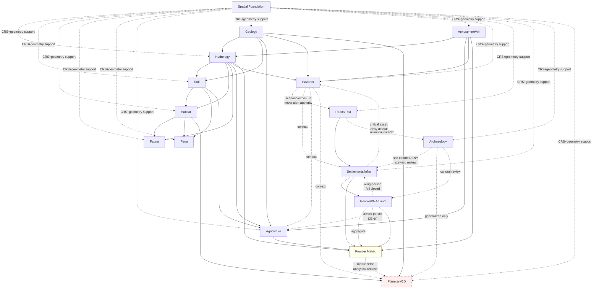

<!-- [KFM_META_BLOCK_V2]
doc_id: kfm://doc/NEEDS-VERIFICATION
title: KFM Domains v1.1 — Domain-Focused Atlas Carrier
type: standard
version: v0.1
status: draft
owners: OWNER_TBD
created: 2026-05-25
updated: 2026-05-25
policy_label: public
related:
  - docs/atlases/kfm-domains-v1.1-pass23-32-consolidated-atlas.md
  - docs/atlases/receipt-catalog.md
  - docs/atlases/pipeline-gate-reference.md
  - docs/atlases/maplibre-master.md
  - docs/atlases/Kansas_Frontier_Matrix_-_Domains_v1_1___Pass_23_32_Consolidated_Atlas.md
  - docs/doctrine/directory-rules.md
  - KFM_Encyclopedia.md
tags: [kfm, atlas, domains, v1.1, doctrine, carrier, ddd]
notes:
  - Domain-focused carrier into the 16 domain chapters (Ch. 3-18) of the Atlas v1.1.
  - Narrower scope than the top-level consolidated-atlas carrier; broader scope than chapter-specific sub-carriers.
  - Per-domain object family spines reproduced verbatim from Atlas §2.2; cross-lane edges summarized from §24.4.
  - Owners, doc_id, responsibility-root verification remain placeholders.
[/KFM_META_BLOCK_V2] -->

# KFM Domains v1.1 — Domain-Focused Atlas Carrier

> **A focused entry point into the 16 domain chapters of the KFM Domains Culmination Atlas v1.1 — what each domain owns, what it explicitly does not own, its ubiquitous language, object family spine, cross-lane edges, sensitivity posture, and pipeline shape.**
> Authority lives in Atlas v1.0 chs. 3–18 and v1.1 Ch. 24; this file routes readers into them at the domain granularity.

  
  
  
  
  
  
  

**Quick jump:** [Purpose](#1-purpose-and-role) · [What a domain is](#2-what-a-domain-is-in-kfm) · [16 domains](#3-the-16-domains) · [Per-domain template](#4-per-domain-chapter-template-an) · [Object spine](#5-domain-object-family-spine) · [Source-role posture](#6-source-role-posture) · [Cross-lane](#7-cross-lane-relations-241624-summary) · [Sensitivity](#8-sensitivity-defaults) · [Pipeline](#9-pipeline-shape-per-domain) · [Crosswalk](#10-domain--responsibility-root-crosswalk) · [Out of scope](#11-what-is-out-of-scope-for-domains) · [Companion carriers](#12-companion-carriers) · [ADRs](#14-adr-backlog) · [Verification](#15-verification-checklist)

> [!IMPORTANT]
> **Status:** `PROPOSED file` / `CONFIRMED doctrine` (Atlas v1.0 chs. 3–18 + v1.1 §24.1, §24.4, §24.5, §24.6, §24.13, §24.14) / `UNKNOWN repo implementation depth`
> **Owner:** `OWNER_TBD`
> **Proposed path:** `docs/atlases/domains-v1.1.md`
> **Scope discipline:** This carrier covers **domain chapters only** (Ch. 3–18). Cross-domain systems (Ch. 19), Master Atlases (Ch. 20), Roadmap (Ch. 21), Appendices (Ch. 22), Assembly Instructions (Ch. 23), and Chapter 24 cross-cutting registers are **out of scope** here — see top-level carrier at `docs/atlases/kfm-domains-v1.1-pass23-32-consolidated-atlas.md`.
> **Truth posture:** *Atlas v1.0 chs. 3–18 are doctrine.* This file is a carrier. EvidenceBundle and the per-domain dossiers remain authoritative.

> [!NOTE]
> **Evidence boundary.** Domain names, dossier tags, object family spines (§5), cross-lane edges (§7), source-role posture (§6), per-domain template (§4), and the domain→responsibility-root crosswalk (§10) are `CONFIRMED doctrine` from the Atlas. Per-object sensitivity defaults (§8) are `PROPOSED supplement` per Atlas §24.14 itself. **Repo implementation depth, schema home presence, per-domain validator wiring, CI gate enforcement, and runtime emission paths remain `UNKNOWN`** — no mounted repo was inspected.

---

## 1. Purpose and role

KFM organizes evidence into **bounded domain contexts**. Each domain is a responsibility lane: it owns specific object families, speaks a specific ubiquitous language, draws from specific source families, and answers to specific cross-lane consumers. The Atlas devotes Chapters 3 through 18 to one domain each (16 chapters total), each following the same A–N template (§4).

This file is the **domain-focused entry point** into those 16 chapters. It exists because:

- The top-level consolidated-atlas carrier (`kfm-domains-v1.1-pass23-32-consolidated-atlas.md`) spans ~1,279 PDF pages and covers Pass 23/32 cards, Ch. 24 registers, and v1.3 overlay alongside the domains. Maintainers working **on a domain** need a narrower entry that surfaces the per-domain template and spine without the cross-cutting registers.
- The Atlas's own §24 registers (Source-Role Anti-Collapse §24.1, Cross-Lane Relation Atlas §24.4, Sensitivity Tier Reference §24.5, Pipeline Gate Reference §24.6, Crosswalk §24.13, Object Family × Domain Matrix §24.14) all consolidate **per-domain content** from chs. 3–18. This carrier names those consolidations from the domain side.
- DDD discipline matters: every entry here ties back to a bounded context with explicit non-ownership statements (per Atlas §B blocks).

**This file is not authority.** Two non-collapse rules apply:

1. **The atlas's per-domain chapters win.** Where this carrier paraphrases a domain's identity, scope, ubiquitous language, or object family, the v1.0 chapter wins on wording.
2. **Chapter 24 registers do not override v1.0 domain chapters.** Per Atlas v1.1 conflict rule: *"Where a Chapter 24 register and a v1.0 section appear to disagree, v1.0 retains authority for the original claim and the conflict is filed to `docs/registers/DRIFT_REGISTER.md`."* This carrier honors that rule by routing readers into the v1.0 chapters first.

---

## 2. What a "domain" is in KFM

> **Doctrinal anchor:** Atlas v1.0 Ch. 22 Appendix A (Glossary); `DomainDriven_Design_Reference.pdf` (Definitions); `directory-rules.md` §5 (responsibility roots); `kfm_unified_doctrine_synthesis.md`.

| Term | KFM definition |
|---|---|
| **Domain** | `CONFIRMED doctrine` — bounded responsibility lane with owned object semantics and governed cross-lane relations. |
| **Bounded context** | `CONFIRMED` (DDD) — reference model boundary where a term has defined meaning and ownership. |
| **Ubiquitous language** | Per DDD — a language structured around the domain model and used by all team members within a bounded context. |
| **Responsibility root** | Per `directory-rules.md` §5 — the canonical placement lane for a domain's schemas, contracts, policy, tests, fixtures, packages, pipelines, and data lifecycle directories. |

Domains in KFM follow the lane pattern from `directory-rules.md` §12 (*Domain Placement Law*) — a domain **MUST NOT become a root folder**. Hydrology is not `hydrology/data/...` at the root; it is `docs/domains/hydrology/`, `contracts/domains/hydrology/`, `schemas/contracts/v1/domains/hydrology/`, `policy/domains/hydrology/`, etc.

### 2.1 Cross-cutting properties every domain carries

Every domain chapter (Ch. 3–18) contains the same 14 normative blocks:

| Block | Title (Atlas template) |
|---|---|
| A | Domain identity and one-line purpose |
| B | Scope, boundary, and explicit non-ownership |
| C | Ubiquitous language |
| D | Key source families |
| E | Main object families |
| F | Cross-lane relations |
| G | Map and viewing products |
| H | Pipeline shape (RAW → PUBLISHED) |
| I | Sensitivity, rights, and publication posture |
| J | API, contract, and schema surfaces |
| K | Validators, tests, fixtures |
| L | Governed AI behavior for this domain |
| M | Publication, correction, and rollback |
| N | Verification backlog and open questions |

§4 explains each block. The structure means every domain answers the same governance questions in the same order, regardless of subject matter.

---

## 3. The 16 domains

> **Doctrinal anchor:** Atlas v1.1 Integrated Contents (chs. 3–18); §2.1 Domain-to-dossier map; §24.13 Atlas ↔ Dossier ↔ Responsibility-Root Crosswalk.
> All per-domain rows are `CONFIRMED doctrine`. Responsibility roots and sensitivity baselines are `PROPOSED supplement` per Atlas §24.13 / §24.14.

| Ch. | Domain | Dossier tag | One-line scope (`CONFIRMED doctrine`) | Sensitivity baseline (`PROPOSED`) | Proposed responsibility root |
|---|---|---|---|---|---|
| **3** | **Spatial Foundation** | `[SPATIAL]` / `[MAP-MASTER]` / `[INDEX-18]` | Shared spatial grammar: CRS, geometry validity, scale, spatial support, generalization, uncertainty, basemap context, cartographic representation. | T0–T1 | `schemas/contracts/v1/spatial/` · `packages/maplibre-runtime/` *(v1.3)* |
| **4** | **Hydrology** | `[DOM-HYD]` | Watersheds, hydro features, reaches, gauges, flow/level/quality observations, regulatory floodplain (NFHL). | T1–T2 | `schemas/contracts/v1/hydrology/` |
| **5** | **Soil** | `[DOM-SOIL]` | Soil map units, components, horizons, properties, hydrologic soil groups, soil moisture observations, erosion risk. | T1 | `schemas/contracts/v1/soil/` |
| **6** | **Habitat** | `[DOM-HAB]` / `[DOM-HF]` | Habitat patches, land-cover, ecological systems, habitat quality, suitability models, connectivity edges. | T2 | `schemas/contracts/v1/habitat/` |
| **7** | **Fauna** | `[DOM-FAUNA]` / `[DOM-HF]` | Taxa, conservation status, occurrence evidence (sensitive vs public), ranges, migration, mortality, disease. | T1 public / **T4** sensitive | `schemas/contracts/v1/fauna/` · `policy/sensitivity/fauna/` |
| **8** | **Flora** | `[DOM-FLORA]` | Plant taxa, occurrences, specimens, rare plants, vegetation communities, invasive plants, phenology. | T1 public / **T4** rare | `schemas/contracts/v1/flora/` · `policy/sensitivity/flora/` |
| **9** | **Agriculture** | `[DOM-AG]` | Crop observations, fields, rotations, yields, irrigation, conservation practice, drought/pest stress. | T0 aggregate / T1 field | `schemas/contracts/v1/agriculture/` |
| **10** | **Geology / Natural Resources** | `[DOM-GEOL]` | Geologic units, surficial units, lithology, stratigraphy, structures, boreholes, geochemistry, mineral occurrences, resource estimates. | T0 / T2 sensitive detail | `schemas/contracts/v1/geology/` |
| **11** | **Atmosphere / Air** | `[DOM-AIR]` | Air stations, PM2.5/ozone observations, smoke context, AOD raster, weather stations/observations, climate normals. | T0 | `schemas/contracts/v1/atmosphere/` |
| **12** | **Hazards** | `[DOM-HAZ]` | Hazard events, warnings, advisories, disaster declarations, flood/wildfire/smoke/drought/earthquake/heat-cold context. **KFM is never an alert authority.** | T0 | `schemas/contracts/v1/hazards/` |
| **13** | **Roads / Rail / Trade Routes** | `[DOM-ROADS]` | Road/rail segments, corridors, network nodes, crossings, bridges, ferries, facilities, restrictions, status events. | T0 / **T4** sensitive facility detail | `schemas/contracts/v1/roads-rail-trade/` |
| **14** | **Settlements / Infrastructure** | `[DOM-SETTLE]` | Settlements, municipalities, census places, townsites, ghost towns, forts, missions, reservation communities, infrastructure assets, facilities. | T0 / **T4** critical asset detail | `schemas/contracts/v1/settlement/` · `policy/sensitivity/infrastructure/` |
| **15** | **Archaeology / Cultural Heritage** | `[DOM-ARCH]` | Archaeological sites, survey projects, transects, shovel tests, test units, excavation units, provenience, stratigraphy, artifacts. | **T4 default** for site coords (sovereignty review path) | `schemas/contracts/v1/archaeology/` · `policy/sensitivity/archaeology/` |
| **16** | **People / Genealogy / DNA / Land Ownership** | `[DOM-PEOPLE]` | Person assertions, canonical persons, names, life events, residence/migration, genealogy, family groups, DNA segments/matches, land parcels. | T1/T2 (living-person fields **DENY**) / aggregate T0 / **T4** raw DNA | `schemas/contracts/v1/people/` · `policy/sensitivity/people/` · `policy/consent/people/` |
| **17** | **Frontier Matrix** | `[ENCY]` / `[UNIFIED]` | Frontier definitions, geography versions, county-year panels, population/economic/agriculture/access observations, settlement status, land office records. | Varies by cell | `schemas/contracts/v1/matrix/` · `contracts/matrix/` |
| **18** | **Planetary / 3D / Digital Twin / Synthetic** | `[ENCY]` / `[MAP-MASTER]` / `[UIAI]` | Scene manifests, terrain models, 3D tile sets, glTF assets, point clouds, digital twin views, synthetic surfaces, view states, representation receipts, reality boundary notes. | Varies; **T4** for sensitive scenes | `schemas/contracts/v1/scene/` · `policy/release/scene/` · `packages/maplibre-runtime/` *(v1.3)* |

> **v1.3 overlay impact:** Ch. 3 (Spatial Foundation) and Ch. 18 (Planetary/3D) are the two domain chapters most affected by the v1.3 renderer-decision overlay. See **`docs/atlases/maplibre-master.md`** §3, §7, §8.

---

## 4. Per-domain chapter template (A–N)

> **Doctrinal anchor:** Atlas v1.0 chs. 3–18 — every domain chapter follows this 14-block template verbatim. The Atlas notes per-block status: most blocks carry `CONFIRMED doctrine / PROPOSED implementation`; some carry only `CONFIRMED` doctrine.

| Block | Title | What it pins | Default truth-label posture |
|---|---|---|---|
| **A** | Domain identity and one-line purpose | The bounded context's name and a single-sentence purpose statement. | `CONFIRMED doctrine / PROPOSED implementation` |
| **B** | Scope, boundary, and explicit non-ownership | What the domain owns; what it explicitly does **not** own (anti-blur rule). | `CONFIRMED / PROPOSED` |
| **C** | Ubiquitous language | Per-term definitions for the domain's vocabulary (DDD discipline). Atlas template: *"Term used inside this domain with meaning constrained by source role, evidence, time, and release state."* | `CONFIRMED term / PROPOSED field realization` |
| **D** | Key source families | The source families the domain admits (regulatory, observed, modeled, aggregate, administrative, candidate, synthetic — per §24.1). | `CONFIRMED dossier presence / PROPOSED implementation` |
| **E** | Main object families | The domain's owned objects with status and citation. See §5 of this carrier for the consolidated spine. | `CONFIRMED object-family spine / PROPOSED implementation` |
| **F** | Cross-lane relations | This-domain ↔ related-lane edges with relation type and constraint. See §7. | `CONFIRMED / PROPOSED relation must preserve ownership, source role, sensitivity, and EvidenceBundle support.` |
| **G** | Map and viewing products | The domain's published viewing surfaces (layers, popups, comparisons). | `PROPOSED` per-domain / `CONFIRMED cross-cutting` (Evidence Drawer, time-aware state, trust badges) |
| **H** | Pipeline shape (RAW → PUBLISHED) | Per-stage handling and gate status across the lifecycle invariant. **Consolidated in §24.6** — see `pipeline-gate-reference.md`. | `CONFIRMED doctrine / PROPOSED lane application`; per-stage **Status** column is `PROPOSED` in every domain. |
| **I** | Sensitivity, rights, and publication posture | Per-object-class sensitivity rules; deny-default lanes; required transforms. | `CONFIRMED / PROPOSED` |
| **J** | API, contract, and schema surfaces | Endpoint or artifact / DTO / schema / outcomes. Includes route names *(typically TBD)*. | `PROPOSED governed API surface; exact route UNKNOWN` |
| **K** | Validators, tests, fixtures | Validator catalogue entries for the domain. | `PROPOSED` |
| **L** | Governed AI behavior for this domain | What AI may summarize, abstain on, deny on. | `CONFIRMED doctrine / PROPOSED implementation` |
| **M** | Publication, correction, and rollback | Required artifacts (ReleaseManifest, EvidenceBundle, ReviewRecord, rollback target) per the domain. | `CONFIRMED doctrine / PROPOSED implementation` |
| **N** | Verification backlog and open questions | Items requiring mounted-repo evidence to upgrade from `NEEDS VERIFICATION` to `CONFIRMED`. | `NEEDS VERIFICATION` |

---

## 5. Domain object family spine

> **Doctrinal anchor:** Atlas v1.0 §2.2 (Cross-domain object family spine); reproduced near-verbatim. All rows are `CONFIRMED object-family spine / PROPOSED implementation`.

| Domain | Core object families |
|---|---|
| **Spatial Foundation** | Coordinate Reference Profile · GeographyVersion · Projection Transform Receipt · Geometry Fingerprint · Base Layer Descriptor · MapStyleRule · Scale Support Profile · UncertaintySurface · Generalization Transform |
| **Hydrology** | Watershed · HUCUnit · HydroFeature · ReachIdentity · GaugeSite · FlowObservation · WaterLevelObservation · Water Quality Observation · Groundwater Well · NFHLZone · Observed Flood Event · Hydrograph |
| **Soil** | SoilMapUnit · SoilComponent · Horizon · SoilProperty · Hydrologic Soil Group · Soil Moisture Observation · Pedon · ErosionRisk · SuitabilityRating · Component Horizon Join · SoilTimeCaveat |
| **Habitat** | HabitatPatch · LandCoverObservation · EcologicalSystem · Habitat Quality Score · SuitabilityModel · ConnectivityEdge · Corridor · Restoration Opportunity · StewardshipZone · Model Run Receipt · UncertaintySurface |
| **Fauna** | Taxon · Taxon Crosswalk · Conservation Status · Occurrence Evidence · **Occurrence Restricted** · Occurrence Public · RangePolygon · SeasonalRange · MigrationRoute · **SensitiveSite** · MortalityObservation · DiseaseObservation |
| **Flora** | Plant Taxon · FloraTaxon Crosswalk · Flora Occurrence · SpecimenRecord · **Rare Plant Record** · Vegetation Community · InvasivePlantRecord · Phenology Observation · RangePolygon · Habitat Association · Botanical Survey · Restoration Planting |
| **Agriculture** | Crop Observation · Field Candidate · Crop Rotation · Yield Observation · Irrigation Link · Conservation Practice · Soil Crop Suitability · Agricultural Economy Observation · SupplyChainNode · Drought Stress Indicator · Pest Stress Indicator · Aggregation Receipt |
| **Geology / Natural Resources** | Geologic Unit · SurficialUnit · Lithology · Stratigraphic Interval · StructureFeature · GeologyBoundaryVersion · BoreholeReference · Well LogReference · Geochemistry SampleReference · Mineral Occurrence · Resource Deposit · ResourceEstimate |
| **Atmosphere / Air** | AirStation · AirObservation · PM2.5 Observation · Ozone Observation · SmokeContext · AODRaster · Weather Station · Weather Observation · WindField · Precipitation Observation · Temperature Observation · Climate Normal |
| **Hazards** | Hazard Event · Hazard Observation · Warning Context · Advisory Context · Disaster Declaration · Flood Context · Wildfire Detection · SmokeContext · Drought Indicator · Earthquake Event · Heat Cold Event · Exposure Summary |
| **Roads / Rail / Trade Routes** | Road Segment · Rail Segment · CorridorRoute · RouteMembership · Network Node · Crossing · Bridge · Ferry · TransportFacility · RestrictionEvent · StatusEvent · OperatorAssignment |
| **Settlements / Infrastructure** | Settlement · Municipality · CensusPlace · Townsite · GhostTown · Fort · Mission · ReservationCommunity · **Infrastructure Asset** · Network Node · Network Segment · Facility |
| **Archaeology / Cultural Heritage** | **Archaeological Site** · SiteComponent · CulturalTemporalPeriod · SurveyProject · SurveyTransect · ShovelTest · TestUnit · ExcavationUnit · ProvenienceContext · StratigraphicUnit · ArtifactRecord · Sample |
| **People / Genealogy / DNA / Land** | Person Assertion · PersonCanonical · NameAssertion · LifeEvent · Residence Event · Migration Event · Genealogy Relationship · FamilyGroup · **DNA Match Evidence** · **DNASegment** · Relationship Hypothesis · **LandParcel** |
| **Frontier Matrix** | Frontier Definition · GeographyVersion · County-Year Panel · Population Observation · Economic Observation · Agriculture Observation · Access Observation · Settlement Status · Land Office Record · Public Land Record · Admin Boundary Change · Crosswalk |
| **Planetary / 3D / Digital Twin / Synthetic** | Scene Manifest · Terrain Model · 3D Tile Set · glTF Asset · Point Cloud · Digital Twin View · Synthetic Surface · ViewState · **Representation Receipt** · **Reality Boundary Note** · 3D Admission Decision |

> **Bold** items are objects with sensitivity-significant `T4 default` or DENY-by-default behavior at the per-class level (see §8 and Atlas §24.5 / §24.14). The complete sensitivity matrix is in Atlas §24.14.

---

## 6. Source-role posture

> **Doctrinal anchor:** Atlas v1.1 §24.1 (Master Source-Role Anti-Collapse Register). `CONFIRMED doctrine`.

Every domain admits sources under one of seven **source roles**. Roles are first-class identity attributes — set at admission, **never edited in place**. Corrections must produce a new descriptor + `CorrectionNotice`.

| Role | Meaning | Where it commonly appears in KFM domains |
|---|---|---|
| `observed` | Direct measurement / sensing. | Atmosphere, Hydrology gauges, Fauna occurrences, Flora occurrences. |
| `regulatory` | Issued by a governmental / regulatory authority. | Hydrology (NFHL), Hazards (Disaster Declaration), Agriculture (conservation rolls). |
| `modeled` | Derived from a model with explicit inputs, parameters, uncertainty. | Habitat suitability, smoke trajectory, restoration model, agricultural drought stress. |
| `aggregate` | Roll-up by geography and/or time scope. | Frontier Matrix cells, county-year agricultural rolls, decadal climate normals. |
| `administrative` | Authoritative compilation by an administering body. | Settlement censuses, archaeological site registries, land office records. |
| `candidate` | Pending merge / rejection / quarantine. **No PUBLISHED edge until merged.** | Watcher-emitted deltas across every domain. |
| `synthetic` | Reconstructed / interpolated / synthetic surface. **Reality Boundary Note required.** | Planetary/3D scenes, archaeology reconstructions, synthetic terrain. |

**Anti-collapse rule** (`CONFIRMED doctrine`): roles must not be silently upgraded by promotion (e.g., `modeled → observed` is forbidden). Atlas §24.1 enforces this with `SourceDescriptor` field requirements; see `directory-rules.md` ADR-S-04 (Source-role vocabulary v1).

---

## 7. Cross-lane relations (§24.4 summary)

> **Doctrinal anchor:** Atlas v1.1 §24.4 (Cross-Lane Relation Atlas), 16 owner blocks (§24.4.1 – §24.4.16). `CONFIRMED doctrine`.

Cross-lane edges follow a uniform constraint: *"relation must preserve ownership, source role, sensitivity, and EvidenceBundle support."* Per-edge details are in the atlas; this summary shows the strongest **structural** flows.

> **Reading note:** Dotted edges from Spatial Foundation indicate that **every** domain consumes CRS/geometry/scale support; only the strongest non-Spatial edges are drawn explicitly. Atlas v1.0's per-domain F. sections remain authoritative for the full edge list, including conditional and rarely-used relations. Where a relation in v1.0 conflicts with §24.4, **v1.0 governs**.

### 7.1 Cross-lane rules per domain (one-liners)

The rules in this table are the most important constraints on each domain's relationships, paraphrased from Atlas §24.4.1 – §24.4.16. Full text in the Atlas.

| Owner | Most-important cross-lane rule (`CONFIRMED doctrine`, paraphrased) |
|---|---|
| Spatial Foundation | CRS, scale, geometry, layer, and representation grammar feeds all other domains; never owns domain truth. |
| Hydrology | Watershed/reach/gauge structure is shared widely; NFHL is a **regulatory channel** distinct from observed flow. |
| Soil | Soil units feed Habitat, Agriculture, Hazards, Settlements (advisory); never replaces domain-of-record. |
| Habitat | HabitatPatch / EcologicalSystem feed Fauna, Flora, Agriculture, Planetary/3D; stewardship zones T1. |
| Fauna | Sensitive occurrences default **T4**; public layers use generalized RangePolygon / aggregate. |
| Flora | Rare plant records default **T4**; ethnobotanical context to Archaeology under steward review. |
| Agriculture | Field candidate = T1; aggregate roll-ups = T0; private person-parcel joins DENY by default. |
| Geology | GeologicUnit/Lithology context feeds Hydrology, Hazards, Agriculture, Planetary/3D; subsurface admission-gated. |
| Atmosphere/Air | Smoke / AOD / precipitation / climate normals feed Hazards, Hydrology, Agriculture, Frontier Matrix. |
| Hazards | Hazard context cited by all; **KFM is never an emergency-alert authority** — boundary holds permanently. |
| Roads/Rail | Network connectivity feeds Settlements; archaeological coordinate joins DENY; sensitive facility condition T2/T4. |
| Settlements/Infra | Critical-infrastructure detail defaults **T4**; generalized footprints T1; person-residence joins T1/T2. |
| Archaeology | **Site coordinates DENY by default**; sovereignty review path; 3D admission requires generalization + reality-boundary note. |
| People/DNA/Land | Living-person fields **fail closed**; raw DNA T4 with named consent only; private person-parcel joins DENY. |
| Frontier Matrix | Matrix cells are **analytical releases** with their own evidence + rollback; other domains do not edit cells. |
| Planetary/3D | 3D scenes are **carriers, not authority**; reality-boundary notes mandatory for synthetic; never instruction surface. |

---

## 8. Sensitivity defaults

> **Doctrinal anchor:** Atlas v1.1 §24.5 (Sensitivity / Rights Tier Reference, T0–T4) + §24.14 (Object Family × Domain Reference Matrix, sensitivity-default column).
> **Status:** Tier scheme T0–T4 is `PROPOSED` per Atlas; per-object defaults are `PROPOSED supplement`.

### 8.1 Tier scheme

| Tier | Meaning (`PROPOSED`) |
|---|---|
| **T0** | Public open release. |
| **T1** | Public-safe (typically aggregated or generalized). |
| **T2** | Restricted (steward review or named-party access). |
| **T3** | Named-party access only (explicit agreement). |
| **T4** | Closed (no release; or release only after explicit named authorization). |

### 8.2 Per-object sensitivity defaults (Atlas §24.14 highlights)

| Object family | Default tier (`PROPOSED`) | Notes |
|---|---|---|
| `GeographyVersion`, `CoordinateReferenceProfile` | T0 | Every spatial product carries a version. |
| `EvidenceBundle` | varies; mirrors the claim's tier | Cross-cutting. |
| `HUC / Watershed / Reach`, `GaugeSite / FlowObservation`, `NFHL zone` | T0 (NFHL regulatory) | Hydrology. |
| `SoilMapUnit / SoilComponent` | T0 | Soil. |
| `HabitatPatch / EcologicalSystem` | T0 mostly; **T1 for stewardship zones** | Habitat. |
| `OccurrenceRecord (sensitive)` | **T4 default**; T1 via generalization | Fauna. |
| `RangePolygon` | T1 | Fauna / Flora. |
| `RarePlantRecord` | **T4 default**; T1 via generalization | Flora. |
| `CropObservation / YieldObservation` | T0 aggregate / T1 field candidate | Agriculture. |
| `GeologicUnit / Lithology` | T0 | Geology. |
| `MineralOccurrence / ResourceEstimate` | T0 aggregate; **T2 detail in sensitive contexts** | Geology. |
| `WeatherObservation / ClimateNormal` | T0 | Atmosphere/Air. |
| `HazardEvent / HazardObservation`, `DisasterDeclaration` | T0 | Hazards. |
| `RoadSegment / RailSegment / CorridorRoute` | T0 | Roads/Rail. |
| `TransportFacility` | T0 mostly; **T2 / T4 for sensitive condition detail** | Roads/Rail. |
| `Settlement / Municipality / GhostTown` | T0 | Settlements. |
| `Infrastructure Asset (critical)` | **T4 default for critical detail**; T1 for generalized footprint | Settlements/Infra. |
| `ArchaeologicalSite` | **T4 default**; T1 generalized only after steward review | Archaeology. |
| `CulturalTemporalPeriod` | T0 | Archaeology. |
| `PersonAssertion / NameAssertion` | T1 / T2 (living-person fields DENY); aggregate T0 | People. |
| `DNA Match / DNASegment` | **T4 default** | People; named consent path only. |

> Atlas §24.14 has the full matrix; this carrier surfaces the most operationally significant defaults. Cross-reference `docs/atlases/receipt-catalog.md` §3 for `RedactionReceipt`, `AggregationReceipt`, and `PolicyDecision` (the receipts that govern tier transforms).

### 8.3 Tier transitions

> Atlas §24.5.3 (Tier transitions — allowed motion). Every public-tier upgrade requires both a transform receipt **and** a review record; a tier downgrade (toward less public) requires only a `CorrectionNotice`. See full transition matrix in the atlas.

---

## 9. Pipeline shape per domain

> **Doctrinal anchor:** Atlas v1.0 chs. 3–18 block H *"Pipeline shape (RAW → PUBLISHED)"*; consolidated in v1.1 §24.6 (Master Pipeline Gate Reference).

Every domain follows the lifecycle invariant `RAW → WORK / QUARANTINE → PROCESSED → CATALOG / TRIPLET → PUBLISHED`. The per-domain block H instantiates this invariant; **every per-stage Status is `PROPOSED`** in every domain chapter, indicating doctrine-CONFIRMED but implementation-PROPOSED.

The shared per-stage template (verbatim from the Atlas):

| Stage | Handling | Gate (per Atlas §24.6.1) |
|---|---|---|
| **RAW** | Capture immutable source payload or reference with source role, rights, sensitivity, citation, time, and hash. | `SourceDescriptor` exists. |
| **WORK / QUARANTINE** | Normalize schema, geometry, time, identity, evidence, rights, and policy; hold failures. | Validation and policy gate pass, or quarantine reason is recorded. |
| **PROCESSED** | Emit validated normalized objects, receipts, and public-safe candidates. | `EvidenceRef`, `ValidationReport`, and digest closure exist. |
| **CATALOG / TRIPLET** | Emit catalog records, EvidenceBundles, graph/triplet projections, and release candidates. | Catalog/proof closure passes. |
| **PUBLISHED** | Serve released public-safe artifacts through governed APIs and manifests. | `ReleaseManifest`, correction path, rollback target, and review/policy state exist. |

> **See `docs/atlases/pipeline-gate-reference.md`** for the full Master Pipeline Gate Reference (§24.6.1 lifecycle gates, §24.6.2 closure rules, §24.6.3 reason codes, and the Promotion Gates A–G companion framing).

---

## 10. Domain ↔ Responsibility-Root Crosswalk

> **Doctrinal anchor:** Atlas v1.1 §24.13 (Atlas ↔ Dossier ↔ Responsibility-Root Crosswalk). Every row carries `NEEDS VERIFICATION` because the responsibility-root paths remain `PROPOSED` until a mounted repo confirms.

| Ch. | Domain | Dossier tag | Proposed responsibility root |
|---|---|---|---|
| 3 | Spatial Foundation | `[SPATIAL]` / `[MAP-MASTER]` | `schemas/contracts/v1/spatial/` · `packages/maplibre-runtime/` *(v1.3)* |
| 4 | Hydrology | `[DOM-HYD]` | `schemas/contracts/v1/hydrology/` · `contracts/hydrology/` |
| 5 | Soil | `[DOM-SOIL]` | `schemas/contracts/v1/soil/` · `contracts/soil/` |
| 6 | Habitat | `[DOM-HAB]` | `schemas/contracts/v1/habitat/` · `contracts/habitat/` |
| 7 | Fauna | `[DOM-FAUNA]` | `schemas/contracts/v1/fauna/` · `policy/sensitivity/fauna/` |
| 8 | Flora | `[DOM-FLORA]` | `schemas/contracts/v1/flora/` · `policy/sensitivity/flora/` |
| 9 | Agriculture | `[DOM-AG]` | `schemas/contracts/v1/agriculture/` · `contracts/agriculture/` |
| 10 | Geology / Natural Resources | `[DOM-GEOL]` | `schemas/contracts/v1/geology/` · `contracts/geology/` |
| 11 | Atmosphere / Air | `[DOM-AIR]` | `schemas/contracts/v1/atmosphere/` · `contracts/atmosphere/` |
| 12 | Hazards | `[DOM-HAZ]` | `schemas/contracts/v1/hazards/` · `contracts/hazards/` |
| 13 | Roads / Rail / Trade Routes | `[DOM-ROADS]` | `schemas/contracts/v1/roads-rail-trade/` · `contracts/roads-rail-trade/` |
| 14 | Settlements / Infrastructure | `[DOM-SETTLE]` | `schemas/contracts/v1/settlement/` · `contracts/settlement/` · `policy/sensitivity/infrastructure/` |
| 15 | Archaeology / Cultural Heritage | `[DOM-ARCH]` | `schemas/contracts/v1/archaeology/` · `contracts/archaeology/` · `policy/sensitivity/archaeology/` |
| 16 | People / Genealogy / DNA / Land | `[DOM-PEOPLE]` | `schemas/contracts/v1/people/` · `contracts/people/` · `policy/sensitivity/people/` · `policy/consent/people/` |
| 17 | Frontier Matrix | `[ENCY]` / `[UNIFIED]` | `schemas/contracts/v1/matrix/` · `contracts/matrix/` |
| 18 | Planetary / 3D / Digital Twin / Synthetic | `[MAP-MASTER]` / `[UIAI]` | `schemas/contracts/v1/scene/` · `contracts/scene/` · `policy/release/scene/` · `packages/maplibre-runtime/` *(v1.3)* |

> **All responsibility-root paths above are `PROPOSED`.** Confirmation requires inspection of a mounted repo. Per `directory-rules.md` §12 (Domain Placement Law), a domain **MUST NOT** become a root folder; the lane pattern (`docs/domains/<domain>/`, `contracts/domains/<domain>/`, `schemas/contracts/v1/domains/<domain>/`, etc.) applies uniformly.

---

## 11. What is out of scope for "domains"

The 16 chapters covered by this carrier are responsibility lanes. The following Atlas chapters and Chapter 24 registers are **not** domains; they are cross-cutting and **out of scope** here. Each has its own carrier path:

| Atlas chapter / section | Role | Where to look |
|---|---|---|
| **Ch. 19** Cross-Domain Systems | Where domains meet (MapLibre UI + Evidence Drawer + Focus Mode; Governed AI; Catalog/Proof spine; Review queues; Correction/rollback). | `docs/atlases/maplibre-master.md` (renderer surfaces); `docs/atlases/kfm-domains-v1.1-pass23-32-consolidated-atlas.md` §4.3. |
| **Ch. 20** Master Atlases | Viewing Mode, Capability/Action, API Surface, Validator/Test, Deny-by-Default + Sensitivity. | `docs/atlases/kfm-domains-v1.1-pass23-32-consolidated-atlas.md` §4.3; extended by Ch. 24 sections. |
| **Ch. 21** Roadmap and Dependency Graph | Build phases (1–17); dependency edges. | Top-level carrier §4.3. |
| **Ch. 22** Appendices A–F | Glossary, source family, object family, directory rules, supersession, self-check. | Atlas v1.0 directly. |
| **Ch. 23** Assembly Instructions | How the atlas is assembled and reassembled. | Atlas v1.0 directly. |
| **§24.1** Source-Role Anti-Collapse Register | Referenced from §6 of this carrier; full text in the atlas. | Atlas §24.1. |
| **§24.2** Master Receipt Catalog | 16 receipt classes; lifecycle-phase mapping. | `docs/atlases/receipt-catalog.md`. |
| **§24.3** Decision Outcome Envelope Reference | Finite outcome envelopes. | Atlas §24.3. |
| **§24.4** Cross-Lane Relation Atlas | Source for §7 of this carrier; full per-domain edges in the atlas. | Atlas §24.4. |
| **§24.5** Sensitivity / Rights Tier Reference | Source for §8 of this carrier; full transitions in atlas. | Atlas §24.5. |
| **§24.6** Master Pipeline Gate Reference | Source for §9 summary. | `docs/atlases/pipeline-gate-reference.md`. |
| **§24.7** Reviewer SoD Matrix · **§24.8** Stale-State · **§24.9** Failure-Mode · **§24.10** Risk · **§24.11** Health · **§24.12** Open-ADR · **§24.13** Crosswalk · **§24.14** Object × Domain Matrix | Cross-cutting registers; consolidate per-domain content but are not themselves domain chapters. | Atlas Ch. 24 directly. |

---

## 12. Companion carriers

| Carrier | Scope | Status |
|---|---|---|
| `docs/atlases/kfm-domains-v1.1-pass23-32-consolidated-atlas.md` | Top-level navigation across v1.0 + v1.1 + Pass 23/32 + v1.3 overlay. | `PROPOSED file` (sibling) |
| `docs/atlases/Kansas_Frontier_Matrix_-_Domains_v1_1___Pass_23_32_Consolidated_Atlas.md` | Full-text Markdown conversion of the consolidated atlas. | `CONFIRMED file presence` |
| `docs/atlases/receipt-catalog.md` | Chapter 24.2 carrier (16 receipt classes; lifecycle-phase attachment). | `PROPOSED file` |
| `docs/atlases/pipeline-gate-reference.md` | Chapter 24.6 carrier (7 lifecycle gates; Promotion Gates A–G; closure rules; reason codes). | `PROPOSED file` |
| `docs/atlases/maplibre-master.md` | Master MapLibre v2.1 + v1.3 renderer overlay (touches Spatial Foundation + Planetary/3D domains). | `PROPOSED file` |

### 12.1 Candidate per-domain dossier carriers

Each of the 16 domains could justify a dedicated carrier when its reader traffic warrants it (`PROPOSED, none authored`). Suggested naming (kebab-lowercase, consistent with the established pattern):

- `docs/atlases/spatial-foundation.md`
- `docs/atlases/hydrology.md`
- `docs/atlases/soil.md`
- `docs/atlases/habitat.md`
- `docs/atlases/fauna.md`
- `docs/atlases/flora.md`
- `docs/atlases/agriculture.md`
- `docs/atlases/geology.md`
- `docs/atlases/atmosphere.md`
- `docs/atlases/hazards.md`
- `docs/atlases/roads-rail-trade.md`
- `docs/atlases/settlements-infrastructure.md`
- `docs/atlases/archaeology.md`
- `docs/atlases/people-dna-land.md`
- `docs/atlases/frontier-matrix.md`
- `docs/atlases/planetary-3d.md`

> Naming-convention reconciliation under the proposed atlas-Markdown naming ADR is the prerequisite (see top-level carrier §11).

---

## 13. Cross-references

| Reference | Role | Status |
|---|---|---|
| Atlas v1.0 chs. 3–18 (per-domain chapters) | **Doctrinal anchors.** Authoritative on every domain row in §3, §5, §7. | `CONFIRMED doctrine` |
| Atlas v1.0 §2.1 (Domain-to-dossier map) + §2.2 (Cross-domain object family spine) | Primary source for §3 and §5. | `CONFIRMED doctrine` |
| Atlas v1.1 §24.1 (Source-Role Anti-Collapse Register) | Source for §6. | `CONFIRMED doctrine` |
| Atlas v1.1 §24.4 (Cross-Lane Relation Atlas) | Source for §7 (16 owner blocks §24.4.1 – §24.4.16). | `CONFIRMED doctrine` |
| Atlas v1.1 §24.5 (Sensitivity Tier Reference T0–T4) | Source for §8.1 and §8.3. | `CONFIRMED doctrine` |
| Atlas v1.1 §24.6 (Master Pipeline Gate Reference) | Source for §9 stage table. | `CONFIRMED doctrine` |
| Atlas v1.1 §24.13 (Crosswalk) | Source for §10 responsibility-root crosswalk. | `CONFIRMED doctrine; paths PROPOSED` |
| Atlas v1.1 §24.14 (Object Family × Domain Matrix) | Source for §8.2 per-object defaults. | `CONFIRMED doctrine; defaults PROPOSED` |
| `KFM_Encyclopedia.md` §7 (per-domain expansion) | Cross-corroborates §3 (dossier tags and sensitivity baselines). | `CONFIRMED corpus presence` |
| `DomainDriven_Design_Reference.pdf` | DDD definitions (domain, bounded context, ubiquitous language) for §2. | `CONFIRMED corpus presence` |
| `directory-rules.md` §5, §12 | Responsibility roots + Domain Placement Law for §2 and §10. | `CONFIRMED at commit b6a279…` |
| `kfm_unified_doctrine_synthesis.md` | Cross-document doctrine synthesis. | `CONFIRMED corpus presence` |

---

## 14. ADR backlog

| ADR-S | Title (`PROPOSED`) | Touched by this carrier |
|---|---|---|
| **S-01** | Confirm/amend ADR-0001 (schema home `schemas/contracts/v1/<…>`). | §10 (every per-domain schema home claim). |
| **S-02** | Doctrine artifact placement under `docs/` (`dossiers/` vs `atlases/`). | §1 (this file's placement). |
| **S-04** | Source-role enum — canonical vocabulary, evolution rule. | §6. |
| **S-05** | Sensitivity tier scheme (T0–T4) — adopt as canonical or revise. | §8.1. |
| **S-07** | 3D admission policy. | §3 Ch. 18; §10 row. |
| **S-08** | Frontier Matrix cell semantics. | §3 Ch. 17; §7 (FM as analytical release). |
| **S-09** | Reviewer separation-of-duties threshold. | §9 (release gate); per-domain block M. |
| **S-12** | Connector cadence and quarantine recovery. | Per-domain block H. |
| **S-14** | Cross-lane join policy. | §7. |
| **S-15** | Doctrine artifact lifecycle. | §1; §12.1 (candidate dossier carriers). |
| **(new, proposed)** | Atlas-Markdown naming convention under `docs/atlases/`. | §12.1 (candidate carrier names). |

> ADR-S-01 through S-15 exist in Atlas §24.12 backlog. New proposals here are deliberately unnumbered.

---

## 15. Verification checklist

- [ ] Confirm the target path `docs/atlases/domains-v1.1.md` does not already exist; resolve `docs/atlas/` mirror collisions.
- [ ] Confirm `OWNER_TBD` — docs steward + a domain-layer architect.
- [ ] Confirm `doc_id` allocation convention; do not invent UUIDs.
- [ ] Confirm filename convention against the proposed atlas-Markdown naming ADR (see top-level carrier §11).
- [ ] Confirm sibling carriers exist or are in active authoring: `kfm-domains-v1.1-pass23-32-consolidated-atlas.md`, `receipt-catalog.md`, `pipeline-gate-reference.md`, `maplibre-master.md`.
- [ ] Confirm every per-domain row in §3 matches Atlas v1.1 §2.1 (Domain-to-dossier map).
- [ ] Confirm every per-domain row in §5 matches Atlas v1.1 §2.2 (Cross-domain object family spine) verbatim or near-verbatim.
- [ ] Confirm §7 cross-lane Mermaid diagram has not introduced edges Atlas §24.4 does not assert.
- [ ] Confirm §8 sensitivity defaults match Atlas §24.14 row-by-row.
- [ ] Confirm §10 responsibility-root crosswalk matches Atlas §24.13; flag any deviation as drift.
- [ ] Confirm `directory-rules.md` §12 (Domain Placement Law) is honored — no domain becomes a root folder.
- [ ] Confirm per-domain responsibility-root paths exist or are tracked (e.g., `schemas/contracts/v1/hydrology/`, `policy/sensitivity/archaeology/`, `policy/consent/people/`).
- [ ] Confirm domains touched by v1.3 renderer overlay (Spatial Foundation, Planetary/3D) cross-reference `maplibre-master.md`.
- [ ] Confirm that no per-domain block in this carrier inlines content from Ch. 19 (Cross-Domain Systems), Ch. 20 (Master Atlases), or Ch. 24 cross-cutting registers — those are out of scope per §11.
- [ ] Run `Diagram syntactic check`: the Mermaid block in §7 renders on GitHub.

---

## 16. Rollback / supersession

| Condition | Action |
|---|---|
| Atlas v1.2 (or successor) is issued | Update §3 / §5 / §7 / §8 / §10 in lock-step; preserve v1.1 row content as lineage; bump file `version`. |
| A new domain chapter is added to a future atlas | Add row to §3, §5, §7, §8, §10; update §12.1 candidate carriers list. |
| A domain is renamed or split | Preserve old name in lineage; redirect cross-references; record in `docs/registers/DRIFT_REGISTER.md`. |
| Atlas §24.1 source-role vocabulary changes (ADR-S-04) | Update §6 verbatim; update per-domain D blocks elsewhere. |
| Atlas §24.5 tier scheme changes (ADR-S-05) | Update §8.1 + §8.2 verbatim. |
| Atlas §24.13 crosswalk amends responsibility roots | Update §10 row-by-row; preserve old paths as lineage. |
| ADR-OPEN-DR-10 (renderer decision) accepted | Confirm v1.3 overlay impact on Spatial Foundation + Planetary/3D in §3; cross-reference `maplibre-master.md`. |
| Any per-domain dossier carrier (§12.1) is authored | Update §12.1 to mark it `✓`; cross-link from this carrier. |
| This carrier is found to drift from atlas wording | Restore atlas wording verbatim; atlas wins. |
| This carrier is found to overclaim implementation | Demote to `PROPOSED` / `UNKNOWN`; never resolve drift by lowering the truth label. |

**Rollback target:** `ROLLBACK_TARGET_TBD` (PROPOSED: prior commit ref of this file as recorded in `release/manifests/`).

---

## 17. Source ledger

| Source | Status | Supports | Limits |
|---|---|---|---|
| Atlas v1.0 chs. 3–18 (per-domain chapters) | `CONFIRMED doctrine` | §3 row content; §4 per-domain template; §5 object families; per-domain H, I, J, K, L, M blocks. | Per-stage `Status` in block H is `PROPOSED` in every domain; per-domain content remains authoritative on wording. |
| Atlas v1.1 §2.1 + §2.2 | `CONFIRMED doctrine` | §3 dossier-tag mapping; §5 object family spine. | — |
| Atlas v1.1 §24.1 (Source-Role Anti-Collapse Register) | `CONFIRMED doctrine` | §6 source-role table. | Vocabulary final form is open at ADR-S-04. |
| Atlas v1.1 §24.4 (Cross-Lane Relation Atlas) | `CONFIRMED doctrine` | §7 Mermaid diagram + §7.1 per-owner rules. | Atlas v1.0 per-domain F. blocks remain authoritative on the full edge list. |
| Atlas v1.1 §24.5 (Sensitivity Tier Reference T0–T4) | `CONFIRMED doctrine / PROPOSED tier-scheme` | §8.1 tier scheme; §8.3 transitions reference. | Scheme is `PROPOSED` per the atlas. |
| Atlas v1.1 §24.6 (Master Pipeline Gate Reference) | `CONFIRMED doctrine` | §9 per-stage table. | Lifecycle-gate detail lives in `pipeline-gate-reference.md`. |
| Atlas v1.1 §24.13 (Crosswalk) | `CONFIRMED doctrine; paths PROPOSED` | §10 responsibility-root crosswalk. | All path-level claims are `PROPOSED` until mounted-repo verification. |
| Atlas v1.1 §24.14 (Object Family × Domain Matrix) | `CONFIRMED doctrine; defaults PROPOSED` | §8.2 per-object sensitivity defaults. | Defaults are `PROPOSED supplement`. |
| `KFM_Encyclopedia.md` §7 (per-domain expansion) | `CONFIRMED corpus presence` | §3 sensitivity baseline column corroboration. | Encyclopedia is corpus, not schema authority. |
| `DomainDriven_Design_Reference.pdf` | `CONFIRMED corpus presence` | §2 DDD definitions (domain, bounded context, ubiquitous language). | DDD reference is external; KFM customizes via Atlas Appendix A. |
| `directory-rules.md` §5, §12 | `CONFIRMED at commit b6a279…` | §2 responsibility-root concept; §10 placement law. | Path-level claims for new domain files remain `PROPOSED`. |
| `kfm_unified_doctrine_synthesis.md` | `CONFIRMED corpus presence` | §2 cross-doctrine synthesis. | Synthesis, not schema authority. |

> **Memory is not evidence.** Every consequential claim in this file is traceable to one of the sources above, an atlas row reproduced verbatim, or an explicit `PROPOSED` / `NEEDS VERIFICATION` placeholder. Where this carrier paraphrases Atlas wording, the atlas wins on wording.

---

<a href="#kfm-domains-v11--domain-focused-atlas-carrier">↑ Back to top</a>

