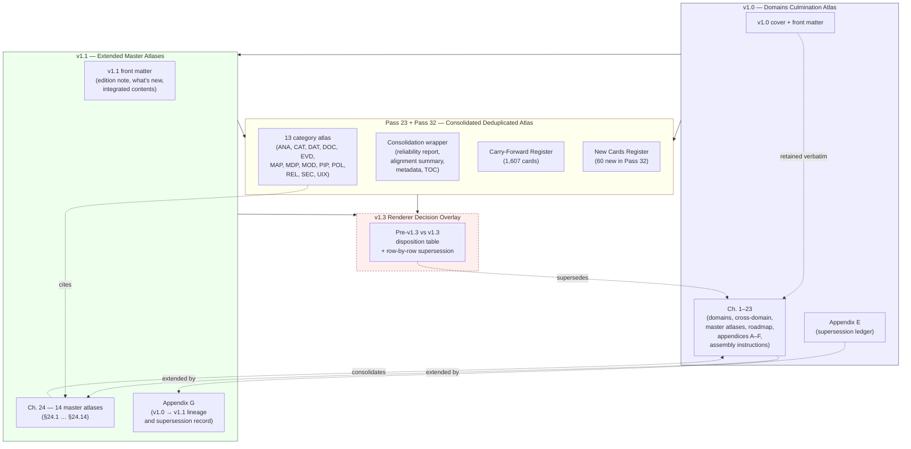

<!-- [KFM_META_BLOCK_V2]
doc_id: kfm://doc/NEEDS-VERIFICATION
title: KFM Domains v1.1 + Pass 23/32 Consolidated Atlas — Navigation Carrier
type: standard
version: v0.1
status: draft
owners: OWNER_TBD
created: 2026-05-25
updated: 2026-05-25
policy_label: public
related:
  - docs/atlases/Kansas_Frontier_Matrix_-_Domains_v1_1___Pass_23_32_Consolidated_Atlas.md
  - docs/atlases/receipt-catalog.md
  - docs/atlases/pipeline-gate-reference.md
  - docs/atlases/maplibre-master.md
  - docs/doctrine/directory-rules.md
  - docs/architecture/maplibre-3d.md
  - docs/registers/DRIFT_REGISTER.md
tags: [kfm, atlas, v1.1, pass23, pass32, doctrine, carrier, navigation]
notes:
  - Top-level navigation carrier into the consolidated atlas; the full-text conversion lives at a sibling Markdown file under docs/atlases/.
  - Filename uses kebab-lowercase consistent with sibling carriers (receipt-catalog.md, pipeline-gate-reference.md, maplibre-master.md); naming-convention reconciliation with the existing full-text Markdown is a CONFLICTED item surfaced in §11.
  - Three referenced names exist for this content area; reconciliation is NEEDS VERIFICATION.
  - Owners, doc_id, related-path verification all remain placeholders.
[/KFM_META_BLOCK_V2] -->

# KFM Domains v1.1 + Pass 23/32 Consolidated Atlas — Navigation Carrier

> **The orientation page for KFM's largest doctrinal carrier — a hybrid edition that fuses the Kansas Frontier Matrix Domains Culmination Atlas v1.1 with the Pass 23/32 deduplicated card register, plus the v1.3 Renderer Decision Overlay.**
> This file routes readers to chapters and companion sub-carriers; it does **not** re-render the atlas text.

  
  
  
  
  
  
  
  

**Quick jump:** [Purpose](#1-purpose-and-role) · [What this atlas is](#2-what-this-atlas-is) · [Assembly](#3-how-v10--v11--pass-2332-fit-together) · [v1.0 chapters](#4-v10-chapters-1-23) · [v1.1 Chapter 24](#5-v11-chapter-24--extended-master-atlases) · [Appendix G](#6-appendix-g--v10--v11-lineage) · [Pass 23/32](#7-pass-2332-addenda) · [v1.3 overlay](#8-v13-renderer-decision-overlay) · [Companion carriers](#9-companion-sub-carriers) · [Conflict rule](#10-the-atlas-conflict-rule) · [Naming](#11-naming-convention-reconciliation-conflicted) · [ADRs](#13-adr-backlog) · [Verification](#14-verification-checklist)

> [!IMPORTANT]
> **Status:** `PROPOSED file` / `CONFIRMED doctrine` (Atlas v1.1 + Pass 23/32) / `PROPOSED v1.3 renderer overlay` / `UNKNOWN repo implementation depth`
> **Owner:** `OWNER_TBD`
> **Proposed path:** `docs/atlases/kfm-domains-v1.1-pass23-32-consolidated-atlas.md`
> **Lane choice:** `docs/atlases/` over `docs/atlas/` — **CONFIRMED at doctrine level** per `directory-rules.md` v1.2 §6.1 and Atlas v1.1 Appendix G.
> **Filename:** **`CONFLICTED`** — three referenced names exist for this content area (§11). The kebab-lowercase chosen here matches the three sibling carriers.
> **Truth posture:** *Atlas v1.1 + the Pass 23/32 source PDFs are doctrine.* This file is a carrier. Atlas v1.1 front matter is explicit: *"Registers and master atlases are navigational aids. EvidenceBundle and the governing dossiers remain authoritative."*

> [!NOTE]
> **Evidence boundary.** The structure described here — 23 retained v1.0 chapters, 14 Chapter 24 sections, Appendix G lineage, Pass 23/32 cards register, Pass 32 totals (1,607 cards; 60 new) — is `CONFIRMED doctrine` from the Atlas v1.1 front matter and the consolidated-atlas Markdown conversion. **The full per-chapter and per-card text is NOT re-rendered here**; it lives in the sibling Markdown conversion. **Repo implementation depth, file presence at the proposed path, owner allocation, doc-id allocation, and downstream link validity remain `UNKNOWN`** — no mounted repo was inspected.

---

## 1. Purpose and role

The KFM Domains v1.1 + Pass 23/32 Consolidated Atlas is the largest doctrinal carrier in the project — a hybrid edition fusing two complementary sources:

- **Source A:** *Kansas Frontier Matrix Domains Culmination Atlas, v1.1* — domain-doctrine atlas, supersedes v1.0 by integrated extension.
- **Source B:** *KFM Pass 23 + Pass 32 Consolidated Deduplicated Atlas* — downstream pass-card consolidation, 1,607 cards across 13 categories.

Plus a `PROPOSED` overlay introduced in the Markdown conversion:

- **v1.3 Renderer Decision Overlay** — the `MapLibre as Sole Browser-Side Renderer; Retire Cesium Dependency` overlay applied row-by-row to renderer-related rows of the Pass 23/32 atlas.

This file is the **navigation entry point** into all of that. It exists because:

- The consolidated artifact is ~1,279 PDF pages (177 Source A + 1,095 Source B + 7 wrapper). Maintainers need a one-page index.
- The atlas has at least **three referenced filenames** in the corpus (see §11). This file consolidates the navigation and surfaces the naming drift.
- The three companion sub-carriers (`receipt-catalog.md`, `pipeline-gate-reference.md`, `maplibre-master.md`) already exist as chapter-level navigators; this top-level carrier ties them together.

**This file is not authority** — at any level:

1. **Atlas registers are navigational aids.** Per Atlas v1.1 front matter: *"Nothing in v1.1 — not Chapter 24, not the lineage appendix, not this front matter — lets summaries, tables, registers, or master atlases substitute for evidence, policy, review state, source authority, or release state."* That rule applies equally to this Markdown carrier.
2. **The full-text Markdown carrier wins on wording.** Where this navigation file paraphrases the atlas, the full-text Markdown (and behind it, the source PDFs) is authoritative.

---

## 2. What this atlas is

> **Doctrinal anchors:** Atlas v1.1 cover supersession block; Atlas v1.1 front matter "What is new in v1.1"; consolidated-atlas generated wrapper.

| Element | `CONFIRMED` statement |
|---|---|
| **Edition** | v1.1 of the Kansas Frontier Matrix Domains Culmination Atlas. Current edition. Supersedes v1.0 (2026-05-11) **by integrated extension** — every page of v1.0 retained verbatim. |
| **Scope of supersession** | v1.1 does **not** rewrite v1.0. No chapter, table, appendix, figure-to-generate, validator catalogue entry, supersession-ledger row, or assembly instruction in v1.0 is deleted, contradicted, or altered. Removal of v1.1 yields v1.0 back in its original form. |
| **Truth labels** | Same four as v1.0: `CONFIRMED`, `PROPOSED`, `NEEDS VERIFICATION`, `UNKNOWN`. |
| **Non-introduction rule** | v1.1 introduces no new domain, no new lifecycle phase, no new authority root, no new object family. Doing any of those would require an ADR per `directory-rules.md` §2.4 and is out of scope for an extension edition. |
| **Non-collapse rule** | Registers in Chapter 24 are navigational aids. `EvidenceBundle` and the governing dossiers remain authoritative. |
| **Conflict rule** | Where a Chapter 24 register and a v1.0 section appear to disagree, **v1.0 retains authority** for the original claim and the conflict is filed to `docs/registers/DRIFT_REGISTER.md` per `directory-rules.md` §2.5. Chapter 24 does **not** override v1.0. See §10. |
| **Pass 23/32 deduplication** | Conservative alignment thresholds were applied; **no content-bearing exact, near, partial, or conflicting cross-source matches were found**. Every source page from both inputs is retained. |
| **PDF/UA conformance** | `NEEDS VERIFICATION` — formal PDF/UA tag-tree conformance was not achievable in the available merge path. |

---

## 3. How v1.0 + v1.1 + Pass 23/32 fit together

> **Reading principle:** v1.0 is the doctrinal core. v1.1 extends without overwriting. Pass 23/32 carries downstream cards without authority. v1.3 overlay is `PROPOSED` and conditional on ADR-OPEN-DR-10 acceptance (see `maplibre-master.md` §10).

---

## 4. v1.0 chapters (1–23)

> **Source:** Atlas v1.1 *Integrated Contents* (front p. 4–5); v1.0 retained verbatim.

### 4.1 Doctrinal core

| Ch. | Title | Role |
|---|---|---|
| **1** | Executive Summary and Operating Law | Operating-law preamble; cite-or-abstain; trust-membrane invariant. |
| **2** | Master Source Ledger and Cross-Domain Object Index | Short-name citation registry; cross-domain object family spine. |

### 4.2 Domain chapters (3–18)

Each domain chapter follows the same `H. Pipeline shape (RAW → PUBLISHED)` template (consolidated in §24.6 — see `docs/atlases/pipeline-gate-reference.md` §3.3).

| Ch. | Domain | Dossier tag | Primary responsibility root (`PROPOSED`) |
|---|---|---|---|
| **3** | Spatial Foundation | `[SPATIAL]` / `[MAP-MASTER]` / `[INDEX-18]` | `schemas/contracts/v1/spatial/`, `packages/maplibre-runtime/` |
| **4** | Hydrology | `[DOM-HYD]` | `schemas/contracts/v1/hydrology/` |
| **5** | Soil | `[DOM-SOIL]` | `schemas/contracts/v1/soil/` |
| **6** | Habitat | `[DOM-HAB]` / `[DOM-HF]` | `schemas/contracts/v1/habitat/` |
| **7** | Fauna | `[DOM-FAUNA]` / `[DOM-HF]` | `schemas/contracts/v1/fauna/` |
| **8** | Flora | `[DOM-FLORA]` | `schemas/contracts/v1/flora/` |
| **9** | Agriculture | `[DOM-AG]` | `schemas/contracts/v1/agriculture/` |
| **10** | Geology / Natural Resources | `[DOM-GEOL]` | `schemas/contracts/v1/geology/` |
| **11** | Atmosphere / Air | `[DOM-AIR]` | `schemas/contracts/v1/atmosphere/` |
| **12** | Hazards | `[DOM-HAZ]` | `schemas/contracts/v1/hazards/` |
| **13** | Roads / Rail / Trade Routes | `[DOM-ROADS]` | `schemas/contracts/v1/roads-rail-trade/` |
| **14** | Settlements / Infrastructure | `[DOM-SETTLE]` | `schemas/contracts/v1/settlements-infrastructure/` |
| **15** | Archaeology / Cultural Heritage | `[DOM-ARCH]` | `schemas/contracts/v1/archaeology/` |
| **16** | People / Genealogy / DNA / Land Ownership | `[DOM-PEOPLE]` | `schemas/contracts/v1/people-dna-land/` |
| **17** | Frontier Matrix | `[ENCY]` / `[UNIFIED]` | `schemas/contracts/v1/frontier-matrix/` |
| **18** | Planetary / 3D / Digital Twin / Synthetic | `[ENCY]` / `[MAP-MASTER]` / `[UIAI]` | `schemas/contracts/v1/3d/`, `packages/maplibre-runtime/` (v1.3) |

### 4.3 Cross-cutting and operational chapters (19–23)

| Ch. | Title | Role |
|---|---|---|
| **19** | Cross-Domain Systems | Where domains meet — MapLibre UI + Evidence Drawer + Focus Mode; Governed AI runtime; Catalog/Proof spine; Correction/rollback path; Review queues. See `docs/atlases/maplibre-master.md` §2. |
| **20** | Master Atlases | Viewing Mode, Capability/Action, API Surface, Validator/Test, Deny-by-Default + Sensitivity. Extended by Ch. 24. |
| **21** | Roadmap and Dependency Graph | Build phases (1–17); dependency edges. |
| **22** | Appendices A–F | Glossary, source family, object family, directory rules, supersession, self-check. |
| **23** | Assembly Instructions | How the atlas is assembled and reassembled. |

---

## 5. v1.1 Chapter 24 — Extended Master Atlases

> **Doctrinal anchor:** Atlas v1.1 Ch. 24; introduces no new domain / lifecycle phase / authority root / object family. Each section consolidates doctrine already present in v1.0 and the source dossiers.
> **Authority rule:** Chapter 24 tables are navigational, not authoritative. A Chapter 24 table that disagrees with v1.0 is treated as a **drift entry**, not as a correction.

| § | Title | Consolidates | Companion carrier |
|---|---|---|---|
| **24.1** | Source-Role Anti-Collapse Register | v1.0 §20.4 + §23.3 figure list. Source roles: `observed`, `regulatory`, `modeled`, `aggregate`, `administrative`, `candidate`, `synthetic`. | — |
| **24.2** | **Master Receipt Catalog** | v1.0 chs. 3–18 (per-domain K. and L. items) + §20.2. 16 receipt classes. | **`docs/atlases/receipt-catalog.md`** ✓ |
| **24.3** | Decision Outcome Envelope Reference | v1.0 chs. 3–18 (J. tables) + §20.2 / §20.3. Finite outcomes: `ANSWER`, `ABSTAIN`, `DENY`, `ERROR`, `ALLOW`, `HOLD`, `PASS`, `FAIL`. | — *(candidate: `decision-outcome-envelope.md`)* |
| **24.4** | Cross-Lane Relation Atlas | v1.0 chs. 3–18 (F. Cross-lane relations). Per-domain relation tables. | — |
| **24.5** | Sensitivity / Rights Tier Reference | Extends v1.0 §20.5 Deny-by-Default Register. Tiers T0 (public) → T4 (closed). | — *(candidate: `sensitivity-tiers.md`)* |
| **24.6** | **Master Pipeline Gate Reference (RAW → PUBLISHED)** | v1.0 chs. 3–18 (H. Pipeline shape tables). 7 lifecycle gates; reason codes. | **`docs/atlases/pipeline-gate-reference.md`** ✓ |
| **24.7** | Reviewer Role and Separation-of-Duties Matrix | New register; names roles only. | — |
| **24.8** | Stale-State and Supersession Reference | v1.0 chs. 3–18 (M. items) + v1.0 §22 App. E. | — |
| **24.9** | Failure-Mode and Anti-Pattern Register | `directory-rules.md` §13 + v1.0 §19 guardrails. Cited in `maplibre-master.md` §9. | — |
| **24.10** | Risk Register and Threat Posture | New register; 15 risks across the system. | — |
| **24.11** | Governance Health Indicators | New register; 5 indicator categories. | — |
| **24.12** | Open-ADR Backlog | v1.0 chs. 3–18 (N. Verification backlog) + v1.0 Appendix F. **15 ADR-S items** (S-01 … S-15). See §13. | — |
| **24.13** | Atlas ↔ Dossier ↔ Responsibility-Root Crosswalk | Extends v1.0 §2.1 with responsibility root from `directory-rules.md` §5. | — |
| **24.14** | Object Family × Domain Reference Matrix | Extends v1.0 Appendix C with own/cite/owner-by per object family. | — |

> Chapters marked **✓** have companion sub-carriers authored in this session. Remaining chapters are accessible via the full-text Markdown carrier (see §9) or the source PDFs.

---

## 6. Appendix G — v1.0 → v1.1 lineage

> **Doctrinal anchor:** Atlas v1.1 Appendix G.

Appendix G is the **lineage and supersession record** for v1.0 → v1.1. It complements v1.0 Appendix E (which is v1.0's own supersession ledger) without altering it.

| Field | Content |
|---|---|
| **Operative rule** | Supersession by **extension**, not by overwrite. |
| **Reversibility** | Removal of v1.1 (front matter + Ch. 24 + App. G) yields v1.0 back in its original form. |
| **What v1.1 retains** | Every page, table, appendix, figure-to-generate, validator catalogue entry, supersession-ledger row, and assembly instruction of v1.0. |
| **What v1.1 adds** | Front matter (edition note, what's new, integrated contents); Ch. 24 (14 master-atlas sections); Appendix G (this lineage record). |
| **What v1.1 changes in v1.0** | **Nothing.** No row of v1.0 is altered. |

---

## 7. Pass 23/32 addenda

> **Doctrinal anchor:** Pass 23 / Pass 32 consolidated atlas; conversion-continuity skeleton in the full-text Markdown carrier.

### 7.1 Pass 32 totals (`CONFIRMED`)

| Counter | Value |
|---|---:|
| `added` (new in Pass 32) | 60 |
| `expanded` | 290 |
| `unchanged` | 1,239 |
| `superseded` | 0 |
| `quarantined` | 18 |
| `withdrawn_on_evidence` | 0 |
| **`total`** | **1,607** |

Estimated reading time: 6–8 hours for the full atlas, 20 minutes for registers and deltas.

### 7.2 Card categories (`CONFIRMED`)

The Pass 23/32 atlas organizes cards into 13 categories. Each card carries `stable_id`, `pass`, `class`, `category`, `status`, `carry_forward_state`, `source_ids`, `spec_hash`, `section_anchor`, and `page`.

| Code | Category |
|---|---|
| `ANA` | Analysis, Indicators, Statistics, Machine Learning, Model Interpretation |
| `CAT` | Catalog, Discovery, Registration |
| `DAT` | Data Lifecycle, Provenance, Receipts |
| `DOC` | Documentation, Doctrine, Reader Surfaces |
| `EVD` | Evidence, EvidenceBundle, EvidenceRef, Cite-or-Abstain |
| `MAP` | Map Surface, MapLibre, Tiles, Styling |
| `MDP` | Modeling, DDD, Bounded Contexts |
| `MOD` | Models, Adapters, Inference |
| `PIP` | Pipelines, Pipeline Specs, Validators |
| `POL` | Policy-as-Code, Sensitivity, Rights, Sovereignty |
| `REL` | Release, Promotion, Rollback |
| `SEC` | Security, Trust Membrane, Supply Chain |
| `UIX` | UI / UX, Viewer Affordances, Focus Mode, Evidence Drawer |

### 7.3 Carry-forward states (`CONFIRMED enum`)

`UNCHANGED` · `EXPANDED` · `SUPERSEDED` · `QUARANTINED` · `WITHDRAWN_ON_EVIDENCE` · `NEW`

### 7.4 Named Pass 32 highlights (`CONFIRMED`)

- OCI / ORAS / Cosign geospatial artifact publication.
- County-first environmental recency and NDVI gates.
- Consent / time-boxed reveal controls for sensitive overlays.

### 7.5 Canonical machine surface

> Per Pass 32 atlas: the canonical machine surface is **`manifest-pass-32.jsonl`**. The Pass 23 baseline carrier is **`manifest-pass-23.jsonl`**. Source-PDF page anchors remain valid; full per-card bodies live in the source PDFs.

---

## 8. v1.3 Renderer Decision Overlay

> **Doctrinal anchor:** Renderer Decision Overlay table in the full-text Markdown carrier; `directory-rules.md` v1.3 §0, §11, §13.5, §18.e; `docs/architecture/maplibre-3d.md` §0.4, Appendix B.
> **Status:** `PROPOSED doctrine target` pending ADR-OPEN-DR-10 acceptance. The **freeze rule** on new `cesium*` artifacts is **in effect immediately**.

The v1.3 overlay applies row-by-row to renderer-related rows of the Pass 23/32 atlas. Key dispositions:

| Element | Pre-v1.3 | v1.3 |
|---|---|---|
| Browser-side renderer architecture | Dual: MapLibre (2D) + Cesium (3D). | **MapLibre GL JS as sole browser-side renderer.** |
| `KFM-P2-FEAT-0012` (Cesium 3D Tiles) | Active. | **`PROPOSED-SUPERSEDED`** — body preserved as lineage. |
| Planetary/3D object families | Implicitly renderer-agnostic. | **`UNCHANGED`** — all implementable on MapLibre + plugin ecosystem. |
| Schema homes for 3D / renderer contracts | Not pinned. | **`PROPOSED`** at `schemas/contracts/v1/maplibre/` + `schemas/contracts/v1/3d/`. |
| Runtime package home | Not pinned. | **`PROPOSED`** at `packages/maplibre-runtime/` (sole adapter). |
| Policy home | Not pinned. | **`PROPOSED`** at `policy/maplibre/`. |

> Full v1.3 overlay coverage and the three open items (`OPEN-DR-10`, `OPEN-DR-11`, `OPEN-DR-12`) live in **`docs/atlases/maplibre-master.md`** §3 and §10.

---

## 9. Companion sub-carriers

This file is the top-level entry point. Chapter-level navigation lives in companion carriers (when authored) and in the full-text Markdown carrier.

| Carrier | Anchors into | Status |
|---|---|---|
| **`docs/atlases/Kansas_Frontier_Matrix_-_Domains_v1_1___Pass_23_32_Consolidated_Atlas.md`** | **The full-text Markdown conversion** of the consolidated atlas (Source A + Source B + wrapper + Conversion Continuity + Renderer Decision Overlay). Authoritative on wording where this carrier paraphrases. | `CONFIRMED existence` in `/mnt/project/` |
| **`docs/atlases/receipt-catalog.md`** | Atlas v1.1 §24.2 (Master Receipt Catalog) — 16 receipt classes + lifecycle-phase mapping + schema home (`schemas/contracts/v1/receipts/`). | `PROPOSED file` (authored this session) |
| **`docs/atlases/pipeline-gate-reference.md`** | Atlas v1.1 §24.6 (Master Pipeline Gate Reference) — 7 lifecycle gates + Promotion Gates A–G + closure rules + reason codes. | `PROPOSED file` (authored this session) |
| **`docs/atlases/maplibre-master.md`** | Master MapLibre Components-Functions-Features v2.1 (26-category atlas) + v1.3 Renderer Decision Overlay + open items. | `PROPOSED file` (authored this session) |

### 9.1 Candidate future companion carriers

The following Chapter 24 sections are good candidates for future companion carriers when their reader traffic justifies it (`PROPOSED`, none authored):

- **§24.1** — `source-role-anti-collapse-register.md`
- **§24.3** — `decision-outcome-envelope.md`
- **§24.5** — `sensitivity-tiers.md` (T0–T4)
- **§24.7** — `reviewer-separation-of-duties.md`
- **§24.9** — `failure-mode-anti-pattern-register.md`
- **§24.10** — `risk-register.md`
- **§24.12** — `open-adr-backlog.md`

---

## 10. The atlas conflict rule

> **Doctrinal anchor:** Atlas v1.1 *"What is new in v1.1"* section, `CONFIRMED conflict rule`.

When a Chapter 24 register and a v1.0 section appear to disagree:

1. **v1.0 retains authority** for the original claim.
2. The conflict is filed to **`docs/registers/DRIFT_REGISTER.md`** per `directory-rules.md` §2.5.
3. The conflict is **resolved by an ADR or correction notice**, not by editing Chapter 24 or v1.0 silently.
4. **Chapter 24 does NOT override v1.0.**

> [!IMPORTANT]
> The same conflict rule applies one level out: if this navigation carrier paraphrases the full-text Markdown carrier and the wording differs, **the full-text Markdown carrier wins**, and behind it the source PDFs win. Drift is recorded in `DRIFT_REGISTER.md`, not resolved by silent edit.

---

## 11. Naming-convention reconciliation (`CONFLICTED`)

> [!WARNING]
> **`CONFLICTED`** — Three referenced names exist for this content area. Reconciliation is `NEEDS VERIFICATION` and belongs in an ADR (candidate: ADR for atlas-Markdown naming convention under `docs/atlases/`).

| Source | Referenced name | Format | Status |
|---|---|---|---|
| Atlas v1.1 front matter *(p. 1)* | `docs/atlases/KFM_Domains_Culmination_Atlas_v1_1.pdf` | underscored UpperCase, `.pdf` | `PROPOSED file home` for the **PDF** |
| Companion carriers authored this session *(receipt-catalog.md, pipeline-gate-reference.md, maplibre-master.md)* | `docs/atlases/KFM_Domains_v1_1_plus_Pass23_Pass32_Consolidated_Atlas.md` | underscored UpperCase with `plus`, `.md` | `PROPOSED file` (this session) |
| Existing project Markdown *(in `/mnt/project/`)* | `Kansas_Frontier_Matrix_-_Domains_v1_1___Pass_23_32_Consolidated_Atlas.md` | full title + underscores + hyphens (PDF-name conversion artifact), `.md` | `CONFIRMED file presence` |
| **This file** *(user-specified)* | `docs/atlases/kfm-domains-v1.1-pass23-32-consolidated-atlas.md` | kebab-lowercase, `.md` | `PROPOSED file` (this session) |

### 11.1 Why this drift exists

- Atlas v1.1 front matter names the **PDF** home, not a Markdown home — so the `.md` carriers are an unbudgeted file family.
- The PDF→Markdown conversion preserved the source PDF's title-as-filename, producing the underscored-and-hyphenated full-title form.
- The companion sub-carriers (`receipt-catalog.md`, `pipeline-gate-reference.md`, `maplibre-master.md`) use kebab-lowercase. The user's path for this file uses the same kebab-lowercase pattern.
- `directory-rules.md` v1.2 §6.1 confirms **`docs/atlases/`** as the canonical lane (over `docs/atlas/`), but does not specify filename casing inside it.

### 11.2 Resolution directions (`PROPOSED`)

| Direction | Implication |
|---|---|
| **A. Adopt kebab-lowercase** (`kfm-domains-v1.1-pass23-32-consolidated-atlas.md` + the three sibling carriers). | Consistent with `directory-rules.md`'s guidance for KFM-coined topical docs in `docs/standards/`; aligns with this file and its three siblings. Existing full-text Markdown becomes a `LINEAGE`/conversion-artifact and would be renamed to `kfm-domains-v1.1-pass23-32-consolidated-atlas.full.md` or similar. |
| **B. Adopt underscored UpperCase** (`KFM_Domains_v1_1_plus_Pass23_Pass32_Consolidated_Atlas.md` for the full-text; matching pattern for sub-carriers). | Aligns with Atlas v1.1 front matter's PDF home pattern and the existing project Markdown's character class. Sibling sub-carriers (`receipt-catalog.md`, `pipeline-gate-reference.md`, `maplibre-master.md`) would need rename. |
| **C. Retain both** under a compatibility-root pattern (one canonical + alias for 30 days). | Per `directory-rules.md` §8.3 *"Compatibility roots are not parallel authority."* Acceptable as a transitional pattern only with explicit migration date and `DRIFT_REGISTER.md` entry. |

> **Recommended:** open an ADR proposing **A** (kebab-lowercase) because it matches the three already-authored sibling carriers and the user's specification for this file. **The decision is not made in this carrier.**

---

## 12. Cross-references

| Reference | Role | Status |
|---|---|---|
| **`docs/atlases/Kansas_Frontier_Matrix_-_Domains_v1_1___Pass_23_32_Consolidated_Atlas.md`** | **Full-text Markdown conversion of the consolidated atlas.** Authoritative on wording. | `CONFIRMED file presence` |
| Atlas v1.1 source PDF | `KFM_Domains_v1_1_plus_Pass23_Pass32_Consolidated_Atlas.pdf` (per consolidation wrapper). | `CONFIRMED` |
| `docs/atlases/receipt-catalog.md` | Chapter 24.2 carrier. | `PROPOSED file` |
| `docs/atlases/pipeline-gate-reference.md` | Chapter 24.6 carrier. | `PROPOSED file` |
| `docs/atlases/maplibre-master.md` | Master MapLibre v2.1 + v1.3 overlay carrier. | `PROPOSED file` |
| `docs/doctrine/directory-rules.md` v1.2/v1.3 | Canonical placement; atlas home (`docs/atlases/`); v1.3 renderer-decision refresh. | `CONFIRMED at commit b6a279…` |
| `docs/architecture/maplibre-3d.md` | Sole-renderer doctrine; renderer-decision ADR (Appendix B). | `CONFIRMED doctrine target / PROPOSED ADR` |
| `docs/registers/DRIFT_REGISTER.md` | Where Chapter 24 ↔ v1.0 conflicts and this file's naming-convention drift are recorded. | `PROPOSED register` |
| Pass 23 baseline carrier | `KFM_Pass_23_Idea_Index_Category_Atlas_and_Expansion_Dossier.pdf` + `manifest-pass-23.jsonl`. | `CONFIRMED` |
| Pass 32 carrier | `KFM_Pass_32_Idea_Index_Category_Atlas_and_Expansion_Dossier.pdf` + `manifest-pass-32.jsonl`. | `CONFIRMED` |
| `KFM_Encyclopedia.md` | Domain inventory and capability spine; sub-chapters mirror Ch. 4–18 domains. | `CONFIRMED corpus presence` |
| `kfm_unified_doctrine_synthesis.md` | Cross-document doctrine synthesis (authority ladder, lifecycle law, gates A–G, receipt taxonomy, finite envelope). | `CONFIRMED corpus presence` |

---

## 13. ADR backlog

> **Doctrinal anchor:** Atlas v1.1 §24.12 *Master Open-ADR Backlog* — 15 entries (`ADR-S-01` … `ADR-S-15`).

| ADR-S | Title (`PROPOSED`) | Touched by this carrier |
|---|---|---|
| **S-01** | Confirm/amend ADR-0001 (schema home: `schemas/contracts/v1/<…>`). | §4.2 (per-domain schema home claims). |
| **S-02** | Doctrine artifact placement under `docs/` (`dossiers/` vs `atlases/`). | §11 (naming reconciliation). |
| **S-03** | Receipt class home (`schemas/contracts/v1/receipts/` vs per-domain). | §5 §24.2; see `receipt-catalog.md` §10. |
| **S-04** | Source-role enum — canonical vocabulary, evolution rule. | §5 §24.1. |
| **S-05** | Sensitivity tier scheme T0–T4. | §5 §24.5. |
| **S-06** | AI surface boundary. | §4.3 Ch. 19. |
| **S-07** | 3D admission policy. | §8 (operationalized v1.3 in `packages/maplibre-runtime/src/admission.ts` + `policy/maplibre/3d-admission.rego`). |
| **S-08** | Frontier Matrix cell semantics. | §4.2 Ch. 17. |
| **S-09** | Reviewer separation-of-duties threshold. | §5 §24.7. |
| **S-10** | Stale-state propagation. | §5 §24.8. |
| **S-11** | Story / export receipt policy. | `receipt-catalog.md` §10. |
| **S-12** | Connector cadence and quarantine recovery. | §4 (per-domain). |
| **S-13** | Drift register triage. | §10, §11. |
| **S-14** | Cross-lane join policy. | §5 §24.4. |
| **S-15** | Doctrine artifact lifecycle. | §11 (this file's lifecycle as a carrier). |
| **(new, proposed)** | Atlas-Markdown naming convention under `docs/atlases/`. | §11. |
| **(new, proposed; per `maplibre-3d.md`)** | `MapLibre as Sole Browser-Side Renderer; Retire Cesium Dependency` (number pending; `OPEN-DR-10`). | §8. |

> Filing direction: S-01 through S-15 exist in the atlas backlog and are open. New proposals here are deliberately unnumbered.

---

## 14. Verification checklist

- [ ] Confirm the target path `docs/atlases/kfm-domains-v1.1-pass23-32-consolidated-atlas.md` does not already exist; resolve `docs/atlas/` mirror collisions.
- [ ] **Naming reconciliation (§11)**: open an ADR; pick a canonical filename convention; rename or alias as needed; record drift in `docs/registers/DRIFT_REGISTER.md`.
- [ ] Confirm sibling carriers exist or are in active authoring: `receipt-catalog.md`, `pipeline-gate-reference.md`, `maplibre-master.md`.
- [ ] Confirm the full-text Markdown carrier (`Kansas_Frontier_Matrix_-_Domains_v1_1___Pass_23_32_Consolidated_Atlas.md`) is the same content as the source PDFs `KFM_Domains_v1_1_plus_Pass23_Pass32_Consolidated_Atlas.pdf` / `KFM_Domains_Culmination_Atlas_v1_1.pdf`.
- [ ] Confirm `OWNER_TBD` — docs steward (likely the same steward across all four `docs/atlases/` carriers).
- [ ] Confirm `doc_id` allocation convention; do not invent UUIDs.
- [ ] Confirm Pass 32 totals (`added=60; expanded=290; unchanged=1,239; superseded=0; quarantined=18; withdrawn_on_evidence=0; total=1,607`) against `manifest-pass-32.jsonl`.
- [ ] Confirm 13-category enum (ANA, CAT, DAT, DOC, EVD, MAP, MDP, MOD, PIP, POL, REL, SEC, UIX) matches the live manifest schema.
- [ ] Confirm carry-forward-state enum (`UNCHANGED`, `EXPANDED`, `SUPERSEDED`, `QUARANTINED`, `WITHDRAWN_ON_EVIDENCE`, `NEW`) against schema.
- [ ] Confirm v1.3 Renderer Decision Overlay is the same in this carrier, in `maplibre-master.md` §3, and in the full-text Markdown carrier's Renderer Decision Overlay section.
- [ ] Confirm the atlas-conflict rule (§10) is reproduced verbatim from Atlas v1.1 front matter.
- [ ] Confirm no Chapter 24 wording in this file overrides v1.0 wording — if it does, demote to drift entry per §10.
- [ ] Run `Diagram syntactic check`: the Mermaid block in §3 renders on GitHub.

---

## 15. Rollback / supersession

| Condition | Action |
|---|---|
| Atlas v1.2 (or successor) is issued | Update §2 edition statement; preserve v1.1 in §6 lineage; add a v1.1 → v1.2 row to Appendix G's analog; bump file `version`. |
| Chapter 24 amended (sections added / renamed / removed) | Update §5 in lock-step; preserve historical numbering in lineage; update companion-carrier references. |
| ADR resolves naming-convention drift (§11) | Apply chosen convention; rename file if needed; preserve old name as compatibility alias for 30 days per `directory-rules.md` §8.3; record migration. |
| ADR-OPEN-DR-10 accepted | Demote v1.3 overlay language in §8 from `PROPOSED` to `CONFIRMED`; update Atlas v1.1 Renderer Decision Overlay sections (this file + `maplibre-master.md`). |
| ADR-OPEN-DR-10 rejected or amended | Restore pre-v1.3 disposition; preserve `KFM-P2-FEAT-0012` lineage; remove `cesium*` freeze rule. |
| Pass 33 (or successor) published | Add §7 row for the new pass; preserve Pass 23 and Pass 32 totals as lineage; cite the new manifest. |
| Full-text Markdown carrier is renamed | Update §9 and §12 references; preserve lineage notes; cross-check `DRIFT_REGISTER.md`. |
| This carrier is found to drift from full-text Markdown or source PDFs | Restore atlas wording verbatim; the full text wins; record the drift; never resolve by lowering the truth label. |
| This carrier is found to overclaim implementation | Demote to `PROPOSED` / `UNKNOWN`; never resolve drift by lowering the truth label. |

**Rollback target:** `ROLLBACK_TARGET_TBD` (PROPOSED: prior commit ref of this file as recorded in `release/manifests/`).

---

## 16. Source ledger

| Source | Status | Supports | Limits |
|---|---|---|---|
| *Kansas Frontier Matrix Domains Culmination Atlas, v1.1* (front matter; cover supersession block; "What is new in v1.1"; Integrated Contents) | `CONFIRMED doctrine` | §2 edition statement; §3 assembly; §4 v1.0 chapter list; §5 Chapter 24 index; §6 Appendix G; §10 conflict rule. | This carrier paraphrases the atlas; full text wins where this paraphrases. |
| Atlas v1.1 Chapter 24 (sections §24.1 – §24.14) | `CONFIRMED doctrine` | §5 row content; §13 ADR-S backlog. | Chapter 24 itself is navigational per Atlas v1.1 authority rule; this carrier is one level further out. |
| *KFM Pass 23 + Pass 32 Consolidated Deduplicated Atlas* (Source B + consolidation wrapper) | `CONFIRMED doctrine` | §7 Pass 32 totals (1,607 / 60 / 290 / 18); §7.2 13-category enum; §7.3 carry-forward enum; §7.4 named highlights; §7.5 canonical machine surface. | Per-card bodies live in source PDFs / manifest sidecars, not in this carrier. |
| Existing full-text Markdown conversion in `/mnt/project/` (`Kansas_Frontier_Matrix_-_Domains_v1_1___Pass_23_32_Consolidated_Atlas.md`) | `CONFIRMED file presence` | §3 Conversion Continuity skeleton; §8 Renderer Decision Overlay; §9 companion-carrier index. | Authoritative on wording; this navigation carrier defers to it. |
| Companion sub-carriers (`receipt-catalog.md`, `pipeline-gate-reference.md`, `maplibre-master.md`) | `PROPOSED file` (authored this session) | §5 ✓ rows; §9 companion list; §12 cross-references. | Not yet mounted; carrier status. |
| `directory-rules.md` v1.2 §6.1 | `CONFIRMED at commit b6a279…` | Lane choice `docs/atlases/` over `docs/atlas/`. | Path-level claims for new files remain `PROPOSED`. |
| `directory-rules.md` v1.3 §0, §11, §13.5, §18.e | `CONFIRMED at v1.3 authoring` | §8 v1.3 overlay; §15 rollback rows for OPEN-DR-10. | v1.3 doctrine target is `PROPOSED` until ADR accepted. |
| `docs/architecture/maplibre-3d.md` Appendix B | `CONFIRMED doctrine target / PROPOSED ADR` | §8 v1.3 overlay table; §13 unnumbered ADR row. | ADR number `NEEDS VERIFICATION`. |
| `KFM_Encyclopedia.md` §7 (domain expansion) | `CONFIRMED corpus presence` | §4.2 per-domain dossier tags and responsibility roots. | Encyclopedia is doctrine corpus; not schema authority. |

> **Memory is not evidence.** Every consequential claim in this file is traceable to one of the sources above, an atlas table reproduced or referenced verbatim, or an explicit `PROPOSED` / `NEEDS VERIFICATION` / `CONFLICTED` placeholder.

---

<a href="#kfm-domains-v11--pass-2332-consolidated-atlas--navigation-carrier">↑ Back to top</a>

