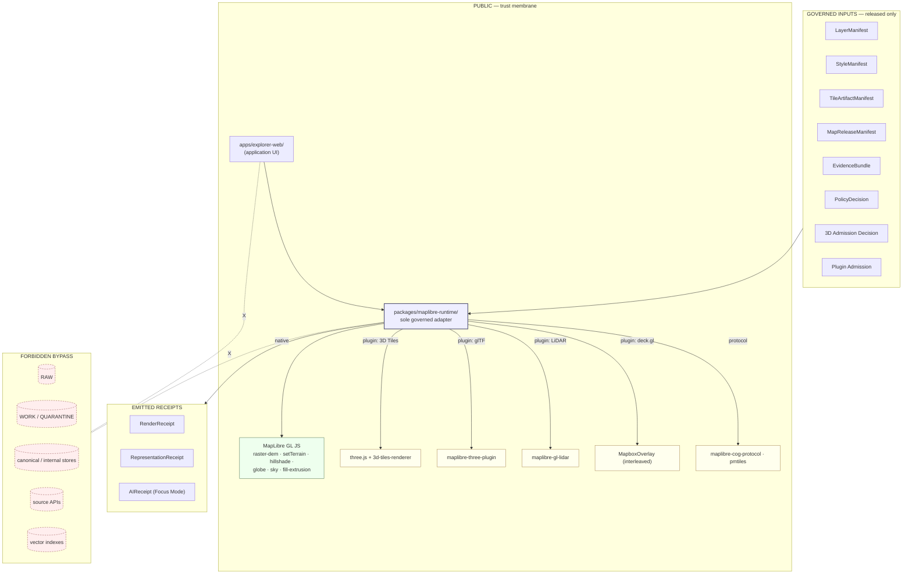

<!-- [KFM_META_BLOCK_V2]
doc_id: kfm://doc/NEEDS-VERIFICATION
title: MapLibre Master Atlas Carrier
type: standard
version: v0.1
status: draft
owners: OWNER_TBD
created: 2026-05-25
updated: 2026-05-25
policy_label: public
related:
  - Master_MapLibre_Components-Functions-Features_v2.1_FULL.md
  - docs/architecture/maplibre-3d.md
  - docs/atlases/receipt-catalog.md
  - docs/atlases/pipeline-gate-reference.md
  - docs/atlases/KFM_Domains_v1_1_plus_Pass23_Pass32_Consolidated_Atlas.md
  - docs/doctrine/directory-rules.md
  - packages/maplibre-runtime/
  - schemas/contracts/v1/maplibre/
  - schemas/contracts/v1/3d/
  - policy/maplibre/
tags: [kfm, atlas, maplibre, renderer, 3d, doctrine, carrier]
notes:
  - Carrier into Master MapLibre Components-Functions-Features v2.1 (26-category atlas) with the v1.3 renderer-decision overlay applied.
  - Master doc remains the doctrinal anchor for renderer capability and category content; Atlas v1.1 §19 anchors trust-membrane wiring; directory-rules.md v1.3 anchors placement.
  - Cesium retirement is PROPOSED doctrine pending ADR-OPEN-DR-10 acceptance; freeze rule is already in effect.
  - Owners, doc_id, ADR number, and related-path verification all remain placeholders.
[/KFM_META_BLOCK_V2] -->

# MapLibre Master Atlas Carrier

> **A navigable, carrier-only index into the Master MapLibre Components-Functions-Features v2.1 atlas — 26 categories of renderer capability, required object families, the v1.3 sole-renderer decision, schema/policy/runtime homes, and the trust-membrane discipline that keeps the renderer subordinate to evidence.**
> Authority lives in the master doc and in `directory-rules.md` v1.3; this file routes readers into them.

<p align="center">
  
  
  
  
  
  
  
</p>

**Quick jump:** [Purpose](#1-purpose-and-role) · [Renderer boundary](#2-renderer-boundary-doctrine-category-a) · [v1.3 overlay](#3-v13-renderer-decision-overlay) · [Architecture](#4-architecture-diagram) · [Categories A–Z](#5-category-atlas-az) · [Required objects](#6-required-objects-and-contracts) · [3D capability](#7-maplibre-3d-capability-surface) · [Homes](#8-schema-policy-and-runtime-homes) · [Anti-patterns](#9-trust-membrane-anti-patterns) · [Open items](#10-open-renderer-decision-items) · [ADRs](#12-adr-backlog) · [Verification](#13-verification-checklist)

> [!IMPORTANT]
> **Status:** `PROPOSED file` / `CONFIRMED doctrine (master + atlas)` / `PROPOSED v1.3 renderer doctrine` / `UNKNOWN repo implementation depth`
> **Owner:** `OWNER_TBD`
> **Proposed path:** `docs/atlases/maplibre-master.md`
> **Lane choice:** `docs/atlases/` over `docs/atlas/` — **CONFIRMED at doctrine level** per `directory-rules.md` v1.2 §6.1 and Atlas v1.1 Appendix G; path itself **NEEDS VERIFICATION** in the mounted repo.
> **Truth posture:** *The master MapLibre doc and Atlas v1.1 §19 are doctrine.* This file is a carrier. The renderer is not the truth system; `EvidenceBundle`, `PolicyDecision`, `ReviewRecord`, and `ReleaseManifest` remain authoritative.

> [!NOTE]
> **Evidence boundary.** Category names and the 26-category structure are `CONFIRMED doctrine` from the master doc. Renderer-boundary trust law and required object families are `CONFIRMED doctrine`. The v1.3 sole-renderer architecture and Cesium retirement are `PROPOSED doctrine target` pending ADR acceptance (OPEN-DR-10 in `directory-rules.md` v1.3 §18.e); the **freeze rule** on new `cesium*` artifacts is already active. MapLibre 3D capability claims are `CONFIRMED` from `maplibre-3d.md` §0.4 and MapLibre's own published documentation. **Repo implementation depth, validator wiring, CI gate enforcement, runtime emission paths, dashboard surfacing, and the presence of `packages/maplibre-runtime/`, `policy/maplibre/`, `schemas/contracts/v1/maplibre/`, `schemas/contracts/v1/3d/` remain `UNKNOWN`** — no mounted repo was inspected.

---

## 1. Purpose and role

The renderer is the most visible KFM surface. A user encounters maps before they encounter receipts. The Master MapLibre Components-Functions-Features doc exists to make sure the renderer **never becomes the truth system** — it stays a downstream interpretive surface that consumes released layers, emits receipts, and surfaces governance state (citations, stale/redacted/denied badges, EvidenceBundle resolution).

This file is the **navigable carrier** into that master doc. It exists because:

- The master doc is large (26 categories, hundreds of idea rows, multiple version packs); maintainers need a single page that names every category, points to required object families, and flags the v1.3 overlay.
- `directory-rules.md` v1.3 retired Cesium and established MapLibre as the sole browser-side renderer — a substantive change with its own `OPEN-DR-10`, `OPEN-DR-11`, `OPEN-DR-12` open items. This file surfaces them where they belong: alongside the renderer atlas.
- Atlas v1.1 §19 names "MapLibre UI + Evidence Drawer + Focus Mode" as a cross-domain system with a specific guardrail. This file links the master-doc categories to that guardrail.

**This file is not authority.** Non-collapse applies twice:

1. **Atlas registers and carriers are navigation aids.** They do not substitute for evidence, policy, review state, source authority, or release state.
2. **The renderer is not truth.** From Atlas v1.1 §19: *"Renderer is not truth, source registry, policy engine, citation authority, review authority, release authority, or AI authority."*

---

## 2. Renderer boundary doctrine (Category A)

> **Doctrinal anchor:** Master MapLibre v2.1 §7.A *"Renderer Boundary and KFM Trust Law"*.
> **Status:** `EXPANDED` in v2.1 with current-run evidence; carries the binding trust law for every other category.

Category A is **not optional**. Every renderer behavior in categories B through Z must answer to Category A.

| Rule | Source |
|---|---|
| The renderer must **never** become evidence authority. | Master MapLibre v2.1 §7.A `ML-A-073`. |
| Public clients must not load RAW, WORK, candidate, or unverifiable artifacts. | Master MapLibre v2.1 §7.A `ML-A-073` (validation test). |
| **Published artifacts beat operational stores.** Map shell consumes released artifacts, not internal tile generation or databases. | Master MapLibre v2.1 §7.A `ML-A-074`; Atlas v1.1 §24.9.2 anti-pattern *"Map shell consumes canonical / internal store directly."* |
| Renderer is **not** truth, source registry, policy engine, citation authority, review authority, release authority, or AI authority. | Atlas v1.1 §19 *(Cross-Domain Systems — MapLibre UI + Evidence Drawer + Focus Mode row)*. |
| The renderer's only legitimate inputs are governed manifests and released artifacts. | Master MapLibre v2.1 §7.A; every category's *Required objects / contracts* row. |

> [!IMPORTANT]
> **Trust-membrane invariant** (Atlas v1.1 §24.6.2; reproduced in `docs/atlases/pipeline-gate-reference.md` §9): *The trust membrane forbids any public client, any normal UI surface, and any released AI surface from reaching RAW, WORK, QUARANTINE, canonical/internal stores, graph internals, vector indexes, source APIs, or direct model runtimes.* MapLibre is **on the public side** of this membrane.

---

## 3. v1.3 renderer-decision overlay

> **Doctrinal anchor:** `directory-rules.md` v1.3 §0, §7.2.a, §11, §13.5, §18.e; `docs/architecture/maplibre-3d.md` §0.4, §6.2, §7.1, Appendix B.
> **Status:** `PROPOSED doctrine target` — the underlying ADR (*MapLibre as Sole Browser-Side Renderer; Retire Cesium Dependency*) is **filed PROPOSED**, ADR number pending. The **freeze rule** on new `cesium*` artifacts is **in effect immediately** per `directory-rules.md` v1.3 §11.

### 3.1 What v1.3 decides

| Element | Pre-v1.3 disposition | v1.3 disposition |
|---|---|---|
| Browser-side renderer architecture | Dual: MapLibre GL JS (2D) + Cesium (3D scenes, 3D Tiles, glTF, true-3D, volumetric). | **MapLibre GL JS as sole browser-side renderer.** All 3D flows through MapLibre native surface + its plugin ecosystem. |
| `KFM-P2-FEAT-0012` (Cesium 3D Tiles for 3D scenes) | Active in Pass 23 → Pass 32. | **`PROPOSED-SUPERSEDED`** by the renderer-decision ADR; card body preserved for lineage. |
| *"Which Cesium edition?"* open question | Active `NEEDS VERIFICATION`. | **`SUPERSEDED` — moot.** Neither CesiumJS open-source nor Cesium Ion is sanctioned, because Cesium itself is not adopted. |
| Planetary/3D object families (Scene Manifest, Terrain Model, 3D Tile Set, glTF Asset, Point Cloud, Digital Twin View, ViewState, Representation Receipt, Reality Boundary Note, 3D Admission Decision) | Implicitly renderer-agnostic. | **`UNCHANGED`.** Every family is implementable on MapLibre + its plugin ecosystem. Only the rendering substrate changed. |
| 2.5D vs. true-3D label discipline | Active. | **`UNCHANGED`** — discipline lives in the object families, not the renderer. |
| Schema homes for 3D / renderer contracts | Not pinned. | **`PROPOSED`** at `schemas/contracts/v1/maplibre/` and `schemas/contracts/v1/3d/`. **No** `schemas/contracts/v1/cesium/` admitted. |
| Runtime package home | Not pinned. | **`PROPOSED`** at `packages/maplibre-runtime/` (sole governed adapter). |
| Policy home for 3D + plugin admission | Not pinned. | **`PROPOSED`** at `policy/maplibre/`. |
| Anti-pattern | n/a | New v1.3 anti-pattern: *"Reintroducing a parallel browser renderer."* (§9) |

### 3.2 Master-doc Category W naming legacy

> [!WARNING]
> **`SUPERSEDED naming` — Category W title carries legacy wording.** Master MapLibre v2.1 Category W is titled *"3D / Cesium / Deck.gl / Overlay Interoperability"* — preserving the prior-master heading verbatim. Under v1.3, the **Cesium** portion is `PROPOSED-SUPERSEDED`. The category's *content* on 3D, deck.gl, and overlay interoperability remains in force; the category *name* is a lineage carry-forward that should be retitled when the renderer-decision ADR is accepted. Until then, treat any in-category Cesium prescription as superseded.

---

## 4. Architecture diagram



> The dashed forbidden edges are the trust-membrane invariant. The renderer **never** reaches them.

---

## 5. Category atlas (A–Z)

> **Doctrinal anchor:** Master MapLibre v2.1 §6 (Category Atlas) and §7 (Detailed Category Chapters). Category names and ordering are `CONFIRMED doctrine` from the master doc and prior masters; category content has been `EXPANDED` across multiple version packs (v1.5, v1.6, v2.0, v2.1).

The 26 categories form the canonical map of MapLibre concerns in KFM. Every category in the master doc carries the same four normative blocks: **Required objects / contracts**, **Public UI implication**, **Policy implication**, **Validation tests**.

| # | Category | Concern | v1.3 overlay note |
|---|---|---|---|
| **A** | **Renderer Boundary and KFM Trust Law** | The non-negotiable boundary: renderer ≠ truth. | `CONFIRMED doctrine` — anchors every other category. |
| **B** | MapLibre GL JS Web Shell | The browser web shell — viewport, interaction, click candidates, camera/context capture. | Sole renderer per v1.3. |
| **C** | MapLibre Native / Mobile / Platform Parity | Native/mobile shell — only after parity is established. | `NEEDS VERIFICATION` for parity. |
| **D** | MapLibre RS / Experimental Renderers | Experimental Rust renderer candidate. | `UNKNOWN` status; not the default path. |
| **E** | Style Specification, Sources, Layers, Expressions | Style JSON, source definitions, layer definitions, expressions, filters. | — |
| **F** | Sprites, Glyphs, Fonts, Design Tokens | Sprite sheets, glyph PBF, font stacks, design tokens. | Sprite/glyph hashes pinned in `StyleManifest`. |
| **G** | GeoJSON and Runtime Data | GeoJSON sources and other runtime data. | Public-safe only. |
| **H** | Vector Tiles: MVT and MLT | Mapbox Vector Tiles and MapLibre Tiles formats. | — |
| **I** | PMTiles, MBTiles, Static Tiles, Serverless Delivery | Cloud-native and static tile delivery (PMTiles addProtocol). | Heavy v2.0 expansion (20 ideas). |
| **J** | Martin and Server-Mediated Tile Serving | Server-mediated tile serving. | Used only when static delivery is insufficient. |
| **K** | Raster, COG, DEM, Terrain, Hillshade | Raster path, COG, DEMs, terrain via `raster-dem` + `setTerrain`, native `hillshade`. | Native MapLibre 3D feature surface per §7. |
| **L** | WMS / WMTS / External Map Services | External map services. | Governance preserved across external boundaries. |
| **M** | LayerManifest, StyleManifest, TileArtifactManifest, MapReleaseManifest | The renderer's manifest spine — the **only** legitimate inputs. | Anchor category for everything published. |
| **N** | Evidence Drawer Payloads and Click Resolution | Click → feature ID → `EvidenceBundle` projection in the Evidence Drawer. | Atlas v1.1 §19 *Evidence Drawer*. |
| **O** | Focus Mode and Governed AI Map Context | `MapContextEnvelope` + governed AI; `AIReceipt`; abstain/deny behavior. | Atlas v1.1 §19 *Focus Mode*; cite-or-abstain. |
| **P** | Time-Aware Map Interaction and Timeline | Time slider, time-aware state, temporal scope. | `valid_time` / `observed_time` discipline. |
| **Q** | Sensitive Geometry, Geoprivacy, Rights, and Policy | `RedactionReceipt`, `AggregationReceipt`, sensitivity tiers, deny-by-default. | Atlas v1.1 §24.5 tier reference. |
| **R** | Plugin, Wrapper, and Dependency Governance | Plugin admission, pinned versions, supply-chain references. | `policy/maplibre/plugin-admission.rego` (PROPOSED). |
| **S** | Accessibility, UX, and Trust-Visible States | Trust badges, stale/degraded/denied/unverified surfaces, keyboard access. | UX is part of the trust contract. |
| **T** | Performance, Caching, CDN, Range Requests, and Resource Timing | Caching strategy, CDN posture, Range/CORS probes. | Native MapLibre globe + plugin perf budgets. |
| **U** | Testing, CI, Validation, Rollback, and Proof Objects | Schema validation, no-RAW/WORK/QUARANTINE path tests, visual regression, rollback restore. | Validator catalog (largest delta). |
| **V** | Exports, Screenshots, Reports, and Citation Preservation | Story snapshots, exports, citation preservation. | `StorySnapshot` / `ExportReceipt`. |
| **W** | **3D / ~~Cesium~~ / Deck.gl / Overlay Interoperability** | 3D Tiles, glTF, point clouds, deck.gl interleaved, overlay sync. | **Cesium portion `PROPOSED-SUPERSEDED` per v1.3** (§3.2). |
| **X** | Anti-Patterns and Failure Modes | What goes wrong; how to detect it. | See §9. |
| **Y** | Implementation Backlog and PR Plan | Backlog of PR-ready work. | `PROPOSED` — implementation maturity is `UNKNOWN`. |
| **Z** | Open Questions and Verification Backlog | Items requiring evidence or decision. | Largest at 150 items per the v2.1 pack. |

> See Master MapLibre v2.1 §7.A through §7.Z for the full detailed chapters. This carrier names the categories; the master doc carries the rows.

---

## 6. Required objects and contracts

> **Source:** Master MapLibre v2.1 — the "Required objects / contracts" row appears under **every** category (E, K, L, N, O, etc.) verbatim. `CONFIRMED doctrine`.

Every governed MapLibre operation must resolve against the following object spine. If any element is missing, the operation **fails closed**.

```text
SourceDescriptor      → admission identity, rights, role, sensitivity, cadence
LayerManifest         → per-layer identity, evidence, geometry, time, trust badges
StyleManifest         → style JSON + sprite/glyph hashes + accessibility/meaning changes
TileArtifactManifest  → MVT/PMTiles/COG/GeoParquet artifact identity + hashes
MapReleaseManifest    → bound released layers + styles + tile artifacts + proof pack + rollback
EvidenceBundle        → resolved evidence package for a claim
EvidenceRef           → reference that MUST resolve to EvidenceBundle before public claim
DecisionEnvelope      → finite outcome envelope for runtime/policy decisions
PolicyDecision        → ALLOW / DENY / HOLD with reason codes
PromotionDecision     → recorded state-transition decision (gates passed/held/denied)
RunReceipt            → pipeline/tool action receipt (inputs, outputs, spec_hash, versions)
RenderReceipt         → renderer-level receipt for a frame batch
AIReceipt             → governed AI answer receipt (Focus Mode only)
ValidationReport      → schema/policy/source-ledger validator outcome
rollback target       → prior release ID for restoration
cache invalidation record → CDN/edge invalidation after rollback
```

> Cross-references:
> - Receipt schema home and lifecycle-phase attachment: `docs/atlases/receipt-catalog.md`.
> - Gates that consume these objects: `docs/atlases/pipeline-gate-reference.md`.
> - Source-role discipline for `SourceDescriptor`: Atlas v1.1 §24.1.

### 6.1 What every category requires

The master doc's per-category structure repeats four blocks (`CONFIRMED doctrine`):

| Block | Rule (verbatim from master doc) |
|---|---|
| **Required objects / contracts** | The full object spine above appears in every category. |
| **Public UI implication** | *"Show released layer state, stale/degraded/denied/unverified status, citations, policy posture, and Evidence Drawer resolution; never expose raw watcher state, unreleased tile URLs, direct model output, or canonical/internal stores."* |
| **Policy implication** | *"Deny by default when rights, source authority, sensitivity, signatures, proof coverage, source-role labels, or release state are missing. Sensitive geometry must be transformed before rendering, not hidden only by style."* |
| **Validation tests** | *"Schema validation, no public RAW/WORK/QUARANTINE path, no unreleased tile load, proof/signature checks, source-layer validity, Range/CORS/CDN probes, visual regression, keyboard accessibility, Focus Mode cite/abstain/deny, rollback restore, and cache invalidation record checks."* |

---

## 7. MapLibre 3D capability surface

> **Doctrinal anchor:** `docs/architecture/maplibre-3d.md` §0.4 capability table; `KFM_Encyclopedia.md` §5.3 (verified against MapLibre official documentation and a MapLibre example dated 2026-03-03).
> **Status:** Capability availability `CONFIRMED`. Implementation under `packages/maplibre-runtime/` `PROPOSED`.

| Capability | Surface | Source | KFM admission |
|---|---|---|---|
| Terrain (DEM-driven) | Native `raster-dem` + `setTerrain` | MapLibre GL JS core | 3D Admission Decision required. |
| Hillshade | Native `hillshade` layer type | MapLibre GL JS core | Standard layer admission. |
| Globe projection + atmosphere | Native `setProjection({type:'globe'})` + `sky` (MapLibre 5.0+, Jan 2025) | MapLibre GL JS core | 3D Admission Decision required. |
| 2.5D extrusion | Native `fill-extrusion` | MapLibre GL JS core | Layer-level admission. |
| OGC 3D Tiles | `three.js` + `3d-tiles-renderer` as custom layer | Plugin, pinned version | Plugin Admission + 3D Admission. |
| glTF assets | `maplibre-three-plugin` | Plugin, pinned version | Plugin Admission + 3D Admission. |
| LiDAR / point clouds (LAS, LAZ, COPC, EPT) | `maplibre-gl-lidar` | Plugin, pinned version | Plugin Admission + 3D Admission; sensitivity gates apply. |
| deck.gl interleaved | `MapboxOverlay` with `interleaved: true` | Plugin, pinned version | Plugin Admission. |
| COG (Cloud-Optimized GeoTIFF) | `maplibre-cog-protocol` via `addProtocol` | Plugin / protocol | Protocol admission; source-rights checks. |
| PMTiles | `addProtocol` (native MapLibre extension point) | Plugin / protocol | Source-role + rights checks. |

### 7.1 Hosting discipline

Per `directory-rules.md` v1.3 §7.2.a and §11:

- **Application code MUST NOT import** `maplibre-gl`, `three`, `3d-tiles-renderer`, `deck.gl`, `maplibre-gl-lidar`, or `maplibre-three-plugin` directly.
- **All access goes through `packages/maplibre-runtime/`**, which enforces admission, attaches evidence references, emits receipts, and resolves the pinned plugin set.
- **Every 3D-enabled layer MUST pass the 3D Admission Decision** evaluator *before* `setTerrain`, `setProjection({type:'globe'})`, or any plugin-hosted layer construction.
- **Every render-frame batch MUST emit a `RepresentationReceipt`** (subtype of `RenderReceipt`).
- **Synthetic / reconstructed / interpolated surfaces MUST carry a `RealityBoundaryNote`**, surfaced in the Evidence Drawer.

---

## 8. Schema, policy, and runtime homes

> **Doctrinal anchor:** `directory-rules.md` v1.3 §6.4 (schemas), §6.5 (policy), §7.2.a (packages), §11 (UI and Map Roots).
> **Status:** All v1.3 placement claims are **`PROPOSED`**; mounted-repo presence of any v1.3 path is **`NEEDS VERIFICATION`** (OPEN-DR-11).

### 8.1 Layout

```text
packages/maplibre-runtime/                  # (v1.3) sole governed renderer adapter
├── src/
│   ├── terrain.ts                          # native raster-dem + setTerrain wrapper
│   ├── hillshade.ts                        # native hillshade wrapper
│   ├── sky.ts                              # native sky layer
│   ├── globe.ts                            # native globe projection
│   ├── fill-extrusion.ts                   # 2.5D
│   ├── camera-path.ts
│   ├── custom-layer-host.ts                # base class for plugin-hosted layers
│   ├── tiles3d-three.ts                    # 3D Tiles via three.js + 3d-tiles-renderer
│   ├── gltf-three.ts                       # glTF via maplibre-three-plugin
│   ├── lidar-decklike.ts                   # wraps maplibre-gl-lidar
│   ├── deckgl-interleaved.ts               # wraps MapboxOverlay interleaved=true
│   ├── admission.ts                        # 3D Admission Decision evaluator
│   ├── plugin-registry.ts                  # pinned plugin versions + supply-chain refs
│   └── receipts.ts                         # RenderReceipt / RepresentationReceipt emission
│
schemas/contracts/v1/maplibre/              # (v1.3) renderer/scene schemas
├── scene_manifest.schema.json
├── style_manifest.schema.json
├── terrain_model.schema.json
├── synthetic_surface.schema.json
├── view_state.schema.json
├── representation_receipt.schema.json
└── camera_path.schema.json
│
schemas/contracts/v1/3d/                    # (v1.3) 3D-asset schemas via plugins
├── 3d_tile_set.schema.json
├── gltf_asset.schema.json
├── point_cloud.schema.json
├── digital_twin_view.schema.json
└── reality_boundary_note.schema.json
│
policy/maplibre/                            # (v1.3) renderer admission policy
├── 3d-admission.rego
├── plugin-admission.rego
├── sky-and-light-defaults.rego
└── globe-projection-admission.rego
│
contracts/maplibre/                         # (v1.3) renderer/scene contracts (Markdown meaning)
contracts/3d/                               # (v1.3) geometry-labeling, reality-boundary-notes
docs/architecture/map-shell.md
docs/architecture/maplibre-3d.md            # (v1.3) sole-renderer doctrine + 3D feature surface
```

### 8.2 What MUST NOT live in `packages/maplibre-runtime/`

Per `directory-rules.md` v1.3 §7.2.a:

- **Direct application UI** — lives in `apps/explorer-web/`.
- **3D admission *policy*** — lives in `policy/maplibre/` (code-vs-policy split).
- **3D *schemas*** — live in `schemas/contracts/v1/maplibre/` and `schemas/contracts/v1/3d/`.
- **A second renderer adapter** (`packages/cesium-runtime/`, `packages/deckgl-runtime/` as a peer, etc.) — anti-pattern §9.

---

## 9. Trust-membrane anti-patterns

> **Source:** Atlas v1.1 §24.9.2 (Trust-membrane anti-patterns) + `directory-rules.md` v1.3 §13.5 (renderer-decision anti-patterns) + Master MapLibre v2.1 §7.X.

| Anti-pattern | What goes wrong | Counter-rule |
|---|---|---|
| **Public client reads RAW / WORK / QUARANTINE.** | Trust membrane bypassed; promotion gates skipped. | Governed API; layer manifest resolver. |
| **Map shell consumes canonical / internal store directly.** | Renderer becomes the public surface and inherits no governance. | MapLibre shell wiring; layer registry; `MapReleaseManifest` only. |
| **AI returns uncited language inside the map UI.** | Generated text substitutes for evidence; cite-or-abstain broken. | Focus Mode `AIReceipt`; `CitationValidationReport`. |
| **Sensitive content released without redaction.** | `RedactionReceipt` missing; rights / sovereignty violation. | Release queue; sensitivity reviewer. |
| **Synthetic surface presented without Reality Boundary Note.** | Reconstruction read as observation. | Scene admission gate; `RepresentationReceipt` validator. |
| **Aggregate cited as per-place observation.** | Source-role collapse; matrix-cell semantics violated. | Validator; Focus Mode citation evaluator. |
| **Release without `ReleaseManifest` or rollback target.** | Public surface cannot be rolled back; release not auditable. | Release queue; release authority. |
| **AI generation routed through admin shortcut.** | Admin bypass becomes a normal-path public route. | Trust-membrane audit; infra. |
| **Reintroducing a parallel browser renderer** *(v1.3)*. | Two truth-membrane surfaces; parallel rendering authority; KFM-P2-FEAT-0012's open Cesium-edition / licensing questions return. | Refuse the PR; route the work into `packages/maplibre-runtime/src/<adapter>.ts`. |
| **Direct renderer-library import in app code** *(v1.3)*. | `apps/explorer-web/` or feature code imports `maplibre-gl`, `three`, `3d-tiles-renderer`, `deck.gl`, `maplibre-gl-lidar`, or `maplibre-three-plugin` directly, bypassing admission. | All access through `packages/maplibre-runtime/`. |
| **3D admission policy outside `policy/`** *(v1.3)*. | `.rego` files co-located with adapter code, app code, or `release/`. | Move to `policy/maplibre/`. |
| **3D schemas outside `schemas/`** *(v1.3)*. | `.schema.json` files for `scene_manifest`, `terrain_model`, `3d_tile_set`, etc. under `packages/`, `contracts/`, or `apps/`. | Move to `schemas/contracts/v1/maplibre/` or `schemas/contracts/v1/3d/`. |
| **Renderer-switch UI** *(v1.3)*. | `apps/explorer-web/src/map/renderer-switch.tsx` or similar; no second renderer exists. | Remove. |
| **Cross-renderer integration test** *(v1.3)*. | `tests/integration/cross-renderer/*`; no second renderer to integrate with. | Remove. |

---

## 10. Open renderer-decision items

> **Source:** `directory-rules.md` v1.3 §18.e (`OPEN-DR-10`, `OPEN-DR-11`, `OPEN-DR-12`). `CONFIRMED at v1.3 authoring`.

| Open item | What it tracks | Resolution required |
|---|---|---|
| **`OPEN-DR-10`** | Renderer-decision ADR (*MapLibre as Sole Browser-Side Renderer; Retire Cesium Dependency*) not yet filed/accepted. ADR number is `NEEDS VERIFICATION` due to the open ADR-0003 numbering conflict noted in `maplibre-3d.md` §6.1. | File the ADR with a definitive number; mark `status: accepted`; add supersession link to `KFM-P2-FEAT-0012`; update `directory-rules.md` §0 *Supersedes* field. |
| **`OPEN-DR-11`** | Whether `packages/cesium*`, `policy/cesium*`, `schemas/contracts/v1/cesium*`, `contracts/cesium*` exist in the mounted repo. v1.3 was authored **without** mounted-repo inspection for Cesium artifacts. | Inspect mounted repo; for each found path, record a migration card in `docs/registers/DRIFT_REGISTER.md`; move surviving logic per §8.1; write a one-time `migrations/code/<date>-retire-cesium.md` per `directory-rules.md` §14.2. |
| **`OPEN-DR-12`** | `packages/maplibre/` (v1.2 historical name) vs `packages/maplibre-runtime/` (v1.3 canonical name). If the mounted repo has `packages/maplibre/`, it is a compatibility name pending rename. | Rename as a routine PR under the same ADR/PR sequence as `OPEN-DR-10`; if deferred, record `packages/maplibre/` as `transitional` in `docs/registers/DRIFT_REGISTER.md` per `directory-rules.md` §8. |

> [!NOTE]
> The **freeze rule** is independent of ADR acceptance: per `directory-rules.md` v1.3 §11, no new `cesium*` code, schemas, policies, or tests may land while OPEN-DR-10 pends.

---

## 11. Cross-references

| Reference | Role | Status |
|---|---|---|
| Master MapLibre Components-Functions-Features v2.1 | **Primary doctrinal anchor for this file.** 26-category atlas; required object spine; per-category UI/policy/validation discipline. | `CONFIRMED doctrine` |
| `docs/architecture/maplibre-3d.md` | Sole-renderer doctrine; 3D feature surface capability table; renderer-decision ADR (Appendix B). | `CONFIRMED doctrine target / PROPOSED ADR` |
| `directory-rules.md` v1.3 §§0, 6.4, 6.5, 7.2.a, 11, 13.5, 18.e | v1.3 renderer-decision overlay; schema/policy/runtime placement; anti-patterns; open-DR tracking. | `CONFIRMED at v1.3 authoring` |
| Atlas v1.1 §19 (Cross-Domain Systems) | "MapLibre UI + Evidence Drawer + Focus Mode" guardrail row. | `CONFIRMED doctrine` |
| Atlas v1.1 §24.9.2 (Trust-membrane anti-patterns) | Renderer-related anti-patterns reproduced in §9. | `CONFIRMED doctrine` |
| Atlas v1.1 Renderer Decision Overlay | Pre-v1.3 vs v1.3 disposition for every renderer-related row of the Pass 23/32 atlas. | `CONFIRMED doctrine target` |
| `docs/atlases/receipt-catalog.md` | Companion carrier — receipt classes consumed by every MapLibre operation (esp. `RenderReceipt`, `RepresentationReceipt`, `AIReceipt`, `ReleaseManifest`). | `PROPOSED file` |
| `docs/atlases/pipeline-gate-reference.md` | Companion carrier — gates that release MapLibre artifacts. | `PROPOSED file` |
| `KFM_Encyclopedia.md` §5.2, §5.3 | MapLibre 3D capability surface map; cross-domain systems index. | `CONFIRMED corpus presence` |
| KFM-P9-FEAT-0011 / KFM-P9-FEAT-0013 | 2.5D vs. true-3D label discipline. | `CONFIRMED` |
| `KFM-P2-FEAT-0012` | Original dual-renderer card; **`PROPOSED-SUPERSEDED`** by renderer-decision ADR. | `LINEAGE` |

---

## 12. ADR backlog

| ADR | Title (`PROPOSED`) | Why ADR-class | Status |
|---|---|---|---|
| **ADR-NNNN** *(per `maplibre-3d.md` Appendix B)* | **MapLibre as Sole Browser-Side Renderer; Retire Cesium Dependency** | Reverses a previously canonical rule (§17 of `directory-rules.md`); requires ADR + supersession notice + drift register entry. | `PROPOSED`; ADR number pending (`OPEN-DR-10`). |
| **ADR-S-01** | Confirm/amend ADR-0001 (schema home) | Anchors the v1.3 additive segments `schemas/contracts/v1/maplibre/` and `schemas/contracts/v1/3d/`. | Open. |
| **ADR-S-07** | 3D admission policy | Operationalized v1.3 by `packages/maplibre-runtime/src/admission.ts` + `policy/maplibre/3d-admission.rego`. | Open (Atlas §24.12). |
| **ADR-S-* (proposed)** | Master MapLibre v2.1 Category W rename (drop "Cesium") | Lineage carry-forward should be retitled when renderer-decision ADR is accepted. Surfaced in §3.2. | Not yet filed. |
| **ADR-S-* (proposed)** | Plugin admission catalogue (R) — pinned versions + supply-chain references | The pinned plugin set (`three`, `3d-tiles-renderer`, `deck.gl`, `maplibre-gl-lidar`, `maplibre-three-plugin`) is governance-significant. | Not yet filed. |

> ADR-S numbering: existing slots S-01 through S-15 are listed in Atlas v1.1 §24.12. New proposals here are deliberately unnumbered.

---

## 13. Verification checklist

- [ ] Confirm the target path `docs/atlases/maplibre-master.md` does not already exist; resolve `docs/atlas/` mirror collisions.
- [ ] Confirm filename convention (`kebab-lowercase`) against the existing `docs/atlases/KFM_Domains_v1_1_plus_Pass23_Pass32_Consolidated_Atlas.md` (underscored UpperCase).
- [ ] Confirm `OWNER_TBD` — docs steward + renderer-runtime owner.
- [ ] Confirm `doc_id` allocation convention; do not invent UUIDs.
- [ ] **OPEN-DR-10**: Confirm ADR file exists at `docs/adr/ADR-<NNNN>-maplibre-sole-renderer-retire-cesium.md`; resolve the ADR-0003 numbering conflict noted in `maplibre-3d.md` §6.1.
- [ ] **OPEN-DR-11**: Inspect mounted repo for `packages/cesium*`, `policy/cesium*`, `schemas/contracts/v1/cesium*`, `contracts/cesium*`; record findings in `docs/registers/DRIFT_REGISTER.md`.
- [ ] **OPEN-DR-12**: Inspect mounted repo for `packages/maplibre/` (v1.2 historical name); rename to `packages/maplibre-runtime/` or record as `transitional`.
- [ ] Confirm v1.3 additive segments exist or are tracked: `packages/maplibre-runtime/`, `schemas/contracts/v1/maplibre/`, `schemas/contracts/v1/3d/`, `policy/maplibre/`, `contracts/maplibre/`, `contracts/3d/`.
- [ ] Confirm `tests/maplibre/` and `fixtures/maplibre/` segments exist per `directory-rules.md` v1.3 §6.6.
- [ ] Confirm import discipline: no `apps/explorer-web/` or feature code imports `maplibre-gl`, `three`, `3d-tiles-renderer`, `deck.gl`, `maplibre-gl-lidar`, or `maplibre-three-plugin` directly.
- [ ] Confirm no renderer-switch UI (`apps/explorer-web/src/map/renderer-switch.tsx` or similar).
- [ ] Confirm no `tests/integration/cross-renderer/*` directory.
- [ ] Confirm Category W's "Cesium" title is either retitled or annotated `PROPOSED-SUPERSEDED` in the master doc.
- [ ] Confirm every MapLibre layer has a resolvable `LayerManifest`, `StyleManifest`, `TileArtifactManifest`, and `MapReleaseManifest`.
- [ ] Confirm 3D-enabled layers pass the 3D Admission Decision before `setTerrain` / `setProjection({type:'globe'})` / plugin layer construction.
- [ ] Confirm `RepresentationReceipt` emission after each render-frame batch.
- [ ] Confirm synthetic / reconstructed / interpolated surfaces carry a `RealityBoundaryNote` in the Evidence Drawer.
- [ ] Run `Diagram syntactic check`: the Mermaid block in §4 renders on GitHub.

---

## 14. Rollback / supersession

| Condition | Action |
|---|---|
| Renderer-decision ADR (`OPEN-DR-10`) accepted | Demote v1.3 doctrine target language from `PROPOSED` to `CONFIRMED`; update Atlas v1.1 Renderer Decision Overlay table references. |
| Renderer-decision ADR rejected or amended | Restore pre-v1.3 dual-renderer disposition in §3; preserve `KFM-P2-FEAT-0012` lineage; remove `cesium*` freeze rule. |
| `OPEN-DR-11` inventory returns surviving `cesium*` paths | Migrate per `directory-rules.md` v1.3 §18.e (OPEN-DR-11 resolution steps); record drift card. |
| `OPEN-DR-12` rename completes | Drop `packages/maplibre/` references; canonical name `packages/maplibre-runtime/` only. |
| Master MapLibre vNext extends/renames categories | Update §5 in lock-step; preserve historical category numbering in a lineage table; bump file `version`. |
| Master doc Category W is retitled (drops "Cesium") | Update §3.2 and §5 row W; preserve the supersession note as lineage. |
| Atlas v1.2 amendments to §19 or §24.9.2 | Update §2 and §9 verbatim; do not paraphrase. |
| New plugin admitted to the pinned set | Update §7 capability table and §8.1 layout; require ADR for any plugin that introduces new authority or evidence surface. |
| This file is found to drift from master-doc wording on `CONFIRMED doctrine` rows | Restore master-doc wording verbatim; the master doc wins. |
| This file is found to overclaim implementation | Demote to `PROPOSED` / `UNKNOWN`; never resolve drift by lowering the truth label. |

**Rollback target:** `ROLLBACK_TARGET_TBD` (PROPOSED: prior commit ref of this file as recorded in `release/manifests/`).

---

## 15. Source ledger

| Source | Status | Supports | Limits |
|---|---|---|---|
| *Master MapLibre Components-Functions-Features v2.1 (FULL)* | `CONFIRMED doctrine` | §2 renderer-boundary rules; §5 26-category index; §6 required-objects spine; §6.1 four-block UI/policy/validation discipline; §9 anti-patterns. | Category content has been `EXPANDED` across multiple version packs (v1.5, v1.6, v2.0, v2.1); category names preserved verbatim — Category W still includes "Cesium". |
| *KFM Domains v1.1 + Pass 23/32 Consolidated Atlas* §19 *(Cross-Domain Systems)* | `CONFIRMED doctrine` | §1 carrier role; §2 renderer-not-authority rule; §11 cross-references. | Atlas registers are navigational aids per Atlas v1.1 front matter. |
| Atlas v1.1 §24.9.2 *(Trust-membrane anti-patterns)* | `CONFIRMED doctrine` | §9 anti-patterns table. | — |
| Atlas v1.1 Renderer Decision Overlay (in the `.md` conversion of Pass 23/32 atlas) | `CONFIRMED doctrine target` | §3 v1.3 overlay table; §3.2 Category W naming note. | Reverses a v1.0 canonical rule; conditional on ADR-OPEN-DR-10. |
| `docs/architecture/maplibre-3d.md` §0.4, §4, §5, §6, §7.1, §12, Appendix A, Appendix B | `CONFIRMED doctrine target / PROPOSED ADR` | §3 v1.3 decision; §7 3D capability table; §7.1 hosting discipline; §8 layout; §12 ADR row. | ADR is `PROPOSED`; ADR number pending. |
| `directory-rules.md` v1.3 §§0, 6.4, 6.5, 7.2.a, 11, 13.5, 18.e, 21 | `CONFIRMED at v1.3 authoring` | §3 overlay; §8 placement; §9 anti-patterns; §10 OPEN-DR-10/11/12. | All v1.3 paths are `PROPOSED`; mounted-repo presence `NEEDS VERIFICATION`. |
| `KFM_Encyclopedia.md` §5.2, §5.3 | `CONFIRMED corpus presence` | §7 3D capability surface (corroborates `maplibre-3d.md` §0.4). | Encyclopedia is doctrine corpus, not schema authority. |
| `docs/atlases/receipt-catalog.md` (companion carrier) | `PROPOSED file` (authored in this session) | §6 receipt cross-reference; §10 open ADR references. | Not yet mounted; carrier status. |
| `docs/atlases/pipeline-gate-reference.md` (companion carrier) | `PROPOSED file` (authored in this session) | §6 gate cross-reference; trust-membrane invariant quote. | Not yet mounted; carrier status. |

> **Memory is not evidence.** Every consequential claim in this file is traceable to one of the sources above, a master-doc or atlas row reproduced verbatim, or an explicit `PROPOSED` / `NEEDS VERIFICATION` / `SUPERSEDED` placeholder.

---

<p align="right"><a href="#maplibre-master-atlas-carrier">↑ Back to top</a></p>
