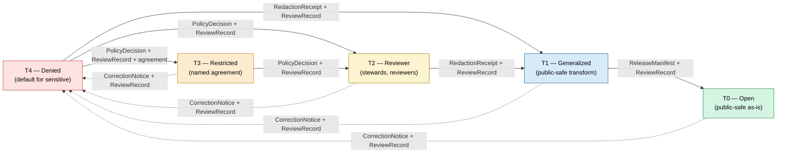

<!-- [KFM_META_BLOCK_V2]
doc_id: kfm://doc/atlas-v1-1-ch24-5-sensitivity-tier-reference
title: Master Sensitivity / Rights Tier Reference (Atlas v1.1 §24.5)
type: standard
version: v1
status: draft
owners: OWNER_TBD  # NEEDS VERIFICATION: docs steward + sensitivity reviewer
created: 2026-05-25
updated: 2026-05-25
policy_label: public
related:
  - kfm://doc/atlas-v1-1   # PROPOSED: docs/atlases/KFM_Domains_Culmination_Atlas_v1_1.pdf
  - kfm://doc/atlas-v1-0-section-20-5   # CONFIRMED upstream: v1.0 §20.5 Deny-by-Default Register
  - kfm://doc/directory-rules           # CONFIRMED: docs/doctrine/directory-rules.md
  - kfm://doc/encyclopedia              # CONFIRMED: docs/encyclopedia/
  - kfm://adr/ADR-S-05                  # PROPOSED: Sensitivity tier scheme (T0–T4) — adopt as canonical or revise
tags: [kfm, atlas, sensitivity, rights, tiers, governance, doctrine]
notes:
  - Extracts and normalizes Atlas v1.1 §24.5 from the consolidated PDF into a single Markdown chapter file.
  - Subfolder convention `docs/atlases/master-atlas-v1.1/` is PROPOSED; parallels OPEN-ENC-02 (chapter-split convention) and NEEDS ADR resolution.
  - Tier scheme (T0–T4) itself is labeled PROPOSED in source pending ADR-S-05.
[/KFM_META_BLOCK_V2] -->

# Master Sensitivity / Rights Tier Reference

<!-- [doc: kfm://doc/atlas-v1-1-ch24-5-sensitivity-tier-reference] -->

> Uniform tier scheme, allowed transforms, and gate artifacts for deciding **which representation of a record may leave the trust membrane, to whom, and under what receipts.** Extends Atlas v1.0 §20.5 (Deny-by-Default Register).

  
  
  
  
  
  
  

> [!IMPORTANT]
> **Truth posture.** The publish-safest-representation **doctrine** in §1 is CONFIRMED. The **T0–T4 scheme** in §2 and the **per-domain tier assignments** in §3 are PROPOSED pending ADR-S-05. **Tier transition rules** in §4 are CONFIRMED doctrine. **File placement** under `docs/atlases/master-atlas-v1.1/` is PROPOSED; mounted-repo presence is NEEDS VERIFICATION.

> [!NOTE]
> This document is a **navigational aid**. It does not substitute for `EvidenceBundle`, `PolicyDecision`, `ReviewRecord`, or `ReleaseManifest`. The registers below name the artifacts each transition requires; the artifacts themselves carry the proof.

---

## Contents

1. [Doctrine origin](#1-doctrine-origin)
2. [Tier scheme — T0 through T4](#2-tier-scheme--t0-through-t4)
3. [Per-domain tier matrix](#3-per-domain-tier-matrix)
4. [Tier transitions (allowed motion)](#4-tier-transitions-allowed-motion)
5. [Promotion-gate integration](#5-promotion-gate-integration)
6. [Verification checklist](#6-verification-checklist)
7. [Rollback](#7-rollback)
8. [Open questions & ADR cross-reference](#8-open-questions--adr-cross-reference)
9. [Evidence basis & citations](#9-evidence-basis--citations)

---

## 1. Doctrine origin

**CONFIRMED doctrine.** KFM publishes only the **safest representation** that still answers the steward's and the public's reasonable needs. Atlas v1.0 §20.5 introduces a **Deny-by-Default Register** that names per-domain restrictions. This section extends it with three uniform instruments so that *"publish at tier N"* becomes a reviewable, repeatable action across domains:

- a **tier scheme** (T0–T4) with explicit definitions and default audiences;
- a **uniform set of allowed transforms** per tier (generalization, aggregation, redaction, withholding); and
- a **uniform set of gate artifacts** each transition must emit (transform receipts, review records, policy decisions, release manifests, correction notices, rollback cards).

The tier reference does **not** create a new authority root. Source authority, policy authority, and release authority remain where Directory Rules and Atlas v1.0 placed them. The reference makes their **interaction visible** at publish time.

Citations: `[ENCY]` `[DIRRULES]` `[DOM-ARCH]` `[DOM-FAUNA]` `[DOM-FLORA]` `[DOM-PEOPLE]` `[DOM-SETTLE]`.

[↑ back to top](#top)

---

## 2. Tier scheme — T0 through T4

**Status:** PROPOSED scheme; pending ADR-S-05. Wording reproduced verbatim where Atlas v1.1 §24.5.1 states it as such; otherwise normalized for clarity without changing meaning.

| Tier | Name | Definition | Default audience |
|:---:|:---|:---|:---|
| **T0** | Open | Public-safe with no transformations required; no rights, sensitivity, or steward gating beyond standard release. | Any public client via governed API. |
| **T1** | Generalized | Public-safe only after generalization, fuzzing, aggregation, or redaction; transform is **reviewed and recorded**. | Any public client via governed API. |
| **T2** | Reviewer | Released only to authenticated reviewers or domain stewards; policy-bounded; **correction path active**. | Stewards, reviewers, named research collaborators. |
| **T3** | Restricted | Released only under **named agreement** (rights, sovereignty, or consent) and recorded. | Named authorized parties only. |
| **T4** | Denied | **Not released to any audience**; the existence of a record may be released only as steward review permits. | — |

> [!TIP]
> Tier is a property of the **claim as represented**, not of the underlying record. The same record can support a `T4` raw and a `T1` generalized derivative simultaneously — each is a separately reviewable, separately receipted object.

[↑ back to top](#top)

---

## 3. Per-domain tier matrix

**Status:** PROPOSED. Default tiers are starting points; the matrix is exhaustive only for the strongest cross-domain cases. Atlas v1.0's per-domain `M.` sections remain authoritative for the full per-domain register; conflicts with this matrix are filed to `docs/registers/DRIFT_REGISTER.md` per Directory Rules §2.5.

### 3.1 Sensitive defaults

| Domain / object class | Default tier | Allowed transforms (PROPOSED) | Required gates |
|:---|:---:|:---|:---|
| Archaeology — site location | **T4** | Steward review + cultural review + generalized geometry (coarse cell) + `RedactionReceipt` → T2 or T1. | `RedactionReceipt` + `ReviewRecord` + `PolicyDecision` |
| Archaeology — human remains / sacred sites | **T4** | No transform releases this to T0; T3 only under explicit named authorization. | Sovereignty review + `ReviewRecord` + `PolicyDecision` |
| Fauna — sensitive occurrence | **T4** | Geoprivacy generalization + `RedactionReceipt` → T1. | `RedactionReceipt` + `ReviewRecord` + `PolicyDecision` |
| Flora — rare or culturally sensitive plant location | **T4** | Generalized geometry + steward review → T2 or T1. | `RedactionReceipt` + `ReviewRecord` |
| People/DNA — living-person fields | **T4** | Aggregation by tract or county + `AggregationReceipt` → T1. | Consent **or** aggregation gate + `ReviewRecord` |
| People/DNA — raw DNA segment data | **T4** | No transform releases this to a public tier; T3 only under explicit research agreement. | Named consent + `ReviewRecord` + `PolicyDecision` |
| People / Land — private person-parcel join | **T4** | Generalized parcel + de-identified person → T2 only. | `RedactionReceipt` + `ReviewRecord` |
| Infrastructure — critical asset detail | **T4** | Generalized facility footprint + suppressed dependency → T1. | Steward review + `RedactionReceipt` |
| Infrastructure — condition / vulnerability | **T4** | T3 to named authorities only; **never T0 / T1**. | Steward review + named-party agreement |
| Hazards — KFM as alert authority | **T4 forever** | **No transform** permits KFM to act as an emergency-alert authority. The boundary holds. | Policy boundary; deny at runtime |
| Governed AI — RAW / WORK access via AI surface | **T4** | AI never reads RAW or WORK content; only released `EvidenceBundle`. | `PolicyDecision` + `AIReceipt` |
| Planetary / 3D — sensitive scene content | **T4** | Generalization / clipping / withholding; `Reality Boundary Note` + `Representation Receipt` → T1 or T2 where steward review supports. | Steward review + `RedactionReceipt` + `RepresentationReceipt` |

### 3.2 Standard-release defaults

| Domain / object class | Default tier | Allowed transforms (PROPOSED) | Required gates |
|:---|:---:|:---|:---|
| Fauna — range polygon | **T1** | Aggregate / generalized public-safe layer. | `AggregationReceipt` **or** `RedactionReceipt` |

> [!WARNING]
> Rows above are **strongest-cross-edge** entries from Atlas v1.1 §24.5.2. The full per-domain register lives in Atlas v1.0 `M.` sections and `policy/sensitivity/<domain>/`. Treat any silent absence here as **NEEDS VERIFICATION** against the per-domain register, **not** as license to publish.

[↑ back to top](#top)

---

## 4. Tier transitions (allowed motion)

**Status:** CONFIRMED doctrine for the artifact requirements and reversibility rules; the tier labels themselves remain PROPOSED pending ADR-S-05.

### 4.1 Transition table

| From → To | Required artifact | Required reviewer | Reversibility |
|:---|:---|:---|:---|
| **T4 → T3** | `PolicyDecision` + `ReviewRecord` + agreement | Steward + rights-holder where applicable | Reversible: agreement revocation returns object to T4 with `CorrectionNotice`. |
| **T4 → T2** | `PolicyDecision` + `ReviewRecord` | Steward | Reversible: review revocation returns object to T4. |
| **T4 → T1** | `RedactionReceipt` + `ReviewRecord` | Steward | Reversible: redaction can be re-evaluated; correction may demote a published T1 to T4. |
| **T3 → T2** | `PolicyDecision` + `ReviewRecord` | Steward | Reversible. |
| **T2 → T1** | `RedactionReceipt` + `ReviewRecord` | Steward | Reversible. |
| **T1 → T0** | `ReleaseManifest` + `ReviewRecord` | Steward + release authority | Reversible: rollback supported via `RollbackCard`. |
| **Any tier → T4** *(downgrade)* | `CorrectionNotice` + `ReviewRecord` | Steward + rights-holder where applicable | Always permitted; precedes derivative invalidation. |

### 4.2 Reading note

> [!IMPORTANT]
> **Tier upgrades** (toward more public) always require **both** a transform receipt **and** a review record.
> **Tier downgrades** (toward less public) never require both — **`CorrectionNotice` alone is sufficient** to remove or restrict.
>
> Stated differently: making a record more visible costs more proof than making it less visible. The asymmetry is intentional: the burden of justifying public release sits on the release path, never on the retreat path.

### 4.3 Motion diagram

*Solid arrows: upgrade (toward more public). Dotted arrows: downgrade (toward less public) — always permitted, single artifact.*

[↑ back to top](#top)

---

## 5. Promotion-gate integration

Tier transitions **do not bypass** the lifecycle gates documented in Atlas v1.1 §24.6 (`RAW → WORK / QUARANTINE → PROCESSED → CATALOG / TRIPLET → PUBLISHED`). They run **inside** the existing gates:

| Lifecycle gate | Tier-relevant artifact contribution |
|:---|:---|
| **Admission** (— → RAW) | `SourceDescriptor` declares sensitivity hint and rights; sets the initial **default tier** for the record. |
| **Normalization** (RAW → WORK/QUARANTINE) | `PolicyDecision` and `TransformReceipt` evaluate whether the record can leave quarantine; sensitivity violations route to QUARANTINE. |
| **Validation** (WORK → PROCESSED) | `RedactionReceipt` and/or `AggregationReceipt` produced **here** if transforms are required for any contemplated public tier. |
| **Catalog closure** (PROCESSED → CATALOG/TRIPLET) | `EvidenceBundle` carries the tier label and the receipt chain; `CatalogMatrix` records audience scope. |
| **Release** (CATALOG/TRIPLET → PUBLISHED) | `ReleaseManifest` names the **published tier**; for T1 → T0, a release authority distinct from the original author is required when materiality applies. |
| **Correction** (PUBLISHED → PUBLISHED′) | `CorrectionNotice` is the **sole** artifact needed to downgrade; derivative invalidation follows. |

> [!CAUTION]
> A tier label without its receipt chain is **inadmissible**. A `T1` claim that cannot resolve to a `RedactionReceipt` or `AggregationReceipt` plus a `ReviewRecord` must be treated as **`UNKNOWN` tier** and held at CATALOG, not published.

[↑ back to top](#top)

---

## 6. Verification checklist

Apply before treating any path, label, or artifact reference in this document as current implementation.

- [ ] Confirm target path `docs/atlases/master-atlas-v1.1/24.5-sensitivity-tier-reference.md` exists in the mounted repo, or create it via ADR-backed placement (parallels **OPEN-ENC-02**).
- [ ] Confirm subfolder convention `docs/atlases/master-atlas-v1.1/` is accepted (or a different chapter-split layout is adopted). Update this file's path accordingly.
- [ ] Confirm `ADR-S-05` outcome — whether T0–T4 is adopted as canonical or revised — and propagate the result to §2 and §3.
- [ ] Confirm `docs/encyclopedia/` cross-references (§5 chapter map, §7 crosswalk) point to this file once placed.
- [ ] Confirm `docs/registers/DRIFT_REGISTER.md` has an entry for any per-domain row in §3.1 that diverges from Atlas v1.0 `M.` sections.
- [ ] Confirm `policy/sensitivity/<domain>/` bundles enforce the per-domain tier defaults in §3 (Rego or equivalent).
- [ ] Confirm `schemas/contracts/v1/<receipts>/` shapes for `RedactionReceipt`, `AggregationReceipt`, `RepresentationReceipt`, `ReleaseManifest`, `CorrectionNotice`, `RollbackCard` are stable and reachable from `EvidenceBundle`.
- [ ] Confirm owners (sensitivity reviewer + docs steward) and update the meta block.
- [ ] Confirm no public path bypasses the gate artifacts named in §4 and §5.
- [ ] Confirm rollback target (see §7).

[↑ back to top](#top)

---

## 7. Rollback

Rollback for this document is required when a change:

- weakens the **publish-safest-representation** doctrine in §1;
- silently relabels a domain row in §3 from `T4` toward a more public tier without a `RedactionReceipt` + `ReviewRecord` justification;
- removes the **asymmetry rule** in §4.2 (upgrades require two artifacts; downgrades require one);
- introduces a tier transition not enumerated in §4.1 without an accepted ADR-S-05 amendment;
- decouples the tier reference from the lifecycle gates named in §5;
- normalizes any path that lets AI, MapLibre tiles, scenes, dashboards, vector indexes, or summaries publish a claim at a tier inconsistent with its `EvidenceBundle`.

**Rollback target:** `ROLLBACK_TARGET_TBD` — to be set by the docs steward at first acceptance commit; PROPOSED candidate is the Atlas v1.1 PDF at `docs/atlases/KFM_Domains_Culmination_Atlas_v1_1.pdf` §24.5, which remains authoritative regardless of the Markdown extract's state.

[↑ back to top](#top)

---

## 8. Open questions & ADR cross-reference

| # | Question | Class | Cross-reference |
|:---|:---|:---|:---|
| **OPEN-TIER-01** | Should the T0–T4 scheme be adopted as canonical, revised, or split per-domain? | ADR-class | **ADR-S-05** (Atlas v1.1 §24.12) |
| **OPEN-TIER-02** | Should `docs/atlases/master-atlas-v1.1/` be the canonical chapter-split layout, or should chapter files live elsewhere (or not exist at all)? | ADR-class | Parallels **OPEN-ENC-02** (encyclopedia chapter-split) |
| **OPEN-TIER-03** | Is `RepresentationReceipt` (Planetary/3D row in §3.1) a peer of `RedactionReceipt`, or a specialization? | Schema-home class | **ADR-S-03** (receipt class home) |
| **OPEN-TIER-04** | What is the canonical home for `policy/sensitivity/<domain>/` bundles enforcing §3? | Directory class | `directory-rules.md` §6.4, §13.5 |
| **OPEN-TIER-05** | For T1 → T0, when does release-authority separation become mandatory (vs. recommended)? | Governance class | Atlas v1.1 §24.7 (Reviewer / SoD matrix) |
| **OPEN-TIER-06** | Should `Hazards — KFM as alert authority` (T4 forever) be expressed as a hard policy-engine constant or only as documentation? | Policy class | `policy/release/hazards/` |

[↑ back to top](#top)

---

## 9. Evidence basis & citations

<strong>Source ledger</strong>

| Source | Status | Supports | Limits |
|:---|:---|:---|:---|
| Atlas v1.1 §24.5 (consolidated PDF, pp. 163–165) | CONFIRMED (manuscript) | Tier scheme, per-domain matrix, transition table, reading note. | Manuscript is doctrine; mounted-repo enforcement is NEEDS VERIFICATION. |
| Atlas v1.0 §20.5 (Deny-by-Default Register) | CONFIRMED (upstream doctrine) | The doctrine origin §1 and per-domain anchor in §3. | Authoritative for the full per-domain register; this file is a normalization, not a replacement. |
| `directory-rules.md` §6.1, §6.4, §13.5 | CONFIRMED (prior-session authored) | `docs/atlases/` as canonical atlas home; `policy/sensitivity/` placement. | Mounted-repo presence remains NEEDS VERIFICATION. |
| `KFM Encyclopedia.md` §15 (OPEN-ENC-02) | CONFIRMED (prior-session authored) | Precedent that chapter-split layout is ADR-class. | Encyclopedia decision does not bind atlas layout; parallel ADR may be needed. |
| Atlas v1.1 §24.6 (Pipeline Gate Reference) | CONFIRMED (manuscript) | §5 promotion-gate integration. | Gate artifacts are PROPOSED minimums in the source. |
| Atlas v1.1 §24.7 (Reviewer / SoD matrix) | CONFIRMED (manuscript) | Release-authority separation cross-reference (§8 OPEN-TIER-05). | PROPOSED scope per source. |
| Atlas v1.1 §24.12 (Open-ADR Backlog) | CONFIRMED (manuscript) | ADR-S-05 cross-reference. | List is for triage, not execution. |

### 9.1 Citation key

The Atlas corpus uses dossier-shorthand citations. They are preserved verbatim where this file extracts source text:

| Tag | Refers to |
|:---|:---|
| `[ENCY]` | KFM Encyclopedia (`docs/encyclopedia/kfm_encyclopedia.pdf`) |
| `[DIRRULES]` | Directory Rules (`docs/doctrine/directory-rules.md`) |
| `[DOM-ARCH]` | Domain dossier — Archaeology |
| `[DOM-FAUNA]` | Domain dossier — Fauna |
| `[DOM-FLORA]` | Domain dossier — Flora |
| `[DOM-PEOPLE]` | Domain dossier — People / Genealogy / DNA / Land |
| `[DOM-SETTLE]` | Domain dossier — Settlements / Infrastructure |
| `[DOM-HAZ]` | Domain dossier — Hazards |
| `[MAP-MASTER]` | Master MapLibre Components-Functions-Features |
| `[UIAI]` | Whole-UI Governed AI Expansion Report |
| `[GAI]` | Governed AI doctrine (Atlas §19, Encyclopedia §11) |

> [!NOTE]
> **Anti-collapse rule (inherited from Atlas v1.1 front matter).** Nothing in this register lets summaries, tables, or master-atlas extracts substitute for `EvidenceBundle`, `PolicyDecision`, `ReviewRecord`, source authority, or release state. The register names the artifacts; the artifacts carry the proof.

[↑ back to top](#top)

---

Atlas v1.1 §24.5 chapter extract. CONFIRMED doctrine where supported; PROPOSED scheme pending ADR-S-05; PROPOSED file placement under `docs/atlases/master-atlas-v1.1/` pending ADR (parallels OPEN-ENC-02). Authoritative source remains the Atlas v1.1 PDF at `docs/atlases/KFM_Domains_Culmination_Atlas_v1_1.pdf` §24.5.
