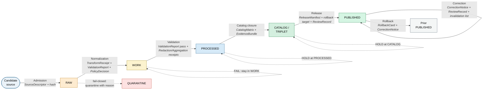

<!-- [KFM_META_BLOCK_V2]
doc_id: kfm://doc/atlas-v1-1-ch24-6-pipeline-gate-reference
title: Master Pipeline Gate Reference — RAW → PUBLISHED (Atlas v1.1 §24.6)
type: standard
version: v1
status: draft
owners: OWNER_TBD  # NEEDS VERIFICATION: docs steward + release authority + domain stewards
created: 2026-05-25
updated: 2026-05-25
policy_label: public
related:
  - kfm://doc/atlas-v1-1                                  # PROPOSED: docs/atlases/KFM_Domains_Culmination_Atlas_v1_1.pdf
  - kfm://doc/atlas-v1-1-ch24-2-receipt-catalog           # PROPOSED sibling: §24.2 Receipt Catalog
  - kfm://doc/atlas-v1-1-ch24-3-decision-outcome-envelope # PROPOSED sibling: §24.3 Decision Outcome Envelope
  - kfm://doc/atlas-v1-1-ch24-5-sensitivity-tier-reference # CONFIRMED authored: §24.5 (prior session)
  - kfm://doc/atlas-v1-1-ch24-7-reviewer-sod-matrix       # PROPOSED sibling: §24.7 Reviewer / SoD
  - kfm://doc/directory-rules                             # CONFIRMED: docs/doctrine/directory-rules.md
  - kfm://doc/lifecycle-law                               # CONFIRMED: docs/doctrine/lifecycle-law.md
  - kfm://adr/ADR-S-01                                    # PROPOSED: Schema home (relevant to schema/contract gates)
  - kfm://adr/ADR-S-03                                    # PROPOSED: Receipt class home
  - kfm://adr/ADR-S-04                                    # PROPOSED: Source-role vocabulary v1
tags: [kfm, atlas, pipeline, gates, lifecycle, governance, doctrine, promotion, release, correction, rollback]
notes:
  - Extracts and normalizes Atlas v1.1 §24.6 from the consolidated PDF into a single Markdown chapter file.
  - Subfolder convention `docs/atlases/master-atlas-v1.1/` is PROPOSED; parallels OPEN-ENC-02 and the OPEN-TIER-02 question raised in the §24.5 chapter extract.
  - Lifecycle invariant and closure rules are CONFIRMED doctrine; specific artifact lists are PROPOSED minimums per source.
[/KFM_META_BLOCK_V2] -->

# Master Pipeline Gate Reference

<!-- [doc: kfm://doc/atlas-v1-1-ch24-6-pipeline-gate-reference] -->
<a id="top"></a>

> The universal lifecycle spine `RAW → WORK / QUARANTINE → PROCESSED → CATALOG / TRIPLET → PUBLISHED`, the **gates** that govern each transition, and the **artifacts without which the gate fails closed.** Promotion is a governed state transition, not a file move.

<p>
  
  
  
  
  
  
  
</p>

> [!IMPORTANT]
> **Truth posture.** The **lifecycle invariant** (§1) and the **universal closure rules** (§3) are CONFIRMED doctrine. The **per-gate artifact lists** in §2 are PROPOSED minimums (each domain's `H.` pipeline-shape table in Atlas v1.0 may add more, never less). The **failure reason-code catalog** in §4 is PROPOSED. **File placement** under `docs/atlases/master-atlas-v1.1/` is PROPOSED; mounted-repo presence is NEEDS VERIFICATION.

> [!NOTE]
> This document names the **gates**; it does not implement them. The actual gate machinery lives in `policy/` (admissibility), `schemas/contracts/v1/` (artifact shape), `tools/` (validators and promotion-gate runners), and `release/` (manifests and rollback cards). A gate that exists in this register but has no enforced counterpart in those locations is **NEEDS VERIFICATION**, not "implemented."

---

## Contents

1. [Doctrine origin & lifecycle invariant](#1-doctrine-origin--lifecycle-invariant)
2. [Lifecycle gates](#2-lifecycle-gates)
3. [Universal closure rules](#3-universal-closure-rules)
4. [Gate failures — reason-code catalog](#4-gate-failures--reason-code-catalog)
5. [Pipeline spine diagram](#5-pipeline-spine-diagram)
6. [Integration with sibling §24 references](#6-integration-with-sibling-24-references)
7. [Verification checklist](#7-verification-checklist)
8. [Rollback](#8-rollback)
9. [Open questions & ADR cross-reference](#9-open-questions--adr-cross-reference)
10. [Evidence basis & citations](#10-evidence-basis--citations)

---

## 1. Doctrine origin & lifecycle invariant

**CONFIRMED doctrine.** Every domain in KFM follows the same lifecycle spine:

```text
RAW → WORK / QUARANTINE → PROCESSED → CATALOG / TRIPLET → PUBLISHED
```

Atlas v1.0 chapters 3–18 carry per-domain `H. Pipeline shape` tables. §24.6 consolidates them into one **universal gate reference**: each transition has a pre-condition, a required-artifact set, and a failure-closed outcome. **Without those artifacts, the transition does not happen** — the prior state is preserved and the failure is recorded with a reason code.

Three operating-law invariants govern the spine:

- **Promotion is a governed state transition, not a file move.** Moving bytes between directories without emitting the required artifacts produces no state change.
- **Public clients and normal UI surfaces use governed interfaces only.** The gates below are the *only* routes by which content reaches `PUBLISHED`, and `PUBLISHED` is the only state from which the governed API may emit `ANSWER`.
- **Receipts, proofs, catalogs, manifests, review records, correction notices, and rollback cards remain separate object families.** The gate machinery does not collapse them.

Citations: `[ENCY]` `[DIRRULES]` `[GAI]` `[MAP-MASTER]`.

[↑ back to top](#top)

---

## 2. Lifecycle gates

**Status:** CONFIRMED transitions; PROPOSED artifact minimums per Atlas v1.1 §24.6.1. Per-domain `H. Pipeline shape` tables in Atlas v1.0 may extend these lists; they may not weaken them.

| Gate (transition) | Pre-condition | Required artifacts (PROPOSED minimum) | Failure-closed outcome |
|:---|:---|:---|:---|
| **Admission** *(— → RAW)* | Source identity and rights are minimally established at discovery; source-role intent is set. | `SourceDescriptor` (role, authority, rights, sensitivity, cadence); hash of payload or reference. | Source not admitted; logged as candidate awaiting steward. |
| **Normalization** *(RAW → WORK / QUARANTINE)* | Schema, geometry, time, identity, evidence, rights, and policy rules are runnable. | `TransformReceipt`; `ValidationReport` (working set); `PolicyDecision`; **QUARANTINE for failures**. | Quarantine with reason; **never silently promotes**. |
| **Validation** *(WORK → PROCESSED)* | Validators are deterministic and tied to fixtures; required receipts present. | `ValidationReport` pass; `RedactionReceipt` if sensitivity applies; `AggregationReceipt` if applies. | Stay in WORK; structured `FAIL` outcome. |
| **Catalog closure** *(PROCESSED → CATALOG / TRIPLET)* | EvidenceRefs **resolve** (not just reference); catalog matrix and digests close. | `CatalogMatrix` entry; `EvidenceBundle`; graph / triplet projections if applicable. | HOLD at PROCESSED; structured `FAIL` outcome; **no public edge**. |
| **Release** *(CATALOG / TRIPLET → PUBLISHED)* | Review state where required; **release authority distinct from the original author when materiality applies**. | `ReleaseManifest`; rollback target; correction path; `ReviewRecord` (if required). | HOLD at CATALOG; no public surface change. |
| **Correction** *(PUBLISHED → PUBLISHED′)* | Detected error or new evidence; downstream derivatives identified. | `CorrectionNotice`; `ReviewRecord`; invalidation list; `ReleaseManifest` update or supersession. | Stale-state announcement; **no silent edit**. |
| **Rollback** *(PUBLISHED → prior release)* | Failed release or post-publication failure; targeted prior release identified. | `RollbackCard`; `CorrectionNotice`; `ReleaseManifest` reverts to prior release; downstream derivative invalidation. | Held at current state until rollback validated. |

> [!TIP]
> **Reading the artifact column.** "Required minimum" means *the gate cannot close without these.* A gate that emits more artifacts (e.g., `ModelRunReceipt` at Validation for a model-derived working set, or `RepresentationReceipt` at Release for a Planetary/3D scene) is following the same rule with a richer artifact set — not bending it.

[↑ back to top](#top)

---

## 3. Universal closure rules

**CONFIRMED doctrine (Atlas v1.1 §24.6.2).** A transition is closed **only when all three** of the following hold:

1. **The required artifacts above exist.** Each artifact named in §2 is present and well-formed.
2. **Every required artifact resolves — not just references — its dependencies.** `EvidenceRef → EvidenceBundle`, `source_id → SourceDescriptor`, `model_id → ModelRunReceipt`. A reference that does not dereference is not a reference; it is a hole.
3. **The policy gate evaluated and recorded its decision.** `PolicyDecision` exists with an explicit `ALLOW` / `DENY` / `ABSTAIN` / `OBLIGATIONS` outcome.

> [!CAUTION]
> Missing any of `(i)`, `(ii)`, or `(iii)` means the **transition fails closed and the prior state is preserved.** There is no "advisory pass" mode, no "we'll fix it later" promotion, and no override that lets generation-time fluency stand in for evidence resolution.

### 3.1 Trust-membrane invariant

**CONFIRMED doctrine.** The trust membrane forbids any public client, any normal UI surface, and any released AI surface from reaching:

- `RAW`, `WORK`, or `QUARANTINE`;
- canonical / internal stores;
- graph internals or vector indexes;
- source APIs;
- direct model runtimes.

**The gates in §2 are the only routes by which content reaches `PUBLISHED`, and `PUBLISHED` is the only state from which the governed API may emit `ANSWER`.** This includes Focus Mode, MapLibre tile surfaces, evidence-drawer surfaces, scene manifests, and any future client.

Administrative shortcuts may exist — but only when **constrained, documented, audit-emitting, and prevented from becoming the normal public path.**

[↑ back to top](#top)

---

## 4. Gate failures — reason-code catalog

**Status:** PROPOSED catalog per Atlas v1.1 §24.6.3. Reason codes are stable identifiers intended for emission by gate runners, validators, and policy bundles so that failures are **diff-reviewable and dashboardable**, not free-text.

| Failure family | Reason code (PROPOSED) | Gate(s) where it fires | Recovery path |
|:---|:---|:---|:---|
| **Missing required artifact** | `MISSING_RECEIPT`, `MISSING_EVIDENCE`, `MISSING_REVIEW` | Normalization / Validation / Catalog / Release | Re-emit missing receipt; re-run review; re-validate. |
| **Schema / contract mismatch** | `SCHEMA_MISMATCH`, `CONTRACT_DRIFT` | Normalization / Validation | Schema fix and/or ADR; re-run validator. |
| **Rights / sensitivity unresolved** | `RIGHTS_UNKNOWN`, `SENSITIVITY_UNRESOLVED` | Admission / Validation / Catalog / Release | Steward review; rights resolution; tier reassignment *(see §24.5)*. |
| **Source-role collapse risk** | `ROLE_COLLAPSE`, `ROLE_DOWNCAST_FORBIDDEN` | Validation / Catalog / Release | Restore source role; **refuse upcast** *(see §24.1)*. |
| **Review state inadequate** | `REVIEW_NEEDED`, `REVIEW_INSUFFICIENT`, `REVIEW_REJECTED` | Catalog / Release | Run required review; supply `ReviewRecord`. |
| **Release infrastructure error** | `RELEASE_MANIFEST_INVALID`, `ROLLBACK_TARGET_MISSING` | Release | Manifest fix; supply rollback target. |
| **Correction lineage broken** | `CORRECTION_DERIVATIVES_UNRESOLVED`, `CORRECTION_PRIOR_RELEASE_MISSING` | Correction | Resolve derivatives; add supersession entry. |

> [!WARNING]
> Two reason codes deserve a sharp line: **`ROLE_DOWNCAST_FORBIDDEN`** (a `synthetic` or `modeled` source must never be upcast to `observed`) and **`SENSITIVITY_UNRESOLVED`** (a `T4` default may never be silently published at `T0`). These are not soft warnings; they are deny-at-runtime rules.

### 4.1 Reason-code emission contract (PROPOSED)

When a gate runner emits a failure, the **minimum payload** is:

```yaml
gate: "validation"               # one of: admission|normalization|validation|catalog|release|correction|rollback
reason_code: "MISSING_EVIDENCE"  # from the catalog above
object_ref: "kfm://<obj-id>"
expected: "EvidenceBundle resolution for evidence_ref[2]"
actual: "evidence_ref[2] points to bundle that does not exist"
recovery_hint: "re-run catalog closure after emitting EvidenceBundle for source_id=..."
emitted_at: "2026-05-25T12:00:00Z"
```

This payload shape is PROPOSED — its canonical schema home falls under **ADR-S-03** *(receipt class home)* and is logged below in §9.

[↑ back to top](#top)

---

## 5. Pipeline spine diagram



*Solid arrows are governed transitions. Dotted arrows are fail-closed loop-backs to the prior state with a structured reason code. Correction is shown as a self-loop because it produces `PUBLISHED′`, a new release at the same state level. Rollback steps backward to a prior release.*

[↑ back to top](#top)

---

## 6. Integration with sibling §24 references

The Pipeline Gate Reference does not stand alone. Each gate **consumes** artifacts defined in other §24 chapters and **emits** artifacts those chapters describe:

| §24 chapter | Role at the gates | Where it appears |
|:---|:---|:---|
| **§24.1 Source-Role Anti-Collapse Register** | Source role (observed, regulatory, modeled, aggregate, administrative, candidate, synthetic) set at Admission; protected at Validation and Catalog. | `ROLE_COLLAPSE` / `ROLE_DOWNCAST_FORBIDDEN` failures in §4. |
| **§24.2 Master Receipt Catalog** | Defines the **shape** of every artifact named in §2. | Required-artifact column throughout §2. |
| **§24.3 Decision Outcome Envelope** | Defines the finite `ALLOW` / `DENY` / `ABSTAIN` / `OBLIGATIONS` outcomes that `PolicyDecision` carries. | Universal closure rule §3 (iii). |
| **§24.5 Sensitivity / Rights Tier Reference** | Names the **transforms** (`RedactionReceipt`, `AggregationReceipt`) the Validation gate must produce for sensitive content. | Validation row in §2; `SENSITIVITY_UNRESOLVED` in §4. |
| **§24.7 Reviewer / SoD Matrix** | Names **who** signs `ReviewRecord` and **when release authority must be separated** from the original author. | Release row in §2; `REVIEW_*` failures in §4. |
| **§24.8 Stale-State & Supersession Reference** | Names how `CorrectionNotice` updates lineage and triggers derivative invalidation. | Correction and Rollback rows in §2. |
| **§24.9 Failure-Mode & Anti-Pattern Register** | Catalogs the cross-cutting failure modes that the reason codes in §4 surface. | Cross-references throughout §4. |

> [!NOTE]
> A `PolicyDecision` without a `decision` field, or a `ReviewRecord` without a named reviewer, **does not satisfy** §3 even if the file exists at the expected path. Existence is necessary but not sufficient; resolution is the test.

[↑ back to top](#top)

---

## 7. Verification checklist

Apply before treating any path, artifact reference, or reason code in this document as current implementation.

- [ ] Confirm target path `docs/atlases/master-atlas-v1.1/24.6-pipeline-gate-reference.md` exists in the mounted repo, or create it via ADR-backed placement (parallels **OPEN-ENC-02** / **OPEN-TIER-02**).
- [ ] Confirm `policy/promotion/` (or equivalent) bundles enforce the per-gate artifact requirements in §2.
- [ ] Confirm `tools/promotion_gate/` (or equivalent) emits the reason-code payload shape sketched in §4.1.
- [ ] Confirm `schemas/contracts/v1/` carries shapes for **every artifact named in §2**: `SourceDescriptor`, `TransformReceipt`, `ValidationReport`, `PolicyDecision`, `RedactionReceipt`, `AggregationReceipt`, `CatalogMatrix`, `EvidenceBundle`, `ReleaseManifest`, `ReviewRecord`, `CorrectionNotice`, `RollbackCard`. Resolve via **ADR-S-03**.
- [ ] Confirm per-domain `H. Pipeline shape` tables in Atlas v1.0 do not **weaken** any artifact requirement in §2 (they may strengthen).
- [ ] Confirm `policy/sensitivity/<domain>/` enforces the Validation-gate Redaction / Aggregation receipt rule from §24.5.
- [ ] Confirm `release/` lane carries `ReleaseManifest` and `RollbackCard` artifacts with valid rollback targets.
- [ ] Confirm `docs/registers/DRIFT_REGISTER.md` has entries for any per-domain pipeline shape that diverges from §2.
- [ ] Confirm release-authority separation (Release-gate pre-condition) is enforced when materiality applies — see §24.7.
- [ ] Confirm no public path reaches `RAW` / `WORK` / `QUARANTINE` / canonical stores / graph internals / vector indexes / source APIs / direct model runtimes (§3.1).
- [ ] Confirm owners (docs steward + release authority + domain stewards) and update the meta block.
- [ ] Confirm rollback target (see §8).

[↑ back to top](#top)

---

## 8. Rollback

Rollback for this document is required when a change:

- weakens the **lifecycle invariant** in §1 (e.g., introducing a state outside `RAW → WORK / QUARANTINE → PROCESSED → CATALOG / TRIPLET → PUBLISHED`);
- removes any of the **three closure conditions** in §3 (artifact existence, dependency resolution, recorded policy decision);
- removes the **trust-membrane invariant** in §3.1 (i.e., normalizes any path that lets a public surface read RAW / WORK / canonical stores / graph internals);
- relaxes a **required artifact** in §2 without a paired update to per-domain `H.` tables and an accepted ADR;
- removes or renames a **reason code** in §4 without a deprecation entry in `docs/registers/DRIFT_REGISTER.md`;
- decouples this register from §24.5 (sensitivity transforms) or §24.7 (review / SoD) such that Validation or Release can close without their gates.

**Rollback target:** `ROLLBACK_TARGET_TBD` — to be set by the docs steward at first acceptance commit. PROPOSED candidate is the Atlas v1.1 PDF at `docs/atlases/KFM_Domains_Culmination_Atlas_v1_1.pdf` §24.6, which remains authoritative regardless of the Markdown extract's state.

[↑ back to top](#top)

---

## 9. Open questions & ADR cross-reference

| # | Question | Class | Cross-reference |
|:---|:---|:---|:---|
| **OPEN-GATE-01** | Where do the receipt schemas referenced in §2 live? Flat under `schemas/contracts/v1/receipts/` or split per domain? | Schema-home class | **ADR-S-03** *(receipt class home)* |
| **OPEN-GATE-02** | Should `docs/atlases/master-atlas-v1.1/` be the canonical chapter-split layout, or should chapter files live elsewhere (or not exist at all)? | ADR-class | Parallels **OPEN-ENC-02** / **OPEN-TIER-02** |
| **OPEN-GATE-03** | What is the canonical **source-role enum** used at Admission and protected at Validation? | Vocabulary class | **ADR-S-04** *(source-role vocabulary v1)* |
| **OPEN-GATE-04** | Should the reason-code emission payload (§4.1) be a first-class schema, or remain a runner convention? | Schema class | **ADR-S-03**; new candidate **ADR-S-pending** |
| **OPEN-GATE-05** | What triggers **release-authority separation** at the Release gate — a materiality threshold, a domain attribute, a policy label, or all three? | Governance class | §24.7 Reviewer / SoD matrix |
| **OPEN-GATE-06** | What is the canonical home for the gate runners themselves — `tools/promotion_gate/`, `apps/workers/`, or a packages-level library? | Directory class | `directory-rules.md` §7.5 (`tools/` graduation rule) |
| **OPEN-GATE-07** | How does the Correction gate interact with **graph / triplet** projections? Does a correction always invalidate the projection, or only when specific triples change? | Doctrine class | §24.2 Receipt-to-lifecycle mapping |
| **OPEN-GATE-08** | When the **PDP** (policy decision point) is unreachable during a gate evaluation, is the correct posture `DENY` or `ABSTAIN`? Corpus is thin here. | Operations class | New candidate ADR |

[↑ back to top](#top)

---

## 10. Evidence basis & citations

<details>
<summary><strong>Source ledger</strong></summary>

| Source | Status | Supports | Limits |
|:---|:---|:---|:---|
| Atlas v1.1 §24.6.1 — Lifecycle gates (consolidated PDF, p. 165) | CONFIRMED (manuscript) | §1 invariant; §2 gates; failure-closed outcomes. | Manuscript is doctrine; mounted-repo enforcement is NEEDS VERIFICATION. |
| Atlas v1.1 §24.6.2 — Universal closure rules (PDF, p. 165) | CONFIRMED (manuscript) | §3 closure rules (i)(ii)(iii); §3.1 trust-membrane invariant. | Two paragraphs labeled CONFIRMED doctrine in source. |
| Atlas v1.1 §24.6.3 — Gate failures reason codes (PDF, pp. 165–166) | CONFIRMED (manuscript, PROPOSED catalog) | §4 reason-code table; recovery paths. | Catalog labeled PROPOSED in source; reason codes are stable identifiers, not enforced vocabulary. |
| Atlas v1.0 ch. 3–18 — per-domain `H. Pipeline shape` tables | CONFIRMED (manuscript) | Per-domain extension rule in §2 (per-domain tables may strengthen, not weaken). | Each domain table labeled PROPOSED for its lane application. |
| `directory-rules.md` (lifecycle-law, trust-membrane sections) | CONFIRMED (prior-session authored) | §1 lifecycle invariant; §3.1 trust-membrane invariant. | Mounted-repo presence remains NEEDS VERIFICATION. |
| `KFM_Unified_Implementation_Architecture_Build_Manual.md` §6.2 (Promotion gates A–G) | CONFIRMED (project doc) | Independent corroboration of the gate-set: source identity, rights, sensitivity, schema, evidence closure, catalog / provenance, review / release / rollback. | Gate-letter naming (A–G) is the build manual's; this register uses the transition naming from Atlas §24.6. |
| Atlas v1.1 §24.5 (Sensitivity Tier Reference) | CONFIRMED (manuscript) | §6 integration row for sensitivity transforms at Validation. | See companion chapter file `24.5-sensitivity-tier-reference.md`. |
| Atlas v1.1 §24.7 (Reviewer / SoD matrix) | CONFIRMED (manuscript) | §6 integration row for release-authority separation. | PROPOSED scope per source. |

</details>

### 10.1 Citation key

The Atlas corpus uses dossier-shorthand citations. Preserved verbatim where this file extracts source text:

| Tag | Refers to |
|:---|:---|
| `[ENCY]` | KFM Encyclopedia (`docs/encyclopedia/kfm_encyclopedia.pdf`) |
| `[DIRRULES]` | Directory Rules (`docs/doctrine/directory-rules.md`) |
| `[GAI]` | Governed AI doctrine (Atlas §19, Encyclopedia §11) |
| `[MAP-MASTER]` | Master MapLibre Components-Functions-Features |
| `[UNIFIED]` | KFM Unified Implementation Architecture Build Manual |

> [!NOTE]
> **Anti-collapse rule (inherited from Atlas v1.1 front matter).** Nothing in this register lets summaries, tables, or master-atlas extracts substitute for `EvidenceBundle`, `PolicyDecision`, `ReviewRecord`, source authority, or release state. The register names the gates and their artifacts; the artifacts carry the proof.

[↑ back to top](#top)

---

<sub>Atlas v1.1 §24.6 chapter extract. CONFIRMED lifecycle invariant and closure rules; PROPOSED artifact minimums and reason-code catalog; PROPOSED file placement under `docs/atlases/master-atlas-v1.1/` pending ADR (parallels OPEN-ENC-02, OPEN-TIER-02). Authoritative source remains the Atlas v1.1 PDF at `docs/atlases/KFM_Domains_Culmination_Atlas_v1_1.pdf` §24.6.</sub>
