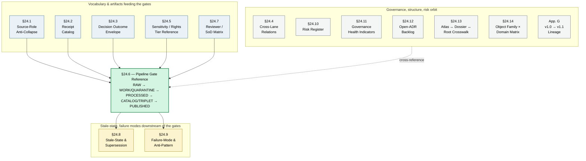

<!-- [KFM_META_BLOCK_V2]
doc_id: kfm://doc/atlas-v1-1-chapter-extracts-readme
title: Atlas v1.1 — Chapter 24 Extracts (subfolder README)
type: standard
version: v1
status: draft
owners: OWNER_TBD  # NEEDS VERIFICATION: docs steward + atlas editors
created: 2026-05-25
updated: 2026-05-25
policy_label: public
related:
  - kfm://doc/atlas-v1-1                                    # PROPOSED: docs/atlases/KFM_Domains_Culmination_Atlas_v1_1.pdf
  - kfm://doc/atlas-v1-0                                    # PROPOSED: docs/atlases/KFM_Domains_Culmination_Atlas_v1_0.pdf
  - kfm://doc/directory-rules                               # CONFIRMED: docs/doctrine/directory-rules.md
  - kfm://doc/encyclopedia                                  # CONFIRMED: docs/encyclopedia/
  - kfm://doc/atlas-v1-1-ch24-5-sensitivity-tier-reference  # CONFIRMED authored (prior session)
  - kfm://doc/atlas-v1-1-ch24-6-pipeline-gate-reference     # CONFIRMED authored (prior session)
  - kfm://adr/ADR-S-02                                      # PROPOSED: Doctrine artifact placement under docs/
  - kfm://adr/atlas-chapter-split-layout                    # PROPOSED candidate: paired ADR for this subfolder pattern
tags: [kfm, atlas, readme, directory, governance, doctrine, navigation]
notes:
  - This README orients readers to a PROPOSED chapter-split layout for Atlas v1.1 Chapter 24.
  - Subfolder pattern is open per OPEN-ENC-02 / OPEN-TIER-02 / OPEN-GATE-02; an accepted ADR is required before treating this layout as canonical.
  - The Atlas v1.1 PDF remains authoritative for all §24.X content regardless of the Markdown extracts in this folder.
[/KFM_META_BLOCK_V2] -->

# Atlas v1.1 — Chapter 24 Extracts

<!-- [doc: kfm://doc/atlas-v1-1-chapter-extracts-readme] -->
<a id="top"></a>

> Markdown chapter-extracts of **Atlas v1.1 Chapter 24 — Extended Master Atlases**, organized as one reviewable file per §24.X section so that diffs, link granularity, and per-chapter ownership become tractable. **The Atlas v1.1 PDF remains authoritative.** This folder is a navigation aid, not a replacement.

<p>
  
  
  
  
  
  
  
</p>

> [!IMPORTANT]
> **Truth posture.** This subfolder is itself a **PROPOSED layout**. Whether atlas chapters should live as a chapter-split Markdown set under `docs/atlases/master-atlas-v1.1/` — or as a single rendered PDF, or as a flat sibling-set in `docs/atlases/`, or as some other shape — is an open ADR question that **parallels OPEN-ENC-02** (encyclopedia chapter-split). Until that ADR is accepted, treat the files in this folder as **working extracts**, not canonical artifacts.

> [!NOTE]
> **Anti-collapse rule (inherited from Atlas v1.1 front matter).** Nothing here — not the chapter extracts, not this README, not the inventory table below — substitutes for `EvidenceBundle`, `PolicyDecision`, `ReviewRecord`, source authority, or release state. The chapter extracts are navigation aids over an authoritative PDF, not authority in their own right.

---

## Contents

1. [Scope](#1-scope)
2. [Repo fit](#2-repo-fit)
3. [Accepted inputs](#3-accepted-inputs)
4. [Exclusions](#4-exclusions)
5. [Chapter inventory](#5-chapter-inventory)
6. [Chapter relationships](#6-chapter-relationships)
7. [Authoring conventions](#7-authoring-conventions)
8. [Quickstart — adding a new chapter extract](#8-quickstart--adding-a-new-chapter-extract)
9. [Maintenance task list](#9-maintenance-task-list)
10. [FAQ](#10-faq)
11. [Open questions & ADR cross-reference](#11-open-questions--adr-cross-reference)
12. [Evidence basis & citations](#12-evidence-basis--citations)

---

## 1. Scope

This folder hosts **one Markdown file per §24.X section** of Atlas v1.1 Chapter 24 — Extended Master Atlases, plus one file for Appendix G (the v1.0 → v1.1 lineage and supersession record).

The goal is **reviewability and diff-friendliness**: a corrected sensitivity-tier row, a new failure reason code, or a renamed receipt class can be diffed at the file level rather than against a 1,000-page PDF. Cross-references between chapters become hyperlinks; ownership becomes per-file; supersession becomes a git history rather than a marginal annotation.

The folder does **not** redefine Atlas authority. The PDF at `../KFM_Domains_Culmination_Atlas_v1_1.pdf` (PROPOSED location, NEEDS VERIFICATION) remains the authoritative artifact. Where this folder and the PDF disagree, the PDF wins **until** an ADR records the change and the supersession appendix is updated.

[↑ back to top](#top)

---

## 2. Repo fit

```text
docs/
└── atlases/                                # canonical atlas lane (Directory Rules §6.1, ADR-S-02)
    ├── KFM_Domains_Culmination_Atlas_v1_1.pdf   # PROPOSED — authoritative Atlas v1.1 artifact
    ├── KFM_Domains_Culmination_Atlas_v1_0.pdf   # PROPOSED — v1.0 retained verbatim per supersession-by-extension
    └── master-atlas-v1.1/                  # THIS FOLDER — PROPOSED chapter-split layout
        ├── README.md                       # THIS FILE
        ├── 24.5-sensitivity-tier-reference.md  # ✅ authored
        ├── 24.6-pipeline-gate-reference.md     # ✅ authored
        └── …                               # ⏳ remaining chapters listed below
```

**Upstream authorities.**

| Upstream | Relationship |
|:---|:---|
| `docs/atlases/KFM_Domains_Culmination_Atlas_v1_1.pdf` | Authoritative source for every chapter extracted here. |
| `docs/atlases/KFM_Domains_Culmination_Atlas_v1_0.pdf` | Provides v1.0 chapters that v1.1 extends; per-domain `H. Pipeline shape` and §20.5 Deny-by-Default Register are upstream anchors for §24.5 / §24.6. |
| `docs/doctrine/directory-rules.md` | Places `docs/atlases/` as canonical lane; governs the placement of doctrine artifacts. |
| `docs/doctrine/lifecycle-law.md` | Operates the `RAW → … → PUBLISHED` invariant cited by §24.6. |

**Downstream consumers.**

| Downstream | Relationship |
|:---|:---|
| `docs/encyclopedia/` | References Atlas chapters in its master-domain crosswalks (`§5`, `§7`); should link to chapter files here once layout is accepted. |
| `docs/registers/DRIFT_REGISTER.md` | Receives drift entries when chapter content here diverges from the PDF, from v1.0, or from per-domain `M.` sections. |
| `docs/adr/` | Each chapter file logs open questions that feed the ADR backlog (Atlas v1.1 §24.12). |
| `policy/sensitivity/<domain>/`, `policy/promotion/`, `policy/release/` | Enforce the rules these chapters describe; chapter files are read-only references, not authority. |

[↑ back to top](#top)

---

## 3. Accepted inputs

Files that belong in this folder:

- **One Markdown chapter file per §24.X section** of Atlas v1.1 Chapter 24, following the naming and template conventions in §7.
- **One Markdown file for Appendix G** (v1.0 → v1.1 lineage and supersession record), using the same template.
- **This README** (`README.md`).
- **Static diagrams** as `.mmd`, `.svg`, or `.png` siblings, if a chapter needs a separately-versioned diagram — placed in a `figures/` sub-folder per chapter (e.g., `24.6/figures/pipeline-spine.mmd`).

[↑ back to top](#top)

---

## 4. Exclusions

Files that do **not** belong in this folder and where they should live instead:

| ❌ Do not put here | ✅ Belongs in |
|:---|:---|
| The Atlas v1.1 PDF itself | `docs/atlases/KFM_Domains_Culmination_Atlas_v1_1.pdf` (parent folder) |
| Atlas v1.0 chapter extracts | Out of scope until separately ADR-decided; for v1.0 the PDF is the body of record |
| Per-domain dossiers (Hydrology, Fauna, etc.) | `docs/domains/<domain>/` |
| Encyclopedia chapters | `docs/encyclopedia/chapters/` (subject to OPEN-ENC-02) |
| Standards profiles (PROV, PMTILES, OGC API Tiles, etc.) | `docs/standards/` |
| Runbooks | `docs/runbooks/` |
| ADRs | `docs/adr/` |
| Machine schemas | `schemas/contracts/v1/...` |
| Policy bundles (Rego, etc.) | `policy/` |
| Drift entries | `docs/registers/DRIFT_REGISTER.md` |
| Pass-card registers (Pass 10, 23, 32 indexes) | `docs/atlases/` parent or `docs/registers/`, per ADR |

> [!WARNING]
> **Do not put schema, policy, contract, or release artifacts here.** This folder explains the chapters; it has no authority over machine artifacts. A chapter extract that contradicts a `schemas/contracts/v1/` shape or a `policy/` bundle must be **reconciled toward the machine artifact** via drift entry and ADR — never the other way around.

[↑ back to top](#top)

---

## 5. Chapter inventory

Atlas v1.1 Chapter 24 has **fourteen extended-master-atlas sections** plus an **Appendix G** lineage record. Each row below is a candidate target for a chapter file in this folder.

### 5.1 Authored (✅) and proposed (⏳) status

| § | Chapter title | File | Status | Notes |
|:---|:---|:---|:---:|:---|
| 24.1 | Source-Role Anti-Collapse Register | `24.1-source-role-anti-collapse-register.md` | ⏳ | Defines `observed / regulatory / modeled / aggregate / administrative / candidate / synthetic` roles; gates `ROLE_DOWNCAST_FORBIDDEN`. |
| 24.2 | Master Receipt Catalog | `24.2-receipt-catalog.md` | ⏳ | Defines shape of every artifact named in §24.6 §2; receipt-↔-lifecycle mapping. |
| 24.3 | Decision Outcome Envelope Reference | `24.3-decision-outcome-envelope.md` | ⏳ | Finite `ALLOW / DENY / ABSTAIN / OBLIGATIONS` outcomes for every governed surface. |
| 24.4 | Cross-Lane Relation Atlas (per owning domain) | `24.4-cross-lane-relation-atlas.md` | ⏳ | Domain-cross-reference matrix (Hydrology↔Hazards, Flora↔Habitat, etc.). |
| **24.5** | **Sensitivity / Rights Tier Reference (T0–T4)** | [`24.5-sensitivity-tier-reference.md`](./24.5-sensitivity-tier-reference.md) | ✅ | T0–T4 tier scheme; per-domain matrix; tier transitions with reversibility. |
| **24.6** | **Pipeline Gate Reference (RAW → PUBLISHED)** | [`24.6-pipeline-gate-reference.md`](./24.6-pipeline-gate-reference.md) | ✅ | Seven lifecycle gates; universal closure rules; reason-code catalog. |
| 24.7 | Reviewer Role and Separation-of-Duties Matrix | `24.7-reviewer-sod-matrix.md` | ⏳ | Eight role types; SoD requirements per action. |
| 24.8 | Stale-State and Supersession Reference | `24.8-stale-state-supersession-reference.md` | ⏳ | Stale-state triggers; supersession lineage rules. |
| 24.9 | Failure-Mode and Anti-Pattern Register | `24.9-failure-mode-anti-pattern-register.md` | ⏳ | Placement and authority anti-patterns; cross-domain trust-membrane anti-patterns. |
| 24.10 | Risk Register and Threat Posture | `24.10-risk-register-threat-posture.md` | ⏳ | Domain-level risk register; threat posture per surface. |
| 24.11 | Governance Health Indicators | `24.11-governance-health-indicators.md` | ⏳ | AIReceipt presence rate, ABSTAIN rate, ADR completeness, drift register size, etc. |
| 24.12 | Open-ADR Backlog | `24.12-open-adr-backlog.md` | ⏳ | The ADR-S-01 through ADR-S-15 list — meta-list of all open ADR questions. |
| 24.13 | Atlas ↔ Dossier ↔ Responsibility-Root Crosswalk | `24.13-atlas-dossier-root-crosswalk.md` | ⏳ | Maps Atlas chapters to dossier locations to canonical roots. |
| 24.14 | Object Family × Domain Reference Matrix | `24.14-object-family-domain-matrix.md` | ⏳ | Owner / citing domains / sensitivity default per object family. |
| App. G | v1.0 → v1.1 Lineage and Supersession Record | `appendix-g-lineage-supersession.md` | ⏳ | Supersession-by-extension record; what v1.1 added vs. retained verbatim. |

> [!TIP]
> **Authoring order doesn't have to be numerical.** Author the chapter you need first. The two existing extracts (§24.5 and §24.6) were prioritized because they directly govern publish-time gates and sensitivity transforms.

### 5.2 Status legend

| Symbol | Meaning |
|:---:|:---|
| ✅ | Authored in this folder; linked above. |
| ⏳ | Proposed; not yet authored. Atlas v1.1 PDF remains the only reference. |
| 🚫 | Withdrawn (not currently used). |
| 🔄 | Superseded by a later chapter file (not currently used). |

[↑ back to top](#top)

---

## 6. Chapter relationships

The §24 chapters are not independent: §24.6 (pipeline gates) is the operational center, fed by §24.1 / §24.2 / §24.3 / §24.5 / §24.7 and consumed by §24.8 / §24.9. The remaining chapters orbit as governance, structure, or risk references.



*Solid arrows show artifact / vocabulary flow into the gates. Dotted arrows show cross-references from orbit chapters back to the pipeline.*

[↑ back to top](#top)

---

## 7. Authoring conventions

Every chapter file in this folder follows the same template so that diffs, reviews, and cross-links are predictable.

### 7.1 Filename pattern

```text
<section-number>-<kebab-case-title>.md
```

- `<section-number>` matches the Atlas v1.1 integrated-contents numbering (`24.1`, `24.2`, …, `24.14`). For Appendix G, use `appendix-g`.
- `<kebab-case-title>` is a hyphenated lowercase abbreviation of the chapter title, preserving the chapter's distinguishing term (e.g., `sensitivity-tier-reference`, `pipeline-gate-reference`, `source-role-anti-collapse-register`).
- No spaces, no underscores, no version suffixes.

### 7.2 Document template

Each chapter file SHOULD contain, in order:

1. **KFM Meta Block v2** with `type: standard`, `version: v1`, accurate `doc_id`, `related:` cross-references to sibling chapters, and `tags:` rooted in `[kfm, atlas, …]`.
2. **One H1** — the chapter title without the `§` number prefix.
3. **Epigraph blockquote** — a one-line scope statement of what the chapter governs.
4. **Badge row** — `Status`, `Edition: v1.1`, `Source: Atlas §24.X`, plus chapter-specific truth-posture badges.
5. **Truth-posture callout** (`[!IMPORTANT]`) — what is CONFIRMED, what is PROPOSED, what is NEEDS VERIFICATION.
6. **Scope-note callout** (`[!NOTE]`) — what this chapter is *not* (i.e., not a substitute for the artifacts it names).
7. **Mini TOC.**
8. **Doctrine-origin section** — the chapter's CONFIRMED-doctrine paragraphs from the source, restated.
9. **Substantive chapter content** — tables, transition rules, registers, matrices as the source provides.
10. **Mermaid diagram** when one is evidence-grounded (lifecycle, transitions, relations).
11. **Verification checklist.**
12. **Rollback section.**
13. **Open questions & ADR cross-reference** table (use `OPEN-<CHAPTER>-NN` numbering — e.g., `OPEN-TIER-01`, `OPEN-GATE-03`).
14. **Evidence basis & citations** with `<details>`-wrapped source ledger.
15. **Citation key table** for `[ENCY]`, `[DIRRULES]`, etc.
16. **Footer** — single `<sub>` paragraph reaffirming PDF authority.

### 7.3 Truth-label discipline

- Statements drawn verbatim from the source PDF inherit the source's labels (CONFIRMED doctrine, PROPOSED scheme, etc.).
- Statements added beyond the source (verification checklists, rollback rules, integration tables, reason-code payloads) MUST be labeled — PROPOSED is the default for additions.
- File paths in `related:` and verification checklists default to PROPOSED until mounted-repo presence is verified.

### 7.4 Cross-linking

- Use **relative links** between sibling chapter files (e.g., `[§24.6](./24.6-pipeline-gate-reference.md)`).
- Use **kfm:// URIs** in `related:` meta-block fields for stable referent identity.
- When referencing the PDF, use the relative path `../KFM_Domains_Culmination_Atlas_v1_1.pdf` and **always** name the §24.X section.
- When referencing other docs (encyclopedia, directory rules, ADRs), use repo-relative paths and surface the doc's title in link text.

### 7.5 Anti-collapse footer

Every chapter file MUST end with the **anti-collapse rule** restated:

> Nothing in this register lets summaries, tables, or master-atlas extracts substitute for `EvidenceBundle`, `PolicyDecision`, `ReviewRecord`, source authority, or release state.

This is not boilerplate; it is the operational reminder that the extract is navigation, not authority.

[↑ back to top](#top)

---

## 8. Quickstart — adding a new chapter extract

1. **Confirm the chapter is in scope.** Open `../KFM_Domains_Culmination_Atlas_v1_1.pdf` (or its Markdown twin) and locate the §24.X section you intend to extract.
2. **Reserve the filename.** Use the pattern in §7.1. Add a row to the inventory in §5.1 of this README marking the chapter as **In progress (🛠️)** if you adopt that legend.
3. **Copy a sibling file's structure.** Use either [`24.5-sensitivity-tier-reference.md`](./24.5-sensitivity-tier-reference.md) or [`24.6-pipeline-gate-reference.md`](./24.6-pipeline-gate-reference.md) as a template — they share the same skeleton (§7.2).
4. **Extract the source verbatim where the source is verbatim.** Preserve CONFIRMED-doctrine paragraphs, table column structures, and dossier-shorthand citations (`[ENCY]`, `[DIRRULES]`, etc.).
5. **Surface conflicts and open questions.** Use `OPEN-<CHAPTER>-NN` numbering for chapter-local open questions; cross-reference to the **§24.12 Open-ADR Backlog** for ADR-class items.
6. **Add the standard tail sections.** Verification checklist, Rollback, Open questions, Evidence basis, Citation key, Footer.
7. **Update this README's inventory** in §5.1 — flip the status from `⏳` to `✅` and add the relative link.
8. **Open a PR.** Reviewer chain should include the docs steward and the chapter's named topic owner (e.g., sensitivity reviewer for §24.5, release authority for §24.6).

> [!TIP]
> The fastest path from "I need §24.X" to a working extract is to **copy a sibling file**, replace its body content from the PDF source, and let the template skeleton carry the verification / rollback / open-questions discipline.

[↑ back to top](#top)

---

## 9. Maintenance task list

Gates / definition-of-done for keeping this folder healthy.

- [ ] **Inventory sync.** §5.1 status column reflects actual presence of files in this folder.
- [ ] **PDF authority preserved.** Every chapter file footer restates the PDF-as-authority rule (see §7.5).
- [ ] **Anti-collapse callout present.** Every chapter file's opening callouts include the anti-collapse rule.
- [ ] **Cross-references reciprocal.** When chapter A links to chapter B, chapter B has a corresponding back-link or `related:` entry.
- [ ] **Drift entries logged.** Any divergence between a chapter extract and the PDF (or v1.0 `M.` sections) has an entry in `docs/registers/DRIFT_REGISTER.md`.
- [ ] **Open-question chain unbroken.** Chapter-local `OPEN-<CHAPTER>-NN` items reference the §24.12 Open-ADR Backlog where applicable.
- [ ] **Subfolder-pattern ADR tracked.** OPEN-ENC-02 / OPEN-TIER-02 / OPEN-GATE-02 progress is logged in §11 below.
- [ ] **Supersession on edition bump.** When Atlas v1.2 lands, this folder either renames to `master-atlas-v1.2/` (with `v1.1/` retained for history) or carries a supersession appendix — never silently overwrite.
- [ ] **Per-domain `M.` reconciliation.** Sensitive-row matrices (§24.5 §3, §24.9 anti-patterns) periodically reconciled against per-domain dossiers under `docs/domains/<domain>/`.
- [ ] **Owner roster updated.** Meta-block `owners:` reflects current docs steward and chapter topic owners.

[↑ back to top](#top)

---

## 10. FAQ

<details>
<summary><strong>Why a chapter-split layout at all? Why not just point to the PDF?</strong></summary>

The PDF is the authoritative artifact and will remain so. The chapter split exists for **review granularity** and **diff-friendliness**: a corrected sensitivity-tier row or a renamed receipt class is hard to diff against a 1,000-page PDF and easy to diff against a single Markdown file. The split also enables per-chapter ownership, per-chapter link granularity from the encyclopedia and dossiers, and per-chapter ADR cross-references.

This is the same argument that motivates OPEN-ENC-02 (encyclopedia chapter-split). The two questions are paired and likely deserve a single ADR.
</details>

<details>
<summary><strong>If I see a conflict between a chapter file and the PDF, who wins?</strong></summary>

**The PDF wins**, until an ADR records the change and the supersession appendix is updated. File a drift entry in `docs/registers/DRIFT_REGISTER.md` and open a PR to reconcile the Markdown to the PDF (or, if the Markdown is correct, an ADR + supersession entry to update the PDF in the next edition).
</details>

<details>
<summary><strong>Why are §24.5 and §24.6 authored first?</strong></summary>

They directly govern publish-time behavior: §24.5 names the transforms required for sensitive content; §24.6 names the gates that fail closed when those transforms or their receipts are missing. Authoring them first establishes the template and surfaces the integration questions that other chapters will need to answer.
</details>

<details>
<summary><strong>Can I add a chapter file for Atlas v1.0?</strong></summary>

**Not in this folder.** This folder is scoped to Atlas v1.1 Chapter 24. Atlas v1.0 chapters live in the v1.0 PDF (retained verbatim per supersession-by-extension). If a v1.0 chapter split becomes useful, it should land in a sibling folder (`master-atlas-v1.0/`) under a separate ADR.
</details>

<details>
<summary><strong>What about Pass-card registers, idea indexes, expansion dossiers?</strong></summary>

Out of scope here. Those belong in the parent `docs/atlases/` folder (per Atlas v1.1 Appendix G's scope) or in `docs/registers/`, depending on the ADR outcome. The chapter-split layout is for **Chapter 24 sections only**, not for the broader Atlas / pass-card corpus.
</details>

<details>
<summary><strong>How does this folder interact with <code>docs/encyclopedia/</code>?</strong></summary>

The encyclopedia's §5 (Master Domain Atlas) and §7 (crosswalk) reference Atlas chapters. Once this layout is ADR-accepted, the encyclopedia's references should point to specific chapter files here. Until then, encyclopedia references should point to the Atlas v1.1 PDF and §24.X section by number. See OPEN-ENC-01.
</details>

[↑ back to top](#top)

---

## 11. Open questions & ADR cross-reference

| # | Question | Class | Status / cross-reference |
|:---|:---|:---|:---|
| **OPEN-CHEXT-01** | Should `docs/atlases/master-atlas-v1.1/` be the canonical chapter-split layout for Atlas v1.1 Chapter 24? | ADR-class | **Paired** with OPEN-ENC-02, OPEN-TIER-02, OPEN-GATE-02. Candidate ADR title: *Atlas chapter-split Markdown layout*. |
| **OPEN-CHEXT-02** | Filename pattern — should chapter files use `24.5-…` (Atlas section numbering) or `ch24-5-…` (chapter-scoped) or another scheme? | Naming class | Currently using `24.X-<kebab>.md`. Resolve via per-root README or ADR-S-02 amendment. |
| **OPEN-CHEXT-03** | Should each chapter file be allowed its own `figures/` sibling folder for separately-versioned diagrams, or should diagrams remain inline? | Layout class | §3 currently permits a `figures/` sibling; not yet exercised. |
| **OPEN-CHEXT-04** | When Atlas v1.2 lands, does this folder rename, branch, or supersede? | Lifecycle class | §9 task list mentions this; needs explicit ADR or per-root README decision before v1.2 ships. |
| **OPEN-CHEXT-05** | Who is the canonical **chapter topic owner** for each §24.X file? | Governance class | §24.7 Reviewer / SoD matrix defines role types; assignment per chapter remains TBD. |
| **OPEN-CHEXT-06** | Should the inventory table in §5.1 be machine-readable (YAML / JSON sidecar) to enable automated drift detection? | Tooling class | Currently human-only; tooling question for `tools/atlas_inventory/` if it exists. |

[↑ back to top](#top)

---

## 12. Evidence basis & citations

<details>
<summary><strong>Source ledger</strong></summary>

| Source | Status | Supports | Limits |
|:---|:---|:---|:---|
| Atlas v1.1 front matter (consolidated PDF, pp. 1–5) | CONFIRMED (manuscript) | §1 scope; §2 repo fit; §5 chapter inventory; supersession-by-extension rule. | Manuscript is doctrine; mounted-repo paths NEEDS VERIFICATION. |
| Atlas v1.1 Integrated Contents (PDF, p. 5) | CONFIRMED (manuscript) | §5.1 chapter inventory — all 14 §24.X titles + Appendix G. | Verbatim chapter titles preserved; ordering matches source. |
| Atlas v1.1 §24.6 (PDF, pp. 165–166) | CONFIRMED (manuscript) | §6 chapter-relationships diagram (gate-center model). | Diagram is a synthesis of the §24.6 integration table; not a verbatim figure from source. |
| `directory-rules.md` §6.1, §13.5 | CONFIRMED (prior-session authored) | §2 repo fit; `docs/atlases/` as canonical lane. | Mounted-repo presence remains NEEDS VERIFICATION. |
| `KFM Encyclopedia.md` §15 (OPEN-ENC-02) | CONFIRMED (prior-session authored) | §11 OPEN-CHEXT-01 paired-ADR cross-reference. | Encyclopedia's chapter-split question parallels but does not bind this folder's. |
| `24.5-sensitivity-tier-reference.md` (this folder) | CONFIRMED (prior-session authored) | §5.1 inventory authored status; §6 relationships diagram (sensitivity feeder). | — |
| `24.6-pipeline-gate-reference.md` (this folder) | CONFIRMED (prior-session authored) | §5.1 inventory authored status; §6 relationships diagram (gate center). | — |

</details>

### 12.1 Citation key

The Atlas corpus uses dossier-shorthand citations. They appear inside individual chapter files; this README does not reproduce them:

| Tag | Refers to |
|:---|:---|
| `[ENCY]` | KFM Encyclopedia |
| `[DIRRULES]` | Directory Rules |
| `[GAI]` | Governed AI doctrine |
| `[MAP-MASTER]` | Master MapLibre Components-Functions-Features |
| `[UNIFIED]` | KFM Unified Implementation Architecture Build Manual |

> [!NOTE]
> **Anti-collapse rule (reaffirmed).** This README is a navigation aid for the Markdown chapter extracts, which are themselves navigation aids for the Atlas v1.1 PDF, which is itself a doctrine artifact — not authority for `EvidenceBundle`, `PolicyDecision`, `ReviewRecord`, source authority, or release state. Each layer narrows; none substitutes for the artifacts named within.

[↑ back to top](#top)

---

<sub>Subfolder README for Atlas v1.1 Chapter 24 Markdown extracts. CONFIRMED chapter inventory and authoring conventions; PROPOSED folder layout pending paired ADR (OPEN-ENC-02 / OPEN-TIER-02 / OPEN-GATE-02 / OPEN-CHEXT-01). Authoritative source for all §24.X content remains the Atlas v1.1 PDF at `../KFM_Domains_Culmination_Atlas_v1_1.pdf`.</sub>
