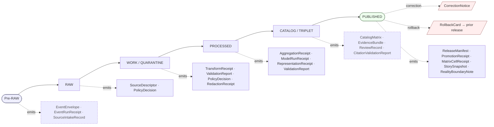

<!-- [KFM_META_BLOCK_V2]
doc_id: kfm://doc/NEEDS-VERIFICATION
title: Receipt Catalog
type: standard
version: v0.1
status: draft
owners: OWNER_TBD
created: 2026-05-25
updated: 2026-05-25
policy_label: public
related:
  - docs/atlases/KFM_Domains_v1_1_plus_Pass23_Pass32_Consolidated_Atlas.md
  - docs/doctrine/directory-rules.md
  - docs/doctrine/lifecycle-law.md
  - docs/doctrine/trust-membrane.md
  - schemas/contracts/v1/receipts/
  - data/receipts/
tags: [kfm, atlas, receipts, doctrine, carrier]
notes:
  - This document is a downstream carrier into Atlas v1.1 §24.2 (Master Receipt Catalog).
  - Atlas v1.1 §24.2 remains the doctrinal anchor; this file is a navigation aid, not authority.
  - Owners, doc_id, and related links remain placeholders pending mounted-repo verification.
  - Receipt schema home is open under ADR-S-03 (PROPOSED).
[/KFM_META_BLOCK_V2] -->

# Receipt Catalog

> **A navigable, carrier-only index of every KFM receipt class — what it pins, when it is emitted, where it lives, and which lifecycle gates depend on it.**
> Authority lives in Atlas v1.1 §24.2; this file routes readers into it.

<p align="center">
  
  
  
  
  
  
</p>

**Quick jump:** [Purpose](#1-purpose-and-role) · [What a receipt is](#2-what-a-receipt-is) · [Catalog](#3-receipt-family-catalog) · [Adjacent families](#4-adjacent-receipt-families-conflicted) · [Lifecycle map](#5-receipt--lifecycle-phase-mapping) · [Homes](#6-storage-homes) · [Closure rules](#7-closure-rules) · [Reason codes](#8-gate-failure-reason-codes) · [ADRs](#10-adr-backlog) · [Verification](#11-verification-checklist)

> [!IMPORTANT]
> **Status:** `PROPOSED file` / `CONFIRMED doctrine` / `UNKNOWN repo implementation depth`
> **Owner:** `OWNER_TBD`
> **Proposed path:** `docs/atlases/receipt-catalog.md`
> **Lane choice:** `docs/atlases/` over `docs/atlas/` — **CONFIRMED at doctrine level** per `directory-rules.md` v1.2 §6.1 and Atlas v1.1 Appendix G; **NEEDS VERIFICATION** that the path itself is currently present in the mounted repo.
> **Truth posture:** *Atlas §24.2 is doctrine.* This file is a carrier. EvidenceBundle and the governing dossiers remain authoritative; this index does not substitute for evidence, policy, review state, source authority, or release state.

> [!NOTE]
> **Evidence boundary.** Receipt **classes**, **purposes**, and **lifecycle-phase mapping** are `CONFIRMED doctrine` (Atlas v1.1 §24.2.1 and §24.2.2). The **required-content field shapes** in every row are `PROPOSED shape` per Atlas v1.1 §24.2.1 itself; an ADR or schema PR is the authoritative resolution. **Repo implementation depth, schema file presence, validator wiring, CI gates, and runtime emission paths remain `UNKNOWN`** — no mounted repo, tests, workflows, manifests, or runtime logs were inspected.

---

## 1. Purpose and role

KFM is governed, evidence-first, map-first, and time-aware. A **receipt** is how that governance becomes inspectable: a structured, persisted record of a specific governed operation, with enough context for audit and rollback.

> **CONFIRMED doctrine (Atlas v1.1 §24.2):** *A receipt is never optional when the operation is consequential; if no receipt exists, the operation did not happen in the governed sense.*

This file is the **navigable carrier** into Atlas v1.1 §24.2 "Master Receipt Catalog." It exists because:

- Atlas v1.0 mentioned receipts across many chapters but did not collect them — Atlas v1.1 §24.2 consolidated the reference. This Markdown file makes that consolidated reference linkable from inside the repo.
- Maintainers need a single page to answer: *"Which receipt does this gate require? Where does it live? What does it pin?"*
- The trust membrane (`RAW → WORK / QUARANTINE → PROCESSED → CATALOG / TRIPLET → PUBLISHED`) closes only when the right receipts exist *and resolve* at each gate. This page enumerates them.

**This file is not authority.** It is a navigation aid. Two non-collapse rules apply:

1. **Atlas registers are navigational aids.** Per Atlas v1.1 front matter, "nothing in v1.1 — not Chapter 24, not the lineage appendix, not this front matter — lets summaries, tables, registers, or master atlases substitute for evidence, policy, review state, source authority, or release state."
2. **Receipts themselves are not sovereign truth.** Receipts pin that gates ran. Catalog matrix, EvidenceBundle, source-role records, review records, and release state still carry the public claim.

---

## 2. What a receipt is

A receipt is **process memory**: durable, hash-bound, and replay-checkable. It proves a gate ran, not just that it was declared.

```text
Receipt {
  receipt_id:     stable_id              # PROPOSED: JCS + SHA-256 over canonical record
  class:          <class enum>           # PROPOSED enum; see §3
  target:         EvidenceRef | object_ref
  inputs:         [EvidenceRef, ...]
  outputs:        [hash, ...]
  spec_hash:      <JCS+SHA-256 over inputs+config>
  actor:          steward_id | tool_id
  policy_ref:     PolicyDecision.id      # where applicable
  evidence_refs:  [EvidenceBundle.id, ...]
  timestamp_utc:  ISO8601
  signature:      DSSE | cosign envelope # PROPOSED
}
```

> **PROPOSED shape — not a schema authority.** The exact serialization, field names, signing posture, and identity convention are open at ADR-S-03 (Receipt schema layout). The shape above is illustrative.

**Non-receipt manifests** (e.g., `CatalogMatrix`, `LayerManifest`, `StyleManifest`, `TileArtifactManifest`, `ReleaseManifest`, `TripletManifest`, `RecompileManifest`) overlap operationally with receipts and are referenced from gates, but they are object-family-distinct from `*Receipt` classes. Atlas v1.1 §24.2 includes a subset of these in the receipt table (notably `ReleaseManifest`) because they are emitted at gate closures.

---

## 3. Receipt family catalog

> **Doctrinal anchor:** Atlas v1.1 §24.2.1 (the table below is the consolidated atlas list; KFM-coined naming and citations are preserved verbatim from the atlas).
> **Truth label posture:** "Purpose" rows are `CONFIRMED doctrine`. "Required content" rows are `PROPOSED shape` per the atlas itself.

| Receipt class | Purpose (`CONFIRMED doctrine`) | Triggered by | Required content (`PROPOSED shape`) |
|---|---|---|---|
| **`SourceDescriptor`** *(anchor, not strictly a receipt)* | Records source identity, rights, role, sensitivity, cadence at admission. Anchors every downstream receipt. | Source admission. | `source_id`, `source_role`, `authority`, `rights`, `sensitivity`, `cadence`, `ingest hash`, `time`, `citation`. |
| **`TransformReceipt`** *(projection / generalization)* | Records a spatial or attribute transform applied to a feature (reprojection, generalization, snap, simplification). | Geometry normalization; projection; generalization. | `input_geom_hash`, `output_geom_hash`, `transform`, `parameters`, `tolerance`, `timestamp`, `actor`. |
| **`RedactionReceipt`** | Records a public-safe transformation that removed, masked, fuzzed, or withheld content for sensitivity, rights, or policy. | Sensitive-domain publication; living-person fields; rare-species occurrences; archaeological coords; infrastructure detail. | `policy_ref`, `redaction_method`, `kept_fields`, `removed_fields`, `geometry_transform`, `reviewer`. |
| **`AggregationReceipt`** | Records an aggregation step (county-year roll-up, decadal mean, watershed total) and pins the geometry scope. | Aggregate publication; matrix cell computation. | `geometry_scope`, `time_scope`, `aggregation_method`, `input_source_refs`, `suppression_rule`, `output_unit`. |
| **`ModelRunReceipt`** | Records a modeled output: model identity, version, inputs, parameters, uncertainty, validation. | Modeled product publication; suitability surface; smoke trajectory; restoration model. | `model_id`, `model_version`, `inputs[]`, `parameters`, `run_time`, `uncertainty_surface_ref`, `validation_ref`. |
| **`RepresentationReceipt`** | Records a representation step where surface fidelity differs from evidence fidelity (3D scene from 2D evidence; synthetic terrain; tile downsampling). | 3D scene publication; tile/PMTiles export; visual-only generalization. | `evidence_ref`, `representation_method`, `parameters`, `reality_boundary_note_ref`. |
| **`AIReceipt`** | Records a governed AI answer: prompt scope, evidence used, policy decision, outcome class, abstention/denial reason. | Any Focus Mode answer; any AI-drafted note or summary. | `prompt_scope`, `evidence_refs[]`, `policy_ref`, `outcome` *(ANSWER \| ABSTAIN \| DENY \| ERROR)*, `reason_code`, `model_id`, `time`. |
| **`ReviewRecord`** | Records a steward, rights-holder, or policy review of a candidate transition: source admission, redaction approval, promotion, release. | Promotion gate; sensitive-lane publication; correction acceptance. | `reviewer`, `role`, `decision` *(ALLOW \| RESTRICT \| DENY \| HOLD)*, `evidence_refs[]`, `policy_ref`, `time`. |
| **`PolicyDecision`** | Records a policy evaluation: which rule, against which object, with which outcome. | Every governed gate; rights / sensitivity / release checks. | `policy_id`, `target_object`, `decision`, `reason_code`, `time`, `evidence_refs[]`. |
| **`ValidationReport`** | Records the outcome of a validator run. | WORK promotion; PROCESSED → CATALOG; release closure. | `validator_id`, `target`, `passes[]`, `failures[]`, `time`, `deterministic_inputs`. |
| **`ReleaseManifest`** | Records the contents, version, signatures, and rollback target for a release. | PUBLISHED transition. | `release_id`, `contents[]`, `digests`, `evidence_refs[]`, `rollback_target`, `time`. |
| **`CorrectionNotice`** | Records that a published claim was corrected: what changed, why, and what derivatives were invalidated. | Post-publication correction. | `claim_ref`, `prior_release_ref`, `change_summary`, `invalidates[]`, `review_ref`, `time`. |
| **`RollbackCard`** | Records a rollback decision and the targeted prior release. | Failed release; correction. | `release_id`, `rollback_to`, `reason`, `invalidates[]`, `review_ref`, `time`. |
| **`RealityBoundaryNote`** | Public- or steward-facing statement that a carrier is synthetic or reconstructed and not direct evidence. | Synthetic surfaces; reconstructed scenes; AI-drafted text. | `scope`, `method_summary`, `evidence_refs[]`, `visibility`. |
| **`MatrixCellReceipt`** | Records the inputs, definitions, geography version, and uncertainty of a single Frontier Matrix cell. | Matrix-cell publication. | `cell_id`, `definition_ref`, `geography_version`, `inputs[]`, `uncertainty`, `review_ref`. |
| **`StorySnapshot` / `ExportReceipt`** | Records the evidence, redactions, and release state at the moment of a story / export / atlas snapshot. | Story or export publication. | `snapshot_id`, `evidence_refs[]`, `redactions[]`, `release_refs[]`, `rollback_target`, `time`. |

---

## 4. Adjacent receipt families (`CONFLICTED`)

> [!WARNING]
> **`CONFLICTED` — adjacent inventories.** The KFM doctrine corpus contains receipt classes **outside** Atlas v1.1 §24.2.1 that are treated as receipts in adjacent governing docs (`kfm_unified_doctrine_synthesis.md` §12; `KFM_Unified_Implementation_Architecture_Build_Manual.md` §7.1). The atlas table above is the *consolidated atlas* list; the doctrine corpus is broader. Reconciliation is `NEEDS VERIFICATION` and belongs in **ADR-S-03** (Receipt schema layout) or a successor.

The following classes appear in adjacent KFM governing docs and are documented here for navigation. **They are not added to the atlas table; they are surfaced separately as a CONFLICTED inventory.**

| Receipt / record class | Appears in | What it pins | Stage | Conflict note |
|---|---|---|---|---|
| **`EventEnvelope`** | Doctrine Synthesis §6; Build Manual §7.1 | A watcher / upload / source-change event before RAW. | Pre-RAW | Not strictly a "receipt"; pre-RAW capture object. |
| **`EventRunReceipt`** | Doctrine Synthesis §12; Build Manual §7.1 | Signed pre-RAW admission receipt for a watcher event. | Pre-RAW | Not collected into Atlas §24.2.1. |
| **`SourceIntakeRecord`** | Doctrine Synthesis §12; Build Manual §7.1 | Admission decision for a new source or idea packet. | Pre-RAW / RAW | Adjacent to `SourceDescriptor` but distinct: descriptor is identity, intake record is the admission decision. |
| **`RunReceipt`** *(generic)* | Doctrine Synthesis §12; Build Manual §7.1 | Pipeline/tool action with inputs, outputs, `spec_hash`, tool versions, timestamp, operator, result. | Any stage | Generic family; the atlas tends to instantiate per-class (`TransformReceipt`, `ModelRunReceipt`, etc.) rather than naming a generic `RunReceipt`. |
| **`CitationValidationReport`** | Doctrine Synthesis §12; Build Manual §7.1 | Claim ↔ citation pass/fail with missing/stale evidence enumeration. | CATALOG / Release / Focus Mode | Distinguished from the general `ValidationReport`; specialized for cite-or-abstain enforcement. |
| **`PromotionReceipt`** | Doctrine Synthesis §12; Build Manual §6.2 / §7.1 | Auditable state-transition record with all promotion gate outcomes (Gates A–G). | Release | Captures the *transition* itself; sibling to `ReleaseManifest` (which captures the released artifact set). |
| **`RecompileManifest`** | Build Manual §7.1 | Deterministic inputs/outputs for recompiled docs / indexes / artifacts. | Control loop | Manifest-class, not receipt-class — included here because doctrine corpus treats it adjacent. |
| **`ProofPack`** | Doctrine Synthesis; Build Manual §6.1 | Release-significant evidence/proof collection. | PROOFS / Release | Bundles other receipts and proofs; not a primitive receipt. |

> **Resolution direction (`PROPOSED`):** Either Atlas §24.2.1 is extended to include the adjacent families (preferred path: amendment to Atlas v1.1 or v1.2 with full lineage), **or** ADR-S-03 explicitly declares which families are receipt-class and which are manifest-class. Until resolved, treat both inventories as live and flag overlap when a new schema or validator is being authored.

---

## 5. Receipt ↔ lifecycle phase mapping

> **Doctrinal anchor:** Atlas v1.1 §24.2.2 (table) and §24.6.1 (lifecycle gates).
> Reading note from the atlas: *a dot means the receipt is normally emitted, amended, or referenced at that phase. Receipts created earlier remain referenced (not duplicated) at later phases via `EvidenceRef`.*

### 5.1 Lifecycle diagram with receipt attachments



> Dashed/grey items are from the **adjacent inventory** in §4 and are not in Atlas §24.2.1 verbatim.

### 5.2 Phase-attachment table

The table below is reproduced from Atlas v1.1 §24.2.2 verbatim. A dot (•) means the receipt is normally emitted, amended, or referenced at that phase.

| Receipt | RAW | WORK / QUARANTINE | PROCESSED | CATALOG / TRIPLET | PUBLISHED |
|---|:---:|:---:|:---:|:---:|:---:|
| `SourceDescriptor` | • | • | • | • | • |
| `TransformReceipt` |  | • | • |  |  |
| `RedactionReceipt` |  | • | • | • |  |
| `AggregationReceipt` |  | • | • | • |  |
| `ModelRunReceipt` |  | • | • | • |  |
| `RepresentationReceipt` |  |  | • | • |  |
| `AIReceipt` *(Focus Mode only)* |  |  |  | • | • |
| `ReviewRecord` |  | • | • | • |  |
| `PolicyDecision` | • | • | • | • | • |
| `ValidationReport` |  | • | • |  |  |
| `ReleaseManifest` |  |  |  | • | • |
| `CorrectionNotice` |  |  |  |  | • |
| `RollbackCard` |  |  |  |  | • |
| `RealityBoundaryNote` |  |  | • | • | • |
| `MatrixCellReceipt` |  |  | • | • |  |
| `StorySnapshot` |  |  |  |  | • |

### 5.3 Gates that require receipts (Atlas v1.1 §24.6.1)

<details>
<summary><b>Lifecycle gates with required receipt artifacts (click to expand)</b></summary>

| Gate (transition) | Pre-condition | Required artifacts (`PROPOSED minimum`) | Failure-closed outcome |
|---|---|---|---|
| **Admission** (— → RAW) | Source identity and rights minimally established; source-role intent set. | `SourceDescriptor`; payload hash or reference. | Not admitted; logged as candidate awaiting steward. |
| **Normalization** (RAW → WORK / QUARANTINE) | Schema, geometry, time, identity, evidence, rights, policy rules runnable. | `TransformReceipt`; `ValidationReport` (working set); `PolicyDecision`; QUARANTINE for failures. | Quarantine with reason; never silently promotes. |
| **Validation** (WORK → PROCESSED) | Validators deterministic and fixture-tied; required receipts present. | `ValidationReport` PASS; `RedactionReceipt` if sensitivity applies; `AggregationReceipt` if applies. | Stay in WORK; structured FAIL outcome. |
| **Catalog closure** (PROCESSED → CATALOG / TRIPLET) | `EvidenceRef`s resolve; catalog matrix and digests close. | `CatalogMatrix` entry; `EvidenceBundle`; graph/triplet projections if applicable. | HOLD at PROCESSED; structured FAIL outcome; no public edge. |
| **Release** (CATALOG / TRIPLET → PUBLISHED) | Review state where required; release authority distinct from author when material. | `ReleaseManifest`; rollback target; correction path; `ReviewRecord` (if required). | HOLD at CATALOG; no public surface change. |
| **Correction** (PUBLISHED → PUBLISHED') | Detected error or new evidence; downstream derivatives identified. | `CorrectionNotice`; `ReviewRecord`; invalidation list; `ReleaseManifest` update or supersession. | Stale-state announcement; no silent edit. |
| **Rollback** (PUBLISHED → prior release) | Failed release or post-publication failure; targeted prior release identified. | `RollbackCard`; `CorrectionNotice`; `ReleaseManifest` reverts; downstream invalidation. | Held at current state until rollback validated. |

</details>

---

## 6. Storage homes

### 6.1 Schema home (`PROPOSED`, ADR-S-03 open)

> **CONFIRMED doctrine** (Atlas v1.1 §24.2): *Each receipt class should be under `schemas/contracts/v1/receipts/` unless an ADR relocates it.*
> **NEEDS VERIFICATION:** actual file presence in the mounted repo.
> **Open ADR:** **ADR-S-03 — Receipt class home** (`schemas/contracts/v1/receipts/` vs. `schemas/contracts/v1/<domain>/receipts/`). A new parallel home or split is ADR-class per `directory-rules.md` §2.4(5).

Proposed shape:

```text
schemas/contracts/v1/
└── receipts/                          # PROPOSED canonical receipt schema home
    ├── source_descriptor.schema.json  # anchor (not strictly a receipt)
    ├── transform_receipt.schema.json
    ├── redaction_receipt.schema.json
    ├── aggregation_receipt.schema.json
    ├── model_run_receipt.schema.json
    ├── representation_receipt.schema.json
    ├── ai_receipt.schema.json
    ├── review_record.schema.json
    ├── policy_decision.schema.json
    ├── validation_report.schema.json
    ├── release_manifest.schema.json
    ├── correction_notice.schema.json
    ├── rollback_card.schema.json
    ├── reality_boundary_note.schema.json
    ├── matrix_cell_receipt.schema.json
    └── story_snapshot.schema.json
```

> **Do not create parallel schema authority** without an ADR. Per `directory-rules.md` §2.4(5), splitting receipts into per-domain schema homes is an ADR-class structural move.

### 6.2 Data home (`CONFIRMED for canonical roots`, paths `PROPOSED`)

> **Source:** `directory-rules.md` §9.1 (canonical roots and lifecycle invariant). Canonical receipt subfamilies are CONFIRMED in the doctrine; full per-file paths inside them remain PROPOSED until mounted-repo inspection.

```text
data/
└── receipts/
    ├── ingest/        # source admission + intake; SourceDescriptor lineage
    ├── validation/    # ValidationReport, CitationValidationReport
    ├── pipeline/      # TransformReceipt, AggregationReceipt, ModelRunReceipt, RepresentationReceipt
    ├── ai/            # AIReceipt
    └── release/       # ReleaseManifest, PromotionReceipt, RollbackCard, CorrectionNotice
```

> [!CAUTION]
> **`artifacts/` is not the home for receipts.** Per `directory-rules.md` §8.2: *"`artifacts/` MUST NOT be the canonical home for: receipts, proofs, evidence bundles, release manifests, promotion decisions, rollback cards, correction notices, catalog records, published layers."* Those belong in `data/receipts/`, `data/proofs/`, `release/`, `data/catalog/`, and `data/published/`.

### 6.3 What this file is **not**

This Markdown is `docs/atlases/receipt-catalog.md`. It is a **navigation carrier**.

- `docs/` explains; it does not own schemas, fixtures, validators, or policies.
- Per `directory-rules.md` v1.2: *"`docs/registry/schema/`, `docs/registry/fixture/`, `docs/registry/validator/`, `docs/registry/policy/`"* drift was flagged as compatibility-as-authority and must be converted to pointer pages. This file follows that pattern: it points to canonical homes; it does not become one.

---

## 7. Closure rules

> **Source:** Atlas v1.1 §24.6.2 (Universal closure rules). `CONFIRMED doctrine`.

A lifecycle transition is **closed** only when **all three** conditions hold:

1. **All required receipts/artifacts exist** for that gate (see §5.3 table).
2. **Every required artifact resolves** — not just references — the artifacts it depends on:
   - `EvidenceRef → EvidenceBundle`
   - `source_id → SourceDescriptor`
   - `model_id → ModelRunReceipt`
   - `policy_ref → PolicyDecision`
3. **The policy gate evaluated and recorded its decision** as a `PolicyDecision`.

> **Missing any of the three means the transition fails closed and the prior state is preserved.**

> [!IMPORTANT]
> **Trust membrane invariant** (Atlas v1.1 §24.6.2; `GAI`, `MAP-MASTER`, `ENCY`):
> *The trust membrane forbids any public client, any normal UI surface, and any released AI surface from reaching RAW, WORK, QUARANTINE, canonical/internal stores, graph internals, vector indexes, source APIs, or direct model runtimes. The gates above are the only routes by which content reaches PUBLISHED, and PUBLISHED is the only state from which the governed API may emit ANSWER.*

---

## 8. Gate failure reason codes

> **Source:** Atlas v1.1 §24.6.3 (`PROPOSED catalog`). Reason-code strings are PROPOSED until canonicalized in a schema or policy bundle.

| Failure family | Reason code (`PROPOSED`) | Gate(s) where it fires | Recovery path |
|---|---|---|---|
| Missing required artifact | `MISSING_RECEIPT`, `MISSING_EVIDENCE`, `MISSING_REVIEW` | Normalization / Validation / Catalog / Release | Re-emit missing receipt; re-run review; re-validate. |
| Schema / contract mismatch | `SCHEMA_MISMATCH`, `CONTRACT_DRIFT` | Normalization / Validation | Schema fix and/or ADR; re-run validator. |
| Rights / sensitivity unresolved | `RIGHTS_UNKNOWN`, `SENSITIVITY_UNRESOLVED` | Admission / Validation / Catalog / Release | Steward review; rights resolution; tier reassignment. |
| Source-role collapse risk | `ROLE_COLLAPSE`, `ROLE_DOWNCAST_FORBIDDEN` | Validation / Catalog / Release | Restore source role; refuse upcast. |
| Review state inadequate | `REVIEW_NEEDED`, `REVIEW_INSUFFICIENT`, `REVIEW_REJECTED` | Catalog / Release | Run required review; supply `ReviewRecord`. |
| Release infrastructure error | `RELEASE_MANIFEST_INVALID`, `ROLLBACK_TARGET_MISSING` | Release | Manifest fix; supply rollback target. |

---

## 9. Cross-references

| Reference | Role | Status |
|---|---|---|
| Atlas v1.1 §24.2 (Master Receipt Catalog) | **Doctrinal anchor for this file.** | `CONFIRMED doctrine` |
| Atlas v1.1 §24.2.1 (Receipt family catalog table) | Primary table source for §3. | `CONFIRMED doctrine` |
| Atlas v1.1 §24.2.2 (Phase mapping) | Primary source for §5.2. | `CONFIRMED doctrine` |
| Atlas v1.1 §24.6 (Master Pipeline Gate Reference) | Source for §5.3 and §7. | `CONFIRMED doctrine` |
| Atlas v1.1 §24.12 (Master Open-ADR Backlog) | Cites ADR-S-03 (receipt schema layout) and ADR-S-11 (story/export receipt policy). | `CONFIRMED doctrine` |
| `kfm_unified_doctrine_synthesis.md` §12 (Receipt taxonomy) | Source of adjacent inventory in §4 (`CONFLICTED`). | `CONFIRMED corpus presence` |
| `KFM_Unified_Implementation_Architecture_Build_Manual.md` §7.1 (Object map) | Source of adjacent inventory in §4 (`CONFLICTED`). | `CONFIRMED corpus presence` |
| `directory-rules.md` §6.1 | `docs/atlases/` is the canonical home (over `docs/atlas/`). | `CONFIRMED at commit b6a279…` |
| `directory-rules.md` §7.4 | Schema home convention (`schemas/contracts/v1/<…>`). | `CONFIRMED at commit b6a279…` |
| `directory-rules.md` §8.2 | `artifacts/` is not the home for receipts. | `CONFIRMED at commit b6a279…` |
| `directory-rules.md` §9.1 | Canonical `data/receipts/` substructure. | `CONFIRMED at commit b6a279…` |
| `directory-rules.md` §2.4(5) | Parallel authority / schema-home splits are ADR-class. | `CONFIRMED at commit b6a279…` |

---

## 10. ADR backlog

The receipt system has two named open ADRs in Atlas v1.1 §24.12, and one cross-cutting one. None blocks day-to-day placement decisions; all are noted for traceability.

| ADR | Title (`PROPOSED`) | Why ADR-class | Status |
|---|---|---|---|
| **ADR-S-03** | Receipt schema layout (`schemas/contracts/v1/receipts/` vs. per-domain split) | New parallel home or split is ADR-class per `directory-rules.md` §2.4(5). | Open |
| **ADR-S-11** | Story / export receipt policy | Data/release boundary; touches `directory-rules.md` §9. | Open |
| **ADR-S-* (proposed)** | Reconcile Atlas §24.2.1 inventory with Doctrine Synthesis §12 / Build Manual §7.1 inventory (this file's §4 `CONFLICTED` set). | Inventory drift between doctrinal anchor and adjacent governing docs. | Not yet filed |

---

## 11. Verification checklist

- [ ] Confirm the target path `docs/atlases/receipt-catalog.md` does not already exist; resolve naming collision if `docs/atlas/` mirror is still present.
- [ ] Confirm filename convention vs. neighboring atlas Markdown (e.g., `docs/atlases/KFM_Domains_v1_1_plus_Pass23_Pass32_Consolidated_Atlas.md` uses underscores+UpperCase; this file uses hyphens+lowercase). Decide by docs-steward rule, ADR, or migration note.
- [ ] Confirm owner (`OWNER_TBD`) — docs steward + receipts/contracts subsystem owner.
- [ ] Confirm `doc_id` allocation convention (`kfm://doc/<uuid>`) and assign a real id; do not invent.
- [ ] Confirm adjacent docs that should link to this file: `docs/doctrine/lifecycle-law.md`, `docs/doctrine/trust-membrane.md`, `docs/standards/PROV.md`, any `docs/runbooks/**/SOURCE_REFRESH_RUNBOOK.md`.
- [ ] Confirm `schemas/contracts/v1/receipts/` presence and that file names match (or update §6.1 to PROPOSED paths after inspection).
- [ ] Confirm `data/receipts/{ingest,validation,pipeline,ai,release}/` substructure exists per `directory-rules.md` §9.1.
- [ ] Confirm that the `CONFLICTED` adjacent inventory in §4 has either (a) an open ADR draft, or (b) an Atlas v1.2 amendment plan, or (c) a `docs/registers/DRIFT_REGISTER.md` entry.
- [ ] Confirm no validator, runbook, or policy text claims this Markdown as authoritative; it must remain a carrier.
- [ ] Run `Diagram syntactic check`: the Mermaid block in §5.1 renders on GitHub.
- [ ] Confirm all `PROPOSED shape` rows in §3 match the canonical schemas once those schemas exist; update or open ADR-S-03 if names diverge.

---

## 12. Rollback / supersession

| Condition | Action |
|---|---|
| Atlas v1.1 §24.2.1 inventory changes (Atlas v1.2 or successor amends rows) | Update §3 in lock-step; preserve §4 only for adjacent inventory still genuinely outside the atlas list. |
| `directory-rules.md` re-homes receipts (e.g., per-domain split via ADR-S-03 accepted) | Update §6.1 immediately; mark previous PROPOSED home as `SUPERSEDED`. |
| `directory-rules.md` re-homes atlas Markdown (`docs/atlases/` → other) | Move file; preserve anchor IDs; add lineage note to KFM Meta Block v2. |
| This file is found to drift from atlas wording on `CONFIRMED doctrine` rows | Restore atlas wording verbatim; the atlas wins. |
| This file is found to overclaim implementation (e.g., asserts validator wiring without repo evidence) | Demote claim to `PROPOSED` / `UNKNOWN`; never resolve drift by lowering the truth label. |

**Rollback target:** `ROLLBACK_TARGET_TBD` (PROPOSED: prior commit ref of this file as recorded in `release/manifests/`).

---

## 13. Source ledger

| Source | Status | Supports | Limits |
|---|---|---|---|
| Atlas v1.1 §24.2 *(Master Receipt Catalog)* | `CONFIRMED doctrine` | §3 catalog rows; §5.2 phase mapping; §7 closure rules. | Does not prove repo implementation; field shapes are `PROPOSED` per the atlas itself. |
| Atlas v1.1 §24.6 *(Master Pipeline Gate Reference)* | `CONFIRMED doctrine` | §5.3 gate-attachment table; §7 closure rules; §8 failure reason codes. | Reason-code strings labeled `PROPOSED` in the atlas. |
| Atlas v1.1 §24.12 *(Master Open-ADR Backlog)* | `CONFIRMED doctrine` | §10 ADR-S-03, ADR-S-11 references. | Backlog; not a decision. |
| `kfm_unified_doctrine_synthesis.md` §12 *(Receipt taxonomy)* | `CONFIRMED corpus presence` | §4 adjacent inventory rows (`EventRunReceipt`, `SourceIntakeRecord`, `RunReceipt`, `CitationValidationReport`, `PromotionReceipt`). | Doctrine synthesis is itself a cross-document synthesis; not a schema authority. |
| `KFM_Unified_Implementation_Architecture_Build_Manual.md` §7.1 *(Object map)* | `CONFIRMED corpus presence` | §4 adjacent inventory rows; manifest-class objects referenced in §2. | Build manual is `CONFIRMED doctrine / PROPOSED implementation`. |
| `directory-rules.md` v1.2/v1.3 | `CONFIRMED at commit b6a279…` for v1.2 placement; v1.3 renderer-decision claims are scoped out of this file. | §6.1 schema home; §6.2 data home; §6.3 `docs/` is not authority; §10 ADR cross-refs. | Path-level claims for new files (this one) remain PROPOSED until mounted-repo inspection. |

> **Memory is not evidence.** Every consequential claim in this file is traceable to one of the sources above, an Atlas table reproduced verbatim, or an explicit `PROPOSED` / `NEEDS VERIFICATION` placeholder.

---

<p align="right"><a href="#receipt-catalog">↑ Back to top</a></p>
