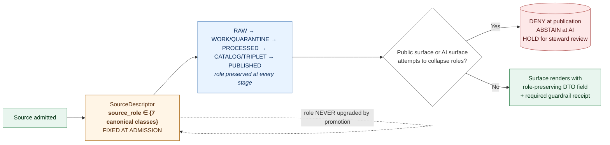

<!-- [KFM_META_BLOCK_V2]
doc_id: kfm://doc/PATH_TBD_AFTER_REPO_INSPECTION
title: Source-Role Anti-Collapse Register (Atlas v1.1 §24.1 register extract)
type: standard
version: v1
status: draft
owners: OWNER_TBD (docs steward; source steward; sensitivity reviewer)
created: 2026-05-25
updated: 2026-05-25
policy_label: public
related:
  - docs/atlases/KFM_Domains_v1_1_plus_Pass23_Pass32_Consolidated_Atlas.md
  - docs/atlases/KFM_Domains_Culmination_Atlas_v1_1.pdf
  - docs/atlases/stale-state-reference.md
  - docs/atlases/decision-outcome-envelope.md
  - docs/atlases/master-api-surface.md
  - docs/adr/ADR-S-04-source-role-vocabulary-v1.md
  - docs/adr/ADR-0001-schema-home.md
  - docs/registers/DRIFT_REGISTER.md
  - docs/registers/VERIFICATION_BACKLOG.md
  - contracts/source/source_descriptor.md
  - schemas/contracts/v1/source/source_descriptor.schema.json
  - policy/
  - tests/policy/source_role/
  - fixtures/source_role/
  - tools/validators/
  - docs/doctrine/ai-build-operating-contract.md
  - docs/doctrine/directory-rules.md
tags: [kfm, atlas, register, source-role, anti-collapse, policy, opa, conftest, validator]
notes:
  - "Authority basis: faithful extraction of Atlas v1.1 §24.1. Atlas v1.1 explicitly states Chapter 24 tables are NAVIGATIONAL, not authoritative."
  - "EvidenceBundle, source dossiers, and schemas under schemas/contracts/v1/... remain the canonical sources for any specific claim (Atlas v1.1 Ch. 24 preamble)."
  - "Source-role vocabulary v1 (7 canonical classes) is doctrine-CONFIRMED; ADR-S-04 governs evolution."
  - "Implementation depth (validator wiring, policy packages, contract/schema authoring) is PROPOSED throughout and requires mounted-repo verification."
  - "Owner, doc_id, exact ADR filenames are placeholders pending mounted-repo inspection and ADR acceptance."
[/KFM_META_BLOCK_V2] -->

# Source-Role Anti-Collapse Register

> **A navigational extract of Atlas v1.1 §24.1.** KFM treats `source_role` as a first-class identity attribute. Observed readings, regulatory determinations, modeled estimates, aggregate publications, administrative compilations, candidate records, and synthetic content are seven distinct channels that never collapse into each other. The lifecycle and the governed API both fail closed when they do.

> [!IMPORTANT]
> **Status:** `draft`.
> **Authority:** Navigational extract. `CONFIRMED` doctrine for the §24.1 register body (extracted faithfully). Implementation surface is `PROPOSED` throughout. `EvidenceBundle`, source dossiers, and `schemas/contracts/v1/…` remain canonical for any specific claim *(Atlas v1.1 Ch. 24 preamble)*.
> **Truth posture:** `CONFIRMED` doctrine framing (role-as-identity, seven canonical classes, role immutability, seven DENY conditions) / `PROPOSED` field names, schema paths, policy packages, validator wiring / `NEEDS VERIFICATION` mounted-repo presence of every contract, schema, policy, validator, and ADR named below / `UNKNOWN` repo implementation depth.
> **Open ADR:** [`ADR-S-04`](../adr/ADR-S-04-source-role-vocabulary-v1.md) — Source-role vocabulary v1 and evolution rule.
> **Owner:** `OWNER_TBD`.

**Quick jumps:** [Purpose](#1-purpose-and-doctrine-framing) · [Canonical source-role classes](#2-canonical-source-role-classes-§2411) · [Role immutability](#3-role-immutability) · [Anti-collapse failure modes](#4-anti-collapse-failure-modes-deny-conditions-§2412) · [Roles to descriptor fields](#5-roles-to-source-descriptor-fields-§2413) · [Per-domain risk map](#6-per-domain-risk-map) · [Enforcement surfaces](#7-enforcement-surfaces) · [Validators required](#8-validators-required) · [Implementation surface](#9-implementation-surface-proposed) · [Cross-references](#10-cross-references) · [Verification checklist](#11-verification-checklist) · [Open questions](#12-open-questions-and-verification-backlog)

---

## 1. Purpose and doctrine framing

`CONFIRMED doctrine — KFM treats source role as a first-class identity attribute. An observed reading is not interchangeable with a modeled estimate; a regulatory determination is not interchangeable with an administrative compilation; an aggregate publication is not interchangeable with candidate evidence; synthetic content is never the same thing as observed reality. The lifecycle and the governed API both fail closed when these roles are conflated.` *(Atlas v1.1 §24.1 preamble.)*

`CONFIRMED doctrine — this register consolidates v1.0 §20.4 (the validator-catalogue row "Source-role anti-collapse") and the v1.0 §23.3 figure-to-generate ("a diagram showing observed, regulatory, modeled, aggregate, administrative, candidate, and synthetic records as separate source-role channels"). No v1.0 row is overwritten.` *(Atlas v1.1 "What is new in v1.1" Ch. 24.1 row.)*

`CONFIRMED non-collapse rule — Chapter 24 master tables are navigational, not authoritative. EvidenceBundle, the source dossiers, and the schemas/contracts under schemas/contracts/v1/... (per Directory Rules §7.4 / ADR-0001) remain the canonical sources for any specific claim.` *(Atlas v1.1 Ch. 24 preamble.)* This standalone extract inherits the same non-collapse rule: the tables below are inspectable references, not stand-ins for `SourceDescriptor`, policy, or schema authority.

### 1.1 The seven canonical role classes

| # | Class | One-line role *(orientation only — full definition in §2)* |
|---|---|---|
| 1 | `Observed` | A direct reading, measurement, or first-hand evidentiary record tied to a place and time. |
| 2 | `Regulatory` | An authoritative determination by a regulatory or governing body with legal or administrative force. |
| 3 | `Modeled` | A derived product from inputs, assumptions, or fitted parameters. |
| 4 | `Aggregate` | A published summary, total, or average over a unit — irreversible loss of individual record fidelity. |
| 5 | `Administrative` | A compiled record produced by an agency for administration, registration, or accounting purposes. |
| 6 | `Candidate` | A proposed record awaiting validation, evidence resolution, deduplication, or steward review. |
| 7 | `Synthetic` | Content generated by simulation, reconstruction, AI, or interpolation — no first-hand observation. |

### 1.2 What this register is for

- For a **source steward**: a checklist for assigning `source_role` at admission; the immutability rule (§3); the canonical vocabulary that ADR-S-04 will lock down.
- For a **release reviewer**: the seven DENY conditions (§4) and the required guardrails for each.
- For a **validator author**: the test family obligations (§8) cross-referenced to Atlas v1.0 §20.4.
- For a **policy author**: the package layout proposed in §7 and §9.3 — enforcement at admission, promotion, release, render, and citation surfaces.
- For an **AI surface steward**: the rule that synthetic content (including AI-drafted text) is class `Synthetic` and never `Observed`, regardless of how confident the generation sounds.
- For a **domain dossier author**: the per-domain risk map (§6) showing which collapse patterns most threaten each domain.

### 1.3 Visualization of the seven channels

> [!NOTE]
> The diagram is the doctrinal shape of Atlas v1.0 §23.3 figure-to-generate. It does not name an implementation. Rendering, UI badge components, and policy wiring for each surface are `PROPOSED` and `NEEDS VERIFICATION`.

[↑ back to top](#top)

---

## 2. Canonical source-role classes (§24.1.1)

`CONFIRMED doctrine — seven canonical classes, with their definitions, typical examples, and allowed downstream roles, exactly as enumerated in Atlas v1.1 §24.1.1.`

| # | Role | Definition *(CONFIRMED doctrine)* | Typical example | Allowed downstream role | Source citation |
|---|---|---|---|---|---|
| 1 | **Observed** | A direct reading, measurement, or first-hand evidentiary record tied to a place and time. | Stream-gauge stage reading; soil pedon description; air-quality monitor sample; ground archaeological observation. | May feed modeled or aggregate products; **never relabeled** as "regulatory" or "administrative". | `[DOM-HYD]` `[DOM-SOIL]` `[DOM-AIR]` `[DOM-ARCH]` |
| 2 | **Regulatory** | An authoritative determination by a regulatory or governing body with legal or administrative force. | NFHL flood-zone designation; air-quality non-attainment ruling; designated critical habitat unit; protected-species listing. | Cite as regulatory context; **never labeled** an "observed" event or a "modeled" estimate. | `[DOM-HYD]` `[DOM-AIR]` `[DOM-FAUNA]` `[DOM-FLORA]` |
| 3 | **Modeled** | A derived product from inputs, assumptions, or fitted parameters; uncertainty and provenance of inputs must be preserved. | Hydrograph reconstruction; smoke trajectory model; suitability raster; population estimation surface; AODRaster. | Cite with model identity, run receipt, and bounds; **never labeled** an observation. | `[DOM-HYD]` `[DOM-AIR]` `[DOM-HAB]` `[DOM-AG]` |
| 4 | **Aggregate** | A published summary, total, or average over a unit (county, year, watershed); irreversible loss of individual record fidelity. | USDA crop county totals; Census tract aggregates; decadal climate normal; resource estimate summary. | Cite with aggregation receipt; **never treated** as a per-place record. | `[DOM-AG]` `[DOM-PEOPLE]` `[DOM-GEOL]` `[DOM-AIR]` |
| 5 | **Administrative** | A compiled record produced by an agency for administration, registration, or accounting purposes — not necessarily an observation or a regulation. | Land office tract book; deed index compilation; county incorporation record; transport facility roster. | Cite as administrative context; **never collapsed** with observation or regulation. | `[DOM-PEOPLE]` `[DOM-SETTLE]` `[DOM-ROADS]` |
| 6 | **Candidate** | A proposed record awaiting validation, evidence resolution, deduplication, or steward review; not yet authoritative. | Quarantined connector output; unresolved person assertion; duplicate site candidate; unmerged crop observation. | May be cited as candidate evidence in **WORK / QUARANTINE**; must **not appear in PUBLISHED** without promotion. | `[ENCY]` `[DOM-PEOPLE]` `[DOM-ARCH]` |
| 7 | **Synthetic** | Content generated by simulation, reconstruction, AI, or interpolation that has no underlying first-hand observation. Includes synthetic surfaces, generated text, AI-drafted notes. | Synthetic terrain surface; reconstructed historical scene; AI-drafted summary of an `EvidenceBundle`. | Carries **Reality Boundary Note** and **Representation Receipt**; must **never be presented or queried** as observed reality. | `[ENCY]` `[MAP-MASTER]` `[UIAI]` `[GAI]` |

> [!IMPORTANT]
> **Source citations** in the rightmost column point to the source dossiers where each role's domain-scoped behavior is detailed (e.g., `[DOM-HYD]` = Hydrology dossier). The full short-name index is in Atlas v1.0 Appendix B; v1.1 introduces no new short names. *(Atlas v1.1 Appendix G G.3.)*

[↑ back to top](#top)

---

## 3. Role immutability

`CONFIRMED doctrine — the role of a source is set at admission (SourceDescriptor) and is preserved through every promotion. Promotion does not upgrade an observation to a regulation, or a model to an aggregate, or a candidate to a verified record — those are separate governed transitions with their own evidence and review requirements.` *(Atlas v1.1 §24.1.1 reading note.)*

This is the single most load-bearing rule in the register, and it has two operational corollaries.

### 3.1 The "fixed at admission" rule

- `source_role` is determined at the moment a source enters the system via `SourceDescriptor`.
- The determination is recorded with the SourceDescriptor and persists for the life of every artifact derived from that source.
- Subsequent promotions through the lifecycle (`RAW → WORK/QUARANTINE → PROCESSED → CATALOG/TRIPLET → PUBLISHED`) **preserve** the role; they do not change it.

### 3.2 The "never edited in-place" rule

`CONFIRMED doctrine — Set at admission. Never edited in-place; corrections must produce a new descriptor and a CorrectionNotice.` *(Atlas v1.1 §24.1.3 row 1 notes.)*

If a `source_role` was assigned incorrectly at admission, the correction path is:

1. Emit a `CorrectionNotice` against the original `SourceDescriptor`.
2. Author a **new** `SourceDescriptor` with the corrected role.
3. Link the new descriptor to the prior via `superseded_by` per Atlas v1.1 §24.8.2 supersession lineage.
4. Invalidate downstream derivatives that depended on the wrong role *(per §6.1 of [`stale-state-reference.md`](./stale-state-reference.md))*.

Editing the existing `SourceDescriptor.source_role` in place is `DENY` at admission and at any review surface.

### 3.3 The "no upgrade" governance counter-rule

`CONFIRMED doctrine — Atlas v1.1 §24.9.3 governance-process anti-patterns row: "Promotion that 'upgrades' a source role (e.g., modeled → observed). Counter-rule: Source role is fixed at admission; never upgraded by promotion."`

| Upgrade pattern | Why forbidden | Required correct path |
|---|---|---|
| Modeled → Observed | Model output is not measurement; relabeling falsifies provenance. | If new observed data exists, admit it as a **new** `Observed` `SourceDescriptor`. |
| Modeled → Aggregate | Aggregation is its own lifecycle event with its own receipt; a model output is not an aggregate publication. | Run a proper aggregation pipeline producing an `Aggregate` source with `AggregationReceipt`. |
| Candidate → Verified record | Promotion is a governed state transition, not a role upgrade. The `Candidate` role denotes pre-validation status; promotion produces a new `Observed` / `Regulatory` / `Modeled` / `Administrative` record. | Run the promotion pipeline; emit the appropriate role-typed descriptor on promotion. |
| Synthetic → Observed | A reconstruction is not an observation, regardless of fidelity. | Maintain `Synthetic` role with `RealityBoundaryNote`; cite observed sources separately. |
| Administrative → Observed | A compilation is not a first-hand reading. | If an observed source underlies the compilation, admit it separately. |

[↑ back to top](#top)

---

## 4. Anti-collapse failure modes (DENY conditions) (§24.1.2)

`CONFIRMED doctrine — seven collapse patterns, each with its most-at-risk domains, denied outcome, and required guardrail, exactly as enumerated in Atlas v1.1 §24.1.2.`

| # | Collapse pattern | Domains most at risk | Denied outcome | Required guardrail | Source citation |
|---|---|---|---|---|---|
| 1 | Modeled product labeled or queried as observed. | Air; Hydrology; Habitat; Agriculture; 3D | `DENY` at publication; `ABSTAIN` at AI surface. | Run receipt + uncertainty surface + role-preserving DTO field. | `[DOM-AIR]` `[DOM-HYD]` `[DOM-HAB]` `[DOM-AG]` `[MAP-MASTER]` |
| 2 | Regulatory zone labeled as an observed flood / event. | Hydrology; Hazards; Air | `DENY` publication of regulatory layer as event evidence. | Separate regulatory-layer and observed-event lanes; banner in UI. | `[DOM-HYD]` `[DOM-HAZ]` `[DOM-AIR]` |
| 3 | Aggregate cited as a per-place truth. | Agriculture; People; Geology; Air | `DENY` join from aggregate cell to single record; `ABSTAIN` at AI. | Aggregation receipt; geometry-scope guard; matrix-cell semantics. | `[DOM-AG]` `[DOM-PEOPLE]` `[DOM-GEOL]` |
| 4 | Administrative compilation cited as observation. | People/Land; Settlements; Roads | `DENY` publication of compilation as observed event timeline. | Source-role tag preserved; named `LifeEvent` / `AdminEvent` types. | `[DOM-PEOPLE]` `[DOM-SETTLE]` `[DOM-ROADS]` |
| 5 | Candidate record exposed on a public surface. | **All** | `DENY` at trust membrane; route to `QUARANTINE`. | Promotion gate; no `PUBLISHED` edge to `WORK` / `QUARANTINE`. | `[ENCY]` `[DIRRULES]` |
| 6 | Synthetic content presented as observed reality. | Planetary/3D; AI; Archaeology; Habitat | `DENY` publication; `HOLD` for steward review; `ABSTAIN` at AI. | Reality Boundary Note; Representation Receipt; UI badge. | `[ENCY]` `[MAP-MASTER]` `[UIAI]` `[DOM-ARCH]` `[DOM-HAB]` |
| 7 | AI text treated as evidence. | All Focus Mode surfaces | `DENY` publication; `ABSTAIN` at Focus Mode; `AIReceipt` mandatory. | Cite-or-abstain rule; `AIReceipt`; release state required. | `[GAI]` `[ENCY]` `[UIAI]` |

> [!WARNING]
> **Collapse pattern 7 (AI text treated as evidence) is the single most common failure mode in AI-mediated systems.** The corpus is unambiguous: AI-drafted text is class `Synthetic` (§24.1.1 row 7), and Synthetic content **must never be presented or queried as observed reality**. A Focus Mode answer that lacks an `AIReceipt` and cite-or-abstain framing collapses class 7 into class 1 (Observed) and `DENY`s at publication.

### 4.1 Outcome vocabulary cross-reference

The collapse outcomes (`DENY` / `ABSTAIN` / `HOLD`) are drawn from the [Decision Outcome Envelope](./decision-outcome-envelope.md) vocabulary *(Atlas v1.1 §24.3)*. The mapping in §4 is exact:

- `DENY` — used at publication and at the trust membrane (collapse patterns 1–6).
- `ABSTAIN` — used at the AI surface and at the citation evaluator (collapse patterns 1, 3, 6, 7).
- `HOLD` — used at steward review when synthetic content is involved (collapse pattern 6).

[↑ back to top](#top)

---

## 5. Roles to source-descriptor fields (§24.1.3)

`PROPOSED schema-home note — source-role is a SourceDescriptor field; the canonical schema home defaults to schemas/contracts/v1/source/source-descriptor.json per Directory Rules §7.4 and ADR-0001, unless an accepted ADR relocates it. NEEDS VERIFICATION: actual file presence and field names are not asserted here.` *(Atlas v1.1 §24.1.3.)*

### 5.1 Illustrative descriptor surface

`PROPOSED descriptor surface — illustrative, not authoritative.` *(Atlas v1.1 §24.1.3 table preamble.)*

| Field | Type / vocabulary | Required? | Notes *(per §24.1.3 + this register)* |
|---|---|---|---|
| `source_role` | `enum: observed \| regulatory \| modeled \| aggregate \| administrative \| candidate \| synthetic` | **MUST** | Set at admission. Never edited in-place; corrections must produce a new descriptor and a `CorrectionNotice` (§3.2). |
| `source_id` | stable identifier | **MUST** | Deterministic identity per `ai-build-operating-contract.md` §10.10. |
| `admitted_at` | ISO-8601 timestamp | **MUST** | Records when the role determination was made. |
| `superseded_by` | `source_id` reference *(nullable)* | **MAY** | Lineage pointer per Atlas v1.1 §24.8.2 supersession row 1. |
| `correction_notice_ref` | `correction_notice_id` reference *(nullable)* | **MUST** when superseded | Required when a prior descriptor is being corrected (§3.2). |
| `cadence` | duration / cadence vocabulary | `MUST` for refreshable sources | Drives stale-state marker 1 *(Atlas v1.1 §24.8.1)*. |
| `rights_status` | rights-vocabulary enum | **MUST** | Drives stale-state marker 7 *(Atlas v1.1 §24.8.1)*. |
| `model_id` | model-identity reference | **MUST** when `source_role = modeled` | Bound to `ModelRunReceipt`; drives stale-state marker 5. |
| `aggregation_unit` | aggregation-unit vocabulary | **MUST** when `source_role = aggregate` | Drives collapse-pattern 3 guardrails (matrix-cell semantics). |
| `reality_boundary_note_ref` | reference to `RealityBoundaryNote` | **MUST** when `source_role = synthetic` | Per §24.1.1 row 7 and §4 row 6 guardrail. |

> [!CAUTION]
> Field names above are `PROPOSED` and `NEEDS VERIFICATION` against the mounted-repo `SourceDescriptor` schema. The corpus is explicit: "actual file presence and field names are not asserted here." Use this table as a target shape, not as a current-implementation snapshot.

### 5.2 Vocabulary stability and ADR-S-04

`CONFIRMED open question — Atlas v1.1 §24.12 OPEN-ADR Backlog row 4 (ADR-S-04): "Source-role enum — canonical vocabulary, evolution rule. Source-role anti-collapse is doctrine-significant; vocabulary stability matters."`

ADR-S-04 governs:

- The exact spelling and casing of the seven enum values.
- The evolution rule (how to add an eighth role, if ever, without breaking existing `SourceDescriptor` records).
- The schema-version-bump policy if the enum is modified.
- The downstream notification path when a vocabulary change is accepted.

Until ADR-S-04 is accepted, the vocabulary is `CONFIRMED doctrinally` (seven classes named in §24.1.1) but `PROPOSED at the enum-syntax level` (lowercase tokens shown above are illustrative).

[↑ back to top](#top)

---

## 6. Per-domain risk map

`CONFIRMED corpus content — Atlas v1.1 §24.1.2 column "Domains most at risk" pairs each collapse pattern with the domains where it most threatens trust posture.` The table below pivots that data: domain × collapse pattern.

| Domain | Highest-risk collapse pattern(s) | Per-domain dossier link *(PROPOSED)* |
|---|---|---|
| **Air / Atmosphere** | 1 (Modeled-as-observed); 2 (Regulatory-as-event); 3 (Aggregate-as-per-place) | `docs/domains/atmosphere/` |
| **Hydrology** | 1 (Modeled-as-observed); 2 (Regulatory-as-event) | `docs/domains/hydrology/` |
| **Habitat** | 1 (Modeled-as-observed); 6 (Synthetic-as-observed) | `docs/domains/habitat/` |
| **Fauna / Flora** | 2 (Regulatory-as-observed event) | `docs/domains/fauna/`, `docs/domains/flora/` |
| **Agriculture** | 1 (Modeled-as-observed); 3 (Aggregate-as-per-place) | `docs/domains/agriculture/` |
| **Hazards** | 2 (Regulatory-as-observed event) | `docs/domains/hazards/` |
| **Geology / Natural Resources** | 3 (Aggregate-as-per-place) | `docs/domains/geology/` |
| **People / Genealogy / DNA / Land** | 3 (Aggregate-as-per-place); 4 (Administrative-as-observation) | `docs/domains/people/` |
| **Settlements / Infrastructure** | 4 (Administrative-as-observation) | `docs/domains/settlements/` |
| **Roads / Rail / Trade Routes** | 4 (Administrative-as-observation) | `docs/domains/roads-rail-trade/` |
| **Archaeology / Cultural Heritage** | 6 (Synthetic-as-observed) | `docs/domains/archaeology/` |
| **Planetary / 3D / Digital Twin** | 6 (Synthetic-as-observed) | `docs/domains/planetary-3d/` |
| **All Focus Mode surfaces** | 7 (AI text as evidence) | `docs/architecture/maplibre-3d.md`, `docs/doctrine/ai-build-operating-contract.md` |
| **All public surfaces** | 5 (Candidate exposed on public surface) | `docs/doctrine/directory-rules.md` §9 (lifecycle invariant) |

> Per-domain dossier paths above are `PROPOSED`. Mounted-repo presence is `NEEDS VERIFICATION`. Domain content lives within the consolidated atlas chapters and/or within `docs/domains/<domain>/` per ADR-S-02 placement decisions.

[↑ back to top](#top)

---

## 7. Enforcement surfaces

`CONFIRMED corpus content — the register's enforcement spans admission, promotion, release, render, citation, validator, and sensitive-domain surfaces.` Each surface has its own canonical home for the enforcing artifact.

| # | Surface | What it enforces *(per Atlas v1.1 §24.1)* | Canonical home for the enforcing artifact *(PROPOSED)* | Outcome on collapse *(per §4)* |
|---|---|---|---|---|
| 1 | **Admission** | `SourceDescriptor.source_role` is set at admission and immutable. | `contracts/source/source_descriptor.md` + `schemas/contracts/v1/source/source_descriptor.schema.json` + `policy/admission/source_role.rego` | Admission `DENY` if role cannot be determined or is ambiguous; admission `DENY` if existing descriptor field is being edited in place. |
| 2 | **Promotion** | Promotion preserves role; never upgrades. | `policy/promotion/source_role.rego` + `tests/policy/source_role/promotion_test.rego` | Promotion `DENY` if proposed transition implies a role upgrade (§3.3 table). |
| 3 | **Release** | `Modeled` not published with observed framing; `Aggregate` not as per-place; `Synthetic` requires Reality Boundary Note; `Candidate` blocked from PUBLISHED. | `policy/release/source_role.rego` *(or)* `policy/promotion/source_role.rego` + `release/` review gates | Release `DENY` / `HOLD` per §4 row matching the violation. |
| 4 | **Render (map / UI)** | Map layers, popups, and Evidence Drawer payloads preserve role labeling; regulatory and observed-event lanes shown as separate banners. | `policy/render/source_role.rego` + MapLibre layer registry guards | Render `DENY` for collapsed presentation (collapse patterns 1, 2, 6 especially). |
| 5 | **Citation (AI / Focus Mode)** | AI surfaces `ABSTAIN` when a query would force role collapse; `DENY` when policy would emit a collapse; `AIReceipt` mandatory; cite-or-abstain rule. | `policy/render/source_role.rego` + `AIReceipt` evaluator + Focus Mode citation evaluator | `ABSTAIN` / `DENY` (collapse pattern 7). |
| 6 | **Validator harness** | Test family "Source-role anti-collapse" — negative case: regulatory/model/aggregate/admin source used as different truth class. | `tools/validators/source_role/` + `tests/policy/source_role/` | Validator outcome `DENY` *(Atlas v1.0 §20.4)*. |
| 7 | **Sensitive-domain interlock** | Sensitive domains default to `DENY` on collapse; `RedactionReceipt` required when release proceeds. | `policy/sensitivity/` + domain dossier J. tables | `DENY`; `RedactionReceipt` required if any release proceeds (especially for archaeology, fauna/flora, people/land). |

`NEEDS VERIFICATION — every policy and validator path above. Field names and package layout may differ from current repo state.`

[↑ back to top](#top)

---

## 8. Validators required

`CONFIRMED — Atlas v1.0 §20.4 names the test family "Source-role anti-collapse" with the canonical negative case ("regulatory/model/aggregate/admin source used as different truth class") and the expected outcome (DENY).` `PROPOSED — the validator table below decomposes that test family into per-collapse-pattern validators.`

| Validator | Negative case *(what it must reject)* | Expected outcome |
|---|---|---|
| **Role-fixed-at-admission validator** | A `SourceDescriptor` whose `source_role` is edited in place after admission. | `DENY` |
| **Role-immutability validator** | A promotion event whose `source_role` differs from the prior `SourceDescriptor` version (without a `CorrectionNotice` + new descriptor). | `DENY` |
| **Modeled-as-observed validator** *(collapse pattern 1)* | A PUBLISHED claim with `source_role = modeled` rendered without uncertainty surface or model-identity citation. | `DENY` at publication / `ABSTAIN` at AI |
| **Regulatory-as-event validator** *(collapse pattern 2)* | A regulatory-zone layer published in the same lane as observed-event evidence without a separating banner. | `DENY` at publication |
| **Aggregate-as-per-place validator** *(collapse pattern 3)* | An API surface that joins an aggregate-cell value to a single-record query without a geometry-scope guard. | `DENY` join / `ABSTAIN` at AI |
| **Administrative-as-observation validator** *(collapse pattern 4)* | An administrative compilation published as an observed event timeline without `AdminEvent` / `LifeEvent` typing. | `DENY` at publication |
| **Candidate-on-public-surface validator** *(collapse pattern 5)* | A `Candidate` `SourceDescriptor` reachable from any PUBLISHED public surface. | `DENY` at trust membrane |
| **Synthetic-as-observed validator** *(collapse pattern 6)* | Synthetic content (terrain, scene, AI-drafted text) rendered without a Reality Boundary Note or Representation Receipt. | `DENY` publication; `HOLD` for review; `ABSTAIN` at AI |
| **AI-text-as-evidence validator** *(collapse pattern 7)* | A Focus Mode answer treated as cited evidence without an `AIReceipt` or without cite-or-abstain framing. | `DENY` publication; `ABSTAIN` at Focus Mode |
| **`source_role` enum-validity validator** | A `SourceDescriptor.source_role` value outside the seven canonical classes. | `FAIL` (schema validation) |
| **`source_role` required-companion-field validator** | A `SourceDescriptor` with `source_role = modeled` missing `model_id`; or `source_role = aggregate` missing `aggregation_unit`; or `source_role = synthetic` missing `reality_boundary_note_ref`. | `FAIL` |

`Validator filenames, exit-code contract, and orchestrator wiring are NEEDS VERIFICATION (see OPEN-DR-07 in directory-rules.md v1.1 §18.b).`

[↑ back to top](#top)

---

## 9. Implementation surface (PROPOSED)

`PROPOSED — every entry below is a design proposal grounded in §24.1 doctrine. Mounted-repo presence is NEEDS VERIFICATION for every row.`

### 9.1 Contracts (`contracts/`)

| Artifact | Path *(PROPOSED)* | Purpose |
|---|---|---|
| `SourceDescriptor` meaning contract | `contracts/source/source_descriptor.md` | The object family carrying `source_role` as a fixed-at-admission field. |
| `RealityBoundaryNote` meaning contract | `contracts/source/reality_boundary_note.md` *(or)* `contracts/correction/reality_boundary_note.md` | Required companion for `source_role = synthetic` (§5.1 row 10). |
| `RepresentationReceipt` meaning contract | `contracts/correction/representation_receipt.md` | Required companion for `source_role = synthetic` (§4 row 6 guardrail). |
| `AggregationReceipt` meaning contract | `contracts/data/aggregation_receipt.md` | Required companion for `source_role = aggregate` (§4 row 3 guardrail). |
| `ModelRunReceipt` meaning contract | `contracts/runtime/model_run_receipt.md` | Required companion for `source_role = modeled` (§4 row 1 guardrail). |
| `RedactionReceipt` meaning contract | `contracts/correction/redaction_receipt.md` | Required when sensitive-domain release proceeds despite collapse risk (§7 row 7). |
| `CorrectionNotice` meaning contract | `contracts/correction/correction_notice.md` | Emitted when correcting an admitted-incorrect `source_role` (§3.2). |

### 9.2 Schemas (`schemas/contracts/v1/…`)

| Schema | Path *(PROPOSED per ADR-0001)* | Purpose |
|---|---|---|
| `SourceDescriptor` JSON Schema | `schemas/contracts/v1/source/source_descriptor.schema.json` | Constrains `source_role` to the seven canonical classes; enforces required-companion-field rules (§5.1). |
| `RealityBoundaryNote` schema | `schemas/contracts/v1/source/reality_boundary_note.schema.json` *(or)* under `correction/` | Per ADR placement decision. |
| `RepresentationReceipt` schema | `schemas/contracts/v1/correction/representation_receipt.schema.json` | — |
| `AggregationReceipt` schema | `schemas/contracts/v1/data/aggregation_receipt.schema.json` | — |
| `ModelRunReceipt` schema | `schemas/contracts/v1/runtime/model_run_receipt.schema.json` | — |
| `RedactionReceipt` schema | `schemas/contracts/v1/correction/redaction_receipt.schema.json` | — |
| `CorrectionNotice` schema | `schemas/contracts/v1/correction/correction_notice.schema.json` | — |

### 9.3 Policy (`policy/`)

`PROPOSED policy packages — exact layout may warrant ADR per Directory Rules §2.4:`

- `policy/admission/source_role.rego` — enforces role-fixed-at-admission and the no-edit-in-place rule (§3.1, §3.2).
- `policy/promotion/source_role.rego` — enforces role immutability through promotion; rejects upgrade attempts (§3.3 table).
- `policy/release/source_role.rego` — enforces §4 DENY conditions at the release queue (patterns 1, 2, 4, 5, 6).
- `policy/render/source_role.rego` — enforces §4 DENY conditions at render and AI-citation surfaces (patterns 3, 6, 7).
- `policy/sensitivity/source_role.rego` — sensitive-domain interlock; integrates with `policy/sensitivity/` family for archaeology, fauna/flora, people/land.

### 9.4 Fixtures (`fixtures/`)

`PROPOSED per directory-rules.md v1.2 §6.6 fixture substructure (valid/ + invalid/):`

- `fixtures/source_role/valid/observed_stream_gauge.json`
- `fixtures/source_role/valid/regulatory_nfhl_zone.json`
- `fixtures/source_role/valid/modeled_hydrograph_reconstruction.json`
- `fixtures/source_role/valid/aggregate_usda_county_totals.json`
- `fixtures/source_role/valid/administrative_tract_book.json`
- `fixtures/source_role/valid/candidate_quarantined_connector.json`
- `fixtures/source_role/valid/synthetic_terrain_surface.json`
- `fixtures/source_role/invalid/modeled_relabeled_observed.json`
- `fixtures/source_role/invalid/regulatory_as_event.json`
- `fixtures/source_role/invalid/aggregate_joined_to_single_record.json`
- `fixtures/source_role/invalid/administrative_as_observation_timeline.json`
- `fixtures/source_role/invalid/candidate_on_published_surface.json`
- `fixtures/source_role/invalid/synthetic_missing_reality_boundary_note.json`
- `fixtures/source_role/invalid/ai_text_without_aireceipt.json`

> Negative fixtures (`invalid/`) are required, not optional, per `directory-rules.md` v1.2 §6.6.

### 9.5 Tests (`tests/policy/source_role/`)

| Test | Purpose |
|---|---|
| `tests/policy/source_role/admission_test.rego` | Asserts admission gate behavior against fixtures (§9.4 valid/invalid). |
| `tests/policy/source_role/promotion_test.rego` | Asserts promotion-time role immutability. |
| `tests/policy/source_role/release_test.rego` | Asserts release-queue DENY for collapse patterns 1, 2, 4, 5, 6. |
| `tests/policy/source_role/render_test.rego` | Asserts render and citation DENY for collapse patterns 3, 6, 7. |
| `tests/policy/source_role/sensitivity_test.rego` | Asserts sensitive-domain interlock (§7 row 7). |

[↑ back to top](#top)

---

## 10. Cross-references

### 10.1 Other `docs/atlases/` register extracts

| Register | Relationship to this register |
|---|---|
| [`docs/atlases/stale-state-reference.md`](./stale-state-reference.md) *(extract of §24.8)* | `SourceDescriptor` is the subject of supersession-lineage row 1 (`Replaced by a newer descriptor; old descriptor retained with superseded_by link`). §3.2 of this register details the in-place-edit prohibition; stale-state markers 1 and 7 surface on `SourceDescriptor` fields. |
| [`docs/atlases/decision-outcome-envelope.md`](./decision-outcome-envelope.md) *(extract of §24.3)* | §4 of this register uses `DENY` / `ABSTAIN` / `HOLD` from the envelope vocabulary. |
| [`docs/atlases/master-api-surface.md`](./master-api-surface.md) *(extract of §20.3)* | The "Source summary resolver" API family (§20.3 row 1) carries `SourceDescriptor` projection and is the public-surface enforcement point for §4 collapse patterns. |

### 10.2 Other Atlas v1.1 Chapter 24 registers

| Register | Relationship to this register |
|---|---|
| Atlas v1.1 §24.2 Master Receipt Catalog | Defines the receipt types (`AggregationReceipt`, `ModelRunReceipt`, `RepresentationReceipt`, `RedactionReceipt`, `CorrectionNotice`, `AIReceipt`) referenced in §4 guardrails and §9.1. |
| Atlas v1.1 §24.5 Sensitivity / Rights Tier Reference | Sensitive-domain interlock (§7 row 7) interacts with the T0–T4 tier scheme; synthetic content in sensitive domains commonly defaults to T4 deny. |
| Atlas v1.1 §24.6 Pipeline Gate Reference (RAW → PUBLISHED) | Admission gate (§7 row 1) and promotion gate (§7 row 2) are the §24.6 stages where this register enforces role immutability. |
| Atlas v1.1 §24.9.2 Trust-membrane anti-patterns | Row "Aggregate cited as per-place observation" is the anti-pattern view of §4 collapse pattern 3. |
| Atlas v1.1 §24.9.3 Governance-process anti-patterns | Row "Promotion that 'upgrades' a source role" is the counter-rule for §3.3. |
| Atlas v1.1 §24.10 Master Risk Register | Row "Source role mislabeling at admission" (High severity) is the risk view; row "Source rights or sovereignty status changes without re-evaluation" (High severity) interacts with stale-state marker 7. |
| Atlas v1.1 §24.11 Governance Health Indicators | The validator coverage and rights-change-response-time indicators bear directly on this register. |

### 10.3 Atlas v1.0 anchors (retained verbatim in v1.1)

- **Atlas v1.0 §20.4 "Master Validator / Test Catalogue" row "Source-role anti-collapse"** — the canonical validator-catalogue entry that this register decomposes in §8.
- **Atlas v1.0 §23.3 figure-to-generate "Source-role anti-collapse diagram"** — the seven roles as separate channels; the §1.3 Mermaid diagram is its doctrinal shape.
- **Atlas v1.0 chs. 3–18 §F (per-domain Cross-lane relations)** — domain-scoped role behavior, consolidated into the per-domain risk map in §6.

### 10.4 Open ADRs

| ADR | Subject | Relationship |
|---|---|---|
| **ADR-S-04** | Source-role vocabulary v1 and evolution rule | Locks the enum syntax for §5.1 row 1 and governs how the seven-class vocabulary may evolve. |
| **ADR-S-02** | Doctrine artifact placement under `docs/` | Justifies this file's placement at `docs/atlases/` rather than `docs/atlas/`. |
| **ADR-0001** | Schema home (`schemas/contracts/v1/...`) | Governs §9.2 schema paths. |
| **ADR-S-14** | Cross-lane join policy | Bears on collapse pattern 3 (Aggregate-as-per-place) cross-lane join risks. |

### 10.5 Doctrinal anchors

- `ai-build-operating-contract.md` §10 invariants (deterministic identity, governed API) — grounds the immutability rule.
- `ai-build-operating-contract.md` §22.2 UI negative states — names `MISSING_EVIDENCE` and `CONFLICTED_SUPPORT` UI states that surface collapse refusals.
- `directory-rules.md` v1.2 §6.6 fixture substructure — grounds §9.4 fixture layout.
- `directory-rules.md` v1.2 §7.4 + ADR-0001 — grounds §9.2 schema home.
- *KFM Repository Structure Guiding Document* — `policy/`, `contracts/`, `schemas/`, `tests/`, `fixtures/`, `tools/` root contracts.

[↑ back to top](#top)

---

## 11. Verification checklist

- [ ] Confirm Atlas v1.1 §24.1 is faithfully reproduced in §2 (seven role classes), §3 (immutability rule), §4 (seven collapse patterns), and §5 (illustrative descriptor surface). No row should be substituted or paraphrased to a meaning change.
- [ ] Confirm `contracts/source/source_descriptor.md` exists and declares `source_role` as fixed-at-admission and immutable through promotion.
- [ ] Confirm `schemas/contracts/v1/source/source_descriptor.schema.json` exists per ADR-0001 schema-home rule and constrains `source_role` to the seven canonical classes named in §2.
- [ ] Confirm the schema enforces required-companion fields (`model_id` for modeled, `aggregation_unit` for aggregate, `reality_boundary_note_ref` for synthetic).
- [ ] Confirm policy packages exist for admission, promotion, release, render, and sensitivity per §9.3 (or that an ADR documents an alternate package layout).
- [ ] Confirm `tests/policy/source_role/` contains the five tests named in §9.5.
- [ ] Confirm `fixtures/source_role/{valid,invalid}/` exists with at least the negative fixtures enumerated in §9.4 invalid/ list.
- [ ] Confirm the validator suite in §8 is wired through the validator orchestrator (per OPEN-DR-07).
- [ ] Confirm `ADR-S-04` is filed under `docs/adr/` (filename per the ADR ledger); resolution status `NEEDS VERIFICATION`.
- [ ] Confirm the per-domain dossier paths in §6 (one per domain) exist or have an ADR-S-02 acceptance for `docs/domains/<domain>/` placement.
- [ ] Confirm the consolidated Atlas Markdown carrier at `docs/atlases/KFM_Domains_v1_1_plus_Pass23_Pass32_Consolidated_Atlas.md` continues to carry §24.1 verbatim; if this standalone extract diverges, file the divergence to `docs/registers/DRIFT_REGISTER.md`.
- [ ] Confirm `RealityBoundaryNote`, `RepresentationReceipt`, `AggregationReceipt`, `ModelRunReceipt`, and `RedactionReceipt` receipt families exist in `data/receipts/` and are named consistently with Atlas v1.1 §24.2 Master Receipt Catalog.

[↑ back to top](#top)

---

## 12. Open questions and verification backlog

### 12.1 ADR-class (require an Architecture Decision Record)

- **`OPEN-ADR-S-04`** — Source-role enum canonical vocabulary and evolution rule. See §5.2.
- **`OPEN-ADR-PROPOSED`** — Whether `policy/source_role/` is a single cross-cutting package or distributed across `policy/{admission,promotion,release,render,sensitivity}/` per §9.3.
- **`OPEN-ADR-PROPOSED`** — Whether `RealityBoundaryNote` lives under `contracts/source/` (companion to `SourceDescriptor`) or under `contracts/correction/` (companion to other receipts). §9.1 lists both as possibilities.
- **`OPEN-ADR-PROPOSED`** — Whether the per-domain risk map in §6 should be maintained here or duplicated in each domain dossier's F. Cross-lane relations section.

### 12.2 Repo-presence (require mounted-repo inspection)

- Every contract, schema, policy, validator, fixture, and receipt path named in §9.
- The exact filename of ADR-S-04 once filed.
- The per-domain dossier paths in §6.
- Whether the §1.3 Mermaid diagram (the Atlas v1.0 §23.3 figure-to-generate) has been rendered as a static asset and where it lives.

### 12.3 Doctrine-stability (route through `docs/registers/DRIFT_REGISTER.md` if divergence is observed)

- Drift between Atlas v1.1 §24.1 and this extract — Atlas v1.1's own conflict rule applies: "Where a Chapter 24 register and a v1.0 section appear to disagree, v1.0 retains authority for the original claim and the conflict is filed to `docs/registers/DRIFT_REGISTER.md` per Directory Rules §2.5." This extract applies the same rule against §24.1: if this extract disagrees with §24.1, §24.1 wins.

### 12.4 Cross-register coherence

- Validator coverage gap: Atlas v1.1 §24.10 row "Source role mislabeling at admission" notes "Validator coverage may not include every role-pair; periodic audit needed." The validator list in §8 should be audited against the seven canonical classes × seven canonical classes role-pair matrix to confirm coverage.
- AI text as evidence (§4 row 7) cross-cuts with [`decision-outcome-envelope.md`](./decision-outcome-envelope.md) `ABSTAIN` requirements and `AIReceipt` mandate; verify these registers remain consistent on cite-or-abstain framing.

[↑ back to top](#top)

---

<strong>Appendix A — Evidence basis (source ledger)</strong>

| Source | Status | Supports | Limits |
|---|---|---|---|
| Atlas v1.1 §24.1 "Master Source-Role Anti-Collapse Register" | `CONFIRMED corpus content` | The doctrine framing (§1), the seven canonical role classes (§2), the immutability reading note (§3), the seven anti-collapse failure modes (§4), and the illustrative descriptor surface (§5). | Atlas-level register; per its own Ch. 24 preamble, navigational not authoritative. |
| Atlas v1.0 §20.4 "Master Validator / Test Catalogue" row "Source-role anti-collapse" | `CONFIRMED corpus content` | The canonical validator test family that §8 decomposes; the canonical negative case ("regulatory/model/aggregate/admin source used as different truth class") and expected outcome (`DENY`). | Validator-catalogue row; not a validator implementation. |
| Atlas v1.0 §23.3 "Source-role anti-collapse diagram" (figure-to-generate) | `CONFIRMED corpus reference` | The §1.3 Mermaid diagram's doctrinal shape (seven roles as separate channels). | Reference to a figure-to-generate; rendering target path `NEEDS VERIFICATION`. |
| Atlas v1.1 §24.9.2 Trust-membrane anti-patterns row "Aggregate cited as per-place observation" | `CONFIRMED corpus content` | Anti-pattern view of §4 collapse pattern 3. | Anti-pattern register; not enforcement authority. |
| Atlas v1.1 §24.9.3 Governance-process anti-patterns row "Promotion that 'upgrades' a source role" | `CONFIRMED corpus content` | The counter-rule for §3.3 (source role is fixed at admission; never upgraded by promotion). | Governance-process counter-rule. |
| Atlas v1.1 §24.10 Master Risk Register row "Source role mislabeling at admission" | `CONFIRMED corpus content` | High-severity risk anchoring the validator-coverage caveat in §12.4. | Planning view; not implementation. |
| Atlas v1.1 §24.12 OPEN-ADR Backlog row 4 (ADR-S-04) | `CONFIRMED open question` | The §5.2 vocabulary-evolution open question. | Names the question; does not resolve. |
| Atlas v1.1 Appendix G G.3 (v1.0 Appendix B short-name index unchanged) | `CONFIRMED edition statement` | The `[DOM-*]` short-name citations in §2 and §4 remain valid. | Short-name index unchanged in v1.1. |
| `kfm_full_atlas_seed_cards.md` — FEATURE "Source-Role Anti-Collapse Register Capability" | `CONFIRMED card content` / `PROPOSED implementation` | Confirms the capability under `POL - Policy, OPA, Conftest, Decisions` category; corroborates the seven collapse patterns by name. | Seed card; not implementation proof. |
| `kfm_unified_doctrine_synthesis.md` §29.2 Trust-membrane anti-patterns row "Aggregate cited as per-place observation" | `CONFIRMED doctrine reference` | Confirms collapse pattern 3 is a trust-membrane anti-pattern across the corpus. | Cross-document doctrine synthesis. |
| `ai-build-operating-contract.md` §22.2 UI negative states (`MISSING_EVIDENCE`, `CONFLICTED_SUPPORT`) | `CONFIRMED doctrine` | Names the UI negative states that surface collapse refusals at public surfaces. | Doctrine, not implementation. |
| `directory-rules.md` v1.2 §6.6 fixture substructure + §7.4 + ADR-0001 | `CONFIRMED doctrine` | Grounds §9.2 schema-home paths and §9.4 fixture layout. | Doctrine, not implementation. |
| *KFM Repository Structure Guiding Document* | `CONFIRMED doctrine` | Grounds §7 enforcement-surface paths and §9 implementation-surface paths. | Doctrine, not implementation. |
| `docs/atlas/source-role-anti-collapse.md` (prior turn, this session) | `CONFIRMED pointer-page status` | The deprecated-lane pointer page that redirects to this canonical-lane file. | Pointer; not authority. |

**Memory is not evidence.** No mounted repo, CI run, workflow, dashboard, or branch state was inspected. Every implementation claim is `PROPOSED` and bounded to doctrine.

<strong>Appendix B — Faithful-extraction note</strong>

This file is a **faithful extraction** of Atlas v1.1 §24.1 into a standalone register form. The §24.1.1 seven-class table (§2 here), the §24.1.1 immutability reading note (§3 here), the §24.1.2 seven-collapse-pattern table (§4 here), and the §24.1.3 illustrative descriptor surface (§5 here) reproduce the §24.1 content without semantic change. Inline column headers and doctrine language are preserved.

**Net additions in this extract beyond §24.1 itself:**

- §1.1 numbered orientation table of the seven classes (re-presentation of §24.1.1 first column for navigability).
- §1.3 Mermaid diagram (the doctrinal shape of Atlas v1.0 §23.3 figure-to-generate, rendered as Mermaid).
- §3.1 explicit "fixed at admission" rule (extracted from the §24.1.1 reading note).
- §3.2 explicit "never edited in-place" rule (extracted from §24.1.3 row 1 "Notes" column).
- §3.3 "no upgrade" governance counter-rule table (synthesizes §24.9.3 row with §24.1.1 reading note).
- §4.1 outcome-vocabulary cross-reference (links §4 outcomes to Atlas v1.1 §24.3 vocabulary).
- §5.2 ADR-S-04 framing (extracted from §24.12 row 4).
- §6 per-domain risk map (pivots §24.1.2 "Domains most at risk" column into a per-domain view).
- §7 enforcement surfaces table (consolidates §24.1.2 "Required guardrail" column across surfaces).
- §8 validators table (decomposes Atlas v1.0 §20.4 test family into per-collapse-pattern validators).
- §9 implementation surface (`PROPOSED` throughout, grounded in `directory-rules.md` v1.2 and `KFM Repository Structure Guiding Document`).
- §10 cross-references.
- §11 verification checklist.
- §12 open questions.

None of the §24.1 content is overwritten or paraphrased to a meaning change. If divergence is observed, §24.1 inside the consolidated atlas wins, and the divergence is filed to `docs/registers/DRIFT_REGISTER.md` per Directory Rules §2.5.

**Reversibility.** Removing this standalone extract leaves §24.1 inside the consolidated atlas unchanged and authoritative. Full reversibility is consistent with the Atlas v1.1 Appendix G "supersession by extension, not by overwrite" pattern.

**Relationship to the prior deprecated-lane pointer.** The pointer page at `docs/atlas/source-role-anti-collapse.md` (authored earlier in this session) redirects readers to this canonical file. When the `docs/atlas/` deprecated lane is retired at the end of its 30-day sunset window, the pointer page is removed and this canonical file remains.

[↑ back to top](#top)
