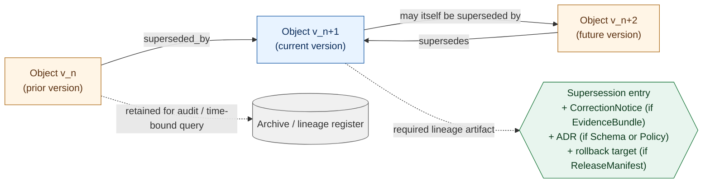

<!-- [KFM_META_BLOCK_V2]
doc_id: kfm://doc/PATH_TBD_AFTER_REPO_INSPECTION
title: Stale-State and Supersession Reference (Atlas v1.1 §24.8 register extract)
type: standard
version: v1
status: draft
owners: OWNER_TBD (docs steward; release/correction steward; sensitivity reviewer)
created: 2026-05-25
updated: 2026-05-25
policy_label: public
related:
  - docs/atlases/KFM_Domains_v1_1_plus_Pass23_Pass32_Consolidated_Atlas.md
  - docs/atlases/KFM_Domains_Culmination_Atlas_v1_1.pdf
  - docs/atlases/source-role-anti-collapse.md
  - docs/atlases/decision-outcome-envelope.md
  - docs/atlases/master-api-surface.md
  - docs/adr/ADR-S-10-stale-state-propagation.md
  - docs/adr/ADR-S-08-frontier-matrix-cell-semantics.md
  - docs/adr/ADR-S-15-atlas-supplement-lifecycle.md
  - docs/registers/DRIFT_REGISTER.md
  - docs/registers/VERIFICATION_BACKLOG.md
  - contracts/source/source_descriptor.md
  - contracts/evidence/evidence_bundle.md
  - contracts/correction/correction_notice.md
  - contracts/release/release_manifest.md
  - contracts/release/rollback_card.md
  - contracts/governance/review_record.md
  - contracts/runtime/ai_receipt.md
  - schemas/contracts/v1/
  - policy/
  - docs/doctrine/ai-build-operating-contract.md
  - docs/doctrine/directory-rules.md
tags: [kfm, atlas, register, stale-state, supersession, lineage, correction, rollback, governance]
notes:
  - "Authority basis: faithful extraction of Atlas v1.1 §24.8. Atlas v1.1 explicitly states Chapter 24 tables are NAVIGATIONAL, not authoritative."
  - "EvidenceBundle, source dossiers, and schemas under schemas/contracts/v1/... remain the canonical sources for any specific claim (Atlas v1.1 Ch. 24 preamble)."
  - "Implementation depth (UI badges, validators, policy packages, schema header syntax) is PROPOSED throughout and requires mounted-repo verification."
  - "ADR-S-10 (stale-state propagation across lanes) remains OPEN per Atlas v1.1 §24.12; this register surfaces but does not resolve it."
  - "Owner, doc_id, exact ADR filenames are placeholders pending mounted-repo inspection and ADR acceptance."
[/KFM_META_BLOCK_V2] -->

# Stale-State and Supersession Reference

> **A navigational extract of Atlas v1.1 §24.8.** KFM separates *stale* (aged past tolerance) from *wrong* (incorrect substance). Both states have visible markers and traceable supersession lineage. This register consolidates those markers and lineage rules into one inspectable file.

> [!IMPORTANT]
> **Status:** `draft`.
> **Authority:** Navigational extract. `CONFIRMED` doctrine for the §24.8 register body (extracted faithfully). Implementation surface is `PROPOSED` throughout. `EvidenceBundle`, source dossiers, and `schemas/contracts/v1/…` remain canonical for any specific claim *(Atlas v1.1 Ch. 24 preamble)*.
> **Truth posture:** `CONFIRMED` doctrine framing (stale vs wrong; 8 markers; 8 supersession object classes; AIReceipt non-retroactivity) / `PROPOSED` UI signals, validator wiring, schema headers, ADR filenames / `NEEDS VERIFICATION` mounted-repo presence of every contract, schema, policy, validator, and ADR named below / `UNKNOWN` repo implementation depth.
> **Open ADR:** [`ADR-S-10`](../adr/ADR-S-10-stale-state-propagation.md) — cross-lane stale-state propagation rules.
> **Owner:** `OWNER_TBD`.

**Quick jumps:** [Purpose](#1-purpose-and-doctrine-framing) · [Stale-state markers](#2-stale-state-markers-§2481) · [Supersession lineage](#3-supersession-lineage-§2482) · [AIReceipt non-retroactivity](#4-aireceipt-non-retroactivity) · [Stale-state on public surfaces](#5-stale-state-on-public-surfaces) · [Correction vs stale](#6-correction-vs-stale-when-to-emit-correctionnotice) · [Cross-lane propagation](#7-cross-lane-propagation-adr-s-10-open) · [Lineage artifacts inventory](#8-lineage-artifacts-inventory) · [Implementation surface](#9-implementation-surface-proposed) · [Validators required](#10-validators-required) · [Cross-references](#11-cross-references) · [Verification checklist](#12-verification-checklist) · [Open questions](#13-open-questions-and-verification-backlog)

---

## 1. Purpose and doctrine framing

`CONFIRMED doctrine — a PUBLISHED claim may become stale long before it is corrected. KFM separates 'stale' from 'wrong': a stale claim is one whose evidence, source freshness, dependent data, or context has aged past its declared tolerance; a wrong claim is one whose substance is incorrect. Both states have visible markers and traceable lifecycles.` *(Atlas v1.1 §24.8 preamble.)*

`CONFIRMED doctrine — this register extends Atlas v1.0 chs. 3–18 (M. Publication, correction, and rollback sections) and v1.0 §22 Appendix E (Supersession and lineage), consolidating their per-domain detail into one cross-domain reference.` *(Atlas v1.1 "What is new in v1.1" Ch. 24.8 row.)*

`CONFIRMED non-collapse rule — Chapter 24 master tables are navigational, not authoritative. EvidenceBundle, the source dossiers, and the schemas/contracts under schemas/contracts/v1/... (per Directory Rules §7.4 / ADR-0001) remain the canonical sources for any specific claim.` *(Atlas v1.1 Ch. 24 preamble.)* This standalone extract inherits the same non-collapse rule: the marker table and lineage table below are inspectable references, not stand-ins for `EvidenceBundle`, `CorrectionNotice`, `ReleaseManifest`, or schema authority.

### 1.1 The two concepts

| Concept | Definition *(Atlas v1.1 §24.8)* | What changes about the claim | What does NOT change |
|---|---|---|---|
| **Stale** | The claim's evidence, source freshness, dependent data, or context has aged past its declared tolerance. | The claim's *currency* — it's still defensible as a historical answer, but its applicability to "now" is in question. | The claim's *substance*. A stale answer was correct when issued; it may still be correct now, but that has to be checked. |
| **Wrong** | The claim's substance is incorrect. | The claim's *truth*. A wrong claim was never defensible or has become so via new evidence. | (Distinct lifecycle — wrong claims trigger `CorrectionNotice`, not merely a stale-state badge.) |

> [!NOTE]
> **A stale claim is not automatically wrong.** Treating "stale" and "wrong" as synonyms collapses a load-bearing distinction in the KFM trust posture. The corpus is explicit: "Both states have visible markers and traceable lifecycles." *(Atlas v1.1 §24.8.)*

### 1.2 What this register is for

- For a **release reviewer**: a checklist of marker conditions to interrogate before approving a release into PUBLISHED, and a lineage table to inspect what supersession artifacts must accompany a replacement.
- For a **correction reviewer**: a rule for when a stale-state badge is sufficient and when a `CorrectionNotice` is required.
- For a **steward**: a navigation aid to the per-domain M. tables and the related Atlas v1.0 Appendix E.
- For an **implementor**: a `PROPOSED` map from each marker to the schema field / receipt / badge / validator surface that would carry it. Implementation maturity is `NEEDS VERIFICATION` for every row.
- For an **AI surface**: the rule that AIReceipts are never retroactively superseded (§4).

[↑ back to top](#top)

---

## 2. Stale-state markers (§24.8.1)

`CONFIRMED doctrine — eight markers, with their triggers, UI signals, and required actions, exactly as enumerated in Atlas v1.1 §24.8.1.` `PROPOSED implementation — the UI signals named below are doctrine names; their concrete badge components, schema fields, and validator wiring are NEEDS VERIFICATION against the mounted repo.`

| # | Marker | Triggered by *(CONFIRMED doctrine)* | UI signal *(CONFIRMED doctrine name)* | Required action *(CONFIRMED doctrine)* |
|---|---|---|---|---|
| 1 | **Source freshness expired** | Cadence in `SourceDescriptor` passed without a new admission. | Stale source badge in Evidence Drawer. | Re-admit or supersede; otherwise mark dependent claims stale. |
| 2 | **Schema version drift** | Object schema upgraded past the published claim's schema version. | Schema-drift badge; show migration ADR if any. | Migrate, re-validate, re-release; or mark stale. |
| 3 | **Geography version drift** | `GeographyVersion` replaced; published claim still bound to prior version. | Geography-version banner with prior-version cite. | Rebind to current `GeographyVersion`; re-release; or mark stale. |
| 4 | **Time-scope outside support** | Claim's temporal scope falls outside current data support window. | Time-out-of-support indicator. | Mark stale; **do not refresh silently**. |
| 5 | **Model version superseded** | `ModelRunReceipt` references an older model than current. | Model-version badge with new model identity. | Re-run; supersede; or mark stale. |
| 6 | **Review aged out** | `ReviewRecord` older than the review-cycle tolerance for the sensitive lane. | Review-aged badge. | Trigger steward review; potentially downgrade tier. |
| 7 | **Rights status changed** | Rights change in `SourceDescriptor` or rights-holder communication. | Rights-changed badge. | Re-evaluate tier; potentially downgrade; emit `CorrectionNotice` if necessary. |
| 8 | **Policy version changed** | Policy referenced by `PolicyDecision` was superseded. | Policy-version badge. | Re-run gate; potentially supersede release. |

> [!WARNING]
> Marker #4 (Time-scope outside support) carries an explicit doctrine prohibition: **"Mark stale; do not refresh silently."** A claim whose temporal scope no longer covers "now" cannot be quietly re-bound to a new temporal window. Doing so would silently change what the claim asserts. The required path is mark-stale (or supersede with a new claim and lineage).

### 2.1 Marker provenance — where each trigger field lives

`PROPOSED — every marker's trigger lives on a specific KFM object family, and the canonical home for that family is the source of truth for whether the marker has fired.`

| Marker | Trigger field *(PROPOSED)* | Trigger object family | Canonical meaning-contract home *(PROPOSED)* | Canonical schema home *(PROPOSED)* |
|---|---|---|---|---|
| 1 Source freshness expired | `cadence`, `last_admission_at` | `SourceDescriptor` | `contracts/source/source_descriptor.md` | `schemas/contracts/v1/source/source_descriptor.schema.json` |
| 2 Schema version drift | `schema_version` (on the claim) vs. registry-current | `Schema` (in `schemas/contracts/v1/…`) | `contracts/` (per family) | `schemas/contracts/v1/<family>/<object>.schema.json` |
| 3 Geography version drift | `geography_version_id` | `GeographyVersion` | `contracts/spatial/geography_version.md` *(PROPOSED)* | `schemas/contracts/v1/spatial/geography_version.schema.json` *(PROPOSED)* |
| 4 Time-scope outside support | `valid_time`, `support_window` | claim DTO + dataset support-window declaration | per-domain `contracts/domains/<domain>/` | per-domain `schemas/contracts/v1/<domain>/` |
| 5 Model version superseded | `model_id` on `ModelRunReceipt` vs. current model | `ModelRunReceipt` | `contracts/runtime/model_run_receipt.md` *(PROPOSED)* | `schemas/contracts/v1/runtime/model_run_receipt.schema.json` *(PROPOSED)* |
| 6 Review aged out | `reviewed_at` on `ReviewRecord` vs. lane review cadence | `ReviewRecord` | `contracts/governance/review_record.md` *(PROPOSED)* | `schemas/contracts/v1/governance/review_record.schema.json` *(PROPOSED)* |
| 7 Rights status changed | `rights_status`, `rights_changed_at` | `SourceDescriptor` (+ rights-holder communication record) | `contracts/source/source_descriptor.md` | `schemas/contracts/v1/source/source_descriptor.schema.json` |
| 8 Policy version changed | `policy_version_id` on `PolicyDecision` vs. current policy | `PolicyDecision` | `contracts/governance/policy_decision.md` *(PROPOSED)* | `schemas/contracts/v1/governance/policy_decision.schema.json` *(PROPOSED)* |

`NEEDS VERIFICATION — every contract and schema path above. Field names are PROPOSED and may differ from current repo state.`

[↑ back to top](#top)

---

## 3. Supersession lineage (§24.8.2)

`CONFIRMED doctrine — eight object classes, each with its supersession rule and required lineage artifact, exactly as enumerated in Atlas v1.1 §24.8.2.` This section *extends* Atlas v1.0 Appendix E (Supersession and lineage); it does not replace it.

| Object class | Supersession rule *(CONFIRMED doctrine)* | Required lineage artifact *(CONFIRMED doctrine)* |
|---|---|---|
| `SourceDescriptor` | Replaced by a newer descriptor; **old descriptor retained** with `superseded_by` link. | Supersession entry in source register. |
| `EvidenceBundle` | Replaced when corrected; **old bundle retained for audit**. | `EvidenceBundle` + `CorrectionNotice` + supersession link. |
| `GeographyVersion` | Replaced by a newer version; **both versions remain queryable** for time-bound claims. | Version register entry + crosswalk. |
| `Schema` *(under `schemas/contracts/v1/…`)* | Replaced via **ADR**; old schema retained. | ADR + supersession link in schema header. |
| `Policy` | Replaced via **accepted ADR**; old policy retained. | ADR + supersession link. |
| `ReleaseManifest` | Replaced by next release; **rollback target remains valid**. | Manifest history + rollback chain. |
| `AIReceipt` | **Never superseded retroactively.** Old answer retained; new answer is a new receipt. | Two distinct `AIReceipts` with cross-reference. |
| `Atlas` / supplement | Superseded by **ADR-recorded** new version; lineage retained. | Atlas / supplement supersession appendix. |

### 3.1 Three universal lineage invariants

`CONFIRMED doctrine — three rules apply to every row above:`

1. **Old artifacts are retained, not deleted.** Every supersession rule preserves the prior version. Removal would break audit trails, time-bound queries, and rollback paths.
2. **Supersession requires an explicit link.** `superseded_by` references (or equivalent) make the lineage chain inspectable. A new version that does not declare its predecessor is silent replacement, not governed supersession.
3. **Schema and Policy supersession requires an ADR.** `Schema` and `Policy` rows are explicit: their lineage runs through an Architecture Decision Record. Both rules anchor to Directory Rules §2.4 and ADR-0001.

### 3.2 Lineage chain (Atlas v1.0 Appendix E pattern, extended)

> [!NOTE]
> The diagram shows the lineage shape; it does not name a renderer. Lineage representation in code, registers, and dashboards is `PROPOSED` and `NEEDS VERIFICATION` for each repo surface.

[↑ back to top](#top)

---

## 4. AIReceipt non-retroactivity

`CONFIRMED doctrine — AIReceipts are NEVER superseded retroactively. The old answer is retained; a new answer is a new receipt with cross-reference to the old one.` *(Atlas v1.1 §24.8.2 row 7.)*

This is a separate invariant in the supersession lineage, and it deserves its own section because it is the **only** row in §24.8.2 that forbids overwrite. The reasons are inspectable:

- An `AIReceipt` records the *runtime context of an inference* — model, evidence, policy, citations, outcome — at a specific moment.
- Editing a past `AIReceipt` would rewrite history. The receipt would no longer faithfully record what the AI actually returned.
- The corpus pattern is: ask again → new receipt → cross-reference the old one if the new answer corrects or contradicts it.

### 4.1 Practical rules

| Scenario | Correct action | Incorrect action *(DENY at review)* |
|---|---|---|
| A new query returns a different answer than a prior `AIReceipt`. | Emit a new `AIReceipt` with a `cross_reference` to the prior one. Both remain inspectable. | Edit the prior receipt to match the new answer. |
| The underlying `EvidenceBundle` is superseded. | The old `AIReceipt` is now bound to a stale `EvidenceBundle`. Mark the receipt context stale; do not edit the receipt. | Silently rebind the receipt to the new `EvidenceBundle`. |
| The model version changes. | New queries emit `AIReceipts` with the new `model_id`. Prior receipts retain their `model_id`. | Backfill prior receipts with the new `model_id`. |
| The policy version changes. | New queries emit `AIReceipts` with the new `policy_version_id` and new `PolicyDecision`. Prior receipts retain their original `PolicyDecision`. | Replay prior policy decisions silently. |

> [!IMPORTANT]
> "Never superseded retroactively" is doctrine, not a configuration choice. Implementation that allows in-place edits of `AIReceipt` records violates the trust membrane and is `DENY` at review.

[↑ back to top](#top)

---

## 5. Stale-state on public surfaces

`CONFIRMED doctrine — each marker has a named UI signal in the Evidence Drawer or adjacent surface.` *(Atlas v1.1 §24.8.1 column "UI signal".)* `PROPOSED implementation — every component design, color, position, and accessibility behavior is NEEDS VERIFICATION against the mounted apps/explorer-web/ surface and MapLibre Master doctrine.`

### 5.1 Required surfacing rules

Every public surface that renders a claim MUST surface any active marker. *(Inferred from Atlas v1.1 §24.8 "Both states have visible markers and traceable lifecycles" + governed-API doctrine that public surfaces consume released artifacts only.)*

| Surface | Rendering responsibility *(PROPOSED)* |
|---|---|
| Evidence Drawer | Primary stale-state surface. Renders every active marker badge with link to the lineage chain and to the next required action. |
| Map layer / popup | Inherits the marker indicator at a summary level (badge or banner); detailed surface routes through Evidence Drawer. |
| Focus Mode answer | If any marker is active on the underlying claim, the answer body MUST acknowledge the stale-state; AI runtime envelope may `ABSTAIN` if the marker affects answer integrity. |
| Story / export | Stale-state must be preserved in exported artifacts; exports stripped of stale-state markers are `DENY` at the export surface. *(Related: ADR-S-11 story/export receipt scope.)* |
| Public API responses | DTOs SHOULD carry a stale-state field summarizing active markers; `PROPOSED` field shape is `NEEDS VERIFICATION`. |

> [!CAUTION]
> "Do not refresh silently" *(§24.8.1 marker 4)* is a system-wide rule. A surface that silently re-binds a stale claim to a new evidence base — without emitting a `CorrectionNotice` or a new release — is a governance failure regardless of the technical mechanism used.

[↑ back to top](#top)

---

## 6. Correction vs stale: when to emit `CorrectionNotice`

`CONFIRMED doctrine — stale and wrong are separate lifecycles. They overlap in operational practice: some marker conditions also require a CorrectionNotice (e.g., marker 7 Rights-status-changed: "emit CorrectionNotice if necessary"). This section consolidates the decision rule.`

### 6.1 Decision rule

| Condition | Required action | Required artifact |
|---|---|---|
| Marker fires; claim's substance remains correct. | Mark stale; surface UI signal; trigger next-action workflow (re-admit, migrate, rebind, re-run, supersede, review). | Stale-state record in lineage register; **no `CorrectionNotice`** required. |
| Marker fires; claim's substance becomes incorrect or unsafe under the new condition. | Emit `CorrectionNotice`; supersede the claim; invalidate downstream derivatives. | `CorrectionNotice` + `ReviewRecord` + invalidation list + `ReleaseManifest` update or supersession *(per Atlas v1.1 §24.6 Pipeline Gate Reference, Correction row)*. |
| Claim was always wrong (no marker required to detect). | Emit `CorrectionNotice`; supersede; invalidate downstream derivatives; consider `RollbackCard`. | `CorrectionNotice` + `ReviewRecord` + invalidation list + `ReleaseManifest` supersession (+ `RollbackCard` if rollback is the chosen response). |
| Public release fails post-publication and prior release is the right target. | Issue `RollbackCard`; supersede `ReleaseManifest` back to the prior release; invalidate downstream derivatives. | `RollbackCard` + `CorrectionNotice` + `ReleaseManifest` reverts to prior release + downstream derivative invalidation *(per Atlas v1.1 §24.6 Pipeline Gate Reference, Rollback row)*. |

### 6.2 No-silent-edit rule

`CONFIRMED doctrine — "Correction (PUBLISHED → PUBLISHED'): Stale-state announcement; no silent edit."` *(Atlas v1.1 §24.6.1 Pipeline Gate Reference.)*

A corrected claim is **always** a supersession event with public lineage. There is no path from a wrong claim in PUBLISHED to a corrected claim in PUBLISHED that bypasses the announcement. Implementations that allow in-place editing of PUBLISHED content without an emitted `CorrectionNotice` violate this rule.

[↑ back to top](#top)

---

## 7. Cross-lane propagation (ADR-S-10 OPEN)

`CONFIRMED open question — Atlas v1.1 §24.12 OPEN-ADR Backlog row 10: "Stale-state propagation: how does a stale upstream propagate stale-state markers to downstream claims? Cross-lane staleness is a correction-path question."` This register surfaces the question but does not resolve it.

### 7.1 What is known *(CONFIRMED doctrine in §24.8.1)*

- For **marker 1 (Source freshness expired)**: "Re-admit or supersede; **otherwise mark dependent claims stale**." This is one explicit propagation rule: source-freshness staleness propagates to dependent claims.

### 7.2 What is open *(NEEDS VERIFICATION / OPEN-ADR)*

For the other seven markers, the corpus does not state a generic propagation rule. Open propagation questions include:

| Marker | Open propagation question |
|---|---|
| 2 Schema version drift | Does a stale schema version on an upstream object family automatically propagate to downstream claims that depend on the family, or is propagation scoped to claims that materially depend on the changed fields? |
| 3 Geography version drift | When `GeographyVersion` is replaced, do claims bound to the prior version stale immediately, or only when their `valid_time` no longer overlaps with the prior version's support window? |
| 4 Time-scope outside support | If an upstream dataset's support window contracts, do downstream derived claims inherit the new support window, or do they retain their original support window (with a propagation badge)? |
| 5 Model version superseded | Does model staleness propagate only to claims that depend on the model's output, or to any claim that cites a `ModelRunReceipt` referencing the superseded model? |
| 6 Review aged out | Does sensitivity-lane review staleness propagate to non-sensitive claims that cite the sensitive claim? |
| 7 Rights status changed | When rights downgrade an upstream source's tier, do downstream claims that cited it automatically inherit the new tier constraints? |
| 8 Policy version changed | When a policy is superseded, do prior `PolicyDecision`s on dependent claims need re-evaluation? |

### 7.3 Related open questions

- **ADR-S-08** (Frontier Matrix cell semantics): "what counts as a matrix-cell release, **when is it stale, how do corrections cascade**." Frontier Matrix is an analytical-release surface where cell-level staleness has its own propagation pattern.
- **ADR-S-15** (Atlas / supplement lifecycle): "cadence of revisions; deprecation rule; supersession path." Doctrine artifacts (atlases, supplements) themselves have a lifecycle.

> [!IMPORTANT]
> Until ADR-S-10 is resolved, cross-lane propagation behavior is `PROPOSED` per implementation. Implementations should at minimum follow marker-1's explicit rule ("otherwise mark dependent claims stale") and surface the open status to release reviewers.

[↑ back to top](#top)

---

## 8. Lineage artifacts inventory

`CONFIRMED doctrine — every supersession event leaves at least one inspectable artifact.` This inventory consolidates the per-row "Required lineage artifact" entries from §3 with the object family that owns each artifact.

| Lineage artifact | Emitted by *(PROPOSED)* | Canonical home *(PROPOSED)* | Status |
|---|---|---|---|
| `superseded_by` link on prior object | Object author; supersession workflow | Field on the prior object's record | `PROPOSED`; field shape `NEEDS VERIFICATION` |
| Supersession entry in source register | Source steward; admission workflow | `data/registry/sources/` | `PROPOSED` per *KFM Repository Structure Guiding Document* §"data/registry/" |
| `CorrectionNotice` | Correction reviewer | `data/published/corrections/` *(or)* `release/correction_notices/` | `PROPOSED`; ADR may be required if a parallel home exists |
| ADR + supersession link in schema header | Schema author; ADR process | `docs/adr/ADR-####-*.md` + header comment in `schemas/contracts/v1/…` | `PROPOSED`; ADR-0001 is the schema-home rule |
| ADR + supersession link on policy | Policy author; ADR process | `docs/adr/ADR-####-*.md` + header comment in `policy/<package>/…` | `PROPOSED`; ADR-0003 is the policy-singular-canonical rule |
| Manifest history + rollback chain | Release authority | `release/manifests/` + `release/rollback_cards/` | `PROPOSED` per *KFM Repository Structure Guiding Document* §"release/" |
| Cross-referenced `AIReceipt`s | Governed-AI runtime | `data/receipts/ai/` | `PROPOSED` per *KFM Repository Structure Guiding Document* §"data/receipts/" |
| Version register entry + crosswalk *(GeographyVersion)* | Spatial-foundation steward | `data/registry/` *(or)* `data/catalog/` | `PROPOSED`; exact placement `NEEDS VERIFICATION` |
| Atlas / supplement supersession appendix | Docs steward | `docs/atlases/` *(within the superseding atlas itself, e.g., Appendix G)* | `CONFIRMED for atlas-self-supersession via Atlas v1.1 Appendix G pattern` |

> [!NOTE]
> Atlas v1.1 itself is the canonical example of supersession-by-extension: v1.0 is retained verbatim as the interior of v1.1; v1.1 adds front matter, Chapter 24, and Appendix G. Removal of v1.1 yields v1.0 unchanged. *(Atlas v1.1 Appendix G G.1.)* This is the doctrinal pattern for "Atlas / supplement" supersession.

[↑ back to top](#top)

---

## 9. Implementation surface (PROPOSED)

`PROPOSED — every entry below is a design proposal grounded in §24.8 doctrine. Mounted-repo presence is NEEDS VERIFICATION for every row.`

### 9.1 Contracts (`contracts/`)

| Object family | Meaning contract *(PROPOSED)* | Purpose |
|---|---|---|
| `SourceDescriptor` | `contracts/source/source_descriptor.md` | Carries `cadence`, `last_admission_at`, `rights_status` for markers 1 + 7. |
| `EvidenceBundle` | `contracts/evidence/evidence_bundle.md` | Subject of supersession lineage row 2. |
| `GeographyVersion` | `contracts/spatial/geography_version.md` | Trigger for marker 3 and lineage row 3. |
| `ModelRunReceipt` | `contracts/runtime/model_run_receipt.md` | Trigger for marker 5. |
| `ReviewRecord` | `contracts/governance/review_record.md` | Trigger for marker 6. |
| `PolicyDecision` | `contracts/governance/policy_decision.md` | Trigger for marker 8. |
| `CorrectionNotice` | `contracts/correction/correction_notice.md` | Emitted per §6.1 row 2 and row 3. |
| `RollbackCard` | `contracts/release/rollback_card.md` | Emitted per §6.1 row 4. |
| `ReleaseManifest` | `contracts/release/release_manifest.md` | Subject of supersession lineage row 6. |
| `AIReceipt` | `contracts/runtime/ai_receipt.md` | Subject of non-retroactivity rule §4. |

### 9.2 Schemas (`schemas/contracts/v1/…`)

Each contract above has a corresponding schema home per ADR-0001 (`schemas/contracts/v1/<family>/<object>.schema.json`). The schemas MUST carry:

- A `schema_version` field on every claim DTO, to enable marker 2 (Schema version drift) detection.
- A `superseded_by` field (or equivalent lineage pointer) on every object class in the §3 supersession lineage table.
- A `support_window` declaration on every dataset-level descriptor that bounds temporal scope (marker 4).

`PROPOSED throughout. NEEDS VERIFICATION against current schema state.`

### 9.3 Policy (`policy/`)

`PROPOSED policy packages:`

- `policy/correction/` — enforces the §6.1 decision rule (stale vs `CorrectionNotice`).
- `policy/release/` — enforces the §6.2 no-silent-edit rule.
- `policy/supersession/` — enforces the §3.1 universal invariants (retain old; require `superseded_by`; require ADR for Schema and Policy).
- `policy/ai/` — enforces the §4 AIReceipt non-retroactivity rule.

`Exact package layout NEEDS VERIFICATION; may warrant ADR per Directory Rules §2.4.`

### 9.4 Receipts (`data/receipts/`)

`CONFIRMED — receipt families per Atlas v1.1 §24.2 Receipt Catalog. PROPOSED — the following receipt patterns relate directly to stale-state and supersession:`

| Receipt | Role *(PROPOSED)* |
|---|---|
| `CorrectionReceipt` | Emitted alongside `CorrectionNotice`. |
| `SupersessionReceipt` | Emitted on schema/policy/atlas supersession (carries ADR reference). |
| `StaleStateReceipt` | Emitted when a marker fires (carries marker class + trigger evidence). |
| `RollbackReceipt` | Emitted alongside `RollbackCard`. |

`Receipt names are PROPOSED; canonical receipt vocabulary is in Atlas v1.1 §24.2.`

[↑ back to top](#top)

---

## 10. Validators required

`PROPOSED — every marker and lineage row implies one or more validators. Cross-references to Atlas v1.0 §20.4 "Master Validator / Test Catalogue" remain canonical for validator authority.`

| Validator | Negative case *(what it must reject)* | Expected outcome |
|---|---|---|
| Stale-source surfacing validator | A PUBLISHED claim whose `SourceDescriptor.cadence` has elapsed without a marker badge on the rendered surface. | `FAIL` / surface `DENY` |
| Schema-drift surfacing validator | A PUBLISHED claim whose `schema_version` is behind registry-current without a badge or migration ADR. | `FAIL` |
| Geography-version surfacing validator | A PUBLISHED claim bound to a superseded `GeographyVersion` without a banner or re-binding. | `FAIL` |
| Time-scope guard | A surface that silently refreshes a claim outside its support window. | `DENY` |
| Model-version surfacing validator | A Focus Mode answer that cites a superseded `ModelRunReceipt` without surfacing the model-version badge. | `FAIL` |
| Review-aged surfacing validator | A sensitive-lane PUBLISHED claim whose `ReviewRecord` exceeds review-cycle tolerance without a badge. | `FAIL` |
| Rights-change response validator | A `SourceDescriptor` whose `rights_status` changed without a tier re-evaluation receipt within tolerance. | `FAIL` |
| Policy-version surfacing validator | A PUBLISHED claim whose `PolicyDecision.policy_version_id` references a superseded policy without re-evaluation. | `FAIL` |
| Supersession-link validator | An object in any §3 row that is replaced without a `superseded_by` link on the prior object. | `FAIL` |
| ADR-required-supersession validator | A schema or policy replacement without a referenced accepted ADR. | `FAIL` |
| AIReceipt non-retroactivity validator | An `AIReceipt` whose `created_at` precedes an in-place edit (e.g., `model_id` field changed after emission). | `DENY` |
| `CorrectionNotice` closure validator | A `CorrectionNotice` whose invalidation list omits known downstream derivatives. | `FAIL` |
| Atlas / supplement lineage validator | An atlas edition that supersedes a prior edition without a lineage appendix (Atlas v1.1 Appendix G pattern). | `FAIL` |

`Validator filenames, exit-code contract, and orchestrator wiring are NEEDS VERIFICATION (see OPEN-DR-07 in directory-rules.md v1.1 §18.b).`

[↑ back to top](#top)

---

## 11. Cross-references

### 11.1 Other Atlas v1.1 Chapter 24 registers

| Register | Relationship to this register |
|---|---|
| [`docs/atlases/source-role-anti-collapse.md`](./source-role-anti-collapse.md) *(extract of §24.1)* | Source role is fixed at admission; supersession does not upgrade roles. Marker 1 + 7 + lineage row 1 interact directly with `SourceDescriptor`. |
| Atlas v1.1 §24.2 Master Receipt Catalog | Defines the 16 receipt types referenced in §9.4 above. |
| [`docs/atlases/decision-outcome-envelope.md`](./decision-outcome-envelope.md) *(extract of §24.3)* | Stale-state markers and supersession events both produce finite outcomes via the Decision Outcome Envelope vocabulary (`ANSWER` / `ABSTAIN` / `DENY` / `ERROR` / `HOLD`). |
| Atlas v1.1 §24.5 Sensitivity / Rights Tier Reference | Marker 6 (Review aged out) and marker 7 (Rights status changed) interact directly with the tier scheme. |
| Atlas v1.1 §24.6 Pipeline Gate Reference (RAW → PUBLISHED) | §6 of this register implements the Correction and Rollback transitions from §24.6.1. |
| Atlas v1.1 §24.7 Reviewer Role and Separation-of-Duties Matrix | Correction reviewer and release authority must be separate when materiality applies (§24.7.2). |
| Atlas v1.1 §24.9.2 Trust-membrane anti-patterns | "Release without `ReleaseManifest` or rollback target" — release-discipline failure mode adjacent to §6. |
| Atlas v1.1 §24.11.5 Documentation and drift indicator "Atlas / supplement lineage clarity" | Health indicator: "Each Atlas/supplement carries a current supersession entry. 100%." |
| [`docs/atlases/master-api-surface.md`](./master-api-surface.md) *(extract of §20.3)* | The six governed API families must surface stale-state in their DTOs. |

### 11.2 Atlas v1.0 anchors (retained verbatim in v1.1)

- **Atlas v1.0 §22 Appendix E (Supersession and lineage)** — the canonical lineage record for everything pre-v1.0; this register extends it without replacing it.
- **Atlas v1.0 chs. 3–18 §M (per-domain Publication, correction, and rollback)** — domain-scoped supersession patterns; consolidated into §24.8 + this register.
- **Atlas v1.1 Appendix G** — the v1.0 → v1.1 supersession record; the doctrinal exemplar for "Atlas / supplement" supersession in §3 row 8.

### 11.3 Open ADRs

| ADR | Subject | Relationship |
|---|---|---|
| **ADR-S-10** | Stale-state propagation across lanes | The primary open question this register surfaces. See §7. |
| **ADR-S-08** | Frontier Matrix cell semantics | "When is it stale, how do corrections cascade." See §7.3. |
| **ADR-S-15** | Atlas / supplement lifecycle | "Cadence of revisions; deprecation rule; supersession path." Governs supersession lineage row 8. |
| **ADR-S-04** | Source-role vocabulary v1 | Bounds what changes count as supersession vs. as new identity. |
| **ADR-S-11** | Story / export receipt scope and retention | Governs §5 row "Story / export" stale-state preservation. |

[↑ back to top](#top)

---

## 12. Verification checklist

- [ ] Confirm Atlas v1.1 §24.8 is faithfully reproduced in §2 and §3 of this file (eight markers, eight object classes, no row substituted or paraphrased to a meaning change).
- [ ] Confirm `contracts/source/source_descriptor.md` carries `cadence`, `last_admission_at`, and `rights_status` fields.
- [ ] Confirm `schemas/contracts/v1/source/source_descriptor.schema.json` constrains those fields per ADR-0001 schema-home rule.
- [ ] Confirm every claim DTO under `schemas/contracts/v1/…` carries a `schema_version` field (marker 2 detection requirement).
- [ ] Confirm every object class in §3 carries a `superseded_by` field (or equivalent lineage pointer) in its schema.
- [ ] Confirm `policy/correction/`, `policy/release/`, `policy/supersession/`, and `policy/ai/` packages exist (or file ADRs for their layout).
- [ ] Confirm the validator suite in §10 is wired through the validator orchestrator (`tools/validate_all.py` or per-validator entry points, per OPEN-DR-07).
- [ ] Confirm `data/receipts/` carries receipt families for `CorrectionReceipt`, `SupersessionReceipt`, `StaleStateReceipt`, and `RollbackReceipt` (or align names to Atlas v1.1 §24.2 Receipt Catalog).
- [ ] Confirm `ADR-S-10` is filed under `docs/adr/` (filename per the ADR ledger); resolution status `NEEDS VERIFICATION`.
- [ ] Confirm `ADR-S-08` and `ADR-S-15` are filed; resolution status `NEEDS VERIFICATION`.
- [ ] Confirm the Atlas v1.1 §24.11.5 health indicator "Atlas / supplement lineage clarity" is wired to a dashboard or register check.
- [ ] Confirm the consolidated Atlas Markdown carrier at `docs/atlases/KFM_Domains_v1_1_plus_Pass23_Pass32_Consolidated_Atlas.md` continues to carry §24.8 verbatim; if this standalone extract diverges, file the divergence to `docs/registers/DRIFT_REGISTER.md`.

[↑ back to top](#top)

---

## 13. Open questions and verification backlog

### 13.1 ADR-class (require an Architecture Decision Record)

- **`OPEN-ADR-S-10`** — Cross-lane stale-state propagation rules. See §7.
- **`OPEN-ADR-S-08`** — Frontier Matrix cell-level staleness propagation and correction cascading. See §7.3.
- **`OPEN-ADR-S-15`** — Atlas / supplement lifecycle (cadence, deprecation, supersession path).
- **`OPEN-ADR-PROPOSED`** — Whether `policy/supersession/` is a single cross-cutting package or distributed across `policy/{correction,release,ai,…}/`.

### 13.2 Repo-presence (require mounted-repo inspection)

- Every contract, schema, policy, validator, and receipt path named in §9–§10.
- Whether this standalone extract should exist at all, or whether Atlas v1.1 §24.8 inside the consolidated atlas is sufficient as the single home.
- Whether `docs/atlases/README.md` indexes this extract.

### 13.3 Doctrine-stability (route through `docs/registers/DRIFT_REGISTER.md` if divergence is observed)

- Drift between Atlas v1.1 §24.8 and this extract — to be filed under Atlas v1.1's own conflict rule: "Where a Chapter 24 register and a v1.0 section appear to disagree, v1.0 retains authority for the original claim and the conflict is filed to `docs/registers/DRIFT_REGISTER.md` per Directory Rules §2.5." This extract applies the same rule against §24.8: if this extract disagrees with §24.8, §24.8 wins, and the divergence is a drift entry.

[↑ back to top](#top)

---

<strong>Appendix A — Evidence basis (source ledger)</strong>

| Source | Status | Supports | Limits |
|---|---|---|---|
| Atlas v1.1 §24.8 "Master Stale-State and Supersession Reference" | `CONFIRMED corpus content` | The full doctrine framing (§1), the eight stale-state markers (§2), the eight supersession-lineage object classes (§3), and the AIReceipt non-retroactivity rule (§4). | Atlas-level register; per its own Ch. 24 preamble, navigational not authoritative. |
| Atlas v1.0 §22 Appendix E (Supersession and lineage) | `CONFIRMED corpus reference` | The base lineage pattern that §24.8.2 extends. | Atlas v1.1 explicitly notes Appendix E is unchanged. |
| Atlas v1.0 chs. 3–18 §M | `CONFIRMED corpus pattern` | The per-domain Publication / Correction / Rollback patterns that §24.8 consolidates. | Per-domain extension; not authoritative for cross-domain rules. |
| Atlas v1.1 Appendix G | `CONFIRMED edition statement` | The doctrinal exemplar for "Atlas / supplement" supersession (row 8). | Atlas-self-supersession only; does not cover other object classes. |
| Atlas v1.1 §24.6 Pipeline Gate Reference (Correction row + Rollback row) | `CONFIRMED corpus content` | The §6 decision rule (correction vs stale; no-silent-edit). | Pipeline-gate-level; does not enumerate marker classes. |
| Atlas v1.1 §24.12 OPEN-ADR Backlog row 10 (ADR-S-10) | `CONFIRMED open question` | The §7 cross-lane propagation open question. | Names the question; does not resolve it. |
| Atlas v1.1 §24.12 OPEN-ADR Backlog rows 8 + 15 (ADR-S-08 + ADR-S-15) | `CONFIRMED open questions` | The §7.3 and §11.3 related ADRs. | Names; does not resolve. |
| Atlas v1.1 §24.11.5 Documentation and drift indicator | `CONFIRMED corpus content` | The "Atlas / supplement lineage clarity" health indicator referenced in §11.1. | Health indicator; doctrine, not implementation. |
| `kfm_full_atlas_seed_cards.md` — IDEA "Stale-State and Supersession Lineage Pattern" + PROGRAMMING "Stale-State and Supersession Lineage Implementation Surface" | `PROPOSED implementation` / `CONFIRMED card content` | Confirms this register is a recognized capability under DAT (Data Lifecycle, Provenance, Receipts). | Seed cards; not implementation proof. |
| `directory-rules.md` v1.2 §7.4 + ADR-0001 | `CONFIRMED doctrine` | The schema-home rule referenced in §9.2 and the supersession-lineage row 4 ("Schema (under `schemas/contracts/v1/…`)"). | Doctrine, not implementation. |
| `ai-build-operating-contract.md` §10 invariants + §9.2 Trust objects | `CONFIRMED doctrine` | Reversible-change-as-default rule; `CorrectionNotice` / `ReleaseManifest` / `RollbackCard` / `AIReceipt` object families. | Doctrine, not implementation depth. |
| *KFM Repository Structure Guiding Document* — `data/receipts/`, `release/`, `policy/`, `contracts/` root contracts | `CONFIRMED doctrine` | Lineage-artifact placement in §8. | Doctrine, not implementation. |
| ADR-S-02 (open) | `Open` | Justifies this file's placement at `docs/atlases/` rather than `docs/atlas/`. | ADR acceptance status `NEEDS VERIFICATION`. |

**Memory is not evidence.** No mounted repo, CI run, workflow, dashboard, or branch state was inspected. Every implementation claim is `PROPOSED` and bounded to doctrine.

<strong>Appendix B — Faithful-extraction note</strong>

This file is a **faithful extraction** of Atlas v1.1 §24.8 into a standalone register form. The two register tables (§2 stale-state markers and §3 supersession lineage) reproduce the eight rows of §24.8.1 and the eight rows of §24.8.2 without semantic change. Inline column headers and doctrine language are preserved.

Net additions in this extract beyond §24.8 itself:

- §1.1 explicit stale-vs-wrong table (clarifies the §24.8 preamble distinction).
- §2.1 marker provenance map (cross-references each trigger to its `PROPOSED` schema home).
- §3.1 three universal lineage invariants (consolidates implicit rules from §24.8.2 rows).
- §3.2 lineage chain Mermaid diagram (visualizes the pattern; does not change the doctrine).
- §4 standalone AIReceipt non-retroactivity section (elevates §24.8.2 row 7 because it is the only row that forbids overwrite).
- §5 public-surface rendering rules (inferred from "Both states have visible markers" + governed-API doctrine).
- §6 correction-vs-stale decision rule (synthesizes §24.8 markers + §24.6 pipeline gate Correction row).
- §7 cross-lane propagation section (surfaces ADR-S-10 OPEN; does not resolve).
- §8 lineage artifacts inventory (consolidates §3 right column).
- §9 implementation surface (`PROPOSED` throughout).
- §10 validators (`PROPOSED`; cross-references Atlas v1.0 §20.4).
- §11 cross-references.
- §12 verification checklist.
- §13 open questions.

None of the §24.8 content is overwritten or paraphrased to a meaning change. If divergence is observed, §24.8 inside the consolidated atlas wins, and the divergence is filed to `docs/registers/DRIFT_REGISTER.md` per Directory Rules §2.5.

**Reversibility.** Removing this standalone extract leaves §24.8 inside the consolidated atlas unchanged and authoritative. Full reversibility is consistent with the Atlas v1.1 Appendix G "supersession by extension, not by overwrite" pattern.

[↑ back to top](#top)
