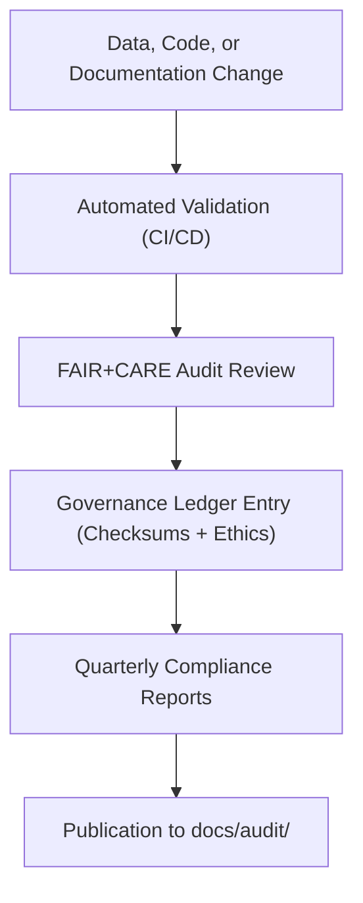

<div align="center">

# 🧾 **Kansas Frontier Matrix — Audit & Compliance Documentation Hub (v2.1.1 · Tier-Ω+∞ Certified)**  
`docs/audit/README.md`

**Mission:** Centralize and govern the **audit, compliance, and ethics review documentation** for the **Kansas Frontier Matrix (KFM)** —  
ensuring verifiable FAIR+CARE compliance, provenance accountability, and transparent security oversight across the system lifecycle.

[](../../docs/)
[](../../docs/standards/faircare-validation.md)
[](../../data/reports/audit/data_provenance_ledger.json)
[](../../LICENSE)

</div>

---

## 📚 Overview

The **Audit Documentation Hub** serves as the authoritative repository for **compliance reports**, **FAIR+CARE assessments**,  
and **governance validation logs** produced by automated pipelines and human oversight committees.

Each audit report is versioned, validated, and referenced within:
- `data/reports/audit/` — Provenance and checksum logs  
- `data/reports/fair/` — FAIR+CARE validation records  
- `data/reports/validation/` — Schema and STAC compliance reports  

All documents follow the **Master Coder Protocol (MCP-DL v6.4.3)** and FAIR+CARE ethical governance standards.

---

## 🧭 Directory Layout

```bash
docs/audit/
├── README.md                         # This file — audit hub overview
├── repository_compliance.md          # Repository-wide governance and compliance matrix
└── governance_matrix.md              # FAIR+CARE governance review and validation process
```

---

## 🧩 Audit Framework Overview


<!-- END OF MERMAID -->

---

## ⚙️ Audit Types

| Audit Type | Description | Generated By | Output Path |
|:--|:--|:--|:--|
| **Data Provenance Audit** | Verifies data lineage and checksums. | `governance-ledger.yml` | `data/reports/audit/data_provenance_ledger.json` |
| **FAIR+CARE Validation** | Evaluates dataset ethics and accessibility. | `faircare-validate.yml` | `data/reports/fair/data_care_assessment.json` |
| **Schema Validation** | Confirms STAC/DCAT and ontology compliance. | `stac-validate.yml` | `data/reports/validation/stac_validation_report.json` |
| **Security Scan Audit** | Performs CodeQL, Trivy, and SBOM checks. | `codeql.yml`, `trivy.yml` | `reports/security/*` |
| **Governance Review** | Summarizes quarterly ethics and compliance reports. | FAIR+CARE Council | `docs/audit/governance_matrix.md` |

---

## ⚖️ FAIR + CARE Governance Linkage

| Principle | Audit Implementation | Artifact |
|:--|:--|:--|
| **Findable** | Audits indexed via manifest and linked to datasets. | `releases/v*/manifest.zip` |
| **Accessible** | All audit reports publicly available (CC-BY 4.0). | `docs/audit/` |
| **Interoperable** | JSON-based audit formats align with FAIR+CARE schema. | `data/reports/audit/*.json` |
| **Reusable** | Historical audits retained with checksum verification. | `data/reports/audit/archive_integrity_log.json` |
| **Collective Benefit (CARE)** | Governance Council validates ethical and cultural data use. | `docs/audit/governance_matrix.md` |

---

## 🧠 Governance Workflow

| Process | Description | Workflow |
|:--|:--|:--|
| **Automated Validation** | CI/CD generates validation and FAIR+CARE reports. | `faircare-validate.yml`, `stac-validate.yml` |
| **Ethical Oversight** | FAIR+CARE Council reviews audit findings quarterly. | Governance Council Minutes |
| **Provenance Ledger Sync** | Aligns data and audit signatures across systems. | `governance-ledger.yml` |
| **Transparency Publication** | Publishes audit results to GitHub Pages / Reports. | `site.yml` |

---

## 🧮 Example Audit Record

```json
{
  "id": "audit_2025Q4_faircare",
  "dataset": "climate_v9.3.2",
  "validator": "@kfm-data-lab",
  "timestamp": "2025-11-16T10:15:00Z",
  "faircare_score": 97,
  "stac_status": "valid",
  "checksum": "sha256:13fdc9a1b3d4e89f...",
  "governance_decision": "approved",
  "ledger_reference": "data/reports/audit/data_provenance_ledger.json"
}
```

---

## 🔍 Audit and Validation Workflows

| Workflow | Function | Output |
|:--|:--|:--|
| `stac-validate.yml` | Validates dataset metadata and schema. | `data/reports/validation/stac_validation_report.json` |
| `faircare-validate.yml` | Runs FAIR+CARE ethical validation. | `data/reports/fair/data_care_assessment.json` |
| `governance-ledger.yml` | Records provenance and checksum entries. | `data/reports/audit/data_provenance_ledger.json` |
| `policy-check.yml` | Verifies documentation metadata compliance. | `reports/audit/policy_check.json` |

---

## 🧩 Quarterly Audit Deliverables

| Deliverable | Description | Responsible Team |
|:--|:--|:--|
| **FAIR+CARE Compliance Report** | Summarizes ethical audit outcomes. | @kfm-governance |
| **Security & Integrity Log** | Lists vulnerabilities and checksum verifications. | @kfm-security |
| **Governance Ledger Sync Report** | Cross-verifies all provenance records. | @kfm-architecture |
| **Public Audit Summary** | Compiled for GitHub Pages publication. | @kfm-docs |

---

## 🧾 Version History

| Version | Date | Author | Summary |
|:--|:--|:--|:--|
| **v2.1.1** | 2025-11-16 | @kfm-governance | Standardized audit documentation; added FAIR+CARE governance mapping and workflow table. |
| v2.0.0 | 2025-10-25 | @kfm-data-lab | Added provenance integration and compliance log automation. |
| v1.0.0 | 2025-10-04 | @kfm-architecture | Initial audit documentation hub. |

---

<div align="center">

**Kansas Frontier Matrix © 2025**  
*“Audits Ensure Trust — Governance Ensures Accountability.”*  
📍 `docs/audit/README.md` — Central audit and compliance documentation hub for the Kansas Frontier Matrix.

</div>

