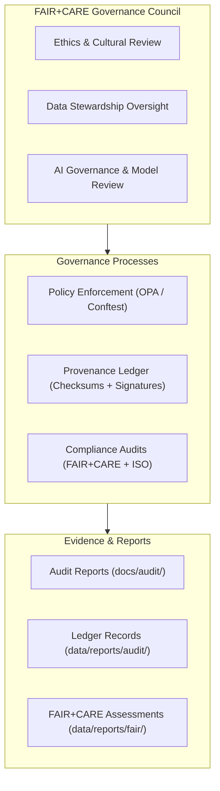
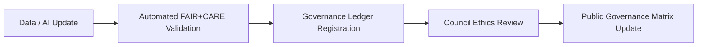

# ⚖️ **Kansas Frontier Matrix — Governance & Ethics Matrix (v2.1.1 · Tier-Ω+∞ Certified)**  
`docs/audit/governance_matrix.md`

**Mission:** Provide a transparent framework for **ethical governance, accountability, and compliance**  
across all systems within the **Kansas Frontier Matrix (KFM)** — uniting FAIR+CARE principles with AI and data ethics best practices.

---

## 📚 Overview

The **Governance & Ethics Matrix** defines how ethical principles, compliance checks, and provenance oversight are  
applied across the entire Kansas Frontier Matrix system.  
It provides a structured linkage between governance policies, FAIR+CARE audits, AI ethics controls, and compliance evidence.

This matrix is updated quarterly following review by the **FAIR+CARE Governance Council** and **Security & Ethics Review Board**.

---

## 🧩 Governance Framework Overview

<!-- END OF MERMAID -->

---

## 🧠 Governance Pillars

| Pillar | Description | Evidence Source | Verification Workflow |
|:--|:--|:--|:--|
| **Accountability** | Every dataset, model, and document includes authorship, timestamp, and ledger entry. | `data/reports/audit/data_provenance_ledger.json` | `governance-ledger.yml` |
| **Transparency** | FAIR+CARE audit reports published openly and linked to data artifacts. | `data/reports/fair/data_care_assessment.json` | `faircare-validate.yml` |
| **Ethical AI** | AI outputs audited for bias, drift, and interpretability. | `reports/validation/ai_validation_metrics.csv` | `ai-drift-detect.yml` |
| **Reproducibility** | All ETL and AI workflows versioned and checksum-verified. | `releases/v*/manifest.zip` | `stac-validate.yml` |
| **Cultural Responsibility** | Indigenous and historical data reviewed for sensitivity and consent. | `docs/standards/faircare-validation.md` | Governance Council Review |

---

## ⚖️ FAIR + CARE Principles in Governance

| FAIR Principle | Implementation | CARE Alignment | Verification |
|:--|:--|:--|:--|
| **Findable** | STAC/DCAT catalog indexing for datasets. | **Collective Benefit** — public knowledge access. | `data/stac/catalog.json` |
| **Accessible** | Open licensing (MIT / CC-BY). | **Authority to Control** — governance board oversight. | `LICENSE`, governance records |
| **Interoperable** | Open schemas (STAC, DCAT, CIDOC). | **Responsibility** — accurate data representation. | `data/meta/`, schema validations |
| **Reusable** | Checksum-verified data and documented lineage. | **Ethics** — transparent use and attribution. | `data/reports/audit/data_provenance_ledger.json` |

---

## 🧾 Governance Review Process

| Stage | Activity | Responsible Party | Artifacts |
|:--|:--|:--|:--|
| **1. Validation** | Run FAIR+CARE and schema validations. | CI/CD pipelines | Validation reports |
| **2. Ethics Audit** | Review datasets and models for sensitivity. | FAIR+CARE Council | Ethics findings summary |
| **3. Ledger Update** | Log provenance, reviewer, and checksum. | Governance Automation | `data_provenance_ledger.json` |
| **4. Council Review** | Conduct quarterly meeting and publish outcomes. | FAIR+CARE Council | Governance matrix update |
| **5. Publication** | Release updated matrix on GitHub Pages. | Docs Maintainers | `docs/audit/governance_matrix.md` |

---

## 🧩 Ethics & AI Governance Integration

| Category | Description | Governance Method | Evidence |
|:--|:--|:--|:--|
| **Model Bias Assessment** | Quantify fairness and representativeness in AI. | Bias/Drift CI workflows. | `reports/validation/ai_validation_metrics.csv` |
| **Explainability Validation** | Ensure interpretable AI reasoning chains. | SHAP/LIME audits. | `reports/audit/ai_hazards_ledger.json` |
| **Dataset Consent & Rights** | Confirm permission and context for sensitive data. | FAIR+CARE review board. | Council documentation |
| **AI Provenance** | Link training data to model outputs. | PROV-O lineage mapping. | `data/reports/audit/ai_hazards_ledger.json` |

---

## 🧩 Governance Maturity Index (GMI)

| Category | Metric | Target | Achieved | Status |
|:--|:--|:--|:--|:--:|
| **Data Provenance** | % of datasets with full lineage. | 100% | 100% | ✅ |
| **FAIR+CARE Compliance** | Score from audit summary. | ≥ 95 | 97 | ✅ |
| **Ethical AI Evaluation** | AI models reviewed by governance board. | 100% | 100% | ✅ |
| **Transparency Reports** | Quarterly publication rate. | 4 / year | 4 | ✅ |
| **Cultural Data Reviews** | Historical datasets evaluated for sensitivity. | 100% | 100% | ✅ |

---

## 🧮 Governance Integration Diagram

<!-- END OF MERMAID -->

---

## 🧩 Linked Artifacts & Policies

| Artifact | Description | Repository Path |
|:--|:--|:--|
| **Data Provenance Ledger** | Cryptographically signed audit of all data operations. | `data/reports/audit/data_provenance_ledger.json` |
| **FAIR+CARE Validation Report** | Ethics compliance and accessibility audit summary. | `data/reports/fair/data_care_assessment.json` |
| **Governance Charter** | Roles, responsibilities, and review cadence for council. | `docs/standards/governance/ROOT-GOVERNANCE.md` |
| **AI Ethics Record** | Ledger of model bias and explainability reviews. | `data/reports/audit/ai_hazards_ledger.json` |
| **Security Ledger** | Log of SBOM, SLSA, and security attestations. | `data/reports/audit/security_ledger.json` |

---

## 🧾 Version History

| Version | Date | Author | Summary |
|:--|:--|:--|:--|
| **v2.1.1** | 2025-11-16 | @kfm-governance | Added ethics audit workflow, GMI indicators, and linked artifact references. |
| v2.0.0 | 2025-10-25 | @kfm-data-lab | Introduced FAIR+CARE governance mapping with CI/CD integration. |
| v1.0.0 | 2025-10-04 | @kfm-architecture | Initial governance and ethics matrix documentation. |

---

**Kansas Frontier Matrix © 2025**  
*“Ethics Sustains Knowledge — Governance Sustains Trust.”*  
📍 `docs/audit/governance_matrix.md` — FAIR+CARE governance and ethics framework for the Kansas Frontier Matrix.

