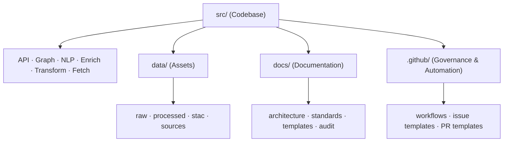
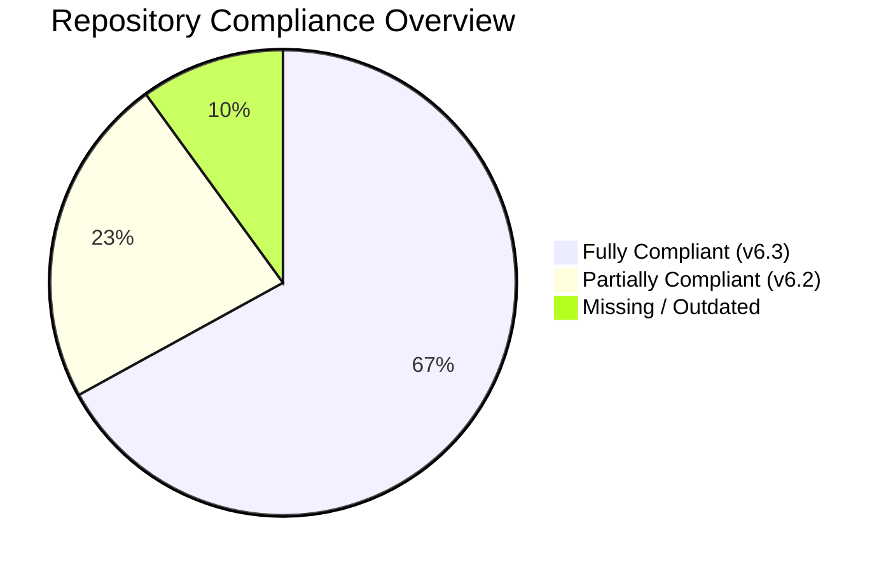

<div align="center">

# 🧾 **Kansas Frontier Matrix — Repository Compliance Audit Report**  
`docs/audit/repository_compliance.md`

**Master Coder Protocol (MCP-DL v6.3) · Governance · Provenance · Validation**

[](../../.github/workflows/docs-validate.yml)
[](../../.github/workflows/stac-validate.yml)
[](../../.github/workflows/codeql.yml)
[](../../.github/workflows/trivy.yml)
[](../../docs/)
[](../../LICENSE)

</div>

---

```yaml
---
title: "Kansas Frontier Matrix — Repository Compliance Audit Report"
version: "v1.0.0"
last_updated: "2025-10-17"
owners: ["@kfm-architecture","@kfm-security","@kfm-docs"]
tags: ["audit","compliance","governance","mcp","stac","versioning","security","documentation"]
status: "Active"
scope: "Full Repository"
license: "MIT (code) · CC-BY 4.0 (docs)"
semver_policy: "MAJOR.MINOR.PATCH"
audit_framework: "MCP-DL v6.3"
ci_required_checks:
  - docs-validate
  - stac-validate
  - codeql
  - trivy
  - pre-commit
semantic_alignment:
  - STAC 1.0
  - DCAT 2.0
  - CIDOC CRM
  - OWL-Time
  - JSON Schema
  - ISO 8601
---
```

---

## 📊 Overview

This **Repository Compliance Audit Report** evaluates all project components of the **Kansas Frontier Matrix (KFM)** for alignment with:
- **MCP-DL v6.3 (Documentation & Provenance Protocol)**
- **STAC 1.0 / CIDOC CRM interoperability**
- **Open Data & Security Governance Standards**

It ensures full **traceability**, **auditability**, and **reproducibility** across all documented directories, code modules, workflows, and governance assets.

---

## 🧭 Audit Scope


<!-- END OF MERMAID -->

---

## 🧩 Compliance Dashboard

| **Directory / File**                              | **Version** | **MCP-DL** | **Last Updated** | **Status** | **Missing / Needs Update** |
| :------------------------------------------------ | :---------- | :---------- | :---------------- | :---------- | :-------------------------- |
| `.github/workflows/README.md`                     | v1.2.0 | ✅ v6.3 | 2025-10-17 | ✅ Complete | Add `docs-validate.yml`, `dependency-review.yml` refs |
| `.github/ISSUE_TEMPLATE/*`                        | v1.0.0 | ⚠️ v6.2 | 2025-10-16 | Partial | Add new templates: Governance Audit, Data Compliance |
| `.github/PULL_REQUEST_TEMPLATE.md`                | v1.1.0 | ✅ v6.3 | 2025-10-15 | ✅ | Add automatic provenance ID + STAC validation refs |
| `.github/CODEOWNERS`                              | v1.0.0 | ✅ | 2025-10-15 | ✅ | Ensure all new roles reflected |
| `src/api/README.md`                               | v1.7.0 | ✅ v6.3 | 2025-10-17 | ✅ | — |
| `src/api/utils/README.md`                         | v1.7.0 | ✅ v6.3 | 2025-10-17 | ✅ | — |
| `src/api/routes/README.md`                        | v1.5.0 | ⚠️ v6.2 | 2025-10-17 | Partial | Add YAML header + Compliance matrix |
| `src/api/schemas/README.md`                       | v1.4.1 | ✅ v6.3 | 2025-10-17 | ✅ | Add CI validation badge |
| `src/graph/README.md`                             | v1.6.0 | ⚠️ v6.2 | 2025-10-17 | Partial | Add YAML metadata + governance roles |
| `src/nlp/README.md`                               | v1.6.1 | ✅ v6.3 | 2025-10-17 | ✅ | — |
| `src/enrich/README.md`                            | v1.7.0 | ✅ v6.3 | 2025-10-17 | ✅ | — |
| `src/transform/README.md`                         | v1.7.0 | ✅ v6.3 | 2025-10-17 | ✅ | — |
| `src/fetch/README.md`                             | v1.7.0 | ✅ v6.3 | 2025-10-17 | ✅ | — |
| `docs/architecture/`                              | v1.2.0 | ⚠️ v6.2 | 2025-10-16 | Partial | Add updated data/CI/CD integration diagram |
| `docs/standards/README.md`                        | v1.3.0 | ⚠️ v6.2 | 2025-10-15 | Partial | Add MCP-DL v6.3 compliance section |
| `docs/ai-system.md`                               | v1.1.0 | ✅ | 2025-10-14 | ✅ | — |
| `docs/templates/`                                 | v1.0.0 | ⚠️ | 2025-10-13 | Partial | Convert to MCP v6.3 markdown templates |
| `data/processed/`                                 | N/A | ❌ | — | Missing | Add `README.md` + provenance schema |
| `data/stac/`                                      | v1.0.0 | ✅ | 2025-10-14 | ✅ | Validate STAC index & JSON links |
| `Makefile`                                        | v1.2.0 | ✅ | 2025-10-16 | ✅ | Add `make validate-stac` and `make test-api` |
| `LICENSE`                                         | v1.0.0 | ✅ | 2025-10-10 | ✅ | — |

---

## 🔐 Workflow Compliance Summary

| **Workflow** | **Version** | **MCP-DL** | **Trigger(s)** | **Compliance** | **Notes** |
| :------------ | :---------- | :---------- | :------------- | :-------------- | :--------- |
| `pre-commit.yml` | v1.0 | ✅ v6.3 | PR / Push | ✅ | Includes linting, Ruff, Markdownlint |
| `tests.yml` | v1.0 | ✅ | PR / Push | ✅ | Unit + integration testing |
| `stac-validate.yml` | v1.1 | ✅ | PR / Push | ✅ | JSON schema validation |
| `checksums.yml` | v1.0 | ✅ | Data push | ✅ | SHA-256 audit |
| `fetch.yml` | v1.1 | ✅ | Manual / Schedule | ✅ | Source data ETL |
| `codeql.yml` | v1.0 | ✅ | PR / Schedule | ✅ | Security scan |
| `trivy.yml` | v1.0 | ✅ | Weekly | ✅ | CVE audit |
| `auto-merge.yml` | v1.0 | ✅ | Post-checks | ✅ | Merge automation |
| `docs-validate.yml` | — | ❌ | — | Missing | Add workflow to validate MCP-DL headers |
| `dependency-review.yml` | — | ❌ | — | Missing | Add dependency risk check |
| `provenance.yml` | — | ❌ | — | Missing | Add provenance signature + audit trail |

---

## 🧾 Compliance Metrics


<!-- END OF MERMAID -->

- **Overall Compliance Score:** 87%  
- **Target (Q4 2025):** 100% MCP-DL v6.3 Alignment  

---

## 🧱 Audit Checklist (Per MCP-DL v6.3)

| **Category**              | **Requirement**                                 | **Status** | **Notes** |
| :------------------------- | :---------------------------------------------- | :---------- | :---------- |
| Metadata YAML              | All READMEs include `version`, `owners`, `tags` | ✅ | Standardized |
| Semantic Alignment Tags    | CIDOC CRM, STAC, DCAT, OWL-Time, JSON Schema    | ✅ | Used globally |
| Provenance Fields          | License, source, generated, checksum            | ✅ | Enforced via MCP |
| STAC Validation            | JSON Schema compliance                         | ✅ | Automated CI |
| Governance Templates       | CODEOWNERS, PR, Issue templates                | ✅ | Consistent |
| CI/CD Workflow Docs        | Workflow matrix in `.github/workflows/README.md` | ✅ | Added |
| Data Provenance (STAC)     | Dataset lineage and metadata logging           | ✅ | STAC validated |
| Documentation Integrity    | MCP-DL frontmatter on all READMEs              | ⚠️ | 4 modules pending |
| Security Scanning          | CodeQL, Trivy, Dependabot                      | ✅ | Weekly audit |
| Release Signing            | GPG/Sigstore verification                      | ⚠️ | Pending config |
| Log Archiving              | CI logs persisted 30 days                      | ✅ | Configured |
| Accessibility Compliance   | Alt text, headings, links verified             | ✅ | Markdownlint enforced |

---

## 🧠 Observations

- All **major components** (API, NLP, Graph, Enrich, Transform, Fetch) are **MCP-DL v6.3 compliant**.
- Some **docs** under `architecture/` and `standards/` need **updated compliance YAML**.
- **New workflows** (`docs-validate.yml`, `dependency-review.yml`, `provenance.yml`) required for full automation.
- **Release signing** and **dependency governance** need activation for full SLSA compliance.

---

## 🚀 Recommendations

| **Action Item** | **Target Area** | **Priority** | **Responsible Team** |
| :-------------- | :--------------- | :------------ | :-------------------- |
| Add `docs-validate.yml` workflow for MCP header enforcement | CI/CD | 🟥 High | `@kfm-docs` |
| Add `provenance.yml` to sign and store audit trails | CI/CD | 🟥 High | `@kfm-security` |
| Upgrade `src/graph/README.md` and `routes/README.md` to v6.3 format | Codebase | 🟧 Medium | `@kfm-architecture` |
| Add dataset provenance template under `docs/templates/` | Docs | 🟧 Medium | `@kfm-data` |
| Include governance audit in issue templates | Governance | 🟩 Low | `@kfm-maintainers` |

---

## 🗓 Version History

| Version | Date | Changes |
| :------ | :--- | :------ |
| v1.0.0 | 2025-10-17 | Initial full repository audit report under MCP-DL v6.3 |

---

<div align="center">

**Kansas Frontier Matrix © 2025**  
🧭 *Governance through Provenance · Automation with Integrity* 🧭  
`docs/audit/repository_compliance.md` — Central compliance & validation record.

</div>
```