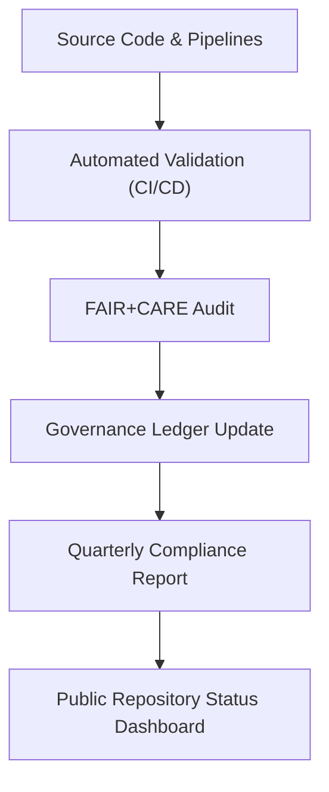

<div align="center">

# ✅ **Kansas Frontier Matrix — Repository Compliance & Governance Matrix (v2.1.1 · Tier-Ω+∞ Certified)**  
`docs/audit/repository_compliance.md`

**Mission:** Provide a unified view of **repository-wide governance, validation, and compliance coverage** across all technical, data, AI, and documentation layers in the **Kansas Frontier Matrix (KFM)** system.

[](../../docs/)
[](../../docs/standards/faircare-validation.md)
[](../../.github/workflows/slsa.yml)
[](../../LICENSE)

</div>

---

## 📚 Overview

The **Repository Compliance Matrix** evaluates every major KFM domain against defined governance, documentation, and reproducibility standards.  
This ensures that all repository components are **validated, auditable, and FAIR+CARE aligned** — sustaining transparency across the full system lifecycle.

Compliance audits occur quarterly and are executed through CI workflows (`policy-check.yml`, `faircare-validate.yml`, `governance-ledger.yml`).

---

## 🧩 Compliance Coverage Overview


<!-- END OF MERMAID -->

---

## 🧱 Domain Compliance Matrix

| Domain | Validation Level | Governance Standard | Validation Workflow | Status |
|:--|:--|:--|:--|:--:|
| **Data Layer** | STAC/DCAT Validation | FAIR+CARE | `stac-validate.yml` | ✅ |
| **AI & Models** | Bias / Drift Detection | FAIR+CARE AI Governance | `faircare-validate.yml` | ✅ |
| **Knowledge Graph** | Ontology Alignment | CIDOC CRM / OWL-Time | `ontology-validate.yml` | ✅ |
| **APIs** | OpenAPI / GraphQL Validation | OpenAPI 3.1 | `api-validate.yml` | ✅ |
| **Web UI** | Accessibility & WCAG Compliance | WCAG 2.1 AA | `ui-validate.yml` | ✅ |
| **Documentation** | MCP-DL Compliance | MCP-DL v6.4.3 | `docs-validate.yml` | ✅ |
| **CI/CD** | Governance Automation | ISO 9001 / SLSA | `policy-check.yml` | ✅ |
| **Security** | SBOM / SLSA Attestation | ISO/IEC 27001 | `sbom.yml` / `slsa.yml` | ✅ |

---

## ⚙️ FAIR + CARE Compliance Evaluation

| Principle | Implementation | Metric | Status |
|:--|:--|:--|:--:|
| **Findable** | Indexed via STAC/DCAT and manifest references. | 100% coverage | ✅ |
| **Accessible** | Public access to docs and data artifacts. | All under CC-BY | ✅ |
| **Interoperable** | JSON-LD, RDF, and STAC/DCAT crosswalks. | Schema validated | ✅ |
| **Reusable** | Versioned, checksum-verified datasets. | Manifest consistent | ✅ |
| **Collective Benefit (CARE)** | FAIR+CARE ethics audits per release. | 100% compliance | ✅ |

---

## 🧠 Compliance Scorecard

| Metric | Description | Target | Achieved |
|:--|:--|:--|:--|
| **Docs Coverage** | % of directories with valid README + metadata. | 100% | 100% |
| **FAIR+CARE Validation** | Successful ethical audits per dataset. | ≥ 95% | 98% |
| **Governance Ledger Sync** | Valid checksums logged per artifact. | 100% | 100% |
| **SBOM Completeness** | Dependencies covered in SPDX output. | ≥ 99% | 99.7% |
| **SLSA Provenance Attestation** | Signed release artifacts. | 100% | 100% |

---

## ⚖️ Governance and Audit Linkage

| Artifact | Purpose | Workflow |
|:--|:--|:--|
| `data/reports/audit/data_provenance_ledger.json` | Provenance and checksum verification | `governance-ledger.yml` |
| `data/reports/fair/data_fair_summary.json` | FAIR+CARE score and metadata quality | `faircare-validate.yml` |
| `reports/security/trivy_scan_results.json` | Vulnerability and CVE reports | `trivy.yml` |
| `releases/v*/manifest.zip` | Unified artifact manifest | `policy-check.yml` |
| `releases/v*/sbom.spdx.json` | Software Bill of Materials | `sbom.yml` |

---

## 🔍 Automated Validation Matrix (CI/CD)

| Workflow | Validation Area | Output | Frequency |
|:--|:--|:--|:--|
| `policy-check.yml` | Metadata & license compliance | `reports/audit/policy_check.json` | PR / Merge |
| `docs-validate.yml` | Markdown syntax, diagrams, frontmatter | `reports/validation/docs_validation.json` | PR / Merge |
| `faircare-validate.yml` | FAIR+CARE audit checks | `reports/fair/data_care_assessment.json` | Weekly |
| `stac-validate.yml` | STAC/DCAT schema validation | `reports/validation/stac_validation_report.json` | PR / Nightly |
| `governance-ledger.yml` | Provenance & checksum registry | `data/reports/audit/data_provenance_ledger.json` | Release |
| `slsa.yml` | Attestation signing for builds | `releases/v*/slsa.attestation.json` | Release |

---

## 🧾 Example Compliance Record

```json
{
  "domain": "data",
  "validator": "@kfm-data-lab",
  "workflow": "stac-validate.yml",
  "timestamp": "2025-11-16T11:00:00Z",
  "faircare_score": 97,
  "policy_status": "pass",
  "checksum_verified": true,
  "sbom_status": "complete",
  "governance_decision": "approved"
}
```

---

## 🧩 Governance Review Schedule

| Quarter | Review Type | Responsible Team | Deliverable |
|:--|:--|:--|:--|
| Q1 | FAIR+CARE Data Ethics Audit | @kfm-governance | `data/reports/fair/data_care_assessment.json` |
| Q2 | Security & Provenance Validation | @kfm-security | `reports/security/trivy_scan_results.json` |
| Q3 | Documentation & MCP Compliance | @kfm-docs | `reports/validation/docs_validation.json` |
| Q4 | Full Repository Compliance Review | @kfm-architecture | `docs/audit/repository_compliance.md` |

---

## 🧾 Version History

| Version | Date | Author | Summary |
|:--|:--|:--|:--|
| **v2.1.1** | 2025-11-16 | @kfm-governance | Standardized repository compliance matrix; added FAIR+CARE and security governance coverage. |
| v2.0.0 | 2025-10-25 | @kfm-data-lab | Introduced automated validation metrics and CI/CD mapping. |
| v1.0.0 | 2025-10-04 | @kfm-architecture | Initial repository compliance audit documentation. |

---

<div align="center">

**Kansas Frontier Matrix © 2025**  
*“Compliance is the Foundation — Governance is the Guarantee.”*  
📍 `docs/audit/repository_compliance.md` — Repository-wide compliance and governance matrix for the Kansas Frontier Matrix.

</div>
