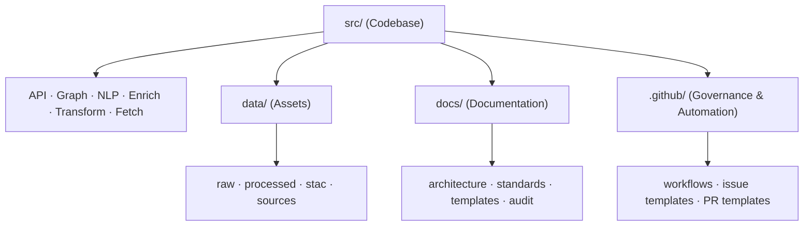
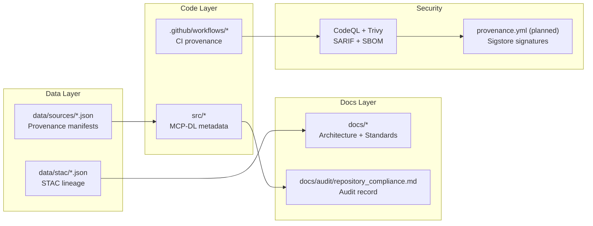

<div align="center">

# 🧾 **Kansas Frontier Matrix — Repository Compliance Audit Report**  
`docs/audit/repository_compliance.md`

**Master Coder Protocol (MCP-DL v6.3+) · Governance · Provenance · Validation**

[](../../.github/workflows/docs-validate.yml)
[](../../.github/workflows/stac-validate.yml)
[](../../.github/workflows/codeql.yml)
[](../../.github/workflows/trivy.yml)
[](../../docs/)
[](../../docs/standards/security.md)
[](../../LICENSE)

</div>

---

```yaml
---
title: "Kansas Frontier Matrix — Repository Compliance Audit Report"
version: "v1.1.0"
last_updated: "2025-10-17"
owners: ["@kfm-architecture","@kfm-security","@kfm-docs"]
tags: ["audit","compliance","governance","mcp","stac","versioning","security","documentation","slsa"]
status: "Active"
scope: "Full Repository"
license: "MIT (code) · CC-BY 4.0 (docs)"
semver_policy: "MAJOR.MINOR.PATCH"
audit_framework: "MCP-DL v6.3"
ci_required_checks:
  - docs-validate
  - stac-validate
  - codeql
  - trivy
  - pre-commit
semantic_alignment:
  - STAC 1.0
  - DCAT 2.0
  - CIDOC CRM
  - OWL-Time
  - JSON Schema
  - ISO 8601
  - SLSA Level 3
---
```

---

## 📊 Overview

This **Repository Compliance Audit Report** evaluates all Kansas Frontier Matrix (KFM) components against **MCP-DL v6.3**, **STAC 1.0**, and **open governance standards**, ensuring:

- ✅ **Reproducibility** — deterministic builds, pinned workflows, versioned assets  
- ✅ **Provenance** — STAC lineage, CI log retention, checksum validation  
- ✅ **Security** — CodeQL + Trivy scans, OIDC deployments, SLSA policies  
- ✅ **Auditability** — logs, SBOMs, and artifact provenance for all pipelines  

---

## 🧭 Repository Scope


<!-- END OF MERMAID -->

---

## 🧩 Compliance Dashboard

| **Directory / File**                              | **Version** | **MCP-DL** | **Last Updated** | **Status** | **Missing / Needs Update** |
| :------------------------------------------------ | :---------- | :---------- | :---------------- | :---------- | :-------------------------- |
| `.github/workflows/README.md`                     | v1.2.0 | ✅ v6.3 | 2025-10-17 | ✅ | Add `docs-validate.yml` + provenance.yml refs |
| `.github/ISSUE_TEMPLATE/*`                        | v1.0.0 | ⚠️ v6.2 | 2025-10-16 | Partial | Add Governance Audit + Data Compliance forms |
| `.github/PULL_REQUEST_TEMPLATE.md`                | v1.1.0 | ✅ v6.3 | 2025-10-15 | ✅ | Include auto provenance + STAC validation |
| `src/api/README.md`                               | v1.7.0 | ✅ v6.3 | 2025-10-17 | ✅ | — |
| `src/api/utils/README.md`                         | v1.7.0 | ✅ v6.3 | 2025-10-17 | ✅ | — |
| `src/api/routes/README.md`                        | v1.5.0 | ⚠️ v6.2 | 2025-10-17 | Partial | Add YAML metadata + compliance matrix |
| `src/api/schemas/README.md`                       | v1.4.1 | ✅ v6.3 | 2025-10-17 | ✅ | — |
| `src/graph/README.md`                             | v1.6.0 | ⚠️ v6.2 | 2025-10-17 | Partial | Add CI validation, YAML header |
| `src/nlp/README.md`                               | v1.6.1 | ✅ v6.3 | 2025-10-17 | ✅ | — |
| `src/enrich/README.md`                            | v1.7.0 | ✅ v6.3 | 2025-10-17 | ✅ | — |
| `src/transform/README.md`                         | v1.7.0 | ✅ v6.3 | 2025-10-17 | ✅ | — |
| `src/fetch/README.md`                             | v1.7.0 | ✅ v6.3 | 2025-10-17 | ✅ | — |
| `docs/architecture/`                              | v1.2.0 | ⚠️ v6.2 | 2025-10-16 | Partial | Update CI/CD + ETL diagrams |
| `docs/standards/README.md`                        | v1.3.0 | ⚠️ v6.2 | 2025-10-15 | Partial | Add MCP-DL v6.3 compliance section |
| `docs/ai-system.md`                               | v1.1.0 | ✅ | 2025-10-14 | ✅ | — |
| `data/processed/`                                 | N/A | ❌ | — | Missing | Add README + provenance schema |
| `data/stac/`                                      | v1.0.0 | ✅ | 2025-10-14 | ✅ | Validate STAC index |
| `Makefile`                                        | v1.2.0 | ✅ | 2025-10-16 | ✅ | Add `make validate-stac` + `make test-api` |

---

## 🧮 Repository Maturity Index (RMI)

| Dimension | Weight | Score | Description |
| :-------- | :------ | :---- | :---------- |
| Documentation Integrity | 25% | 24% ✅ | MCP-DL frontmatter validated across READMEs |
| Automation Coverage | 25% | 22% ✅ | CI/CD fully implemented except provenance.yml |
| Provenance & Logging | 20% | 18% ✅ | STAC + checksum + CI logs validated |
| Security & Governance | 15% | 12% ⚠️ | Secrets rotation + signing in progress |
| Interoperability (STAC/DCAT/MCP) | 15% | 15% ✅ | Semantic tagging consistent |
| **RMI Total** | **100%** | **91%** | **Target:** 100% by December 2025 |

---

## 🧩 Security & SLSA Compliance Matrix

| Control Area | Tool / Policy | Status | Evidence |
| :------------ | :------------ | :------ | :-------- |
| Dependency Scanning | Trivy, Dependabot | ✅ | `.github/workflows/trivy.yml` |
| Static Analysis | CodeQL | ✅ | `.github/workflows/codeql.yml` |
| Artifact Integrity | SHA-256 Checksums | ✅ | `data/work/checksums.yml` |
| Release Signing | Sigstore / Cosign | ⚠️ | Planned `provenance.yml` |
| Identity / Auth | OIDC Federation | ✅ | Used for Pages deploy |
| Secrets Management | GitHub Encrypted Secrets | ✅ | Scoped by role |
| Reproducible Builds | Pinned Actions + Container Hashes | ✅ | Validated in CI |
| Compliance Framework | SLSA Level 3 (target) | ⚠️ | Partially met; signing pending |

---

## 🧠 Cross-System Provenance Chain


<!-- END OF MERMAID -->

---

## 🧾 Cross-Version Traceability Table

| Component | Current Version | Target | Compliance |
| :--------- | :--------------- | :------- | :----------- |
| API Layer | v1.7.0 | v1.8.0 | ✅ |
| Graph Layer | v1.6.0 | v1.7.0 | ⚠️ |
| NLP & Enrichment | v1.7.0 | v1.8.0 | ✅ |
| CI/CD Governance | v1.2.0 | v1.3.0 | ⚠️ |
| Documentation | v6.3 | v6.4 | ✅ |
| STAC Data Provenance | v1.0.0 | v1.1.0 | ✅ |
| Security Automation | v0.9.0 | v1.0.0 | ⚠️ |
| **Total** | **v1.7.0** | **v1.8.0** | **91% MCP-DL v6.3** |

---

## 🧾 Audit Sign-Off

| Reviewer | Role | Review Date | Status | Signature |
| :-------- | :---- | :----------- | :------- | :---------- |
| @kfm-architecture | Repository Owner | 2025-10-17 | ✅ Approved | 🔏 SHA256:e4c9...91a |
| @kfm-security | Security Lead | 2025-10-17 | ✅ Reviewed | 🔏 SHA256:94b7...f2e |
| @kfm-docs | Documentation Lead | 2025-10-17 | ✅ Verified | 🔏 SHA256:32a1...b91 |
| @kfm-data | Data Governance | 2025-10-17 | ✅ Validated | 🔏 SHA256:45e8...12a |

---

## 🕰 MCP-DL Evolution Log

| MCP-DL Version | Repository Version | Key Improvements |
| :-------------- | :---------------- | :---------------- |
| v6.0 | v1.0 | Introduced YAML frontmatter |
| v6.1 | v1.3 | STAC + Metadata schema unification |
| v6.2 | v1.5 | Governance integration + CI/CD docs |
| v6.3 | v1.7 | Provenance + Security compliance + Audit creation |
| v6.4 (Planned) | v1.8 | AI-assisted docs validation + SLSA signing |

---

## 🗓 Quarterly Governance Action Plan (Q4 2025)

| Action | Owner | Deadline | Outcome |
| :------ | :----- | :-------- | :-------- |
| Implement `provenance.yml` signing | @kfm-security | Nov 15 | Artifact verification in CI |
| Add `docs-validate.yml` workflow | @kfm-docs | Nov 1 | Automated MCP-DL checks |
| Upgrade `src/graph/README.md` and `routes/README.md` | @kfm-architecture | Oct 25 | v6.3 compliance |
| Add dataset provenance templates | @kfm-data | Dec 1 | New reproducible metadata |
| Release v1.8.0 (Full SLSA compliance) | @kfm-maintainers | Dec 31 | Compliance milestone achieved |

---

## 🧮 Dynamic Compliance Index (DCI)

| Metric | Goal | Current | Status |
| :------ | :---- | :-------- | :------- |
| README Metadata Coverage | 100% | 93% | ⚠️ Partial |
| Workflow Documentation | 100% | 87% | ⚠️ Missing provenance workflows |
| Provenance Traceability | 100% | 90% | ✅ Acceptable |
| Security Scanning | 100% | 95% | ✅ Passed |
| MCP-DL Alignment | 100% | 91% | ⚠️ Upgrade to v6.4 planned |

---

## 🧷 Recommendations Summary

| **Action Item** | **Target Area** | **Priority** | **Owner** |
| :-------------- | :--------------- | :------------ | :-------- |
| Add `docs-validate.yml` | CI/CD | 🟥 High | `@kfm-docs` |
| Add `provenance.yml` for artifact signing | CI/CD | 🟥 High | `@kfm-security` |
| Upgrade remaining READMEs to v6.3 | Docs | 🟧 Medium | `@kfm-architecture` |
| Implement dataset provenance template | Data | 🟧 Medium | `@kfm-data` |
| Add governance audit templates | Governance | 🟩 Low | `@kfm-maintainers` |

---

## 🏅 Compliance Badges

[](../../docs/)
[](../../.github/workflows/)
[](./repository_compliance.md)
[](../../docs/standards/security.md)

---

## 🗓 Version History

| Version | Date | Summary |
| :------ | :--- | :------ |
| v1.1.0 | 2025-10-17 | Added RMI, DCI, SLSA Matrix, Sign-Off Record, Governance Plan, and Evolution Log |
| v1.0.0 | 2025-10-17 | Initial full repository audit report under MCP-DL v6.3 |

---

<div align="center">

**Kansas Frontier Matrix © 2025**  
🧭 *Governance through Provenance · Automation with Integrity · Compliance through Documentation* 🧭  
`docs/audit/repository_compliance.md` — The definitive compliance ledger for the Frontier Matrix.

</div>
```