<!-- [KFM_META_BLOCK_V2]
doc_id: kfm://doc/backlog-navigation-index
title: Backlog — Navigation Index (PROPOSED lane; pointer page, not authority)
type: standard
version: v1
status: draft
owners: OWNER_TBD  # NEEDS VERIFICATION: docs steward
created: 2026-05-25
updated: 2026-05-25
policy_label: public
related:
  - kfm://doc/directory-rules                           # CONFIRMED: docs/doctrine/directory-rules.md
  - kfm://doc/verification-backlog                      # PROPOSED authority: docs/registers/VERIFICATION_BACKLOG.md
  - kfm://doc/new-ideas-index                           # PROPOSED authority: docs/intake/NEW_IDEAS_INDEX.md
  - kfm://doc/idea-intake                               # PROPOSED authority: docs/intake/IDEA_INTAKE.md
  - kfm://doc/drift-register                            # PROPOSED authority: docs/registers/DRIFT_REGISTER.md
  - kfm://doc/atlas-v1-1                                # CONFIRMED authority: Atlas v1.1 §24.12 Open-ADR Backlog
  - kfm://doc/encyclopedia                              # CONFIRMED authority: KFM Encyclopedia §15 OPEN-ENC-XX
  - kfm://doc/atlas-v1-1-chapter-extracts-readme        # CONFIRMED authored: chapter-local OPEN items
tags: [kfm, backlog, index, navigation, registers, intake, open-questions, governance]
notes:
  - This README sits at a PROPOSED lane (`docs/backlog/`). The lane is parallel to existing canonical homes — `docs/registers/`, `docs/intake/`, `docs/adr/`, in-chapter OPEN-XXX-NN items.
  - This file is a POINTER PAGE only. It does not own backlog content; the canonical lanes do.
  - Whether `docs/backlog/` should exist at all is ADR-class per Directory Rules §2.4(5). Logged as OPEN-BLOG-01.
[/KFM_META_BLOCK_V2] -->

# Backlog — Navigation Index

<!-- [doc: kfm://doc/backlog-navigation-index] -->

> **Pointer page** to the canonical homes where KFM's backlog items actually live — verification items, new ideas, drift observations, open ADR questions, and in-chapter `OPEN-XXX-NN` items. **This page is not authority.** It indexes; it does not own.

  
  
  
  
  
  

> [!CAUTION]
> **Parallel-authority concern.** Backlog content already has documented homes — `docs/registers/`, `docs/intake/`, `docs/adr/`, Atlas §24.12, and in-chapter `OPEN-XXX-NN` items. A new `docs/backlog/` lane risks creating **parallel authority** per Directory Rules §2.4(5). To avoid that, this file is a **pointer page only** — it must not accumulate backlog items of its own. See §2 (what this is *not*) and §8 OPEN-BLOG-01 for the ADR question.

> [!NOTE]
> **Anti-collapse rule.** This index does not substitute for any of the canonical backlog homes. When this index and a canonical home disagree, **the canonical home wins**. File the disagreement to `docs/registers/DRIFT_REGISTER.md`.

---

## Contents

1. [Scope](#1-scope)
2. [What this is *not*](#2-what-this-is-not)
3. [Canonical backlog homes](#3-canonical-backlog-homes)
4. [Cross-cutting `OPEN-XXX-NN` namespaces](#4-cross-cutting-open-xxx-nn-namespaces)
5. [Backlog landscape](#5-backlog-landscape)
6. [How to file or find a backlog item](#6-how-to-file-or-find-a-backlog-item)
7. [Maintenance task list](#7-maintenance-task-list)
8. [Open questions & ADR cross-reference](#8-open-questions--adr-cross-reference)
9. [Evidence basis & citations](#9-evidence-basis--citations)

---

## 1. Scope

This page exists to answer a single question: **"Where does that backlog item live?"**

KFM has several legitimate backlog flavors — verification items, new-idea proposals, drift observations, ADR-class questions, and in-chapter open items. Each has a canonical home documented in Directory Rules §6.1 or the source dossiers. Until now, no single page indexed them. This file is that index.

Three rules govern its operation:

- **It points; it does not own.** Every entry here links to a canonical home elsewhere. No backlog item is created or stored in this file.
- **It mirrors; it does not author.** When a canonical home is updated, this page reflects the change. The reverse does not happen.
- **It defers; it does not resolve.** Conflicts go to `docs/registers/DRIFT_REGISTER.md`; the canonical home's authority is preserved.

[↑ back to top](#top)

---

## 2. What this is *not*

This page is **not**:

| ❌ Not | ✅ Why not |
|:---|:---|
| A new backlog authority | Existing canonical homes own the content. Adding authority here would create parallel-authority drift per Directory Rules §2.4(5). |
| A replacement for `docs/registers/VERIFICATION_BACKLOG.md` | Verification items belong there. This page links there. |
| A replacement for `docs/intake/NEW_IDEAS_INDEX.md` | New-idea proposals belong there. This page links there. |
| A replacement for Atlas v1.1 §24.12 | The open-ADR backlog is a doctrine artifact in the Atlas. This page references it. |
| A place to file new `OPEN-XXX-NN` items | Those items live in the chapter / doc that raises them. |
| Authority over ADR triage or prioritization | ADR triage belongs in `docs/adr/` and the docs-steward review process. |
| A roadmap, sprint board, or work-tracking dashboard | Work tracking lives outside the repo (GitHub Issues, project boards, etc.). Doctrine doesn't own velocity. |

> [!WARNING]
> If this file starts to **accumulate item data** of its own — definitions, priorities, owner columns, status transitions — it has drifted from "pointer page" to "parallel authority" and needs immediate reconciliation. The maintenance checklist in §7 calls this out.

[↑ back to top](#top)

---

## 3. Canonical backlog homes

Each row points to the **canonical home** for that flavor of backlog. The "size at last index" column is a snapshot — the canonical home is the source of truth.

| Flavor | Canonical home | Owner (per source) | Size at last index | Status |
|:---|:---|:---|:---:|:---:|
| **Verification items** *(things to check before claims become CONFIRMED)* | `docs/registers/VERIFICATION_BACKLOG.md` | Docs steward | ≥ 10 *(Atlas v1.1 §G.7 VB-11-01 … VB-11-10)* | PROPOSED home |
| **Drift observations** *(placement, naming, parallel-authority cases)* | `docs/registers/DRIFT_REGISTER.md` | Docs steward | NEEDS VERIFICATION | PROPOSED home |
| **New-idea proposals** *(pre-promotion intake)* | `docs/intake/IDEA_INTAKE.md` | Docs steward + topic stewards | NEEDS VERIFICATION | PROPOSED home |
| **Programming Possibilities Backlog** *(promoted ideas, indexed)* | `docs/intake/NEW_IDEAS_INDEX.md` | Topic stewards | Pass 32 corpus: 1,607 cards *(60 NEW; 290 EXPANDED; 1,239 UNCHANGED; 18 QUARANTINED)* | PROPOSED home |
| **Master Open-ADR Backlog** *(architecture-class decisions)* | Atlas v1.1 §24.12 (`docs/atlases/KFM_Domains_Culmination_Atlas_v1_1.pdf`) | Docs steward + ADR authors | 15 *(ADR-S-01 … ADR-S-15)* | CONFIRMED in Atlas; placement of extract NEEDS VERIFICATION |
| **Directory Rules opens** *(repo-placement questions)* | `docs/doctrine/directory-rules.md` §18 | Docs steward | ≥ 11 *(OPEN-DR-01 … OPEN-DR-11)* | CONFIRMED authored (prior session) |
| **Encyclopedia opens** *(encyclopedia structure / placement)* | `docs/encyclopedia/README.md` §15 | Encyclopedia stewards | ≥ 8 *(OPEN-ENC-01 … OPEN-ENC-08)* | CONFIRMED authored (prior session) |
| **Per-chapter opens (Atlas Ch. 24 extracts)** | In-file `OPEN-<CHAPTER>-NN` items within each `docs/atlases/master-atlas-v1.1/<chapter>.md` | Chapter topic owner | See §4 for breakdown | CONFIRMED authored §24.5 / §24.6 |
| **Per-domain verification opens** | Each `docs/domains/<domain>/` dossier's `N. Verification backlog and open questions` section | Domain steward | One block per domain (Atlas v1.0 §3–§18 each carry `N.`) | CONFIRMED in Atlas v1.0; mounted-repo dossier presence NEEDS VERIFICATION |
| **Repo-structure open questions** | `kfm_repository_structure_guiding_document.md` §12 | Docs steward | OQ-001 … OQ-027 | CONFIRMED in project doc |
| **Per-PDF open questions (PDF sidecar)** | PDF-sidecar README (path under reconciliation, see prior session) | Docs steward | 6 *(OPEN-PDF-01 … OPEN-PDF-06)* | CONFIRMED authored (prior session, path NEEDS reconciliation) |

> [!IMPORTANT]
> **Multiple-home rule.** If a backlog item could fit in two homes, file in the **most specific** one. A drift entry that also raises an ADR question lives in the drift register *and* surfaces a candidate ADR entry — not two parallel records of the same item.

[↑ back to top](#top)

---

## 4. Cross-cutting `OPEN-XXX-NN` namespaces

KFM uses an `OPEN-<NAMESPACE>-NN` convention for in-document open items. The namespace identifies the document family; the number is locally scoped.

| Namespace | Lives in | Scope | Examples |
|:---|:---|:---|:---|
| `OPEN-DR-NN` | `docs/doctrine/directory-rules.md` §18 | Repo-placement and Directory Rules questions | OPEN-DR-01 (`PROV.md` vs `PROVENANCE.md`); OPEN-DR-06 (`apps/web/` vs `apps/explorer-web/`); OPEN-DR-10 (MapLibre-sole-renderer ADR) |
| `OPEN-ENC-NN` | `docs/encyclopedia/README.md` §15 | Encyclopedia structure / placement | OPEN-ENC-01 (encyclopedia vs `docs/atlases/`); OPEN-ENC-02 (chapter-split convention) |
| `OPEN-TIER-NN` | `docs/atlases/master-atlas-v1.1/24.5-sensitivity-tier-reference.md` | Sensitivity-tier scheme questions | OPEN-TIER-01 (T0–T4 canonical?); OPEN-TIER-02 (chapter-split layout paired with OPEN-ENC-02) |
| `OPEN-GATE-NN` | `docs/atlases/master-atlas-v1.1/24.6-pipeline-gate-reference.md` | Pipeline-gate questions | OPEN-GATE-01 (receipt schema home); OPEN-GATE-08 (PDP-unreachable posture) |
| `OPEN-CHEXT-NN` | `docs/atlases/master-atlas-v1.1/README.md` | Chapter-extract folder convention | OPEN-CHEXT-01 (paired with OPEN-ENC-02 / OPEN-TIER-02 / OPEN-GATE-02) |
| `OPEN-PDF-NN` | PDF-sidecar README (path under reconciliation) | PDF-companion documentation | OPEN-PDF-01 (sidecar naming); OPEN-PDF-02 (signing posture) |
| `OPEN-BLOG-NN` | **This file** — but **only the namespace question itself** | Backlog-index questions | OPEN-BLOG-01 (lane existence); OPEN-BLOG-02 (chapter-local opens aggregation) |
| `OQ-NN` | `kfm_repository_structure_guiding_document.md` §12 | Repo-structure investigation tracking | OQ-019 … OQ-023 (Focus Mode placement); OQ-024 (`tools/attest/` presence) |
| `VB-XX-NN` | Atlas v1.1 §G.7 (Forward verification backlog) | Atlas-edition verification items | VB-11-01 (schema home ADR-0001 confirmation); VB-11-05 (T0–T4 ADR-S-05 adoption) |
| `ADR-S-NN` | Atlas v1.1 §24.12 (Master Open-ADR Backlog) | Architecture-class decisions | ADR-S-01 (schema home); ADR-S-05 (sensitivity tier scheme); ADR-S-15 (doctrine artifact lifecycle) |

### 4.1 Namespace lifecycle

| Phase | Behavior |
|:---|:---|
| **Created** | Item is added to its host document with a stable `OPEN-XXX-NN` ID. |
| **Cross-referenced** | When an item in one namespace ties to another (e.g. OPEN-CHEXT-01 paired with OPEN-ENC-02), both files reference each other. |
| **Promoted to ADR** | If a chapter-local item escalates, it gets an `ADR-S-NN` entry in Atlas §24.12 and a candidate ADR in `docs/adr/`. The chapter-local item retains its ID but adds an "ADR-S-NN" cross-reference. |
| **Resolved** | When resolved by ADR / drift entry / per-root README, the item is marked resolved in its host document. The ID is **never reused**. |
| **Withdrawn** | Items withdrawn without resolution carry a `WITHDRAWN` note explaining why. ID is **never reused**. |

> [!TIP]
> When in doubt about which namespace to use, raise the item in the **closest document to the affected content**. A tier-scheme question goes in `OPEN-TIER-NN` in the §24.5 chapter file. A repo-placement question goes in `OPEN-DR-NN` in directory-rules. Cross-references then thread between them.

[↑ back to top](#top)

---

## 5. Backlog landscape

```mermaid
flowchart TB
  subgraph DOCS_REGISTERS["docs/registers/  — register lane"]
    direction TB
    VB["VERIFICATION_BACKLOG.md<br/><i>verification items</i>"]
    DR["DRIFT_REGISTER.md<br/><i>placement/structural drift</i>"]
    AL["AUTHORITY_LADDER.md<br/><i>authority hierarchy</i>"]
    CLE["CANONICAL_LINEAGE_<br/>EXPLORATORY.md"]
    OFM["OBJECT_FAMILY_MAP.md"]
  end

  subgraph DOCS_INTAKE["docs/intake/  — intake lane"]
    direction TB
    II["IDEA_INTAKE.md<br/><i>pre-promotion proposals</i>"]
    NII["NEW_IDEAS_INDEX.md<br/><i>Pass 23/32 cards · 1,607</i>"]
  end

  subgraph DOCS_ADR["docs/adr/  — decisions lane"]
    direction TB
    ADR["ADR-0001 … ADR-NNNN<br/><i>accepted decisions</i>"]
  end

  subgraph DOCS_ATLASES["docs/atlases/  — doctrine lane"]
    direction TB
    A2412["Atlas §24.12<br/>Master Open-ADR Backlog<br/><i>ADR-S-01 … ADR-S-15</i>"]
    AG7["Atlas §G.7<br/>Forward Verification Backlog<br/><i>VB-11-01 … VB-11-10</i>"]
    CHX["master-atlas-v1.1/<br/>chapter files<br/><i>OPEN-TIER, OPEN-GATE, OPEN-CHEXT, OPEN-PDF</i>"]
  end

  subgraph DOCS_DOCTRINE["docs/doctrine/  — doctrine lane"]
    direction TB
    DOCR["directory-rules.md §18<br/><i>OPEN-DR-01 … OPEN-DR-11</i>"]
  end

  subgraph DOCS_ENC["docs/encyclopedia/  — encyclopedia"]
    direction TB
    ENCQ["README.md §15<br/><i>OPEN-ENC-01 … OPEN-ENC-08</i>"]
  end

  subgraph DOCS_DOMAINS["docs/domains/<domain>/"]
    direction TB
    DD["Per-domain N. sections<br/><i>verification backlog + open Qs</i>"]
  end

  INDEX["docs/backlog/README.md<br/><b>THIS PAGE — pointer only</b>"]

  INDEX -.points to.-> DOCS_REGISTERS
  INDEX -.points to.-> DOCS_INTAKE
  INDEX -.points to.-> DOCS_ADR
  INDEX -.points to.-> DOCS_ATLASES
  INDEX -.points to.-> DOCS_DOCTRINE
  INDEX -.points to.-> DOCS_ENC
  INDEX -.points to.-> DOCS_DOMAINS

  classDef pointer fill:#fde2e2,stroke:#c0392b,color:#000,stroke-width:2px;
  classDef registers fill:#eaf2f8,stroke:#21618c,color:#000;
  classDef intake fill:#fcf3cf,stroke:#9a7d0a,color:#000;
  classDef adr fill:#d5f5e3,stroke:#1e8449,color:#000;
  classDef atlases fill:#d6eaf8,stroke:#21618c,color:#000;
  classDef doctrine fill:#fdebd0,stroke:#b9770e,color:#000;
  classDef enc fill:#f4ecf7,stroke:#7d3c98,color:#000;
  classDef domains fill:#f4f6f6,stroke:#566573,color:#000;
  class INDEX pointer;
  class VB,DR,AL,CLE,OFM registers;
  class II,NII intake;
  class ADR adr;
  class A2412,AG7,CHX atlases;
  class DOCR doctrine;
  class ENCQ enc;
  class DD domains;
```

*Solid containers are canonical homes. Dotted arrows show that this index page **points to** each — without owning them. The pointer-only relationship is the entire raison d'être of this file.*

[↑ back to top](#top)

---

## 6. How to file or find a backlog item

A decision aid. Find the row matching your situation; follow the link to the canonical home.

### 6.1 I have something to *file*

| If your item is… | File it at | Use ID convention |
|:---|:---|:---|
| A **verification check** to perform before a claim becomes CONFIRMED | `docs/registers/VERIFICATION_BACKLOG.md` | Local sequential ID; cross-reference VB-XX-NN if it ties to an Atlas-edition backlog item |
| A **drift observation** — a path, name, or authority misplacement | `docs/registers/DRIFT_REGISTER.md` | Local sequential ID; cross-reference §13.5 row + §2.4 trigger |
| A **new idea or proposal** not yet reviewed | `docs/intake/IDEA_INTAKE.md` | Submission ID; if promoted, gets a stable KFM-P{PASS}-{CLASS}-{NNNN} ID and moves to `NEW_IDEAS_INDEX.md` |
| An **architecture-class question** (schema home, source-role enum, tier scheme adoption, etc.) | Candidate ADR in `docs/adr/` plus an `ADR-S-NN` row in Atlas §24.12 | `ADR-S-NN` |
| A **repo-placement** or directory-rules question | `docs/doctrine/directory-rules.md` §18 | `OPEN-DR-NN` |
| A question **scoped to a single chapter or doc** | In-file at the section's end | `OPEN-<NAMESPACE>-NN` per §4 |
| A question about the **encyclopedia** structure | `docs/encyclopedia/README.md` §15 | `OPEN-ENC-NN` |
| A **domain-specific** verification or open question | The domain dossier's `N. Verification backlog and open questions` section | Local sequential |

### 6.2 I want to *find* what's open

Start with the canonical-homes table in §3. The "size at last index" column gives a sense of where the volume is. For a specific question:

- **"What's pending for sensitivity tiers?"** → `OPEN-TIER-NN` in the §24.5 chapter file.
- **"What's pending for the pipeline gates?"** → `OPEN-GATE-NN` in the §24.6 chapter file.
- **"What ADRs should I look at?"** → `ADR-S-NN` in Atlas §24.12 (and any drafted candidates in `docs/adr/`).
- **"What needs to be verified after first repo mount?"** → `VB-XX-NN` in Atlas §G.7, then `docs/registers/VERIFICATION_BACKLOG.md`.
- **"What placement decisions are open?"** → `OPEN-DR-NN` in `docs/doctrine/directory-rules.md` §18.

### 6.3 I'm not sure which lane

When the choice is unclear, **prefer the canonical home closest to the affected artifact**. A sensitivity-tier question goes in the §24.5 chapter file (closest artifact). A schema-home question goes in `directory-rules.md` §18 *and* in Atlas §24.12 (closest doctrine artifact + ADR backlog). Cross-references thread between them.

> [!NOTE]
> If you genuinely need a new namespace (e.g., a new chapter family with its own `OPEN-XXX-NN` line), raise the namespace itself as an OPEN item in the closest doctrine document — typically `directory-rules.md` §18.

[↑ back to top](#top)

---

## 7. Maintenance task list

Gates / definition-of-done for keeping this index honest.

- [ ] **No content authority creep.** This file does not store backlog items — only pointers. Periodic check: every row in §3 still links to an external canonical home.
- [ ] **Sizes refreshed.** "Size at last index" column in §3 reflects the canonical-home state at last review.
- [ ] **Namespace inventory complete.** §4 covers all `OPEN-XXX-NN` namespaces in use in the repo. New namespaces are added on creation.
- [ ] **Cross-references reciprocal.** When a chapter file's `OPEN-XXX-NN` ties to an `ADR-S-NN` (or vice versa), both ends carry the cross-reference.
- [ ] **Conflicts deferred.** When this index disagrees with a canonical home, the canonical home wins. The drift is logged in `docs/registers/DRIFT_REGISTER.md`.
- [ ] **No new IDs minted here.** This file mints only `OPEN-BLOG-NN` (about the index itself). All other backlog IDs are minted in their canonical homes.
- [ ] **Lane review.** Per Directory Rules per-root README requirement, this file's continued existence is reviewed each Atlas / directory-rules edition cycle.
- [ ] **Parallel-authority watch.** If `docs/backlog/` grows additional files beyond this README, that growth is **itself** a drift signal — log to DRIFT_REGISTER and reconcile.

[↑ back to top](#top)

---

## 8. Open questions & ADR cross-reference

| # | Question | Class | Cross-reference |
|:---|:---|:---|:---|
| **OPEN-BLOG-01** | Should `docs/backlog/` exist as a lane at all, or should this index live at `docs/registers/INDEX.md` (or `docs/registers/README.md`) instead? Directory Rules §6.1 places registers under `docs/registers/`; this index could plausibly live there as well. | ADR-class | Directory Rules §2.4(5) *(parallel authority)*; §6.1 *(registers lane)*; §13.5 *(pointer-page precedent for `docs/registry/`)*. |
| **OPEN-BLOG-02** | Should chapter-local `OPEN-XXX-NN` items be **auto-aggregated** into a single canonical view (machine-generated index), or remain human-curated? | Tooling class | Relates to `tools/atlas_inventory/` (OPEN-CHEXT-06). |
| **OPEN-BLOG-03** | What is the **lifecycle** of an `OPEN-XXX-NN` item? When does it migrate from a chapter-local namespace to a canonical home (e.g., `ADR-S-NN`)? When does it retire? | Process class | Section §4.1 sketches a lifecycle; formalization needs docs steward sign-off. |
| **OPEN-BLOG-04** | Should there be a **machine-readable** backlog index (YAML / JSON sidecar) so §3 and §4 can be auto-generated from the canonical homes? | Tooling class | New candidate ADR; relates to `control_plane/` registers per Directory Rules §6. |
| **OPEN-BLOG-05** | When the same logical question fires in **multiple namespaces** (e.g., OPEN-ENC-02 ↔ OPEN-TIER-02 ↔ OPEN-GATE-02 ↔ OPEN-CHEXT-01 — all four are the same "chapter-split layout" question), should they be **merged** into one canonical ID, or kept distinct with cross-references? | Convention class | Currently kept distinct with cross-references; merging would require a re-numbering convention. |
| **OPEN-BLOG-06** | Should `OPEN-XXX-NN` IDs be **stable across renames**? E.g., if a chapter file is renamed, do its OPEN items keep their IDs? | Convention class | Current practice is yes (stable IDs); formalize via per-root README or ADR. |

[↑ back to top](#top)

---

## 9. Evidence basis & citations

<strong>Source ledger</strong>

| Source | Status | Supports | Limits |
|:---|:---|:---|:---|
| `docs/doctrine/directory-rules.md` §6.1 — `docs/` tree | CONFIRMED (prior-session authored) | §3 canonical-homes list (`docs/registers/`, `docs/intake/`, `docs/archive/`, etc.). | `docs/backlog/` is **not** in the Directory Rules §6.1 tree — confirms OPEN-BLOG-01 as a real placement question. |
| `docs/doctrine/directory-rules.md` §2.4(5) | CONFIRMED (prior-session authored) | §2 parallel-authority caution; OPEN-BLOG-01. | Doctrinal anchor for the "pointer page, not authority" framing. |
| `docs/doctrine/directory-rules.md` §13.5 (`docs/registry/...` row) | CONFIRMED (prior-session authored) | §1 pointer-page pattern; §3 home list. | Establishes the precedent: "Convert to pointer pages under `docs/architecture/` or `docs/registers/`; move machine artifacts to canonical roots." This README applies the same pattern. |
| `docs/doctrine/directory-rules.md` §18 (Open Questions) | CONFIRMED (prior-session authored) | §4 `OPEN-DR-NN` namespace; §3 "Directory Rules opens" row. | Source of OPEN-DR-01 through OPEN-DR-11. |
| Atlas v1.1 §24.12 — Master Open-ADR Backlog | CONFIRMED (manuscript) | §3 ADR-class row; §4 `ADR-S-NN` namespace. | 15 items ADR-S-01 through ADR-S-15. |
| Atlas v1.1 §G.7 — Forward verification backlog | CONFIRMED (manuscript) | §4 `VB-XX-NN` namespace; §3 verification-items row. | 10 items VB-11-01 through VB-11-10. |
| Atlas v1.0 §21 — Programming Possibilities Backlog | CONFIRMED (manuscript) | §3 "Programming Possibilities Backlog" row tied to `docs/intake/NEW_IDEAS_INDEX.md`. | Atlas chapter title is literally "Programming Possibilities Backlog, Dependencies, and Roadmap." |
| `KFM Encyclopedia.md` §15 (Open Questions and Verification Backlog) | CONFIRMED (prior-session authored) | §4 `OPEN-ENC-NN` namespace. | 8 items OPEN-ENC-01 through OPEN-ENC-08; explicit `docs/registers/VERIFICATION_BACKLOG.md` reference. |
| `kfm_repository_structure_guiding_document.md` §12 | CONFIRMED (project doc) | §4 `OQ-NN` namespace; §3 repo-structure opens row. | 27 items OQ-001 through OQ-027. |
| Pass 32 corpus statistics | CONFIRMED (project docs) | §3 "1,607 cards total" figure for Programming Possibilities Backlog. | Breakdown: 1,239 unchanged + 290 expanded + 60 NEW + 18 quarantined. |
| Prior-session chapter files (`24.5-…`, `24.6-…`, `master-atlas-v1.1/README.md`, PDF-sidecar README) | CONFIRMED (prior-session authored) | §3 per-chapter opens row; §4 `OPEN-TIER`, `OPEN-GATE`, `OPEN-CHEXT`, `OPEN-PDF` namespaces. | Total ≥26 in-file OPEN items across the four files. |

### 9.1 Citation key

The Atlas corpus uses dossier-shorthand citations. They are not used in this index's body text — this is a pointer page, so citations belong with the items themselves at their canonical homes.

| Tag | Refers to |
|:---|:---|
| `[ENCY]` | KFM Encyclopedia |
| `[DIRRULES]` | Directory Rules |
| `[ATLAS]` | KFM Domains Culmination Atlas (any edition) |

> [!NOTE]
> **Anti-collapse rule (reaffirmed).** This index is a navigation aid. The backlog items themselves — and the evidence, policy, review, and release context that gives them weight — live at the canonical homes named in §3. Treating this index as a substitute for those homes is exactly the parallel-authority drift Directory Rules §2.4(5) warns against.

[↑ back to top](#top)

---

Backlog navigation index. PROPOSED lane (`docs/backlog/`) pending OPEN-BLOG-01 ADR. **This file owns no backlog content** — it only points to canonical homes in `docs/registers/`, `docs/intake/`, `docs/adr/`, Atlas §24.12, `docs/doctrine/directory-rules.md` §18, and in-chapter `OPEN-XXX-NN` items. Canonical homes always win on conflict; file disagreements to `docs/registers/DRIFT_REGISTER.md`.
