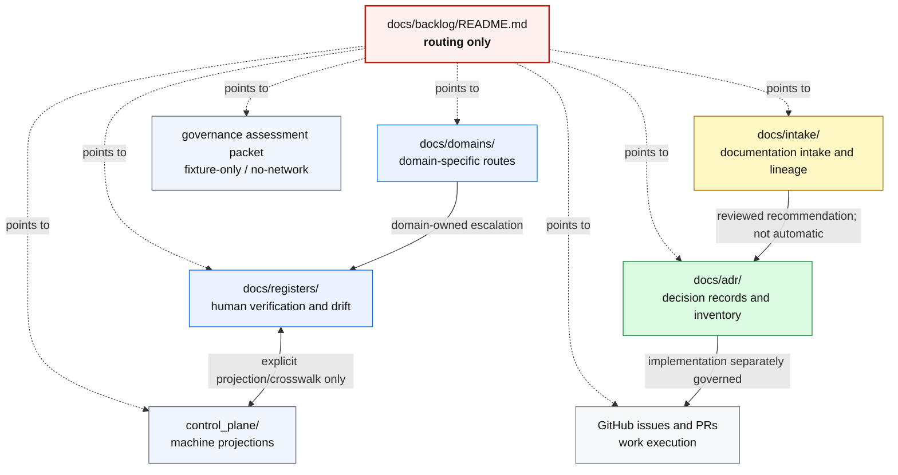

<!-- [KFM_META_BLOCK_V2]
doc_id: kfm://doc/backlog-navigation-index
title: docs/backlog/ — Backlog Routing Index
type: readme/lane-readme
version: v2.0
status: draft; repository-grounded; pointer-only; non-authoritative; lane-classification-needs-verification
owners:
  - "@bartytime4life — verified CODEOWNERS review route only"
owner_status: "Accountable documentation, governance-register, intake, ADR, domain, and independent review stewardship remains NEEDS VERIFICATION"
created: 2026-05-25
updated: 2026-08-22
policy_label: repository-facing
owning_root: docs/
current_path: docs/backlog/README.md
responsibility: >-
  Preserve the repository-present backlog address and route readers to the
  human registers, documentation-intake lane, ADR inventory, domain-local
  queues, machine projections, and execution-tracking surfaces that own
  distinct kinds of open work, without copying their records or becoming a
  second backlog authority.
authority: >-
  Navigation and boundary explanation only. This file does not create, own,
  prioritize, resolve, approve, promote, release, publish, or mutate a backlog
  item, ADR, source, evidence object, policy decision, lifecycle record, review,
  receipt, proof, manifest, correction, rollback record, issue, or pull request.
truth_posture: >-
  CONFIRMED current path, one-file directory inventory, docs-root ownership,
  adopted Directory Rules through ADR-0029, current routing destinations,
  current ADR inventory authority, the empty machine verification-backlog
  projection, and the fixture-only open-ADR assessment packet / PARTIAL
  human-machine verification-backlog parity and intake-lane convergence /
  UNKNOWN external consumers and final direct-child classification of
  docs/backlog/ / NEEDS VERIFICATION accountable stewardship, migration or
  deprecation decision, consumer closure, and any future generated aggregate.
evidence_snapshot:
  repository: bartytime4life/Kansas-Frontier-Matrix
  base_ref: main
  base_commit: 43792be16c693d7e4ce9da8afe5514da87440e0d
  target_prior_blob: a2e81ef6c24d3b854774d8beb2435d1701d66afc
  docs_root_readme_blob: 1f8bac189dac1d01c1185e8b4fb8e25efd11d09f
  directory_rules_blob: fd49a0b83e55cef52c1124281f093e263526898d
  adr_0029_blob: a4de0d7a96b78da59cfc499d1025e1508afd8dd9
  verification_projection_blob: d0fd8552e4ad90f80ea0c04a2607f9e85c7b1b9d
  drift_register_blob: 5c5078b93c467e66f4cc8b86a7a696dbce5ae7e0
  intake_readme_blob: 35cc8f301be00526d3334f0778d65d52965a8687
  domains_readme_blob: 7bf702fbdb336abcc3fb1bc2ab30b3dd1acfcff3
  codeowners_blob: dd2a84aa514d8ecd9208bc347f90f9a2ed37dd61
  open_adr_contract_blob: ebd509c8ab9b5689ad52c20a9d56be7a13a110f6
related:
  - ../README.md
  - ../doctrine/directory-rules.md
  - ../adr/ADR-0029-adopt-directory-governance-standard-v2.md
  - ../adr/INDEX.md
  - ../adr/README.md
  - ../registers/README.md
  - ../registers/VERIFICATION_BACKLOG.md
  - ../registers/DRIFT_REGISTER.md
  - ../intake/README.md
  - ../domains/README.md
  - ../../control_plane/verification_backlog.yaml
  - ../../contracts/governance/open_adr_backlog_discipline_assessment.md
  - ../../CONTRIBUTING.md
tags: [kfm, docs, backlog, routing, pointer, registers, intake, adr, verification, governance]
notes:
  - "v2.0 replaces proposal-era counts and unverified prior-session claims with current repository evidence."
  - "Same-path documentation outcome: PLACE. Final lane admission, migration, retirement, redirect, or deletion: HOLD pending a separate accepted decision and consumer evidence."
  - "No volatile backlog rows, priorities, owners, or state transitions are copied into this file."
  - "Historical OPEN-BLOG-01 through OPEN-BLOG-06 anchors are retained as compatibility notes, not active backlog authority."
  - "No source admission, policy decision, lifecycle transition, review, release, deployment, publication, or repository-setting change occurs here."
[/KFM_META_BLOCK_V2] -->

# `docs/backlog/` — Backlog Routing Index

> **Repository-grounded routing page for open work.** Use this page to find the
> surface that owns a verification item, drift observation, documentation-intake
> candidate, architecture decision, domain-local queue, synthetic assessment, or
> GitHub execution record. This page points; it does not own.

> [!IMPORTANT]
> **This README is not a canonical backlog.** It does not contain authoritative
> backlog rows, decide status, assign ownership, set priority, accept an ADR,
> resolve verification, or authorize implementation. Follow the destination
> named in [§3](#3-canonical-backlog-homes) and inspect that surface at the
> current revision.

> [!WARNING]
> **The directory exists, but its direct-child classification is unresolved.**
> The adopted [`docs/` direct-child map](../README.md#direct-child-map) does not
> enumerate `docs/backlog/`. This change therefore updates the existing README
> in place (`PLACE`) while keeping any move, rename, redirect, retirement, or
> deletion on `HOLD`. Path presence is implementation evidence, not automatic
> placement authority.

> [!NOTE]
> **Human and machine backlog views are not in parity.** The human
> [`VERIFICATION_BACKLOG.md`](../registers/VERIFICATION_BACKLOG.md) contains
> dated open material, while the current
> [`control_plane/verification_backlog.yaml`](../../control_plane/verification_backlog.yaml)
> has `entries: []`. Neither side may silently overwrite or claim the authority
> of the other.

**Quick navigation:** [Scope](#1-scope) ·
[Non-authority](#2-what-this-is-not) ·
[Routing surfaces](#3-canonical-backlog-homes) ·
[Identity boundaries](#4-cross-cutting-open-xxx-nn-namespaces) ·
[Landscape](#5-backlog-landscape) ·
[File or find](#6-how-to-file-or-find-a-backlog-item) ·
[Maintenance](#7-maintenance-task-list) ·
[Historical open questions](#8-open-questions--adr-cross-reference) ·
[Evidence and rollback](#9-evidence-basis--citations)

---

## 1. Scope

This page answers one question: **which current KFM surface should I inspect or
update for this kind of open work?**

### Current bounded profile

| Field | Repository-grounded result |
|---|---|
| Current path | `docs/backlog/README.md` — `CONFIRMED` |
| Direct children of `docs/backlog/` | One: this `README.md` |
| Owning responsibility root | `docs/` — human-readable governance and explanation |
| Same-path documentation outcome | `PLACE` |
| Direct-child lane classification | `NEEDS VERIFICATION` — omitted from the adopted canonical `docs/` map |
| Structural disposition | `HOLD` for move, rename, redirect, retirement, or deletion |
| Authority | Navigation and boundary explanation only |
| Review route | `@bartytime4life` through repository review routing; routing is not approval |
| Public/lifecycle effect | None |

The routing rule is deliberately narrow:

1. identify the kind of open work;
2. follow the current destination in [§3](#3-canonical-backlog-homes);
3. read that destination's own boundary and status;
4. create or update the record only through its governing process;
5. preserve links among related records without copying their writable state here.

This page may explain a conflict, but it does not resolve one. Confirmed
documentation or placement drift belongs in the
[`DRIFT_REGISTER.md`](../registers/DRIFT_REGISTER.md). A concrete check that
remains unresolved belongs in the
[`VERIFICATION_BACKLOG.md`](../registers/VERIFICATION_BACKLOG.md) or the most
specific verified domain queue.

[Back to top](#top)

---

## 2. What this is *not*

| This page is not… | Owning surface or reason |
|---|---|
| A writable backlog register | Human governance registers live under [`docs/registers/`](../registers/README.md); machine projections live under `control_plane/`. |
| The ADR inventory or decision authority | [`docs/adr/INDEX.md`](../adr/INDEX.md) inventories current ADR records. An index cannot accept a decision independently. |
| The documentation-intake authority | [`docs/intake/README.md`](../intake/README.md) defines exploratory documentation intake and records its own unresolved sibling overlap. |
| A domain queue | Domain guidance and any domain-local verification or expansion queues are reached through [`docs/domains/README.md`](../domains/README.md). |
| A machine projection | The current verification projection is [`control_plane/verification_backlog.yaml`](../../control_plane/verification_backlog.yaml). |
| A project board or execution tracker | Issues and pull requests track work execution under the contribution process; they do not become doctrine, evidence, policy, review, release, or publication state. |
| A status crosswalk between unrelated ID families | Source-local `OPEN-*`, Atlas `ADR-S-*`, repository `ADR-NNNN`, register IDs, issue numbers, and pull-request numbers remain distinct unless an accepted mapping says otherwise. |
| A release or publication queue | Release decisions, correction, withdrawal, and rollback belong to their governing release and accountability surfaces. |

> [!CAUTION]
> Adding copied item rows, priorities, owners, deadlines, or lifecycle states
> here would create a second writable view and new drift. Add a link and a
> bounded observation instead.

[Back to top](#top)

---

## 3. Current routing surfaces

“Canonical” below is scoped by responsibility. No single file owns every kind
of backlog.

| Need | Current destination | What it owns | Current boundary |
|---|---|---|---|
| Cross-system human verification work | [`docs/registers/VERIFICATION_BACKLOG.md`](../registers/VERIFICATION_BACKLOG.md) | Dated human-readable checks and evidence gaps | Human register; current machine parity is incomplete |
| Machine-readable verification projection | [`control_plane/verification_backlog.yaml`](../../control_plane/verification_backlog.yaml) | Machine projection of adopted/open verification state | `PROPOSED`; currently `entries: []` |
| Placement, naming, authority, or compatibility drift | [`docs/registers/DRIFT_REGISTER.md`](../registers/DRIFT_REGISTER.md) | Human-readable drift observations and reconciliation context | Dated human log; completeness is not implied |
| Repository ADR identity and effective status | [`docs/adr/INDEX.md`](../adr/INDEX.md) | Canonical human ADR file inventory and status crosswalk | Record presence does not accept a decision |
| ADR authoring and review guidance | [`docs/adr/README.md`](../adr/README.md) | ADR operating contract | Subordinate to source ADR records and `INDEX.md` |
| Documentation ideas, exploratory packets, and promotion routing | [`docs/intake/README.md`](../intake/README.md) | Intake boundary, routing, and lineage | Intake-only; sibling authority and lane classification remain partly unresolved |
| Domain-specific open work | [`docs/domains/README.md`](../domains/README.md), then the applicable domain lane | Domain scope and routes to verified local queues | Domain docs explain; contracts, schemas, policy, evidence, lifecycle, and release remain separate |
| Synthetic Open-ADR backlog coherence checks | [`OpenAdrBacklogDisciplineAssessment`](../../contracts/governance/open_adr_backlog_discipline_assessment.md) | Meaning of a fixture-only, no-network candidate assessment | Does not read, copy, mutate, resolve, or accept the real backlog |
| Work execution | [GitHub contribution workflow](../../CONTRIBUTING.md#getting-help-and-reporting-problems) | Issues, branches, pull requests, review, and rollback of repository changes | Delivery state is not governance, release, or publication state |

### Routing precedence

When destinations disagree:

1. preserve KFM trust, evidence, policy, lifecycle, correction, and rollback
   invariants;
2. apply accepted ADRs and the adopted Directory Rules;
3. apply the owning lane's current boundary README or contract;
4. prefer current repository evidence for current behavior;
5. record the conflict rather than selecting a winner by prose in this file.

[Back to top](#top)

---

## 4. Identity and state boundaries

The prior README treated several source-document namespaces as though they
formed one repository-wide backlog. Current evidence does not support that
collapse.

| Identity family | Meaning | Rule |
|---|---|---|
| `ADR-NNNN` | Repository ADR record identity under `docs/adr/` | Current inventory and effective status come from [`docs/adr/INDEX.md`](../adr/INDEX.md). |
| `ADR-S-NN` | Atlas or source-lineage Open-ADR seed identity | Do not silently renumber or equate it with a repository `ADR-NNNN`. |
| `OPEN-<namespace>-NN` | Question local to its source document or document family | Keep the original ID and host context; cross-reference rather than copy. |
| Verification-register item ID | Identity assigned by the owning human or machine register | Preserve the owning register and any explicit human-machine mapping. |
| Domain-local backlog ID | Identity scoped to the verified domain queue | Do not promote it to a cross-system ID without a reviewed transition. |
| GitHub issue or PR number | Work-execution and delivery identity | Does not prove implementation, decision acceptance, review, release, or publication. |
| Commit or workflow run ID | Repository bytes or validation event | Does not upgrade the authority or truth of the subject it checks. |

### State axes that remain separate

| Axis | Examples | What it does **not** prove |
|---|---|---|
| Evidence status | `CONFIRMED`, `PROPOSED`, `UNKNOWN`, `NEEDS VERIFICATION` | Priority, acceptance, implementation, or release |
| Work status | open issue, draft PR, review requested, merged | ADR acceptance, source admission, policy approval, or publication |
| Decision status | proposed, accepted, rejected, superseded | Implementation or runtime effectiveness |
| Validation outcome | pass, abstain, deny, error | Evidence truth, human approval, release, or publication |
| Data lifecycle | RAW, WORK/QUARANTINE, PROCESSED, CATALOG/TRIPLETS, PUBLISHED | Documentation intake or GitHub delivery state |
| Release/correction state | held, released, corrected, withdrawn, rolled back | Inferred from a file path, badge, issue, test, or merge |

> [!IMPORTANT]
> A relationship between two IDs must be explicit, reciprocal where required,
> and owned by the appropriate register or decision surface. This README never
> creates the crosswalk.

[Back to top](#top)

---

## 5. Backlog landscape

```mermaid
flowchart TB
    R["docs/backlog/README.md<br/><b>routing only</b>"]

    HR["docs/registers/<br/>human verification and drift"]
    MR["control_plane/<br/>machine projections"]
    ADR["docs/adr/<br/>decision records and inventory"]
    IN["docs/intake/<br/>documentation intake and lineage"]
    DM["docs/domains/<br/>domain-specific routes"]
    AS["governance assessment packet<br/>fixture-only / no-network"]
    GH["GitHub issues and PRs<br/>work execution"]

    R -. points to .-> HR
    R -. points to .-> MR
    R -. points to .-> ADR
    R -. points to .-> IN
    R -. points to .-> DM
    R -. points to .-> AS
    R -. points to .-> GH

    HR <-- "explicit projection/crosswalk only" --> MR
    IN -->|"reviewed recommendation; not automatic"| ADR
    DM -->|"domain-owned escalation"| HR
    ADR -->|"implementation separately governed"| GH

    classDef pointer fill:#fff1f0,stroke:#b42318,color:#111,stroke-width:2px;
    classDef human fill:#eaf2ff,stroke:#0969da,color:#111;
    classDef machine fill:#f0f6fc,stroke:#57606a,color:#111;
    classDef decision fill:#dafbe1,stroke:#1a7f37,color:#111;
    classDef intake fill:#fff8c5,stroke:#9a6700,color:#111;
    classDef execution fill:#f6f8fa,stroke:#6e7781,color:#111;

    class R pointer;
    class HR,DM human;
    class MR,AS machine;
    class ADR decision;
    class IN intake;
    class GH execution;
```

The dotted arrows are navigational. They do not transfer writable authority.
The two-way human/machine edge exists only when a real projection or crosswalk
declares it; the current verification views are not yet in parity.

[Back to top](#top)

---

## 6. How to file or find a backlog item

### 6.1 File new open work

| Situation | Start here | Required caution |
|---|---|---|
| A concrete repository or system claim needs verification | [`VERIFICATION_BACKLOG.md`](../registers/VERIFICATION_BACKLOG.md), or a more specific verified domain queue | State the exact check, evidence needed, and scope; do not call it complete from path presence |
| A path, name, authority, compatibility, or human-machine mismatch is confirmed | [`DRIFT_REGISTER.md`](../registers/DRIFT_REGISTER.md) | Record exact refs and do not perform structural migration from the drift note alone |
| A documentation idea or exploratory source packet needs triage | [`docs/intake/README.md`](../intake/README.md) | Intake is not canon, source admission, implementation, release, or publication |
| An architecture decision is required | [`docs/adr/README.md`](../adr/README.md), then the current [`INDEX.md`](../adr/INDEX.md) | Search current records and open work before claiming an ID; keep status proposed until reviewed |
| A question belongs to one domain | [`docs/domains/README.md`](../domains/README.md), then that domain's documented queue | Preserve domain scope and sensitivity; escalate only through explicit cross-references |
| Work must be executed in the repository | [`CONTRIBUTING.md`](../../CONTRIBUTING.md) and GitHub Issues/PRs | Work delivery does not become policy, review, release, or publication authority |

### 6.2 Find current status

- **ADR status:** read the source ADR and
  [`docs/adr/INDEX.md`](../adr/INDEX.md); do not rely on copied counts.
- **Human verification:** inspect
  [`docs/registers/VERIFICATION_BACKLOG.md`](../registers/VERIFICATION_BACKLOG.md).
- **Machine verification projection:** inspect
  [`control_plane/verification_backlog.yaml`](../../control_plane/verification_backlog.yaml).
- **Placement or authority conflict:** inspect
  [`docs/registers/DRIFT_REGISTER.md`](../registers/DRIFT_REGISTER.md).
- **Documentation intake:** inspect
  [`docs/intake/README.md`](../intake/README.md) and the specific child record.
- **Domain work:** inspect [`docs/domains/README.md`](../domains/README.md) and
  the named domain lane.
- **Repository execution:** inspect the exact issue, PR, commit, and exact-head
  checks; do not infer state from a title or badge.

### 6.3 Ambiguous routing

Use the most specific verified owner and add reciprocal cross-references when a
question spans surfaces. Do not create duplicate writable records merely because
several audiences need visibility. When no unique owner can be established,
return `HOLD` and record the verification or drift needed to decide.

[Back to top](#top)

---

## 7. Maintenance task list

A future update to this pointer should satisfy all applicable checks:

### Boundary and content

- [ ] This file contains routes and bounded status observations, not copied
      backlog rows, priorities, owners, deadlines, or transitions.
- [ ] Every destination still exists at the checked revision and its role is
      described from that surface's current evidence.
- [ ] ADR status is routed to `docs/adr/INDEX.md`; no volatile ADR count is
      copied here.
- [ ] Documentation intake overlap remains visible until its owning process
      resolves it.
- [ ] Human and machine verification-backlog parity is checked and reported
      without letting either side overwrite the other.
- [ ] Source-local `OPEN-*`, Atlas `ADR-S-*`, repository `ADR-NNNN`, domain,
      register, and GitHub IDs remain distinct.
- [ ] Any newly confirmed placement or authority conflict is sent to the drift
      register rather than normalized silently.

### Documentation quality

- [ ] One H1, one metadata block, balanced fences and HTML, unique explicit
      anchors, valid internal fragments, final newline, and no trailing
      whitespace.
- [ ] Repository-relative links resolve at the exact proposed head.
- [ ] The legacy section anchors retained by v1 remain available.
- [ ] No secret, restricted payload, private data, or protected precision is
      introduced.
- [ ] AI-authored changes carry a valid generated-work receipt with final hashes
      and `human_review.state: pending`.

### Structural watch

- [ ] `docs/backlog/` still contains only the bounded files expected by an
      accepted decision.
- [ ] A move, rename, redirect, retirement, or deletion has consumer,
      deprecation, link/anchor, retention, and rollback evidence before it
      proceeds.
- [ ] The adopted `docs/` direct-child map and any successor ADR are rechecked
      before structural action.

[Back to top](#top)

---

## 8. Historical `OPEN-BLOG-*` compatibility notes

The v1 README minted six `OPEN-BLOG-*` IDs about this pointer. They are retained
below so inbound references remain understandable. This table is historical
compatibility context, **not a new authoritative backlog**.

| ID | Prior question | Current bounded disposition | Status |
|---|---|---|---|
| `OPEN-BLOG-01` | Should `docs/backlog/` exist or move under `docs/registers/`? | The path exists, but the adopted direct-child map omits it. Same-path README repair is `PLACE`; structural disposition remains `HOLD` pending an accepted decision and consumer evidence. | `NEEDS VERIFICATION` |
| `OPEN-BLOG-02` | Should source-local open items be auto-aggregated? | No repository-current generated aggregate was verified. Any future aggregate must be one-way, attributable, deterministic, and non-authoritative. | `PROPOSED` |
| `OPEN-BLOG-03` | What is the universal lifecycle of an open item? | No single lifecycle is established. ADR, verification, intake, domain, issue, and release states remain separate and owner-specific. | `UNKNOWN` |
| `OPEN-BLOG-04` | Should there be a machine-readable backlog index? | A machine verification projection exists but is empty; a separate fixture-only Open-ADR assessment also exists. Neither is a general backlog authority. | `PARTIAL` / `NEEDS VERIFICATION` |
| `OPEN-BLOG-05` | Should related IDs in several namespaces be merged? | Silent merge or renumbering is `DENY`. Preserve source identities and use explicit cross-references or an accepted mapping. | `HOLD` |
| `OPEN-BLOG-06` | Do IDs survive file renames? | Stable identity and inbound compatibility should be preserved through a governed migration. No rename is authorized or performed here. | `PROPOSED` |

A future accepted decision may supersede one of these notes. Until then, cite the
owning decision, register, or source file rather than treating this table as the
resolution record.

[Back to top](#top)

---

## 9. Evidence basis, effects, and rollback

### Evidence snapshot

| Repository evidence | Bounded finding |
|---|---|
| [`docs/backlog/README.md`](./README.md) prior blob `a2e81ef6c24d3b854774d8beb2435d1701d66afc` | Existing proposal-era pointer; stable path and legacy anchors retained |
| [`docs/README.md`](../README.md) | `docs/` owns human-readable governance; adopted direct-child map omits `docs/backlog/` |
| [Directory Rules](../doctrine/directory-rules.md) plus [ADR-0029](../adr/ADR-0029-adopt-directory-governance-standard-v2.md) | Exact Directory Rules bytes are adopted; same-path update is allowed, but new lane admission or structural migration requires its own authority |
| [`docs/registers/README.md`](../registers/README.md) | Current human governance-register lane; content maturity and machine parity are mixed |
| [`docs/registers/VERIFICATION_BACKLOG.md`](../registers/VERIFICATION_BACKLOG.md) | Current dated human verification material exists |
| [`control_plane/verification_backlog.yaml`](../../control_plane/verification_backlog.yaml) | `PROPOSED` machine projection; `entries: []` at the pinned base |
| [`docs/adr/INDEX.md`](../adr/INDEX.md) | Current canonical human ADR file inventory and effective-status crosswalk |
| [`docs/intake/README.md`](../intake/README.md) | Documentation-intake boundary exists; lane classification and sibling overlap remain partly unresolved |
| [`docs/domains/README.md`](../domains/README.md) | Current human domain index routes to 13 documented domain lanes without becoming domain authority |
| [`OpenAdrBacklogDisciplineAssessment`](../../contracts/governance/open_adr_backlog_discipline_assessment.md) | Repository-present, proposed-inactive, fixture-only candidate; cannot mutate or accept the real backlog |

### Change effects

This README revision and its generated authoring receipt change documentation
bytes and provenance only. They do **not**:

- admit, prioritize, resolve, withdraw, supersede, or delete any backlog item;
- accept, reject, or amend an ADR;
- modify the human verification register or machine projection;
- create a new path, namespace, policy, source, contract, schema, validator,
  issue, review, release, correction, rollback, deployment, or publication;
- change any data lifecycle state or public interface;
- authorize structural treatment of `docs/backlog/`.

### Rollback

Before merge, close the draft pull request and abandon the task branch; branch
deletion is a separate repository action. After an authorized merge, revert the
bounded documentation and receipt commits or restore this file to prior blob
`a2e81ef6c24d3b854774d8beb2435d1701d66afc`, remove or supersede the paired
generated receipt consistently, re-run the same validation, and preserve the
reason for restoring proposal-era content.

Repository rollback is not backlog resolution, ADR reversal, policy rollback,
release rollback, deployment rollback, or publication rollback.

---

**Document status:** `draft` · **Version:** `v2.0` · **Updated:** 2026-08-22 ·
**Path:** repository-present pointer · **Lane classification:** `NEEDS VERIFICATION` ·
**Structural changes:** `HOLD` · **Release/deployment/publication:** none

[Back to top](#top)
