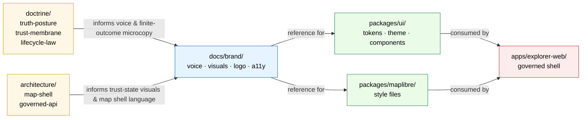

# `docs/brand/` — Brand & Visual Language

> Human-facing style guide, voice & tone, and logo usage reference for the Kansas Frontier Matrix.
> The verbal and visual rules that make **trust legible** on every KFM surface.

<!-- Top-of-file impact block. Badges are placeholders until verified against repo CI/links. -->

[](#status)
[](#repo-fit)
[](#repo-fit)
[](#open-questions--needs-verification)
[](#accessibility-commitments)
[](#change-discipline)

> [!IMPORTANT]
> **Status:** PROPOSED. This README documents the intended charter of `docs/brand/`. Whether the folder is already present in the mounted repo, and which assets currently live here vs. in [`packages/ui/`](../../packages/ui), is **NEEDS VERIFICATION**.
> Per [Directory Rules §6.1](../doctrine/directory-rules.md#61-docs--the-human-facing-control-plane), `docs/brand/` is a **conditional** subfolder of `docs/` — it exists *only if brand material is not already centralized in `packages/ui/`*.

**Quick jump:** [Scope](#scope) · [Repo fit](#repo-fit) · [Inputs](#inputs--what-belongs-here) · [Exclusions](#exclusions--what-does-not-belong-here) · [Directory tree](#directory-tree-proposed) · [Diagram](#how-brand-fits-the-trust-membrane) · [Trust-state visuals](#trust-state-visual-conventions) · [Voice & tone](#voice--tone-summary) · [Accessibility](#accessibility-commitments) · [Task list](#definition-of-done-for-content-landing-here) · [FAQ](#faq) · [Open questions](#open-questions--needs-verification)

---

## Status

| Field | Value |
| --- | --- |
| **Doc type** | README-like (directory landing) |
| **Authority class** | Human-facing reference. **`docs/` explains; `control_plane/` indexes; `contracts/` defines meaning; `schemas/` defines shape.** Brand reference is explanation, not enforcement. |
| **Authority of contents** | PROPOSED until inspected against mounted repo and reconciled with `packages/ui/` |
| **Owners** | Docs steward + Design steward · *names PROPOSED — TODO* |
| **Reviewers required for change** | Docs steward + Design steward; Accessibility reviewer for trust-state visuals |
| **Lifecycle posture** | Reference — no lifecycle phase (not under `data/`) |
| **Related doctrine** | [`docs/doctrine/directory-rules.md`](../doctrine/directory-rules.md), [`docs/doctrine/trust-membrane.md`](../doctrine/trust-membrane.md), [`docs/doctrine/truth-posture.md`](../doctrine/truth-posture.md), [`docs/architecture/map-shell.md`](../architecture/map-shell.md), [`docs/architecture/governed-api.md`](../architecture/governed-api.md) |
| **Implementation home** | [`packages/ui/`](../../packages/ui) — design tokens, theme code, components |
| **Consuming app** | [`apps/explorer-web/`](../../apps/explorer-web) |
| **Standards referenced** | [WCAG 2.1](https://www.w3.org/TR/WCAG21/) (target AA) — see [`docs/standards/`](../standards/) for the full conformance list |

---

## Scope

`docs/brand/` is the **human-facing reference** for KFM's verbal and visual language.

KFM is a **Kansas-first, map-first, time-aware, evidence-first, trust-visible** spatial knowledge and publication system. Its UI is part of the trust model: source role, rights, sensitivity, review state, freshness, release state, correction state, and finite outcomes (`ANSWER` / `ABSTAIN` / `DENY` / `ERROR`) all need a **coherent, accessible, non-decorative** visual and verbal language so that a Kansas reader can see *why* a claim is admissible, restricted, or unavailable.

This folder governs that language **as documentation**. It does not ship CSS, JSON tokens, components, or runtime behavior — those live in `packages/ui/` and the consuming app.

> [!NOTE]
> **The brand's job is to make trust legible.** A color, a badge, a phrasing pattern in `docs/brand/` is correct when it makes a citation, a denial, a freshness warning, or a correction notice unmistakable to a reader who has never read the doctrine docs.

[Back to top](#docsbrand--brand--visual-language)

---

## Repo fit

```
docs/                       # human-facing control plane
├── doctrine/                 # what is true at the level of doctrine
├── architecture/             # how the system is shaped
├── standards/                # external standards KFM conforms to (e.g., WCAG, STAC)
├── adr/                      # accepted decisions
├── domains/                  # per-domain explainers
├── governance/               # roles, review burden, separation of duties
├── runbooks/                 # ops procedures
├── registers/                # drift, verification backlog, lineage
├── reports/                  # generated review/release reports
└── brand/   ◀── this folder  # voice, visual language, logo usage (human-facing)
```

**Upstream of this folder (sources of authority):**

- [`docs/doctrine/truth-posture.md`](../doctrine/truth-posture.md) — *cite-or-abstain* governs voice.
- [`docs/doctrine/trust-membrane.md`](../doctrine/trust-membrane.md) — public surfaces use governed APIs only; brand must not visually contradict that.
- [`docs/architecture/map-shell.md`](../architecture/map-shell.md) — the map is a *trust viewer*, not decoration.
- [`docs/architecture/governed-api.md`](../architecture/governed-api.md) — finite outcomes (`ANSWER` / `ABSTAIN` / `DENY` / `ERROR`) shape the language reference.

**Downstream of this folder (consumers of guidance):**

- [`packages/ui/`](../../packages/ui) — design tokens, theme code, component library implement what is *described* here.
- [`apps/explorer-web/`](../../apps/explorer-web) — KFM's primary public surface; consumes `packages/ui/`.
- [`packages/maplibre/`](../../packages/maplibre) — map style files PROPOSED to live here; layer styling honors brand color roles.

**Sibling references:**

- [`docs/standards/`](../standards/) — WCAG 2.1, color-contrast, motion, and language standards KFM conforms to.

[Back to top](#docsbrand--brand--visual-language)

---

## Inputs — what belongs here

Brand documentation is **descriptive reference, not executable code or token data**.

| Input | Belongs here because |
| --- | --- |
| **Voice & tone guide** | KFM's speaking voice (plain language, citation discipline, finite-outcome phrasing) is doctrine made readable. |
| **Visual language reference** | Human-readable explanation of color *roles*, type *roles*, iconography conventions, density rules. |
| **Trust-state visual conventions** | How `source_role`, `rights`, `sensitivity`, `review_state`, `freshness`, `release_state`, `correction_state`, and finite outcomes are visually distinguished. |
| **Microcopy patterns** | Phrasing patterns for the Evidence Drawer, Focus Mode, finite outcomes, deny/abstain/stale/corrected/withdrawn states. |
| **Logo and wordmark usage** | Clear-space rules, do/don't examples, attribution forms, monochrome rules, embed contexts. |
| **Accessibility commitments** | WCAG target, keyboard-first commitment, non-color signaling, reduced-motion behavior, contrast thresholds, focus-visible rules. |
| **Logo source files** | Master `.svg` and reasonable raster exports for documentation reuse. *PROPOSED — see [Open questions](#open-questions--needs-verification).* |
| **Reference screenshots & illustrations** | Annotated examples of the trust-visible shell, Evidence Drawer, Focus Mode, finite-outcome states. |

[Back to top](#docsbrand--brand--visual-language)

---

## Exclusions — what does NOT belong here

| Not allowed here | Lives instead in | Why |
| --- | --- | --- |
| CSS files, SCSS, theme stylesheets | [`packages/ui/`](../../packages/ui) (or, if app-specific, [`apps/explorer-web/`](../../apps/explorer-web)) | `docs/` is human-facing reference, not shipped UI. |
| Design-token JSON / TS / YAML consumed by build | [`packages/ui/`](../../packages/ui) | Tokens are an implementation contract; `docs/` does not get loaded by the app. |
| Component source (React/TS/Vue/etc.) | [`packages/ui/`](../../packages/ui), [`apps/explorer-web/`](../../apps/explorer-web) | Code paths and tests are not documentation. |
| MapLibre style JSON | [`packages/maplibre/`](../../packages/maplibre) (PROPOSED) or [`apps/explorer-web/`](../../apps/explorer-web) | Style files are versioned alongside tile artifacts; they are runtime, not reference. |
| Machine-readable governance registers | [`control_plane/`](../../control_plane) | `docs/` *explains*; `control_plane/` *indexes*. |
| Rights, sensitivity, redaction, consent rules | [`policy/`](../../policy) | Rules are admissibility decisions, not visual style. |
| Source-rights or licensing metadata for assets | [`data/registry/`](../../data/registry), [`policy/rights/`](../../policy/rights) | Rights enforcement is policy-bearing. |
| Marketing site content / press kits | Not yet declared. **OPEN** — would require an ADR before adopting a home. | Avoid fabricating a home. |
| Build output, generated docs, QA reports | [`artifacts/`](../../artifacts) (compatibility root, tightly scoped) | Per [Directory Rules §8.2](../doctrine/directory-rules.md#82-the-artifacts-rule). |

> [!WARNING]
> **No parallel authority for trust signals.** `docs/brand/` describes how the trust badges *look and read*. The **truth** of `source_role`, `rights`, `sensitivity`, `review_state`, `freshness`, `release_state`, `correction_state` lives in `contracts/`, `schemas/`, `policy/`, and the resolved EvidenceBundle / DecisionEnvelope. Brand never invents a state, hides one, or implies a state the envelope does not carry.

[Back to top](#docsbrand--brand--visual-language)

---

## Directory tree (PROPOSED)

> All paths below are **PROPOSED**. Mounted-repo evidence has not been inspected in this session; presence and exact filenames are NEEDS VERIFICATION.

```
docs/brand/
├── README.md                              # this file
├── voice-and-tone.md                      # how KFM speaks; finite-outcome phrasing patterns
├── visual-language.md                     # color/type/icon ROLES (no hex codes — those live in packages/ui/)
├── trust-state-visuals.md                 # how source role, rights, sensitivity, review, freshness,
│                                          #   release, correction, and finite outcomes look and read
├── finite-outcome-microcopy.md            # ANSWER / ABSTAIN / DENY / ERROR phrasing & don'ts
├── evidence-drawer-microcopy.md           # field-by-field plain-language guidance
├── accessibility-commitments.md           # WCAG 2.1 AA target; keyboard-first; non-color signaling;
│                                          #   reduced-motion; focus-visible rules
├── logo/
│   ├── README.md                          # logo usage rules and inventory
│   ├── usage.md                           # clear-space, do/don't, attribution forms
│   ├── wordmark.svg                       # PROPOSED — master form
│   └── exports/                           # PROPOSED — tracked SVG/PNG exports
└── examples/                              # annotated reference screenshots, no live code
    └── trust-shell-annotated.md
```

[Back to top](#docsbrand--brand--visual-language)

---

## How brand fits the trust membrane



> *Diagram intent:* Brand is a **reference layer between doctrine and implementation**. It does not run; it explains. Implementation flows down through `packages/ui/` and `packages/maplibre/` into `apps/explorer-web/`. PROPOSED — verify against actual package layout once the repo is mounted.

[Back to top](#docsbrand--brand--visual-language)

---

## Trust-state visual conventions

The map shell, Evidence Drawer, Focus Mode panel, layer catalog, and review console all surface trust signals. Brand documents the **conventions**; the data is always carried by the resolved envelope.

| Trust signal | Source contract | Visual convention (described, not specified here) | Doctrine |
| --- | --- | --- | --- |
| `source_role` | EvidenceRef → EvidenceBundle | Distinct badge style per role (authoritative / derived / corroborative / exploratory / lineage); never color-only. | Truth posture |
| `rights` | EvidenceBundle, policy | Visible obligation indicator when restricted; license note where applicable. | Cite-or-abstain |
| `sensitivity` | EvidenceBundle, policy | Generalization / redaction / public-safe-transform indicator with reason. | Trust membrane |
| `review_state` | ReviewRecord | Draft / reviewed / steward-approved / blocked / correction-needed states differentiated by both shape and label. | Watcher-as-non-publisher |
| `freshness` | DecisionEnvelope | Fresh / stale / unknown indicator; stale state surfaces last-checked time and recheck path. | Trust membrane |
| `release_state` | ReleaseManifest | Published / stale / corrected / withdrawn / superseded — distinct visual treatment for each. | Lifecycle law |
| `correction_state` | CorrectionNotice | Correction lineage exposed in drawer; never silently overwrites a prior public claim. | Truth posture |
| Finite outcome | DecisionEnvelope.outcome | `ANSWER` / `ABSTAIN` / `DENY` / `ERROR` each have distinct UI states and reasons; all four are first-class, none is decorative. | Governed AI |

> [!CAUTION]
> **Color is never the only signal.** Every trust state has a text label and a non-color glyph. Reduced-motion and high-contrast modes preserve all distinctions. Mock or unreleased payloads carry an unmistakable mock marker that survives screenshot.

[Back to top](#docsbrand--brand--visual-language)

---

## Voice & tone summary

| Principle | What it sounds like |
| --- | --- |
| **Cite or abstain** | KFM does not assert without evidence. Phrases like "based on released evidence" / "no admissible evidence found" appear over confident generalities. |
| **Finite outcomes are first-class** | `ABSTAIN` and `DENY` are answers, not failures. Microcopy explains *why* without leaking restricted details. |
| **Plain language over jargon** | Doctrine words (EvidenceBundle, DecisionEnvelope) appear in technical contexts; the reader-facing surface uses plainer language and links. |
| **Provenance before polish** | Citations, freshness, source role, and correction state appear *before* affordances that could displace them. |
| **Map is a viewer, not the truth** | Phrasing never implies the map *is* the evidence. The map shows what evidence supports; the drawer carries the claim. |
| **Kansas-first, but not Kansas-only voice** | Avoid colloquialisms that exclude non-Kansas readers; preserve Kansas-specific source identity (USGS WBD, NHDPlus, SSURGO, etc.) where it matters. |

A full guide lives at [`voice-and-tone.md`](./voice-and-tone.md) (PROPOSED).

[Back to top](#docsbrand--brand--visual-language)

---

## Accessibility commitments

Accessibility is a brand commitment because **trust signals must reach every reader**. The accessibility surface lives at [`accessibility-commitments.md`](./accessibility-commitments.md) (PROPOSED). Summary:

- **Target conformance:** [WCAG 2.1](https://www.w3.org/TR/WCAG21/) Level AA — *NEEDS VERIFICATION* against any project-specific level recorded in `docs/standards/`.
- **Keyboard-first.** Every map action has a non-map alternative (selected features and results appear in a keyboard-accessible list/table).
- **Non-color signaling.** Every trust badge carries a text label and a non-color glyph.
- **Reduced motion.** Story Node camera animation, drawer transitions, and time-slider movement honor `prefers-reduced-motion`.
- **Focus-visible.** Focus order is stable; drawer and dialogs trap and release focus correctly.
- **Color contrast.** Body text meets AA at minimum; trust-state badges meet AA against any allowed background.
- **Touch and narrow viewport.** Map, time context, drawer, and focus state remain usable; critical trust information is never hidden.
- **State announcement.** Loading, cancelled, denied, abstained, error, stale, and restricted states are announced and visibly differentiated.

[Back to top](#docsbrand--brand--visual-language)

---

## Definition of Done for content landing here

A new or revised `docs/brand/` file is ready when **all** apply:

- [ ] **Human-facing reference only.** No CSS, no token JSON, no component source, no MapLibre style JSON.
- [ ] **No invented state.** Every trust signal referenced corresponds to a field that exists in `contracts/` / `schemas/` / `policy/`.
- [ ] **No duplication of `packages/ui/`.** If implementation specifics are needed, link to the implementation home rather than copying it.
- [ ] **No duplication of `policy/`.** Rights, sensitivity, redaction, and consent rules are referenced, not restated.
- [ ] **Accessibility note included** where the file describes a visual or microcopy convention.
- [ ] **Color is never the only signal** in any described badge, state, or distinction.
- [ ] **Finite outcomes (`ANSWER` / `ABSTAIN` / `DENY` / `ERROR`)** treated as first-class when the file describes outcome surfaces.
- [ ] **Mock or example payloads** carry an unmistakable mock marker and are clearly labeled as illustrative.
- [ ] **Repo paths verified or marked `PROPOSED` / `NEEDS VERIFICATION`.** No path is asserted as live without inspection.
- [ ] **Reviewed by Docs steward + Design steward** (Accessibility reviewer for trust-state visuals).

[Back to top](#docsbrand--brand--visual-language)

---

## Change discipline

| Change type | What's required |
| --- | --- |
| Typo, link fix, clarification | Routine PR. |
| New file, new section, new microcopy pattern | PR + Docs steward + Design steward sign-off. |
| Trust-state visual convention change | PR + Accessibility reviewer; cross-link to the affected `contracts/` / `schemas/` field. |
| Change that conflicts with `packages/ui/` | Resolve in `packages/ui/` first; brand follows. Open a [DRIFT_REGISTER](../registers/DRIFT_REGISTER.md) entry if drift was discovered. |
| Removal or rename of a doc with stable anchors | Note the broken anchors in the PR; redirect or stub if other docs link in. |

When `docs/brand/` and `packages/ui/` materially disagree, the **implementation in `packages/ui/`** is what users see. Brand updates to match, and the gap is logged. Brand does **not** become a parallel authority for what users actually experience.

> [!TIP]
> If you are about to add CSS, JSON, or component code to `docs/brand/`, stop. The right home is `packages/ui/` (or `apps/explorer-web/` for app-specific code). `docs/brand/` then references it.

[Back to top](#docsbrand--brand--visual-language)

---

## FAQ

<details>
<summary><strong>Why isn't all brand material just inside <code>packages/ui/</code>?</strong></summary>

It can be. [Directory Rules §6.1](../doctrine/directory-rules.md#61-docs--the-human-facing-control-plane) makes `docs/brand/` **conditional**: *"styles guides, logo, voice — only if not in `packages/ui/`."* The split this README assumes is:

- **`packages/ui/`** owns the *implementation* — design tokens, theme code, components, types.
- **`docs/brand/`** owns the *human-facing reference* — voice, visual language description, logo usage rules, accessibility commitments, microcopy patterns.

If a project chooses to centralize everything in `packages/ui/` (including the human-facing guides as a `packages/ui/docs/` tree), `docs/brand/` may not be needed. That is a placement decision worth recording in an ADR.

</details>

<details>
<summary><strong>Where do CSS variables, design tokens, and theme files actually live?</strong></summary>

In [`packages/ui/`](../../packages/ui). They are runtime artifacts that ship with the application. `docs/brand/` may *describe* what tokens exist and what their roles are, but the canonical token values live in `packages/ui/`.

</details>

<details>
<summary><strong>Where do MapLibre style files live?</strong></summary>

PROPOSED: [`packages/maplibre/`](../../packages/maplibre), versioned alongside tile artifacts as KFM doctrine requires. `apps/explorer-web/` may also host app-specific overrides. `docs/brand/` may describe the color and typography roles a style honors, but the style JSON itself is implementation.

</details>

<details>
<summary><strong>Where does logo source-of-truth live?</strong></summary>

OPEN. Two reasonable answers, each with tradeoffs:

1. **`docs/brand/logo/`** — fits the human-facing reference role and Directory Rules §6.1's explicit naming.
2. **`packages/ui/assets/`** — fits an "implementation centralized" model.

This README assumes (1) by default. An ADR is recommended before deviating.

</details>

<details>
<summary><strong>Why are there no specific colors, fonts, or hex codes in this README?</strong></summary>

Because none are verifiable from the project's current evidence corpus. Specific palette and typography choices belong in:

- [`packages/ui/`](../../packages/ui) for the canonical values (CSS variables / token files).
- [`visual-language.md`](./visual-language.md) (PROPOSED) for the human-facing description of *roles* (e.g., "neutral surface," "evidence-positive accent," "denial accent") that map to those values.

Asserting specific colors here without source evidence would create parallel authority and risk drift.

</details>

<details>
<summary><strong>How is this folder different from <code>docs/architecture/</code> or <code>docs/standards/</code>?</strong></summary>

- [`docs/architecture/`](../architecture/) describes **how the system is shaped** (map shell, governed API, contract/schema/policy split).
- [`docs/standards/`](../standards/) records **external standards** KFM conforms to (WCAG, STAC, DCAT, PROV).
- `docs/brand/` describes the **verbal and visual surface** that a reader sees. Brand depends on architecture and conforms to standards.

</details>

[Back to top](#docsbrand--brand--visual-language)

---

## Open questions / NEEDS VERIFICATION

> Track these in [`docs/registers/VERIFICATION_BACKLOG.md`](../registers/VERIFICATION_BACKLOG.md) until resolved.

- **NEEDS VERIFICATION:** Whether `docs/brand/` exists in the mounted repo today, and which (if any) of the proposed files in [Directory tree](#directory-tree-proposed) are present.
- **NEEDS VERIFICATION:** Whether `packages/ui/` already absorbs all brand content. If yes, `docs/brand/` may be unnecessary; an ADR should record that decision and this README should be retired or redirected.
- **NEEDS VERIFICATION:** WCAG conformance level recorded in [`docs/standards/`](../standards/). This README assumes Level AA.
- **NEEDS VERIFICATION:** Whether [`packages/maplibre/`](../../packages/maplibre) exists as a package or whether MapLibre style files live elsewhere.
- **OPEN:** Logo source-of-truth — `docs/brand/logo/` (this README's default) vs. `packages/ui/assets/`. ADR recommended.
- **OPEN:** Marketing site content home. Not declared in [Directory Rules](../doctrine/directory-rules.md). ADR required before adopting a home.
- **OPEN:** Whether trust-state visual conventions should be co-published as a Storybook in `packages/ui/` for live preview, with `docs/brand/` retaining only the prose reference.
- **PROPOSED:** Owners list (Docs steward, Design steward, Accessibility reviewer) — names TODO.
- **PROPOSED:** Badge link targets — currently placeholders.

[Back to top](#docsbrand--brand--visual-language)

---

## Last reviewed

`TODO — populate on first repo-mounted PR.` Per [Directory Rules §15](../doctrine/directory-rules.md), per-root READMEs older than six months are flagged for review.
