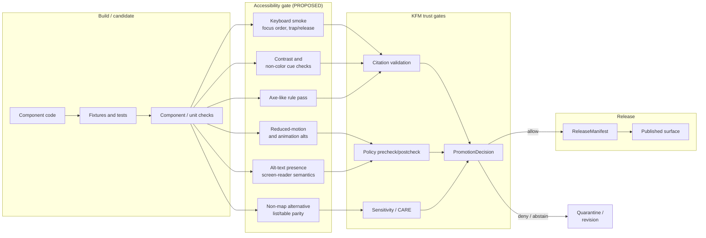

<!-- [KFM_META_BLOCK_V2]
doc_id: kfm://doc/brand-accessibility-commitments
title: Accessibility Commitments
type: standard
version: v1
status: draft
owners: <TODO: assign — likely UI Shell + Governance reviewers; see CODEOWNERS>
created: 2026-05-15
updated: 2026-05-15
policy_label: public
related:
  - docs/standards/PDF-UA.md            # PROPOSED — not yet authored
  - docs/standards/WCAG.md              # PROPOSED — not yet authored
  - docs/doctrine/trust-membrane.md     # PROPOSED path; verify against repo
  - docs/architecture/map-shell.md      # PROPOSED path; verify against repo
  - docs/brand/README.md                # PROPOSED — directory README
tags: [kfm, brand, accessibility, a11y, governance, trust-visible-states]
notes:
  - Accessibility is treated as a release/promotion gate, not a polish layer.
  - Implementation claims default to PROPOSED; no repository was mounted at authoring time.
[/KFM_META_BLOCK_V2] -->

# Accessibility Commitments

The accessibility doctrine the Kansas Frontier Matrix (KFM) public surfaces are built to meet — and the gates that prove it before anything is released.

[](#status)
[](https://www.w3.org/TR/WCAG22/)
[](#publication-grade-documents-pdfua)
[](#)
[](#)
[](#) <!-- placeholder; replace with workflow badge once CI is mounted -->

> **Status:** draft · **Owners:** `<TODO>` · **Last updated:** 2026-05-15

---

## Quick jump

- [1. Scope and authority](#1-scope-and-authority)
- [2. Commitments at a glance](#2-commitments-at-a-glance)
- [3. How accessibility sits in the trust flow](#3-how-accessibility-sits-in-the-trust-flow)
- [4. Conformance targets](#4-conformance-targets)
- [5. The eight commitment areas](#5-the-eight-commitment-areas)
- [6. Publication-grade documents (PDF/UA)](#6-publication-grade-documents-pdfua)
- [7. How these commitments are validated](#7-how-these-commitments-are-validated)
- [8. Anti-patterns](#8-anti-patterns)
- [9. Open questions and verification backlog](#9-open-questions-and-verification-backlog)
- [10. Related docs](#10-related-docs)

---

## 1. Scope and authority

This document is the canonical statement of **what KFM commits to** for accessibility across its public and semi-public surfaces. It is doctrine, not implementation: it declares the targets, the validation families, and the gate behavior. The repo evidence that proves each claim lives in `tests/`, `tools/validators/`, `policy/`, and CI workflows; this page links the doctrine to where that proof should live.

> [!IMPORTANT]
> **Accessibility is a release gate, not a polish layer.** KFM commitments below are written so that the absence of evidence (no keyboard pass, no contrast pass, no alt-text, no PDF/UA preflight) results in a release outcome of `ABSTAIN`, `DENY`, or quarantine — not a release with an inaccessibility caveat. This mirrors KFM's default-deny posture on rights, sensitivity, and evidence.

**What this doc is not.**
- It is **not** a substitute for WCAG, PDF/UA, or ARIA specifications. Those are external authorities; KFM conforms to them, does not redefine them.
- It is **not** a substitute for the **EvidenceBundle / PromotionDecision / ReleaseManifest** machinery. Accessibility passes are *one of several* gates a candidate must clear; an accessible artifact is not a released artifact.
- It is **not** a launch checklist. Per-surface checklists live alongside the surfaces they cover.

**Where this doc lives in the directory.** Per the [Directory Rules](../doctrine/directory-rules.md), `docs/brand/` is the documented home for "styles guides, logo, voice — only if not in `packages/ui/`." [CONFIRMED from `directory-rules.md` §6.1.] Accessibility commitments are voice-and-public-surface doctrine; they belong here unless a future ADR migrates them to a `packages/ui/` companion.

**Truth labels used below.** `CONFIRMED` (verified this session from project documents), `PROPOSED` (design or path not yet verified in implementation), `INFERRED`, `NEEDS VERIFICATION`, and `EXTERNAL` (sourced from authoritative external standards). Memory is not evidence.

[↑ Back to top](#accessibility-commitments)

---

## 2. Commitments at a glance

| # | Commitment | KFM doctrine basis | Gate behavior on failure |
|---|---|---|---|
| C1 | **Keyboard-only operation** of every navigation, panel, drawer, and dialog — with stable focus order and trap/release for modals | CONFIRMED doctrine (Whole-UI Report §20.1) | `ABSTAIN` / `DENY` release |
| C2 | **Non-map alternative** for every map interaction (selected features and results appear in an accessible list/table) | CONFIRMED doctrine (Whole-UI Report §20.1) | `ABSTAIN` / `DENY` release |
| C3 | **Non-color trust cues**: source role, rights, sensitivity, review, freshness, release, correction, and verification state each carry a text label | CONFIRMED doctrine (Whole-UI Report §20.1; ML-S-002, ML-061-140) | `ABSTAIN` / `DENY` release |
| C4 | **Reduced-motion mode** disables or shortens Story Node camera animation, drawer transitions, and decorative motion | CONFIRMED doctrine (Whole-UI Report §20.1; ML-059-087) | `ABSTAIN` / `DENY` release |
| C5 | **Touch / narrow viewport** keeps map, time context, drawer, and focus states usable without hiding critical trust information | CONFIRMED doctrine (Whole-UI Report §20.1) | `ABSTAIN` / `DENY` release |
| C6 | **Visible, distinguishable finite states**: loading, cancelled, denied, abstained, error, stale, and restricted are each announced and visually distinct | CONFIRMED doctrine (Whole-UI Report §20.1; ML-061-140) | `ABSTAIN` / `DENY` release |
| C7 | **Alt-text and accessible names** for all embedded images, field media, badges, and map symbols; ARIA roles where structure isn't conveyed by semantics | CONFIRMED doctrine (ML-064-059, ML-064-091, ML-057-018) | `ABSTAIN` / `DENY` release |
| C8 | **CARE labels and sovereignty notice chips** are accessible — keyboard-reachable, screen-reader-announced, contrast-passing — and never replaced by color alone | CONFIRMED doctrine (ML-061-160; Pass 10 §C15) | `DENY` release |
| C9 | **Publication-grade KFM PDFs** pass a PDF/UA preflight (tagged structure, alt-text, table headers) and the result is recorded in the artifact's sidecar | PROPOSED doctrine (Pass 10 §C13-03) | `ABSTAIN` until preflight tool/path is named |

> [!NOTE]
> "Gate behavior on failure" means the **release** outcome, not the build outcome. A surface may build and run while failing accessibility; it MUST NOT be promoted to a public release while failing. This is the same default-deny posture KFM applies to rights and sensitivity.

[↑ Back to top](#accessibility-commitments)

---

## 3. How accessibility sits in the trust flow

Accessibility is not a parallel concern to KFM's evidence-and-policy machinery. It is one of the **gates** the candidate artifact crosses before publication, alongside policy precheck, citation validation, and review state.



> [!NOTE]
> **Diagram status:** PROPOSED. The boxes labeled "Accessibility gate" describe the doctrinal target — the test families that should run before promotion — not the current repo's wired-up CI. Specific tool names (axe, Playwright, verapdf) and exact validator paths remain `NEEDS VERIFICATION` until the workflow YAMLs are inspected.

[↑ Back to top](#accessibility-commitments)

---

## 4. Conformance targets

KFM commits to specific external standards as **floors**, not ceilings. Conforming to the floor is necessary but not sufficient; the KFM commitments in §5 may impose tighter requirements (for example, *finite distinguishable states* go beyond what WCAG strictly requires).

| Surface | Standard | Level | Status |
|---|---|---|---|
| Public and semi-public web UI | **WCAG 2.2** | **AA** | EXTERNAL — current W3C Recommendation; published 5 October 2023 [](https://www.w3.org/TR/WCAG22/) |
| Public and semi-public web UI | **ARIA** (latest published) | applicable patterns | EXTERNAL — referenced via ARIA Authoring Practices |
| Reduced motion | CSS `prefers-reduced-motion` | honor user preference | EXTERNAL — well-established media query |
| Publication-grade KFM PDFs | **PDF/UA** (ISO 14289) | conformance + alt-text + table headers | PROPOSED — preflight tool/path not yet named (Pass 10 §C13-03) |
| Procurement / institutional reference | **ISO/IEC 40500:2025** | identical to WCAG 2.2 | EXTERNAL — WCAG 2.2 is an approved ISO standard: ISO/IEC 40500:2025 [](https://www.w3.org/WAI/standards-guidelines/wcag/) |

> [!TIP]
> WCAG 2.0, 2.1, and 2.2 are backward-compatible. Content that conforms to WCAG 2.2 also conforms to WCAG 2.1 and WCAG 2.0 [](https://www.w3.org/WAI/standards-guidelines/wcag/), so the WCAG 2.2 AA target satisfies older policy references without separate effort.

> [!CAUTION]
> **WCAG 3.0 is not a compliance target for KFM.** As of mid-2026, WCAG 3.0 is in active development by the W3C Accessibility Guidelines Working Group … not yet a W3C Recommendation and should not be used for compliance purposes [](https://www.thewcag.com/wcag-3-0). KFM tracks it but does not measure against it. If WCAG 3.0 reaches Recommendation status, an ADR will retarget this doc.

[↑ Back to top](#accessibility-commitments)

---

## 5. The eight commitment areas

Each subsection states the commitment, the doctrinal basis, the validation family, and the failure mode. None of the validation families below is asserted to be wired into a current CI workflow — that requires repo verification.

### 5.1 C1 — Keyboard-only operation

**Commitment.** Every navigable surface — top-level routes, panels, the Evidence Drawer, Focus Mode, layer catalog, time slider, version strip, badges, dialogs, and Story Node controls — is fully operable from the keyboard. Focus order is stable and follows DOM/reading order. Modal dialogs and the drawer **trap focus** while open and **release focus** to the prior trigger on close.

**Doctrinal basis.** [CONFIRMED] The Whole-UI Governed AI Expansion Report §20.1 states: keyboard-only route navigation and panel open/close MUST be possible; focus order MUST be stable; drawer and dialogs MUST trap/release focus correctly. The MapLibre Master S-series (ML-S-003, ML-S-011, ML-S-061) carries the same constraint as cumulative doctrine.

**Validation family.** [PROPOSED]
- Playwright keyboard-script suite traversing every navigable surface without a pointing device.
- Axe-like static check for focusable element semantics and tab order.
- Manual screen-reader pass on each canonical surface (NVDA, VoiceOver, JAWS — pick set TBD).

**Failure mode.** `ABSTAIN` or `DENY` at the promotion gate; the failing surface does not enter `ReleaseManifest`.

### 5.2 C2 — Non-map alternatives for map interactions

**Commitment.** Every consequential map interaction (feature selection, layer toggle, filter, time-slice change, search result) has a **non-map alternative** that is keyboard-reachable: the same selected features, the same result set, and the same trust-visible state appear in an accessible list or table.

**Doctrinal basis.** [CONFIRMED] Whole-UI Report §20.1: "Map interactions have non-map alternatives: selected features and results appear in a keyboard-accessible list/table."

**Why this is non-negotiable.** The map canvas is, for assistive technologies, a single image. A KFM surface that funnels evidence access through the canvas alone is, for keyboard and screen-reader users, an evidence wall. The non-map alternative is the door.

**Validation family.** [PROPOSED]
- E2E test asserts that for each canonical map interaction, a parallel non-map control produces the same outcome state.
- Screen-reader test confirms result-list announcements after each map-equivalent action.

**Failure mode.** `ABSTAIN` or `DENY`.

### 5.3 C3 — Non-color trust cues and contrast

**Commitment.** Trust-visible state — **source role, rights, sensitivity, review, freshness, release, correction**, and **verification (verified / stale / unknown / failed)** — is never carried by color alone. Each state carries:

1. A **text label** (or screen-reader-only label),
2. A **distinct shape, icon, or pattern**,
3. **WCAG 2.2 AA** contrast for the text and any meaningful glyph, and
4. A stable **accessible name** that is announced before color.

**Doctrinal basis.** [CONFIRMED] Whole-UI Report §20.1: "Trust badges do not rely on color alone; text labels are available for source role, rights, sensitivity, review, freshness, release, and correction state." MapLibre Master ML-S-002 (Non-color trust cues and contrast), ML-061-140 (unknown / stale / failed verification states need distinct visual treatment), and ML-059-071 (flood colorbars require WCAG, STAC/DCAT and provenance metadata) all carry this forward.

**Validation family.** [PROPOSED]
- Contrast checks on text, badge glyphs, focus rings, colorbars, and legends.
- Snapshot tests against high-contrast OS modes.
- Screen-reader test confirming each badge state has a unique accessible name.

**Failure mode.** `ABSTAIN` or `DENY`.

### 5.4 C4 — Reduced motion and animation alternatives

**Commitment.** When the user has `prefers-reduced-motion: reduce` set, KFM:

- Disables or shortens Story Node camera animations,
- Disables or shortens drawer/panel transitions,
- Replaces decorative motion with static or fade-only alternatives, and
- Provides text-equivalent alternatives for any motion or animation that carries information.

**Doctrinal basis.** [CONFIRMED] Whole-UI Report §20.1: "Reduced-motion mode disables or shortens Story Node camera animation and drawer transitions." MapLibre Master ML-059-087: "Motion or animation assets require alternatives, and text overlays/colorbars need WCAG contrast."

**Validation family.** [PROPOSED]
- Component tests with `prefers-reduced-motion` forced on and off.
- Visual regression that allows reduced motion to pass without animation diffs.

**Failure mode.** `ABSTAIN` or `DENY`.

### 5.5 C5 — Touch and narrow viewport

**Commitment.** On touch devices and narrow viewports:

- The map, time context, Evidence Drawer, and Focus Mode controls remain usable.
- **Critical trust information** (source role, rights, sensitivity, review, freshness, release, correction) is **never hidden** to save space — it may collapse into a disclosure or chip stack, but it MUST remain reachable.
- Hit targets meet platform minimums (WCAG 2.2 SC 2.5.8 *Target Size (Minimum)* applies).

**Doctrinal basis.** [CONFIRMED] Whole-UI Report §20.1: "Touch and narrow viewport layouts keep map, time context, drawer, and focus states usable without hiding critical trust information."

**Validation family.** [PROPOSED]
- Component tests at canonical breakpoints.
- E2E pointer-events tests on touch viewports.

**Failure mode.** `ABSTAIN` or `DENY`.

### 5.6 C6 — Visible finite states

**Commitment.** Every consequential KFM operation can produce a finite, distinguishable state. The states are:

| State | Meaning | Accessible signal |
|---|---|---|
| `LOADING` | Resolution in flight | Live-region announcement + visible busy cue |
| `CANCELLED` | User or system aborted | Live-region announcement + visible cancel cue |
| `DENIED` | Policy denial | Live-region announcement + denial reason text |
| `ABSTAINED` | Evidence insufficient | Live-region announcement + abstain reason text |
| `ERROR` | System failure | Live-region announcement + error reason text |
| `STALE` | Source/release out of freshness window | Chip + accessible name + on-focus tooltip |
| `RESTRICTED` | Rights/sensitivity withheld | Chip + accessible name + on-focus tooltip |

**Doctrinal basis.** [CONFIRMED] Whole-UI Report §20.1: "Loading, cancelled, denied, abstained, error, stale, and restricted states are announced and visibly differentiated." MapLibre Master ML-061-140: unknown, stale, or failed verification states need distinct visual treatment.

**Why this is in the accessibility doc.** Finite states are not only a trust-visibility property; they are the **only way** a non-sighted user learns that evidence was withheld or that a policy denial happened. A surface that fails silently is, accessibility-wise, lying to the assistive-technology user.

**Validation family.** [PROPOSED]
- Component tests for each state in isolation.
- Accessibility tests for live-region announcement on state transition.
- E2E tests for `ANSWER / ABSTAIN / DENY / ERROR` paths through Focus Mode.

**Failure mode.** `DENY`. (A surface that cannot show its negative states cannot be released.)

### 5.7 C7 — Alt-text and screen-reader semantics

**Commitment.** Every embedded image, field-media card, badge, legend swatch, and map symbol that conveys meaning carries an accessible name. Decorative-only images are explicitly hidden from assistive technologies. Trust badges expose their state via `aria-label` or equivalent, not via color or position. The Evidence Drawer announces opening, the active claim, and any non-trivial state change.

**Doctrinal basis.** [CONFIRMED]
- ML-064-059 — "Evidence Drawer and map popups should expose accessible descriptions. Validation: Alt-text presence and screen-reader checks."
- ML-064-091 — "Privacy-safe field media must populate alt text for map access."
- ML-057-018 — "On-map badges require accessibility and snapshot tests" (keyboard access, ARIA labels, Playwright snapshots in DoD).
- ML-S-011 — "Keyboard and ARIA requirements are [first-class]."

**Validation family.** [PROPOSED]
- Static alt-text scanner over rendered output and source descriptors.
- Axe-like check for missing accessible names on interactive elements.
- Screen-reader walkthrough script per canonical surface.

**Failure mode.** `ABSTAIN` or `DENY`. Missing alt-text on a publication-grade surface is a release blocker, not a warning.

### 5.8 C8 — CARE labels and sovereignty notices are accessible

**Commitment.** **CARE labels** and **sovereignty notice chips** — required for any surface that touches Indigenous, marginalized-community, sensitive-cultural, or sovereignty-implicating data — are themselves accessible:

- Keyboard-reachable,
- Announced by screen readers with a unique accessible name,
- Contrast-passing at WCAG 2.2 AA,
- Never carried by color alone.

The chip's presence is not optional UI chrome; it is a **policy artifact** rendered for users.

**Doctrinal basis.** [CONFIRMED]
- ML-061-160 — "CARE labels and sovereignty notice chips are required in UI."
- ML-059-029 — "Map asset metadata carries CARE status public/generalized/restricted."
- ML-059-058 — "Cultural symbol standards require neutral accessible vector symbols" (must avoid sacred symbols / tribal insignia; remain WCAG accessible; carry CARE metadata).
- Pass 10 §C15-01..03 — MetaBlock v2 CARE fields and OPA default-deny on CARE-tagged assets.

> [!IMPORTANT]
> A surface MAY render a CARE/sovereignty chip and still fail release if the chip is itself inaccessible (color-only, unannounced, unreachable). The chip is not the protection; the **gate that requires the chip plus its accessibility** is the protection.

**Failure mode.** `DENY` — not `ABSTAIN`. Inaccessible policy chrome over sensitive data is treated as failed policy display, not as a soft accessibility miss.

[↑ Back to top](#accessibility-commitments)

---

## 6. Publication-grade documents (PDF/UA)

KFM treats documentation as a build artifact subject to the same evidence discipline as data products. Publication-grade KFM PDFs commit to **PDF/UA (ISO 14289)** conformance: tagged structure, alt-text on non-decorative images, and explicit table-header markup.

**Status.** [PROPOSED] — Pass 10 §C13-03 describes the requirement but explicitly states the corpus "does not yet name the preflight tool or enforce its result in the build gate." A specific preflight tool (e.g., verapdf or commercial equivalent) and a build-gate integration are open ADR items.

**What conformance buys us.**
1. Accessibility for assistive-technology users (legal requirement for some institutional consumers).
2. Better machine indexing, search, and reflow (the discipline of tagged structure helps everyone).
3. A recordable conformance level in the artifact's sidecar manifest — turning accessibility into part of the citation chain, not a separate concern.

**Open items.** [NEEDS VERIFICATION]
- Which preflight tool will KFM pin in `tool-versions.yaml`?
- What is the minimum acceptable conformance level — full PDF/UA, partial, or structure-tags-only?
- Where does the preflight result land in the sidecar manifest? (Likely `ARTIFACT_DIGEST` companion; needs ADR.)
- Does the answer differ by audience (research vs. institutional)?

> [!NOTE]
> Until the preflight tool and gate path are named in an ADR, the C9 commitment in §2 is **published doctrine, unenforced**. Authoring teams SHOULD treat PDF/UA as the target now so that retroactive remediation does not pile up.

[↑ Back to top](#accessibility-commitments)

---

## 7. How these commitments are validated

The validation families below describe **where proof should live**, not what is currently wired. No repository was mounted at authoring time; every path and tool reference here is PROPOSED until verified against a current repo.

<details>
<summary><strong>Test families (PROPOSED)</strong></summary>

| Family | Scope | Likely tooling | Status |
|---|---|---|---|
| **Keyboard smoke** | Tab order, focus visibility, focus trap/release, no keyboard traps | Playwright keyboard script | PROPOSED |
| **Axe-like rule pass** | Static a11y rules (roles, names, contrast, landmarks) | axe-core or equivalent in Playwright | PROPOSED |
| **Contrast check** | Text, badges, focus rings, colorbars, legends | axe-core color-contrast, custom check for colorbars | PROPOSED |
| **Non-color cue check** | Every trust state has a non-color signal | Custom rule + snapshot | PROPOSED |
| **Reduced-motion check** | `prefers-reduced-motion` paths | Playwright with emulated media | PROPOSED |
| **Touch / viewport** | Canonical breakpoints; target sizes | Playwright with emulated viewports | PROPOSED |
| **Finite-state announcement** | Live-region announcement per state | Playwright + ARIA live-region observer | PROPOSED |
| **Alt-text scan** | Every meaningful image has an accessible name | Static scan + axe-core image-alt | PROPOSED |
| **Screen-reader walkthrough** | NVDA / VoiceOver / JAWS canonical scripts | Manual + recorded scripts | PROPOSED |
| **PDF/UA preflight** | Tagged structure, alt-text, table headers | verapdf or commercial equivalent | PROPOSED |

Indicative paths (all **PROPOSED**, verify against repo before citing):

```text
tests/accessibility/ui_shell_axe.spec.ts
tests/accessibility/keyboard_navigation.spec.ts
tests/accessibility/reduced_motion.spec.ts
tests/accessibility/finite_states.spec.ts
tools/validators/a11y/alt_text_present.py
tools/validators/pdf/pdfua_preflight.py
.github/workflows/ui-governed.yml          # PR-safe UI validation including a11y smoke
```

These paths are drawn from the Whole-UI Governed AI Expansion Report PROPOSED PR plan. They are **not** asserted to exist in the current repo.

</details>

<details>
<summary><strong>Where accessibility results should be recorded (PROPOSED)</strong></summary>

KFM commits to making accessibility **inspectable**, not just enforced. Per the operating doctrine that "provenance, receipts, reviews, corrections, and rollback targets should be auditable":

- The accessibility-test outcome is a **release-evidence sidecar**, alongside performance and visual-regression results. (Analogous to ML-059-057, "3D render telemetry becomes a release evidence sidecar.")
- For PDFs, the PDF/UA preflight result is recorded in the artifact's `ARTIFACT_DIGEST` sidecar (Pass 10 §C13-03 + §C13-04).
- Performance and accessibility **budgets** are registry data, not loose code constants (ML-064-024: "Performance and accessibility budgets are registry data … Budget thresholds should be release criteria for heavy map layers").

Exact home for the sidecar and the budget registry is **NEEDS VERIFICATION** pending repo inspection and any open ADRs on receipt placement.

</details>

[↑ Back to top](#accessibility-commitments)

---

## 8. Anti-patterns

> [!WARNING]
> The patterns below are **not** acceptable in KFM accessibility work. They appear here so a reviewer can call them out by name in a PR conversation.

| Anti-pattern | Why it's wrong | What to do instead |
|---|---|---|
| **Color as the only cue** for verified / stale / unknown / failed / restricted state | Excludes color-blind, low-vision, screen-reader users; fragile to OS theming | Text label + icon + accessible name + WCAG contrast |
| **Map canvas as the only path to evidence** | The canvas is a single opaque image to ATs; evidence becomes unreachable | Provide a keyboard-reachable list/table that mirrors selection state |
| **Decorative motion without a `prefers-reduced-motion` path** | Triggers vestibular symptoms; can render content unusable | Disable or shorten on `reduce`; provide text-equivalents for informative motion |
| **Alt-text autogeneration from filenames** | Produces "IMG_0431.jpg" announcements; misinforms ATs | Pull alt-text from source metadata; treat missing alt as a release blocker |
| **CARE / sovereignty chip rendered color-only** | Fails policy display for the audience most likely to need the warning | Chip + accessible name + WCAG contrast; chip is policy chrome, not decoration |
| **Silent failure on `DENY` / `ABSTAIN`** | Sighted users see "no result"; AT users hear nothing | Live-region announcement + visible state distinct from `LOADING` and `ERROR` |
| **Accessibility audit at "done" instead of at the gate** | Lets inaccessibility ship under "we'll fix it next sprint" | Gate-level enforcement; failing accessibility blocks promotion |
| **Treating WCAG conformance as proof of accessibility** | WCAG is a floor; real users encounter issues WCAG does not catch | WCAG 2.2 AA + KFM §5 commitments + manual screen-reader pass |
| **Hiding trust-visible information on narrow viewports** | Mobile users get a less-trustworthy surface; the medium becomes the policy | Collapse to disclosures/chip stacks; never hide outright |
| **PDF publication without PDF/UA preflight** | Excludes AT users; creates compliance risk for institutional consumers | Run the preflight (PROPOSED tool); record result in the sidecar |

[↑ Back to top](#accessibility-commitments)

---

## 9. Open questions and verification backlog

These are the items that prevent any commitment above from moving from **PROPOSED** to **CONFIRMED** in implementation.

- **NEEDS VERIFICATION** — Which preflight tool will be pinned for PDF/UA? (verapdf vs. commercial; ADR-class decision per Pass 10 §C13-03.)
- **NEEDS VERIFICATION** — Where does the accessibility-test result land in release evidence? Likely `data/receipts/` or `data/proofs/`, but the receipt-class home is itself an open ADR (Atlas §24.12 ADR-S-03).
- **NEEDS VERIFICATION** — Are accessibility budgets stored in `control_plane/` (e.g., a `release_state_register.yaml` companion) or in a domain-scoped registry? ML-064-024 says "registry data"; the exact path is unverified.
- **NEEDS VERIFICATION** — Which screen-reader set is canonical for the manual walkthrough — NVDA / VoiceOver / JAWS / Orca, and on which OS versions?
- **NEEDS VERIFICATION** — What is the breakpoint table for §5.5 (touch / narrow viewport)?
- **NEEDS VERIFICATION** — How are decorative-only map symbols flagged so the alt-text scanner does not produce false positives?
- **UNKNOWN** — Does any subset of KFM publication need WCAG **AAA** rather than AA? (Likely not, but no doctrine forbids choosing AAA for specific public-safety surfaces.)
- **UNKNOWN** — Where does this doc cite into a docs/standards/PDF-UA.md or docs/standards/WCAG.md companion brief once those are authored?

[↑ Back to top](#accessibility-commitments)

---

## 10. Related docs

> Links are **PROPOSED** until verified against the current repo. Replace with relative links and update CODEOWNERS where applicable.

- [`docs/doctrine/directory-rules.md`](../doctrine/directory-rules.md) — CONFIRMED path per Directory Rules §6.1; defines where this doc lives.
- [`docs/doctrine/trust-membrane.md`](../doctrine/trust-membrane.md) — PROPOSED; trust-membrane doctrine that accessibility joins as a gate.
- [`docs/doctrine/lifecycle-law.md`](../doctrine/lifecycle-law.md) — PROPOSED; lifecycle gates this doc plugs into.
- [`docs/architecture/map-shell.md`](../architecture/map-shell.md) — PROPOSED; the governed UI shell whose accessibility this doc constrains.
- [`docs/standards/WCAG.md`](../standards/WCAG.md) — PROPOSED, not yet authored; should hold the WCAG 2.2 AA crosswalk.
- [`docs/standards/PDF-UA.md`](../standards/PDF-UA.md) — PROPOSED, not yet authored; should hold the PDF/UA conformance brief.
- [`docs/brand/README.md`](./README.md) — PROPOSED; the brand directory's per-folder README per Directory Rules §15.
- [`docs/governance/`](../governance/) — review burden, separation of duties, and CODEOWNERS for accessibility-affecting changes.
- [`docs/registers/VERIFICATION_BACKLOG.md`](../registers/VERIFICATION_BACKLOG.md) — PROPOSED; the items in §9 should be entered there.

---

### Footer

> **Last updated:** 2026-05-15 · **Doc status:** draft · **Maintainer:** `<TODO>` · **Truth posture:** doctrine CONFIRMED from project documents; implementation PROPOSED pending repository verification.

[↑ Back to top](#accessibility-commitments)
