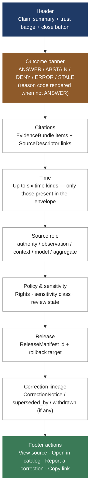

<!-- [KFM_META_BLOCK_V2]
doc_id: kfm://doc/<TODO-uuid>
title: Evidence Drawer — Microcopy & Voice Reference
type: standard
version: v1
status: draft
owners: <TODO: brand / design-system maintainers + Map Architecture Lead>
created: 2026-05-15
updated: 2026-05-15
policy_label: public
related:
  - docs/doctrine/map-first.md
  - docs/doctrine/evidence-first.md
  - docs/doctrine/policy-aware.md
  - docs/doctrine/time-aware.md
  - docs/doctrine/trust-posture.md
  - docs/doctrine/corrections-first-class.md
  - docs/doctrine/ai-as-assistant.md
  - docs/architecture/ui-trust-surface.md
  - docs/architecture/map-architecture.md
  - schemas/contracts/v1/decision_envelope.schema.json
  - schemas/contracts/v1/evidence_bundle.schema.json
  - schemas/contracts/v1/correction_notice.schema.json
  - control_plane/policy_gate_register.yaml
  - control_plane/string_registry.yaml
  - tests/ui/
  - tests/a11y/
tags: [kfm, brand, microcopy, ui, evidence-drawer, accessibility, i18n, governance]
notes:
  - Codifies the user-facing wording the Evidence Drawer renders for every envelope outcome and reason code.
  - Identifiers (outcomes, reason codes, source roles, time kinds, sensitivity classes) are CONFIRMED from prior KFM doctrine; default English wording proposed here is PROPOSED at the wording level.
  - Operator-hint authoring rules MUST be honored: a hint may describe the shape of a denial, never its contents.
  - All strings carry stable ids for translation; no string concatenation across translatable units.
[/KFM_META_BLOCK_V2] -->

# Evidence Drawer — Microcopy & Voice Reference

> **The canonical user-facing wording the KFM Evidence Drawer renders — for every section, every finite outcome, every reason code, every badge, every empty state, and every screen-reader announcement. Identifiers are governed by doctrine; wording is governed here.**


**Status:** Draft · **Owners:** _TODO brand / design-system maintainers_ <sub>NEEDS VERIFICATION</sub> · **Updated:** 2026-05-15

> [!IMPORTANT]
> The Evidence Drawer is a **trust-visible surface**, not a UI ornament. Every string in it stands for a CONFIRMED doctrinal commitment: that the click → envelope → drawer flow exposes evidence, time, source, policy, release, and correction state at the point of use. Wording must therefore be **precise, calm, specific, and non-marketing**. Polish never overrides truth, and decorative phrasing is a defect.

---

## Table of contents

1. [Purpose & scope](#1-purpose--scope)
2. [Audience and source hierarchy](#2-audience-and-source-hierarchy)
3. [Voice & tone](#3-voice--tone)
4. [Terminology rules (verbatim preservation)](#4-terminology-rules-verbatim-preservation)
5. [Drawer anatomy](#5-drawer-anatomy)
6. [Fixed section labels](#6-fixed-section-labels)
7. [Outcome microcopy: `ANSWER` / `ABSTAIN` / `DENY` / `ERROR` / `STALE`](#7-outcome-microcopy)
8. [Reason-code strings (the canonical table)](#8-reason-code-strings)
9. [Trust badge labels](#9-trust-badge-labels)
10. [Source role labels](#10-source-role-labels)
11. [Time-kind labels](#11-time-kind-labels)
12. [Sensitivity and policy posture labels](#12-sensitivity-and-policy-posture-labels)
13. [Action labels](#13-action-labels)
14. [Empty, loading, and transition states](#14-empty-loading-and-transition-states)
15. [Accessibility microcopy](#15-accessibility-microcopy)
16. [Operator-hint authoring rules](#16-operator-hint-authoring-rules)
17. [i18n & string extraction](#17-i18n--string-extraction)
18. [Indigenous and Kansas place-name handling](#18-indigenous-and-kansas-place-name-handling)
19. [Anti-patterns](#19-anti-patterns)
20. [Verification checklist](#20-verification-checklist)
21. [Related docs](#21-related-docs)

---

## 1. Purpose & scope

This document is the **canonical reference** for the wording rendered by the Evidence Drawer — the inspectable panel that opens after every governed map-feature click and that exposes claim, evidence, source, time, policy, review, release, and correction state. `[CONFIRMED role from the Map Architecture Manual and the UI Trust Surface.]`

The Drawer's **identifiers** — outcomes, reason codes, source roles, time kinds, sensitivity classes, badge keys — are owned by doctrine and contract files. **This document does not redefine them.** It owns only the user-facing **wording** keyed to those identifiers and the rules that wording must follow (voice, tone, accessibility, i18n, operator-hint authoring, place-name handling).

| In scope | Out of scope |
|---|---|
| Default English (en-US) wording for every Drawer surface. | The identifier vocabulary itself (outcomes, reason codes, etc.). |
| Stable string ids that link wording to extraction tables. | The runtime behavior of the click → envelope → drawer flow. |
| Voice, tone, and capitalization rules for Drawer text. | Visual-design tokens (colors, typography, spacing). |
| Accessibility microcopy (aria-labels, sr-only text, announcements). | Renderer choice (MapLibre / Cesium). |
| Operator-hint authoring rules (what the Drawer may *say*, not just *do*). | Schema shapes of `DecisionEnvelope`, `EvidenceBundle`, `CorrectionNotice`. |
| Indigenous and Kansas place-name display rules in the Drawer. | The source-authority records that justify those displays. |

> [!NOTE]
> The Drawer renders the **`DecisionEnvelope` payload** for the selected feature. This doc never invents content not present in the envelope. If the envelope does not carry a field, the Drawer does not display it — it does not paraphrase or guess. `[CONFIRMED from the click-to-claim flow.]`

[⬆ Back to top](#evidence-drawer--microcopy--voice-reference)

---

## 2. Audience and source hierarchy

**Primary audience.** Design-system maintainers, frontend engineers, translators, accessibility reviewers, and steward reviewers signing off on Drawer fixtures. Secondary audience: doctrine maintainers checking that wording has not drifted away from the underlying identifier vocabulary.

**Source hierarchy that applies to every claim in this doc.** `[CONFIRMED from `docs/doctrine/authority-ladder.md`.]`

| Tier | What governs the wording in this doc |
|---|---|
| **1 — Primary** | KFM doctrine docs and contracts. They fix the identifiers this microcopy operationalizes (`ANSWER`, `ABSTAIN`, `DENY`, `ERROR`, `STALE`; the reason-code vocabulary; source roles; the six time kinds; sensitivity classes `C0`–`C4`). Wording proposed here MUST NOT silently rename or merge any of these. |
| **2 — Secondary** | Repository implementation: the `string_registry.yaml` control-plane register <sub>PROPOSED path</sub>, frontend bundles, fixture tests under `tests/ui/`, and accessibility fixtures under `tests/a11y/`. Wording is *bound* to identifiers in implementation. |
| **3 — Tertiary** | External standards that govern generic technical correctness: WCAG 2.2 AA, ARIA 1.2, ISO 8601, BCP 47 language tags. Cited inline where used; never used to redefine KFM identifiers. |

> [!TIP]
> If you find a Drawer string in this document that contradicts an identifier defined in [`docs/doctrine/`](../doctrine/), treat it as a **PROPOSED CORRECTION to this doc**, not as license to soften the doctrine. Open an ADR and reflect the resolution in `control_plane/string_registry.yaml` <sub>PROPOSED path</sub>.

[⬆ Back to top](#evidence-drawer--microcopy--voice-reference)

---

## 3. Voice & tone

The Drawer speaks the way the rest of KFM speaks: **declarative, specific, evidence-grounded, calm**. It is not chatty, apologetic, or promotional. It is also never silent: every meaningful state has a visible string.

### 3.1 Voice principles

| Principle | What it means in the Drawer |
|---|---|
| **Calm and factual** | Report the state. Don't dramatize it. *"This claim is published."* — not *"Great news!"* |
| **Specific, not generic** | Name the missing piece. *"Citation is missing for this claim."* — not *"Something went wrong."* |
| **Never apologize for governance** | `ABSTAIN` and `DENY` are first-class trust signals, not failures to excuse. Do **not** open them with *"Sorry,"* or *"Unfortunately,"*. `[CONFIRMED anti-pattern from `map-first.md` §10.]` |
| **One claim per sentence** | A sentence asserts at most one fact. Reason, time, and source go in separate fields, not in one comma-spliced run-on. |
| **Plain English at a 9th-grade reading level for public surfaces** | Steward and admin surfaces may use schema names directly; the public Drawer renders the human-readable label. |
| **Evidence-respectful** | Never imply that a public-safe generalization is the *full* picture. The Drawer says what the released layer represents, not what is being protected. |
| **Reproducible** | The same envelope produces the same Drawer text, every time, in every locale that has translations. Wording must not depend on time-of-day, randomization, or model output. |

### 3.2 Tone do's and don'ts

> [!CAUTION]
> Marketing-flavored microcopy is a doctrine violation in trust-visible surfaces. The Drawer is not a product page; it is part of the trust contract.

**Do**

- *"This claim is published under release `rel-2026-04-hydrology`."*
- *"Citation is missing. The Drawer cannot summarize a claim without at least one resolved `EvidenceBundle`."*
- *"Exact geometry is restricted (sensitivity class C4). A generalized public-safe layer is available."*
- *"Last fresh release: 2024-09-12. Marked `STALE`."*

**Don't**

- *"Oops! Something went wrong."* — vague, apologetic, hides the trust signal.
- *"We couldn't find any evidence."* — first person plural; vague; suggests system failure when it is governed abstention.
- *"This dataset is super reliable."* — promotional; not evidence.
- *"Click here for more."* — non-descriptive link text; fails WCAG 2.4.4.

### 3.3 Capitalization, casing, and punctuation

| Rule | Example |
|---|---|
| **Sentence case** for UI labels and headings (not title case). | `Citations`, `Source role`, `Last fresh release` |
| **Verbatim casing** for KFM identifiers and contract names. | `EvidenceBundle`, `EvidenceRef`, `SourceDescriptor`, `CorrectionNotice`, `ReleaseManifest`, `DecisionEnvelope`. **Never** `evidence bundle` or `Correction Notice`. |
| **Uppercase** for finite outcomes and lifecycle stages. | `ANSWER`, `ABSTAIN`, `DENY`, `ERROR`, `STALE`; `RAW`, `WORK`, `QUARANTINE`, `PROCESSED`, `CATALOG`, `TRIPLET`, `PUBLISHED`. |
| **Dotted lowercase** for reason codes; render in monospace where possible. | `policy.sensitive_geometry`, `evidence.missing`, `release.withdrawn`. |
| **ISO 8601** for raw timestamps in `aria-label` and copy-to-clipboard text; locale-formatted in the visible label. | `aria-label="Observed time: 1951-07-14"`; visible `"Observed: July 14, 1951"`. |
| **Numerals throughout** (not spelled out) for compact UI consistency across locales. | `3 citations`, not `three citations`. |
| **No exclamation marks** in trust-visible surfaces. | — |

[⬆ Back to top](#evidence-drawer--microcopy--voice-reference)

---

## 4. Terminology rules (verbatim preservation)

The following terms appear in the Drawer **verbatim**. Translation may localize them; English microcopy **MUST NOT** paraphrase them. `[CONFIRMED rule from `docs/doctrine/trust-posture.md` and the authority ladder.]`

| Verbatim term | What microcopy MUST NOT do |
|---|---|
| `EvidenceBundle`, `EvidenceRef`, `SourceDescriptor`, `ReleaseManifest`, `CorrectionNotice`, `DecisionEnvelope`, `RollbackPlan` | Do not lowercase, hyphenate, space-separate, or translate into "evidence record," "citation block," etc. |
| `ANSWER` · `ABSTAIN` · `DENY` · `ERROR` · `STALE` | Do not soften to "no result," "blocked," "failed," "outdated." |
| `RAW` · `WORK` · `QUARANTINE` · `PROCESSED` · `CATALOG` · `TRIPLET` · `PUBLISHED` | Do not collapse stages or invent intermediate names. |
| Source roles: `authority`, `observation`, `context`, `model`, `aggregate`, `admin`, `candidate` | Do not merge `authority` with `observation` or treat `model` as `observation`. |
| Time kinds: source, observed, valid, retrieval, release, correction | Do not flatten to "date." The Drawer always says **which** time it is showing. |
| Sensitivity classes: `C0`, `C1`, `C2`, `C3`, `C4` | Do not paraphrase as "low/medium/high sensitivity" in the Drawer; show the class and the human-readable label together. |

> [!WARNING]
> If an external i18n style guide recommends paraphrasing schema names into "user-friendly" prose, that guide does **not** apply to KFM identifier vocabulary. KFM terminology is Tier-1 doctrine and outranks Tertiary style advice.

[⬆ Back to top](#evidence-drawer--microcopy--voice-reference)

---

## 5. Drawer anatomy

The Drawer renders the resolved `DecisionEnvelope` for a selected feature. Sections are always rendered in the same order so that screen-reader users and visual users read the same document. Sections that have no envelope-backed content are **hidden, not stubbed with placeholder prose**.



`[Anatomy CONFIRMED from `docs/architecture/ui-trust-surface.md` <sub>NEEDS VERIFICATION — exact path</sub>; ordering PROPOSED at this granularity.]`

[⬆ Back to top](#evidence-drawer--microcopy--voice-reference)

---

## 6. Fixed section labels

The headings inside the Drawer are stable strings. Translators receive them via the string registry. Engineers do not author new section labels at the call site.

| Stable string id | Default English (en-US) | Renders when |
|---|---|---|
| `drawer.header.title` | *Claim* | Always; followed by the claim summary. |
| `drawer.header.close` | *Close* (`aria-label="Close evidence drawer"`) | Always. |
| `drawer.section.citations` | *Citations* | Envelope contains ≥1 `EvidenceBundle`. |
| `drawer.section.time` | *Time* | Envelope contains ≥1 of the six time kinds. |
| `drawer.section.source` | *Source* | Envelope carries a `SourceDescriptor`. |
| `drawer.section.policy` | *Policy & sensitivity* | Envelope carries rights / sensitivity / review state. |
| `drawer.section.release` | *Release* | Envelope carries a `ReleaseManifest` reference. |
| `drawer.section.correction` | *Correction lineage* | Envelope carries `CorrectionNotice`, `superseded_by`, or `withdrawn`. |
| `drawer.section.actions` | *Actions* | Always (≥1 action available). |

> [!NOTE]
> Section labels are **headings**, not button text. They render as `<h3>` elements inside the Drawer and contribute to the document outline used by screen readers. `[CONFIRMED accessibility commitment from prior UI Architecture work.]`

[⬆ Back to top](#evidence-drawer--microcopy--voice-reference)

---

## 7. Outcome microcopy

The Drawer's outcome banner renders the envelope's finite outcome as a fixed string keyed to the outcome value, followed by a reason code (where applicable) and an operator hint. The outcome value itself is rendered verbatim (`ANSWER` / `ABSTAIN` / `DENY` / `ERROR` / `STALE`).

### 7.1 Banner copy by outcome

| Outcome | Banner heading (`drawer.outcome.*.heading`) | Banner body (`drawer.outcome.*.body`) |
|---|---|---|
| `ANSWER` | *Published claim* | *This claim is published under `{release_id}`. Citations and source are below.* |
| `ABSTAIN` | *Not enough to answer* | *KFM declines to answer: `{reason_code}`. {operator_hint}* |
| `DENY` | *Not available* | *This request is denied by policy: `{reason_code}`. {operator_hint}* |
| `ERROR` | *System problem* | *A system check failed: `{reason_code}`. The on-call team has been notified.* |
| `STALE` | *Past freshness window* | *Marked `STALE`. Last fresh release: `{last_fresh_release_id}` on `{last_fresh_date}`. A pending correction may be in progress.* |

`[Outcome vocabulary CONFIRMED; per-outcome wording PROPOSED at implementation level.]`

### 7.2 Why the wording reads the way it does

> [!IMPORTANT]
> **`ABSTAIN` and `DENY` are not error states.** They are first-class signals that the Drawer is honoring the trust contract. Their headings therefore do **not** read *"Error"*, *"Failed"*, or *"Sorry"*. They report the state and the reason — nothing more, nothing less. `[CONFIRMED anti-pattern: "Loading… spinner that hides an `ERROR` outcome" from `map-first.md` §12.]`

`ERROR`, by contrast, **is** a system condition that requires operator attention. Its wording is calm but unambiguous, and it never masquerades as a `DENY` (or vice versa). Conflating them in copy is a defect.

[⬆ Back to top](#evidence-drawer--microcopy--voice-reference)

---

## 8. Reason-code strings

The reason-code vocabulary is **finite and stable**. `[CONFIRMED from the runtime envelope catalogue + `policy_gate_register.yaml` <sub>PROPOSED path</sub>.]` New conditions ADD codes; they do not paraphrase existing ones. This section binds each CONFIRMED code to a stable string id and a default English label.

> [!NOTE]
> The **identifiers** in the first column are CONFIRMED. The **default wording** in the third column is PROPOSED at the wording level and is the work product of this document. Translators key off the string id, never the English text.

### 8.1 `ABSTAIN` reason codes

| Reason code | String id | Default English (en-US) |
|---|---|---|
| `evidence.unresolved` | `drawer.reason.evidence.unresolved` | *The `EvidenceBundle` for this claim could not be resolved.* |
| `evidence.missing` | `drawer.reason.evidence.missing` | *No citation is attached to this claim.* |
| `evidence.scope_mismatch` | `drawer.reason.evidence.scope_mismatch` | *Available evidence does not match the requested scope.* |
| `time.unsupported_window` | `drawer.reason.time.unsupported_window` | *This time window is not supported by the layer's evidence.* |
| `time.out_of_scope` | `drawer.reason.time.out_of_scope` | *The selected time falls outside this layer's time scope.* |
| `freshness.stale` | `drawer.reason.freshness.stale` | *Supporting evidence is past its freshness window.* |

### 8.2 `DENY` reason codes

| Reason code | String id | Default English (en-US) |
|---|---|---|
| `policy.sensitive_geometry` | `drawer.reason.policy.sensitive_geometry` | *Exact geometry is restricted. A public-safe generalization may be available.* |
| `policy.rights_unclear` | `drawer.reason.policy.rights_unclear` | *Source rights are not clear enough to publish this claim.* |
| `policy.no_raw_public` | `drawer.reason.policy.no_raw_public` | *Raw source material is not exposed on public surfaces.* |
| `policy.no_public_model` | `drawer.reason.policy.no_public_model` | *Direct model output is not exposed on public surfaces. Use Focus Mode for governed AI assistance.* |
| `policy.living_person` | `drawer.reason.policy.living_person` | *This claim concerns a living person and is not publicly displayed.* |
| `release.unpublished` | `drawer.reason.release.unpublished` | *This claim exists only as a candidate. It has not been released.* |
| `release.unreviewed` | `drawer.reason.release.unreviewed` | *This claim has not been reviewed for public release.* |
| `release.withdrawn` | `drawer.reason.release.withdrawn` | *This claim has been withdrawn. See the correction notice for details.* |
| `release.superseded` | `drawer.reason.release.superseded` | *This claim has been superseded. See the newer release for the current statement.* |

### 8.3 `ERROR` reason codes

| Reason code | String id | Default English (en-US) |
|---|---|---|
| `system.upstream_unavailable` | `drawer.reason.system.upstream_unavailable` | *A required upstream service is unreachable.* |
| `system.integrity_failure` | `drawer.reason.system.integrity_failure` | *A hash or signature check failed.* |
| `system.unknown` | `drawer.reason.system.unknown` | *A system check failed for an unspecified reason.* |

### 8.4 `STALE` modifiers

`STALE` is a per-claim modifier that can co-occur with `ANSWER` or stand alone. The Drawer always shows the **last fresh release** and the **freshness window** alongside the modifier.

| String id | Default English (en-US) |
|---|---|
| `drawer.stale.heading` | *Past freshness window* |
| `drawer.stale.last_fresh` | *Last fresh release: `{release_id}` on `{date}`* |
| `drawer.stale.window` | *Freshness window: `{duration_human}`* |
| `drawer.stale.pending` | *A correction is pending. Recheck after `{pending_release_id}`.* |

> [!CAUTION]
> `STALE` is not "old." It is a CONFIRMED trust state. The Drawer **never** removes `STALE` by being scrolled past — it persists until either a new release refreshes the data or a `CorrectionNotice` records the withdrawal. `[CONFIRMED from `map-first.md` §7.2.]`

[⬆ Back to top](#evidence-drawer--microcopy--voice-reference)

---

## 9. Trust badge labels

Trust badges sit in the Drawer header and on layer cards. Each badge has **visible text or a programmatically associated `aria-label`** — color alone never carries the signal. `[CONFIRMED accessibility commitment.]`

| Badge id | Visible text (en-US) | `aria-label` | Renders when |
|---|---|---|---|
| `badge.released` | *Released* | *Released claim* | Envelope outcome `ANSWER` and a `ReleaseManifest` is bound. |
| `badge.reviewed` | *Reviewed* | *Reviewed by `{steward_role}` on `{date}`* | Review state is `reviewed` in the envelope. |
| `badge.confirmed` | *Confirmed* | *Confirmed claim* | Truth label on the underlying claim is `CONFIRMED`. |
| `badge.proposed` | *Proposed* | *Proposed claim, not yet released* | Truth label is `PROPOSED`. (Steward / admin surfaces only.) |
| `badge.stale` | *Stale* | *Past freshness window* | Outcome carries `STALE`. |
| `badge.generalized` | *Generalized* | *Public-safe generalization* | A `Generalization Transform` receipt is present. |
| `badge.restricted` | *Restricted* | *Exact data restricted by policy* | Sensitivity class is C3 or C4 and the layer is the public-safe derivative. |
| `badge.observation` | *Observation* | *Source role: observation* | Source role is `observation`. |
| `badge.authority` | *Authority* | *Source role: authority* | Source role is `authority`. |
| `badge.model` | *Model* | *Source role: model (governed AI assist)* | Source role is `model`; only ever rendered on steward / admin surfaces and inside Focus Mode. `[CONFIRMED from `ai-as-assistant.md`.]` |
| `badge.withdrawn` | *Withdrawn* | *Withdrawn — see correction notice* | Release state is `release.withdrawn`. |

> [!WARNING]
> A badge that renders as **color only** (e.g., a green dot with no text or `aria-label`) is a `[CONFIRMED anti-pattern.]` Color may *augment* the badge; it must never be the only signal. `[Source: `map-first.md` §12 anti-patterns + WCAG 1.4.1.]`

[⬆ Back to top](#evidence-drawer--microcopy--voice-reference)

---

## 10. Source role labels

The source-role taxonomy is fixed. The Drawer renders the role both as a badge and as a textual label inside the *Source* section.

| Source role (identifier) | Visible label (en-US) | One-line explanation |
|---|---|---|
| `authority` | *Authority source* | A source whose role is to **decide** what is canonical for a domain (e.g., USGS for streamgage identifiers). |
| `observation` | *Observation source* | A source recording **what was observed** at a time and place (e.g., NWIS gage readings, NOAA station records). |
| `context` | *Context source* | A source providing **background, narrative, or interpretive material** that contextualizes a claim. |
| `model` | *Model source* | A source produced by a **model or computation**. Never used as standalone evidence on public surfaces; always paired with the underlying observations. `[CONFIRMED from `ai-as-assistant.md`.]` |
| `aggregate` | *Aggregate source* | A source that **combines** material from multiple upstream sources. The Drawer must preserve the chain back to the underlying sources. |
| `admin` | *Administrative source* | A source produced by KFM stewards or administrators (e.g., release manifests, correction notices). |
| `candidate` | *Candidate source* | A source not yet reviewed for public release. Renders on steward / admin surfaces only. |

> [!NOTE]
> Roles are **never collapsed** in the Drawer. *"From a study"* is not a permitted summary; the Drawer says which role the source plays. `[CONFIRMED from `evidence-first.md` §6.]`

[⬆ Back to top](#evidence-drawer--microcopy--voice-reference)

---

## 11. Time-kind labels

The six time kinds are CONFIRMED doctrine. `[Source: `map-first.md` §7.1 and `time-aware.md` <sub>NEEDS VERIFICATION — exact filename</sub>.]` Each time kind has a fixed Drawer label. The Drawer **never** renders a single ambiguous "date" field when multiple kinds are material.

| Time kind | Visible label (en-US) | What it answers | Envelope field |
|---|---|---|---|
| Source time | *Source time* | When the source artifact was authored or published. | `SourceDescriptor.source_time` |
| Observed time | *Observed time* | When the underlying observation happened in the world. | `EvidenceBundle.observed_time` |
| Valid time | *Valid time* | The time window for which the claim is intended to hold. | `EvidenceBundle.valid_time` |
| Retrieval time | *Retrieval time* | When KFM fetched the artifact from its source. | `SourceDescriptor.retrieval_time` |
| Release time | *Release time* | When the `ReleaseManifest` carrying the layer was issued. | `ReleaseManifest.released_at` |
| Correction time | *Correction time* | When a `CorrectionNotice` against the claim was issued. | `CorrectionNotice.issued_at` |

### 11.1 Formatting rules

- **Visible label**: locale-formatted date or date range. Example en-US: *Observed: July 14, 1951*.
- **`aria-label`**: ISO 8601 form for unambiguous screen-reader output. Example: `aria-label="Observed time: 1951-07-14"`.
- **Time zone**: explicitly rendered when present in the envelope (e.g., `2026-04-15T14:32:00-05:00` → *April 15, 2026 at 2:32 PM CDT*). The Drawer never silently drops the zone.
- **Unknown precision**: render only the precision the envelope carries. If the envelope carries year-only, the Drawer renders *1951* — not *January 1, 1951*. `[CONFIRMED rule — guessing precision is a doctrine violation.]`

[⬆ Back to top](#evidence-drawer--microcopy--voice-reference)

---

## 12. Sensitivity and policy posture labels

The *Policy & sensitivity* section renders three sub-rows — rights, sensitivity class, review state — when the envelope carries them.

### 12.1 Rights

| String id | Default English (en-US) |
|---|---|
| `drawer.rights.public_domain` | *Rights: public domain* |
| `drawer.rights.cc_by` | *Rights: CC BY `{version}` — attribution required* |
| `drawer.rights.cc_by_sa` | *Rights: CC BY-SA `{version}` — share-alike* |
| `drawer.rights.licensed` | *Rights: licensed — see source for terms* |
| `drawer.rights.unclear` | *Rights: unclear — claim not publicly published* (only shown to stewards) |

### 12.2 Sensitivity classes

| Class | Visible label (en-US) | One-line explanation |
|---|---|---|
| `C0` | *C0 — public-safe* | No sensitive content; safe for public surfaces. |
| `C1` | *C1 — public with attribution* | Public-safe with attribution obligations. |
| `C2` | *C2 — public-generalized* | Generalized derivative is public; exact form is not. |
| `C3` | *C3 — steward-only* | Exact form available to stewards under access role. |
| `C4` | *C4 — restricted* | Exact form denied to all public surfaces; public generalization may exist. |

`[Class identifiers CONFIRMED from the Data Classification Framework; labels PROPOSED at wording level.]`

### 12.3 Review state

| String id | Default English (en-US) |
|---|---|
| `drawer.review.reviewed` | *Reviewed by `{steward_role}` on `{date}`* |
| `drawer.review.in_review` | *In steward review* (steward / admin only) |
| `drawer.review.not_reviewed` | *Not yet reviewed* (steward / admin only) |

> [!IMPORTANT]
> The Drawer **never** shows raw C3 or C4 content on a public surface. When a user clicks a sensitive feature on a public layer, the envelope resolves to `DENY policy.sensitive_geometry` and the Drawer explains the policy and points to the public-safe generalization. The exact coordinates do **not** enter the response payload. `[CONFIRMED from `map-first.md` worked example, step 6.]`

[⬆ Back to top](#evidence-drawer--microcopy--voice-reference)

---

## 13. Action labels

Actions appear in the Drawer footer. Each is a button or link with a fixed string id, an `aria-label` where the visible text is not self-describing, and a stable target.

| String id | Visible text (en-US) | `aria-label` | Target |
|---|---|---|---|
| `drawer.action.view_source` | *View source* | *View the original source for this claim* | `SourceDescriptor.source_url` |
| `drawer.action.open_in_catalog` | *Open in catalog* | *Open this claim's catalog record* | Catalog deep-link |
| `drawer.action.report_correction` | *Report a correction* | *Open the correction form for this claim* | Correction form route |
| `drawer.action.copy_link` | *Copy link* | *Copy a permalink to this claim* | Permalink to the claim with `release_id` |
| `drawer.action.see_generalized` | *See public-safe layer* | *Open the generalized public-safe version of this layer* | Only on `DENY policy.sensitive_geometry` where a generalization exists. |
| `drawer.action.see_superseding` | *See current release* | *Open the release that supersedes this one* | Only on `release.superseded`. |
| `drawer.action.see_correction` | *See correction notice* | *Open the correction notice for this claim* | Only on `release.withdrawn` or where a `CorrectionNotice` is bound. |
| `drawer.action.close` | *Close* | *Close evidence drawer* | Closes the Drawer; returns focus to the originating feature. |

> [!NOTE]
> Action labels are **verbs**, never *"Click here"* or *"More info."* Non-descriptive link text fails WCAG 2.4.4 and is a `[CONFIRMED anti-pattern.]`

[⬆ Back to top](#evidence-drawer--microcopy--voice-reference)

---

## 14. Empty, loading, and transition states

The Drawer never renders a "generic spinner" that hides a finite outcome. `[CONFIRMED anti-pattern from `map-first.md` §10.]` Each transition state has named copy.

| State | String id | Default English (en-US) |
|---|---|---|
| Opening, envelope not yet returned | `drawer.transition.opening` | *Resolving evidence…* |
| Envelope returned, citation block hydrating | `drawer.transition.citations_loading` | *Loading citations…* |
| Action triggered, awaiting confirmation | `drawer.transition.action_pending` | *Working…* |
| Drawer dismissed by user | `drawer.transition.closing` | *(silent)* |
| Envelope returned but section has no content | (no string — hide the section) | — |

> [!CAUTION]
> A spinner that runs longer than ~3 seconds without a state change should escalate to an explicit `ERROR system.upstream_unavailable` outcome. Indefinite spinners hide trust failures and are themselves a defect. `[CONFIRMED from `map-first.md` finite-outcomes section.]`

[⬆ Back to top](#evidence-drawer--microcopy--voice-reference)

---

## 15. Accessibility microcopy

The Drawer must satisfy **WCAG 2.2 AA**. `[CONFIRMED conformance target.]` Microcopy carries part of that obligation: badges have text, regions are labeled, state changes are announced, and focus is managed.

### 15.1 Required `aria-` strings

| Element | String id | Default English (en-US) |
|---|---|---|
| Drawer landmark | `drawer.aria.region` | *Evidence drawer* (`role="dialog"`, `aria-labelledby="{header-id}"`) |
| Outcome banner | `drawer.aria.outcome` | *Outcome: `{outcome_value}`* (live region, `aria-live="polite"`) |
| Reason code | `drawer.aria.reason` | *Reason: `{reason_code_label}`* |
| Trust badge | `drawer.aria.badge.{badge_id}` | Per row in §9. |
| Time field | `drawer.aria.time.{time_kind}` | Per row in §11 — always ISO 8601 in the `aria-label`. |
| Close button | `drawer.aria.close` | *Close evidence drawer* |
| Citation list | `drawer.aria.citations` | *`{n}` citations* |

### 15.2 Screen-reader announcements

The Drawer is a live region. On open, the screen reader announces:

> *Evidence drawer opened. Outcome: `{outcome_value}`. Reason: `{reason_code_label}`. `{n}` citations.*

On a state change inside the Drawer (e.g., a correction notice loads asynchronously), the live region announces:

> *Drawer update: `{change_description}`.*

> [!TIP]
> Screen-reader announcements should be **short and decisive**. They are not the place to repeat the entire envelope. The list of citations and time-kind details remain navigable as regular structured content. `[CONFIRMED accessibility commitment.]`

### 15.3 Focus management

- On open, focus moves to the Drawer header.
- The Drawer **traps focus** while open (WCAG 2.4.3, 2.4.7). `[CONFIRMED from prior UI Architecture work.]`
- On close (via Escape, the close button, or programmatic dismissal), focus returns to the originating feature.

### 15.4 Reduced motion

- `prefers-reduced-motion: reduce` MUST disable Drawer slide-in animation and any badge pulse / pulse-on-load.
- The `STALE` and `correction-pending` indicators MUST NOT rely on motion to convey state. `[CONFIRMED from prior accessibility work.]`

### 15.5 Non-visual evidence summary

A separate **non-visual evidence summary view** lists all currently visible claims with their full text. The Drawer's *Actions* footer includes a link to this view (`drawer.action.text_summary` → *Open text summary*). `[CONFIRMED commitment from prior UI Architecture work.]`

[⬆ Back to top](#evidence-drawer--microcopy--voice-reference)

---

## 16. Operator-hint authoring rules

The **operator hint** is a short string the envelope builder attaches to non-`ANSWER` outcomes to help the user (or operator) understand what to do next. The Drawer renders it inside the outcome banner.

> [!IMPORTANT]
> **Operator hints must never leak the very thing the policy denies.** `[CONFIRMED doctrine from `policy-aware.md` §10.]` A hint describes the **shape** of the denial — the route, the input class, the rough remediation — never the contents.

### 16.1 The leak-test

Before any hint string is shipped, run it through the **leak-test**:

1. Cover the reason code.
2. Read only the hint.
3. Could a hostile reader deduce the protected content from the hint alone?

If the answer is *yes* (or *maybe*), the hint is a defect.

### 16.2 Good and bad hints

| Reason code | ❌ Leaky hint | ✅ Safe hint |
|---|---|---|
| `policy.sensitive_geometry` | *Site is at 38.95°N, 95.25°W.* | *Exact site geometry is not public. A public-safe generalized layer is available.* |
| `policy.living_person` | *John Doe is currently living in Topeka.* | *This record concerns a living person and is not publicly displayed.* |
| `policy.rights_unclear` | *The vendor invoice from 2014 prohibits redistribution.* | *Source rights are not clear enough to publish this claim.* |
| `release.withdrawn` | *We pulled this after the lawsuit settled.* | *This claim has been withdrawn. The correction notice explains why.* |
| `system.integrity_failure` | *The tile hash `a1b2…f9` did not match.* | *A hash check failed. The on-call team has been notified.* |

### 16.3 Hint authoring checklist

- [ ] Hint references the **shape** of the denial, not its contents.
- [ ] Hint does not name a person, place, address, file, hash, or coordinate that the policy is protecting.
- [ ] Hint tells the user a **safe next step** when one exists (e.g., *"a generalized layer is available"*).
- [ ] Hint fits in one short sentence.
- [ ] Hint terminates with a period; no exclamation points; no emoji.

[⬆ Back to top](#evidence-drawer--microcopy--voice-reference)

---

## 17. i18n & string extraction

All Drawer strings extract to a translation table keyed by **stable string id**. The English text in this document is the **source-of-truth English locale**, not a free-form authoring suggestion at the call site.

### 17.1 Rules

- **One string id per surface.** `drawer.reason.policy.sensitive_geometry` is one row. There is not a separate id for the banner, the badge, and the aria-label of the same code; they are derived attributes on a single row.
- **No concatenation across translatable units.** `[CONFIRMED rule from prior UI Architecture work.]` A sentence is one unit. *"Reviewed by " + steward_role + " on " + date* is **not allowed**. Use `drawer.review.reviewed = "Reviewed by {steward_role} on {date}"` with named placeholders.
- **Locale-aware formatters for dates, times, numbers, and units.** The raw value is unit-pinned; the locale layer formats. `[CONFIRMED from prior UI Architecture work.]`
- **`lang` attribute respected.** Every string is rendered with the correct `lang` attribute; future translations declare `lang` per locale. Source-language metadata MAY be included in evidence payloads.
- **RTL support.** The layout supports `dir="rtl"`; the Drawer does not assume left-to-right reading order. `[CONFIRMED from prior UI Architecture work.]`
- **Pluralization.** Use ICU-style plural rules (`{n, plural, one {1 citation} other {# citations}}`). Never hand-roll plurals across locales.
- **No translator notes inside the string.** Notes live next to the string id in the registry, not in the rendered text.

### 17.2 Stable string id format

```text
drawer.<section>.<key>[.<modifier>]
```

| Section | Examples |
|---|---|
| `outcome` | `drawer.outcome.answer.heading`, `drawer.outcome.deny.body` |
| `reason` | `drawer.reason.policy.sensitive_geometry`, `drawer.reason.evidence.missing` |
| `badge` | `drawer.badge.released`, `drawer.badge.stale` |
| `action` | `drawer.action.view_source`, `drawer.action.report_correction` |
| `aria` | `drawer.aria.region`, `drawer.aria.close` |
| `transition` | `drawer.transition.opening`, `drawer.transition.citations_loading` |

### 17.3 Registry placement

<details>
<summary><b>String registry layout (PROPOSED)</b></summary>

```yaml
# control_plane/string_registry.yaml — PROPOSED path
# Locale: en-US is the source-of-truth; other locales translate by string id.
drawer:
  outcome:
    answer:
      heading: "Published claim"
      body: "This claim is published under {release_id}. Citations and source are below."
    abstain:
      heading: "Not enough to answer"
      body: "KFM declines to answer: {reason_code}. {operator_hint}"
    deny:
      heading: "Not available"
      body: "This request is denied by policy: {reason_code}. {operator_hint}"
    error:
      heading: "System problem"
      body: "A system check failed: {reason_code}. The on-call team has been notified."
    stale:
      heading: "Past freshness window"
      body: "Marked STALE. Last fresh release: {last_fresh_release_id} on {last_fresh_date}."
  reason:
    evidence:
      unresolved: "The EvidenceBundle for this claim could not be resolved."
      missing: "No citation is attached to this claim."
      scope_mismatch: "Available evidence does not match the requested scope."
    policy:
      sensitive_geometry: "Exact geometry is restricted. A public-safe generalization may be available."
      rights_unclear: "Source rights are not clear enough to publish this claim."
      # … remaining rows from §8 …
```

</details>

> [!NOTE]
> Path `control_plane/string_registry.yaml` is **PROPOSED** at this granularity. If the repo already has a translations directory under a different path (e.g., `apps/web/src/locales/`), the registry rule still holds — only the location changes.

[⬆ Back to top](#evidence-drawer--microcopy--voice-reference)

---

## 18. Indigenous and Kansas place-name handling

Kansas place names frequently have multiple authoritative forms — colonial, Indigenous, and historical-period. The Drawer's commitment is to **display both colonial and Indigenous names where the source authority recognizes both**, with the authority recorded. `[CONFIRMED from prior UI Architecture work.]`

### 18.1 Display rules

| Situation | What the Drawer renders |
|---|---|
| Source authority records both names | Both names rendered side-by-side; primary display order taken from the source authority's record. |
| Source authority records only one name | That name only; the Drawer does not invent a second. |
| Names conflict between sources | Both rendered; the *Source* section shows each authority separately. The Drawer does **not** silently pick a winner. |
| Indigenous name is recorded with diacritics or non-Latin script | Rendered with `lang` attribute set to the recorded language code (BCP 47). |

### 18.2 Authority recording

> [!IMPORTANT]
> The Drawer **never** asserts that one place name is "the" name. The relevant authority is recorded in the `SourceDescriptor` for each form, and the Drawer surfaces the authority. Smoothing this over with an editorial choice is a `[CONFIRMED doctrine violation.]`

### 18.3 Examples (illustrative)

| Scenario | Drawer display |
|---|---|
| A site recorded by the Kaw Nation tribal historic preservation office and by USGS GNIS | *Pahą́cȟaŋ (Kanza, Kaw Nation THPO) / Wabaunsee County, KS (USGS GNIS, 1953)* |
| A river named only in USGS GNIS | *Solomon River (USGS GNIS, 1968)* |
| A place name in dispute between two recorded authorities | *Name A (Authority X, `{date}`) / Name B (Authority Y, `{date}`) — see Source section for each authority.* |

> [!TIP]
> Indigenous-name display is a place where editorial instinct frequently wants to "clean up" — *e.g.*, by choosing the more familiar form. Resist. The KFM Drawer's job is to **show** the multiplicity that the source record carries, not to flatten it.

[⬆ Back to top](#evidence-drawer--microcopy--voice-reference)

---

## 19. Anti-patterns

Each row below is a `[CONFIRMED anti-pattern]` either from prior KFM doctrine work or from this document.

| Anti-pattern | Why it is wrong | Corrective rule |
|---|---|---|
| Banner reads *"Sorry, something went wrong"* for an `ABSTAIN`. | Apologizes for a first-class trust signal; hides the reason code. | §7.2; §3.2. |
| `Reason: policy.sensitive_geometry` rendered without an operator hint. | Leaves the user without a safe next step. | §16. |
| Operator hint reads *"Exact coordinates are 38.95°N, 95.25°W."* | Leaks the very thing the policy denies. | §16 leak-test. |
| Trust badge rendered as a green dot with no text or `aria-label`. | Color alone fails WCAG 1.4.1 and is a `[CONFIRMED anti-pattern.]` | §9; §15. |
| Drawer renders a single "date" field where multiple time kinds are material. | Conflates the six time kinds — a `[CONFIRMED doctrine violation.]` | §11. |
| Indefinite spinner that masks an `ERROR system.upstream_unavailable`. | Hides the trust failure behind a loading state. | §14. |
| Indigenous and colonial names rendered with one quietly chosen as primary, without an authority record. | Editorial flattening of a multi-source record. | §18. |
| `Click here` as link text. | Non-descriptive link text; fails WCAG 2.4.4. | §13. |
| Drawer renders a `model` source role on a public surface without the underlying observations. | Direct model output on a public surface — `[CONFIRMED violation of `ai-as-assistant.md`.]` | §10. |
| Drawer summarizes a withdrawn claim as if it were current, with a small "(withdrawn)" appendix. | Demotes correction state to decoration. | §8.2; §9. |
| Inline string concatenation across translatable units (e.g., `"Reviewed by " + role + " on " + date`). | Breaks translation; produces grammatically wrong output in non-English locales. | §17.1. |

[⬆ Back to top](#evidence-drawer--microcopy--voice-reference)

---

## 20. Verification checklist

Before any Drawer fixture or release ships, the following must be verifiable. `[PROPOSED at implementation level; rules CONFIRMED.]`

- [ ] Every visible string in the Drawer is bound to a stable string id in the registry.
- [ ] No string is constructed by concatenating translatable units at the call site.
- [ ] Every reason code rendered matches an identifier in `policy_gate_register.yaml` <sub>PROPOSED path</sub>.
- [ ] Every outcome rendered is one of `ANSWER` / `ABSTAIN` / `DENY` / `ERROR` / `STALE`.
- [ ] Every trust badge has visible text or an `aria-label`.
- [ ] Every operator hint passes the leak-test (§16.1).
- [ ] Every time field renders with locale-formatted visible text and ISO 8601 in the `aria-label`.
- [ ] `prefers-reduced-motion: reduce` disables Drawer animations.
- [ ] Focus moves into the Drawer on open and returns to the originating feature on close.
- [ ] The non-visual evidence summary view is reachable from the Drawer footer.
- [ ] Indigenous and colonial place names are rendered as the source authority records them, with the authority displayed.
- [ ] No KFM identifier (`EvidenceBundle`, lifecycle stages, finite outcomes, sensitivity classes) has been paraphrased.
- [ ] No banner copy opens with *"Sorry,"* *"Unfortunately,"* *"Oops,"* or an exclamation mark.
- [ ] CI runs `axe-core` (or equivalent) over the Drawer fixture and fails on serious violations. `[CONFIRMED from prior UI Architecture work.]`

[⬆ Back to top](#evidence-drawer--microcopy--voice-reference)

---

## 21. Related docs

- [`docs/doctrine/map-first.md`](../doctrine/map-first.md) — Place is the primary operating surface; click → envelope → drawer flow. `[CONFIRMED sibling.]`
- [`docs/doctrine/evidence-first.md`](../doctrine/evidence-first.md) — `EvidenceBundle`, `EvidenceRef`, source roles. `[CONFIRMED sibling.]`
- [`docs/doctrine/policy-aware.md`](../doctrine/policy-aware.md) — The six-dimension policy gate, reason-code vocabulary, operator-hint rule. `[CONFIRMED sibling.]`
- [`docs/doctrine/time-aware.md`](../doctrine/time-aware.md) — Six time kinds; freshness window; `STALE`. <sub>NEEDS VERIFICATION — confirm exact filename.</sub>
- [`docs/doctrine/trust-posture.md`](../doctrine/trust-posture.md) — Truth-label vocabulary; finite outcomes. <sub>NEEDS VERIFICATION — confirm exact filename.</sub>
- [`docs/doctrine/corrections-first-class.md`](../doctrine/corrections-first-class.md) — `CorrectionNotice`, `superseded_by`, `withdrawn`. `[CONFIRMED sibling.]`
- [`docs/doctrine/ai-as-assistant.md`](../doctrine/ai-as-assistant.md) — Why `model` source role is not standalone evidence on public surfaces. `[CONFIRMED sibling.]`
- [`docs/architecture/ui-trust-surface.md`](../architecture/ui-trust-surface.md) — Drawer, focus mode, trust badges, negative-state UI. <sub>NEEDS VERIFICATION — exact path.</sub>
- [`docs/architecture/map-architecture.md`](../architecture/map-architecture.md) — Renderer choice, layer registry, tile strategy, click-flow contract. <sub>NEEDS VERIFICATION — exact path.</sub>
- `control_plane/string_registry.yaml` — Canonical en-US source-of-truth + translations. <sub>PROPOSED path.</sub>
- `control_plane/policy_gate_register.yaml` — Canonical reason-code vocabulary. <sub>PROPOSED path.</sub>
- `schemas/contracts/v1/decision_envelope.schema.json` — Envelope shape this Drawer renders. <sub>PROPOSED path.</sub>
- `schemas/contracts/v1/evidence_bundle.schema.json` — `EvidenceBundle` shape. <sub>PROPOSED path.</sub>
- `tests/ui/` — Drawer fixtures (visual + behavioral). <sub>PROPOSED path.</sub>
- `tests/a11y/` — Accessibility checks against Drawer fixtures. <sub>PROPOSED path.</sub>
- ADR — *Stable string id format and registry location*. <sub>TODO — ADR not yet authored.</sub>
- ADR — *Indigenous and colonial place-name display order*. <sub>TODO — ADR not yet authored.</sub>

---

<sub>**Last updated:** 2026-05-15 · **Version:** v1 (draft) · **Doctrine track:** `docs/brand/` (PROPOSED) · **Status:** awaiting review</sub>

[⬆ Back to top](#evidence-drawer--microcopy--voice-reference)
