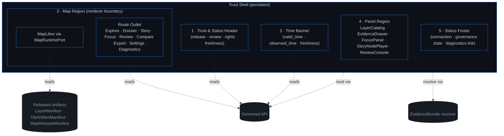
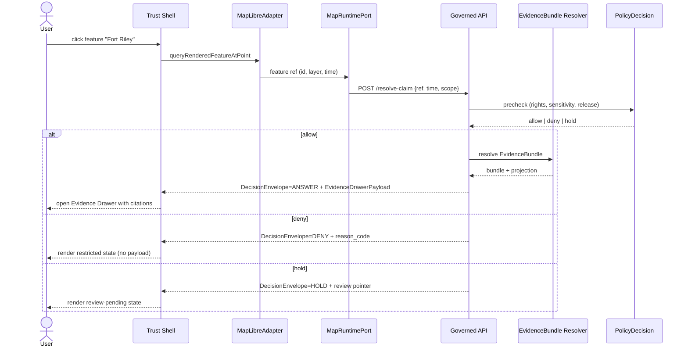

<!-- [KFM_META_BLOCK_V2]
doc_id: kfm://doc/brand-trust-shell-annotated-v1
title: Trust Shell — Annotated Example
type: standard
version: v1
status: draft
owners: brand-and-ui-owners, ui-doctrine-owner
created: 2026-05-15
updated: 2026-05-15
policy_label: public
related:
  - docs/architecture/map-shell.md
  - docs/doctrine/trust-membrane.md
  - docs/doctrine/truth-posture.md
  - docs/brand/README.md
tags: [kfm, brand, ui, trust-shell, examples]
notes:
  - "Path docs/brand/examples/ is PROPOSED; Directory Rules §6.1 names docs/brand/ but does not enumerate subfolders."
  - "All apps/explorer-web/* paths are PROPOSED per KFM_Whole_UI_Governed_AI_Expansion_Report."
[/KFM_META_BLOCK_V2] -->

# Trust Shell — Annotated Example

> An illustrated brand reference for KFM's governed UI shell: what each region carries, what it must never carry, and how the shell makes the **trust membrane** visible to the person at the screen.

<p align="left">
  <a href="../README.md"></a>
  <a href="#"></a>
  <a href="#"></a>
  <a href="#"></a>
  <a href="#"></a>
</p>

**Status:** `draft`  ·  **Owners:** brand-and-ui-owners · ui-doctrine-owner  ·  **Last updated:** 2026-05-15  ·  **Authority:** illustrative reference — not a release artifact

> [!IMPORTANT]
> This document is a **brand reference**, not implementation proof. Layout copy, hex tokens, ASCII annotations, and component paths shown here are **PROPOSED** or **ILLUSTRATIVE** until verified against a mounted repository and `apps/explorer-web/` evidence. Doctrine claims — the renderer boundary, the trust membrane rules, the finite outcomes — are **CONFIRMED** from attached KFM source documents.

---

## 📑 Contents

1. [What this is](#1-what-this-is)
2. [What this is *not*](#2-what-this-is-not)
3. [Trust Shell anatomy](#3-trust-shell-anatomy)
4. [Annotated layout](#4-annotated-layout)
5. [Region-by-region annotations](#5-region-by-region-annotations)
6. [Trust-visible chips and badges](#6-trust-visible-chips-and-badges)
7. [Finite outcomes, made visible](#7-finite-outcomes-made-visible)
8. [Trust membrane rules the shell must enforce](#8-trust-membrane-rules-the-shell-must-enforce)
9. [Worked walkthrough — feature click to evidence](#9-worked-walkthrough--feature-click-to-evidence)
10. [Voice and tone for shell copy](#10-voice-and-tone-for-shell-copy)
11. [Accessibility annotations](#11-accessibility-annotations)
12. [Anti-patterns](#12-anti-patterns)
13. [Related docs](#13-related-docs)
14. [Appendix — token & state placeholders](#14-appendix--token--state-placeholders)

---

## 1. What this is

The **Trust Shell** is the persistent, governed UI surface that hosts every map-first KFM experience. It is the visible expression of the **trust membrane** described in `docs/doctrine/trust-membrane.md` *(PROPOSED path)*: every public claim a user sees passes through released artifacts, governed APIs, and `EvidenceBundle` resolution before it ever reaches the screen.

This document is an **annotated example** — a brand-and-UI reference that pairs:

- a labeled layout of the shell's regions,
- the trust-visible states each region must render,
- the copy voice for those states,
- and the anti-patterns the shell exists to prevent.

It is intended for UI engineers extending `apps/explorer-web/` *(PROPOSED)*, brand stewards writing shell copy, reviewers auditing UX changes, and anyone debating "should this go in a popup or the Evidence Drawer?" The answer is almost always the drawer.

> [!NOTE]
> The Trust Shell is a **brand and behavior pattern**, not a single component. Its canonical implementation home is **PROPOSED** at `apps/explorer-web/src/app/GovernedShell.tsx` per `KFM_Whole_UI_Governed_AI_Expansion_Report.pdf` (§17.2). Component family names appear here for orientation only.

---

## 2. What this is *not*

A short list of things the Trust Shell deliberately is *not*, because confusion on these points produces the worst UX failures KFM tries to avoid.

| It is not… | Because… | See |
|---|---|---|
| A truth store | MapLibre and the shell render *released* artifacts; they do not own evidence. | `kfm_encyclopedia.pdf` §8.A |
| A policy authority | Sensitivity, rights, and release gates live behind the governed API. | `docs/doctrine/trust-membrane.md` *(PROPOSED)* |
| A citation surface | Popups summarize and link; the Evidence Drawer cites. | Master MapLibre §N |
| A model client | The browser never calls Ollama, OpenAI, or any model runtime directly. | `KFM_Governed_AI_*` SRC-GAI |
| A publication path | Layer toggles are not publication. Promotion is a governed state transition. | Trust membrane rule #3 |
| A theme demo | Trust badges with no backing receipt are **trust theater** — explicitly forbidden. | ML-061-090 |

[Back to top ↑](#trust-shell--annotated-example)

---

## 3. Trust Shell anatomy

The shell is built around **five persistent regions** plus a **route outlet** and a **panel region**. Regions are responsibility-bearing, not topic-bearing — moving content between regions changes its trust posture.



> [!NOTE]
> The diagram is **doctrine-faithful** but **layout-illustrative**. Region count and persistence are CONFIRMED from `KFM_Whole_UI_Governed_AI_Expansion_Report.pdf` §17.2 (`GovernedShell` family). Exact pixel placement, breakpoints, and panel docking behavior are PROPOSED.

[Back to top ↑](#trust-shell--annotated-example)

---

## 4. Annotated layout

The block below is an **illustrative wireframe** of the shell at a desktop breakpoint. Numbered call-outs map to [§5](#5-region-by-region-annotations). Treat the strings inside as **placeholders for governed payload fields**, not as final copy.

```text
┌──────────────────────────────────────────────────────────────────────────────┐
│ ① Trust & Status Header                                                      │
│  Kansas Frontier Matrix  •  release: v2026.05.1  •  ◉ released  ⚖ reviewed  │
│                                          ⚠ stale source: 1   ⛔ restricted: 2 │
├──────────────────────────────────────────────────────────────────────────────┤
│ ② Time Banner                                                                │
│  valid_time: 1854-08-12 → 1854-09-30  •  observed_time: 1854-08-15           │
│  freshness: current  •  ⟲ epoch: Frontier Period (1854-1865)                │
├───────────────────────────────────┬──────────────────────────────────────────┤
│                                   │ ④ Panel Region                           │
│                                   │  ┌───────────────────────────────┐       │
│                                   │  │ ④a LayerCatalog               │       │
│        ③ Map Region               │  │  ▸ Hydrology (released)       │       │
│        (MapLibre via              │  │  ▸ Routes (review-aged ⓘ)    │       │
│         MapRuntimePort)           │  │  ▸ Settlements (stale ⚠)     │       │
│                                   │  ├───────────────────────────────┤       │
│        [feature: Fort Riley]      │  │ ④b EvidenceDrawer             │       │
│        [click → ⑦]                │  │  claim · sources · review     │       │
│                                   │  │  rights · sensitivity · ↻     │       │
│                                   │  ├───────────────────────────────┤       │
│        ⑥ Route Outlet             │  │ ④c FocusPanel                 │       │
│        Explore / Story / Focus    │  │  ANSWER · ABSTAIN · DENY · ERR│       │
│                                   │  └───────────────────────────────┘       │
├───────────────────────────────────┴──────────────────────────────────────────┤
│ ⑤ Status Footer                                                              │
│  governed API: ok  •  cache: warm  •  diagnostics ↗  •  build: <spec_hash>  │
└──────────────────────────────────────────────────────────────────────────────┘

   Legend  ◉ released   ⚖ reviewed   ⚠ stale   ⛔ restricted/denied
           ⓘ review-aged   ↻ rollback target available   ↗ external/internal jump
```

> [!CAUTION]
> The strings above (`v2026.05.1`, `Frontier Period`, `Fort Riley`) are **ILLUSTRATIVE**. Final shell copy must be sourced from governed payload fields — never hard-coded — so that release, review, and correction state can travel with the value.

[Back to top ↑](#trust-shell--annotated-example)

---

## 5. Region-by-region annotations

Each numbered region carries a fixed trust responsibility. The table reads top-to-bottom in shell order.

| # | Region | Responsibility | Reads from | Must show | Must NEVER show |
|---|---|---|---|---|---|
| ① | **Trust & Status Header** | Release identity + at-a-glance governance counters | governed API: release/review/rights summary | release tag, review state, stale/restricted counts | RAW item counts, prompt text, secrets |
| ② | **Time Banner** | Visible `valid_time` / `observed_time` / freshness ownership | `TimeState` (PROPOSED) | active temporal scope, freshness chip, epoch label | implied "now" without a source, silent jumps |
| ③ | **Map Region** | MapLibre 2D rendering of released layers only | `LayerManifest` + `TileArtifactManifest` + `MapReleaseManifest` | only manifest-bound layers; trust badges per layer | unreleased tiles, canonical/internal stores |
| ④ | **Panel Region** | Trust-resolution surfaces (catalog, drawer, focus, story, review) | governed API + `EvidenceBundle` resolver | finite outcomes, citation, source role, rights, sensitivity | model output without citation; raw feature properties as claims |
| ⑤ | **Status Footer** | Operational governance signal (no leakage) | governed API health + `spec_hash` of current build | governed-API state, build/spec_hash, diagnostics link | credentials, internal handles, restricted geometry |
| ⑥ | **Route Outlet** | Persistent routes (Explore · Dossier · Story · Focus · Review · Compare · Export · Settings · Diagnostics) | route table (PROPOSED `apps/explorer-web/src/app/routes.tsx`) | active route, deep-link state, focus order | side routes that bypass the trust membrane |
| ⑦ | **Click → Resolution** | A feature click is **not** a claim — it is a `governed claim-resolution request` | `MapLibreAdapter` → `MapRuntimePort` → governed API | drawer payload **or** a finite negative state | feature properties surfaced as evidence |

> [!NOTE]
> **CONFIRMED doctrine.** Region responsibilities derive from `KFM_Whole_UI_Governed_AI_Expansion_Report.pdf` §17.1–§19, `kfm_encyclopedia.pdf` §8.A–C, and `Master MapLibre Components-Functions-Features` §S–T. Region *names* in your repo may differ — verify against current `apps/explorer-web/` before quoting.

[Back to top ↑](#trust-shell--annotated-example)

---

## 6. Trust-visible chips and badges

Chips and badges are how the shell makes the trust membrane *legible*. They are **surface signals**, never substitutes for the Evidence Drawer.

| Chip / badge | Triggered by (CONFIRMED doctrine) | Shell signal | Required action when clicked |
|---|---|---|---|
| `released` ◉ | `ReleaseManifest` covers the artifact | green/neutral solid | open ReleaseManifest detail in drawer |
| `review-aged` ⓘ | `ReviewRecord` older than lane's review cadence | amber outline | open `ReviewRecord` history |
| `stale source` ⚠ | `SourceDescriptor.cadence` window exceeded | amber with `⚠` glyph | open source-freshness panel in drawer |
| `schema-drift` | Object schema upgraded past published claim's version | amber with `Δ` glyph | open migration ADR (if any) |
| `geography-version` | `GeographyVersion` replaced; claim still bound to prior version | banner across map region | open prior-version cite |
| `policy-version` | Policy referenced by `PolicyDecision` was superseded | amber with `§` glyph | open re-gate prompt |
| `rights-changed` | Rights change in `SourceDescriptor` | amber with `⚖` glyph | trigger steward re-evaluation |
| `restricted` ⛔ | `PolicyDecision = deny` for sensitivity / rights | red, terminal | open denial reason (no payload) |
| `correction` ✎ | `CorrectionNotice` issued | blue with `✎` glyph | open correction lineage |
| `rollback-available` ↻ | `RollbackCard` references a valid prior `ReleaseManifest` | grey | open rollback target detail (steward only) |
| `verification-failed` | Tile/sidecar verification denied at runtime | red with `✕` glyph | drawer shows DENY reason; no map render |
| `CARE` / `sovereignty` | CARE-bound metadata on layer or feature | distinctive pattern + label | open governance / consent context |

> [!WARNING]
> **Anti-pattern: attestation badge as proof.** A green ◉ badge is a *signal that proof exists* — it is not itself proof. Badge clicks must open the receipt, not replace the drawer. (`ML-061-090`, `ML-061-138`, `ML-061-139`.)

[Back to top ↑](#trust-shell--annotated-example)

---

## 7. Finite outcomes, made visible

Every governed API surface, validator, policy gate, and Focus Mode call returns a finite outcome from a small, known set. The Trust Shell renders each outcome **distinctly** — never as a generic spinner-then-failure.

| Outcome | When (CONFIRMED) | Shell signature (ILLUSTRATIVE) | Allowed copy pattern |
|---|---|---|---|
| **ANSWER** | Evidence sufficient · policy permits · release & review states valid | substantive answer + citation list + drawer link | "Answer based on *n* sources — open Evidence Drawer." |
| **ABSTAIN** | Evidence insufficient · cannot cite · stale with no released alternative | non-substantive note with reason code | "Not enough evidence to answer. Reason: `evidence_missing`." |
| **DENY** | Policy / rights / sensitivity / release state forbids | terminal denial + reason + alternative if any | "This request is restricted (`rights_unknown`). Try the public summary." |
| **ERROR** | Schema / contract / infra failure | finite error with diagnostic code | "We couldn't evaluate that request (`E-RESOLVER-503`)." |
| **HOLD** *(promotion-class)* | Pending steward / rights-holder / policy review | prior state preserved, "review in progress" chip | "Review pending. Last published state remains visible." |
| **PASS / FAIL** *(validator-class)* | Internal; never directly surfaced as a public answer | not user-facing | n/a |

> [!IMPORTANT]
> **ABSTAIN is not failure.** Cite-or-abstain is the default truth posture. A shell that hides ABSTAIN behind a generic error message has violated KFM doctrine — even when the resulting UI feels smoother.

[Back to top ↑](#trust-shell--annotated-example)

---

## 8. Trust membrane rules the shell must enforce

These rules are **CONFIRMED doctrine** from `Master MapLibre Components-Functions-Features` §10 and `KFM_Whole_UI_Governed_AI_Expansion_Report.pdf` §25. The Trust Shell is the user-facing edge of the membrane; it must make each rule observable.

> [!CAUTION]
> A shell that *renders* something the membrane forbids has already failed. These rules are visible in the shell because they govern what the shell will refuse to draw.

1. **No public RAW path.** The shell never reads `data/raw/`, `data/work/`, `data/quarantine/`, unpublished candidates, or canonical/internal stores. *(All paths PROPOSED.)*
2. **No direct model client.** The browser never calls Ollama, OpenAI, vector DBs, graph stores, or model runtimes. Focus Mode is mediated.
3. **No unreleased tile load.** `addSource` / `addLayer` is blocked unless `LayerManifest` + `TileArtifactManifest` + `MapReleaseManifest` + `PolicyDecision` allow it.
4. **No sensitive geometry hidden only by style.** Generalization, redaction, delay, restriction, or denial happens **before** tile generation — not in MapLibre filters.
5. **No popup as Evidence Drawer substitute.** Popups summarize and link; consequential claims resolve through the drawer.
6. **No Focus Mode answer from rendered features alone.** Rendered features are candidates; `EvidenceBundle` carries truth support.
7. **No uncited export.** Screenshots, PDFs, Story Nodes, and Focus summaries preserve citations, digests, and manifest references.

[Back to top ↑](#trust-shell--annotated-example)

---

## 9. Worked walkthrough — feature click to evidence

A single click, narrated step-by-step. This is the canonical Trust Shell interaction.



**Key invariants visible in this flow:**

- The shell never reads `EvidenceBundle` directly from a canonical store — only the **projection** (`EvidenceDrawerPayload`).
- A feature's raw properties never become a claim. The browser does not "know" what Fort Riley *means* until the governed API returns a `DecisionEnvelope`.
- A DENY outcome is **first-class**: the shell renders a restricted state, not a generic "no results."

[Back to top ↑](#trust-shell--annotated-example)

---

## 10. Voice and tone for shell copy

The Trust Shell speaks in a way that matches its job: it is **direct, evidence-respecting, and honest about uncertainty**. The brand voice rule of thumb: *if a string would sound the same on a marketing page and on a stale-source banner, it is wrong.*

| Surface | Voice rule | ✅ Good (illustrative) | ❌ Avoid |
|---|---|---|---|
| Header status chip | Name the state. Don't soften it. | "Stale source — re-admit pending" | "Almost up to date!" |
| Time banner | Always cite both times when they differ. | "Valid 1854-08-12 → 1854-09-30 · observed 1854-08-15" | "Around the 1850s" |
| Drawer ABSTAIN | Reason code + plain-language gloss. | "Not enough evidence (`evidence_missing`) for this claim." | "Hmm, we couldn't find anything!" |
| Drawer DENY | State the policy reason. Offer an alternative only if one exists. | "Restricted: exact location withheld (`care_locality`). Generalized layer available." | "This is a secret 🤫" |
| Focus ERROR | Finite, actionable, with a code. | "Resolver unavailable (`E-RESOLVER-503`). Try again or open Diagnostics." | "Something went wrong." |
| Rollback chip | Steward-facing, never alarming to the public. | "Rollback target available: v2026.04.2" | "PANIC: rollback armed!" |
| Diagnostics | Mention `spec_hash` and governed-API state; never internal handles. | "spec_hash `b3:…` · governed API: ok" | "DB conn pool 7/16, vector index hot" |

> [!TIP]
> When in doubt, write the string as if a steward, a journalist, and a Tribal Historic Preservation Officer were all going to read it next. If any of them would feel misled, rewrite.

[Back to top ↑](#trust-shell--annotated-example)

---

## 11. Accessibility annotations

The Trust Shell's accessibility commitments are first-order — they are part of how trust becomes visible, not a separate polish layer. (Per `KFM_Whole_UI_Governed_AI_Expansion_Report.pdf` §20.1.)

- **Keyboard-only navigation** through all routes and panels; focus order is stable; drawer and dialogs trap and release focus correctly.
- **Map interactions have non-map alternatives.** Selected features and results appear in a keyboard-accessible list or table; clicking a row resolves to the same drawer payload.
- **Trust chips do not rely on color alone.** Every badge carries a text label and glyph in addition to color. Screen readers announce *source role, rights, sensitivity, review state, freshness, release state, correction state*.
- **Reduced-motion** disables or shortens Story Node camera animation and drawer transitions.
- **Touch & narrow viewport** layouts keep the map, time context, drawer, and Focus state usable without hiding any critical trust information.
- **Loading, cancelled, denied, abstained, error, stale, and restricted** states are announced and visibly distinct from one another and from success states.

[Back to top ↑](#trust-shell--annotated-example)

---

## 12. Anti-patterns

The shortest anti-pattern register specific to the Trust Shell. Each is a CONFIRMED doctrinal failure mode in the attached sources.

| Anti-pattern | What goes wrong | Counter-rule |
|---|---|---|
| **Badge as proof substitute** | Green ◉ chip with no backing receipt or `ReleaseManifest`. | Badge clicks open the receipt; chips are signals, not claims. (`ML-061-090`, `ML-061-138`) |
| **Popup as Evidence Drawer** | Tooltip text reads like a citation; users never see the drawer. | Popups summarize and link; the drawer cites. |
| **Renderer as truth** | Rendered features treated as facts; Focus Mode answers from MapLibre state alone. | Resolve `EvidenceBundle` before any claim. |
| **Style-hidden sensitive geometry** | Exact rare-species or archaeological coordinates "hidden" by a style filter. | Transform / redact / generalize **before** tile generation. |
| **Silent stale** | A stale-source banner suppressed because "it looks broken." | Stale is a first-class state with its own visual treatment. |
| **Friendly ABSTAIN** | "We couldn't find anything ¯\_(ツ)_/¯" obscuring an evidence gap. | Cite the reason code; offer a path forward. |
| **Trust theater** | Pretty trust chips with no real validation behind them. | A chip without a verifiable receipt must not render. |
| **Uncited export** | Screenshot / PDF / Story export missing citations and `spec_hash`. | Exports preserve citations, digests, and manifest references — or are denied. |

[Back to top ↑](#trust-shell--annotated-example)

---

## 13. Related docs

> [!NOTE]
> Link targets are **PROPOSED**. Verify against the mounted repository before relying on these as live anchors.

- `docs/brand/README.md` — brand authority root  *(PROPOSED)*
- `docs/architecture/map-shell.md` — map shell architecture  *(referenced in Directory Rules §6.1)*
- `docs/doctrine/trust-membrane.md` — trust membrane law  *(PROPOSED)*
- `docs/doctrine/truth-posture.md` — cite-or-abstain doctrine  *(PROPOSED)*
- `docs/standards/` — external standards crosswalks  *(PROPOSED parent)*
- `docs/adr/ADR-0001-schema-home.md` — schema home decision
- `docs/registers/AUTHORITY_LADDER.md` — authority precedence  *(PROPOSED)*

---

## 14. Appendix — token & state placeholders

<details>
<summary><b>Placeholder color & glyph tokens</b> (ILLUSTRATIVE — replace with repo-canonical tokens)</summary>

These tokens are deliberately **abstract**. Bind them to a real palette only after auditing `packages/ui/` *(PROPOSED)* or `docs/brand/styles/` *(PROPOSED)* and confirming contrast for AA/AAA targets.

```text
state.released         → token.color.state.positive       glyph: ◉
state.review-aged      → token.color.state.caution        glyph: ⓘ
state.stale            → token.color.state.warning        glyph: ⚠
state.schema-drift     → token.color.state.warning        glyph: Δ
state.policy-version   → token.color.state.warning        glyph: §
state.rights-changed   → token.color.state.warning        glyph: ⚖
state.restricted-deny  → token.color.state.terminal       glyph: ⛔
state.verification-fail→ token.color.state.terminal       glyph: ✕
state.correction       → token.color.state.info           glyph: ✎
state.rollback-target  → token.color.state.neutral        glyph: ↻
state.care-bound       → token.pattern.care + label       glyph: (pattern + word)
```

</details>

<details>
<summary><b>Placeholder copy strings for each finite outcome</b> (ILLUSTRATIVE)</summary>

```text
ANSWER   "Answer based on {n} sources. Open Evidence Drawer ↗"
ABSTAIN  "Not enough evidence to answer ({reason_code})."
DENY     "Restricted: {reason_code}. {alternative_or_empty}"
ERROR    "We couldn't evaluate that request ({error_code}). Diagnostics ↗"
HOLD     "Review pending. Last published state remains visible."
```

Copy MUST be sourced from governed payload fields — `DecisionEnvelope.reason_code`, `AIReceipt.abstain_reason`, etc. — not hard-coded in components.

</details>

<details>
<summary><b>Region → PROPOSED component family map</b></summary>

Per `KFM_Whole_UI_Governed_AI_Expansion_Report.pdf` §17.2. **All paths PROPOSED until repo verification.**

| Region | Component family | PROPOSED file home |
|---|---|---|
| Persistent shell | `GovernedShell` | `apps/explorer-web/src/app/GovernedShell.tsx` |
| Renderer boundary | `MapRuntimeBoundary` + `MapLibreAdapter` | `packages/maplibre/` |
| Time banner / state | `TimeState` | `apps/explorer-web/src/state/timeState.ts` |
| Layer catalog | `LayerCatalogPanel` | `apps/explorer-web/src/panels/` |
| Drawer | `EvidenceDrawer` | `apps/explorer-web/src/panels/` |
| Focus | `FocusPanel` | `apps/explorer-web/src/panels/` |
| Story | `StoryNodePlayer` | `apps/explorer-web/src/panels/` |
| Review | `ReviewConsole` | `apps/explorer-web/src/panels/` |
| Governed client | typed governed API client | `apps/explorer-web/src/api/governedClient.ts` |

</details>

[Back to top ↑](#trust-shell--annotated-example)

---

<p align="center"><sub><b>Trust Shell — Annotated Example</b> · brand reference · illustrative · v1 · last updated 2026-05-15 · <a href="#trust-shell--annotated-example">back to top ↑</a></sub></p>
