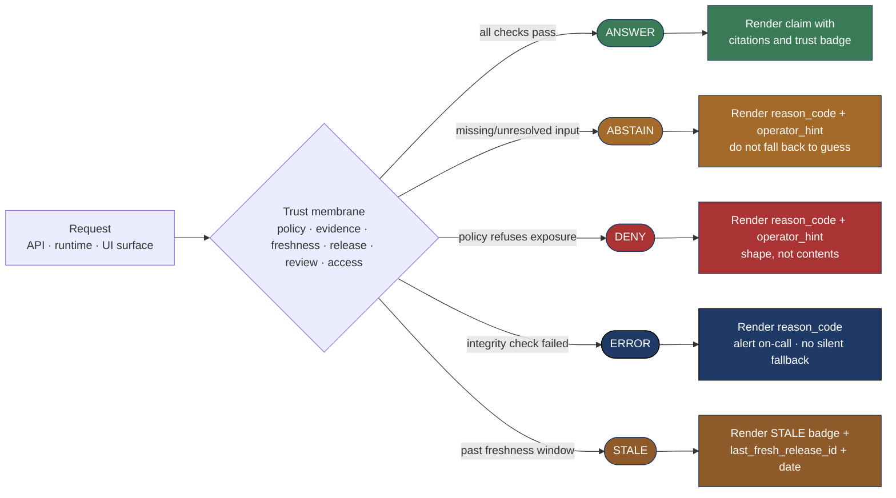

<!-- [KFM_META_BLOCK_V2]
doc_id: kfm://doc/<TODO-uuid>
title: Finite Outcome Microcopy — ANSWER · ABSTAIN · DENY · ERROR · STALE
type: standard
version: v1
status: draft
owners: <TODO: brand / design-system maintainers + Trust Membrane Lead + Map Architecture Lead>
created: 2026-05-15
updated: 2026-05-15
policy_label: public
related:
  - docs/brand/evidence-drawer-microcopy.md
  - docs/doctrine/trust-posture.md
  - docs/doctrine/lifecycle-law.md
  - docs/doctrine/policy-aware.md
  - docs/doctrine/evidence-first.md
  - docs/doctrine/time-aware.md
  - docs/doctrine/map-first.md
  - docs/doctrine/corrections-first-class.md
  - docs/doctrine/ai-as-assistant.md
  - docs/architecture/trust-membrane.md
  - docs/architecture/ui-trust-surface.md
  - schemas/contracts/v1/decision_envelope.schema.json
  - schemas/contracts/v1/runtime_response_envelope.schema.json
  - control_plane/policy_gate_register.yaml
  - control_plane/string_registry.yaml
  - tests/contracts/
  - tests/ui/
  - tests/a11y/
tags: [kfm, brand, microcopy, finite-outcomes, governance, accessibility, i18n, decision-envelope]
notes:
  - Canonical user-facing wording for the five finite outcomes (ANSWER, ABSTAIN, DENY, ERROR, STALE) across every KFM surface.
  - Identifiers (outcomes, reason codes, surface taxonomy) are CONFIRMED from prior KFM doctrine; default English wording proposed here is PROPOSED at the wording level.
  - Operator-hint authoring rules MUST be honored: a hint describes the SHAPE of a denial, never its CONTENTS.
  - Surface-specific wording (e.g., Evidence Drawer) is delegated to sibling brand docs; this doc governs the outcome axis.
  - All strings carry stable ids for translation; no string concatenation across translatable units.
[/KFM_META_BLOCK_V2] -->

# Finite Outcome Microcopy — `ANSWER` · `ABSTAIN` · `DENY` · `ERROR` · `STALE`

> **The canonical user-facing wording KFM renders for each of the five finite outcomes — across every surface that emits a `DecisionEnvelope` or `RuntimeResponseEnvelope`. The outcomes themselves are governed by doctrine. The wording keyed to them is governed here.**


**Status:** Draft · **Owners:** _TODO brand / design-system maintainers + Trust Membrane Lead + Map Architecture Lead_ <sub>NEEDS VERIFICATION</sub> · **Updated:** 2026-05-15

> [!IMPORTANT]
> The five finite outcomes are **first-class trust signals**, not error states to be apologized for or smoothed over. `ABSTAIN`, `DENY`, `ERROR`, and `STALE` are how the trust system tells the truth about what it can and cannot warrant. Wording for each outcome must therefore be **calm, specific, non-marketing, and non-conflating**. A loading spinner that hides an outcome, a generic "Something went wrong" that masks a labeled refusal, or a "Sorry!" prefix on a `DENY` are all defects of the same kind: they convert a doctrinal signal into UI noise. `[CONFIRMED anti-pattern from `docs/doctrine/map-first.md` §10 and `docs/architecture/trust-membrane.md` §11.]`

---

## Table of contents

1. [Purpose & scope](#1-purpose--scope)
2. [Audience and source hierarchy](#2-audience-and-source-hierarchy)
3. [The five outcomes at a glance](#3-the-five-outcomes-at-a-glance)
4. [Voice & tone for outcomes](#4-voice--tone-for-outcomes)
5. [Terminology preservation (the outcome words themselves)](#5-terminology-preservation-the-outcome-words-themselves)
6. [`ANSWER` microcopy](#6-answer-microcopy)
7. [`ABSTAIN` microcopy](#7-abstain-microcopy)
8. [`DENY` microcopy](#8-deny-microcopy)
9. [`ERROR` microcopy](#9-error-microcopy)
10. [`STALE` microcopy](#10-stale-microcopy)
11. [Outcome × surface matrix](#11-outcome--surface-matrix)
12. [Reason codes & operator hints](#12-reason-codes--operator-hints)
13. [Non-conflation rules](#13-non-conflation-rules)
14. [Empty, loading, and transition states](#14-empty-loading-and-transition-states)
15. [Accessibility microcopy](#15-accessibility-microcopy)
16. [i18n & string extraction](#16-i18n--string-extraction)
17. [Anti-patterns](#17-anti-patterns)
18. [Verification checklist](#18-verification-checklist)
19. [Related docs](#19-related-docs)

---

## 1. Purpose & scope

This document is the **canonical reference** for the wording KFM renders when a `DecisionEnvelope` (governed API surface) or `RuntimeResponseEnvelope` (AI runtime) carries one of the five finite outcomes. `[CONFIRMED outcome vocabulary from `docs/doctrine/lifecycle-law.md` §8, `docs/doctrine/policy-aware.md` §10, `docs/architecture/trust-membrane.md` §6, and `docs/doctrine/map-first.md` §10.]`

The **identifiers** (outcome names, reason-code keys, surface taxonomy) are owned by doctrine and contract files. **This document does not redefine them.** It owns only the user-facing **wording** keyed to those identifiers and the rules that wording must follow when an outcome surfaces anywhere in KFM.

| In scope | Out of scope |
|---|---|
| Default English (en-US) wording for `ANSWER`, `ABSTAIN`, `DENY`, `ERROR`, `STALE` across every surface. | The outcome vocabulary itself (governed by doctrine). |
| Surface-by-surface variants (API body, drawer banner, layer card, popup, time-slider tick, AI response, steward dashboard). | The runtime mechanics of envelope production. |
| Operator-hint authoring rules (the leak-test). | Reason-code identifier governance (lives in `policy_gate_register.yaml`). |
| Accessibility microcopy (sr-only announcements, `aria-live` regions) for outcome transitions. | Visual-design tokens, color, typography, spacing. |
| Cross-surface non-conflation rules (e.g., `ERROR` MUST NOT masquerade as `DENY`). | Surface-specific wording **outside** the outcome axis (e.g., source-role labels — see [`evidence-drawer-microcopy.md`](./evidence-drawer-microcopy.md)). |

> [!NOTE]
> This doc and [`evidence-drawer-microcopy.md`](./evidence-drawer-microcopy.md) are intentional siblings. The Drawer doc is **surface-shaped** — it covers every label rendered inside the Evidence Drawer. This doc is **outcome-shaped** — it covers how the five outcomes read **everywhere**. Where they overlap (e.g., the Drawer's outcome banner), the wording is reproduced in both; this doc is the source of truth for the outcome axis, the Drawer doc is the source of truth for the Drawer axis. Disagreement is a defect to be resolved, not a stylistic difference. `[INFERRED division of labor between the two sibling docs.]`

[⬆ Back to top](#finite-outcome-microcopy--answer--abstain--deny--error--stale)

---

## 2. Audience and source hierarchy

**Primary audience.** Frontend engineers writing surface code that renders envelopes; backend engineers writing envelope producers; translators extracting strings; design-system maintainers reviewing surface fixtures; accessibility reviewers auditing outcome announcements; stewards signing off on the wording stewardship sees in dashboards and review queues.

**Secondary audience.** Doctrine maintainers verifying that no wording has drifted away from the underlying outcome vocabulary, and anyone reviewing a PR that touches a string keyed to an outcome.

**Source hierarchy that applies to every claim in this doc.** `[CONFIRMED from `docs/doctrine/authority-ladder.md`.]`

| Tier | What governs the wording in this doc |
|---|---|
| **1 — Primary** | KFM doctrine and contracts. They fix the outcome vocabulary (`ANSWER`, `ABSTAIN`, `DENY`, `ERROR`, `STALE`), the reason-code vocabulary (`policy.sensitive_geometry`, `policy.no_raw_public`, `release.unreviewed`, `policy.no_public_model`, `evidence.missing`, `system.integrity_failure`, `policy.rights_unclear`, `release.unpublished`, `evidence.unresolved`, `evidence.under_review`, `time.unsupported_window`, `time.out_of_scope`, `release.withdrawn`, and any others registered in `policy_gate_register.yaml` <sub>PROPOSED path</sub>), and the surface taxonomy. Wording proposed here MUST NOT silently rename, merge, soften, or paraphrase any of these. |
| **2 — Secondary** | Repository evidence — the actual envelope producers, surface code, fixtures, tests, and translation tables. When this doc's wording disagrees with shipped code, the diff is itself a finding; one side is wrong and must be repaired. |
| **3 — Tertiary** | Authoritative external standards: WCAG 2.2 AA, ARIA 1.2, ISO 8601, BCP 47, the GitHub Markdown spec used to render this file. External i18n style guidance is consulted but **does not** override KFM identifier vocabulary. |

> [!WARNING]
> External i18n style guidance sometimes recommends "user-friendly" paraphrases of system identifiers (e.g., "outdated" for `STALE`, "blocked" for `DENY`). That guidance does **not** apply to KFM outcome vocabulary. The outcome words are Tier-1 doctrine and outrank Tertiary style advice. Translate the outcome word; do not paraphrase it.

[⬆ Back to top](#finite-outcome-microcopy--answer--abstain--deny--error--stale)

---

## 3. The five outcomes at a glance



`[CONFIRMED outcome semantics; surface-rendering particulars PROPOSED at this granularity.]`

| Outcome | One-line meaning | First-class status | Color alone? |
|---|---|---|---|
| **`ANSWER`** | A current, policy-allowed warranty exists; the call may proceed with citations. | Yes | No |
| **`ABSTAIN`** | A required input is missing or unresolved; the system declines rather than guesses. | Yes | No |
| **`DENY`** | Policy refuses this exposure of this unit to this caller. | Yes | No |
| **`ERROR`** | An integrity check or system invariant failed during evaluation. | Yes | No |
| **`STALE`** | The supporting evidence is past its freshness window; the prior warranty is downgraded. | Yes | No |

> [!IMPORTANT]
> **Color alone never carries outcome meaning.** Every outcome rendered in any KFM surface MUST have visible text or an accessible name. `[CONFIRMED accessibility commitment.]` Green/red/amber may **accompany** outcome microcopy; they may not **replace** it.

[⬆ Back to top](#finite-outcome-microcopy--answer--abstain--deny--error--stale)

---

## 4. Voice & tone for outcomes

The same voice applies to every outcome: precise, calm, specific, and non-marketing. The tone shifts only enough to honor what the outcome actually is.

| Outcome | Tone register | Forbidden moves | Required moves |
|---|---|---|---|
| `ANSWER` | Plain, declarative, citation-forward. | Triumphal phrasing. Confidence boosters ("verified ✓", "trusted!"). Star-rating analogues. | State the claim. Surface the release. Link to citations. |
| `ABSTAIN` | Neutral, specific about the gap. | "Sorry,". "Oops,". "We couldn't…". Apologetic prefix. | Name the missing input. Offer the safe next step the envelope authorizes. |
| `DENY` | Neutral, definite, non-apologetic. | "We're unable to…". Vague "blocked". Hedge ("for now"). Leaking the denied content. | Name the policy dimension that refused. Describe the denial's *shape*. |
| `ERROR` | Calm but unambiguous. | Marketing-friendly euphemisms ("hiccup", "glitch"). Generic "Something went wrong." | State that an integrity check failed. Tell the user the on-call team is notified. Do not invent the cause. |
| `STALE` | Quiet, informational, time-anchored. | "Outdated". "Old". "Expired" (these are not synonyms for `STALE`). | Show the last-fresh release id and date. Note that a refresh or correction may be in progress. |

**Cross-outcome rules.**

| Rule | Why |
|---|---|
| **Sentence case** for outcome headings; **uppercase** for the outcome identifier when rendered as a code token. | Consistency with the schema, readability in prose. |
| **No exclamation marks** on trust-visible surfaces. | Exclamation reads as marketing; trust outcomes are not marketing. |
| **No emoji** as outcome indicators. | Emoji rendering is locale- and platform-variable; accessibility names diverge. |
| **Numerals throughout** (not spelled out). | Compact, locale-stable. |
| **No "please"** in outcome bodies. | "Please" softens a finite outcome into a request; the outcome is a fact, not a favor. |
| **No "try again"** without a CONFIRMED retry semantics. | "Try again" implies the same call will succeed; for most outcomes this is false. |

[⬆ Back to top](#finite-outcome-microcopy--answer--abstain--deny--error--stale)

---

## 5. Terminology preservation (the outcome words themselves)

The five outcome tokens appear **verbatim** in every machine-readable surface and in every developer-facing surface. They MAY be translated in the visible label, but the **identifier** is always rendered as one of the five canonical strings.

| Identifier (verbatim) | Permitted visible label (en-US, default) | Forbidden softenings |
|---|---|---|
| `ANSWER` | *Published claim* / *Answered* | "Success". "OK". "Yes". |
| `ABSTAIN` | *Not enough to answer* / *Abstained* | "No result". "Couldn't find". "Maybe later". |
| `DENY` | *Not available* / *Denied by policy* | "Blocked". "Forbidden". "Not allowed". "Unauthorized" (HTTP 401/403 ≠ `DENY`). |
| `ERROR` | *System problem* / *Integrity check failed* | "Oops". "Hiccup". "Glitch". "Something went wrong". |
| `STALE` | *Past freshness window* / *Stale* | "Outdated". "Old". "Expired". "Cached" (cache ≠ stale). |

> [!CAUTION]
> Translating `ABSTAIN` as a generic "no result" in any locale is a **defect**. The whole point of `ABSTAIN` is that the absence is **informative**: a required input was missing or did not resolve. A locale that translates `ABSTAIN` as "no result" silently demotes it to a null state. `[CONFIRMED from `docs/architecture/trust-membrane.md` §6.]`

<details>
<summary><b>Why these outcomes and not more (or fewer)</b></summary>

The five-outcome vocabulary is the deliberate minimum needed to describe what the trust membrane can warrant. Each represents a distinct doctrinal position:

- `ANSWER` — the membrane currently warrants the unit for this call.
- `ABSTAIN` — the membrane would warrant the unit but a required input is missing.
- `DENY` — policy refuses exposure regardless of evidence.
- `ERROR` — an integrity invariant tripped; nothing can be warranted.
- `STALE` — a prior warranty exists but is past the freshness window.

Adding a sixth (e.g., "partial", "degraded", "tentative") collapses the vocabulary's discipline; subtracting one (e.g., merging `STALE` into `ABSTAIN`) destroys the freshness signal. The vocabulary is **finite and stable** for the same reason the periodic table is: each entry does something the others cannot.

`[CONFIRMED finite-vocabulary doctrine from `docs/architecture/trust-membrane.md` §6 and `docs/doctrine/lifecycle-law.md` §8.]`

</details>

[⬆ Back to top](#finite-outcome-microcopy--answer--abstain--deny--error--stale)

---

## 6. `ANSWER` microcopy

`ANSWER` is the only outcome that authorizes content rendering. Every other outcome renders **about** the request, not from it.

### 6.1 Required envelope fields when rendering `ANSWER`

`[CONFIRMED required fields from `docs/doctrine/policy-aware.md` §10.]`

| Field | Required | Used by microcopy in |
|---|---|---|
| `claim_id` | Yes | Drawer header; URL anchor; sr-only announcement. |
| `evidence_refs[]` | Yes | Citations block. |
| `release_id` | Yes | "Published under" line; trust badge. |
| `policy_decision_id` | Yes | Audit link from the steward surface. |
| `outcome: "ANSWER"` | Yes | Banner/badge label. |

### 6.2 Default wording

| String id | Surface | Default en-US |
|---|---|---|
| `outcome.answer.banner.heading` | Drawer, popup, layer card | *Published claim* |
| `outcome.answer.banner.body` | Drawer, popup | *Published under `{release_id}`. Citations and source are below.* |
| `outcome.answer.badge.label` | Trust badge | *Answered* |
| `outcome.answer.sr.announce` | sr-only on outcome arrival | *Claim answered. Released `{release_id_short}`. {citation_count} citations available.* |
| `outcome.answer.api.note` | API client developer surface | *`ANSWER` — claim is current. See `evidence_refs[]` for resolution.* |

### 6.3 What `ANSWER` MUST NOT say

| Forbidden | Why |
|---|---|
| *"Verified ✓"*, *"Trusted!"*, *"Confirmed"* | These imply a metaphysical truth claim. The membrane warrants procedure, not truth. `[CONFIRMED carrier-vs-sovereign-truth from `trust-membrane.md` §12.]` |
| Star ratings, percentage confidence, "quality scores" on the claim. | The membrane returns a finite outcome, not a continuous score. |
| *"Source: model"* on a public surface as the standalone evidence. | `model` is a CONFIRMED source role, but a public-surface `ANSWER` MUST resolve to non-model evidence. `[CONFIRMED from `docs/doctrine/ai-as-assistant.md`.]` |

[⬆ Back to top](#finite-outcome-microcopy--answer--abstain--deny--error--stale)

---

## 7. `ABSTAIN` microcopy

`ABSTAIN` means: **a warranty does not currently support this call.** Typical causes are an unresolved `EvidenceRef`, a missing citation, a freshness lapse that has not yet been downgraded to `STALE`, an evidence record under review, or a scope mismatch between the claim and what the envelope can resolve.

> [!TIP]
> **`ABSTAIN` beats a confident guess.** This is the rule that anchors [`docs/doctrine/ai-as-assistant.md`](../doctrine/ai-as-assistant.md): the AI runtime returns `ABSTAIN`, not a fluent paragraph, when evidence does not close. The same posture applies to every other surface: silence with a reason is correct; filler with confidence is a defect. `[CONFIRMED from `trust-membrane.md` §6.]`

### 7.1 Required envelope fields when rendering `ABSTAIN`

`[CONFIRMED from `docs/doctrine/policy-aware.md` §10.]`

| Field | Required | Used by microcopy in |
|---|---|---|
| `outcome: "ABSTAIN"` | Yes | Banner/badge label. |
| `reason_code` | Yes | Banner body; sr-only announce. |
| `operator_hint` | Yes (may be empty for plain reasons) | Banner body. |
| `claim_id` | When the abstention is about a specific claim | Banner body; URL anchor. |

### 7.2 Default wording

| String id | Surface | Default en-US |
|---|---|---|
| `outcome.abstain.banner.heading` | Drawer, popup, AI response | *Not enough to answer* |
| `outcome.abstain.banner.body` | Drawer, popup | *KFM declines to answer: `{reason_code}`. {operator_hint}* |
| `outcome.abstain.badge.label` | Trust badge | *Abstained* |
| `outcome.abstain.sr.announce` | sr-only on outcome arrival | *Abstained. Reason: `{reason_code}`. {operator_hint_or_empty}* |
| `outcome.abstain.ai.body` | AI runtime response | *I'm abstaining: `{reason_code}`. The evidence I would need is `{operator_hint}`.* |
| `outcome.abstain.api.note` | API client developer surface | *`ABSTAIN` — required input missing. See `reason_code` and `operator_hint`.* |

### 7.3 Reason-code-specific bodies (frequent cases)

| Reason code | Default body |
|---|---|
| `evidence.missing` | *A required citation was not provided for this claim.* |
| `evidence.unresolved` | *A citation was provided but could not be resolved to an `EvidenceBundle`.* |
| `evidence.under_review` | *The supporting evidence is currently under review by a steward.* |
| `evidence.scope_mismatch` | *The cited evidence does not cover the scope of this claim.* |
| `time.unsupported_window` | *The selected time window is not supported by the envelope.* |
| `time.out_of_scope` | *The selected time is outside the scope this layer covers.* |

`[Reason-code identifiers CONFIRMED from prior doctrine work; per-code wording PROPOSED.]`

[⬆ Back to top](#finite-outcome-microcopy--answer--abstain--deny--error--stale)

---

## 8. `DENY` microcopy

`DENY` means: **policy refuses this exposure of this unit to this caller.** Causes are policy dimensions — rights, sensitivity, source role insufficient for the requested exposure, release state, access role. Unlike `ABSTAIN`, a `DENY` does **not** mean "we just need more inputs." Adding evidence does not convert a `DENY` to an `ANSWER`; only a policy change does.

> [!CAUTION]
> **Operator hints in a `DENY` must never leak the very thing the policy denies.** The hint describes the *shape* of the denial (which dimension, which release, which call path), never the *contents* of what is denied. A `DENY policy.sensitive_geometry` hint that includes the exact geometry is a defect — it has leaked the asset the policy was trying to protect. `[CONFIRMED posture from `docs/doctrine/policy-aware.md` §10 and `trust-membrane.md` §11.]`

### 8.1 Required envelope fields when rendering `DENY`

| Field | Required | Used by microcopy in |
|---|---|---|
| `outcome: "DENY"` | Yes | Banner/badge label. |
| `reason_code` | Yes | Banner body. |
| `operator_hint` | Yes (shape-only) | Banner body. |
| `release_id` | When the denial references a release | Banner body. |
| `policy_decision_id` | Yes | Audit link from the steward surface. |

### 8.2 Default wording

| String id | Surface | Default en-US |
|---|---|---|
| `outcome.deny.banner.heading` | Drawer, popup, layer card | *Not available* |
| `outcome.deny.banner.body` | Drawer, popup | *Denied by policy: `{reason_code}`. {operator_hint}* |
| `outcome.deny.badge.label` | Trust badge | *Denied by policy* |
| `outcome.deny.sr.announce` | sr-only on outcome arrival | *Denied by policy. Reason: `{reason_code}`. {operator_hint_or_empty}* |
| `outcome.deny.ai.body` | AI runtime response | *I can't help with this: `{reason_code}`. {operator_hint}* |
| `outcome.deny.api.note` | API client developer surface | *`DENY` — policy refuses exposure. See `reason_code` and `policy_decision_id`.* |

### 8.3 Reason-code-specific bodies (frequent cases)

`[Reason-code identifiers and fail-closed mappings CONFIRMED verbatim from `docs/doctrine/lifecycle-law.md` §8.1 and `docs/doctrine/policy-aware.md` §§9–10; per-code wording PROPOSED.]`

| Reason code | Default body | Notes |
|---|---|---|
| `policy.sensitive_geometry` | *Exact geometry is restricted by policy. A generalized derivative may be available under the released layer.* | Body describes the shape (geometry restricted) and the safe alternative; never the restricted geometry. |
| `policy.no_raw_public` | *`RAW`-stage material is never exposed on public surfaces.* | Stage names rendered verbatim. |
| `policy.rights_unclear` | *Source rights for this material have not been cleared for this audience.* | Do not name the source if naming itself would breach the rights. |
| `policy.no_public_model` | *Direct model output is not exposed on public surfaces without underlying observation evidence.* | Anchors the AI-as-assistant doctrine. |
| `release.unreviewed` | *This material has not been reviewed for release.* | |
| `release.unpublished` | *This material is not in a published release state.* | |
| `release.withdrawn` | *This release has been withdrawn. See the correction notice below.* | Drawer surfaces the `CorrectionNotice`. |

### 8.4 The leak-test (mandatory)

Every operator-hint string written for a `DENY` MUST pass the three-step leak-test before merge.

```text
1. Identify the asset the policy is protecting in this denial.
   (geometry? identity? source name? exact temporal precision?)
2. Read the operator_hint as if you did not know the policy was firing.
   Could you reconstruct the protected asset from the hint?
3. If yes — the hint LEAKS. Rewrite it as a shape-only description.
```

> [!NOTE]
> The leak-test is not optional and not advisory. A CI job — `reason-shape-not-contents-tests` <sub>PROPOSED CI name</sub> — asserts the property on fixtures. `[CONFIRMED CI commitment from `trust-membrane.md` §9.]`

[⬆ Back to top](#finite-outcome-microcopy--answer--abstain--deny--error--stale)

---

## 9. `ERROR` microcopy

`ERROR` means: **a system invariant failed.** Causes include a hash mismatch on a manifest, a schema validation failure, a rollback mismatch, an integrity-check failure, an unresolvable contract reference, or any audit invariant tripping during evaluation. `ERROR` is not "the user made a bad request" (that is `DENY` or `ABSTAIN`) and is not "the data is too old" (that is `STALE`). `ERROR` is the system reporting on itself.

### 9.1 Required envelope fields when rendering `ERROR`

| Field | Required | Used by microcopy in |
|---|---|---|
| `outcome: "ERROR"` | Yes | Banner/badge label. |
| `reason_code` | Yes (typically `system.integrity_failure`) | Banner body; on-call alert. |
| `alert_id` (if produced) | Optional | Steward surface link. |

### 9.2 Default wording

| String id | Surface | Default en-US |
|---|---|---|
| `outcome.error.banner.heading` | Drawer, popup, layer card | *System problem* |
| `outcome.error.banner.body` | Drawer, popup | *A system check failed: `{reason_code}`. The on-call team has been notified.* |
| `outcome.error.badge.label` | Trust badge | *System problem* |
| `outcome.error.sr.announce` | sr-only on outcome arrival | *System problem. Reason: `{reason_code}`. On-call has been notified.* |
| `outcome.error.ai.body` | AI runtime response | *I can't answer right now — a system check failed (`{reason_code}`). On-call has been alerted.* |
| `outcome.error.api.note` | API client developer surface | *`ERROR` — integrity invariant tripped. See `reason_code`. Retrying is not advised until on-call resolves.* |

### 9.3 What `ERROR` MUST NOT say

| Forbidden | Why |
|---|---|
| *"Oops!"*, *"Whoops"*, *"Hiccup"*, *"Glitch"* | Marketing euphemism for an integrity failure; minimizes a doctrinally significant event. |
| *"Something went wrong"* with no reason code rendered. | Hides the labeled reason; converts a finite outcome into UI noise. `[CONFIRMED anti-pattern.]` |
| *"Try again"* without CONFIRMED retry semantics. | Most `ERROR` outcomes do not become `ANSWER` on retry; on-call must intervene. |
| Inventing the cause ("This is probably a connection issue"). | The envelope says `system.integrity_failure`, not the cause. Don't speculate in the visible surface. |

[⬆ Back to top](#finite-outcome-microcopy--answer--abstain--deny--error--stale)

---

## 10. `STALE` microcopy

`STALE` means: **the supporting evidence is past its freshness window; the prior warranty is held but downgraded.** A `STALE` surface still shows the claim — it does not vanish — but every render makes the freshness lapse legible. `STALE` persists on the surface until a fresh release or correction supersedes it; it does not auto-clear on reload. `[CONFIRMED from `trust-membrane.md` §6 and prior UI Architecture work.]`

### 10.1 Required envelope fields when rendering `STALE`

| Field | Required | Used by microcopy in |
|---|---|---|
| `outcome: "STALE"` | Yes | Banner/badge label. |
| `claim_id` | Yes | Banner body. |
| `freshness_window` | Yes | Tooltip/details. |
| `last_fresh_release_id` | Yes | Banner body. |
| `last_fresh_date` | Yes | Banner body. |
| `superseded_by` | When known | Pointer to the new release. |

### 10.2 Default wording

| String id | Surface | Default en-US |
|---|---|---|
| `outcome.stale.banner.heading` | Drawer, popup, layer card | *Past freshness window* |
| `outcome.stale.banner.body` | Drawer, popup | *Marked `STALE`. Last fresh release: `{last_fresh_release_id}` on `{last_fresh_date}`. A pending correction may be in progress.* |
| `outcome.stale.badge.label` | Trust badge | *Stale* |
| `outcome.stale.sr.announce` | sr-only on outcome arrival | *Stale. Last fresh release `{last_fresh_release_id_short}`, dated `{last_fresh_date_iso}`.* |
| `outcome.stale.ai.body` | AI runtime response | *I can answer from a `STALE` source — last fresh release `{last_fresh_release_id}` on `{last_fresh_date}`. A correction may be in progress.* |
| `outcome.stale.api.note` | API client developer surface | *`STALE` — past freshness window. See `freshness_window`, `last_fresh_release_id`. Re-evaluation occurs on next request.* |

### 10.3 What `STALE` MUST NOT say

| Forbidden | Why |
|---|---|
| Silently rendering the claim as if it were current (no badge, no body, no announcement). | The CONFIRMED anti-pattern: "silent currency." `[trust-membrane.md` §6.]` |
| *"Outdated"*, *"Old"*, *"Expired"* as the visible label. | These conflate freshness lapse with semantic obsolescence; `STALE` is neither. |
| *"Cached"* as a synonym for `STALE`. | Cache is a delivery mechanism; `STALE` is a trust outcome. |
| Auto-dismissing the `STALE` banner on reload. | `STALE` persists until refreshed by release or correction. `[CONFIRMED.]` |

[⬆ Back to top](#finite-outcome-microcopy--answer--abstain--deny--error--stale)

---

## 11. Outcome × surface matrix

This matrix consolidates which outcomes each KFM surface can render and which microcopy ids apply. Surfaces marked **delegated** defer their wording to a sibling brand doc; this doc is the source of truth for the **outcome axis only**.

`[Surface taxonomy CONFIRMED from `docs/doctrine/map-first.md` §10; sibling brand docs are PROPOSED for surfaces marked "delegated".]`

| Surface | `ANSWER` | `ABSTAIN` | `DENY` | `ERROR` | `STALE` | Surface-specific copy lives in |
|---|:---:|:---:|:---:|:---:|:---:|---|
| Evidence Drawer (feature click) | ✅ | ✅ | ✅ | ✅ | ✅ | [`evidence-drawer-microcopy.md`](./evidence-drawer-microcopy.md) `[CONFIRMED sibling.]` |
| Map popup (hover/quick-info) | ✅ | ✅ | ✅ | ✅ | ✅ | _TODO_ `popup-microcopy.md` <sub>PROPOSED</sub> |
| Layer card (legend / layer registry) | ✅ | ✅ | ✅ | ✅ | ✅ | _TODO_ `layer-card-microcopy.md` <sub>PROPOSED</sub> |
| Time slider (tick / window state) | ✅ | ✅ | — | ✅ | ✅ | _TODO_ `time-slider-microcopy.md` <sub>PROPOSED</sub> |
| Public API response body | ✅ | ✅ | ✅ | ✅ | ✅ | API reference docs (developer audience). |
| AI runtime response | ✅ | ✅ | ✅ | ✅ | ✅ | [`docs/doctrine/ai-as-assistant.md`](../doctrine/ai-as-assistant.md) `[CONFIRMED sibling.]` |
| Steward dashboard | ✅ | ✅ | ✅ | ✅ | ✅ | _TODO_ `steward-dashboard-microcopy.md` <sub>PROPOSED</sub> |
| Release / publication tooling | ✅ | ✅ | ✅ | ✅ | — | _TODO_ release-tooling-microcopy <sub>PROPOSED</sub> |
| Correction surface | ✅ | — | ✅ | ✅ | ✅ | [`docs/doctrine/corrections-first-class.md`](../doctrine/corrections-first-class.md) `[CONFIRMED sibling.]` |

> [!NOTE]
> Where a surface row above shows `—`, the outcome is not produced for that surface by design — for example, a time slider does not emit `DENY` because the slider itself does not perform policy evaluation; it surfaces the outcomes of the layers it modulates. If a future surface DOES produce a `—` cell outcome, this matrix is the place to record the change. `[INFERRED — confirm against any forthcoming envelope/surface ADR.]`

[⬆ Back to top](#finite-outcome-microcopy--answer--abstain--deny--error--stale)

---

## 12. Reason codes & operator hints

Every non-`ANSWER` outcome carries a **reason code** and (where applicable) an **operator hint**. The reason code is a stable identifier; the operator hint is a short, human-readable companion. Both are rendered, never just one. `[CONFIRMED — every code lives in `policy_gate_register.yaml` <sub>PROPOSED path</sub> with a canonical human-readable message and an operator-hint template.]`

### 12.1 Canonical fail-closed mappings (verbatim from doctrine)

`[CONFIRMED verbatim from `docs/doctrine/lifecycle-law.md` §8.1.]`

| Condition | Outcome |
|---|---|
| Sensitive geometry exposed | `DENY policy.sensitive_geometry` — no public publication. |
| Public `RAW` access | `DENY policy.no_raw_public` — no public publication. |
| Publication before review | `DENY release.unreviewed` — no public publication. |
| Direct model-client bypass | `DENY policy.no_public_model` — no public publication. |
| Missing citation | `ABSTAIN evidence.missing` — no public publication. |
| Invalid `spec_hash` | `ERROR system.integrity_failure` — no public publication. |
| Rollback mismatch | `ERROR system.integrity_failure` — operator alert. |
| Unsupported source authority | `DENY policy.rights_unclear` — no public publication. |
| Unreviewed correction | `DENY release.unreviewed` — no public publication. |
| Invalid release state | `DENY release.unpublished` — no public publication. |

### 12.2 Authoring rules for operator hints

| Rule | Why |
|---|---|
| The hint describes the **shape** of the outcome, never the **contents**. | The leak-test (§8.4). `[CONFIRMED.]` |
| The hint is one sentence, ≤ 140 characters where possible. | Surface budget; predictable wrapping. |
| The hint uses the user's idiom (call path, request shape), not internal codebase terms. | The hint is rendered to users, not to engineers. |
| The hint does NOT invent retry semantics ("try again later", "wait 5 minutes"). | Only the envelope can authorize retry; the hint does not. |
| The hint does NOT name the source or claim if naming itself would breach the policy. | A `policy.rights_unclear` hint that names the embargoed source has leaked it. |

### 12.3 Worked example (illustrative)

```json
{
  "outcome": "DENY",
  "reason_code": "policy.sensitive_geometry",
  "claim_id": "cl-arch-1842-7",
  "release_id": "rel-2026-05-12-archaeology-public-v1",
  "operator_hint": "C4 site geometry requested through /api/v1/*; release exposes only the C0 generalized derivative."
}
```

The hint above passes the leak-test: it names the **dimension** (`C4` sensitivity), the **call path** (`/api/v1/*`), and the **safe alternative** (`C0` generalized derivative). It does **not** name the coordinates, the site, or any identifier that would let a reader reconstruct the protected asset. `[Illustrative; envelope shape PROPOSED at schema level. Example structure CONFIRMED from `policy-aware.md` §10.]`

[⬆ Back to top](#finite-outcome-microcopy--answer--abstain--deny--error--stale)

---

## 13. Non-conflation rules

The outcomes are **finite and stable** precisely because each does something the others cannot. Conflating any two in microcopy collapses that discipline. The following pairs MUST be kept distinct in every visible surface.

| Pair | What separates them | Defect to reject |
|---|---|---|
| `ABSTAIN` vs `DENY` | `ABSTAIN` = a required input is missing; adding evidence may resolve it. `DENY` = policy refuses regardless of evidence. `[CONFIRMED distinction from `trust-membrane.md` §12 FAQ.]` | Microcopy that uses *"Blocked"* for both, or *"We can't show this right now"* for both. |
| `ABSTAIN` vs `ERROR` | `ABSTAIN` is doctrinal silence; the system is honoring the contract. `ERROR` is integrity failure; the system has not yet honored the contract on this call. | Rendering `ABSTAIN` as *"Something went wrong"*; rendering `ERROR` as *"No result"*. |
| `DENY` vs `ERROR` | `DENY` is policy refusing this caller. `ERROR` is the system reporting on itself. | A `DENY` rendered as a 500-class error; an `ERROR` rendered as a 403-class denial. |
| `STALE` vs `ANSWER` | `STALE` is a downgraded prior warranty; `ANSWER` is a current warranty. | Silently rendering a `STALE` claim as if it were current (no banner, no badge). |
| `STALE` vs `ABSTAIN` | `STALE` still shows the claim with a downgrade. `ABSTAIN` does not show the claim. | Auto-clearing a `STALE` banner on reload; rendering `ABSTAIN` with cached prior-`ANSWER` content. |

> [!IMPORTANT]
> Non-conflation is a CI-checkable property, not a wish. A fixture pair (an `ABSTAIN` envelope and a `DENY` envelope with the same `claim_id`) MUST render visibly distinct microcopy. A test that asserts byte-equal rendering across the two outcomes is a passing **negative** test. `[CONFIRMED commitment from `trust-membrane.md` §9 `reason-shape-not-contents-tests`.]`

[⬆ Back to top](#finite-outcome-microcopy--answer--abstain--deny--error--stale)

---

## 14. Empty, loading, and transition states

The most common failure mode for outcome microcopy is **hiding** the outcome behind a generic transitional state. The rules below close that hole.

| State | What MUST be true | Default en-US |
|---|---|---|
| Loading (envelope not yet returned) | Loading copy is **never** an outcome substitute. When the envelope arrives, the loading state is replaced by the outcome — including `ERROR`. | *Loading…* `[surface.loading.label]` |
| Loading exceeding `freshness_window` (e.g., 8 s) | Surface offers an inline `cancel` action, not an auto-fallback to a guessed answer. | *Still loading. You can cancel and try a narrower request.* `[surface.loading.long]` |
| Empty layer (no features in viewport) | `ABSTAIN evidence.scope_mismatch` if the request was specific; otherwise a plain "no features" message that is **not** an outcome. | *No features in the current view.* `[surface.empty.viewport]` |
| Outcome transition (e.g., `ANSWER` → `STALE` on re-evaluation) | Announce the new outcome via `aria-live="polite"`; persist visible badge change. | *This claim is now `STALE`. Last fresh release: `{last_fresh_release_id}`.* `[surface.transition.answer_to_stale]` |
| Outcome transition (e.g., `STALE` → `ANSWER` after refresh) | Announce; remove `STALE` badge; surface the new `release_id`. | *Refreshed. Now answering under `{release_id}`.* `[surface.transition.stale_to_answer]` |

> [!CAUTION]
> A "generic spinner" that hides an `ERROR` outcome is a **CONFIRMED anti-pattern**. `[`docs/doctrine/map-first.md` §10.]` The loading state must always yield to the outcome the envelope returned, including when the outcome is bad news.

[⬆ Back to top](#finite-outcome-microcopy--answer--abstain--deny--error--stale)

---

## 15. Accessibility microcopy

Every outcome announcement, badge, and inline label MUST conform to WCAG 2.2 AA and ARIA 1.2. `[CONFIRMED accessibility commitment from prior UI Architecture work.]`

| Requirement | Microcopy implication |
|---|---|
| Color alone never carries outcome meaning. | Every outcome has a text label or `aria-label`. |
| Outcome transitions are announced to assistive technology. | Surfaces use `aria-live="polite"` for routine transitions and `aria-live="assertive"` only for `ERROR` outcomes during user action. |
| Time fields are machine-parseable. | Visible label is locale-formatted; `aria-label` carries ISO 8601 + zone. |
| Focus management on outcome change does not steal focus. | Focus follows the user's intent; outcome announcements use `aria-live`, not `autofocus`. |
| Link text is descriptive. | *"See the release manifest for `{release_id_short}`"*, never *"click here"*. |

### 15.1 Stable `aria` strings

| String id | Surface | Default en-US |
|---|---|---|
| `outcome.answer.aria.badge` | Trust badge | *Outcome: answered.* |
| `outcome.abstain.aria.badge` | Trust badge | *Outcome: abstained. Reason `{reason_code}`.* |
| `outcome.deny.aria.badge` | Trust badge | *Outcome: denied by policy. Reason `{reason_code}`.* |
| `outcome.error.aria.badge` | Trust badge | *Outcome: system problem. Reason `{reason_code}`. On-call notified.* |
| `outcome.stale.aria.badge` | Trust badge | *Outcome: stale. Last fresh `{last_fresh_release_id_short}`, `{last_fresh_date_iso}`.* |

### 15.2 `prefers-reduced-motion`

Outcome transitions MUST NOT animate when `prefers-reduced-motion: reduce` is set. Microcopy substitutions (e.g., banner color change, badge replacement) MUST be instant. `[CONFIRMED accessibility commitment.]`

[⬆ Back to top](#finite-outcome-microcopy--answer--abstain--deny--error--stale)

---

## 16. i18n & string extraction

Every visible string in this doc binds to a **stable string id** in a translation registry. Surface code never inlines translatable text; it references the id. `[CONFIRMED commitment from prior UI Architecture work.]`

### 16.1 Hard rules

| Rule | Why |
|---|---|
| No string concatenation across translatable units (e.g., `"Reason: " + reason_code`). | Word order varies across locales; concatenation breaks translation. |
| Placeholders use ICU-style named tokens (`{release_id}`, `{reason_code}`). | Locale-stable, type-safe, debug-friendly. `[CONFIRMED — exact format PROPOSED at the ADR level.]` |
| The five outcome **identifiers** (`ANSWER`, `ABSTAIN`, `DENY`, `ERROR`, `STALE`) are **not** localized. Their visible **labels** are. | The identifier is a contract; the label is a translation. |
| Reason-code identifiers (e.g., `policy.sensitive_geometry`) are **not** localized; their default bodies are. | Same reason. |
| Pluralization uses CLDR plural rules via the string registry. | `{citation_count, plural, one {1 citation} other {# citations}}`. |
| `aria-label` and visible label are **distinct** ids and translated independently. | Visible labels are short; `aria-label` may be longer and more explicit. |

### 16.2 String id naming convention

```text
outcome.<outcome>.<surface>.<role>
```

Where:

- `<outcome>` ∈ `answer | abstain | deny | error | stale`
- `<surface>` ∈ `banner | badge | popup | layer_card | time_slider | api | ai | steward | sr | aria`
- `<role>` ∈ `heading | body | label | announce | tooltip | action_label`

Examples:

| String id | Renders where |
|---|---|
| `outcome.deny.banner.heading` | The denial banner heading on Drawer/popup/layer card. |
| `outcome.stale.aria.badge` | The trust badge's accessible name when outcome is `STALE`. |
| `outcome.abstain.ai.body` | The AI runtime response body when outcome is `ABSTAIN`. |

`[Convention PROPOSED for adoption; CONFIRMED that stable string ids are required. ADR — *Stable string id format and registry location* — should ratify the exact form.]`

[⬆ Back to top](#finite-outcome-microcopy--answer--abstain--deny--error--stale)

---

## 17. Anti-patterns

`[CONFIRMED-rejection patterns drawn from `docs/architecture/trust-membrane.md` §11, `docs/doctrine/map-first.md` §10, and `docs/doctrine/policy-aware.md` §10.]`

| Anti-pattern | Why rejected | Corrective rule |
|---|---|---|
| Loading spinner that hides an `ERROR` outcome. | Demotes a doctrinal signal to UI noise. | §14 — loading yields to outcome. |
| *"Something went wrong"* with no reason code. | Identical wording for `ABSTAIN`, `DENY`, and `ERROR` collapses the vocabulary. | §13 non-conflation. |
| *"Sorry, this isn't available"* on a `DENY`. | Apologetic prefix on a policy denial; converts a finite outcome into a complaint. | §4 voice table. |
| *"Try again later"* on a `STALE` claim. | `STALE` persists until refreshed; retry does not advance it. | §10.3. |
| Inline string concatenation across translatable units. | Breaks translation. | §16.1. |
| Operator hint that names the denied geometry, identity, or temporal precision. | Leaks the asset the policy was protecting. | §8.4 leak-test. |
| Color-only outcome differentiation (green badge vs red badge with no text). | Fails WCAG 2.2 AA non-text contrast and meaning. | §15. |
| AI runtime returning a fluent paragraph in place of `ABSTAIN`. | Replaces a doctrinal silence with confident filler. | `[CONFIRMED — `docs/doctrine/ai-as-assistant.md`.]` |
| *"Cached"* used as the visible label for `STALE`. | Cache ≠ stale. | §10.3. |
| `STALE` banner that auto-dismisses on reload. | Demotes the persistence rule to a session affordance. | §10.3. |
| `ERROR` rendered as *"Oops, something happened!"*. | Marketing euphemism for an integrity failure. | §9.3. |
| Star ratings or "confidence scores" attached to an `ANSWER`. | The membrane returns a finite outcome, not a continuous score. | §6.3. |
| Renaming an outcome in a sub-surface ("Awaiting" instead of `ABSTAIN`). | Outcome words are Tier-1 doctrine. | §5. |
| Producing a sixth outcome (e.g., *"Partial answer"*). | Finite vocabulary; adding entries collapses discipline. | §5 details. |

[⬆ Back to top](#finite-outcome-microcopy--answer--abstain--deny--error--stale)

---

## 18. Verification checklist

Before a surface that renders outcomes ships, the following MUST be verifiable. `[PROPOSED at implementation level; rules CONFIRMED.]`

- [ ] Every visible outcome string is bound to a stable string id in the registry.
- [ ] No outcome string is constructed by concatenating translatable units at the call site.
- [ ] Every outcome rendered is exactly one of `ANSWER` / `ABSTAIN` / `DENY` / `ERROR` / `STALE`.
- [ ] Every reason code rendered matches an identifier in `policy_gate_register.yaml` <sub>PROPOSED path</sub>.
- [ ] Every operator hint passes the leak-test (§8.4).
- [ ] Every outcome has visible text **and** an `aria-label`; no outcome is communicated by color alone.
- [ ] The five outcome identifiers are not localized; only their labels are.
- [ ] `ABSTAIN`, `DENY`, `ERROR`, and `STALE` each render visibly distinct microcopy from each other for the same `claim_id` fixture pair.
- [ ] Loading states never substitute for an outcome; they yield to it.
- [ ] `STALE` banners persist until a fresh release or correction supersedes them.
- [ ] `prefers-reduced-motion: reduce` disables outcome-transition animations.
- [ ] CI runs `axe-core` (or equivalent) over outcome-rendering fixtures and fails on serious violations. `[CONFIRMED from prior UI Architecture work.]`
- [ ] CI runs `reason-shape-not-contents-tests` over `DENY` fixtures and fails when an operator hint leaks. `[CONFIRMED commitment from `trust-membrane.md` §9; CI name PROPOSED.]`
- [ ] No banner copy opens with *"Sorry,"* *"Unfortunately,"* *"Oops,"* or an exclamation mark.
- [ ] No outcome microcopy invents retry semantics ("try again later") unless the envelope authorizes it.

[⬆ Back to top](#finite-outcome-microcopy--answer--abstain--deny--error--stale)

---

## 19. Related docs

- [`docs/brand/evidence-drawer-microcopy.md`](./evidence-drawer-microcopy.md) — Surface-axis sibling: every label rendered inside the Evidence Drawer. `[CONFIRMED sibling.]`
- [`docs/doctrine/trust-posture.md`](../doctrine/trust-posture.md) — Truth-label vocabulary; finite outcomes. <sub>NEEDS VERIFICATION — confirm exact filename.</sub>
- [`docs/doctrine/lifecycle-law.md`](../doctrine/lifecycle-law.md) — Fail-closed mappings of stage transitions to outcomes. `[CONFIRMED sibling.]`
- [`docs/doctrine/policy-aware.md`](../doctrine/policy-aware.md) — The six policy dimensions; reason-code vocabulary; operator-hint rule. `[CONFIRMED sibling.]`
- [`docs/doctrine/evidence-first.md`](../doctrine/evidence-first.md) — `EvidenceBundle`, `EvidenceRef`, source roles. `[CONFIRMED sibling.]`
- [`docs/doctrine/time-aware.md`](../doctrine/time-aware.md) — Six time kinds; freshness window; `STALE`. <sub>NEEDS VERIFICATION — confirm exact filename.</sub>
- [`docs/doctrine/map-first.md`](../doctrine/map-first.md) — Map-surface outcome behavior, click → envelope → drawer. `[CONFIRMED sibling.]`
- [`docs/doctrine/corrections-first-class.md`](../doctrine/corrections-first-class.md) — `CorrectionNotice`, `superseded_by`, `withdrawn`. `[CONFIRMED sibling.]`
- [`docs/doctrine/ai-as-assistant.md`](../doctrine/ai-as-assistant.md) — Why AI returns `ABSTAIN`, not fluent filler, when evidence does not close. `[CONFIRMED sibling.]`
- [`docs/architecture/trust-membrane.md`](../architecture/trust-membrane.md) — The warranty contract; outcome semantics; non-conflation. <sub>NEEDS VERIFICATION — exact path.</sub>
- [`docs/architecture/ui-trust-surface.md`](../architecture/ui-trust-surface.md) — Drawer, focus mode, trust badges, negative-state UI. <sub>NEEDS VERIFICATION — exact path.</sub>
- `schemas/contracts/v1/decision_envelope.schema.json` — Envelope shape carrying the outcomes. <sub>PROPOSED path.</sub>
- `schemas/contracts/v1/runtime_response_envelope.schema.json` — AI runtime envelope. <sub>PROPOSED path.</sub>
- `control_plane/policy_gate_register.yaml` — Canonical reason-code vocabulary. <sub>PROPOSED path.</sub>
- `control_plane/string_registry.yaml` — Canonical en-US source-of-truth + translations. <sub>PROPOSED path.</sub>
- `tests/contracts/` — Envelope shape fixtures (valid + invalid). <sub>PROPOSED path.</sub>
- `tests/ui/` — Outcome-rendering fixtures across surfaces. <sub>PROPOSED path.</sub>
- `tests/a11y/` — Accessibility checks against outcome announcements. <sub>PROPOSED path.</sub>
- ADR — *Stable string id format and registry location*. <sub>TODO — ADR not yet authored.</sub>
- ADR — *`reason-shape-not-contents-tests` CI job specification*. <sub>TODO — ADR not yet authored.</sub>

---

<sub>**Last updated:** 2026-05-15 · **Version:** v1 (draft) · **Doctrine track:** `docs/brand/` <sub>PROPOSED</sub> · **Status:** awaiting review</sub>

[⬆ Back to top](#finite-outcome-microcopy--answer--abstain--deny--error--stale)
