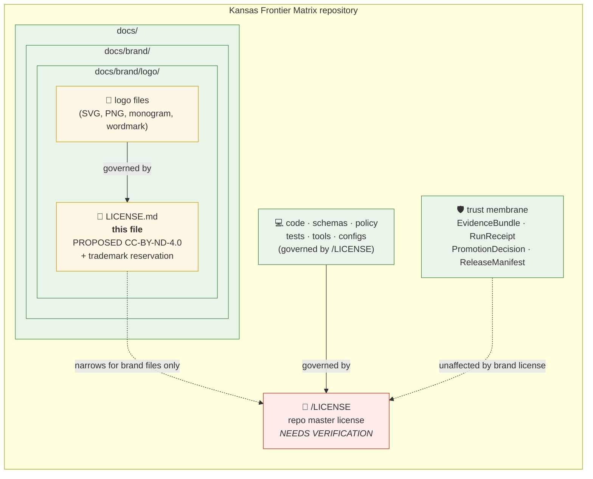

<!-- [KFM_META_BLOCK_V2]
doc_id: kfm://doc/brand-logo-license
title: KFM Brand & Logo Assets — License
type: standard
version: v0.1
status: draft
owners: TODO — KFM Brand / Governance stewards (NEEDS VERIFICATION)
created: 2026-05-15
updated: 2026-05-15
policy_label: public
related:
  - ../../../LICENSE
  - ../README.md
  - ../../doctrine/trust-membrane.md
  - ../../doctrine/directory-rules.md
  - ../../adr/README.md
tags: [kfm, brand, logo, license, trademark, spdx]
notes:
  - PROPOSED license selection for brand/logo assets — no governing ADR confirmed in this session.
  - Does NOT supersede the repository root LICENSE; scope is brand artwork and marks only.
[/KFM_META_BLOCK_V2] -->

# KFM Brand & Logo Assets — License

> License terms covering the **Kansas Frontier Matrix (KFM)** logo, wordmark, and brand artwork stored under `docs/brand/logo/`. **Code is governed separately by the repository root [`LICENSE`](../../../LICENSE).**

[](#status-and-scope)
[](#1--scope)
[](#3--license-posture-proposed)
[](#10--trademark-notice)
[](../../../LICENSE)
[](#status-and-scope)

**Status:** `draft` · **Owners:** _TODO — KFM Brand / Governance stewards (NEEDS VERIFICATION)_ · **Last updated:** 2026-05-15

> [!IMPORTANT]
> This file licenses **brand artwork and identity marks only**. It does **not** license source code, datasets, schemas, contracts, policies, evidence bundles, run receipts, or any other repository artifact. Those are governed by the repository root [`LICENSE`](../../../LICENSE), per-dataset licensing recorded in `SourceDescriptor` / `RunReceipt`, and applicable KFM governance docs.

---

## Mini-TOC

1. [Scope](#1--scope)
2. [Relationship to the root `LICENSE`](#2--relationship-to-the-root-license)
3. [License posture (PROPOSED)](#3--license-posture-proposed)
4. [License-scope diagram](#4--license-scope-diagram)
5. [Covered assets](#5--covered-assets)
6. [Permitted uses](#6--permitted-uses)
7. [Prohibited uses](#7--prohibited-uses)
8. [Attribution requirement](#8--attribution-requirement)
9. [SPDX and machine-readable posture](#9--spdx-and-machine-readable-posture)
10. [Trademark notice](#10--trademark-notice)
11. [Modifications, derivatives, and third-party submissions](#11--modifications-derivatives-and-third-party-submissions)
12. [Disclaimers and limitation of liability](#12--disclaimers-and-limitation-of-liability)
13. [Reporting misuse · contact](#13--reporting-misuse--contact)
14. [Status and scope](#status-and-scope)
15. [Open questions](#open-questions)
16. [Related docs](#related-docs)

---

## 1 · Scope

**PROPOSED:** This `LICENSE.md` governs the **identity assets** kept under `docs/brand/logo/` — primarily the KFM logo, wordmark, monogram, and any official brand artwork derivatives bundled with this repository.

The file is **scoped, not authoritative-over-everything**. The repository root `LICENSE` remains the master legal instrument for the repository; this file narrows the terms only for the brand-artwork files inside its own directory subtree.

> [!NOTE]
> **CONFIRMED placement basis.** Directory Rules §6.1 names `docs/brand/` as the canonical home for *"styles guides, logo, voice — only if not in `packages/ui/`."* Placing this file at `docs/brand/logo/LICENSE.md` follows that rule; the `logo/` sub-folder itself is **PROPOSED** until repo-verified.

---

## 2 · Relationship to the root `LICENSE`

**CONFIRMED doctrine:** the canonical root tree (Directory Rules §5) lists a top-level `LICENSE` file. That file is the master license for source code, schemas, policy, tests, tools, and other repository content. This brand-and-logo license does **not** replace it.

The intent is a clean two-layer arrangement:

| Layer | Path | Governs | Selection |
|---|---|---|---|
| Repository master | `LICENSE` (repo root) | Source code, schemas, contracts, policy, docs prose, tests, tools, configurations, examples | **NEEDS VERIFICATION** — selection not visible in this session |
| Brand & logo overlay | `docs/brand/logo/LICENSE.md` (this file) | KFM logo, wordmark, monogram, brand artwork files in the same directory subtree | **PROPOSED** — see §3 |

> [!IMPORTANT]
> If the two licenses materially conflict for a brand-asset file, **this file controls for that file**. For all other repository content, the root `LICENSE` controls. Authoritative resolution of any unresolvable conflict belongs to an ADR (`docs/adr/`).

[Back to top](#kfm-brand--logo-assets--license)

---

## 3 · License posture (PROPOSED)

> [!CAUTION]
> **NEEDS VERIFICATION.** No ADR confirming the brand-asset license has been verified in this session. The selections below are a **PROPOSED default** consistent with KFM's evidence-first, identity-protective posture. They MUST be ratified by an ADR under `docs/adr/` before being treated as the project's actual brand-asset license.

KFM treats brand identity as integrity-bearing, not as freely re-mixable creative content: the logo signals **provenance of governance**, not artistic style. The PROPOSED default reflects that:

| Element | PROPOSED license | SPDX identifier | Why |
|---|---|---|---|
| Logo artwork, wordmark, monogram (raster + vector) | Creative Commons **Attribution-NoDerivatives 4.0 International** | `CC-BY-ND-4.0` | Permits redistribution and reuse with attribution; **forbids** modified/derivative marks that could be mistaken for official KFM identity. |
| KFM name, "Kansas Frontier Matrix" mark, and related identifiers | Trademark-style reservation (not a copyright license) | _n/a_ — see §10 | Trademark protection cannot be granted via a copyright license; usage rules in §6–§7 govern. |

Other postures considered (each viable, none yet chosen):

- `CC-BY-4.0` — more permissive; would allow derivative marks.
- `CC-BY-SA-4.0` — share-alike; complicates downstream attribution.
- All-rights-reserved with explicit per-use grants — strictest; highest friction for legitimate community use.

**Decision lives in an ADR**, not in this file. Until that ADR lands, treat the selection as **PROPOSED**.

[Back to top](#kfm-brand--logo-assets--license)

---

## 4 · License-scope diagram

The diagram below shows how the brand-asset license sits **inside** the repository's overall license envelope, with the trust membrane (`apps/governed-api/`, release gates) unaffected by either.



> [!NOTE]
> **PROPOSED** styling reflects "not yet ADR-ratified," not "not yet drawn." If/when the brand-license ADR is accepted, the `LIC` and `ASSETS` nodes graduate to CONFIRMED in subsequent revisions of this diagram.

[Back to top](#kfm-brand--logo-assets--license)

---

## 5 · Covered assets

The license in §3 applies to brand-identity files in this directory subtree, including (PROPOSED list — to be reconciled with the actual contents of `docs/brand/logo/` once repo-verified):

- Primary logo (full lockup) — SVG and PNG.
- Wordmark ("Kansas Frontier Matrix") — SVG and PNG.
- Monogram / shorthand mark ("KFM") — SVG and PNG.
- Light-mode and dark-mode variants of any of the above.
- Favicon and social-share renditions derived from the marks.
- Any compiled sprite, glyph, or icon font built **from** the marks listed above and shipped under `docs/brand/logo/`.

It does **not** apply to:

- Source code or build tooling, even when those tools render brand artwork.
- Map-tile sprite sheets, MapLibre glyphs, fonts, or design-token packages governed by `packages/ui/` or `packages/maplibre/` (see Directory Rules §7.2; license per upstream).
- Third-party logos, partner marks, or external attribution glyphs even if they appear adjacent to KFM marks.
- Screenshots, social-media graphics, or compositions that *contain* the marks but are themselves authored under a different license recorded in a `SourceDescriptor` or per-file header.

> [!TIP]
> When in doubt about whether a file is covered, **the rule is per-file, not per-folder**: a file's effective license is the most specific applicable license, traceable to either this file, the root `LICENSE`, a `SourceDescriptor`, or a per-file SPDX header.

[Back to top](#kfm-brand--logo-assets--license)

---

## 6 · Permitted uses

Subject to §3, §7, §8, and the trademark notice in §10, the following uses of the covered brand assets are **PROPOSED-permitted**:

| # | Use case | Allowed? | Conditions |
|---|---|---|---|
| 6.1 | Verbatim use of an unmodified logo to identify the KFM project in articles, blog posts, talks, academic papers, and educational materials | ✅ | Attribution per §8; no implication of endorsement |
| 6.2 | Verbatim use in package documentation, READMEs, and dashboards that integrate with or consume KFM-released artifacts | ✅ | Attribution per §8; clearly distinct from your own branding |
| 6.3 | Inclusion in conference slides, lectures, course materials | ✅ | Attribution per §8 |
| 6.4 | Embedding in news, journalism, or commentary covering KFM | ✅ | Standard journalistic norms; no false endorsement claim |
| 6.5 | Linking to KFM with a thumbnail of the logo | ✅ | Attribution per §8 |
| 6.6 | Use within KFM-internal repositories, ADRs, runbooks, and governance docs | ✅ | No conditions beyond normal repo etiquette |

[Back to top](#kfm-brand--logo-assets--license)

---

## 7 · Prohibited uses

> [!WARNING]
> The following are **prohibited** without prior written permission from the KFM brand stewards. A copyright license (§3) and a trademark restriction (§10) both contribute to the prohibitions below; permission may be required under either, even if the other appears to allow the use.

| # | Use case | Prohibited because |
|---|---|---|
| 7.1 | Modifying, recoloring, distorting, cropping, or re-stylizing the logo such that the modified mark could plausibly be mistaken for an official KFM mark | `CC-BY-ND` forbids derivatives; also a trademark concern |
| 7.2 | Producing merchandise (apparel, stickers, mugs, prints) using the marks for sale | Trademark concern; commercial identity implications |
| 7.3 | Using the marks in any context implying KFM endorsement, sponsorship, partnership, certification, or affiliation that does not exist | Trademark; false-association harm |
| 7.4 | Using the marks as part of a product name, project name, organization name, domain name, or trademark of a third party | Trademark dilution |
| 7.5 | Combining the marks with hateful, harassing, discriminatory, defamatory, or misleading content | Brand-integrity harm |
| 7.6 | Using the marks to represent generated, AI-authored, or unreviewed outputs as if they were governed KFM publications | Conflicts with KFM's cite-or-abstain posture and trust-membrane discipline |
| 7.7 | Using the marks to claim KFM provenance for content that has not transited the KFM lifecycle (`RAW → WORK/QUARANTINE → PROCESSED → CATALOG/TRIPLET → PUBLISHED`) | Trust-membrane violation; misrepresents governance |
| 7.8 | Stripping attribution required by §8 | License condition violation |
| 7.9 | Re-licensing the marks to third parties under terms different from this file | No sublicensing right is granted |

> [!IMPORTANT]
> Use case **7.6** and **7.7** are not stylistic preferences — they map directly to KFM's governance invariants. A KFM logo on uncited, ungoverned, or AI-generated content misrepresents the project's evidence posture and is treated as a brand-integrity incident, not merely a license breach.

[Back to top](#kfm-brand--logo-assets--license)

---

## 8 · Attribution requirement

Where attribution is required (most permitted uses), the **minimum attribution** is:

```text
"Kansas Frontier Matrix" logo © Kansas Frontier Matrix contributors.
Licensed under CC-BY-ND-4.0 (PROPOSED). https://creativecommons.org/licenses/by-nd/4.0/
```

Preferred form when space permits, e.g., in a paper, an "About" page, or a credits block:

```text
The Kansas Frontier Matrix (KFM) logo is used courtesy of the Kansas Frontier Matrix
project under a PROPOSED Creative Commons Attribution-NoDerivatives 4.0 International
license (CC-BY-ND-4.0). "Kansas Frontier Matrix" and the KFM mark are trademarks of
the Kansas Frontier Matrix project; see docs/brand/logo/LICENSE.md.
```

Brief, in-line, or low-real-estate uses (e.g., a slide footer, a favicon tooltip) MAY abbreviate to:

```text
Logo: © KFM, CC-BY-ND-4.0 (PROPOSED).
```

> [!NOTE]
> **NEEDS VERIFICATION.** The copyright holder string (`"Kansas Frontier Matrix contributors"`) is a PROPOSED default. The actual holder — individual author, organization, university, or collective — has not been resolved in this session and SHOULD be settled in the same ADR that ratifies §3.

[Back to top](#kfm-brand--logo-assets--license)

---

## 9 · SPDX and machine-readable posture

KFM's promotion and release machinery records license posture in `RunReceipt.license.spdx_id` and uses SPDX identifiers in gate fixtures (see indexed KFM doctrine on `run_receipt` and Promotion Gate B — License & Provenance).

When a brand-asset file is referenced by a `SourceDescriptor`, `LayerManifest`, `ReleaseManifest`, or `RunReceipt`, the recommended fields are:

```json
{
  "license": {
    "spdx_id": "CC-BY-ND-4.0",
    "license_text_ref": "docs/brand/logo/LICENSE.md",
    "scope": "brand-asset",
    "trademark_notice_ref": "docs/brand/logo/LICENSE.md#10--trademark-notice"
  }
}
```

> [!NOTE]
> `spdx_id` here is **PROPOSED** and tracks §3. If the brand-license ADR selects a different license, every receipt that referenced the prior identifier must be re-emitted (or annotated with a `CorrectionNotice`) so the SPDX posture in machine-readable governance stays consistent with the human-readable text. License-posture mismatches are a documented `QUARANTINE` trigger in the promotion gates.

<details>
<summary><b>Why SPDX matters here</b> — expand for governance context</summary>

KFM's policy posture treats *unknown* SPDX as fail-closed:

- Gate B (License & Provenance) rejects empty or unrecognized SPDX values.
- Promotion to `CATALOG`, `TRIPLET`, or `PUBLISHED` requires a passing license verdict.
- `Unknown license posture: QUARANTINE` is part of the canonical run-receipt validator chain.

Brand assets are usually low-risk for legal admissibility, but they share the same machine-readable lane as data sources and tile artifacts. A clean, declared SPDX identifier keeps the lane uniform, prevents accidental `UNKNOWN` quarantines on brand-bearing artifacts, and lets gate fixtures be written generically.

</details>

[Back to top](#kfm-brand--logo-assets--license)

---

## 10 · Trademark notice

> [!IMPORTANT]
> **"Kansas Frontier Matrix"**, **"KFM"**, and any associated logos, wordmarks, monograms, and stylized identifiers are trademarks of the Kansas Frontier Matrix project (specific holder **NEEDS VERIFICATION**).

A copyright license (such as CC-BY-ND-4.0 in §3) governs the **artwork** — the pixels and vectors that *constitute* the logo. It does **not** grant trademark rights, nor does it permit use of the name or marks in a way that creates association, sponsorship, or endorsement that does not exist.

Trademark usage is governed by the rules in §6 (permitted) and §7 (prohibited) above, plus standard trademark-law constraints in the user's jurisdiction. The absence of a formal registration symbol (`®`) on any particular use does **not** waive any rights; the marks may be used with `™` even where formal registration has not been completed.

[Back to top](#kfm-brand--logo-assets--license)

---

## 11 · Modifications, derivatives, and third-party submissions

Because the PROPOSED license is `CC-BY-ND-4.0`, derivative marks are not permitted by default. The following narrow exceptions are envisioned but **NEEDS VERIFICATION**:

- **Internal-only variants** authored by KFM contributors for specific contexts (dark mode, monochrome print, low-resolution favicons) — these are not "derivatives" in the licensing sense, they are official renditions of the same mark.
- **Accessibility renditions** (high-contrast, color-blind-safe palettes) authored or accepted by KFM brand stewards — same rationale.
- **Embedded use inside a larger composition** (e.g., a poster about KFM that displays the logo unmodified within a larger design) is *not* a derivative of the mark itself.

Third parties wishing to contribute new logo variants, brand artwork, or related marks SHOULD route the contribution through the standard repository contribution flow, with explicit license-assignment language sufficient to keep the resulting file under this `LICENSE.md` (or its successor).

[Back to top](#kfm-brand--logo-assets--license)

---

## 12 · Disclaimers and limitation of liability

The brand and logo assets are provided **"AS IS"**, without warranty of any kind, express or implied, including warranties of merchantability, fitness for a particular purpose, non-infringement, or accuracy. In no event shall the KFM project, its contributors, or its stewards be liable for any claim, damages, or other liability arising from use of the marks, whether in an action of contract, tort, or otherwise.

This disclaimer parallels the standard disclaimer in CC and most permissive licenses. It is restated here so that downstream readers do not need to chase the upstream CC text to find it.

[Back to top](#kfm-brand--logo-assets--license)

---

## 13 · Reporting misuse · contact

For questions, permission requests beyond §6, or to report apparent misuse:

- **Channel:** _TODO — official KFM contact channel (mailing list, email alias, or issue tracker label)_ — **NEEDS VERIFICATION**.
- **Issue label (PROPOSED):** `brand-misuse` on the KFM issue tracker.
- **Severity escalation:** brand-integrity incidents that could mislead users about KFM publication provenance SHOULD be raised as **governance** issues, not merely as legal issues, because they touch the trust-membrane invariants in §7.6–§7.7.

[Back to top](#kfm-brand--logo-assets--license)

---

## Status and scope

| Field | Value | Label |
|---|---|---|
| Document status | `draft` | CONFIRMED |
| Document path | `docs/brand/logo/LICENSE.md` | PROPOSED (sub-folder not directly named in Directory Rules §6.1) |
| License selection (§3) | `CC-BY-ND-4.0` + trademark reservation | PROPOSED |
| Copyright holder string (§8) | `Kansas Frontier Matrix contributors` | PROPOSED · NEEDS VERIFICATION |
| Owners | KFM Brand / Governance stewards | NEEDS VERIFICATION |
| Governing ADR | _none in session_ | OPEN |
| Relation to root `LICENSE` | scoped overlay, does not supersede | CONFIRMED (doctrine: Directory Rules §5) |
| Covered-asset list (§5) | illustrative | PROPOSED |

[Back to top](#kfm-brand--logo-assets--license)

---

## Open questions

1. Which entity is the actual copyright holder of the KFM brand artwork? Individual author, organization, university lab, or contributor collective?
2. Has the KFM name been registered as a trademark in any jurisdiction? If so, the `™` references in §10 should be upgraded selectively to `®` for those jurisdictions.
3. Should the brand-license selection be made via a dedicated ADR, or rolled into a wider "publication and rights" ADR?
4. Should brand assets receive their own `SourceDescriptor` for SPDX governance parity with other release artifacts (§9)?
5. Should a `CONTRIBUTING-brand.md` companion exist to formalize the third-party-submission flow in §11?
6. Where is the official KFM brand-contact channel (§13) ultimately hosted?

These belong in `docs/registers/VERIFICATION_BACKLOG.md` until resolved.

[Back to top](#kfm-brand--logo-assets--license)

---

## Related docs

- [`../../../LICENSE`](../../../LICENSE) — repository master license (root) — **NEEDS VERIFICATION**
- [`../README.md`](../README.md) — `docs/brand/` README (orientation for brand assets) — **PROPOSED / NEEDS VERIFICATION**
- [`../../doctrine/directory-rules.md`](../../doctrine/directory-rules.md) — Directory Rules (placement basis for this file)
- [`../../doctrine/trust-membrane.md`](../../doctrine/trust-membrane.md) — trust membrane (context for §7.6–§7.7)
- [`../../adr/`](../../adr/) — Architectural Decision Records (home of the future brand-license ADR)
- [`../../registers/VERIFICATION_BACKLOG.md`](../../registers/VERIFICATION_BACKLOG.md) — outstanding verification items
- Upstream license text: Creative Commons Attribution-NoDerivatives 4.0 International — <https://creativecommons.org/licenses/by-nd/4.0/legalcode>

---

_Last updated: 2026-05-15 · Document version: v0.1 · Status: draft_

[Back to top](#kfm-brand--logo-assets--license)
