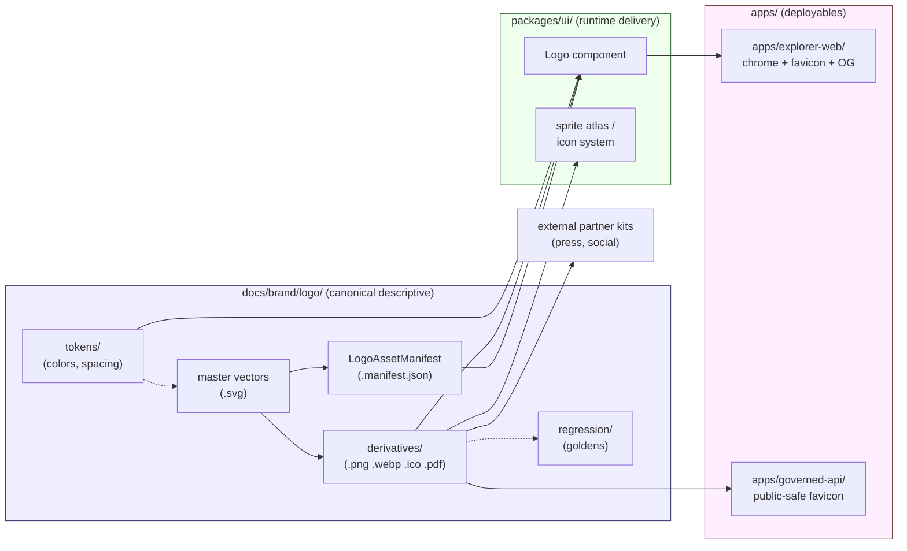

<!-- [KFM_META_BLOCK_V2]
doc_id: kfm://doc/brand-logo-readme
title: docs/brand/logo — KFM Brand Mark and Identity Assets
type: standard
version: v1
status: draft
owners: [TODO: brand-steward, docs-steward]
created: 2026-05-15
updated: 2026-05-15
policy_label: public
related:
  - docs/brand/README.md
  - docs/brand/wordmark/README.md
  - docs/brand/voice/README.md
  - docs/brand/colors/README.md
  - packages/ui/README.md
  - docs/standards/PMTILES.md
  - docs/adr/README.md
tags: [kfm, brand, logo, identity, design-tokens, accessibility, governance]
notes:
  - Compatibility-root tension with packages/ui/ — see §3 and §13.
  - All implementation paths PROPOSED; repository not mounted in this session.
[/KFM_META_BLOCK_V2] -->

# logo — KFM Brand Mark and Identity Assets

> Canonical home for the **Kansas Frontier Matrix** brand mark, wordmark variants, favicons, social cards, and the metadata that governs their use across public surfaces.

[](#status)
[](#license-rights--attribution)
[](#authority-level-and-the-packagesui-question)
[](#license-rights--attribution)
[](#validation)
[](#last-reviewed)

**Status:** draft &nbsp;·&nbsp; **Owners:** [TODO: brand-steward, docs-steward] &nbsp;·&nbsp; **Last updated:** 2026-05-15

---

## 📑 Contents

1. [Purpose](#1-purpose)
2. [Repo fit](#2-repo-fit)
3. [Authority level and the `packages/ui/` question](#3-authority-level-and-the-packagesui-question)
4. [Status](#4-status)
5. [What belongs here](#5-what-belongs-here)
6. [What does NOT belong here](#6-what-does-not-belong-here)
7. [Directory tree (PROPOSED)](#7-directory-tree-proposed)
8. [Asset inventory and roles](#8-asset-inventory-and-roles)
9. [Clear space, minimum size, and contrast rules](#9-clear-space-minimum-size-and-contrast-rules)
10. [Logo metadata sidecar](#10-logo-metadata-sidecar)
11. [Derivative and rebuild policy](#11-derivative-and-rebuild-policy)
12. [Diagram — logo lineage and consumers](#12-diagram--logo-lineage-and-consumers)
13. [Inputs](#13-inputs)
14. [Outputs](#14-outputs)
15. [Validation](#15-validation)
16. [Review burden](#16-review-burden)
17. [License, rights & attribution](#17-license-rights--attribution)
18. [Anti-patterns](#18-anti-patterns)
19. [FAQ](#19-faq)
20. [Related folders & docs](#20-related-folders--docs)
21. [ADRs](#21-adrs)
22. [Appendix — placeholder asset manifest example](#22-appendix--placeholder-asset-manifest-example)
23. [Last reviewed](#last-reviewed)

---

## 1. Purpose

**PROPOSED.** `docs/brand/logo/` is the **canonical descriptive home** for the KFM brand mark and identity assets: the source vectors, derivative rasters, clear-space rules, minimum-size rules, color tokens specific to the mark, and the metadata sidecar that governs each asset's use.

It explains and stewards the mark. It is **not** the runtime delivery surface — applications consume logo assets from `packages/ui/` (or the equivalent shipped UI package), not by reaching into `docs/`.

> [!IMPORTANT]
> A logo is a **public, persistent, authority-signalling** artifact. In KFM terms it sits one level closer to `release/` than most documentation: a drifted or misused mark visually re-labels every map, badge, drawer, and report it touches. Treat changes here as **publication-significant**, not cosmetic.

[⬆ Back to top](#-contents)

---

## 2. Repo fit

**PROPOSED placement.** Per **Directory Rules §6.1** (`docs/` canonical tree), `docs/brand/` is enumerated with the note:

> `docs/brand/   # styles guides, logo, voice — only if not in packages/ui/`

**Upstream of this folder**

- `docs/brand/README.md` — parent brand index (purpose, voice/visual split). [PROPOSED]
- `docs/doctrine/` — publication, sensitivity, and trust-membrane doctrine that constrains how the mark is used in public artifacts. [CONFIRMED doctrine, PROPOSED file paths]
- `docs/adr/` — ADRs that govern brand-asset homes and any `packages/ui/` migration. [PROPOSED]

**Downstream consumers**

- `packages/ui/` — shared UI components that consume the released mark via design tokens. [PROPOSED]
- `apps/explorer-web/` — the deployable shell; renders the mark in the chrome and social cards. [PROPOSED]
- `apps/governed-api/` — may serve a public-safe favicon and OpenGraph image; never imports source vectors. [PROPOSED]
- `docs/**` — uses the mark only via stable relative paths to released derivatives in this folder. [PROPOSED]
- External press / partner kits — packaged from this folder's `derivatives/` after license check. [PROPOSED]

> [!NOTE]
> Per **Directory Rules §8 / §8.1**, `styles/` is a **compatibility root** with three possible canonical homes (`packages/ui/`, `apps/explorer-web/`, or `docs/brand/`). The logo lives at the *intersection*: descriptive governance belongs in `docs/brand/`; shipped assets belong in `packages/ui/`. The split is enforced by §3 below.

[⬆ Back to top](#-contents)

---

## 3. Authority level and the `packages/ui/` question

**Authority level:** Canonical (descriptive) — PROPOSED. **Class:** governance + documentation. **Not** a runtime delivery root; **not** a release-bearing folder.

Directory Rules permit a brand home at `docs/brand/` **only if** brand assets do not already live under `packages/ui/`. KFM today has neither folder verified in the current session, so the split below is the **proposed default** until an ADR records the decision.

| Question | Lives here (`docs/brand/logo/`) | Lives in `packages/ui/` | Reason |
|---|---|---|---|
| Source vectors (master `.svg`) | ✅ canonical | mirror only | Source-of-truth vectors are authoritative documentation. |
| Derivative rasters (`.png`, `.webp`) | ✅ canonical | mirror only | Rendered at known sizes; license-checked; checksum-bound. |
| Color hex / token values for the mark | ✅ canonical | consumes | Token *values* are documented here; bundled tokens ship in `packages/ui/`. |
| `LogoAssetManifest` sidecar (JSON) | ✅ canonical | n/a | Documentation-bound metadata. |
| Runnable React/Vue component wrapping `<Logo />` | ❌ | ✅ canonical | Components ship from `packages/ui/`. |
| Sprite sheet / glyph atlas integration | ❌ | ✅ canonical | Atlas builds belong with the renderer assets. |
| Public-safe favicon files served at runtime | mirror | ✅ canonical (or `apps/`) | Runtime artifact; not documentation. |

> [!WARNING]
> **No parallel authority.** Per Directory Rules §8.3, two homes for the same authority is the most common KFM drift. If `packages/ui/brand/` ever becomes the runtime home for source vectors, this folder must be re-classed (`mirror` or `legacy`) and migrated under an **ADR-brand-home** entry — not allowed to evolve in parallel.

[⬆ Back to top](#-contents)

---

## 4. Status

**PROPOSED.** No `docs/brand/logo/` directory was verified in the mounted workspace this session. All paths, file names, ADR references, owner handles, and badge targets in this README are PROPOSED until checked against the live repository.

| Aspect | Truth label |
|---|---|
| Directory Rules §6.1 reference to `docs/brand/` | CONFIRMED (Directory Rules) |
| Compatibility-root behavior of `styles/` | CONFIRMED (Directory Rules §8.1) |
| This folder exists in the mounted repo | UNKNOWN (no repo mounted) |
| Sub-tree layout below | PROPOSED |
| `packages/ui/` exists and consumes from here | UNKNOWN |
| ADR pinning the brand home | NEEDS VERIFICATION |
| WCAG / accessibility thresholds | EXTERNAL (general guidance only — see §17) |

[⬆ Back to top](#-contents)

---

## 5. What belongs here

Accepted file types and object families (PROPOSED):

- **Master vector sources.** `.svg` files authored at vector precision; one mark per file; no embedded raster.
- **Derivative rasters.** `.png` and `.webp` exported at named, fixed sizes (e.g., `16`, `32`, `48`, `192`, `512`, `1024`).
- **Favicon bundles.** `.ico` plus the `.png` series consumed by `apps/explorer-web/`.
- **Social cards.** OpenGraph / X-card templates at `1200×630`, plus any per-channel variants.
- **Print masters.** `.pdf` or high-resolution `.svg` for partner kits.
- **`LogoAssetManifest`** sidecars (JSON) — see §10.
- **Documentation pages.** `USAGE.md`, `LICENSE.md`, `CHANGELOG.md`, this README, and any rules-of-use addenda.
- **Visual-regression baselines** for the mark itself (golden snapshots tied to a `style_digest`).

> [!TIP]
> Treat the master `.svg` as authoritative. Sprites, thumbnails, and rasters are **derivatives** — this mirrors the corpus rule that source vectors are authoritative and PNG/sprites are derivatives that must preserve alignment and padding. [CONFIRMED doctrine]

[⬆ Back to top](#-contents)

---

## 6. What does NOT belong here

> [!CAUTION]
> The "do not put X here" list is as important as the "do put Y here" list. Anything in the list below is a **drift candidate** and should be moved.

- ❌ Generic project icons, UI glyphs, or domain symbols (event, hydrology, climate, archaeology). Those live with the symbol system under `packages/ui/` or the renderer package — not in `docs/brand/logo/`. [PROPOSED placement]
- ❌ Trademarks, marks, or logos belonging to **other** organizations, sources, or partners. License-controlled third-party marks live under a separate, gated `docs/brand/partners/` or in a rights-attached source descriptor — never co-mingled with the KFM mark.
- ❌ AI-generated speculative mark explorations claimed as canonical. Exploratory mark studies belong in `docs/archive/exploratory/` until promoted via review.
- ❌ Receipts, proofs, or release manifests. Those live in `data/receipts/`, `data/proofs/`, and `release/` (Directory Rules §13.2).
- ❌ Build outputs of the runtime app. Compiled favicons baked into a deployment go to `apps/explorer-web/` build output or `artifacts/build/` — not back here.
- ❌ Anything that would re-route public traffic. The mark is referenced; it does not host or serve.
- ❌ Fonts (full typeface files). Typeface licensing and assets live under `docs/brand/typography/` or `packages/ui/fonts/` with their own license sidecar. [PROPOSED]

[⬆ Back to top](#-contents)

---

## 7. Directory tree (PROPOSED)

> [!NOTE]
> The tree below is a **PROPOSED** layout aligned to Directory Rules §6.1 and §15. It has not been verified against a mounted repository. Names with `<>` are placeholders. Any deviation from this tree requires updating §10 (`LogoAssetManifest`) and the ADR referenced in §21.

```text
docs/brand/logo/
├── README.md                       # this file
├── USAGE.md                        # do/don't gallery, clear-space, sizing
├── LICENSE.md                      # mark licensing, attribution, trademark notice
├── CHANGELOG.md                    # mark version history with style_digest pins
│
├── mark/                           # the standalone symbol
│   ├── kfm-mark.svg                # source vector
│   ├── kfm-mark.manifest.json      # LogoAssetManifest sidecar
│   └── derivatives/
│       ├── kfm-mark-16.png
│       ├── kfm-mark-32.png
│       ├── kfm-mark-48.png
│       ├── kfm-mark-192.png
│       ├── kfm-mark-512.png
│       └── kfm-mark-1024.png
│
├── wordmark/                       # mark + "Kansas Frontier Matrix" lockup
│   ├── kfm-wordmark.svg
│   ├── kfm-wordmark.manifest.json
│   └── derivatives/
│       ├── kfm-wordmark-light.svg
│       ├── kfm-wordmark-dark.svg
│       └── kfm-wordmark-512.png
│
├── favicon/                        # browser/tab favicons (descriptive copies)
│   ├── favicon.ico
│   ├── favicon-16.png
│   ├── favicon-32.png
│   ├── favicon-180.png             # apple-touch-icon
│   └── favicon.manifest.json
│
├── social/                         # OpenGraph / X-card / social previews
│   ├── og-default-1200x630.png
│   ├── og-default-1200x630.svg
│   └── social.manifest.json
│
├── print/                          # high-res masters for partner / press kits
│   ├── kfm-mark-print.pdf
│   └── kfm-wordmark-print.pdf
│
├── tokens/                         # brand-mark-specific color/space tokens
│   ├── colors.tokens.json
│   └── spacing.tokens.json
│
└── regression/                     # golden visual-regression baselines
    ├── kfm-mark.golden.png
    └── kfm-wordmark.golden.png
```

[⬆ Back to top](#-contents)

---

## 8. Asset inventory and roles

**PROPOSED.** The table below names the canonical role of each asset family. Names and pixel sizes are illustrative defaults; the binding values live in the `LogoAssetManifest` sidecars (§10).

| Asset family | Role | Source format | Derivatives | Min size | Notes |
|---|---|---|---|---|---|
| `mark` | Standalone symbol; the brand mark in isolation | `.svg` | `.png` @ 16/32/48/192/512/1024 | **24 px** | Used in compact UI chrome, badges. |
| `wordmark` | Mark + "Kansas Frontier Matrix" lockup | `.svg` (light + dark) | `.png` @ 512/1024 | **120 px** wide | Headers, hero sections, public reports. |
| `favicon` | Browser tab / pinned-app icon | `.ico` + `.png` | `.png` @ 16/32/180 | 16 px | Public-safe; cached aggressively. |
| `social` | Open Graph / social preview card | `.svg` + `.png` | `.png` @ 1200×630 | 1200×630 | Includes wordmark + governance line. |
| `print` | Partner / press kits | `.pdf` + high-res `.svg` | n/a | 300 dpi @ ≥ 2 in | Includes trademark notice in margin. |

[⬆ Back to top](#-contents)

---

## 9. Clear space, minimum size, and contrast rules

**PROPOSED.** These rules constrain *use*, not authorship. The mark is governance-significant; misuse implies certainty, authority, or endorsement that KFM has not actually granted.

| Rule | Default | Rationale |
|---|---|---|
| **Clear space** | `≥ 0.5×` the mark's cap-height on every side | Prevents the mark from being read as part of an adjacent element. |
| **Minimum size — mark** | 24 px digital / 0.5 in print | Below this, derivative rasters lose hinting and the mark becomes ambiguous with generic icons. |
| **Minimum size — wordmark** | 120 px wide digital / 1.5 in print | Below this, the wordmark text is illegible and should be replaced with the standalone mark. |
| **Contrast (text + mark on background)** | ≥ **4.5 : 1** (WCAG AA, normal text equivalent) [EXTERNAL] | Brand artifacts share the trust-visible surface with map legends and badges; sub-AA contrast risks the same accessibility failure as a colorbar. [Corpus reference: WCAG-compliant colorbars are required.] |
| **Light/dark variants** | Required for any surface that flips theme | Eliminates style drift where contrast collapses on the alternate theme. |
| **No re-coloring** | Mark colors only from `tokens/colors.tokens.json` | Re-color changes the trust state of the mark; treat as a versioned change requiring a new `style_digest`. |
| **No rotation, distortion, drop-shadow, or 3-D effect** | Forbidden in public surfaces | Style filters can imply emphasis, alarm, or hierarchy the mark does not carry. |

> [!IMPORTANT]
> The 4.5:1 contrast figure is **EXTERNAL** general guidance reflecting WCAG 2.1 AA for normal text. KFM has not yet pinned its own canonical contrast threshold for brand artifacts. Treat the row as a sensible default pending a brand-accessibility ADR.

[⬆ Back to top](#-contents)

---

## 10. Logo metadata sidecar

**PROPOSED.** Every asset family in this folder ships with a `*.manifest.json` sidecar — a `LogoAssetManifest`. This binds the asset to KFM governance the same way `StyleManifest` binds map styles.

> [!NOTE]
> `LogoAssetManifest` is **PROPOSED** terminology and is **not** yet a registered object family in `contracts/` or `schemas/`. Pinning it requires an ADR and a schema home under `schemas/contracts/v1/...` (per Directory Rules §6.4 / ADR-0001).

Suggested fields (illustrative — not pinned in `contracts/`):

| Field | Type | Purpose |
|---|---|---|
| `asset_id` | string | Stable ID, e.g. `kfm-mark-v1`. |
| `family` | enum | `mark` \| `wordmark` \| `favicon` \| `social` \| `print`. |
| `version` | semver | Bumped on any pixel-affecting change. |
| `source_path` | path | Relative path to the master `.svg`. |
| `derivative_paths[]` | path[] | Relative paths to rasters/exports. |
| `style_digest` | hash | `blake3` or `sha256` of the canonicalized source + render inputs. |
| `content_hash` | hash | Per-derivative content hash. |
| `license` | string | SPDX or proprietary tag — see §17. |
| `rights_status` | enum | `public` \| `controlled` \| `restricted` — see Directory Rules trust-membrane. |
| `min_size_px` | integer | Smallest legible render size. |
| `clear_space_ratio` | number | Multiplier of cap-height. |
| `tokens_ref` | path | Reference to `tokens/colors.tokens.json`. |
| `regression_baseline` | path | Golden image path under `regression/`. |
| `review_state` | enum | `draft` \| `in_review` \| `approved`. |
| `release_state` | enum | `unreleased` \| `candidate` \| `released` \| `withdrawn`. |
| `supersedes` | string \| null | Prior `asset_id` if this version replaces it. |
| `commit_sha` | string | Repo SHA at which the asset was approved. |

See §22 for a worked illustrative example.

[⬆ Back to top](#-contents)

---

## 11. Derivative and rebuild policy

**PROPOSED.** Treat derivatives the way KFM treats released tiles: rebuildable from source, never edited directly.

1. **Master vectors are authoritative.** Any change starts with the `.svg` source. [CONFIRMED doctrine — source vectors are authoritative]
2. **Rasters are derivatives.** `.png`, `.webp`, `.ico`, OG cards rebuild deterministically from the master via a `tools/brand/` builder (PROPOSED).
3. **Style digest pins regression.** A change that alters pixels bumps `style_digest`; the golden in `regression/` regenerates only after review.
4. **No hand-editing rasters.** Hand-tuned rasters drift silently from source. If hinting requires it, add a per-size source variant — don't fork the derivative.
5. **Rollback target.** Withdrawing a mark version requires a `RollbackCard` reference (Directory Rules / release lane); the prior `asset_id` remains served from `derivatives/` until cache invalidation completes.

[⬆ Back to top](#-contents)

---

## 12. Diagram — logo lineage and consumers



> [!NOTE]
> The diagram reflects the **PROPOSED** split in §3. It must be reconciled with mounted-repo evidence before being treated as fact.

[⬆ Back to top](#-contents)

---

## 13. Inputs

- Hand-authored vector source files committed by the brand steward.
- `tools/brand/` builder (PROPOSED) producing pixel-accurate derivatives from master vectors.
- Token files in `tokens/` (PROPOSED) sourced from or mirrored to the canonical design-token home in `packages/ui/`.
- ADR decisions that pin the brand home, accessibility threshold, and trademark notice.

## 14. Outputs

- `packages/ui/<logo-component>` consumes derivatives and tokens from this folder via a stable relative path or build-time copy.
- `apps/explorer-web/` serves the public favicon, OG card, and chrome logo via the package boundary above — never reaching into `docs/`.
- `docs/**` references derivatives in this folder by stable relative path for README badges, diagrams, and report headers.
- Partner / press kits assembled from `derivatives/` and `print/` under a license-checked export workflow (PROPOSED).

[⬆ Back to top](#-contents)

---

## 15. Validation

**PROPOSED.** Until a `tools/brand/` validator exists in the mounted repo, the table below describes the *intended* check surface, not enforced behavior.

| Check | Where it should live | What it asserts |
|---|---|---|
| Manifest schema validation | `tools/validators/brand/` (PROPOSED) | Every asset has a `LogoAssetManifest`; required fields present; SPDX license recognized. |
| Derivative checksum match | same validator | Each derivative's `content_hash` matches a rebuild from the master at the pinned `style_digest`. |
| Visual regression | `regression/` + CI | Rendered master + each derivative match the golden baseline; diffs above tolerance fail the build. |
| Contrast preflight | same validator | Mark + wordmark + social card pass the contrast threshold pinned by the brand-accessibility ADR. |
| License preflight | same validator | License field set; trademark notice present in `LICENSE.md`. |
| Source-vector-authoritative check | same validator | No `.png` lacks a parent `.svg`; no derivative newer than its master. |
| Path / sprawl scan | `tools/validators/directory_rules/` (PROPOSED) | No brand assets outside `docs/brand/logo/` and the declared mirror in `packages/ui/`. |

> [!WARNING]
> Until validators exist, **CI cannot block drift here**. Treat this folder as **soft-governed** in the interim; reviewers carry the burden.

[⬆ Back to top](#-contents)

---

## 16. Review burden

**PROPOSED.** Until `CODEOWNERS` is verified in the mounted repo, owners are placeholders.

- **[TODO: @kfm-brand-steward]** — owns mark, wordmark, social, print, tokens.
- **[TODO: @kfm-docs-steward]** — owns this README, `USAGE.md`, `LICENSE.md`, `CHANGELOG.md`.
- **[TODO: @kfm-accessibility-reviewer]** — required reviewer on any change touching `tokens/colors.tokens.json` or contrast-sensitive derivatives.
- **[TODO: @kfm-release-steward]** — separation-of-duties signer on any change that propagates to `packages/ui/` or `apps/explorer-web/`.

[⬆ Back to top](#-contents)

---

## 17. License, rights & attribution

**PROPOSED.** The mark and wordmark license, ownership, and trademark posture **must be pinned** before any external publication of `derivatives/`.

- **Mark license.** [TODO — pin SPDX identifier or proprietary license name in `LICENSE.md`.]
- **Wordmark.** Same license as the mark unless the wordmark contains externally-licensed typography; in that case, attribute the typeface separately.
- **Typography.** Fonts are **not** in this folder — license visibility is required wherever the typeface ships. [CONFIRMED doctrine — font/glyph licensing must be visible]
- **Trademark notice.** A `™` or `®` notation belongs in `LICENSE.md` and in the footer of `print/` masters. [PROPOSED — pending ADR]
- **Partner / co-branded use.** Requires a written rights record in `data/registry/` and a `PromotionDecision` before any co-branded derivative is published.

> [!IMPORTANT]
> **Rights / sensitivity.** Per the KFM trust-membrane (Directory Rules §7.1 and doctrine), public surfaces require positive rights closure. An unlicensed or ambiguously-licensed mark does not satisfy this. **Default behavior:** if `license` or `rights_status` is unset on a `LogoAssetManifest`, the brand validator fails closed.

[⬆ Back to top](#-contents)

---

## 18. Anti-patterns

| Anti-pattern | Why it is dangerous | Mitigation |
|---|---|---|
| **Hand-edited derivative drift** | A tuned `.png` no longer matches its master; trust state diverges. | Rebuild from `.svg`; treat rasters as derivatives only. |
| **Re-colored mark in a report** | Implies a non-released variant or a different program; visually re-labels authority. | Use only colors from `tokens/colors.tokens.json`; bump `style_digest` for any new variant. |
| **Mark below minimum size** | Reads as a generic icon; viewers conflate KFM with adjacent UI glyphs. | Switch to `favicon/` series below the minimum; never down-scale `mark/`. |
| **External partner mark co-located here** | Implies parity, endorsement, or KFM ownership. | Partner marks live in a separate, gated folder with their own license sidecar. |
| **Speculative AI-generated marks claimed as canon** | Generated visuals can imply a release decision that never happened. | Exploratory studies go to `docs/archive/exploratory/`. |
| **Parallel home in `packages/ui/`** | Two homes for the same authority is the most common drift in KFM. (Directory Rules §8.3) | ADR + migration; one canonical, the other a `mirror` or `legacy`. |
| **Stale OG card** | A withdrawn or rebranded mark stays cached by social platforms long after rollback. | Bump OG image filename on every `style_digest` change; record cache-invalidation hook. |

[⬆ Back to top](#-contents)

---

## 19. FAQ

<details>
<summary><strong>Why is the logo home in <code>docs/</code> at all? Isn't it shipping code?</strong></summary>

The **source vectors and the rules of use** are documentation — they explain and govern. The **shipped component** (a `<Logo />` you import into a page) is code and belongs in `packages/ui/`. Directory Rules §6.1 explicitly contemplates this split via the conditional "*only if not in `packages/ui/`*" note. Until an ADR records a different decision, descriptive governance is canonical here and runtime delivery is canonical in `packages/ui/`.

</details>

<details>
<summary><strong>Can I import an SVG directly from <code>docs/brand/logo/mark/</code> in a React component?</strong></summary>

No — that crosses the trust boundary the wrong way. `docs/` is descriptive; applications import from `packages/ui/`. A build step may **copy** master vectors into `packages/ui/` at version pin time, but `apps/**` and runtime code must not reach into `docs/` for build inputs.

</details>

<details>
<summary><strong>What happens during a rebrand?</strong></summary>

A rebrand is a publication-significant change. It requires (a) an ADR, (b) a new `asset_id` and bumped version in every affected `LogoAssetManifest`, (c) a `supersedes` link to the prior `asset_id`, (d) a `RollbackCard` so the prior mark can be restored if the rebrand is withdrawn, (e) cache-invalidation hooks for favicons and OG cards, and (f) updates to every consumer of `tokens/colors.tokens.json`. See Directory Rules §14.3 ("Renames that change object identity").

</details>

<details>
<summary><strong>Where does the favicon actually live at runtime?</strong></summary>

The **descriptive source** is `docs/brand/logo/favicon/`. The **runtime path** (e.g., `apps/explorer-web/public/favicon.ico`) is filled by a build step that copies from here. The runtime path is **not** a parallel authority — it is a generated mirror.

</details>

<details>
<summary><strong>Why does the mark need a <code>style_digest</code>?</strong></summary>

For the same reason map styles do: a screenshot, social card, or partner kit is only inspectable if its render inputs can be reproduced. [CONFIRMED doctrine — style JSON version and digest pin visual regression] The mark sits on the same trust-visible surface as map legends and badges; it inherits the same regression discipline.

</details>

[⬆ Back to top](#-contents)

---

## 20. Related folders & docs

- [`docs/brand/README.md`](../README.md) — brand parent index (PROPOSED)
- [`docs/brand/wordmark/README.md`](../wordmark/README.md) — wordmark family (PROPOSED)
- [`docs/brand/voice/README.md`](../voice/README.md) — voice and tone (PROPOSED)
- [`docs/brand/colors/README.md`](../colors/README.md) — full color system (PROPOSED)
- [`docs/doctrine/trust-membrane.md`](../../doctrine/trust-membrane.md) — what may cross the public boundary (PROPOSED path)
- [`docs/doctrine/directory-rules.md`](../../doctrine/directory-rules.md) — §6.1, §8, §13, §14 govern brand placement (CONFIRMED reference)
- [`docs/standards/PMTILES.md`](../../standards/PMTILES.md) — sibling standards-doc pattern (existing per Andy's roll-out)
- [`packages/ui/README.md`](../../../packages/ui/README.md) — runtime delivery package (PROPOSED)
- [`docs/adr/README.md`](../../adr/README.md) — ADR index (PROPOSED)

## 21. ADRs

- **[TODO: ADR-brand-home]** — Pin the canonical home for brand assets and the relationship between `docs/brand/` and `packages/ui/`.
- **[TODO: ADR-brand-accessibility-threshold]** — Pin the KFM contrast threshold for brand artifacts (WCAG AA vs AAA, and any context-specific overrides).
- **[TODO: ADR-logo-asset-manifest-schema]** — Register `LogoAssetManifest` as a contract / schema-bearing object family (Directory Rules §6.3 / §6.4).
- **[Reference] ADR-0001-schema-home** — applies if `LogoAssetManifest.schema.json` is created.

[⬆ Back to top](#-contents)

---

## 22. Appendix — placeholder asset manifest example

> [!NOTE]
> Illustrative only. Field names and shape are **PROPOSED** and not pinned in `contracts/` or `schemas/`. Do not consume this as schema.

```json
{
  "asset_id": "kfm-mark-v1",
  "family": "mark",
  "version": "1.0.0",
  "source_path": "mark/kfm-mark.svg",
  "derivative_paths": [
    "mark/derivatives/kfm-mark-16.png",
    "mark/derivatives/kfm-mark-32.png",
    "mark/derivatives/kfm-mark-192.png",
    "mark/derivatives/kfm-mark-512.png",
    "mark/derivatives/kfm-mark-1024.png"
  ],
  "style_digest": "blake3:TODO-placeholder",
  "content_hash": "sha256:TODO-placeholder",
  "license": "TODO-SPDX-or-proprietary",
  "rights_status": "public",
  "min_size_px": 24,
  "clear_space_ratio": 0.5,
  "tokens_ref": "tokens/colors.tokens.json",
  "regression_baseline": "regression/kfm-mark.golden.png",
  "review_state": "draft",
  "release_state": "unreleased",
  "supersedes": null,
  "commit_sha": "TODO"
}
```

[⬆ Back to top](#-contents)

---

## Last reviewed

**2026-05-15** — initial draft. **NEEDS VERIFICATION:** repository not mounted in this session; every path, owner handle, ADR reference, and badge target above is PROPOSED until checked against the live repo.

---

<sub>Related: [`docs/brand/README.md`](../README.md) · [`docs/doctrine/directory-rules.md`](../../doctrine/directory-rules.md) · [`packages/ui/README.md`](../../../packages/ui/README.md) &nbsp;·&nbsp; **Last updated:** 2026-05-15 &nbsp;·&nbsp; [⬆ Back to top](#logo--kfm-brand-mark-and-identity-assets)</sub>
