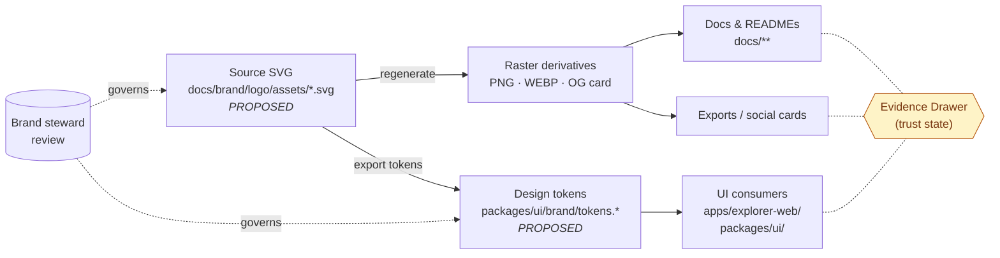

<!-- [KFM_META_BLOCK_V2]
doc_id: kfm://doc/brand-logo-usage
title: KFM Logo Usage
type: standard
version: v1
status: draft
owners: Brand steward (TODO confirm) · Docs steward
created: 2026-05-15
updated: 2026-05-15
policy_label: public
related:
  - docs/brand/README.md
  - docs/doctrine/directory-rules.md
  - docs/doctrine/trust-membrane.md
  - docs/architecture/map-shell.md
tags: [kfm, brand, logo, identity, accessibility]
notes:
  - All asset paths PROPOSED until verified against mounted-repo evidence.
  - Logo is not a trust signal. See Section 9.
[/KFM_META_BLOCK_V2] -->

# KFM Logo Usage

> Guidance for placing, sizing, coloring, and attributing the Kansas Frontier Matrix (KFM) logo so that brand identity stays consistent and never substitutes for governed evidence.


| Field | Value |
|---|---|
| **Status** | Draft · awaiting brand-steward sign-off |
| **Authority level** | Standard doc (guidance, not policy gate) |
| **Owners** | Brand steward · Docs steward |
| **Last updated** | 2026-05-15 |
| **Proposed home** | `docs/brand/logo/USAGE.md` |
| **Conflict surface** | `packages/ui/` may host code-bound brand assets — see §3 |

---

## Contents

1. [Scope & audience](#1-scope--audience)
2. [Repo fit](#2-repo-fit)
3. [The KFM logo system](#3-the-kfm-logo-system)
4. [Clear space & minimum size](#4-clear-space--minimum-size)
5. [Color usage](#5-color-usage)
6. [Backgrounds, contrast & accessibility](#6-backgrounds-contrast--accessibility)
7. [Do · Don't](#7-do--dont)
8. [File formats & where they live](#8-file-formats--where-they-live)
9. [Logo vs. trust state — important](#9-logo-vs-trust-state--important)
10. [Co-branding & attribution](#10-co-branding--attribution)
11. [Versioning, supersession & rollback](#11-versioning-supersession--rollback)
12. [Asset lifecycle (diagram)](#12-asset-lifecycle-diagram)
13. [Quickstart for contributors](#13-quickstart-for-contributors)
14. [FAQ](#14-faq)
15. [Related docs](#15-related-docs)
16. [Appendix — proposed file map](#16-appendix--proposed-file-map)

---

## 1. Scope & audience

This document tells contributors **how to use** the KFM logo on documentation, maps, exports, slide decks, READMEs, and any public or semi-public surface. It does not define the logo itself — that lives in the source asset files referenced in §8 — and it does not authorize publication. Publication is governed by `release/` and `policy/` per Directory Rules; this doc is guidance.

**Audience:** maintainers, designers, contributors authoring docs or UI, and anyone preparing an export, screenshot, or third-party deliverable that displays the KFM mark.

> [!NOTE]
> Status of this doc is **CONFIRMED as guidance**. All specific token values, file paths, asset filenames, and clear-space ratios are **PROPOSED** until the source asset set and a brand-steward review confirm them. Do not treat the numbers in §4 and §5 as authoritative measurements until the assets land and reviewers sign off.

---

## 2. Repo fit

| Aspect | Value |
|---|---|
| **Path (this doc)** | `docs/brand/logo/USAGE.md` — PROPOSED |
| **Authority root** | `docs/` (human-facing control plane) — CONFIRMED per Directory Rules §6.1 |
| **Upstream context** | `docs/brand/README.md` (PROPOSED) — describes the broader brand system |
| **Downstream consumers** | `apps/explorer-web/`, `packages/ui/`, `docs/**` READMEs, release artifacts, social media exports |
| **Reviewer surface** | Brand steward + at least one UI/docs reviewer |

Per Directory Rules §6.1, `docs/brand/` exists to host **"styles guides, logo, voice — only if not in `packages/ui/`."** That clause leaves an unresolved placement question for code-bound logo assets, called out in §3 and §16.

---

## 3. The KFM logo system

The KFM identity is **PROPOSED** to consist of three coordinated marks. The specific glyph shapes, proportions, and typography are not described here — they are defined by the source SVG files in §8.

| Mark | Use | Minimum context |
|---|---|---|
| **Primary logo** (mark + wordmark) | Default lockup for docs, map shell header, README banners, slides | Where there is room for both glyph and full wordmark |
| **Wordmark only** | Long-form documents, footers, dense layouts | Where the mark would compete with content |
| **Monogram / mark only** | Favicons, OG-image corner stamps, sprite-sheet tile, tight UI chips | When the wordmark would be illegible (< minimum size, §4) |

> [!IMPORTANT]
> **Authoritative form is the source SVG.** PNG, WEBP, and sprite-sheet variants are **derivatives** and must be regenerated from the SVG when the canonical form changes. This mirrors the project's broader symbol-asset doctrine where source vectors are authoritative and PNG/sprite/thumbnail variants are derivatives that must preserve alignment and padding. **(INFERRED from MapLibre Components Master, §F — Sprites, Glyphs, Fonts, Design Tokens.)**

### 3.1 `docs/brand/` vs. `packages/ui/`

Directory Rules §6.1 permits `docs/brand/` to hold logo assets **"only if not in `packages/ui/`."** Two PROPOSED resolutions:

- **Documentation-bound assets** (banners, social cards, marketing PNGs, this doc): live in `docs/brand/logo/`.
- **Code-bound assets** (favicon, app-shell SVG imports, sprite-sheet tile, design tokens): live in `packages/ui/brand/`.

This split is **PROPOSED · NEEDS VERIFICATION**. An ADR may be warranted if both homes need to exist long-term; otherwise pick one canonical home and treat the other as a mirror or migration target per Directory Rules §8.

---

## 4. Clear space & minimum size

Clear space is the protected zone around the mark. **All values below are PROPOSED placeholders** keyed to the cap-height of the wordmark, which is the standard reference unit and survives proportional scaling.

| Property | Value (PROPOSED) | Notes |
|---|---|---|
| Clear space (all sides) | `1× cap-height` of wordmark | Measured from the outermost ink, not the bounding box |
| Minimum size — primary logo | `120 px` wide (screen) · `25 mm` (print) | Below this, switch to monogram |
| Minimum size — wordmark only | `90 px` wide (screen) · `18 mm` (print) | |
| Minimum size — monogram | `24 px` square (screen) · `8 mm` (print) | Favicon is exempt and uses dedicated `16×16` and `32×32` source files |

> [!WARNING]
> Below the minimum size, the logo loses legibility and starts to leak into adjacent content. The fix is to use the monogram, not to compress the primary lockup.

---

## 5. Color usage

Logo colors should derive from the KFM design-token set, not from inline hex values pasted into docs. **All token names and color values below are PROPOSED** until the token file is added and verified.

| Token (PROPOSED) | Role | Example value | Background |
|---|---|---|---|
| `--kfm-brand-ink` | Default mark ink on light backgrounds | TODO confirm hex | `--kfm-surface-light` |
| `--kfm-brand-reverse` | Mark ink on dark backgrounds | TODO confirm hex (typically near-white) | `--kfm-surface-dark` |
| `--kfm-brand-mono` | Single-color print / fax / single-channel embroidery | `#000` / `#fff` per substrate | varies |
| `--kfm-brand-tint` | Subtle on-brand watermark | TODO confirm hex (low-alpha brand ink) | any |

**Rule of thumb:** if a design tool or doc cannot reference the token, fall back to the mono variant. Never sample colors from a rasterized PNG of the logo; sample only from the source SVG or token file.

> [!CAUTION]
> Do not introduce new color variants on a one-off basis. New brand colors require a brand-steward review and a token-file change, not a local override.

---

## 6. Backgrounds, contrast & accessibility

The logo must remain legible on every surface where it appears. Use the variant that matches the background; do not adjust the source ink to "fix" a contrast problem — choose a different variant.

| Background | Use | Why |
|---|---|---|
| Light surface (`--kfm-surface-light`) | `--kfm-brand-ink` | Default presentation |
| Dark surface (`--kfm-surface-dark`) | `--kfm-brand-reverse` | Preserves legibility without altering ink |
| Photographic / imagery | Solid container (rounded card or pill) behind the mark | Prevents brand drift over uncontrolled imagery |
| Sensitive map overlays | See §9 — special discipline applies | Logo placement next to T3/T4 content has governance implications |

WCAG 2.1 AA contrast applies to the logo when it functions as informational content (e.g., wordmark used as a link). Decorative-only placements have lower bars but still must remain visually identifiable.

### 6.1 Light/dark with `<picture>`

```html
<picture>
  <source media="(prefers-color-scheme: dark)" srcset="./assets/logo-reverse.svg">
  
</picture>
```

Use a meaningful `alt` attribute when the logo carries meaning (project identity in a header). Use `alt=""` only when the logo is purely decorative and an adjacent text label already names the project.

---

## 7. Do · Don't

| ✅ Do | ❌ Don't |
|---|---|
| Use the source SVG or a regenerated derivative | Re-trace, redraw, or "remaster" the logo |
| Preserve clear space (§4) | Crop into the clear-space zone with adjacent text or UI |
| Use design tokens (§5) | Hard-code hex values that drift from the canonical tokens |
| Choose a variant that matches the background | Recolor the source ink to brute-force contrast |
| Use the monogram below minimum size | Compress the primary lockup until the wordmark is illegible |
| Pair the logo with the Evidence Drawer for trust UX | Use the logo to imply a feature is verified, signed, or released |
| Keep co-branding attribution near the KFM mark (§10) | Strip rights / attribution metadata from co-branded exports |
| Treat the SVG as authoritative | Treat the rasterized PNG as the source of truth |

---

## 8. File formats & where they live

The table lists **PROPOSED** asset filenames and paths. None are confirmed against a mounted repo. Filenames should be reviewed by the brand steward before adoption.

| Asset | PROPOSED path | Format | Notes |
|---|---|---|---|
| Primary logo, light | `docs/brand/logo/assets/logo.svg` | SVG | Authoritative source |
| Primary logo, dark/reverse | `docs/brand/logo/assets/logo-reverse.svg` | SVG | Authoritative source |
| Wordmark only | `docs/brand/logo/assets/wordmark.svg` | SVG | Authoritative source |
| Monogram | `docs/brand/logo/assets/monogram.svg` | SVG | Authoritative source |
| Raster previews | `docs/brand/logo/assets/preview/*.png` | PNG (`1×`, `2×`) | Derivatives — regenerate, don't edit |
| Favicons | `packages/ui/brand/favicon/*` | ICO, PNG | PROPOSED home: `packages/ui/` per §3.1 |
| Social / OG card | `docs/brand/logo/assets/og-card-1200x630.png` | PNG | Derivative |
| Design tokens (colors, spacing) | `packages/ui/brand/tokens.*` | JSON / CSS / TS | PROPOSED home: `packages/ui/` per §3.1 |

> [!NOTE]
> Brand assets do **not** belong in `artifacts/`. Per Directory Rules §8.2, `artifacts/` is build/docs/qa/temporary only and must not host trust-bearing or canonical material. Source brand assets are canonical and belong in `docs/brand/` or `packages/ui/`. (**CONFIRMED** from Directory Rules §6.1 and §8.2.)

---

## 9. Logo vs. trust state — important

The KFM logo is a **brand identifier**. It is **not** a trust signal, attestation, verification badge, evidence pointer, or release marker.

> [!IMPORTANT]
> **The logo does not vouch for the data.** Trust state in KFM is communicated through governed surfaces — primarily the Evidence Drawer and the finite outcomes `ANSWER · ABSTAIN · DENY · ERROR` — not through visual brand placement. Treating the logo as proof is an anti-pattern.

This rule descends directly from KFM doctrine:

- **Cite-or-abstain truth posture** (Directory Rules §0; Doctrine: truth-posture). Claims must resolve to an `EvidenceBundle` or abstain. A logo is not an `EvidenceRef`. (**CONFIRMED** as doctrine.)
- **Trust membrane.** Public clients use governed interfaces, not visual cues, to convey state. (**CONFIRMED** from Directory Rules §7.1.)
- **"Badge as proof" anti-pattern.** Verification badges and similar UI markings are explicitly flagged as risks when treated as evidence rather than as links to receipts. The same risk applies to logos used to imply authority. (**INFERRED** from Master MapLibre Components, §S — *Attestation badges should be backed by receipts and not visual trust theater*; *Badge as proof substitute* listed as an anti-pattern.)

**Practical consequence:** when displaying the logo near map outputs, exports, or AI-generated content, the surface must still expose the underlying provenance (Evidence Drawer link, manifest ID, release state). The logo identifies *who built the system*; the Evidence Drawer explains *whether the specific thing on screen is supported*.

---

## 10. Co-branding & attribution

When the KFM logo appears alongside third-party logos, source attributions, or partner credit lines, the attribution discipline runs in **both directions**.

| Situation | Required co-presentation |
|---|---|
| KFM map export uses third-party data | Source attribution string ("© USGS", "© NOAA", license name) visible on the same surface |
| KFM logo on partner site | Partner's own attribution preserved; KFM logo follows their clear-space rules and ours, whichever is larger |
| KFM logo in screenshots or social cards | Underlying layer's source, license, and rights metadata preserved per release-artifact conventions |
| KFM logo on a sensitive overlay (T3/T4) | Additional scrutiny — see §9; logo must not imply official endorsement of restricted content |

> [!WARNING]
> Stripping attribution from a co-branded export is a rights and policy violation, not a styling choice. **Public release requires source rights, attribution, and license metadata.** (**CONFIRMED** as project doctrine from Master MapLibre Components §Q — *Public release requires source rights, attribution, and license metadata*.)

---

## 11. Versioning, supersession & rollback

The logo is a **governed asset**. Changes are versioned, reviewed, and recorded — not edited in place.

| Concern | Rule |
|---|---|
| Source-of-truth | The SVG files in §8. Derivatives regenerate from the SVG. |
| Version field | Each asset family carries a `version` and a `spec_hash` PROPOSED in its sidecar. **(INFERRED** from project content-addressing doctrine.) |
| Supersession | When a logo changes form, the new version supersedes the old; the old form remains discoverable in `docs/archive/` or a brand-history page until any released artifacts citing it are reissued or corrected. |
| Rollback | Reverting to a prior logo version follows the same review path as a forward change. Past releases that depend on the previous mark may need a `CorrectionNotice` per Directory Rules §19. |

> [!NOTE]
> Whether brand assets carry the same `spec_hash` and sidecar discipline used for catalog/release artifacts is **PROPOSED · NEEDS VERIFICATION**. A lightweight version table and a brand-history entry are likely sufficient; the heavier governance machinery is appropriate when the logo appears inside released artifacts that are themselves content-addressed.

---

## 12. Asset lifecycle (diagram)

The diagram shows the **PROPOSED** governance flow for brand assets. It is illustrative — until the asset set lands and `packages/ui/brand/` is confirmed or rejected as a sibling home, paths remain PROPOSED.



> [!NOTE]
> The dotted lines to the Evidence Drawer are a reminder that **logo presentation and trust state are parallel concerns** — every public surface that shows the logo should also resolve trust through governed interfaces, never via the logo itself. (See §9.)

---

## 13. Quickstart for contributors

The fastest path for someone who just needs to add the logo to a doc or component.

```bash
# 1. Pull the latest source SVGs (PROPOSED path)
ls docs/brand/logo/assets/

# 2. Reference the SVG, not a re-saved copy, in your doc:
#    

# 3. For code, import from the UI brand package (PROPOSED home):
#    import logoUrl from '@kfm/ui/brand/logo.svg'
```

Then verify:

- [ ] You used the source SVG, not a re-traced version.
- [ ] You honored the clear-space and minimum-size rules (§4).
- [ ] You picked a variant that matches the background (§6).
- [ ] If the surface is public and shows data, the Evidence Drawer / manifest pointer is also reachable (§9).
- [ ] If the surface is co-branded, attribution for any third-party content is preserved (§10).

---

## 14. FAQ

<details>
<summary><strong>Can I tint the logo to match a slide theme?</strong></summary>

No. Use a token (`--kfm-brand-ink`, `--kfm-brand-reverse`) or the mono variant. If neither works, use a solid container behind the mark (§6). Custom tints introduce brand drift and rarely solve the underlying contrast problem.
</details>

<details>
<summary><strong>The PNG I have looks slightly different from the SVG. Which one is correct?</strong></summary>

The SVG. PNGs are derivatives and can fall behind when the source changes. Regenerate the PNG from the current SVG instead of trusting an older raster. (§3, §8)
</details>

<details>
<summary><strong>Can I put the KFM logo on a map screenshot to show it's "official"?</strong></summary>

No — that's exactly the anti-pattern §9 warns against. The logo identifies the project; it does not certify the contents of any particular map or layer. Use Evidence Drawer pointers, manifest IDs, and release-state badges for trust signaling, and surface source attribution per §10.
</details>

<details>
<summary><strong>Where do favicons live?</strong></summary>

PROPOSED: under `packages/ui/brand/favicon/` because they ship with the app. If `packages/ui/` is not the chosen home for code-bound brand assets, this falls back to `docs/brand/logo/assets/favicon/`. Resolution is tracked as an open question (§16). (Directory Rules §6.1)
</details>

<details>
<summary><strong>How do I report a misuse of the logo?</strong></summary>

Open an issue tagged `brand` and ping the brand steward. Misuse cases include re-tracing, recoloring outside tokens, stripped attribution on co-branded content, or logo-as-proof patterns (§9).
</details>

<details>
<summary><strong>Is there a trademark statement?</strong></summary>

UNKNOWN. Trademark and license posture for the KFM mark is not specified in this session's evidence. A trademark / fair-use notice should be added once that posture is settled, likely in `docs/brand/README.md` or `LICENSE-brand.md`. Until then, treat external reuse as **NEEDS VERIFICATION** and route requests to the brand steward.
</details>

<details>
<summary><strong>Why does this doc keep saying "PROPOSED" everywhere?</strong></summary>

Because the repository was not mounted during the drafting of this doc, and KFM's posture is to mark every implementation-shaped claim as PROPOSED until it can be verified against actual files. The brand-steward sign-off pass should walk through and flip claims to CONFIRMED where assets and tokens actually exist.
</details>

---

## 15. Related docs

- `docs/brand/README.md` — Brand system overview (**TODO** verify presence)
- `docs/doctrine/directory-rules.md` — Why `docs/brand/` exists and what may live there (§6.1)
- `docs/doctrine/trust-membrane.md` — Why the logo is not a trust signal (§9)
- `docs/doctrine/truth-posture.md` — Cite-or-abstain discipline that §9 inherits
- `docs/architecture/map-shell.md` — Where the logo meets the map UI
- `packages/ui/README.md` — Code-bound brand assets (**TODO** verify path)
- `docs/standards/PROV.md` — Provenance discipline that wraps released artifacts

---

## 16. Appendix — proposed file map

<details>
<summary><strong>Proposed layout for <code>docs/brand/logo/</code> (PROPOSED)</strong></summary>

```text
docs/brand/logo/
├── README.md                # logo-system landing page (PROPOSED)
├── USAGE.md                 # this file
└── assets/
    ├── logo.svg             # primary lockup, light variant
    ├── logo-reverse.svg     # primary lockup, dark variant
    ├── wordmark.svg
    ├── monogram.svg
    ├── og-card-1200x630.png # social card derivative
    └── preview/
        ├── logo@1x.png
        ├── logo@2x.png
        └── monogram@1x.png
```

</details>

<details>
<summary><strong>Open questions to resolve before promoting any PROPOSED claim</strong></summary>

- [ ] Confirm `docs/brand/` vs. `packages/ui/brand/` split (or ADR if both homes persist). (§3.1)
- [ ] Confirm the actual filenames in `docs/brand/logo/assets/` against repo state. (§8)
- [ ] Confirm canonical color tokens (`--kfm-brand-ink`, etc.) and hex values. (§5)
- [ ] Confirm clear-space ratio and minimum-size thresholds with the brand steward. (§4)
- [ ] Confirm whether brand assets need `spec_hash` + sidecar parity with catalog assets. (§11)
- [ ] Confirm trademark posture and reuse terms for the KFM mark. (§14 FAQ)
- [ ] Confirm `docs/brand/README.md` exists or schedule its authoring. (§15)

</details>

---

**Last updated:** 2026-05-15 · **Status:** draft · **Owners:** Brand steward · Docs steward

[Back to top ↑](#kfm-logo-usage)
