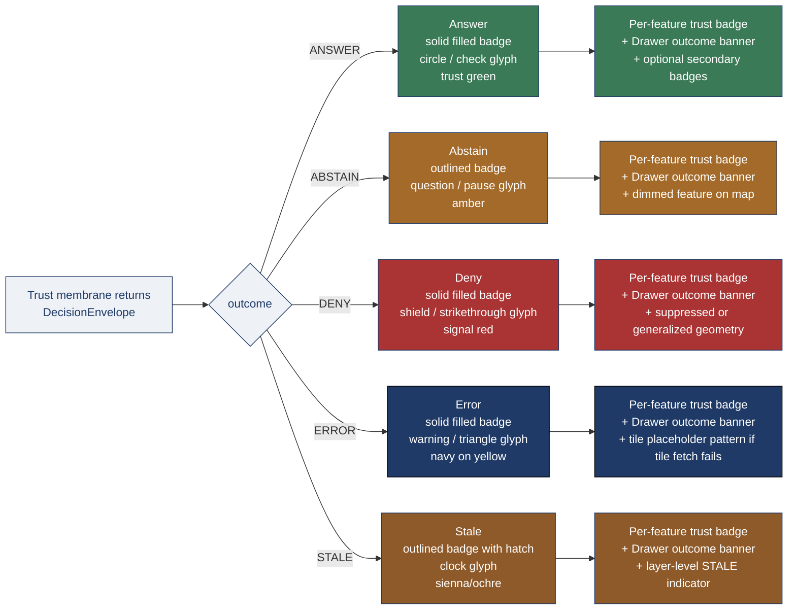
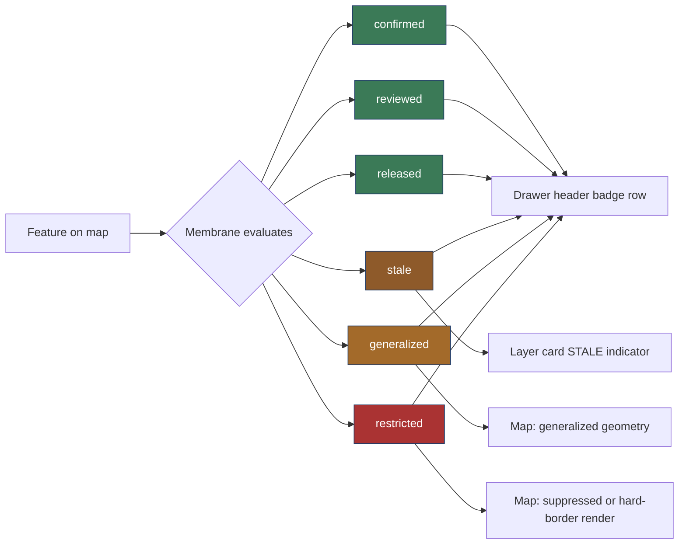

<!-- [KFM_META_BLOCK_V2]
doc_id: kfm://doc/<TODO-uuid>
title: Trust-State Visuals — color, shape, iconography, and motion for KFM trust outcomes
type: standard
version: v1
status: draft
owners: <TODO: brand / design-system maintainers + Trust Membrane Lead + Map Architecture Lead>
created: 2026-05-15
updated: 2026-05-15
policy_label: public
related:
  - docs/brand/evidence-drawer-microcopy.md
  - docs/brand/finite-outcome-microcopy.md
  - docs/doctrine/map-first.md
  - docs/doctrine/policy-aware.md
  - docs/doctrine/time-aware.md
  - docs/architecture/trust-membrane.md
  - docs/architecture/ui-trust-surface.md
tags: [kfm, brand, design-system, accessibility, trust, visuals, tokens]
notes:
  - Owns visual treatment of trust state across every KFM surface.
  - Wording lives in the two sibling brand-microcopy docs; this doc never replaces a string.
  - Token names, hex values, glyph identities, and exact metrics are PROPOSED at this granularity.
[/KFM_META_BLOCK_V2] -->

# Trust-State Visuals — color, shape, iconography, and motion for KFM trust outcomes

> The visual counterpart to KFM's two trust-microcopy docs. **Identifiers and wording are owned elsewhere; this doc owns only how trust state *looks*, *holds shape*, and *moves*.**


**Status:** Draft · **Owners:** _TODO brand / design-system maintainers + Trust Membrane Lead + Map Architecture Lead_ <sub>NEEDS VERIFICATION</sub> · **Updated:** 2026-05-15

> [!IMPORTANT]
> **Color alone never carries trust meaning.** Every trust state rendered in any KFM surface MUST be distinguishable by at least **two** of: color, shape, icon, position, or text label. `[CONFIRMED accessibility commitment from prior UI Architecture work.]` This doc exists so that the "two of" cannot drift to "one of" by accident — and so a `DENY` never reads as a `STALE`, an `ABSTAIN` never reads as an `ERROR`, and an `ANSWER` is never rendered with a triumphal flourish that converts a trust signal into a marketing flourish.

---

## Table of contents

1. [Purpose & scope](#1-purpose--scope)
2. [Audience and source hierarchy](#2-audience-and-source-hierarchy)
3. [The visual vocabulary at a glance](#3-the-visual-vocabulary-at-a-glance)
4. [Design principles](#4-design-principles)
5. [Token naming convention](#5-token-naming-convention)
6. [Per-outcome visual specifications](#6-per-outcome-visual-specifications)
   - 6.1 [`ANSWER`](#61-answer)
   - 6.2 [`ABSTAIN`](#62-abstain)
   - 6.3 [`DENY`](#63-deny)
   - 6.4 [`ERROR`](#64-error)
   - 6.5 [`STALE`](#65-stale)
7. [Trust badge visual system](#7-trust-badge-visual-system)
8. [Map-surface treatments](#8-map-surface-treatments)
9. [Color palette (PROPOSED swatches)](#9-color-palette-proposed-swatches)
10. [Iconography requirements](#10-iconography-requirements)
11. [Typography & layout for trust surfaces](#11-typography--layout-for-trust-surfaces)
12. [Loading, transition, and empty-state visuals](#12-loading-transition-and-empty-state-visuals)
13. [Motion & `prefers-reduced-motion`](#13-motion--prefers-reduced-motion)
14. [Accessibility commitments](#14-accessibility-commitments)
15. [Dark mode, print, and high-contrast](#15-dark-mode-print-and-high-contrast)
16. [Indigenous and dual-name visual handling](#16-indigenous-and-dual-name-visual-handling)
17. [Anti-patterns](#17-anti-patterns)
18. [Verification checklist](#18-verification-checklist)
19. [Worked example (illustrative)](#19-worked-example-illustrative)
20. [Related docs](#20-related-docs)

---

## 1. Purpose & scope

This document is the **canonical reference** for how KFM trust state — the five finite outcomes (`ANSWER`, `ABSTAIN`, `DENY`, `ERROR`, `STALE`) and the trust-badge family (`confirmed`, `reviewed`, `released`, `stale`, `generalized`, `restricted`) — is **rendered visually** across every KFM surface. `[CONFIRMED outcome vocabulary from `docs/doctrine/lifecycle-law.md`, `docs/doctrine/policy-aware.md`, `docs/architecture/trust-membrane.md`, and `docs/doctrine/map-first.md` §10. Trust-badge keys CONFIRMED from prior UI Architecture work; specific badge identities listed in §7 are PROPOSED at this granularity.]`

The **identifiers** are owned by doctrine and contract files. The **wording** is owned by the two sibling brand-microcopy docs. **This document does not redefine either**, and never substitutes a glyph for a string the membrane already produced.

| In scope | Out of scope |
|---|---|
| Color, shape, icon, position, and motion for each trust state. | The identifier vocabulary (outcomes, reason codes, badge keys). |
| Non-text indicators that make every state distinguishable without color. | The user-facing **wording** for any state (see siblings). |
| Token naming convention for trust-state design tokens. | Generic design-system tokens (typography scale, spacing scale, grid). |
| Map-surface treatments for suppressed / generalized / dimmed features. | The runtime mechanics of envelope production or policy gating. |
| Accessibility commitments specific to trust state (contrast, motion, focus). | General WCAG conformance for non-trust surfaces. |
| Reduced-motion, dark-mode, and print behavior for trust state. | Renderer choice (MapLibre / Cesium). |

> [!NOTE]
> This doc and its two siblings — [`evidence-drawer-microcopy.md`](./evidence-drawer-microcopy.md) and [`finite-outcome-microcopy.md`](./finite-outcome-microcopy.md) — are intentional companions. The siblings own the **strings**; this doc owns the **pixels, shapes, and motion**. Where they overlap (e.g., the trust-badge label *Stale* is wording; the trust-badge shape is visual), the wording is normative in the sibling and the visual is normative here. Disagreement is a defect to be resolved, not a stylistic difference. `[INFERRED division of labor; the two sibling brand docs explicitly mark visual tokens as out-of-scope and delegate to this doc.]`

[⬆ Back to top](#trust-state-visuals--color-shape-iconography-and-motion-for-kfm-trust-outcomes)

---

## 2. Audience and source hierarchy

**Primary audience.** Design-system maintainers, frontend engineers, accessibility reviewers, and steward reviewers signing off on visual fixtures. **Secondary audience.** Doctrine maintainers checking that the visual vocabulary has not drifted away from the underlying identifier vocabulary, and translators reviewing how layout flexes around translated outcome labels.

**Source hierarchy that applies to every claim in this doc.** `[CONFIRMED authority ladder from prior KFM doctrine work.]`

| Tier | What governs the visual choices in this doc |
|---|---|
| **1 — Primary** | KFM doctrine and contracts. Fix the trust state vocabulary (`ANSWER` / `ABSTAIN` / `DENY` / `ERROR` / `STALE`; the six trust-badge keys; the policy-state taxonomy). Visual choices here MUST honor those identifiers and MUST NOT silently merge two states into one rendering. |
| **2 — Secondary** | Repository design-system code (CSS variables, token registry, component library), the Evidence Drawer fixture, the map shell fixture, and any axe-core baseline. `[Repository not mounted this session; visual artifacts NEEDS VERIFICATION against repo state.]` |
| **3 — Tertiary** | External standards consulted only where they govern the visual contract: **WCAG 2.2 AA** (contrast, non-text contrast, focus visible), **ARIA 1.2** (live regions, roles), the W3C Reduced-Motion preference, and BCP 47 (language tags). External style guidance never overrides KFM identifier vocabulary or the "color alone is never sufficient" rule. |

> [!WARNING]
> External design-system literature frequently proposes a green/amber/red "semaphore" pattern for state. KFM's vocabulary is **five outcomes, not three** — and `ABSTAIN`, `DENY`, and `ERROR` are doctrinally distinct, not three flavors of "bad." A semaphore that collapses `ABSTAIN`/`DENY`/`ERROR` into a single visual register is a `[CONFIRMED anti-pattern.]` Treat the temptation as a defect, not a shortcut.

[⬆ Back to top](#trust-state-visuals--color-shape-iconography-and-motion-for-kfm-trust-outcomes)

---

## 3. The visual vocabulary at a glance



`[Diagram is PROPOSED at the level of specific glyphs and hex values; the outcome-to-visual-treatment mapping is INFERRED from the CONFIRMED outcome semantics and trust-badge vocabulary.]`

| Outcome | Primary hue role | Shape role | Glyph role (PROPOSED) | Fill role |
|---|---|---|---|---|
| **`ANSWER`** | Trust green | Solid pill | check / dot | Solid |
| **`ABSTAIN`** | Amber | Outlined pill | question / pause | Outline + tinted body |
| **`DENY`** | Signal red | Solid pill with hard border | shield / slash | Solid |
| **`ERROR`** | Deep navy on warning yellow | Solid pill with hazard contrast | warning triangle | Solid (high-contrast pair) |
| **`STALE`** | Sienna / ochre | Outlined pill with diagonal hatch | clock | Outline + hatch pattern |

> [!IMPORTANT]
> Each row's combination of hue, shape, and glyph MUST be unique — and MUST remain unique when rendered in grayscale, in a 200% zoom, against any map tile, and under `prefers-reduced-motion: reduce`. A change that merges two rows' shapes or glyphs is a regression even if colors still differ. `[CONFIRMED accessibility principle; specific shape/glyph identities are PROPOSED.]`

[⬆ Back to top](#trust-state-visuals--color-shape-iconography-and-motion-for-kfm-trust-outcomes)

---

## 4. Design principles

The visual treatment of trust state is governed by six principles. They are not stylistic preferences — each closes a specific defect class observed in prior KFM doctrine work.

| # | Principle | Defect it prevents |
|---|---|---|
| 1 | **Truth-over-flourish.** A trust state is not a marketing surface. No gradients-as-aesthetics, no shadows-as-status, no animated celebration of an `ANSWER`. | "Triumphal `ANSWER`" — converting a doctrinal signal into self-congratulation. `[CONFIRMED voice rule from `finite-outcome-microcopy.md` §4.]` |
| 2 | **Color is never sole carrier.** Every state is distinguishable by ≥2 of: color, shape, icon, position, label. | Color-only differentiation; failure of WCAG 1.4.1 and 1.4.11. `[CONFIRMED.]` |
| 3 | **Non-conflation by construction.** `ABSTAIN`, `DENY`, and `ERROR` must render with **visibly distinct** shape *and* glyph, not three tints of red. | The semaphore collapse. `[CONFIRMED non-conflation rule from `finite-outcome-microcopy.md` §13.]` |
| 4 | **`STALE` is never silent.** A stale layer or feature MUST carry a visible badge **and** a layer-level indicator. No hover-to-discover, no tooltip-only treatment. | "Silent currency" — rendering a `STALE` claim as if it were current. `[CONFIRMED anti-pattern from `docs/architecture/trust-membrane.md` §6.]` |
| 5 | **Loading yields to outcome.** Any spinner, skeleton, or shimmer is replaced the moment the envelope returns — including when the outcome is `ERROR`. The loading state is never the final visual. | The generic-spinner-hiding-an-`ERROR` defect. `[CONFIRMED anti-pattern from `docs/doctrine/map-first.md` §10.]` |
| 6 | **Reduced motion is full citizen.** Every state transition has a non-animated form that is **as informative** as the animated form. | Motion-only state changes; WCAG 2.3.3 regressions. `[CONFIRMED from prior UI Architecture work.]` |

[⬆ Back to top](#trust-state-visuals--color-shape-iconography-and-motion-for-kfm-trust-outcomes)

---

## 5. Token naming convention

Trust-state design tokens follow a stable, four-segment name. Surface code never inlines hex values; it references the token. `[CONFIRMED commitment that tokens are required; exact registry path and format PROPOSED.]`

```text
--kfm-<layer>-<state>-<role>[-<modifier>]
```

Where:

- `<layer>` ∈ `outcome | badge | map | drawer | timeline`
- `<state>` ∈ `answer | abstain | deny | error | stale | confirmed | reviewed | released | generalized | restricted`
- `<role>` ∈ `bg | fg | border | hatch | icon | focus | dim | suppress`
- `<modifier>` (optional) ∈ `hover | active | disabled | dark | print | hc`  *(hc = high-contrast)*

### 5.1 Examples (illustrative)

| Token | Renders where |
|---|---|
| `--kfm-outcome-answer-bg` | Background fill of the `ANSWER` trust badge and Drawer outcome banner. |
| `--kfm-outcome-deny-icon` | Foreground color of the `DENY` shield glyph. |
| `--kfm-outcome-stale-hatch` | Stroke color of the `STALE` diagonal-hatch pattern. |
| `--kfm-badge-restricted-border` | Border color of the `restricted` trust badge. |
| `--kfm-map-suppress-dim` | Tile/feature dim factor for suppressed geometry. |
| `--kfm-outcome-error-bg-dark` | `ERROR` background under `prefers-color-scheme: dark`. |
| `--kfm-outcome-deny-bg-hc` | `DENY` background under forced high-contrast media query. |

> [!TIP]
> The naming convention is **not** the registry. The registry — the canonical list of tokens with their hex values, contrast pairings, and surface bindings — lives in the design-system source. _TODO: link to design-system token file_ <sub>NEEDS VERIFICATION</sub>. This doc names tokens; it does not assign them values without that registry's approval.

### 5.2 What tokens MUST NOT do

| Forbidden | Why |
|---|---|
| Reuse a token across two different outcomes (e.g., `--kfm-outcome-shared-bad-bg`). | Collapses non-conflation into one paint. |
| Encode state semantics into a generic name (e.g., `--kfm-color-red-500`). | A renaming or theme swap could silently change which outcome that color represents. |
| Inline hex literals in surface code. | Defeats token review and dark-mode/high-contrast forking. |
| Use opacity as the sole differentiator between `ABSTAIN` and `STALE`. | Opacity is not a contrast carrier. |

[⬆ Back to top](#trust-state-visuals--color-shape-iconography-and-motion-for-kfm-trust-outcomes)

---

## 6. Per-outcome visual specifications

Each outcome receives a fixed visual specification across **three surfaces**: the per-feature **trust badge**, the **Drawer outcome banner**, and the **map-level treatment** (dim / suppress / generalize / hatch / placeholder). The specifications below are PROPOSED at this granularity; the surface-to-state pairings are INFERRED from the CONFIRMED outcome semantics.

### 6.1 `ANSWER`

**Semantic role.** A current, policy-allowed warranty exists; the claim may be rendered with citations. `[CONFIRMED.]`

| Property | Specification |
|---|---|
| Badge shape | Solid pill, full-radius. |
| Badge fill | `--kfm-outcome-answer-bg` (trust green family). |
| Badge text | `--kfm-outcome-answer-fg` (white-on-green at ≥4.5:1 contrast). |
| Glyph (PROPOSED) | Filled check or solid dot. |
| Map feature | Rendered at full opacity with the layer's normal style. |
| Drawer banner | Single line, sentence case; no exclamation mark; no celebratory animation. |
| Non-text indicator | Solid badge fill + glyph; meets the "≥2 of" rule against any tile. |

> [!CAUTION]
> **No "verified ✓" stamp.** `ANSWER` is the membrane's plain assertion that a current warranty exists — it is the **floor** of correctness, not a marketing flourish. `[CONFIRMED voice rule from `finite-outcome-microcopy.md` §4.]` A pulsing green halo, a confetti animation, or a "Trusted!" stamp converts a finite outcome into self-congratulation and is a defect.

### 6.2 `ABSTAIN`

**Semantic role.** A required input is missing or unresolved; the system declines rather than guesses. `[CONFIRMED.]`

| Property | Specification |
|---|---|
| Badge shape | **Outlined** pill (visually distinct from `ANSWER`'s solid fill). |
| Badge border | `--kfm-outcome-abstain-border` (amber family). |
| Badge body | Soft amber tint (`--kfm-outcome-abstain-bg`) with foreground at ≥4.5:1. |
| Glyph (PROPOSED) | Question mark in a circle, **or** a pause-style two-bar mark (PROPOSED choice — ADR to settle). |
| Map feature | **Dimmed** (`--kfm-map-suppress-dim`); shape preserved so the user can still see *where* the abstention is. |
| Drawer banner | Names the missing input; offers the safe next step the envelope authorizes. No "Sorry," prefix. |
| Non-text indicator | Outline (vs `ANSWER`'s solid fill) + glyph; surface dim on map. |

### 6.3 `DENY`

**Semantic role.** Policy refuses this exposure of this unit to this caller. `[CONFIRMED.]`

| Property | Specification |
|---|---|
| Badge shape | Solid pill with a **hard, full-width border** (visually distinct from `ANSWER`). |
| Badge fill | `--kfm-outcome-deny-bg` (signal red family). |
| Badge text | High-contrast foreground at ≥4.5:1. |
| Glyph (PROPOSED) | Shield, **or** circled slash; the glyph must read as "refused," not "broken." |
| Map feature | **Suppressed** (not rendered) **or** rendered as a generalized form per policy. The choice is governed by the reason code (`policy.sensitive_geometry` typically generalizes; `policy.rights_unclear` typically suppresses). `[CONFIRMED layer-level treatment from `docs/doctrine/map-first.md` §10.]` |
| Drawer banner | Names the policy dimension that refused; describes the shape, not contents, of the denial. |
| Non-text indicator | Hard border (vs `ANSWER`'s borderless) + glyph + suppress/generalize on map. |

> [!WARNING]
> **`DENY` MUST NOT visually masquerade as `ERROR`.** A red badge labeled "Something went wrong" on a `DENY` is a `[CONFIRMED defect]` because it converts a policy decision into a system failure narrative — which loses the user's ability to seek the right remedy (a release-channel request, not an on-call page). `DENY` and `ERROR` therefore live on visibly distinct color families **and** distinct shapes **and** distinct glyphs.

### 6.4 `ERROR`

**Semantic role.** An integrity check or system invariant failed during evaluation. `[CONFIRMED.]`

| Property | Specification |
|---|---|
| Badge shape | Solid pill, **chevron/notched profile** (visually distinct from `DENY`'s smooth pill). |
| Badge fill | `--kfm-outcome-error-bg` (deep navy on warning-yellow accent; the navy/yellow pair is reserved for `ERROR` and used nowhere else). |
| Glyph (PROPOSED) | Filled warning triangle with exclamation; the **only** outcome where exclamation-as-glyph is permitted (it is the universal hazard symbol — different role from exclamation-in-text). |
| Map feature | Where the failure is per-tile: render a **placeholder hatch pattern** (`--kfm-outcome-error-hatch`) on the failed tile only. Where the failure is per-feature: render the badge at the feature position with no fill change. |
| Drawer banner | States that an integrity check failed; states that the on-call team is notified; does not invent a cause. |
| Non-text indicator | Notched shape + hazard glyph + tile hatch + navy/yellow pair reserved exclusively for `ERROR`. |
| Live region | `aria-live="assertive"` for `ERROR` arrivals during user action (other outcomes use `polite`). `[CONFIRMED from `finite-outcome-microcopy.md` §15.]` |

### 6.5 `STALE`

**Semantic role.** The supporting evidence is past its freshness window; the prior warranty is downgraded. `[CONFIRMED.]`

| Property | Specification |
|---|---|
| Badge shape | **Outlined** pill with a **diagonal-hatch fill pattern** (`--kfm-outcome-stale-hatch`). The hatch is the visual signature of `STALE` and is used nowhere else. |
| Badge border | `--kfm-outcome-stale-border` (sienna / ochre family). |
| Glyph (PROPOSED) | Clock face. |
| Map feature | Rendered at full opacity (so the user can still see the prior-warranty claim) **with** a per-feature `STALE` badge **and** a layer-level indicator in the legend / layer card. The feature is **not** dimmed (that would conflate it with `ABSTAIN`). |
| Drawer banner | Shows `last_fresh_release_id` and `last_fresh_date`. Banner persists until refreshed by a new release or correction. `[CONFIRMED persistence rule from `finite-outcome-microcopy.md` §10.3.]` |
| Non-text indicator | Hatch pattern (unique to `STALE`) + outline + clock glyph + layer-level indicator. |

> [!IMPORTANT]
> **`STALE` MUST NOT auto-dismiss on reload.** A `STALE` banner that disappears when the page reloads demotes the persistence rule to a session affordance and is a `[CONFIRMED anti-pattern.]` The visual treatment must be implemented such that page reload, hover-out, or scroll-away all **preserve** the `STALE` indicator until a refresh actually replaces the envelope.

[⬆ Back to top](#trust-state-visuals--color-shape-iconography-and-motion-for-kfm-trust-outcomes)

---

## 7. Trust badge visual system

The **trust badge** is the compact, per-feature signal that travels everywhere a claim renders — map popup, Drawer header, layer card, story-map embed, exported PDF. Its job is to make the outcome of the trust evaluation legible **without** opening the Drawer.

The badge vocabulary recorded in prior UI Architecture work is six keys. `[CONFIRMED set from prior UI Trust Surface; specific glyph and color choices in the table below are PROPOSED.]`

| Badge key | Signals | Pairs with outcome | Visual signature (PROPOSED) | Non-text indicator |
|---|---|---|---|---|
| `confirmed` | Evidence is resolved and citations are present. | `ANSWER` | Solid pill + check glyph. | Solid fill + glyph. |
| `reviewed` | Steward review record is present and current. | `ANSWER` (composes with `confirmed`) | Solid pill + double-check glyph. | Solid fill + distinct glyph (not just "more green"). |
| `released` | Claim is bound to a `ReleaseManifest`. | `ANSWER` (composes with `confirmed`) | Solid pill + manifest/tag glyph. | Solid fill + tag glyph. |
| `stale` | Past freshness window. | `STALE` | Outlined pill with hatch + clock glyph. | Hatch pattern is unique to this badge. |
| `generalized` | Geometry has been generalized per policy (e.g., `policy.sensitive_geometry`). | Often `ANSWER` with a generalized payload, or `DENY` when generalization is refused. | Outlined pill + grid/halftone glyph. | Outline + grid glyph; renders alongside the layer's generalized geometry. |
| `restricted` | Layer or feature is policy-restricted in this surface. | `DENY` | Solid pill with hard border + lock glyph. | Hard border + lock glyph + surface-level suppression. |

### 7.1 Composability

Badges compose. A single feature may carry, for example, `confirmed + reviewed + released` simultaneously (the common case for a fully-warranted claim) or `generalized + stale` (a generalized layer that is now past its freshness window).



`[Composition CONFIRMED at the doctrine level; specific badge stacking order in the Drawer header is PROPOSED — an ADR should ratify whether `released` precedes or follows `reviewed`.]`

### 7.2 Badge MUST-NOTs

| Forbidden | Why |
|---|---|
| `confirmed` rendered as a green dot with no text and no `aria-label`. | Color-only differentiation; `[CONFIRMED WCAG 1.4.1 violation.]` |
| `reviewed` rendered using the same glyph as `confirmed`. | Collapses two distinct claims (evidence resolved vs steward signed off). |
| `stale` rendered with the same outline-only style as `generalized`. | Collapses freshness lapse with policy generalization. The hatch pattern is what separates them — drop the hatch and they read the same. |
| `restricted` rendered with a red dot only. | Reads as `ERROR`. `DENY` and `restricted` must travel together visually. |
| Greenwashing: a badge rendered without the Drawer link that explains it. | `[CONFIRMED anti-pattern from prior UI Architecture work — "badges as proof without drawer."]` |

[⬆ Back to top](#trust-state-visuals--color-shape-iconography-and-motion-for-kfm-trust-outcomes)

---

## 8. Map-surface treatments

The map is the primary trust surface. `[CONFIRMED from `docs/doctrine/map-first.md`.]` Beyond the per-feature badge, the map itself participates in trust state through five treatments: **full render**, **dim**, **suppress**, **generalize**, and **hatch placeholder**.

| Treatment | Visual | Applies to | Reason codes (examples) |
|---|---|---|---|
| **Full render** | Layer's normal style at full opacity. | `ANSWER` features, `STALE` features (feature stays visible; layer-level indicator carries the staleness). | n/a |
| **Dim** | Reduced opacity (`--kfm-map-suppress-dim`); shape preserved. | `ABSTAIN` features; layers that are time-out-of-scope. | `evidence.unresolved`, `time.out_of_scope`, `evidence.scope_mismatch` |
| **Suppress** | Feature not rendered. Position may carry a `restricted` badge marker (a small lock glyph at the feature's bounding center, **not** at its true geometry). | `DENY` where policy forbids any spatial reveal. | `policy.rights_unclear`, `policy.cultural_restriction` |
| **Generalize** | Feature rendered as a fuzzed / aggregated / bucketed geometry per policy. | `ANSWER` with a generalized payload (the warranty is for the generalized form, not the exact form). | `policy.sensitive_geometry` |
| **Hatch placeholder** | The failed tile or region is filled with the `ERROR` hatch pattern. | Tile or feature-level `ERROR`. | `system.upstream_unavailable`, `system.integrity_failure` |

> [!CAUTION]
> **Suppression must not leak through the position marker.** The `restricted` badge marker for a suppressed feature MUST be placed at a coarse bounding center (e.g., the layer's region centroid) or at the layer-card position — **never** at the true geometry. Placing the marker at the true (denied) geometry visually leaks the asset the policy was protecting. `[CONFIRMED operator-hint leak-test from `docs/doctrine/policy-aware.md` §10, applied here at the visual layer.]`

[⬆ Back to top](#trust-state-visuals--color-shape-iconography-and-motion-for-kfm-trust-outcomes)

---

## 9. Color palette (PROPOSED swatches)

> [!NOTE]
> Specific hex values below are **PROPOSED** and require ratification by the design-system token registry. They are listed here as a starting point that satisfies the contrast and non-conflation rules in §4 and §14. _TODO: design-system token file_ <sub>NEEDS VERIFICATION</sub> is the eventual source of truth; this section becomes a pointer once that file exists.

### 9.1 Outcome hues

| Role | Token | Hex (PROPOSED) | Pairs with foreground | Contrast target |
|---|---|---|---|---|
| `ANSWER` bg | `--kfm-outcome-answer-bg` | `#3B7A57` | `#FFFFFF` | ≥4.5:1 normal text |
| `ABSTAIN` border | `--kfm-outcome-abstain-border` | `#A36A2A` | `#1F1F1F` on tinted body | ≥4.5:1 normal text |
| `DENY` bg | `--kfm-outcome-deny-bg` | `#A33` (`#AA3333`) | `#FFFFFF` | ≥4.5:1 normal text |
| `ERROR` bg | `--kfm-outcome-error-bg` | `#1F3A66` (navy), accent `#F2C200` | `#FFFFFF` on navy; `#1F3A66` on yellow | ≥4.5:1 normal text |
| `STALE` border | `--kfm-outcome-stale-border` | `#8E5A2A` | `#1F1F1F` on tinted body | ≥4.5:1 normal text |
| Map dim factor | `--kfm-map-suppress-dim` | `opacity: 0.35` | n/a | n/a (not a contrast role) |

### 9.2 Contrast pairings against map tiles

KFM trust badges and negative states meet **3:1** against any map background tile. `[CONFIRMED accessibility commitment from prior UI Architecture work.]` This is a hard requirement because basemap tiles vary from near-white parchment to near-black night basemaps, and the badge must remain legible on both.

| Badge | Light basemap | Dark basemap | Satellite imagery |
|---|---|---|---|
| `ANSWER` solid green pill | ≥3:1 (CONFIRMED target) | _TODO test_ | _TODO test_ |
| `DENY` solid red pill | ≥3:1 (CONFIRMED target) | _TODO test_ | _TODO test_ |
| `ERROR` navy-on-yellow | ≥3:1 (CONFIRMED target) | _TODO test_ | _TODO test_ |
| `STALE` outlined with hatch | ≥3:1 of the **stroke** against tile | _TODO test_ | _TODO test_ |

> [!TIP]
> If a basemap fails the 3:1 contrast target for a given badge, the **basemap is the variable to tune**, not the badge. The badge palette is fixed by doctrine; map style is configurable. `[INFERRED priority from the CONFIRMED accessibility commitment.]`

[⬆ Back to top](#trust-state-visuals--color-shape-iconography-and-motion-for-kfm-trust-outcomes)

---

## 10. Iconography requirements

Icons in the trust-state visual system are **functional**, not decorative. Each glyph carries part of the non-text load for its state.

| Rule | Why |
|---|---|
| Every trust state has a dedicated glyph; glyphs are not shared across states. | The "≥2 of" rule fails if color and shape match and only the glyph differs by hue. |
| Glyphs are monochrome by default and inherit foreground color. | Two-color glyphs are harder to recolor for dark mode and high-contrast. |
| Glyphs render at ≥16×16 logical px on any surface that carries trust meaning. | Below that size, glyph identity collapses; users see "a small mark." |
| Emoji are **never** trust-state indicators. | Emoji rendering is locale- and platform-variable; accessibility names diverge. `[CONFIRMED from `finite-outcome-microcopy.md` §4.]` |
| SVG glyphs include `<title>` matching the state's `aria-label`. | Screen readers reach the accessible name without relying on the surrounding label. |
| Glyph stroke meets **3:1** non-text contrast against badge fill. | WCAG 1.4.11. |
| Hatch / pattern fills are **part of the glyph system**, not background decoration. | The `STALE` hatch and `ERROR` hatch are distinct, semantic, non-text indicators. |

### 10.1 Glyph identity (PROPOSED)

| State | Glyph (PROPOSED) | Anti-pattern alternative |
|---|---|---|
| `ANSWER` | Filled check or solid dot. | ✗ Star (reads as rating). |
| `ABSTAIN` | Question mark in circle, or pause bars. | ✗ Frowning face; ✗ broken-link icon (reads as `ERROR`). |
| `DENY` | Shield, or circled slash. | ✗ Stop sign (reads as `ERROR`); ✗ ban icon at true geometry (leak risk — see §8). |
| `ERROR` | Filled warning triangle. | ✗ Generic alert bell; ✗ "Oops!" wordmark. |
| `STALE` | Clock face. | ✗ Hourglass (reads as loading); ✗ "old paper" texture (decorative, not semantic). |
| `confirmed` | Single check. | ✗ Same glyph as `reviewed`. |
| `reviewed` | Double check, or check with badge. | ✗ Same glyph as `confirmed`. |
| `released` | Manifest tag, or version-tag glyph. | ✗ Box-shipping icon (reads as fulfillment, not release). |
| `generalized` | Halftone grid, or pixelation glyph. | ✗ Blur effect alone (motion-dependent on some renderers). |
| `restricted` | Closed lock. | ✗ Open lock (signals "unlocked"); ✗ key icon (signals access, not refusal). |

[⬆ Back to top](#trust-state-visuals--color-shape-iconography-and-motion-for-kfm-trust-outcomes)

---

## 11. Typography & layout for trust surfaces

Type is a trust signal too. The rules below apply specifically to trust-bearing surfaces (badges, banners, the Drawer header). Generic type scale is governed by the design-system core. `[Design-system core CONFIRMED to exist as a concept; exact location and tokens NEEDS VERIFICATION.]`

| Rule | Specification |
|---|---|
| Trust-badge text | Single line, sentence case, no exclamation mark, no emoji. ≥12 logical px on any surface that carries trust meaning. PROPOSED weight: medium. |
| Outcome banner heading | Sentence case. The outcome **identifier** (e.g., `ANSWER`) when rendered as a code token uses a monospaced family; the visible **label** uses the body family. `[CONFIRMED from `finite-outcome-microcopy.md` §4.]` |
| Reason-code token | Monospaced, slightly tinted background, never wrapped mid-token. |
| Numerals | Tabular figures wherever release ids, dates, or counts render in a column. |
| Localization room | Layouts MUST accommodate label length growth of +50% for non-English locales without truncation or layout shift. `[CONFIRMED i18n room from prior UI Architecture work; +50% is a PROPOSED budget.]` |
| Truncation | Trust labels are **never** truncated with an ellipsis. The container expands or wraps; the meaning never silently disappears. |

> [!IMPORTANT]
> **No marketing typography on trust surfaces.** All-caps treatments, oversized weights, decorative italicization, and pull-quote framing are appropriate elsewhere in the brand — they are **not** appropriate on a trust banner. A `DENY` set in display-italic with a flourish is, in this system, a defect.

[⬆ Back to top](#trust-state-visuals--color-shape-iconography-and-motion-for-kfm-trust-outcomes)

---

## 12. Loading, transition, and empty-state visuals

The most common failure mode for trust visuals is **hiding** the outcome behind a generic transitional state. The rules below close that hole.

| State | Visual | What MUST be true |
|---|---|---|
| Loading (envelope not yet returned) | Neutral skeleton or shimmer in the surface's "claim area." | The skeleton is **never** an outcome substitute. When the envelope arrives, the skeleton is replaced by the outcome visual — including when the outcome is `ERROR`. |
| Loading exceeding the freshness window (e.g., 8 s) | Neutral skeleton **plus** an inline `cancel` action; no fallback to a guessed visual. | The user is offered a way out, not an inferred answer. |
| Empty layer (no features in viewport) | Plain "no features" treatment that is **not** styled as any outcome. | A scope mismatch returns `ABSTAIN evidence.scope_mismatch`; an empty viewport is not an outcome at all. |
| `ANSWER` → `STALE` transition | Badge swaps from solid green to outlined hatched sienna; layer card grows a `STALE` indicator. | Announced via `aria-live="polite"`; reduced-motion users see an **instant** swap, not a fade. `[CONFIRMED from `finite-outcome-microcopy.md` §14, §15.]` |
| `STALE` → `ANSWER` refresh | Badge swaps from outlined hatched sienna to solid green; layer card sheds its `STALE` indicator. | Announced; instant under reduced motion. |
| Any outcome → `ERROR` transition | Badge swaps to navy/yellow notched pill; the surface region around the failed feature gains the `ERROR` hatch. | Announced via `aria-live="assertive"`. |

> [!CAUTION]
> A "generic spinner" that hides an `ERROR` outcome is a **CONFIRMED anti-pattern**. `[`docs/doctrine/map-first.md` §10.]` The loading skeleton MUST yield to the outcome visual the envelope returned, including when the outcome is bad news. There is no "polite delay before showing the error."

[⬆ Back to top](#trust-state-visuals--color-shape-iconography-and-motion-for-kfm-trust-outcomes)

---

## 13. Motion & `prefers-reduced-motion`

Motion is permitted in this system only where it carries information that the static form does not — and where it has a fully-equivalent reduced-motion form.

| Motion | Allowed where | Reduced-motion behavior |
|---|---|---|
| Drawer slide-in on open | Drawer mount. | Instant appearance. `[CONFIRMED from prior UI Architecture work.]` |
| Badge pulse on outcome change | Trust-badge swap. | Instant swap. `[CONFIRMED from prior UI Architecture work.]` |
| Map feature focus glow | Selected feature highlight. | Solid focus outline at WCAG-compliant thickness. |
| Tile transition fade | Tile load between zoom levels. | Instant tile swap. |
| Outcome-change announcement animation | Anywhere a state change occurs. | No animation; `aria-live` carries the announcement. |

> [!IMPORTANT]
> **Motion is never the sole carrier of a state change.** A `STALE` banner that only appears via fade-in fails reduced-motion users; the banner must be visibly present the instant the envelope arrives. `[CONFIRMED accessibility commitment.]`

### 13.1 Forbidden motion patterns

| Forbidden | Why |
|---|---|
| Confetti, sparkle, or celebratory animation on `ANSWER`. | Triumphal flourish; converts a finite outcome into a marketing flourish. |
| Shake or vibrate on `DENY` or `ERROR`. | Reads as system anger; trust states are calm and specific. |
| Animated transition between two outcome badges that **morphs** one into the other. | Visually implies they are the same thing in different moods. |
| Parallax that moves trust badges relative to the surface. | Decouples the badge from the feature it warrants. |

[⬆ Back to top](#trust-state-visuals--color-shape-iconography-and-motion-for-kfm-trust-outcomes)

---

## 14. Accessibility commitments

KFM trust visuals must satisfy **WCAG 2.2 AA**. `[CONFIRMED conformance target.]` Below are the specific commitments that the visual system carries (microcopy carries the others — see [`evidence-drawer-microcopy.md`](./evidence-drawer-microcopy.md) §15 and [`finite-outcome-microcopy.md`](./finite-outcome-microcopy.md) §15).

| Requirement | Visual implication |
|---|---|
| Text contrast ≥4.5:1 (1.4.3). | All badge text and banner body. |
| Non-text contrast ≥3:1 (1.4.11). | Badge borders, glyph strokes, hatch strokes, focus rings; all measured against the surface they sit on, **including any map tile**. |
| Focus visible (2.4.7). | Trust-significant controls (badge link to Drawer, layer toggle, correction-report) carry a focus ring that meets ≥3:1 against badge fill **and** against any map tile. |
| No reliance on color alone (1.4.1). | The "≥2 of" rule in §4 is the implementation. |
| Reduced motion (2.3.3). | §13 specifies instant substitutions for every motion. |
| Content presented in a meaningful sequence (1.3.2). | Trust badges sit adjacent to the claim they warrant; they are never separated from the claim by intervening unrelated content. |
| Multiple ways to identify state. | Color + shape + glyph + label. The text label and `aria-label` are owned by the sibling microcopy doc; the other three are owned here. |
| Touch target ≥24×24 CSS px (2.5.8). | Every trust badge that is also an interactive link to the Drawer meets the target. Static badges may be smaller. |

### 14.1 Forced colors / high-contrast media

Under `forced-colors: active`, the visual system MUST:

| Behavior | Why |
|---|---|
| Render outcome badges using system colors. | The OS owns contrast in this mode. |
| Preserve shape and glyph differentiation. | Color is no longer the operator's choice; shape and glyph carry the load. |
| Preserve the hatch pattern for `STALE` and `ERROR`. | Hatch is a non-text indicator independent of color. |
| Not animate. | Forced-colors mode is frequently chosen by users with motion sensitivity. |

[⬆ Back to top](#trust-state-visuals--color-shape-iconography-and-motion-for-kfm-trust-outcomes)

---

## 15. Dark mode, print, and high-contrast

Trust state must remain legible across rendering contexts. `[CONFIRMED accessibility commitment; specific behaviors PROPOSED at this granularity.]`

| Context | Behavior |
|---|---|
| `prefers-color-scheme: dark` | Outcome hues swap to dark-mode tokens (`--kfm-outcome-*-bg-dark`); foreground colors adjust to maintain ≥4.5:1. Glyphs and shapes are **identical** to light mode. |
| Print | Outcome differentiation MUST survive grayscale. The shape + glyph + hatch system in §3 is the print contract — color drops out but state remains distinguishable. Hatch patterns are preserved. |
| `forced-colors: active` | See §14.1. |
| Embedded story-map / export PDF | Trust badges render with the same shape and glyph as the live surface. A printed `STALE` badge keeps its hatch; a printed `DENY` keeps its hard border and shield glyph. |

> [!TIP]
> The fastest way to test "color alone never carries meaning" is to render any trust surface in grayscale and ask: *can I still tell `ANSWER` from `ABSTAIN` from `DENY` from `ERROR` from `STALE`?* If yes, the visual system is doing its job. If no, the rule is violated.

[⬆ Back to top](#trust-state-visuals--color-shape-iconography-and-motion-for-kfm-trust-outcomes)

---

## 16. Indigenous and dual-name visual handling

Some Kansas places carry **multiple recorded names** (e.g., a name recorded by a tribal historic preservation office *and* a name recorded by USGS GNIS). The Evidence Drawer surfaces both forms with their authorities. `[CONFIRMED display rule from `evidence-drawer-microcopy.md` §18.]` This section governs the **visual layout** of that dual display on the map and in the Drawer header.

| Rule | Why |
|---|---|
| Both names render at the **same type weight and size**. | Visual hierarchy that elevates one form over the other would be editorial flattening — a `[CONFIRMED doctrine violation.]` |
| The order of names follows what the `SourceDescriptor` records. | The doc never visually re-orders names to suit editorial taste. |
| Names render with their `lang` attribute set to a BCP 47 code. | Font fallback chains and screen readers receive the correct language signal. |
| Names with non-Latin script render in a font that supports the script at the same x-height as the Latin form. | Mismatched x-heights subtly demote the non-Latin form. |
| The authority for each name is visible **at the same surface** as the name itself, not buried two clicks deeper. | Wording is owned by the sibling Drawer doc; visual placement is owned here. |

> [!IMPORTANT]
> The visual rule is the same as the wording rule: **multiplicity is the truth, and flattening is the defect.** No "primary" emphasis, no parenthetical demotion, no smaller-type secondary form. `[CONFIRMED from `evidence-drawer-microcopy.md` §18.]`

[⬆ Back to top](#trust-state-visuals--color-shape-iconography-and-motion-for-kfm-trust-outcomes)

---

## 17. Anti-patterns

`[CONFIRMED-rejection patterns drawn from `docs/architecture/trust-membrane.md`, `docs/doctrine/map-first.md` §10, `docs/doctrine/policy-aware.md`, and the two sibling brand-microcopy docs.]`

| Anti-pattern | Why rejected | Corrective rule |
|---|---|---|
| Green/amber/red semaphore that collapses `ABSTAIN`, `DENY`, `ERROR` into three tints of the same shape. | The five outcomes are doctrinally distinct; the visual system MUST preserve that. | §3, §4 principle 3. |
| Trust badge as a colored dot with no text and no `aria-label`. | Color-only differentiation. | §4 principle 2; §7.2. |
| `STALE` rendered only as a tooltip on hover. | Hides a persistent doctrinal signal behind hover. | §6.5; §4 principle 4. |
| `STALE` banner that fades in. | Motion-as-sole-carrier; fails reduced-motion. | §13. |
| `restricted` badge placed at the true (denied) geometry on the map. | Visual leak of the asset the policy was protecting. | §8 caution. |
| Generic spinner that masks an `ERROR`. | Demotes a doctrinal signal to UI noise. | §12; §4 principle 5. |
| Confetti / pulse / glow on `ANSWER`. | Triumphal flourish. | §6.1 caution; §4 principle 1. |
| Animated morph between two outcome badges. | Visually implies they are the same thing in different moods. | §13.1. |
| `confirmed` and `reviewed` rendered with the same glyph. | Collapses two distinct claims (evidence resolved vs steward signed off). | §7.2; §10.1. |
| `DENY` styled as a red `ERROR`-shaped pill. | Converts a policy decision into a system-failure narrative. | §6.3 warning. |
| Truncating an outcome banner with an ellipsis. | The meaning silently disappears. | §11. |
| Trust badge rendered without its Drawer link ("greenwashing"). | Badges-as-proof without the inspectable evidence behind them. | §7.2; `[CONFIRMED anti-pattern.]` |
| `STALE` auto-dismisses on reload. | Demotes the persistence rule to a session affordance. | §6.5 important. |
| Emoji used as outcome indicator. | Rendering and accessible-name variance. | §10. |
| Hex literals inlined in surface code. | Defeats token review and dark/high-contrast forking. | §5.2. |

[⬆ Back to top](#trust-state-visuals--color-shape-iconography-and-motion-for-kfm-trust-outcomes)

---

## 18. Verification checklist

Before any surface that renders trust state ships, the following MUST be verifiable. `[PROPOSED at implementation level; rules CONFIRMED.]`

- [ ] Every trust state is distinguishable in grayscale (shape + glyph + hatch alone).
- [ ] Every trust state is distinguishable at 200% zoom.
- [ ] Every trust badge meets ≥3:1 non-text contrast against the basemaps in use, including dark basemaps and satellite imagery.
- [ ] No two outcome badges share both shape and glyph.
- [ ] The `STALE` hatch pattern is unique to `STALE` and renders in print.
- [ ] The `ERROR` hatch pattern is unique to `ERROR` and renders in print.
- [ ] No surface code inlines hex literals for trust-state colors.
- [ ] Every trust-state animation has an equivalent instant form under `prefers-reduced-motion: reduce`.
- [ ] Every `restricted` marker is placed at a coarse bounding center, not at the true geometry.
- [ ] Every focus ring on a trust-significant control meets ≥3:1 against badge fill **and** against any map tile.
- [ ] Every trust badge that links to the Drawer meets the 24×24 CSS-px touch-target rule.
- [ ] CI runs `axe-core` (or equivalent) over the trust-surface fixtures and fails on serious violations. `[CONFIRMED from prior UI Architecture work.]`
- [ ] CI renders the trust-state fixture in grayscale and asserts that ARIA roles + visible glyphs alone are sufficient to distinguish the five outcomes. `[PROPOSED CI gate.]`
- [ ] Dual-name displays render both forms at equal type weight and size with `lang` attributes set.

[⬆ Back to top](#trust-state-visuals--color-shape-iconography-and-motion-for-kfm-trust-outcomes)

---

## 19. Worked example (illustrative)

> [!NOTE]
> Illustrative — synthetic identifiers; specifics are PROPOSED at the visual level. This walkthrough shows how a single feature click resolves into a trust-state visual treatment, end to end.

A user opens the public map and clicks a streamgage symbol near DeSoto, KS, on 1951-07-14. The trust membrane returns `STALE` with `last_fresh_release_id = "release:hydro:2025-Q3"` and `last_fresh_date = 2025-09-18`.

<details>
<summary><b>Step 1 — Renderer paints the feature at full opacity</b></summary>

The feature remains visible because `STALE` is **not** dimmed (that would conflate it with `ABSTAIN`). The layer's normal style applies. `[§6.5.]`

</details>

<details>
<summary><b>Step 2 — Per-feature trust badge appears next to the symbol</b></summary>

The badge is rendered as an outlined pill with the sienna stroke (`--kfm-outcome-stale-border`), diagonal-hatch fill, and clock glyph. The badge sits at the feature's anchor, not at a separate location. The visible label *Stale* and the `aria-label` are owned by [`finite-outcome-microcopy.md`](./finite-outcome-microcopy.md) §15. `[§6.5; §7.]`

</details>

<details>
<summary><b>Step 3 — Layer card grows a STALE indicator</b></summary>

The layer card in the legend shows a small `STALE` indicator with the same outline + hatch + clock signature. This is the **persistent** marker that does not disappear on hover-out or reload. `[§4 principle 4; §6.5 important.]`

</details>

<details>
<summary><b>Step 4 — Evidence Drawer opens with the outcome banner</b></summary>

The Drawer header carries the outcome banner using the same `STALE` palette. The banner body — owned by the sibling microcopy doc — names `last_fresh_release_id` and `last_fresh_date`. The Drawer slide-in animation is **instant** under `prefers-reduced-motion: reduce`. `[§13.]`

</details>

<details>
<summary><b>Step 5 — Screen reader announces the outcome</b></summary>

`aria-live="polite"` carries the announcement: *Outcome: stale. Last fresh `release:hydro:2025-Q3`, 2025-09-18.* The visible badge label and the `aria-label` are independently translated. `[§14; sibling microcopy doc owns the strings.]`

</details>

<details>
<summary><b>Step 6 — Print fidelity</b></summary>

The user prints the page. In grayscale, the `STALE` badge keeps its outline + diagonal-hatch + clock glyph. The user can still distinguish it from any other trust state on the printed page. `[§15.]`

</details>

[⬆ Back to top](#trust-state-visuals--color-shape-iconography-and-motion-for-kfm-trust-outcomes)

---

## 20. Related docs

- [`docs/brand/evidence-drawer-microcopy.md`](./evidence-drawer-microcopy.md) — Wording rendered by the Evidence Drawer; visual tokens are out-of-scope there. `[CONFIRMED sibling.]`
- [`docs/brand/finite-outcome-microcopy.md`](./finite-outcome-microcopy.md) — Wording for the five finite outcomes across every surface; visual tokens are out-of-scope there. `[CONFIRMED sibling.]`
- [`docs/doctrine/map-first.md`](../doctrine/map-first.md) — Place is the primary operating surface; finite outcomes on the map. `[CONFIRMED.]`
- [`docs/doctrine/policy-aware.md`](../doctrine/policy-aware.md) — The six-dimension policy gate, reason-code vocabulary, operator-hint rule (the leak-test applied here at the visual layer). `[CONFIRMED.]`
- [`docs/doctrine/time-aware.md`](../doctrine/time-aware.md) — Six time kinds and freshness window; the doctrinal origin of `STALE`. `[CONFIRMED.]`
- [`docs/architecture/trust-membrane.md`](../architecture/trust-membrane.md) — The membrane that emits the outcomes this doc renders. `[CONFIRMED.]`
- [`docs/architecture/ui-trust-surface.md`](../architecture/ui-trust-surface.md) — UI Trust Surface; trust-badge vocabulary. `[CONFIRMED concept; exact path NEEDS VERIFICATION.]`
- _TODO_ `docs/brand/popup-microcopy.md` <sub>PROPOSED sibling — will reference the visual treatments here.</sub>
- _TODO_ `docs/brand/layer-card-microcopy.md` <sub>PROPOSED sibling — will reference the visual treatments here.</sub>
- _TODO_ `docs/brand/time-slider-microcopy.md` <sub>PROPOSED sibling — will reference the visual treatments here.</sub>
- _TODO_ ADR — *Trust-state token registry: hex values, contrast pairings, dark-mode pair.* <sub>PROPOSED — this doc names tokens; the ADR ratifies their values.</sub>
- _TODO_ ADR — *Trust-state glyph identity.* <sub>PROPOSED — this doc names glyphs by role; the ADR picks the specific shapes.</sub>

---

**Last updated:** 2026-05-15 · **Status:** Draft · **Owners:** _TODO brand / design-system maintainers + Trust Membrane Lead + Map Architecture Lead_ <sub>NEEDS VERIFICATION</sub>

[⬆ Back to top](#trust-state-visuals--color-shape-iconography-and-motion-for-kfm-trust-outcomes)
