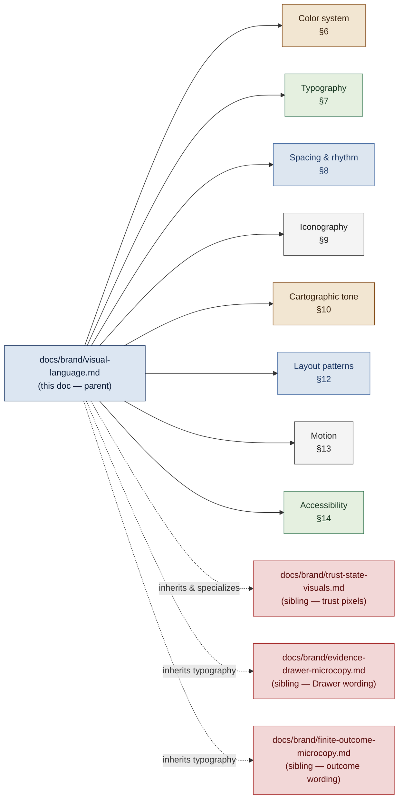

<!-- [KFM_META_BLOCK_V2]
doc_id: kfm://doc/<TODO-uuid>
title: Visual Language — the foundational brand visual system for Kansas Frontier Matrix
type: standard
version: v1
status: draft
owners: <TODO: brand / design-system maintainers + Map Architecture Lead + Accessibility Reviewer>
created: 2026-05-15
updated: 2026-05-15
policy_label: public
related:
  - docs/brand/trust-state-visuals.md
  - docs/brand/evidence-drawer-microcopy.md
  - docs/brand/finite-outcome-microcopy.md
  - docs/doctrine/map-first.md
  - docs/doctrine/time-aware.md
  - docs/doctrine/policy-aware.md
  - docs/doctrine/evidence-first.md
  - docs/architecture/ui-trust-surface.md
  - docs/architecture/map-architecture.md
tags: [kfm, brand, design-system, visual-language, typography, color, iconography, cartography, accessibility, tokens]
notes:
  - Parent visual document for the docs/brand/ family.
  - Owns the brand-wide visual system; delegates trust-state pixels and motion to trust-state-visuals.md.
  - Owns the design-token naming convention; specific values are PROPOSED until an ADR ratifies them.
  - Owns map cartographic tone at the brand level; per-layer styling lives with the layer manifests.
[/KFM_META_BLOCK_V2] -->

# Visual Language — the foundational brand visual system for Kansas Frontier Matrix

> The brand-wide visual system for KFM. **Owns** typography, color, spacing, iconography, cartographic tone, and layout rhythm across every KFM surface. **Delegates** trust-state visuals (badges, outcomes, suppression treatments, motion for trust) to its sibling. **Never** redefines doctrine or microcopy.


**Status:** Draft · **Owners:** _TODO brand / design-system maintainers + Map Architecture Lead + Accessibility Reviewer_ <sub>NEEDS VERIFICATION</sub> · **Updated:** 2026-05-15

> [!IMPORTANT]
> KFM is a **trust-bearing atlas**, not a marketing surface. Its visual language must read as **calm, restrained, evidence-first, and place-aware** — never decorative, triumphal, or persuasive. A polished hero animation, a saturated brand poster, or an emoji-laden empty state are out of place here in a way they would not be in a consumer product. `[CONFIRMED posture from `docs/doctrine/evidence-first.md` and `docs/doctrine/map-first.md`.]`

---

## Table of contents

1. [Purpose & scope](#1-purpose--scope)
2. [Audience & source hierarchy](#2-audience--source-hierarchy)
3. [The five visual-language principles](#3-the-five-visual-language-principles)
4. [The visual vocabulary at a glance](#4-the-visual-vocabulary-at-a-glance)
5. [Token naming convention](#5-token-naming-convention)
6. [Color system](#6-color-system)
   - 6.1 [Functional roles](#61-functional-roles)
   - 6.2 [PROPOSED palette](#62-proposed-palette)
   - 6.3 [Light, dark, and high-contrast pairs](#63-light-dark-and-high-contrast-pairs)
   - 6.4 [Color and trust state — the boundary](#64-color-and-trust-state--the-boundary)
7. [Typography](#7-typography)
   - 7.1 [Type families](#71-type-families)
   - 7.2 [Type scale](#72-type-scale)
   - 7.3 [Numerals, identifiers, and codes](#73-numerals-identifiers-and-codes)
   - 7.4 [Script, language, and i18n room](#74-script-language-and-i18n-room)
8. [Spacing, grid, and rhythm](#8-spacing-grid-and-rhythm)
9. [Iconography](#9-iconography)
10. [Cartographic tone & map style](#10-cartographic-tone--map-style)
11. [Imagery, archival material, and photography](#11-imagery-archival-material-and-photography)
12. [Layout patterns](#12-layout-patterns)
13. [Motion](#13-motion)
14. [Accessibility commitments](#14-accessibility-commitments)
15. [Dark mode, print, and high-contrast](#15-dark-mode-print-and-high-contrast)
16. [Wordmark, name, and identity assets](#16-wordmark-name-and-identity-assets)
17. [Brand-vs-doctrine signal separation](#17-brand-vs-doctrine-signal-separation)
18. [Anti-patterns](#18-anti-patterns)
19. [Verification checklist](#19-verification-checklist)
20. [Worked example (illustrative)](#20-worked-example-illustrative)
21. [Related docs](#21-related-docs)

---

## 1. Purpose & scope

This document is the **canonical reference** for KFM's brand-wide visual system. It is the parent of the `docs/brand/` family: every brand sibling either inherits these tokens, refines them for a specific surface, or applies them to a specific signal (trust state, microcopy, time slider, layer card, popup). `[INFERRED parent role from the three sibling docs that explicitly delegate brand-wide visual concerns to "a separate doc"; the path `docs/brand/` is PROPOSED until repo verification.]`

| In scope | Out of scope |
|---|---|
| Brand-wide typography (families, scale, numerals, i18n room). | Trust-state pixels, glyphs, and motion (see [`trust-state-visuals.md`](./trust-state-visuals.md)). |
| Brand-wide color system, role tokens, and dark/print pairs. | The semantic meaning of the five finite outcomes (see doctrine). |
| Spacing scale, grid, and visual rhythm conventions. | The wording of any UI string (see microcopy docs). |
| General iconography rules (functional vs decorative, sizing, alt). | Trust-badge glyphs and suppression-marker glyphs. |
| Cartographic tone at the brand level (basemap palette, label restraint). | Per-layer cartographic style; that lives with each `LayerManifest`. |
| Imagery and archival-material treatment at the brand level. | Source-specific attribution wording; that lives with each `SourceDescriptor`. |
| Layout rhythm — header, panel, drawer, card, list. | Routing, state, and runtime mechanics. |
| Motion at the brand level + reduced-motion posture. | The reduced-motion mapping for trust state (see sibling). |
| Wordmark guidelines and identity-asset rules. | The KFM doctrinal name, project description, or governance positioning. |

> [!NOTE]
> This doc and its three siblings — [`evidence-drawer-microcopy.md`](./evidence-drawer-microcopy.md), [`finite-outcome-microcopy.md`](./finite-outcome-microcopy.md), and [`trust-state-visuals.md`](./trust-state-visuals.md) — form a **deliberate visual-language family**. Roles do not overlap. The siblings govern wording and trust-state pixels; this doc governs everything else visual. Disagreement is a defect to be resolved, not a stylistic difference. `[INFERRED division of labor from the explicit delegations in each sibling doc.]`

[⬆ Back to top](#visual-language--the-foundational-brand-visual-system-for-kansas-frontier-matrix)

---

## 2. Audience & source hierarchy

**Primary audience.** Brand and design-system maintainers, frontend engineers, map cartographers, accessibility reviewers, document authors styling Markdown/PDF outputs, and contributors writing or reviewing any visual fixture.

**Secondary audience.** Doctrine maintainers checking that the visual surface has not drifted away from doctrine, translators reviewing how layout flexes around translated copy, and external contributors looking for a single grounded reference before opening a PR.

**Source hierarchy that applies to every claim in this doc.** `[CONFIRMED authority ladder from prior KFM governance work.]`

| Tier | What governs the visual choices in this doc |
|---|---|
| **1 — Primary** | KFM doctrine (`map-first.md`, `time-aware.md`, `policy-aware.md`, `evidence-first.md`) and contracts. Fix the **identifier vocabulary** (lifecycle stages, outcomes, time kinds, trust-badge keys) that visuals must honor. |
| **2 — Secondary** | Repository design-system code (CSS variables, token registry, component library), map-shell fixtures, document templates, axe-core baseline, and any existing brand asset directory. `[Repository not mounted this session; visual artifacts NEEDS VERIFICATION against repo state.]` |
| **3 — Tertiary** | External standards consulted only where they govern the visual contract: **WCAG 2.2 AA**, **ARIA 1.2**, the W3C **Reduced-Motion** preference, **BCP 47** (language tags), and OGC cartographic conventions. External style trends (gradients, glass effects, marketing illustration) do **not** override KFM posture. |

> [!WARNING]
> External design-system literature commonly recommends saturated brand palettes, bold display type, and motion-rich interactions to build "delight." KFM's posture is the opposite: **calm carries trust**. Saturated palettes desensitize users to the reserved hues KFM uses for warnings and corrections; bold display type bleeds into trust surfaces and reads as marketing; motion-rich interactions fight reduced-motion accessibility and over-promise about derived products. Treat the temptation as a defect, not a shortcut.

[⬆ Back to top](#visual-language--the-foundational-brand-visual-system-for-kansas-frontier-matrix)

---

## 3. The five visual-language principles

These principles govern every visual choice. Where this document and a sibling appear to conflict, the principles are the tiebreaker; where principles and doctrine conflict, doctrine wins.

| # | Principle | What it means in pixels |
|---|---|---|
| 1 | **Calm carries trust.** | Low-saturation palette, restrained type, generous whitespace, no flourish on confirmation. A `[CONFIRMED stance from `evidence-first.md` doctrine.]` |
| 2 | **Color alone is never sufficient.** | Every semantic signal — including time, source role, scale, sensitivity, and trust — is distinguishable by ≥2 of color, shape, position, glyph, or label. `[CONFIRMED from prior UI Architecture work.]` |
| 3 | **Place is the primary surface.** | Map cartographic tone leads; UI chrome defers to the map; document chrome echoes the atlas, not a SaaS dashboard. `[CONFIRMED from `map-first.md`.]` |
| 4 | **Evidence is visible, not implied.** | Citations, source attribution, and time-kind labels appear at the point of use; they are not buried behind hover or a single icon. `[CONFIRMED from `evidence-first.md`.]` |
| 5 | **The visual vocabulary is finite and stable.** | A small, fixed set of tokens, glyphs, type weights, and layout shapes; expansions require an ADR. Visual novelty is not a feature. |

> [!TIP]
> When in doubt, **remove a flourish before adding one**. A KFM surface that reads as boring-but-clear is preferable to one that reads as polished-but-noisy.

[⬆ Back to top](#visual-language--the-foundational-brand-visual-system-for-kansas-frontier-matrix)

---

## 4. The visual vocabulary at a glance

The diagram below is the orientation map for this document and for the `docs/brand/` family. It does **not** describe runtime mechanics — those live in the architecture docs.



`[INFERRED orientation. Sibling docs are CONFIRMED as a family; the parent role of this doc is INFERRED from explicit delegations in each sibling.]`

[⬆ Back to top](#visual-language--the-foundational-brand-visual-system-for-kansas-frontier-matrix)

---

## 5. Token naming convention

All brand-wide visual tokens follow a **four-segment** convention. This convention is the parent of the trust-state token rules in [`trust-state-visuals.md`](./trust-state-visuals.md) §5.

```text
--kfm-<axis>-<role>-<variant>-<mode>
```

| Segment | Meaning | Allowed values (PROPOSED) |
|---|---|---|
| `axis` | What visual axis the token governs. | `color` · `type` · `space` · `radius` · `shadow` · `motion` · `z` · `border` · `opacity` |
| `role` | The functional role the token plays. | for `color`: `ink` · `paper` · `prairie` · `cottonwood` · `river` · `ember` · `mute` <br/> for `type`: `body` · `display` · `mono` · `numeric` <br/> for `space`: `xs` · `sm` · `md` · `lg` · `xl` · `2xl` |
| `variant` | Optional sub-role; omit when there is only one variant. | e.g., `surface` · `border` · `text` · `accent` · `hover` |
| `mode` | Optional theme variant; omit for the default. | `dark` · `print` · `hc` (high-contrast) · `forced` (`forced-colors: active`) |

> [!NOTE]
> Trust-state tokens follow the related convention `--kfm-<axis>-<outcome|badge>-<role>` defined in [`trust-state-visuals.md`](./trust-state-visuals.md) §5 and are reserved for trust meanings. **Never reuse a trust-state token to color a brand surface**, and never coin a new `--kfm-color-outcome-*` token outside the trust-state-visuals doc. `[CONFIRMED separation; specific token-registry path NEEDS VERIFICATION.]`

**Examples.**

```text
--kfm-color-ink                  → primary brand ink (text, frames)
--kfm-color-ink-text-dark        → primary ink, dark mode
--kfm-color-paper                → default surface (light)
--kfm-color-paper-dark           → default surface, dark mode
--kfm-color-prairie-accent       → map / earth accent
--kfm-color-river-border         → informational border
--kfm-type-body                  → body type family stack
--kfm-type-mono                  → monospaced family stack (identifiers, codes)
--kfm-space-md                   → standard 8pt-equivalent step
--kfm-radius-card                → card corner radius
--kfm-shadow-elevation-1         → drawer / panel elevation
--kfm-motion-duration-quick      → 120 ms default; honored only when motion is allowed
```

[⬆ Back to top](#visual-language--the-foundational-brand-visual-system-for-kansas-frontier-matrix)

---

## 6. Color system

### 6.1 Functional roles

KFM's brand palette is **a small fixed set of functional roles**, not a "brand color" that varies by context. Each role has a meaning. Roles do not overlap. Trust-state colors (`ANSWER`, `ABSTAIN`, `DENY`, `ERROR`, `STALE`, and the six trust-badge keys) are governed by the sibling and are **not** part of the brand-wide palette.

| Role | What it carries | Typical use |
|---|---|---|
| `ink` | The primary brand ink. Maximum legibility, structural authority. | Body text, frame strokes, headings, primary buttons. |
| `paper` | The neutral surface. | Body background, panels, cards. |
| `prairie` | The earth/cartographic accent. | Map UI chrome accents, archival-material framing, atlas headers. |
| `cottonwood` | The "alive / confirmed-affirmative / governance-ok" accent. | Non-trust affirmative states (form save, copy-to-clipboard success); status pills outside trust state. |
| `river` | The informational/navigational accent. | Links (resting), info callouts, focus rings. |
| `ember` | The "attention, but not trust-error" accent. | Brand emphasis, doc callouts (e.g., `IMPORTANT`/`WARNING` UI for non-trust concerns); correction-notice frames. |
| `mute` | The neutral disabled / placeholder / skeleton tone. | Loading skeletons, disabled controls, placeholder text. |

> [!IMPORTANT]
> The single most important boundary in §6 is between **`ember` (brand emphasis)** and the trust palette's **`outcome.deny` / `outcome.error`**. They are different families of red and they communicate different things. A brand-poster banner that uses `outcome.error` red is a `[CONFIRMED anti-pattern from `trust-state-visuals.md` §17.]` See §6.4.

### 6.2 PROPOSED palette

The values below are the **PROPOSED** brand palette. They are derived from the consistent color family used in mermaid diagrams across prior KFM doctrine work and are submitted as a starting point for an ADR to ratify. They are not asserted as canonical. `[PROPOSED hex values; consistency CONFIRMED across prior diagrams.]`

| Token | Hex (PROPOSED) | Role | Notes |
|---|---|---|---|
| `--kfm-color-ink` | `#1F3A66` | Ink — primary brand ink (deep navy / frontier dusk) | Primary text, structural strokes. |
| `--kfm-color-ink-strong` | `#0E1F3A` | Ink — high-emphasis | Used on `paper` for headings and key frames. |
| `--kfm-color-paper` | `#FAF7F0` | Paper — warm off-white | The default surface; deliberately not pure `#FFFFFF`. |
| `--kfm-color-paper-strong` | `#FFFFFF` | Paper — pure white | Used inside `paper` for cards/panels that need lift. |
| `--kfm-color-prairie` | `#8E5A2A` | Prairie — sienna / earth | Map UI chrome accent; archival-material frame. |
| `--kfm-color-prairie-soft` | `#F2E6D2` | Prairie — soft fill | Backgrounds for atlas headers, document chrome. |
| `--kfm-color-cottonwood` | `#3B7A57` | Cottonwood — forest green | Non-trust affirmative; governance-ok callouts. |
| `--kfm-color-cottonwood-soft` | `#E5F0E0` | Cottonwood — soft fill | Subtle affirmative backgrounds. |
| `--kfm-color-river` | `#4A6FA5` | River — mid blue | Links resting; info callouts; focus ring. |
| `--kfm-color-river-soft` | `#DCE6F2` | River — soft fill | Informational panel fills. |
| `--kfm-color-ember` | `#A33A3A` | Ember — brand emphasis red | Doc emphasis & correction frames (non-trust). |
| `--kfm-color-ember-soft` | `#F2D7D7` | Ember — soft fill | Subtle attention backgrounds. |
| `--kfm-color-mute` | `#6B6B6B` | Mute — neutral | Placeholder text, disabled controls. |
| `--kfm-color-mute-soft` | `#F4F4F4` | Mute — soft fill | Skeleton loaders. |

> [!NOTE]
> All pairings must clear **WCAG 2.2 AA** body contrast (≥4.5:1 for text < 18 pt, ≥3:1 for large text and non-text indicators). `[CONFIRMED commitment from prior UI Architecture work.]` A contrast matrix is a TODO ADR deliverable (§21).

### 6.3 Light, dark, and high-contrast pairs

| Mode | Token suffix | Rule |
|---|---|---|
| Light (default) | _none_ | Default values above. |
| Dark | `-dark` | Each role has a paired dark value; pairings must clear AA. **Dark mode is not "invert the light palette."** It is a separate, audited mapping. |
| High-contrast | `-hc` | Saturation increased, ink darkened, accent lifted; targets WCAG 2.2 AAA (≥7:1 body) where feasible. |
| `forced-colors: active` | `-forced` | Role tokens map to `CanvasText`, `Canvas`, `LinkText`, `ButtonText`, etc.; **brand color must not bleed through** in Windows High Contrast and equivalent modes. `[CONFIRMED commitment to honor `forced-colors`; system colors PROPOSED.]` |

### 6.4 Color and trust state — the boundary

The brand palette **does not include** trust-outcome or trust-badge colors. Those live in the sibling and follow a separate token namespace. The reason is simple: trust-state colors must remain rare, instantly recognizable, and uncrowded. If `ember` and `outcome.error` blur, a doc reader sees a `WARNING` callout and reads it as a system failure.

| Concern | This doc | Sibling |
|---|---|---|
| Brand emphasis red (`ember`). | Owned here. | Forbidden as outcome surrogate. |
| Outcome red (`outcome.deny`, `outcome.error`). | Forbidden in brand contexts. | Owned by [`trust-state-visuals.md`](./trust-state-visuals.md) §6 / §9. |
| Affirmative green (`cottonwood`). | Owned here for non-trust affirmatives. | Trust badge `confirmed` / `reviewed` have their own greens that are visually distinct. |
| Stale yellow / amber. | **Reserved.** Brand surfaces do not use yellow/amber. | Reserved exclusively for `STALE`. `[CONFIRMED reservation from `trust-state-visuals.md` §6.5.]` |

> [!WARNING]
> No brand surface may use yellow/amber. `STALE` is the only KFM context where that hue carries meaning, and reserving it brand-wide is what makes it a usable signal. A "yellow banner" in marketing copy is a defect in this system.

[⬆ Back to top](#visual-language--the-foundational-brand-visual-system-for-kansas-frontier-matrix)

---

## 7. Typography

### 7.1 Type families

| Role | Family stack (PROPOSED) | Why |
|---|---|---|
| **Body** | A humanist sans (e.g., Inter, IBM Plex Sans, Source Sans 3) with a system fallback chain. | Long-form readability; broad script support; neutral voice. |
| **Display** | The body family at heavier weights — **no separate display face**. | Visual variety comes from weight and rhythm, not a second face; reduces font payload and tone drift. |
| **Mono** | A monospaced family (e.g., IBM Plex Mono, JetBrains Mono) with system fallback. | Identifiers, codes, manifests, schema names, paths. |
| **Atlas / cartographic** | Map labels follow the **map style spec**, not the body family. | Cartographic legibility differs from prose legibility; this is a `LayerManifest`-level concern, not a brand concern. |

> [!NOTE]
> Family **names** above are PROPOSED; the canonical font choice is a TODO ADR (§21). What is **CONFIRMED** is the role structure: one body family at multiple weights, one monospaced family for identifiers, no separate display face, no marketing display face. `[INFERRED restraint from §3 principle 1; CONFIRMED that identifiers render monospaced from `finite-outcome-microcopy.md` §4 and `evidence-drawer-microcopy.md` §4.]`

### 7.2 Type scale

KFM uses a **modest fixed scale**, not a fluid type system, to keep the visual vocabulary stable across surfaces (web, document, PDF, slide).

| Token | rem (PROPOSED) | Use |
|---|---|---|
| `--kfm-type-size-xs` | `0.75` | Caption, footnote, badge label. |
| `--kfm-type-size-sm` | `0.875` | Secondary UI text, metadata. |
| `--kfm-type-size-base` | `1.0` | Body. |
| `--kfm-type-size-md` | `1.125` | Body emphasis, list lead-in. |
| `--kfm-type-size-lg` | `1.25` | H4 / panel title. |
| `--kfm-type-size-xl` | `1.5` | H3 / drawer header. |
| `--kfm-type-size-2xl` | `1.875` | H2. |
| `--kfm-type-size-3xl` | `2.25` | H1 / page title. |

| Weight token | Numeric | Use |
|---|---|---|
| `--kfm-type-weight-regular` | `400` | Body. |
| `--kfm-type-weight-medium` | `500` | UI labels, badge text, button text. |
| `--kfm-type-weight-semibold` | `600` | Headings, key inline emphasis. |
| `--kfm-type-weight-bold` | `700` | Reserved; sparingly. **No** `800`/`900`. |

> [!IMPORTANT]
> **No all-caps headings, no oversized hero type, no decorative italics.** All-caps is acceptable only on small UI labels (badges, tab markers) where size already limits its emotional load. A KFM landing page with all-caps display type is a defect. `[CONFIRMED from `trust-state-visuals.md` §11 "No marketing typography on trust surfaces"; generalized here brand-wide.]`

### 7.3 Numerals, identifiers, and codes

Numbers and identifiers are **first-class trust signals** in KFM and must render with discipline.

| Rule | Specification |
|---|---|
| Identifiers, release ids, hashes, and reason codes render in monospaced (`--kfm-type-mono`). | Visual differentiation prevents confusion with prose. |
| Numerals in tables and dashboards use **tabular figures** (`font-variant-numeric: tabular-nums`). | Vertical alignment of digits across rows. |
| Numerals never use slashed-zero unless the entire surface does. | Mixed slashed/non-slashed across one document is a defect. |
| Dates render in ISO 8601 in machine-facing places and in human form in prose; the two forms appear together when both audiences read the surface. | `[CONFIRMED from `time-aware.md` doctrine.]` |
| Long identifiers do not wrap mid-token. | A reason code or release id splitting across a line is a defect. |

### 7.4 Script, language, and i18n room

| Rule | Why |
|---|---|
| All UI containers reserve **≥+50% horizontal growth** budget for translated copy without truncation or layout shift. | `[CONFIRMED i18n posture from prior UI Architecture work; specific budget PROPOSED.]` |
| Each visible string carries a `lang` attribute matching its BCP 47 locale. | Font fallback and screen-reader pronunciation depend on it. |
| Non-Latin script renders at the same **optical** x-height as the Latin form, not the same nominal point size. | Mismatched x-heights subtly demote the non-Latin form. |
| Indigenous and dual-name visual handling follows [`trust-state-visuals.md`](./trust-state-visuals.md) §16 and [`evidence-drawer-microcopy.md`](./evidence-drawer-microcopy.md) §18. | Multiplicity is the truth; flattening is a defect. |

[⬆ Back to top](#visual-language--the-foundational-brand-visual-system-for-kansas-frontier-matrix)

---

## 8. Spacing, grid, and rhythm

KFM uses an **8-point-equivalent spacing scale** as its default rhythm — a long-standing systematized convention chosen here for two KFM-specific reasons: (1) it survives translation in fixed grids better than a fluid scale, and (2) it is unambiguous in print/PDF where partial-pixel rendering matters. `[PROPOSED scale; rationale INFERRED from KFM's print/PDF-as-first-class commitment in prior governance work.]`

| Token | px (PROPOSED) | Typical use |
|---|---|---|
| `--kfm-space-xxs` | `2` | Hairline gaps, inline glyph offset. |
| `--kfm-space-xs` | `4` | Inline label gap. |
| `--kfm-space-sm` | `8` | Compact list gutter; chip padding. |
| `--kfm-space-md` | `16` | Standard component padding; paragraph rhythm. |
| `--kfm-space-lg` | `24` | Section padding; card outer margin. |
| `--kfm-space-xl` | `32` | Region separation. |
| `--kfm-space-2xl` | `48` | Page-section separation. |
| `--kfm-space-3xl` | `64` | Atlas hero spacing; landing-page section break. |

| Grid concern | Default | Notes |
|---|---|---|
| Container max width (reading) | `~72ch` (≈680 px) | Prose readability. |
| Container max width (atlas / dashboard) | `1440 px` | Maps and tables breathe. |
| Gutter | `--kfm-space-md` mobile / `--kfm-space-lg` desktop | No clever responsive ramps. |
| Card radius | `--kfm-radius-card` (PROPOSED 6 px) | Soft, not pillowy. |
| Elevation | `--kfm-shadow-elevation-1` for panels; `-2` for drawer; no elevation `≥-3`. | Restraint. |

> [!TIP]
> Visual rhythm in KFM is **carried by whitespace, not by dividers**. A surface with adequate `--kfm-space-lg` between regions usually does not need a horizontal rule. Reserve `<hr>` for major doctrinal or atlas-section breaks.

[⬆ Back to top](#visual-language--the-foundational-brand-visual-system-for-kansas-frontier-matrix)

---

## 9. Iconography

Iconography rules are **functional, not decorative**.

| Rule | Why |
|---|---|
| Icons are line glyphs at a **single weight** (PROPOSED 1.5 px stroke at 24 × 24 logical px). | Consistency across the brand library. |
| Icons are monochrome and inherit foreground color. | Multi-color icons are harder to recolor across modes and harder to accessibility-audit. |
| Each brand icon has a single fixed meaning across surfaces. | A "gear" must not mean settings here and policy-config there. |
| Icons render at ≥16 × 16 logical px wherever they carry meaning; <16 px is reserved for purely decorative use. | Below 16 px, glyph identity collapses. |
| Every icon that conveys meaning has a paired text label or `aria-label`. | Color-alone rule (§3.2). |
| **Trust-state glyphs are owned by [`trust-state-visuals.md`](./trust-state-visuals.md) §10**, not here. | Separation of concerns. |
| Emoji are **never** used as semantic indicators. | Cross-platform rendering variance; accessibility-name drift. `[CONFIRMED from `finite-outcome-microcopy.md` §4.]` |

| Surface | Icon library scope (PROPOSED) | Out-of-library |
|---|---|---|
| UI chrome | A small fixed library: navigation, search, close, expand, collapse, sort, filter, copy, download, link, lock. | Anything cute, mascot-like, illustrative. |
| Document & README | The UI library plus inline status glyphs (`info`, `note`, `tip`) tied to the GitHub-alerts vocabulary (§13). | Hand-drawn or sketchy glyphs. |
| Map | Cartographic symbology owned by the map style spec, not the brand icon library. | UI glyphs as map markers. |

[⬆ Back to top](#visual-language--the-foundational-brand-visual-system-for-kansas-frontier-matrix)

---

## 10. Cartographic tone & map style

Place is the primary operating surface (Principle 3). Brand-level cartographic tone is **restrained atlas, not branded map**. Per-layer details belong to each `LayerManifest`.

| Concern | Brand-level rule | Reason |
|---|---|---|
| Basemap palette | Low-saturation neutrals (paper, prairie soft, river soft) so that data layers carry the visual load. | A loud basemap competes with the data it carries. `[CONFIRMED restraint from `map-first.md` "the map renders evidence, never replaces it."]` |
| Labels | Use the body family at small sizes with adequate halo; preserve dual names verbatim. | `[CONFIRMED dual-name posture from prior UI Architecture work.]` |
| Data layer color | Each layer uses **one** brand role family (e.g., a hydrology layer leans `river`; a soils layer leans `prairie`; a vegetation layer leans `cottonwood`); avoid rainbow ramps. | Color carries meaning; rainbow ramps muddy it. |
| Sensitive geometry | Suppression and generalization treatments are owned by [`trust-state-visuals.md`](./trust-state-visuals.md) §8. | Doctrinal. |
| Time slider | Tick density and styling follow the six time kinds in [`time-aware.md`](../doctrine/time-aware.md); brand provides the chrome, not the semantics. | Doctrinal separation. |
| Attribution | Visible at the map surface, not hidden behind a single icon. | `[CONFIRMED from `evidence-first.md`.]` |
| Saturation budget | A map view that uses more than ~3 brand-role families simultaneously is a defect. | Visual budget; preserves trust-state colors as exceptional. |

> [!WARNING]
> A KFM map MUST NOT use any of the trust-state outcome colors (`ANSWER`, `ABSTAIN`, `DENY`, `ERROR`, `STALE`) for general cartographic styling. Those hues are reserved across the entire visual system for trust meaning. A "we used `ERROR` red because it pops on the basemap" choice is a `[CONFIRMED anti-pattern.]`

[⬆ Back to top](#visual-language--the-foundational-brand-visual-system-for-kansas-frontier-matrix)

---

## 11. Imagery, archival material, and photography

KFM frequently surfaces **archival material** — historic maps, photos, scans, sketches, registers. The brand visual rules for that material are:

| Rule | Why |
|---|---|
| Archival imagery is **framed** with a `--kfm-color-prairie` border or rule, never silhouetted onto the surface. | Frame signals "this is archival, not editorial." |
| Visible **source role**, **date kind**, and **scale** accompany every archival image. | `[CONFIRMED from `evidence-first.md`.]` Wording lives in the Drawer microcopy doc; placement is owned here. |
| Photographs are presented at their **native aspect**; no decorative cropping that alters meaning. | Editorial cropping of historical photographs is a `[CONFIRMED-rejected anti-pattern from prior governance work on archival integrity.]` |
| Color-correction of archival material is **disclosed**, not silently applied. | A `ProjectionTransformReceipt`-equivalent for imagery is a TODO ADR. |
| Modern photography (e.g., field photos) is **flat and documentary**, not lifestyle. | The brand voice is calm and evidence-first. |
| Generative or AI-derived imagery is **clearly marked** at the surface; it is not presented as photography. | `[CONFIRMED AI-as-assistant posture.]` Wording lives in the microcopy doc. |

> [!NOTE]
> KFM does not use stock photography on trust-bearing surfaces. A SaaS-style hero photo of "people pointing at a screen" is out of place in an atlas grounded in archival material. `[INFERRED from §3 principles 1 and 4; reinforced by the absence of stock imagery anywhere in prior KFM artifacts.]`

[⬆ Back to top](#visual-language--the-foundational-brand-visual-system-for-kansas-frontier-matrix)

---

## 12. Layout patterns

A small fixed set of layout patterns. New patterns require an ADR.

| Pattern | Purpose | Composition |
|---|---|---|
| **Atlas shell** | Map-first public/steward view. | Map fills viewport; left rail = layer registry browse; right rail = Evidence Drawer; top = time slider; bottom = legend & attribution. `[CONFIRMED surfaces from `map-first.md`.]` |
| **Document chrome** | Markdown/PDF reading surface. | Centered reading column ≤72 ch; left nav for long docs; H1 + meta block + badge row + TOC + body + footer. |
| **Evidence Drawer** | Inspectable claim panel. | Header (claim summary + trust badges) → Evidence → Source → Time → Policy → Review → Release → Correction. `[CONFIRMED anatomy from `evidence-drawer-microcopy.md` §5.]` |
| **Layer card** | Compact layer representation in registries, dashboards, search. | Title + source role + time kind + trust badges + open-in-drawer action. |
| **Status pill** | Compact non-trust status (form save, copy success, draft, deprecated). | Single line, sentence case, paired glyph + label. **Visually distinct** from trust badges to avoid confusion (§17). |
| **Callout** | Inline emphasis for guidance. | GitHub-alerts vocabulary only: `NOTE`, `TIP`, `IMPORTANT`, `WARNING`, `CAUTION`. Never nested. `[CONFIRMED from `<presentation_standard>` in repo doc rules.]` |
| **Empty state** | Surface with nothing to show. | Plain text + optional glyph; **never** styled as a trust outcome. `[CONFIRMED from `trust-state-visuals.md` §12.]` |

[⬆ Back to top](#visual-language--the-foundational-brand-visual-system-for-kansas-frontier-matrix)

---

## 13. Motion

KFM motion is **functional and brief**. Motion never carries meaning on its own (Principle 2).

| Rule | Specification |
|---|---|
| Default duration | `--kfm-motion-duration-quick` (PROPOSED 120 ms) for UI feedback; `--kfm-motion-duration-base` (PROPOSED 200 ms) for panel transitions. |
| Easing | A single `ease-out` curve brand-wide. **No spring physics, no bouncy easing.** |
| **`prefers-reduced-motion: reduce`** | Disables all non-essential animation. State changes become instant **and equally informative** — never reduced to "less" without preserving meaning. `[CONFIRMED commitment from `trust-state-visuals.md` §13.]` |
| Loading | Skeletons, not spinners, on trust-bearing surfaces. Spinners are acceptable on non-trust feedback (file copy, export) where they cannot mask an outcome. `[CONFIRMED from `trust-state-visuals.md` §12.]` |
| Decorative motion | Forbidden on trust surfaces, doc callouts, and any surface that conveys evidence state. |
| Parallax / scroll-linked | Forbidden brand-wide. |

> [!IMPORTANT]
> Motion is the most common surface for accidental marketing tone. When in doubt, **make it instant**. `[Reinforces `trust-state-visuals.md` §13.1 "Animated morph between two outcome badges visually implies they are the same thing in different moods."]`

[⬆ Back to top](#visual-language--the-foundational-brand-visual-system-for-kansas-frontier-matrix)

---

## 14. Accessibility commitments

These commitments are brand-wide; the trust-state surface adds further constraints in its sibling doc.

| Commitment | Target |
|---|---|
| Color contrast | WCAG 2.2 AA: ≥4.5:1 body, ≥3:1 large text & non-text indicators. AAA where feasible. `[CONFIRMED.]` |
| Non-text differentiation | Every semantic signal distinguishable by ≥2 of color/shape/icon/position/label. `[CONFIRMED.]` |
| Focus visibility | Every interactive element has a visible focus indicator using `--kfm-color-river` with ≥3:1 contrast against the adjacent surface, including on map features. `[CONFIRMED.]` |
| Reduced motion | `prefers-reduced-motion: reduce` honored everywhere; equivalent meaning preserved. `[CONFIRMED.]` |
| Forced colors | `forced-colors: active` honored everywhere; trust meaning preserved through shape/label, not color. `[CONFIRMED commitment to honor; specific mappings PROPOSED.]` |
| Keyboard | All interaction reachable by keyboard alone; visible focus order matches reading order. |
| Screen-reader | Identifiers are read as labels, not as letter-by-letter sequences; `aria-label` and `lang` are present where the language doesn't match the page. |
| Live regions | Trust outcome banners use `aria-live="polite"`; only critical system errors use `aria-live="assertive"`. `[CONFIRMED from `trust-state-visuals.md` §14.]` |
| Print | All semantic signals survive grayscale print. `[CONFIRMED from `trust-state-visuals.md` §15.]` |

> [!CAUTION]
> Accessibility commitments are **not "stretch goals."** A KFM surface that ships without a contrast audit, a reduced-motion fallback, or a `forced-colors` pass is shipping a defect. CI is the right place to enforce this; the absence of CI enforcement is a `[NEEDS VERIFICATION` repository-state item.]`

[⬆ Back to top](#visual-language--the-foundational-brand-visual-system-for-kansas-frontier-matrix)

---

## 15. Dark mode, print, and high-contrast

| Mode | Posture |
|---|---|
| **Light (default)** | Warm paper, deep ink, restrained accents. |
| **Dark** | Audited dark palette — **not** an inverted light palette. Trust and brand surfaces re-evaluated for contrast against dark basemaps and dark UI chrome. `[CONFIRMED need for separate audit from `trust-state-visuals.md`.]` |
| **High contrast** | Saturation lifted, ink darkened, glyphs simplified, hatch patterns added on suppression surfaces. |
| **`forced-colors: active`** | Brand color suppressed; structural meaning carried by shape, position, and system colors. |
| **Print / PDF** | All trust state and brand emphasis survive grayscale. No reliance on color-only differentiation. Atlas page chrome uses `--kfm-color-prairie-soft` framing that prints as a clean tonal frame, not as a heavy bar. |

> [!NOTE]
> KFM treats **PDF and print as first-class surfaces**, not as afterthoughts. A trust signal that vanishes when printed is a defect. `[CONFIRMED from prior PDF-conversion governance work where every state was required to survive grayscale.]`

[⬆ Back to top](#visual-language--the-foundational-brand-visual-system-for-kansas-frontier-matrix)

---

## 16. Wordmark, name, and identity assets

The name *Kansas Frontier Matrix* (and its abbreviation *KFM*) is the project's primary identity asset. Logo and wordmark are PROPOSED at the placeholder level; specific glyph identity is a TODO ADR (§21).

| Rule | Specification |
|---|---|
| Capitalization | Always *Kansas Frontier Matrix* (three words, title case) or *KFM* (uppercase). **Not** *kansas frontier matrix*, *Kfm*, *K.F.M.*, or *Frontier Matrix* on its own. |
| Wordmark style | The body family at `--kfm-type-weight-semibold` in `--kfm-color-ink`. No custom display face. `[PROPOSED; reflects §7.1 restraint.]` |
| Minimum size | ≥16 logical px / ≥10 print pt. Below that, use *KFM*. |
| Clear space | Minimum padding equal to the cap-height of the wordmark on all sides. |
| Color | `--kfm-color-ink` on `--kfm-color-paper`; inverted to `--kfm-color-paper` on `--kfm-color-ink` only for fully dark contexts. |
| Composition with sub-brand | When paired with a sub-brand (e.g., *KFM Atlas*, *KFM Steward*), the sub-brand is the body family at the same weight, joined by a thin separator. **No** sub-brand color variation. |
| Logo placement on trust surfaces | The wordmark is **not** placed inside the Evidence Drawer, on trust banners, or on outcome surfaces. Trust surfaces carry evidence, not branding. `[CONFIRMED separation from `trust-state-visuals.md` posture.]` |
| Logo asset | A `TODO` placeholder. When ratified, lives at a path like `branding/wordmark/` with light/dark/forced/print variants. `[PROPOSED path.]` |

> [!TIP]
> The strongest brand signal in KFM is **consistency, not adornment**. Every surface that uses the same type rhythm, the same restrained palette, and the same atlas framing **already** reads as KFM. The wordmark only confirms what the rest of the system has already established.

[⬆ Back to top](#visual-language--the-foundational-brand-visual-system-for-kansas-frontier-matrix)

---

## 17. Brand-vs-doctrine signal separation

The single most common visual defect in trust-bearing systems is **borrowing trust visuals for brand purposes** (or vice versa). The table below is the boundary.

| Boundary | Brand side (this doc) | Doctrine side (siblings) |
|---|---|---|
| Red | `--kfm-color-ember` for brand emphasis & correction frames. | `outcome.deny` / `outcome.error` in trust palette. |
| Green | `--kfm-color-cottonwood` for non-trust affirmatives. | Trust-badge `confirmed` / `reviewed` greens. |
| Yellow/amber | **Forbidden.** | `STALE` only. |
| Check glyph | Brand UI affirmatives (copy succeeded, form saved). | Trust badge `confirmed`. **Visually distinct** glyph identity. `[CONFIRMED from `trust-state-visuals.md` §10.1.]` |
| Shield / lock glyph | Forbidden in brand surfaces. | `DENY`, `restricted` only. |
| Banner shape | Brand callouts use the GitHub-alerts shape. | Outcome banners use a distinct shape (see sibling). |
| Wordmark | Owned here. | Forbidden on trust surfaces. |
| Triumphal tone | Forbidden everywhere. | Forbidden on `ANSWER`. `[CONFIRMED from `trust-state-visuals.md` §6.1.]` |

> [!IMPORTANT]
> If a brand surface and a trust surface look the same at a glance, the trust surface has been demoted. **The two surfaces should always be distinguishable within ~1 second by a reader who is not paying close attention.** That is the design test.

[⬆ Back to top](#visual-language--the-foundational-brand-visual-system-for-kansas-frontier-matrix)

---

## 18. Anti-patterns

`[CONFIRMED-rejection patterns drawn from prior KFM doctrine, the three sibling brand docs, and prior PDF-conversion governance work.]`

| Anti-pattern | Why rejected | Corrective rule |
|---|---|---|
| Saturated brand palette ("punchy" reds, greens, yellows). | Desensitizes users to the reserved hues KFM uses for `DENY`, `STALE`, and corrections. | §6, §3 principle 1. |
| Yellow/amber on a brand surface. | Reserved for `STALE` brand-wide. | §6.4. |
| Heavy display type (`800`/`900` weight, oversized hero). | Reads as marketing; competes with trust banners. | §7.2 IMPORTANT callout. |
| Decorative italics for emphasis. | Reads as editorial flourish; not the brand voice. | §7.2. |
| Pure `#FFFFFF` background as the default surface. | Loses the warm-paper atlas tone; flattens archival imagery. | §6.2 `--kfm-color-paper`. |
| Pure `#000000` ink. | Too high-contrast on warm paper; reads as stark. | §6.2 `--kfm-color-ink-strong`. |
| Rainbow ramps on map data layers. | Color carries meaning; rainbow ramps muddy it. | §10 saturation budget. |
| Stock photography on trust-bearing surfaces. | Out-of-place editorial tone. | §11 NOTE. |
| AI-generated imagery presented as photography. | Misleads about source role. | §11; doctrine `ai-as-assistant`. |
| Parallax or scroll-linked motion. | Fails reduced-motion; over-promises about derived products. | §13. |
| Spinner that masks an outcome on a trust surface. | Demotes a doctrinal signal to UI noise. | §13; sibling §12. |
| Brand surface that uses `outcome.error` red. | Conflates brand emphasis and system failure. | §6.4 IMPORTANT. |
| Wordmark inside the Evidence Drawer. | Trust surfaces carry evidence, not branding. | §16. |
| All-caps or display type on outcome banners. | Marketing tone on trust surfaces. | §7.2; sibling §11. |
| Decorative dividers between every section. | Whitespace already carries rhythm. | §8 TIP. |
| New brand color introduced without an ADR. | The vocabulary is finite and stable. | §3 principle 5; §21. |

[⬆ Back to top](#visual-language--the-foundational-brand-visual-system-for-kansas-frontier-matrix)

---

## 19. Verification checklist

Use this checklist before merging any visual change that touches the brand-wide system. Trust-state surfaces have additional checks in [`trust-state-visuals.md`](./trust-state-visuals.md) §18.

- [ ] **Tokens.** Change uses only existing `--kfm-*` tokens; new tokens are ADR-backed.
- [ ] **Color.** No trust-state token is used outside trust contexts; no brand token is used inside trust contexts.
- [ ] **Yellow.** No yellow/amber appears anywhere except `STALE`.
- [ ] **Contrast.** Each color pair passes WCAG 2.2 AA (≥4.5:1 / ≥3:1) in light, dark, and high-contrast modes.
- [ ] **Forced colors.** Surface renders correctly under `forced-colors: active`.
- [ ] **Grayscale.** Surface remains legible and signals remain distinguishable in print/grayscale.
- [ ] **Type.** Body, mono, and weight tokens used; no introduced display face; no all-caps hero.
- [ ] **i18n room.** Container accommodates +50% label growth without layout shift.
- [ ] **Identifiers.** Codes, ids, and reason codes render in `--kfm-type-mono` and do not wrap.
- [ ] **Icons.** Brand library glyphs only; no emoji; meaning paired with a label or `aria-label`.
- [ ] **Motion.** Honors reduced-motion; no parallax; no decorative motion on trust surfaces.
- [ ] **Focus.** Visible focus indicator on every interactive element.
- [ ] **Map.** Cartographic palette ≤3 brand-role families; no outcome colors in general styling.
- [ ] **Imagery.** Archival material framed; source/date/scale visible; no stock imagery on trust surfaces.
- [ ] **Wordmark.** Capitalization correct; no wordmark on trust surfaces.
- [ ] **Boundary test.** Brand surface and adjacent trust surface are distinguishable within ~1 second.

> [!NOTE]
> A grayscale and a `forced-colors` CI gate would automate parts of this checklist; its presence or absence in the current repo is `[NEEDS VERIFICATION.]`

[⬆ Back to top](#visual-language--the-foundational-brand-visual-system-for-kansas-frontier-matrix)

---

## 20. Worked example (illustrative)

The example below is **illustrative**, not a fixture. It shows the brand visual language applied to a doc-header rendering and a layer-card rendering, with explicit pointers back to the relevant sections. No specific copy here is doctrinal.

<details>
<summary><b>Step 1 — Doc header (Markdown surface)</b></summary>

```text
[H1 in --kfm-type-size-3xl / --kfm-type-weight-semibold / --kfm-color-ink-strong]
[Single-line purpose below, --kfm-type-size-md / --kfm-color-ink]

[Badge row: ≥3 Shields.io badges, --kfm-type-size-xs, sentence case, no exclamation marks]

[Status · Owners · Updated line: --kfm-type-size-sm / --kfm-color-mute]
```

Notes: `[§7.2 scale; §6.2 ink; §3 principle 1.]`

</details>

<details>
<summary><b>Step 2 — Layer card</b></summary>

```text
┌────────────────────────────────────────────┐
│  Layer title (medium weight, ink)          │   ← §7.2 weight
│  Source role · Time kind                   │   ← §7.3 monospaced where ids appear
│  [trust badges row — owned by sibling]     │   ← §17 boundary
│  ───────────────────────────────────────── │   ← §8 (rule only at major break)
│  [Open in Drawer]  [Copy citation]         │   ← §9 brand icons + labels
└────────────────────────────────────────────┘
   prairie 1px frame; paper-strong fill         ← §6.2; §11 archival framing
```

Notes: Trust badges live on the card but are owned by [`trust-state-visuals.md`](./trust-state-visuals.md). The frame, paper fill, type weights, and action chrome are owned here.

</details>

<details>
<summary><b>Step 3 — Empty state</b></summary>

```text
[Body text in --kfm-type-size-base / --kfm-color-mute]
"No layers in this region for the selected time."
[No icon styled as a trust outcome; no spinner; no "Oops!"]
```

Notes: `[§12 "Empty state"; sibling §12 anti-pattern "spinner masks outcome."]`

</details>

<details>
<summary><b>Step 4 — Print fidelity</b></summary>

When printed in grayscale, the doc header keeps its rhythm (whitespace, weight contrast); the layer card keeps its prairie frame as a clean tonal frame; trust badges keep their distinct shapes and labels per the sibling. No semantic signal collapses. `[§15.]`

</details>

[⬆ Back to top](#visual-language--the-foundational-brand-visual-system-for-kansas-frontier-matrix)

---

## 21. Related docs

- [`docs/brand/trust-state-visuals.md`](./trust-state-visuals.md) — Trust-state pixels, shapes, and motion. **The single closest sibling.** `[CONFIRMED sibling.]`
- [`docs/brand/evidence-drawer-microcopy.md`](./evidence-drawer-microcopy.md) — Wording rendered by the Evidence Drawer. `[CONFIRMED sibling.]`
- [`docs/brand/finite-outcome-microcopy.md`](./finite-outcome-microcopy.md) — Wording for the five finite outcomes. `[CONFIRMED sibling.]`
- [`docs/doctrine/map-first.md`](../doctrine/map-first.md) — Place as the primary operating surface. `[CONFIRMED.]`
- [`docs/doctrine/evidence-first.md`](../doctrine/evidence-first.md) — Evidence visibility doctrine. `[CONFIRMED concept; exact path NEEDS VERIFICATION.]`
- [`docs/doctrine/time-aware.md`](../doctrine/time-aware.md) — Six time kinds and freshness window. `[CONFIRMED.]`
- [`docs/doctrine/policy-aware.md`](../doctrine/policy-aware.md) — Policy gate, reason-code vocabulary. `[CONFIRMED.]`
- [`docs/architecture/ui-trust-surface.md`](../architecture/ui-trust-surface.md) — UI Trust Surface. `[CONFIRMED concept; exact path NEEDS VERIFICATION.]`
- [`docs/architecture/map-architecture.md`](../architecture/map-architecture.md) — Map architecture; per-layer style is governed there. `[CONFIRMED concept; exact path NEEDS VERIFICATION.]`
- _TODO_ `docs/brand/popup-microcopy.md` <sub>PROPOSED sibling.</sub>
- _TODO_ `docs/brand/layer-card-microcopy.md` <sub>PROPOSED sibling.</sub>
- _TODO_ `docs/brand/time-slider-microcopy.md` <sub>PROPOSED sibling.</sub>
- _TODO_ ADR — *KFM type families (body, mono).* <sub>PROPOSED — this doc names the role; the ADR ratifies the specific family stack.</sub>
- _TODO_ ADR — *KFM brand palette: hex values and contrast matrix.* <sub>PROPOSED — this doc submits a palette; the ADR ratifies values across light, dark, high-contrast, and forced-colors modes.</sub>
- _TODO_ ADR — *KFM wordmark and identity assets.* <sub>PROPOSED — this doc names the wordmark posture; the ADR picks the specific composition and clear-space rules.</sub>
- _TODO_ ADR — *Grayscale / forced-colors CI gates for brand surfaces.* <sub>PROPOSED — this doc names the commitments; the ADR ratifies the enforcement path.</sub>

---

**Last updated:** 2026-05-15 · **Status:** Draft · **Owners:** _TODO brand / design-system maintainers + Map Architecture Lead + Accessibility Reviewer_ <sub>NEEDS VERIFICATION</sub>

[⬆ Back to top](#visual-language--the-foundational-brand-visual-system-for-kansas-frontier-matrix)
