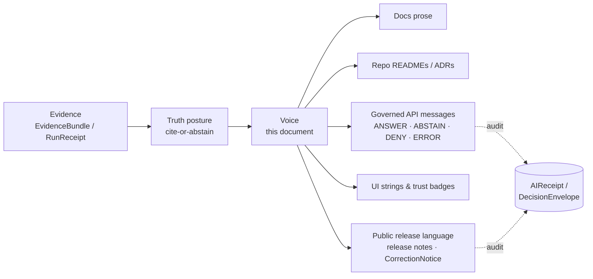
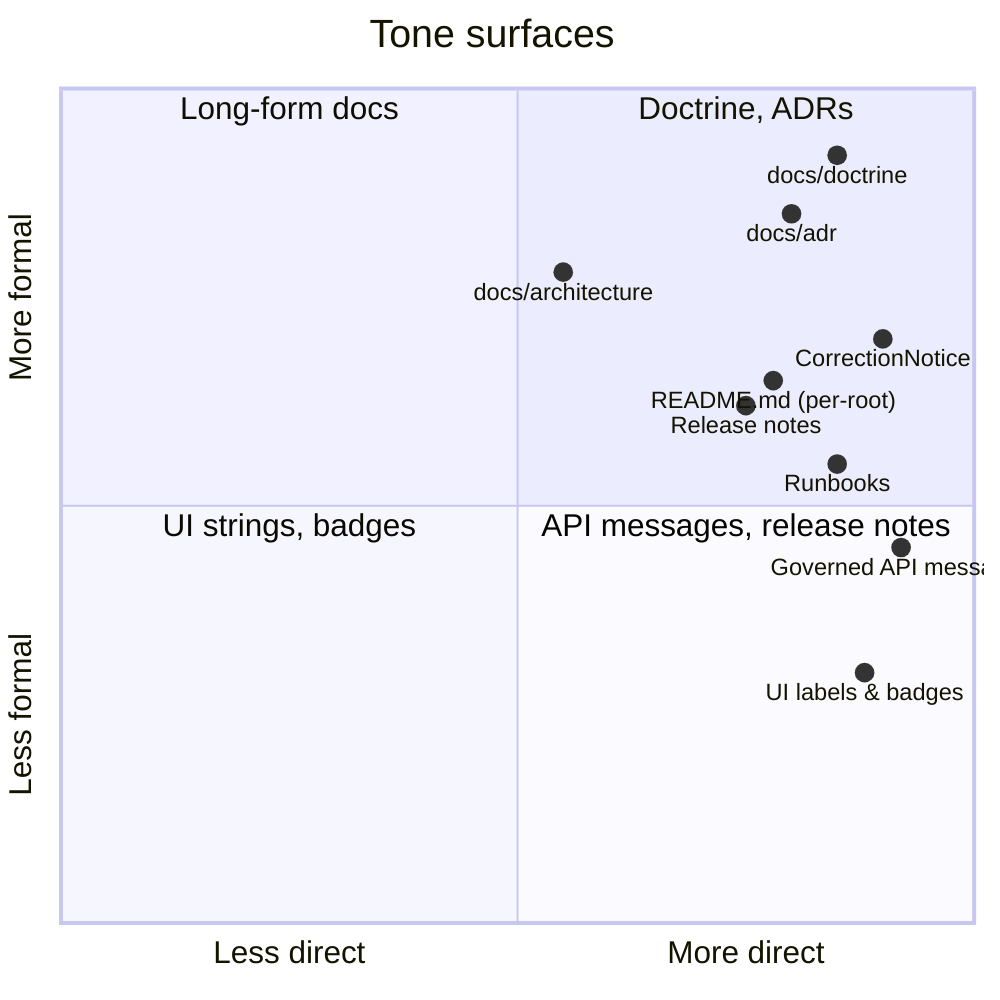

<!-- [KFM_META_BLOCK_V2]
doc_id: kfm://doc/brand-voice-and-tone-v1
title: Voice and Tone
type: standard
version: v1
status: draft
owners: <docs steward + brand owner — TODO confirm against CODEOWNERS>
created: 2026-05-15
updated: 2026-05-15
policy_label: public
related:
  - docs/doctrine/truth-posture.md
  - docs/doctrine/trust-membrane.md
  - docs/doctrine/authority-ladder.md
  - docs/doctrine/lifecycle-law.md
  - docs/doctrine/directory-rules.md
  - docs/architecture/governed-api.md
  - docs/standards/PROV.md
tags: [kfm, brand, voice, tone, writing, ubiquitous-language]
notes:
  - Refines doctrine; never overrides it.
  - Path is CONFIRMED-permissible under Directory Rules §6.1; presence in mounted repo is UNKNOWN.
[/KFM_META_BLOCK_V2] -->

# Voice and Tone

> How Kansas Frontier Matrix writes — across docs, repo surfaces, governed API responses, UI strings, and public release language — so that words carry the same evidence posture as the system itself.


| Field | Value |
|---|---|
| **Status** | `draft` |
| **Owners** | Docs steward + brand owner *(TODO — confirm against `CODEOWNERS`)* |
| **Authority** | Refines doctrine; never overrides `docs/doctrine/` |
| **Last updated** | 2026-05-15 |
| **Proposed path** | `docs/brand/voice-and-tone.md` (per Directory Rules §6.1) |

---

## Quick jump

- [1. Purpose and scope](#1-purpose-and-scope)
- [2. The core principle](#2-the-core-principle)
- [3. Where voice lives](#3-where-voice-lives)
- [4. Voice attributes](#4-voice-attributes)
- [5. Tone modulation by surface](#5-tone-modulation-by-surface)
- [6. Truth-label hygiene in prose](#6-truth-label-hygiene-in-prose)
- [7. KFM terminology — preserve, do not paraphrase](#7-kfm-terminology--preserve-do-not-paraphrase)
- [8. Finite outcomes in user-facing copy](#8-finite-outcomes-in-user-facing-copy)
- [9. Sensitivity, rights, and care](#9-sensitivity-rights-and-care)
- [10. Anti-patterns](#10-anti-patterns)
- [11. Worked examples](#11-worked-examples)
- [12. Relation to ubiquitous language](#12-relation-to-ubiquitous-language)
- [13. Review checklist](#13-review-checklist)
- [Related docs](#related-docs)

---

## 1. Purpose and scope

KFM is a **governed, evidence-first, map-first, time-aware spatial knowledge system**. Words in this system are not decoration. A label on a map badge, the body of an `ABSTAIN` response, the headline on a documentation page, and the wording of a `CorrectionNotice` all sit inside the same trust membrane that governs lifecycle, policy, and release.

This document defines the voice and tone KFM uses so that prose stays **honest about what it can and cannot prove**, **stable in its vocabulary**, and **legible to humans, reviewers, and downstream consumers** alike.

> [!NOTE]
> Voice and tone are presentation choices. They never override the truth posture, the trust membrane, the lifecycle invariant, or the publication gates. If a stylistic preference would soften, hide, or invert what the evidence supports, the evidence wins.

**In scope**

- Long-form documentation under `docs/`.
- Repo-facing prose: `README.md` files, ADRs, runbooks, registers.
- Governed-API human-readable fields (reasons, remediations, policy messages).
- UI strings: labels, badges, callouts, empty/loading/denied/error states.
- Public release language: release notes, correction notices, story-node narration.

**Out of scope**

- Schema field names and identifier vocabularies (governed by `contracts/`, `schemas/`, and ADRs — see §7).
- Diagram colors, logo usage, and visual identity (covered by other docs under `docs/brand/` *(PROPOSED — co-location)*).
- Internal team chat conventions and code comments (not public surfaces).

---

## 2. The core principle

> **Cite or abstain. Label confidence. Preserve KFM names. Fail closed in language too.**

Everything in this document is downstream of one rule: **style never outranks truth, traceability, or verification.** When in doubt, narrow the claim, mark its status, and let evidence carry the answer.



> Diagram intent: voice is a surface treatment laid on top of doctrine, not a substitute for it. The same evidence and the same finite outcomes flow through every surface the user can see.

---

## 3. Where voice lives

KFM voice is consistent across surfaces, but each surface has a job. The mismatch between *job* and *style* is the most common drift this document is meant to prevent.

| Surface | Primary job | Tone register | Length budget |
|---|---|---|---|
| `docs/doctrine/` | State invariants and law | Formal, declarative, RFC-2119-aware | As long as needed; precision over brevity |
| `docs/architecture/` | Explain how parts fit | Calm, structural, diagram-led | Medium; favor diagrams + crisp prose |
| `docs/adr/` | Record decisions | Contextual, decisive, retrospective-friendly | Bounded; ADR template fields |
| `docs/standards/` | Crosswalk to external standards | Neutral, sourced, comparative | Medium; tables and crosswalks |
| Per-root `README.md` | Orient and gate | Direct, contract-shaped (§15 of Directory Rules) | Short; the contract sections only |
| Governed API messages | Tell the caller what happened and why | Plain, specific, remediation-bearing | Short; one finite outcome per response |
| UI strings | Tell the user what is true *right now* | Plain, trust-visible, accessible | Tight; never decorative |
| Release notes / `CorrectionNotice` | Tell the public what changed and what to do | Sober, attributable, reversible | Bounded; named artifacts and rollback target |

> [!IMPORTANT]
> A `README.md` is not a manifesto. A doctrine page is not a press release. A UI label is not an essay. Length and register are part of the contract — choose them deliberately.

---

## 4. Voice attributes

KFM voice has five named attributes. They apply in this order when they conflict.

### 4.1 Truthful

State what is known, what is proposed, and what is unknown. Use the project's truth labels (`CONFIRMED`, `PROPOSED`, `INFERRED`, `UNKNOWN`, `NEEDS VERIFICATION`, `EXTERNAL`) where confidence materially matters. Do not upgrade uncertainty through tone. Do not flatten it through hedging either — `PROPOSED` is a label, not a softener.

### 4.2 Inspectable

Prefer wording the reader can trace. Name the artifact (`EvidenceBundle`, `RunReceipt`, `ReleaseManifest`), the gate (`PolicyDecision`, `PromotionDecision`), or the surface (Evidence Drawer, Focus Mode, Story Node). Avoid handwave nouns like "the system," "the platform," or "our pipeline" when a named object would carry the same meaning with traceability attached.

### 4.3 Plain

Short sentences. Active voice by default. Concrete subjects. Avoid abbreviation chains. Avoid marketing language ("seamless," "powerful," "world-class," "next-generation"). Avoid academic throat-clearing ("it is important to note that…"). Avoid stacked qualifications that hide the claim.

### 4.4 Stable

KFM compound terms are vocabulary, not phrasing. They do not get rewritten for variety. **Write `EvidenceBundle` every time, not "the evidence package," "the bundle," or "the evidence object."** Stable vocabulary is what lets a reader (or a downstream reviewer, or an AI surface) reason about the same thing across documents.

### 4.5 Reversible

If a statement could turn out wrong, write it in a form that makes correction cheap. Prefer narrow, dated, attributed claims over sweeping ones. A sentence that resists correction is a sentence that resists governance.

> [!TIP]
> A useful self-test: if this sentence turned out to be wrong, what would have to change to fix it — a word, a paragraph, or the document's identity? Aim for "a word."

---

## 5. Tone modulation by surface

Voice is constant; tone moves on two axes — **formality** and **directness** — depending on who is reading.



**Direct = states the operative fact first; defers context.** Doctrine, API messages, and UI strings are direct because the reader needs the operative bit immediately. Long-form architecture docs are less direct because context is what they exist to deliver.

**Formal = avoids first-person, contractions, and casual register.** Doctrine, ADRs, and `CorrectionNotice` are formal because they have a long lifespan and a wide audience. UI strings are less formal because the reader is mid-task and needs a sentence they can read in one beat.

---

## 6. Truth-label hygiene in prose

Truth labels are a doctrine, not a checklist. The default is: **apply them where confidence materially matters**, not on every sentence.

| Label | Use when… | In running prose, looks like… |
|---|---|---|
| `CONFIRMED` | Verified this session from attached docs, mounted repo, tests, logs, or generated artifacts. | "The lifecycle invariant `RAW → WORK / QUARANTINE → PROCESSED → CATALOG / TRIPLET → PUBLISHED` is **CONFIRMED** doctrine in Directory Rules §0." |
| `INFERRED` | Reasonably derivable from visible evidence but not directly stated. | "**INFERRED:** the `docs/brand/` folder is intended as a single home for brand assets when not co-located in `packages/ui/`." |
| `PROPOSED` | Design, recommendation, path, or placement not yet verified in implementation. | "The `EvidenceDrawerPayload` schema **(PROPOSED)** would live at `schemas/contracts/v1/ui/evidence_drawer_payload.schema.json`." |
| `UNKNOWN` | Not resolvable without more evidence in this session. | "Whether the `docs/brand/` directory exists in the mounted repo is **UNKNOWN**." |
| `NEEDS VERIFICATION` | Checkable, but not yet checked strongly enough to act as fact. | "The exact owner string in `CODEOWNERS` **NEEDS VERIFICATION**." |
| `EXTERNAL` | Sourced from authoritative external research. Never used for KFM-specific repo or doctrine claims. | "**EXTERNAL:** W3C PROV-O defines `Activity` as something that occurs over a period of time." |

### 6.1 What labels are *not*

- Not a synonym for hedging. "It might be the case that…" is hedging. `PROPOSED` is a label that names where the claim sits in the trust lifecycle.
- Not a way to harden a guess. Putting `CONFIRMED` in front of a guess makes the guess worse, not better.
- Not decorative. Don't sprinkle them on a sentence that doesn't need one. Don't omit them on a sentence that does.

> [!WARNING]
> "Memory is not evidence." Recollection, plausible inference, generic best practice, and prior session outputs do **not** support `CONFIRMED`. If the only basis is "this is the sort of thing KFM would do," the label is `PROPOSED` at best.

---

## 7. KFM terminology — preserve, do not paraphrase

Stable vocabulary is the operational backbone of a governed system. Within KFM, **object-family names are vocabulary**, not phrasing. They are not rewritten for variety, simplified for general audiences, or translated into industry-standard synonyms in public surfaces.

This is the project's working application of the **Ubiquitous Language** principle, modulated by the **Published Language** pattern for public-facing surfaces.

### 7.1 Compound terms — keep exact casing and spelling

The terms below are KFM's published vocabulary. Use them verbatim. Do not rename, abbreviate, or "humanize" them.

<details>
<summary><strong>Trust and evidence vocabulary</strong> (preserve exactly)</summary>

| KFM term | Do **not** write |
|---|---|
| `EvidenceBundle` | "the evidence package," "the bundle," "an evidence object" |
| `EvidenceRef` | "evidence pointer," "evidence link" |
| `SourceDescriptor` | "the source record," "source metadata blob" |
| `SourceActivationDecision` | "source approval," "source go-decision" |
| `PolicyDecision` | "the policy result," "the policy ruling" |
| `DecisionEnvelope` | "decision wrapper," "the verdict object" |
| `RuntimeResponseEnvelope` | "the response wrapper," "the runtime payload" |
| `PromotionDecision` | "the promotion verdict," "the merge gate" |
| `ReleaseManifest` | "the release file," "the manifest" |
| `RollbackCard` | "rollback note," "the rollback plan" |
| `CorrectionNotice` | "correction record," "errata" |
| `ReviewRecord` | "review entry," "reviewer note" |
| `RunReceipt` | "run log," "build receipt" |
| `AIReceipt` | "AI log," "model receipt" |
| `LayerManifest` | "layer config," "the tile manifest" |
| `LayerDescriptor` | "layer spec," "MapLibre source descriptor" |
| `GeoManifest` / `KFMGeoManifest` | "the geo file," "the tile sidecar" |
| `CitationValidationReport` | "citation results," "citation check" |
| `FocusModeRequest` / `FocusModeResponse` | "AI question," "AI answer" |
| `MapContextEnvelope` | "the map state," "the camera payload" |
| `StoryManifest` / `StoryNode` | "the story file," "the story step" |
| `EvidenceDrawerPayload` | "drawer data," "the feature info blob" |

</details>

### 7.2 Lifecycle vocabulary — preserve the chain

The lifecycle invariant is written `RAW → WORK / QUARANTINE → PROCESSED → CATALOG / TRIPLET → PUBLISHED`. Do not collapse, abbreviate, or reorder it. "WORK" and "QUARANTINE" are sibling states, not a hierarchy. "CATALOG" and "TRIPLET" are sibling states. Promotion across the chain is **a governed state transition, not a file move** — that exact phrasing is doctrine.

### 7.3 Finite outcomes — preserve the set

The finite-outcome vocabulary is small on purpose. Use the canonical set per surface (see §8 for the surface map):

- `ANSWER`, `ABSTAIN`, `DENY`, `ERROR` — the public-API finite-outcome set
- `HOLD` — promotion / release / correction paused
- `PASS`, `FAIL` — validator-class outcomes
- `ALLOW`, `RESTRICT`, `DENY`, `HOLD`, `ERROR` — review-queue outcomes
- `ACCEPTED`, `HOLD`, `DENY`, `ERROR` — correction / rollback outcomes

Do not invent synonyms. Do not lowercase them in technical text; they are state names.

### 7.4 When a public audience does need a gloss

For a wide public audience, you may write the KFM term **and** a short gloss in parentheses on first use within a document. Keep the gloss minimal and never drop the canonical term.

> Example: "Every cited claim resolves to an `EvidenceBundle` (the resolved evidence package — source, scope, policy, citation, and review context — that the claim depends on)."

---

## 8. Finite outcomes in user-facing copy

When the governed API or UI surfaces a finite outcome, the wording carries weight. The reader must know **which outcome occurred**, **why**, and **what (if anything) they can do next**.

| Outcome | Lead with… | Always include | Never include |
|---|---|---|---|
| `ANSWER` | The answer itself, citation-attached | A path to the `EvidenceBundle` | Padding, hedges, or apologies |
| `ABSTAIN` | A short reason ("evidence is insufficient," "no released alternative found") | What the surface *cannot* say and why | A guess, a partial answer, or invented context |
| `DENY` | A specific reason code, in plain language | The class of restriction (rights / sensitivity / release state) and any non-restricted alternative | Restricted content itself, even in the reason |
| `ERROR` | A finite, actionable error code | A way to retry or report | Stack traces, internal handles, prompts, or RAW/WORK/QUARANTINE references |
| `HOLD` | The fact that review is pending | The prior public state (unchanged) | Implication that the previous state was wrong |

> [!NOTE]
> The PolicyDecision schema records "plain-language failure surface" as a first-class requirement. That is the standard: **a user reading a `DENY` should understand the reason without needing to read the policy bundle.**

**Two reference patterns:**

```text
ABSTAIN — Insufficient evidence
Focus Mode could not find a released EvidenceBundle covering both
the requested time window and the requested geographic scope.
No claim was produced.
```

```text
DENY — Sensitive geometry
This feature's exact coordinates are restricted under the rare-species
sensitivity policy. A generalized version is available at the county
level via the [Layer Catalog](…).
```

---

## 9. Sensitivity, rights, and care

KFM language is **policy-aware by default**. Sensitivity in the data implies sensitivity in the words around it.

Lanes that warrant the most careful wording include — but are not limited to — rare-species locations, archaeology and sacred sites, living-person and DNA / genomic data, sovereignty and Indigenous data governance (CARE), and infrastructure exposure. Doctrine for each lane lives in `docs/doctrine/` and the relevant `docs/domains/<lane>/`.

**General rules for prose that touches sensitive lanes:**

1. **Lead with the constraint, not the content.** "This location is restricted under …" comes before any geographic descriptor.
2. **Never name precise location, identity, or DNA detail in a `DENY` reason.** The reason explains *that* it is restricted, not *what* it would have shown.
3. **Do not describe restrictions as obstacles.** A `DENY` is a feature of the system, not a failure of it. Write it that way.
4. **Honor CARE language for Indigenous-stewarded sources.** Cite the steward by their preferred designation. Do not paraphrase rights status into casual language.
5. **Synthetic content carries a Reality Boundary Note.** When narrating a reconstruction (archaeology, 3D scene, modeled hazard), write the boundary, not around it: "This is a modeled reconstruction; observation evidence covers …; the rest is interpretation."

> [!CAUTION]
> "Aggregate cited as per-place observation" is a named anti-pattern in KFM. The same applies to language: never let a `source_role: aggregate` value be described as if it were a `source_role: observed` value. The grammar of attribution must match the source role.

---

## 10. Anti-patterns

Named anti-patterns let reviewers point at the problem instead of arguing about taste.

| Anti-pattern | What goes wrong | Fix |
|---|---|---|
| **Documentation as truth** | A `docs/` page cited as evidence for a system behavior. | Docs explain; they do not decide. Promote to ADR or `control_plane/` register. *(See Directory Rules §13.)* |
| **Polished overclaim** | Confident, fluent prose about behavior that is not yet implemented. | Mark `PROPOSED` or `NEEDS VERIFICATION`. Drop the confidence. |
| **Synonym drift** | "Evidence package," "bundle," "evidence object" used interchangeably for `EvidenceBundle`. | One canonical term, exact casing. *(See §7.)* |
| **Generic restriction language** | A `DENY` worded as "something went wrong." | Name the restriction class and offer the alternative surface. *(See §8.)* |
| **Hidden uncertainty** | Hedging adverbs ("essentially," "basically," "largely") substituting for an honest `PROPOSED` label. | Use the label. Drop the adverb. |
| **Synthetic-as-observed** | Reconstruction narration that reads as observation. | Add the Reality Boundary Note. |
| **Aggregate-as-per-place** | "In this county, 12 % of farms…" written so the reader infers a per-farm fact. | State the geometry scope explicitly. |
| **Restricted content leaked in a reason** | A `DENY` that includes the exact coordinate or identity it is denying. | Name the class; never the content. |
| **Trust badges as decoration** | Color-only badges or icon-only states. | Always pair with a text label. *(See `KFM_Whole_UI_Governed_AI_Expansion_Report` §20.1.)* |
| **Marketing voice** | "Powerful," "seamless," "world-class." | Replace with a concrete claim, or delete. |

---

## 11. Worked examples

Each pair below shows a tempting wording (left) and the KFM-aligned wording (right). Examples are illustrative.

### 11.1 Documentation lede

| Tempting | Aligned |
|---|---|
| "KFM is the most comprehensive historical GIS platform for the Plains." | "KFM is a governed, time-aware spatial knowledge system covering Kansas-region sources. Coverage and release state are documented per lane." |

### 11.2 README purpose line

| Tempting | Aligned |
|---|---|
| "This folder contains all the stuff related to evidence." | "This folder owns `EvidenceBundle` instances and their resolution. Receipts and proofs live in sibling folders (`data/receipts/`, `data/proofs/`)." |

### 11.3 ADR consequence

| Tempting | Aligned |
|---|---|
| "We'll probably need to migrate the old schemas eventually." | "**PROPOSED** consequence: schemas under `jsonschema/` become a `mirror`-class compatibility root; migration to `schemas/contracts/v1/...` is tracked in `control_plane/deprecation_register.yaml`." |

### 11.4 API `ABSTAIN` message

| Tempting | Aligned |
|---|---|
| "Sorry, I couldn't find what you were looking for." | "ABSTAIN — Insufficient evidence. No released `EvidenceBundle` covers both the requested time window and scope. No claim was produced." |

### 11.5 UI empty state

| Tempting | Aligned |
|---|---|
| "Nothing here yet — check back soon!" | "No released layers match this time window. Adjust the time slider, or open the Layer Catalog to see all released layers." |

### 11.6 Release note

| Tempting | Aligned |
|---|---|
| "Improved how we handle floods." | "Released `LayerManifest@2026-04-flood-v3` covering NFHL polygons through 2026-Q1. Supersedes `…@2026-01-flood-v2`. Rollback target: `…@2026-01-flood-v2`. *(See `CorrectionNotice CN-2026-04-014` for invalidated derivatives.)*" |

### 11.7 Synthetic narration

| Tempting | Aligned |
|---|---|
| "Walk through this 1870s Kansas town as it was." | "This Story Node renders a **modeled reconstruction** of the town site. Observed evidence covers the street grid, the church, and three named structures *(see Evidence Drawer)*. Other buildings are interpretive and labeled as such." |

---

## 12. Relation to ubiquitous language

KFM's terminology rules are an application — not a paraphrase — of the **Ubiquitous Language** pattern (Domain-Driven Design Reference, pp. 3–4) and the **Published Language** pattern (Domain-Driven Design Reference, pp. 35–36).

- **Within KFM bounded contexts**, the model *is* the language. A change to a name is a change to the model. Pull requests that rename `EvidenceBundle` to "evidence package" in prose are model changes, not editing decisions, and follow the same review burden.
- **At KFM's public boundary**, KFM publishes a stable vocabulary so external consumers do not have to learn internal bounded-context names. This is why public API resource names, schema field names, and finite outcomes are conservative and slow-changing.

> [!NOTE]
> If a term in this document genuinely needs to change, that is an ADR-class event under Directory Rules §2.4 (parallel authority / canonical vocabulary). Open the ADR; do not start using the new term in docs first.

---

## 13. Review checklist

Use this before merging any change that adds or alters public-surface prose. **PROPOSED** — pending repo-side automation.

- [ ] **Cite-or-abstain respected.** Every consequential claim either cites support or abstains.
- [ ] **Truth labels applied where confidence materially matters.** No `CONFIRMED` without session evidence.
- [ ] **KFM compound terms preserved.** No synonym drift on object-family names.
- [ ] **Lifecycle and finite-outcome vocabulary preserved.** Exact spelling and state set.
- [ ] **Tone matches surface.** Doctrine reads like doctrine; UI strings read like UI strings.
- [ ] **Sensitivity lanes handled with care.** No restricted content leaked into reason messages.
- [ ] **Anti-patterns checked** (§10).
- [ ] **Plain over polished.** No marketing voice, no academic throat-clearing.
- [ ] **Reversible wording.** If the claim turned out wrong, a small edit could fix it.

---

## Related docs

- [`docs/doctrine/truth-posture.md`](../doctrine/truth-posture.md) — cite-or-abstain doctrine *(PROPOSED path)*
- [`docs/doctrine/trust-membrane.md`](../doctrine/trust-membrane.md) — the public-path trust boundary *(PROPOSED path)*
- [`docs/doctrine/authority-ladder.md`](../doctrine/authority-ladder.md) — which source wins when sources disagree *(PROPOSED path)*
- [`docs/doctrine/lifecycle-law.md`](../doctrine/lifecycle-law.md) — `RAW → … → PUBLISHED` invariant *(PROPOSED path)*
- [`docs/doctrine/directory-rules.md`](../doctrine/directory-rules.md) — where files live and why
- [`docs/architecture/governed-api.md`](../architecture/governed-api.md) — finite outcomes on the API surface *(PROPOSED path)*
- [`docs/standards/PROV.md`](../standards/PROV.md) — provenance terminology and crosswalks
- `docs/brand/README.md` *(TODO — verify presence)*
- `docs/brand/style-guide.md` *(TODO — visual identity counterpart, if separate)*

---

> [!NOTE]
> **A note on this document itself.** This file is doctrine-aware but not doctrine. Where it appears to constrain a doctrine claim, the doctrine wins. Where it appears to constrain a schema field name, the schema wins. Voice serves the system; it does not author it.

---

*Last updated: 2026-05-15 · Version: v1 (draft) · [Back to top](#voice-and-tone)*
