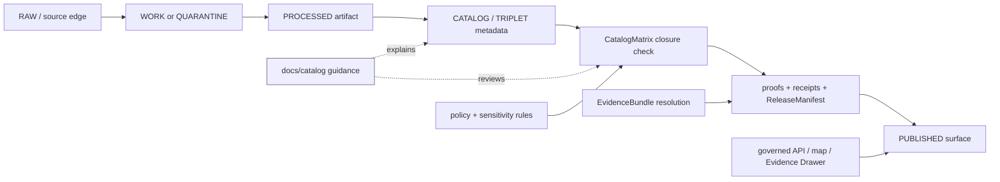

<!-- [KFM_META_BLOCK_V2]
doc_id: kfm://doc/TODO-UUID-docs-catalog-readme
title: Catalog Documentation Hub
type: standard
version: v1
status: draft
owners: TODO: catalog/docs steward
created: 2026-04-27
updated: 2026-04-27
policy_label: TODO-REVIEW-public-or-restricted
related: [../README.md, ../standards/README.md, ../runbooks/README.md, ../../data/catalog/README.md, ../../data/catalog/stac/README.md, ../../data/catalog/dcat/README.md, ../../data/catalog/prov/README.md, ../../schemas/README.md, ../../contracts/README.md, ../../policy/README.md, ../../tools/catalog/README.md]
tags: [kfm, catalog, evidence, provenance, publication, documentation]
notes: [Created from attached KFM doctrine; repo checkout unavailable in this session; verify owner, doc_id, policy label, and adjacent links before publication.]
[/KFM_META_BLOCK_V2] -->

# Catalog Documentation Hub

Orient maintainers to KFM catalog doctrine, catalog-adjacent documentation, and the boundary between documentation guidance and catalog payloads.

> [!IMPORTANT]
> **Status:** experimental · **Document status:** draft · **Owners:** TODO: catalog/docs steward  
> **Path:** `docs/catalog/README.md` · **Repo evidence:** NEEDS VERIFICATION in a mounted checkout  
>
> 
> 
> 
> 
> 
>
> **Quick jumps:** [Scope](#scope) · [Repo fit](#repo-fit) · [Inputs](#accepted-inputs) · [Exclusions](#exclusions) · [Directory tree](#directory-tree) · [Catalog boundary](#catalog-boundary) · [Operating model](#operating-model) · [Definition of done](#definition-of-done) · [FAQ](#faq)

---

## Scope

`docs/catalog/` is the **documentation hub** for how KFM explains and governs catalog behavior.

It is not the catalog store. It should help maintainers understand how catalog documentation relates to source descriptors, catalog triplet closure, proof objects, promotion, public discovery, EvidenceBundle resolution, and map/runtime surfaces.

**CONFIRMED doctrine:** KFM’s catalog posture is downstream of the governed lifecycle:

```text
RAW -> WORK / QUARANTINE -> PROCESSED -> CATALOG / TRIPLET -> PUBLISHED
```

**PROPOSED role for this directory:** keep catalog explanation, review guidance, profile notes, and maintainer-facing checklists close together without turning docs into machine authority.

> [!WARNING]
> Do not use this README to imply that catalog schemas, validators, proof bundles, workflow gates, or emitted artifacts exist. Those claims require mounted repo evidence, checked-in files, tests, workflows, or generated proof objects.

[Back to top](#catalog-documentation-hub)

---

## Repo fit

### Path and adjacency

| Direction | Surface | Role |
|---|---|---|
| This doc | `docs/catalog/README.md` | Human-readable catalog documentation hub. |
| Upstream | [`../README.md`](../README.md) | Documentation landing page and navigation parent. |
| Lateral | [`../standards/README.md`](../standards/README.md) | Standards profiles and external-spec alignment. |
| Lateral | [`../runbooks/README.md`](../runbooks/README.md) | Operational runbooks such as promotion, rollback, or catalog closure. |
| Downstream | [`../../data/catalog/README.md`](../../data/catalog/README.md) | Actual catalog metadata seam, subject to repo verification. |
| Downstream | [`../../data/catalog/stac/README.md`](../../data/catalog/stac/README.md) | STAC lane for spatial-temporal asset metadata. |
| Downstream | [`../../data/catalog/dcat/README.md`](../../data/catalog/dcat/README.md) | DCAT lane for dataset and distribution discovery metadata. |
| Downstream | [`../../data/catalog/prov/README.md`](../../data/catalog/prov/README.md) | PROV lane for lineage and provenance metadata. |
| Authority neighbor | [`../../schemas/README.md`](../../schemas/README.md) | Machine schema home, subject to schema-home ADR and validation. |
| Authority neighbor | [`../../contracts/README.md`](../../contracts/README.md) | Contract/object-family home for KFM trust objects. |
| Authority neighbor | [`../../policy/README.md`](../../policy/README.md) | Rights, sensitivity, release, and fail-closed policy posture. |
| Helper lane | [`../../tools/catalog/README.md`](../../tools/catalog/README.md) | Catalog QA, link checks, closure checks, and reviewer helpers. |

**NEEDS VERIFICATION:** link targets must be checked in the mounted repository before this file is published. If a target does not exist, keep the path as plain text, create the missing landing page, or record the gap in the verification backlog.

### Upstream / downstream rule

`docs/catalog/` explains catalog behavior.  
`data/catalog/` carries catalog records.  
`schemas/` and `contracts/` define machine-checkable shapes.  
`policy/` decides what may be released.  
`data/proofs/`, `data/receipts/`, and release surfaces carry proof, process memory, and publication state.

[Back to top](#catalog-documentation-hub)

---

## Accepted inputs

Put material here when it helps maintainers understand, review, or improve KFM catalog governance.

| Accepted here | Why it belongs |
|---|---|
| Catalog operating model notes | Explains what `CATALOG / TRIPLET` means in KFM without editing machine records. |
| Catalog closure guidance | Helps reviewers decide whether STAC, DCAT, PROV, and CatalogMatrix expectations are complete. |
| STAC / DCAT / PROV relationship notes | Clarifies sibling roles without collapsing them into one generic metadata file. |
| CatalogMatrix explanation | Documents how catalog closure is inspected before release. |
| Reviewer checklists | Keeps promotion and release review consistent. |
| Human-readable examples | Helps contributors understand expected shape, as long as examples are clearly non-production. |
| Crosswalk notes | Maps catalog docs to schemas, contracts, source descriptors, release manifests, EvidenceBundle behavior, and UI payloads. |

[Back to top](#catalog-documentation-hub)

---

## Exclusions

Do not put these in `docs/catalog/`.

| Excluded | Correct home |
|---|---|
| RAW source files, downloads, scraped payloads, or source snapshots | `data/raw/`, `data/work/`, or `data/quarantine/` according to lifecycle state. |
| Processed spatial artifacts, tiles, GeoParquet, COGs, PMTiles, or derived bundles | `data/processed/`, `data/published/`, or release-specific artifact lanes. |
| STAC, DCAT, or PROV production records | `data/catalog/stac/`, `data/catalog/dcat/`, `data/catalog/prov/`. |
| JSON Schemas or machine contract definitions | `schemas/` or `contracts/`, pending schema-home authority. |
| Rego/policy code or policy decision fixtures | `policy/` and policy test fixtures. |
| Run receipts, AI receipts, proof packs, attestations, or release manifests | `data/receipts/`, `data/proofs/`, `release/`, or confirmed repo equivalent. |
| AI-generated summaries pretending to be catalog truth | Governed runtime surfaces only, after EvidenceBundle and policy checks. |
| Sensitive exact-location catalog notes | Restricted docs or policy-controlled records; never public docs by default. |

> [!CAUTION]
> A documentation page may describe catalog closure, but it must not become the closure artifact.

[Back to top](#catalog-documentation-hub)

---

## Directory tree

Current-session repo evidence was not available, so this tree is a **PROPOSED minimum** until verified.

```text
docs/catalog/
└── README.md
```

Potential future additions, only after maintainers confirm repo conventions:

```text
docs/catalog/
├── README.md
├── CATALOG_OPERATING_MODEL.md          # PROPOSED: human-facing catalog doctrine
├── CATALOG_MATRIX.md                   # PROPOSED: CatalogMatrix explanation and review notes
├── STAC_DCAT_PROV_CLOSURE.md           # PROPOSED: triplet relationship guide
├── REVIEW_CHECKLIST.md                 # PROPOSED: pre-promotion catalog review checklist
└── examples/
    └── README.md                       # PROPOSED: clearly non-production examples
```

**Directory rule:** prefer a small number of durable catalog docs over many thin, overlapping pages. Add a new file only when it has a distinct review job.

[Back to top](#catalog-documentation-hub)

---

## Catalog boundary

KFM catalog surfaces are useful because they make evidence and release state inspectable. They are dangerous when treated as sovereign truth.

| Object / surface | KFM role | Must not become |
|---|---|---|
| `SourceDescriptor` | Records source identity, role, rights, cadence, and admissibility posture. | A substitute for source review. |
| `EvidenceBundle` | Resolves evidence references into inspectable support for claims. | Free-form prose or unverifiable summary. |
| `CatalogMatrix` | Checks whether required catalog/proof/release relationships close. | A decorative spreadsheet or optional checklist. |
| STAC | Spatial-temporal asset metadata and discoverability. | Legal release authority by itself. |
| DCAT | Dataset/distribution discovery metadata. | Provenance record by itself. |
| PROV | Lineage/provenance metadata. | Policy decision by itself. |
| `ReleaseManifest` | Defines the release scope and bound artifacts. | A replacement for validation and policy gates. |
| `DecisionEnvelope` | Captures policy/review/runtime decision state. | A generic status string. |
| `CorrectionNotice` | Carries correction, supersession, withdrawal, and rollback lineage. | Silent edits to previously published truth. |

**PROPOSED catalog principle:** a public-facing catalog claim should be able to point backward to evidence and forward to release/correction state.

[Back to top](#catalog-documentation-hub)

---

## Operating model

### Catalog closure path



### Review rhythm

1. **Locate the artifact.** Confirm whether the thing under review is source, work, processed output, catalog metadata, proof, receipt, or published artifact.
2. **Check source role.** Verify source identity, source role, rights, sensitivity, and admissibility before cataloging it as support.
3. **Check triplet closure.** STAC, DCAT, and PROV should agree where they overlap and remain distinct where they carry different responsibilities.
4. **Check proof linkage.** Catalog records should connect to release scope, validation evidence, and provenance.
5. **Check public posture.** Sensitive, restricted, culturally governed, rights-unclear, or exact-location-risk records fail closed.
6. **Record correction path.** Published catalog outputs need rollback or correction lineage before release.

[Back to top](#catalog-documentation-hub)

---

## Quickstart

Use these checks from the repository root after a real checkout is mounted.

> [!NOTE]
> Commands below are non-destructive inspection helpers. They are not proof that validators or workflow gates exist.

```bash
# Inspect catalog documentation and data-catalog surfaces.
find docs/catalog data/catalog -maxdepth 3 -type f 2>/dev/null | sort
```

```bash
# Look for catalog closure and release-related object names.
grep -RInE "CatalogMatrix|ReleaseManifest|EvidenceBundle|CorrectionNotice|STAC|DCAT|PROV" \
  docs data schemas contracts policy tools tests 2>/dev/null | head -120
```

```bash
# Verify sibling catalog lanes are present before relying on links in this README.
for path in \
  data/catalog/README.md \
  data/catalog/stac/README.md \
  data/catalog/dcat/README.md \
  data/catalog/prov/README.md \
  tools/catalog/README.md
do
  test -f "$path" && echo "OK  $path" || echo "TODO $path"
done
```

[Back to top](#catalog-documentation-hub)

---

## Catalog review matrix

| Gate | Pass condition | Failure posture |
|---|---|---|
| Source identity | SourceDescriptor or equivalent source record exists and identifies source role. | HOLD until source identity is resolved. |
| Rights | License, terms, redistribution posture, and attribution are clear enough for the target release. | DENY public release or quarantine. |
| Sensitivity | Restricted, precise, cultural, living-person, rare-species, archaeology, or infrastructure risks are handled. | Fail closed; redact, generalize, restrict, or delay. |
| Spatial / temporal scope | Catalog record states spatial extent, time range, version, and uncertainty where applicable. | HOLD; do not publish as authoritative. |
| Triplet closure | STAC, DCAT, and PROV lanes are present or an explicit exception is recorded. | HOLD; CatalogMatrix remains open. |
| Proof linkage | Catalog entries link to validation results, provenance, release scope, and evidence references. | HOLD; proof bundle incomplete. |
| Release state | ReleaseManifest or equivalent release object binds what is public. | DENY publication as ungoverned. |
| Correction path | CorrectionNotice / rollback procedure exists for published records. | HOLD for consequential public claims. |

[Back to top](#catalog-documentation-hub)

---

## Definition of done

This README is ready to publish when:

- [ ] `doc_id` is replaced with a real UUID-backed KFM document identifier.
- [ ] `owners` names the accountable steward or team.
- [ ] `policy_label` is confirmed.
- [ ] Adjacent links are checked in the mounted repository.
- [ ] The repo has a confirmed answer for whether `docs/catalog/` is a documentation hub, a standards hub, or another local convention.
- [ ] `data/catalog/` sibling surfaces are verified or the missing surfaces are listed in the backlog.
- [ ] Catalog object names match the repo’s current schema/contract vocabulary.
- [ ] The schema-home relationship between `schemas/` and `contracts/` is not contradicted by this README.
- [ ] Any examples added under this directory are clearly labeled illustrative and non-production.
- [ ] A maintainer can use this page to decide what belongs here and what must go elsewhere.

[Back to top](#catalog-documentation-hub)

---

## FAQ

### Is `docs/catalog/` the same as `data/catalog/`?

No. `docs/catalog/` explains catalog doctrine and review expectations. `data/catalog/` is the catalog metadata seam.

### Can this README define catalog schemas?

No. It can point to schemas and explain their purpose, but schema definitions belong in the confirmed schema or contract home.

### Can catalog records be public truth?

Not by themselves. Catalog records help make evidence, provenance, release state, and discovery inspectable. Public truth still depends on evidence, policy, review, validation, release state, and correction lineage.

### What happens when STAC, DCAT, and PROV disagree?

Treat the disagreement as a catalog closure issue. Do not smooth it over in prose. Hold release until the mismatch is corrected, explained, or explicitly accepted by policy/review.

### What if a catalog item is useful but rights or sensitivity are unclear?

Prefer quarantine, restricted access, redaction, generalization, or delayed publication. Record the reason and transformation rather than publishing weakly supported certainty.

[Back to top](#catalog-documentation-hub)

---

<details>
<summary><strong>Appendix: proposed catalog documentation roles</strong></summary>

| Proposed file | Role | Status |
|---|---|---|
| `CATALOG_OPERATING_MODEL.md` | Longer-form catalog doctrine and lifecycle explanation. | PROPOSED |
| `CATALOG_MATRIX.md` | CatalogMatrix field guide and examples. | PROPOSED |
| `STAC_DCAT_PROV_CLOSURE.md` | Explains sibling metadata lanes and closure expectations. | PROPOSED |
| `REVIEW_CHECKLIST.md` | Human review checklist for catalog readiness. | PROPOSED |
| `examples/README.md` | Rules for illustrative catalog examples. | PROPOSED |

Add these only if they reduce confusion. Do not create files just to satisfy a tidy tree.

</details>

<details>
<summary><strong>Appendix: maintainer verification backlog</strong></summary>

| Item | Why it matters |
|---|---|
| Confirm whether `docs/catalog/` already exists. | Avoid overwriting established local convention. |
| Confirm current `data/catalog/` structure. | Prevent broken links and wrong sibling assumptions. |
| Confirm current schema home. | Avoid `schemas/` vs `contracts/` drift. |
| Confirm catalog validators. | Avoid documenting enforcement that does not exist. |
| Confirm proof, receipt, and release object locations. | Keep process memory, proof, and release state separate. |
| Confirm owners/CODEOWNERS. | Make review responsibility real. |
| Confirm publication policy for catalog docs. | Keep sensitive or restricted guidance out of public docs. |

</details>
