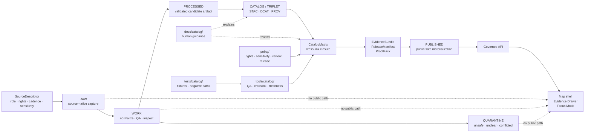

<!-- [KFM_META_BLOCK_V2]
doc_id: kfm://doc/TODO-UUID-docs-catalog-readme
title: Catalog Documentation Hub
type: standard
version: v1
status: draft
owners: @bartytime4life (CODEOWNERS NEEDS VERIFICATION)
created: 2026-04-27
updated: 2026-05-06
policy_label: NEEDS_VERIFICATION
related: [../README.md, ./stac/README.md, ./dcat/README.md, ../standards/KFM_STAC_PROFILE.md, ../standards/KFM_DCAT_PROFILE.md, ../standards/KFM_PROV_PROFILE.md, ../adr/ADR-0001-schema-home.md, ../../data/catalog/README.md, ../../data/catalog/stac/README.md, ../../data/catalog/dcat/README.md, ../../data/catalog/prov/README.md, ../../tools/catalog/README.md, ../../tests/catalog/README.md, ../../contracts/README.md, ../../schemas/README.md, ../../policy/README.md]
tags: [kfm, catalog, docs, stac, dcat, prov, catalog-closure, evidence, publication, governance]
notes: [doc_id remains a placeholder from the prior README and requires KFM document registration; created date is preserved from the existing README and should be verified against repo history; updated reflects this proposed revision date, not commit evidence; owner and policy_label require CODEOWNERS and policy review; docs/catalog/prov/README.md is intentionally not linked as an existing path because it was not found during connector inspection.]
[/KFM_META_BLOCK_V2] -->

<a id="top"></a>

# Catalog Documentation Hub

Human-facing catalog documentation for KFM’s STAC, DCAT, PROV, catalog-closure, proof-linkage, and release-discovery posture.

> [!IMPORTANT]
> **Status:** experimental · **Document state:** draft · **Owners:** `@bartytime4life` + `CODEOWNERS NEEDS VERIFICATION`  
> **Path:** `docs/catalog/README.md`  
> **Repo fit:** documentation hub for catalog doctrine and review guidance; payload-bearing catalog records belong under `data/catalog/`.  
> **Authority:** human-facing guidance; not a schema, policy gate, proof pack, receipt, release manifest, catalog generator, or publication action.  
> **Quick jumps:** [Scope](#scope) · [Repo fit](#repo-fit) · [Accepted inputs](#accepted-inputs) · [Exclusions](#exclusions) · [Directory tree](#directory-tree) · [Operating model](#operating-model) · [Catalog boundary](#catalog-boundary) · [Quickstart](#quickstart) · [Review gates](#review-gates) · [Definition of done](#definition-of-done) · [FAQ](#faq)

<p align="center">
  
  
  
  
  
  
  
</p>

> [!CAUTION]
> Catalog documentation can explain closure. It must not become closure.
>
> In KFM:
>
> **metadata ≠ evidence ≠ receipt ≠ proof ≠ policy ≠ release ≠ publication**

---

## Scope

`docs/catalog/` is the **human-readable catalog documentation hub**.

It explains how KFM uses catalog-facing documentation to keep STAC, DCAT, PROV, catalog closure, release discovery, lineage, proof linkage, EvidenceBundle resolution, policy state, correction lineage, and rollback expectations visible to maintainers and reviewers.

This directory is in scope for:

- catalog doctrine and operating guidance;
- STAC, DCAT, and PROV documentation navigation;
- crosswalks between catalog docs and `data/catalog/`;
- review checklists for catalog closure and public discovery;
- reminders about rights, sensitivity, policy, proof, release, correction, and rollback;
- examples that are explicitly marked illustrative or fixture-bound;
- open verification notes that prevent documentation from overstating implementation maturity.

This directory is not in scope for:

- emitted STAC, DCAT, or PROV payloads;
- canonical processed artifacts;
- proof packs or release manifests;
- schemas or semantic contracts;
- policy-as-code;
- receipts or runtime logs;
- generated AI summaries;
- direct public publication.

**Working rule:** this directory may describe KFM catalog trust, but the trust-bearing objects remain in their own responsibility roots.

[Back to top](#top)

---

## Repo fit

### Path and adjacency

| Relationship | Surface | Status | Role |
| --- | --- | ---: | --- |
| This README | `docs/catalog/README.md` | **CONFIRMED path / revised content PROPOSED** | Human-facing catalog documentation hub. |
| Parent docs lane | [`../README.md`](../README.md) | **CONFIRMED path** | Documentation root / local docs landing page. |
| Root project posture | [`../../README.md`](../../README.md) | **CONFIRMED path** | Project identity, lifecycle law, responsibility roots, and trust posture. |
| STAC docs child | [`./stac/README.md`](./stac/README.md) | **CONFIRMED path** | STAC profile, review, and validation guidance. |
| DCAT docs child | [`./dcat/README.md`](./dcat/README.md) | **CONFIRMED path** | DCAT dataset/distribution documentation guidance. |
| PROV docs child | `./prov/README.md` | **NEEDS VERIFICATION / not found during connector inspection** | Add only if the documentation control plane needs a PROV-specific docs lane. |
| STAC standard profile | [`../standards/KFM_STAC_PROFILE.md`](../standards/KFM_STAC_PROFILE.md) | **CONFIRMED by adjacent docs / verify content before editing** | STAC profile authority. |
| DCAT standard profile | [`../standards/KFM_DCAT_PROFILE.md`](../standards/KFM_DCAT_PROFILE.md) | **CONFIRMED by adjacent docs / verify content before editing** | DCAT profile authority. |
| PROV standard profile | [`../standards/KFM_PROV_PROFILE.md`](../standards/KFM_PROV_PROFILE.md) | **CONFIRMED by adjacent docs / verify content before editing** | PROV profile authority. |
| Schema-home ADR | [`../adr/ADR-0001-schema-home.md`](../adr/ADR-0001-schema-home.md) | **CONFIRMED path / decision still proposed** | Records schema-home split and acceptance burden. |
| Catalog data seam | [`../../data/catalog/README.md`](../../data/catalog/README.md) | **CONFIRMED path** | Payload-bearing catalog metadata seam. |
| STAC data lane | [`../../data/catalog/stac/README.md`](../../data/catalog/stac/README.md) | **CONFIRMED path** | STAC Catalog / Collection / Item data-catalog surface. |
| DCAT data lane | [`../../data/catalog/dcat/README.md`](../../data/catalog/dcat/README.md) | **CONFIRMED path** | DCAT dataset/distribution data-catalog surface. |
| PROV data lane | [`../../data/catalog/prov/README.md`](../../data/catalog/prov/README.md) | **CONFIRMED path** | Catalog-facing provenance lane. |
| Semantic contracts | [`../../contracts/README.md`](../../contracts/README.md) | **CONFIRMED path** | Object meaning, lifecycle semantics, and compatibility expectations. |
| Machine schemas | [`../../schemas/README.md`](../../schemas/README.md) | **CONFIRMED path / authority still review-gated** | Machine-checkable shape and schema placement. |
| Policy surface | [`../../policy/README.md`](../../policy/README.md) | **CONFIRMED path** | Rights, sensitivity, review, release, correction, and runtime admissibility. |
| Catalog tools | [`../../tools/catalog/README.md`](../../tools/catalog/README.md) | **CONFIRMED path** | Catalog QA, cross-link checks, freshness/report helpers. |
| Catalog tests | [`../../tests/catalog/README.md`](../../tests/catalog/README.md) | **CONFIRMED path** | Deterministic tests for catalog helper behavior. |

### Responsibility split

| Responsibility | Correct KFM surface | Boundary rule |
| --- | --- | --- |
| Human explanation | `docs/catalog/` | Explain posture, review, and closure expectations. |
| Catalog payloads | `data/catalog/{stac,dcat,prov}/` | Store outward metadata records, not prose-only doctrine. |
| Machine shape | `schemas/` or accepted schema home | Validate object structure; do not decide policy. |
| Object meaning | `contracts/` | Define semantics and compatibility; do not store instances. |
| Policy decisions | `policy/` | Decide allow, deny, restrict, hold, abstain, or error. |
| Helper behavior | `tools/catalog/` | Inspect catalog closure; do not own metadata truth. |
| Test proof | `tests/catalog/` | Prove helper behavior with fixtures; do not become catalog authority. |
| Receipts and proofs | `data/receipts/`, `data/proofs/`, `release/` | Preserve process memory, release proof, and publication state separately. |

> [!TIP]
> Keep the hub boring and navigable. Catalog complexity belongs in profiles, payload lanes, helpers, tests, proof objects, and release records—not in a single overloaded README.

[Back to top](#top)

---

## Accepted inputs

Put material in `docs/catalog/` when it helps maintainers understand or review KFM catalog posture without becoming a machine authority.

| Accepted input | Why it belongs here |
| --- | --- |
| Catalog operating guidance | Explains how catalog documentation participates in KFM’s governed lifecycle. |
| STAC/DCAT/PROV overview notes | Helps readers understand the catalog triplet without collapsing sibling roles. |
| Catalog closure guidance | Defines what reviewers should inspect before public discovery or release. |
| Crosswalk tables | Maps documentation, data-catalog records, schemas, contracts, policy, tools, tests, and release objects. |
| Review checklists | Gives maintainers repeatable gates for metadata, evidence, policy, release, and rollback review. |
| Link-health and verification notes | Keeps known unknowns visible instead of smoothing them into false certainty. |
| Illustrative snippets | Useful only when labeled `illustrative`, `fixture`, `generated`, or `release-bearing`. |
| Future docs proposals | Allowed when they identify a distinct review job and avoid duplicating standards/profile docs. |

### Example-status rule

Any example added under this docs lane must declare one of these statuses:

| Status | Meaning |
| --- | --- |
| `illustrative` | Shows intent only; not a fixture or release artifact. |
| `fixture` | Used by tests; must name the validator/test and expected outcome. |
| `generated` | Produced by a repo tool; must name generator, inputs, and receipt/report. |
| `release-bearing` | Part of release or public discovery; should usually live outside `docs/catalog/`. |

[Back to top](#top)

---

## Exclusions

Do **not** put these in `docs/catalog/`.

| Excluded | Correct home | Why |
| --- | --- | --- |
| STAC, DCAT, or PROV production records | `data/catalog/{stac,dcat,prov}/` | Payload-bearing catalog metadata belongs in the data catalog seam. |
| RAW source payloads or source snapshots | `data/raw/` | RAW preserves source-native capture. |
| WORK or QUARANTINE material | `data/work/`, `data/quarantine/` | Unresolved material must not become discoverable by documentation. |
| Processed artifacts, tiles, GeoParquet, COGs, PMTiles, packages | `data/processed/`, `data/published/`, release artifact lanes | Catalog docs may explain them; they do not store them. |
| Source descriptors or source activation records | `data/registry/`, `contracts/`, `schemas/`, or confirmed source registry home | Source authority and source-role records stay upstream. |
| JSON Schema or semantic contract definitions | `schemas/`, `contracts/` | Documentation may link to these, not define them as hidden authority. |
| Rego/policy code and policy fixtures | `policy/`, `tests/policy/` | Policy decisions must remain executable and reviewable. |
| Run receipts, validation receipts, AI receipts | `data/receipts/` or confirmed receipt home | Receipts are process memory, not catalog guidance. |
| EvidenceBundles, proof packs, attestations, CatalogMatrix objects | `data/proofs/`, `release/`, or confirmed proof/release home | Proof and release state stay first-class. |
| Runtime API envelopes, Evidence Drawer payloads, Focus Mode answers | Governed API / app / runtime contract surfaces | Runtime outputs consume catalog closure; they do not live as catalog docs. |
| Direct model output or AI-generated catalog truth | Governed AI surfaces with evidence, policy, and citation validation | AI is interpretive only. |
| Sensitive exact-location instructions or restricted catalog details | Restricted docs or policy-controlled lanes | Public documentation can leak sensitive locations or steward constraints. |

> [!WARNING]
> “Metadata-only” does not mean “risk-free.” Catalog metadata can expose sensitive extent, source identity, access posture, embargo status, exact locations, or unpublished release intent.

[Back to top](#top)

---

## Directory tree

### Confirmed current documentation shape

```text
docs/
└── catalog/
    ├── README.md
    ├── dcat/
    │   └── README.md
    └── stac/
        └── README.md
```

`docs/catalog/prov/README.md` was not found during connector inspection. Keep PROV payload and profile links pointing to the confirmed `data/catalog/prov/` and standards/profile surfaces unless a reviewed PR adds a docs-specific PROV lane.

### Confirmed adjacent data-catalog shape

```text
data/
└── catalog/
    ├── README.md
    ├── dcat/
    │   └── README.md
    ├── prov/
    │   └── README.md
    └── stac/
        └── README.md
```

### Proposed documentation growth shape

Add these only if they reduce review friction and do not duplicate the STAC, DCAT, PROV, standards, data-catalog, or tooling lanes.

```text
docs/catalog/
├── README.md
├── dcat/
│   └── README.md
├── stac/
│   └── README.md
├── prov/
│   └── README.md                       # PROPOSED / NEEDS VERIFICATION
├── CATALOG_CLOSURE_REVIEW.md           # PROPOSED: human review checklist
├── CATALOG_TRIPLET_CROSSWALK.md        # PROPOSED: docs/data/tools/tests mapping
└── examples/
    └── README.md                       # PROPOSED: example-status rules only
```

[Back to top](#top)

---

## Operating model

KFM catalog documentation sits at the explanatory edge of the `CATALOG / TRIPLET` stage. It should help reviewers inspect closure without becoming the closure object.



### Operating rhythm

1. **Identify the subject.** Is the change about a dataset, asset, release candidate, published artifact, correction, or documentation-only clarification?
2. **Find the real home.** Keep documentation, catalog payloads, schemas, policy, tools, tests, receipts, proofs, and release records separate.
3. **Check triplet closure.** STAC, DCAT, and PROV should agree on subject, version, release references, and artifact identity where they overlap.
4. **Check evidence and proof.** Public-facing catalog claims should resolve to EvidenceBundle, ReleaseManifest, proof, review, and rollback support where release-significant.
5. **Check public posture.** Unknown rights, unknown sensitivity, restricted geometry, cultural/archaeological risks, rare-species locations, infrastructure sensitivity, living-person data, and direct model output fail closed.
6. **Record gaps.** Use `NEEDS VERIFICATION` rather than making docs sound more mature than the repo evidence.

[Back to top](#top)

---

## Catalog boundary

### Catalog triplet roles

| Surface | Primary question | KFM role | Must not become |
| --- | --- | --- | --- |
| STAC | What spatial/temporal asset, item, or collection is discoverable? | Asset and item discovery, especially for map/timeline-facing material. | Release approval, proof bundle, or source authority. |
| DCAT | What dataset or distribution can be discovered and accessed? | Dataset/distribution discovery, rights/access cues, publisher-facing metadata. | Policy decision, legal review, or canonical payload. |
| PROV | How was the artifact generated, changed, or corrected? | Lineage, activity, agent, derivation, and provenance traceability. | EvidenceBundle, proof pack, or unrestricted raw lineage dump. |
| CatalogMatrix | Do the catalog records close over the same release candidate? | Cross-surface identity, version, release-ref, and checksum alignment. | Decorative checklist or title-matching exercise. |
| EvidenceBundle | What evidence supports the consequential claim? | Resolved evidence and source-role support. | Generated prose or loose citation string. |
| ReleaseManifest | What is in the release and what rollback target exists? | Release scope, artifact bindings, digests, and rollback lineage. | Catalog record or file move. |
| Receipt | What process ran and what did it produce? | Process memory and audit trail. | Proof of truth by itself. |
| ProofPack | What validates release-grade trust? | Release-grade validation and integrity evidence. | Log dump or narrative assurance. |
| CorrectionNotice | What was superseded, withdrawn, corrected, or rolled back? | Visible correction and public trust repair. | Silent edit. |

### KFM catalog principle

A public-facing catalog record should be able to point:

```text
backward -> source identity + evidence + provenance + receipts
sideways -> STAC + DCAT + PROV closure
forward  -> release state + public-safe artifact + correction / rollback path
```

[Back to top](#top)

---

## Quickstart

Run these from the repository root after mounting a real checkout.

> [!NOTE]
> These commands inspect files and helper behavior. They do not prove release readiness unless their outputs are reviewed with policy, proof, release, and rollback evidence.

### 1. Inspect catalog docs and payload lanes

```bash
git status --short
git branch --show-current || true

find docs/catalog data/catalog -maxdepth 4 -type f | sort
```

### 2. Reopen the catalog documentation set

```bash
sed -n '1,260p' docs/catalog/README.md
sed -n '1,260p' docs/catalog/stac/README.md
sed -n '1,260p' docs/catalog/dcat/README.md

test -f docs/catalog/prov/README.md && \
  sed -n '1,260p' docs/catalog/prov/README.md || \
  echo "NEEDS VERIFICATION: docs/catalog/prov/README.md not present"
```

### 3. Reopen the data-catalog seam

```bash
sed -n '1,260p' data/catalog/README.md
sed -n '1,260p' data/catalog/stac/README.md
sed -n '1,260p' data/catalog/dcat/README.md
sed -n '1,260p' data/catalog/prov/README.md
```

### 4. Check catalog helper reality

```bash
find tools/catalog tests/catalog -maxdepth 4 -type f | sort

python tools/catalog/catalog_crosslink.py \
  --decision tests/catalog/fixtures/aligned-decision.json \
  --record tests/catalog/fixtures/aligned-record.json \
  --output /tmp/catalog-crosslink-report.json
```

### 5. Run catalog helper tests when the checkout has test dependencies

```bash
pytest -q tests/catalog/test_catalog_crosslink.py tests/catalog/test_catalog_record_helpers.py
```

### 6. Search before inventing names

```bash
git grep -nE \
  'CatalogMatrix|CatalogClosure|STAC|DCAT|PROV|EvidenceBundle|ReleaseManifest|CorrectionNotice|catalog_crosslink|release_ref|subject_id|version_alignment' \
  -- docs data tools tests contracts schemas policy release apps packages .github 2>/dev/null || true
```

> [!CAUTION]
> Do not report tests, validators, workflows, or policy gates as passing unless they actually ran on the current checkout and the result is preserved in the PR, receipt, workflow output, or validation report.

[Back to top](#top)

---

## Review gates

Use these gates for changes to `docs/catalog/`, `data/catalog/`, catalog helpers, or catalog-adjacent release docs.

| Gate | Pass condition | Fail-closed posture |
| --- | --- | --- |
| Documentation home | Guidance stays in `docs/catalog/`; payloads stay in `data/catalog/`. | Move or hold the change. |
| Source identity | Source role, rights, cadence, and sensitivity are known for release-significant catalog claims. | `HOLD` / `DENY` public discovery. |
| Triplet presence | STAC, DCAT, and PROV references exist or an explicit exception is recorded. | Hold catalog closure. |
| Subject alignment | STAC, DCAT, and PROV describe the same subject where a release triplet is claimed. | Block release or require correction. |
| Version alignment | Catalog records agree on version and release family. | Block release or require correction. |
| Release-ref alignment | Catalog records align with ReleaseManifest or release candidate ref. | Block publication. |
| Evidence linkage | Consequential catalog-facing claims resolve to EvidenceBundle support. | `ABSTAIN` or hold. |
| Rights and access | License, terms, redistribution, access, and attribution posture match intended audience. | `DENY` public release. |
| Sensitivity | Exact sensitive locations, cultural material, living-person data, rare species, infrastructure, and restricted steward material are handled safely. | Redact, generalize, restrict, embargo, or deny. |
| Proof linkage | Catalog references connect to validation/proof surfaces when release-significant. | Hold release. |
| Correction path | Supersession, withdrawal, replacement, rollback, or correction lineage is visible. | Hold public-facing change. |
| Helper behavior | `tools/catalog/` checks are tested with positive and negative fixtures. | Keep helper experimental; do not claim enforcement. |

[Back to top](#top)

---

## Definition of done

### This README is ready for review when

- [ ] KFM Meta Block V2 remains present and synchronized with the visible title.
- [ ] `doc_id` is registered or intentionally left as a reviewable placeholder.
- [ ] `owners` are confirmed against CODEOWNERS or governance records.
- [ ] `policy_label` is confirmed.
- [ ] Relative links are checked from `docs/catalog/README.md`.
- [ ] The README clearly separates docs, payloads, schemas, contracts, policy, tools, tests, receipts, proofs, and release state.
- [ ] `docs/catalog/prov/README.md` is not described as existing unless it is added or verified.
- [ ] Any implementation claim is backed by inspected repo files, command output, workflow output, tests, or generated artifacts.
- [ ] Schema-home language respects ADR-0001’s proposed status and does not silently settle `contracts/` versus `schemas/`.
- [ ] Catalog helper commands match the current helper signatures.
- [ ] The file does not imply STAC, DCAT, or PROV validity equals publication readiness.
- [ ] Rollback and correction expectations remain visible.

### A catalog-change PR is closer to done when

- [ ] Catalog subject identity is stable.
- [ ] STAC, DCAT, and PROV records align on subject, version, and release reference.
- [ ] Artifact digests or checksums align where release significance requires them.
- [ ] Rights, access, sensitivity, review state, and policy label are visible.
- [ ] EvidenceRef resolves to EvidenceBundle or the candidate abstains from consequential claims.
- [ ] ReleaseManifest, proof, receipt, and correction references resolve where required.
- [ ] Public clients do not receive RAW, WORK, QUARANTINE, unreleased candidates, internal canonical stores, private source details, or direct model outputs.
- [ ] Negative-path tests cover missing refs, mismatched subject/version/release refs, and unsafe public exposure.
- [ ] Rollback target or correction path is recorded before public exposure.

[Back to top](#top)

---

## Rollback and correction

Rollback this README revision if it:

- breaks existing anchors used by adjacent docs;
- implies `docs/catalog/` is the payload or proof lane;
- claims validator, CI, workflow, release, public API, or runtime maturity without evidence;
- silently adds `docs/catalog/prov/` as an existing path;
- hides schema-home uncertainty;
- weakens deny-by-default catalog exposure;
- merges receipts, proofs, catalog records, and publication state into one concept.

Rollback target: `ROLLBACK_TARGET_NEEDS_VERIFICATION_AFTER_BRANCH_REVIEW`

| Trigger | Corrective action |
| --- | --- |
| Link target is missing | Mark `NEEDS VERIFICATION`, fix the relative link, or add the target through a reviewed PR. |
| Adjacent docs contradict this hub | Reconcile the hub and child README in the same PR. |
| Schema-home ADR changes | Update all `contracts/` / `schemas/` language and add a migration note. |
| Catalog helper interface changes | Update Quickstart and tests together. |
| Sensitive catalog guidance is too public | Move details to restricted documentation and leave only safe public posture here. |
| Catalog object names change | Add compatibility notes rather than silently renaming. |

[Back to top](#top)

---

## FAQ

### Is `docs/catalog/` the same as `data/catalog/`?

No. `docs/catalog/` explains catalog posture. `data/catalog/` carries catalog metadata records.

### Does a STAC, DCAT, or PROV record make something published?

No. Catalog records support discovery and closure. Publication requires governed validation, policy, review, proof, release, correction, and rollback state.

### Why keep STAC, DCAT, and PROV separate?

They carry different burdens. STAC is strongest for spatiotemporal assets, DCAT for datasets/distributions, and PROV for lineage/activity/agent relationships. KFM cross-links them instead of flattening them.

### What if STAC, DCAT, and PROV disagree?

Treat the disagreement as a catalog-closure failure. Hold release until the mismatch is fixed, explicitly excepted, or escalated for review.

### Can Focus Mode answer from catalog records alone?

No. Focus Mode may use catalog metadata as context only through governed runtime flow. EvidenceBundle, policy, review, and release state outrank catalog prose and model language.

### Can AI generate catalog documentation?

AI may draft documentation only as an interpretive helper. It cannot create authoritative catalog truth, policy decisions, proof, release approval, or evidence support without governed validation and review.

### What should happen when rights or sensitivity are unclear?

Fail closed. Hold, deny, restrict, generalize, redact, embargo, quarantine, or route to steward review. Record the reason rather than publishing uncertainty as confidence.

[Back to top](#top)

---

## Appendix

<details>
<summary><strong>Proposed future docs</strong></summary>

| Proposed file | Role | Status |
| --- | --- | --- |
| `docs/catalog/prov/README.md` | PROV-specific documentation lane if the hub needs symmetry with STAC and DCAT docs. | **PROPOSED / NEEDS VERIFICATION** |
| `CATALOG_CLOSURE_REVIEW.md` | Reviewer checklist for triplet closure and release-discovery readiness. | **PROPOSED** |
| `CATALOG_TRIPLET_CROSSWALK.md` | Crosswalk across STAC, DCAT, PROV, ReleaseManifest, EvidenceBundle, proof, tools, and tests. | **PROPOSED** |
| `examples/README.md` | Rules for illustrative, fixture, generated, and release-bearing examples. | **PROPOSED** |

Do not create these files merely for symmetry. Add them only when they reduce review ambiguity.

</details>

<details>
<summary><strong>Anti-patterns to reject</strong></summary>

- Treating STAC as proof that a release was approved.
- Treating DCAT as rights review.
- Treating PROV as EvidenceBundle.
- Treating catalog helper output as policy approval.
- Publishing discovery metadata for RAW, WORK, QUARANTINE, or unreleased candidates.
- Using a README table as a release manifest.
- Hiding checksum drift behind regenerated timestamps.
- Claiming CI enforcement from workflow presence alone.
- Letting generated AI prose become catalog evidence.
- Publishing exact sensitive geometry because it appears only in “metadata.”

</details>

<details>
<summary><strong>Maintainer verification backlog</strong></summary>

| Item | Why it matters |
| --- | --- |
| Register `doc_id` | Keeps documentation discoverable and auditable. |
| Confirm CODEOWNERS | Makes review responsibility real. |
| Confirm `policy_label` | Prevents accidental public exposure of restricted guidance. |
| Verify `created` / `updated` dates | Keeps metadata honest. |
| Confirm link health | Prevents broken navigation and stale adjacency. |
| Decide whether `docs/catalog/prov/` is needed | Avoids symmetry-driven sprawl. |
| Confirm schema-home acceptance status | Prevents `contracts/` / `schemas/` drift. |
| Confirm catalog helper tests on current checkout | Separates file presence from passing behavior. |
| Confirm workflow/CI enforcement | Avoids claiming merge-blocking gates without proof. |
| Confirm emitted catalog payload inventory | Keeps docs from inventing implementation depth. |
| Confirm release/proof/correction object homes | Maintains receipt/proof/catalog/publication separation. |

</details>

[Back to top](#top)
