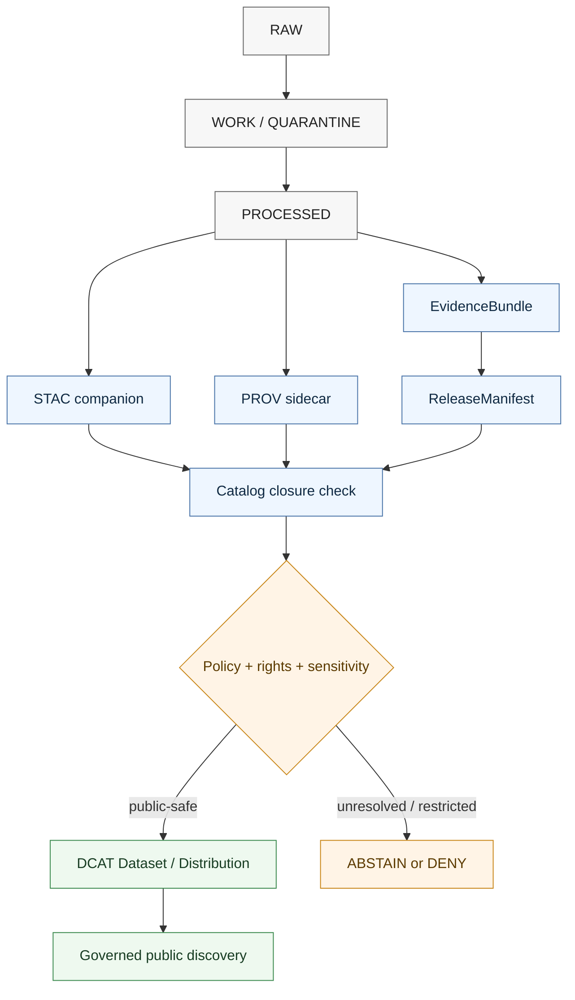

<!-- [KFM_META_BLOCK_V2]
doc_id: kfm://doc/TODO-NEEDS-UUID
title: KFM DCAT Export Profile
type: standard
version: v1
status: draft
owners: TODO
created: TODO
updated: 2026-04-27
policy_label: public
related: [
  docs/adr/ADR-PROV-STAC-DCAT-CATALOG-MAPPING.md,
  docs/catalog/stac/KFM_STAC_EXTENSION_PROFILE.md,
  contracts/v1/provenance/kfm_prov_sidecar.schema.json
]
tags: [kfm, dcat, catalog, provenance, rights, access-rights, evidence]
notes: [Defines KFM DCAT export rules for public-safe dataset discovery and rights propagation. doc_id, owners, and created remain TODO until repository history/ownership are verified.]
[/KFM_META_BLOCK_V2] -->

<a id="top"></a>

# KFM DCAT Export Profile

Public-safe DCAT export rules for KFM datasets, distributions, rights, provenance, release closure, and access posture.

> **Status:** draft standard  
> **Target path:** `docs/catalog/dcat/KFM_DCAT_EXPORT_PROFILE.md`  
> **Truth posture:** **CONFIRMED** source-draft doctrine / **PROPOSED** validation contract / **UNKNOWN** current mounted-repo enforcement  
> **Quick links:** [Scope](#scope) · [Repo fit](#repo-fit) · [Export flow](#export-flow) · [Field requirements](#field-requirements) · [Rules](#rules) · [Examples](#examples) · [Validation](#validation-checklist) · [Open verification](#open-verification-items)

> [!IMPORTANT]
> DCAT is a **public discovery/export layer**. It is not the KFM source of truth, not a substitute for STAC asset records, not a substitute for PROV lineage, and not an authorization bypass. Public-facing records must remain downstream of evidence, policy, review, release, rights, and sensitivity gates.

---

## Scope

This profile defines how KFM exports public catalog records into **DCAT-compatible** JSON-LD without losing the project’s trust boundaries:

- license posture
- access-rights posture
- provenance links
- `EvidenceBundle` lineage
- release manifest closure
- correction and supersession lineage
- sensitivity and geoprivacy constraints

A DCAT record is valid only when it describes **public-safe released or release-candidate scope** and can be traced back to governed KFM evidence.

### Non-goals

This profile does **not** define:

- canonical storage for datasets,
- STAC item/asset semantics,
- PROV sidecar schema internals,
- raw ingest or quarantine behavior,
- reviewer workflow internals,
- runtime answer envelopes,
- or AI interpretation rules beyond the DCAT export boundary.

[Back to top](#top)

---

## Repo fit

| Concern | Expected KFM surface | Role |
| --- | --- | --- |
| This profile | `docs/catalog/dcat/KFM_DCAT_EXPORT_PROFILE.md` | Human-readable normative export rules. |
| STAC profile | `docs/catalog/stac/KFM_STAC_EXTENSION_PROFILE.md` | Spatial/temporal asset and item discovery companion. |
| PROV sidecar schema | `contracts/v1/provenance/kfm_prov_sidecar.schema.json` | Machine-readable provenance validation target. |
| DCAT payloads | `data/catalog/dcat/` or branch-specific catalog output path | Public-safe dataset/distribution records. |
| Release closure | release manifest / proof pack / catalog matrix surfaces | Proof that DCAT, STAC, PROV, evidence, rights, and public artifacts agree. |

> [!NOTE]
> Path placement and validator entrypoints are **NEEDS VERIFICATION** until checked against the mounted repository branch. This document preserves the supplied target path and related links, but it does not claim current CI or runtime enforcement.

### Accepted inputs

A DCAT export may be emitted from records that have all of the following:

- resolved `EvidenceBundle`,
- resolved release manifest reference,
- resolved provenance sidecar,
- known license and rights posture,
- public-safe access posture,
- review state sufficient for public discovery,
- and public-safe distribution targets.

### Exclusions

Do not export DCAT records that contain or point to:

- `RAW`, `WORK`, or `QUARANTINE` material,
- restricted, denied, unknown, or TODO access posture,
- unresolved rights or license terms,
- exact sensitive geometry without a required redaction receipt,
- unpublished candidate data presented as released truth,
- direct model output without evidence and AI receipt linkage,
- or any distribution endpoint that is not public-safe.

[Back to top](#top)

---

## Export flow



The flow is intentionally asymmetric: DCAT receives released evidence and catalog closure; it does not create them.

[Back to top](#top)

---

## Core mapping

| KFM object or concept | DCAT / DCT carrier | Requirement |
| --- | --- | --- |
| Published dataset | `dcat:Dataset` | Required. |
| Public artifact or service | `dcat:Distribution` / `dcat:DataService` where applicable | At least one public-safe distribution is required for a published export. |
| License | `dct:license` | Required; must not be `TODO` or unknown. |
| Access posture | `dct:accessRights` | Required; must be public-safe. |
| Evidence reference | `dct:source` and/or `kfm:evidence_ref` | Required through KFM extension field. |
| Provenance sidecar | `dct:provenance` | Required and resolvable. |
| Release manifest | `kfm:release_manifest_ref` | Required. |
| Correction lineage | `dct:isReplacedBy` / `dct:replaces` | Required when the record is superseded or replaces another record. |
| AI interpretation receipt | `kfm:ai_receipt_ref` | Conditional; required when AI contributed interpretation to the exported description. |
| Redaction receipt | `kfm:redaction_receipt_ref` | Conditional; required after geoprivacy or sensitivity transform. |

[Back to top](#top)

---

## Field requirements

### Required dataset fields

| Field | Required | Description | Export check |
| --- | --- | --- | --- |
| `@context` | yes | JSON-LD context containing `dcat`, `dct`, and `kfm` prefixes. | Must parse as JSON-LD context. |
| `@type` | yes | Must be `dcat:Dataset`. | Exact value required. |
| `@id` | recommended | Stable dataset IRI or KFM identifier. | Strongly preferred for cross-record linking. |
| `dct:title` | yes | Human-readable dataset title. | Must be non-empty. |
| `dct:identifier` | yes | Stable KFM dataset identifier. | Must be non-empty and stable across rebuilds for the same dataset identity. |
| `dct:license` | yes | License URI or JSON-LD `@id` object. | Must be known and resolvable enough for release review. |
| `dct:accessRights` | yes | Access-rights URI or controlled value. | Must be public-safe. |
| `dct:provenance` | yes | PROV sidecar reference. | Must resolve and validate. |
| `dcat:distribution` | yes | Public-safe distribution list. | Must contain at least one public-safe distribution. |

### Required KFM extension fields

| Field | Required | Description | Export check |
| --- | --- | --- | --- |
| `kfm:spec_hash` | yes | Deterministic identity / export-spec hash. | Must match the expected hash format, typically `sha256:<64 hex chars>`. |
| `kfm:evidence_ref` | yes | `EvidenceBundle` reference. | Must resolve before public export. |
| `kfm:release_manifest_ref` | yes | Release manifest reference. | Must resolve before public export. |
| `kfm:policy_label` | yes | Publication policy label. | Must be `public` for published DCAT export. |
| `kfm:review_state` | yes | Review state at export. | Must not be `TODO`, `unknown`, or unresolved. Exact enum is **NEEDS VERIFICATION** against the machine contract. |
| `kfm:source_role` | yes | Source role used for the exported claim or dataset. | Must not be unknown where source authority matters. |
| `kfm:redaction_receipt_ref` | conditional | Required after geoprivacy or sensitivity transform. | Must resolve when transform occurred. |
| `kfm:ai_receipt_ref` | conditional | Required when AI contributed interpretation. | Must resolve when AI contributed text or interpretation. |

### Required distribution fields

| Field | Required | Description | Export check |
| --- | --- | --- | --- |
| `@type` | yes | Must be `dcat:Distribution`. | Exact value required. |
| `dcat:accessURL` | yes | Public-safe artifact URL, landing page, service endpoint, or mediated access point. | Must not point to `RAW`, `WORK`, `QUARANTINE`, restricted stores, or internal-only paths. |
| `dcat:downloadURL` | conditional | Direct downloadable artifact URL. | Use only when the target is actually downloadable. |
| `dct:license` | yes | Distribution license URI. | Must be known; conflicts with dataset license require review. |
| `dcat:mediaType` | recommended | Media type for the distribution. | Prefer when media type is known. |
| `dct:format` | recommended | Format label or URI. | Use when helpful for discovery or older consumers. |
| `dct:conformsTo` | recommended | STAC / schema / profile reference. | Strongly recommended for validator and consumer clarity. |

> [!TIP]
> Use `dcat:downloadURL` for a direct file download. Use `dcat:accessURL` for a landing page, service, API endpoint, viewer, or mediated access surface.

[Back to top](#top)

---

## Allowed publication values

`kfm:policy_label` **MUST** be:

```text
public
```

The following values **MUST NOT** appear in a published DCAT export:

```text
restricted
deny
TODO
unknown
```

`dct:accessRights` must also be public-safe. A record with a public `kfm:policy_label` but restricted or unknown `dct:accessRights` is invalid.

[Back to top](#top)

---

## Rules

### Rights rules

DCAT export **MUST fail closed** when:

- `dct:license` is missing,
- `dct:license` is `TODO`, unknown, or non-resolvable enough for review,
- rights are unknown,
- access posture is missing,
- access posture conflicts with public export,
- a distribution license conflicts with the dataset license without review,
- or a distribution URL points to material whose release rights are not public-safe.

### Sensitivity rules

DCAT export **MUST fail closed** when:

- `dct:accessRights` is missing,
- `dct:accessRights` is `restricted`, `deny`, `unknown`, or `TODO`,
- public distribution points to restricted material,
- precise sensitive geometry is exposed,
- a required redaction receipt is missing,
- or a public record would reveal steward-controlled, culturally sensitive, living-person, DNA, protected-species, archaeological, critical-infrastructure, or other sensitive detail without policy clearance.

### Provenance rules

DCAT export **MUST** include a resolvable provenance pointer:

```json
{
  "dct:provenance": "https://catalog.example.invalid/prov/artifact.prov.jsonld"
}
```

The referenced provenance sidecar must validate against the project provenance sidecar contract:

```text
contracts/v1/provenance/kfm_prov_sidecar.schema.json
```

### Catalog closure rules

A DCAT export is valid only when all of the following resolve or are explicitly marked not applicable by policy:

- `EvidenceBundle`,
- release manifest,
- provenance sidecar,
- public artifact or mediated access surface,
- rights and license posture,
- sensitivity/public-safety posture,
- STAC companion record where spatial/temporal asset discovery exists,
- correction lineage when superseded, withdrawn, or replacing another record.

### STAC / DCAT / PROV cross-link rules

KFM catalog closure is strongest when the triplet stays linked:

| Link direction | Preferred carrier | Requirement |
| --- | --- | --- |
| DCAT → STAC | `dct:relation` or `dct:conformsTo` where profile-level | Include when a STAC collection/item is the asset companion. |
| DCAT → PROV | `dct:provenance` | Required for lineage. |
| DCAT → ReleaseManifest | `kfm:release_manifest_ref` and/or `dct:relation` | Required for release closure. |
| STAC → DCAT | STAC `links[]` with `rel: describedby` | Recommended for companion navigability. |
| PROV → DCAT/STAC | PROV entity/activity references | Recommended for replayable closure. |

### Correction lineage rules

When a dataset supersedes another dataset, include only the applicable direction:

```json
{
  "dct:replaces": "kfm://dataset/previous"
}
```

or:

```json
{
  "dct:isReplacedBy": "kfm://dataset/newer"
}
```

Do not erase old outward discovery records merely because a newer release exists. Mark the old record’s status and link it forward.

### Public UI and runtime rules

The public UI may use DCAT records for discovery, but **MUST NOT** treat DCAT as source truth.

For claim-level answers, UI and runtime systems must resolve:

```text
DCAT → STAC → EvidenceBundle → receipts/proofs
```

Missing evidence produces:

```text
ABSTAIN
```

Policy denial produces:

```text
DENY
```

[Back to top](#top)

---

## Examples

### Minimal public-safe DCAT example

This example is illustrative. Replace placeholder identifiers, URLs, and review values before using it as a fixture.

```json
{
  "@context": {
    "dcat": "http://www.w3.org/ns/dcat#",
    "dct": "http://purl.org/dc/terms/",
    "kfm": "https://kfm.local/ns#"
  },
  "@id": "kfm://dataset/TODO",
  "@type": "dcat:Dataset",
  "dct:title": "KFM Public Dataset",
  "dct:identifier": "kfm://dataset/TODO",
  "dct:license": {
    "@id": "https://spdx.org/licenses/CC-BY-4.0.html"
  },
  "dct:accessRights": "public",
  "dct:source": {
    "@id": "kfm://evidence/TODO"
  },
  "dct:provenance": {
    "@id": "https://catalog.example.invalid/prov/artifact.prov.jsonld"
  },
  "dct:relation": [
    { "@id": "kfm://release/TODO" },
    { "@id": "kfm://stac/TODO" }
  ],
  "kfm:spec_hash": "sha256:aaaaaaaaaaaaaaaaaaaaaaaaaaaaaaaaaaaaaaaaaaaaaaaaaaaaaaaaaaaaaaaa",
  "kfm:evidence_ref": "kfm://evidence/TODO",
  "kfm:release_manifest_ref": "kfm://release/TODO",
  "kfm:policy_label": "public",
  "kfm:review_state": "reviewed",
  "kfm:source_role": "authoritative_source",
  "dcat:distribution": [
    {
      "@type": "dcat:Distribution",
      "dcat:accessURL": {
        "@id": "https://catalog.example.invalid/artifacts/artifact.ext"
      },
      "dct:license": {
        "@id": "https://spdx.org/licenses/CC-BY-4.0.html"
      },
      "dcat:mediaType": "application/octet-stream",
      "dct:format": "application/octet-stream",
      "dct:conformsTo": {
        "@id": "docs/catalog/stac/KFM_STAC_EXTENSION_PROFILE.md"
      }
    }
  ]
}
```

### Common invalid patterns

| Anti-pattern | Why it fails |
| --- | --- |
| `kfm:policy_label: restricted` | Published DCAT export is public-only. |
| Missing `dct:license` | Rights posture cannot be reviewed or discovered safely. |
| `dct:accessRights: unknown` | KFM must fail closed when access posture is unresolved. |
| Distribution points to `RAW` / `WORK` / `QUARANTINE` | Public discovery would bypass the governed lifecycle. |
| AI-written description without `kfm:ai_receipt_ref` | Generated interpretation would be detached from audit evidence. |
| Precise sensitive geometry without `kfm:redaction_receipt_ref` | Public release would lack transform proof. |
| Superseded record with no correction lineage | Discovery would erase replacement history. |

[Back to top](#top)

---

## Validation checklist

Before publishing a DCAT export, verify:

- [ ] JSON parses.
- [ ] JSON-LD context includes expected prefixes.
- [ ] `@type` is `dcat:Dataset`.
- [ ] `dct:identifier` exists.
- [ ] `dct:title` exists.
- [ ] `dct:license` exists and is not `TODO` or unknown.
- [ ] `dct:accessRights` is public-safe.
- [ ] `dct:provenance` resolves.
- [ ] PROV sidecar validates against `contracts/v1/provenance/kfm_prov_sidecar.schema.json`.
- [ ] `kfm:spec_hash` is valid.
- [ ] `kfm:evidence_ref` resolves.
- [ ] `kfm:release_manifest_ref` resolves.
- [ ] `kfm:policy_label` is `public`.
- [ ] `kfm:review_state` is not `TODO` or unknown.
- [ ] At least one distribution exists.
- [ ] All distribution URLs are public-safe.
- [ ] No `RAW`, `WORK`, or `QUARANTINE` references appear in outward records.
- [ ] Distribution license does not conflict with dataset license unless reviewed.
- [ ] Redaction receipt exists when sensitivity transform occurred.
- [ ] AI receipt exists when AI contributed interpretation.
- [ ] STAC / DCAT / PROV / release links agree on stable identifiers.
- [ ] Correction lineage is present when superseded, withdrawn, or replacing another record.

### Definition of done

A DCAT export profile change is ready for review when it is:

- evidence-grounded,
- public-safe,
- release-linked,
- link-resolvable,
- rights-explicit,
- sensitivity-aware,
- correction-preserving,
- and honest about remaining **UNKNOWN** or **NEEDS VERIFICATION** items.

[Back to top](#top)

---

## Open verification items

<details>
<summary><strong>Items to verify before claiming enforcement</strong></summary>

- Final `doc_id`, `owners`, and `created` metadata values.
- Whether `contracts/v1/provenance/kfm_prov_sidecar.schema.json` is the exact current mounted schema path.
- Whether a dedicated DCAT export schema already exists or should be added.
- Exact controlled enum for `kfm:review_state`.
- Exact controlled enum or URI set for `dct:accessRights`.
- Exact current validator entrypoint for DCAT JSON-LD.
- Whether `data/catalog/dcat/` or another path is the active emitted payload home on the target branch.
- Whether catalog closure is represented by `CatalogMatrix`, `ReleaseManifest`, proof pack, or another current contract name.
- Whether external public namespace for `kfm:` should remain `https://kfm.local/ns#` or be replaced before public release.

</details>

## Recommended next artifacts

The supplied draft already identifies the right next implementation step: make the profile enforceable. The smallest useful follow-up is:

1. `contracts/v1/catalog/kfm_dcat_export.schema.json` — **PROPOSED** schema home; verify repo convention first.
2. Valid and invalid DCAT fixtures under the repo’s fixture convention.
3. A DCAT validator that checks rights, public access, provenance, evidence, release, and distribution safety.
4. A catalog-closure consistency check across DCAT / STAC / PROV / release manifest.
5. CI wiring that fails closed on invalid public exports.

> [!CAUTION]
> Do not add live emitters or public payloads before schema home, validator path, rights posture, and release linkage are verified.

[Back to top](#top)
