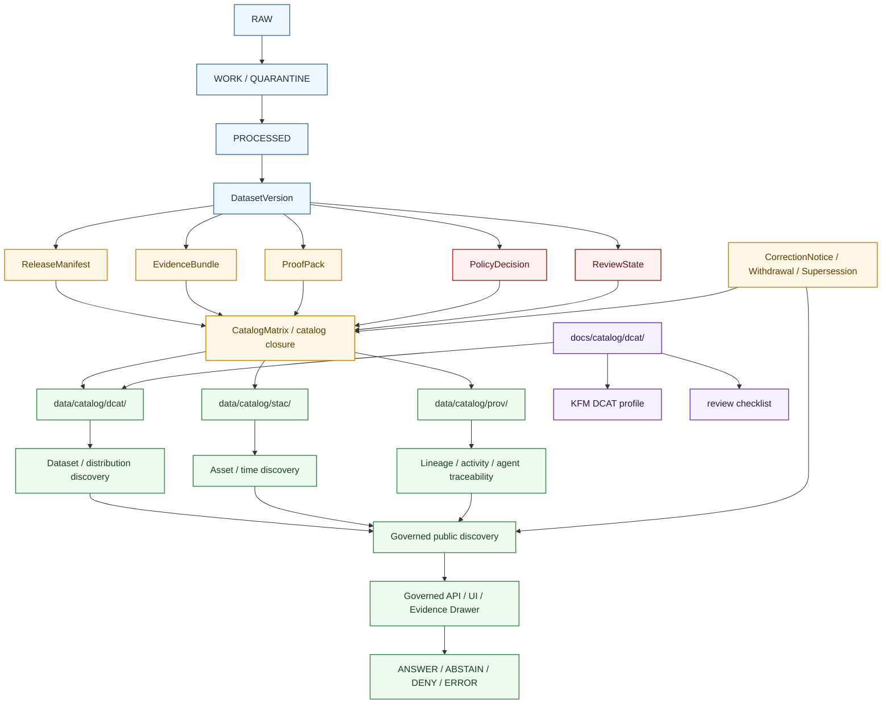

<!-- [KFM_META_BLOCK_V2]
doc_id: kfm://doc/NEEDS-VERIFICATION
title: DCAT Catalog Documentation
type: standard
version: v1
status: draft
owners: NEEDS-VERIFICATION
created: 2026-04-27
updated: 2026-04-27
policy_label: NEEDS-VERIFICATION
related: [../README.md, ../../README.md, ../../../README.md, ../../standards/KFM_DCAT_PROFILE.md, ../../../data/catalog/README.md, ../../../data/catalog/dcat/README.md, ../../../data/catalog/stac/README.md, ../../../data/catalog/prov/README.md]
tags: [kfm, catalog, dcat, metadata, catalog-closure, discovery]
notes: [Target path is docs/catalog/dcat/README.md. Owner, policy label, doc_id, parent links, sibling links, active-branch file inventory, validator presence, and profile authority require checkout verification before publication.]
[/KFM_META_BLOCK_V2] -->

<a id="top"></a>

# DCAT Catalog Documentation

Documentation guide for KFM’s DCAT-facing catalog lane: dataset and distribution discovery without treating catalog metadata as canonical truth.

> [!IMPORTANT]
> **Status:** experimental  
> **Owners:** `NEEDS-VERIFICATION`  
> **Path:** `docs/catalog/dcat/README.md`  
> **Truth posture:** CONFIRMED documentation role / PROPOSED path authority / UNKNOWN active-branch implementation depth  
> **Repo fit:** documentation surface for the DCAT side of KFM catalog closure. Expected downstream catalog-data lane: [`../../../data/catalog/dcat/README.md`](../../../data/catalog/dcat/README.md). Expected sibling discovery and lineage lanes: [`../../../data/catalog/stac/README.md`](../../../data/catalog/stac/README.md) and [`../../../data/catalog/prov/README.md`](../../../data/catalog/prov/README.md).  
> **Quick jumps:** [Scope](#scope) · [Repo fit](#repo-fit) · [Accepted inputs](#accepted-inputs) · [Exclusions](#exclusions) · [Directory tree](#directory-tree) · [Quickstart](#quickstart) · [Usage](#usage) · [Diagram](#diagram) · [Reference tables](#reference-tables) · [Review gates](#review-gates) · [FAQ](#faq) · [Appendix](#appendix)


> [!NOTE]
> This README is intentionally **documentation-facing**. DCAT JSON-LD payloads, emitted catalog records, fixtures, manifests, and proof-bearing outputs belong under the data catalog, contract, test, proof, or release lanes that the active checkout verifies.

> [!CAUTION]
> Use **profile fit** language by default. Do not claim DCAT conformance, emitted catalog coverage, validator enforcement, CI enforcement, or release-gate adoption unless the active checkout contains reviewable records, fixtures, validators, workflow evidence, and promotion artifacts.

---

## Scope

`docs/catalog/dcat/` explains how KFM documents and reviews the **DCAT side of catalog closure**.

In KFM terms, DCAT is the outward-facing dataset and distribution discovery vocabulary. It helps people and systems understand what a released or release-candidate dataset is, how it can be accessed, what rights posture applies, and how it relates to sibling catalog and provenance surfaces.

This documentation lane exists so maintainers can keep DCAT practice:

- downstream of `PROCESSED`,
- tied to `ReleaseManifest`, `ProofPack`, `CatalogMatrix`, and review expectations,
- cross-linked with STAC and PROV instead of competing with them,
- explicit about rights, access, temporal scope, source role, and public-safe spatial scope,
- clear about correction, supersession, withdrawal, and rollback lineage,
- and honest about what is **CONFIRMED**, **PROPOSED**, **UNKNOWN**, or **NEEDS VERIFICATION**.

### What this README is for

Use this file to answer five questions quickly:

1. What does KFM mean by DCAT in the catalog-closure layer?
2. What belongs in this documentation lane versus the data catalog lane?
3. What must be checked before a DCAT record can support public discovery?
4. How should DCAT stay aligned with STAC, PROV, release state, policy state, proof state, and correction lineage?
5. What should reviewers deny, abstain from, or send back to quarantine?

### What this README is not

This file is not the KFM DCAT profile, not a JSON-LD fixture, not an emitted catalog record, not a policy file, not a proof pack, and not implementation evidence.

[Back to top](#top)

---

## Repo fit

### Path and adjacency

| Relationship | Surface | Status | Why it matters |
| --- | --- | --- | --- |
| This documentation lane | `docs/catalog/dcat/README.md` | **PROPOSED / target file** | Explains DCAT operating posture, field expectations, review checks, and documentation boundaries. |
| Parent catalog docs | [`../README.md`](../README.md) | **NEEDS VERIFICATION** | Should define the wider catalog documentation boundary. |
| Docs root | [`../../README.md`](../../README.md) | **NEEDS VERIFICATION** | Should define broader documentation conventions and navigation. |
| Repo root | [`../../../README.md`](../../../README.md) | **NEEDS VERIFICATION** | Should provide project-wide orientation and the public trust posture. |
| KFM DCAT profile | [`../../standards/KFM_DCAT_PROFILE.md`](../../standards/KFM_DCAT_PROFILE.md) | **NEEDS VERIFICATION** | Expected profile authority for field-level and conformance language. |
| Catalog data parent | [`../../../data/catalog/README.md`](../../../data/catalog/README.md) | **NEEDS VERIFICATION** | Expected parent for emitted catalog object families. |
| DCAT data lane | [`../../../data/catalog/dcat/README.md`](../../../data/catalog/dcat/README.md) | **NEEDS VERIFICATION** | Expected home for emitted dataset/distribution records, not this docs lane. |
| STAC sibling | [`../../../data/catalog/stac/README.md`](../../../data/catalog/stac/README.md) | **NEEDS VERIFICATION** | Asset, item, collection, and spatiotemporal discovery should remain distinct from DCAT. |
| PROV sibling | [`../../../data/catalog/prov/README.md`](../../../data/catalog/prov/README.md) | **NEEDS VERIFICATION** | Lineage, activity, and agent traceability should remain distinct from DCAT. |
| Data lifecycle | [`../../../data/README.md`](../../../data/README.md) | **NEEDS VERIFICATION** | Should preserve the `RAW -> WORK / QUARANTINE -> PROCESSED -> CATALOG / TRIPLET -> PUBLISHED` boundary. |
| Contract / schema authority | [`../../../contracts/README.md`](../../../contracts/README.md), [`../../../schemas/README.md`](../../../schemas/README.md) | **NEEDS VERIFICATION / possibly CONFLICTED** | DCAT docs may reference declared shapes but must not silently define machine-contract authority. |
| Policy authority | [`../../../policy/README.md`](../../../policy/README.md) | **NEEDS VERIFICATION** | Rights, sensitivity, denial, and publication rules belong in policy, even when DCAT exposes their consequences. |
| Catalog helpers / tests | [`../../../tools/catalog/README.md`](../../../tools/catalog/README.md), [`../../../tests/catalog/README.md`](../../../tests/catalog/README.md) | **NEEDS VERIFICATION** | Helpers and tests should prove cross-link behavior rather than letting README prose stand in for validation. |

### Operating boundary

DCAT in KFM should describe **released or release-candidate discovery scope**. It should not become:

- the canonical payload store,
- a source registry,
- a policy engine,
- a proof pack,
- a runtime API envelope,
- an AI evidence bundle,
- a release approval record,
- or a workaround for review.

> [!TIP]
> Keep the KFM trust split visible:
>
> **catalog metadata ≠ canonical payload ≠ evidence bundle ≠ proof ≠ policy ≠ publication**

[Back to top](#top)

---

## Accepted inputs

The following belong in `docs/catalog/dcat/` only when they remain documentation, guidance, examples, or review scaffolding.

| Accepted input | Belongs here when… | Status |
| --- | --- | --- |
| `README.md` orientation | it explains the lane, boundaries, links, review checks, and uncertainty clearly | **CONFIRMED for this output** |
| DCAT profile guidance | it summarizes or links to the project’s DCAT profile without replacing the profile | **PROPOSED / NEEDS VERIFICATION** |
| Field mapping notes | they explain how KFM release, rights, provenance, access, correction, and temporal concepts map into DCAT-facing records | **PROPOSED** |
| Review checklists | they help reviewers verify release linkage, rights posture, access posture, spatial/temporal scope, and sibling catalog closure | **PROPOSED** |
| Illustrative JSON-LD snippets | they are labeled as examples or pseudocode and do not claim emitted fixture status | **PROPOSED** |
| Crosswalk tables | they clarify relationships among DCAT, STAC, PROV, `ReleaseManifest`, `CatalogMatrix`, `ProofPack`, and `EvidenceBundle` | **PROPOSED** |
| Open verification notes | they identify what must be checked in the active branch before publication claims are made | **CONFIRMED documentation pattern** |

### What “accepted” means in KFM terms

Accepted documentation here should make discovery safer and easier to review. It should never downgrade proof, policy, provenance, validation, or release state into prose-only advice.

[Back to top](#top)

---

## Exclusions

| Not here | Goes instead | Why |
| --- | --- | --- |
| Actual DCAT JSON-LD dataset/distribution records | `data/catalog/dcat/` | This docs lane explains; the data lane emits and stores catalog records. |
| STAC Catalogs, Collections, or Items | `data/catalog/stac/` | STAC remains the asset and spatiotemporal discovery carrier. |
| PROV bundles | `data/catalog/prov/` | PROV remains the lineage/activity/agent carrier. |
| Raw acquisitions or source-native dumps | `data/raw/` | Discovery is not intake. |
| Intermediate transforms, scratch QA, or unresolved candidates | `data/work/` or `data/quarantine/` | Validation and experimentation are not publication. |
| Canonical processed payloads | `data/processed/` | DCAT describes discoverable scope; it does not replace the payload. |
| Public publication packages | `data/published/` | Publication is governed state, not just catalog presence. |
| Run receipts and process memory | `data/receipts/` | Receipts may be linked but are not DCAT records. |
| Release proofs, attestations, and proof packs | `data/proofs/` | Proof artifacts remain first-class and reviewable. |
| Policy rules or reason registries | `policy/` | Policy should be executable and independently reviewable. |
| JSON Schema / OpenAPI / machine contracts | `contracts/` or `schemas/` | Documentation can reference contracts but must not become contract authority. |
| Runtime API envelopes, Evidence Drawer payloads, or Focus Mode answers | governed API / app surfaces | Runtime trust objects are not catalog metadata. |
| AI summaries or generated prose | governed AI surfaces with EvidenceBundle references | AI is interpretive only and must not become source truth. |

> [!WARNING]
> If a proposed DCAT record would expose unresolved rights, unreleased scope, exact-location-sensitive detail, living-person sensitivity, cultural sensitivity, ecological sensitivity, archaeological sensitivity, or an access point that is not public-safe, it should fail closed and stay out of public discovery.

[Back to top](#top)

---

## Directory tree

### Target documentation shape

```text
docs/
└── catalog/
    └── dcat/
        └── README.md
```

### Expected adjacent catalog-data shape

```text
data/
└── catalog/
    ├── README.md
    ├── dcat/
    │   └── README.md
    ├── stac/
    │   └── README.md
    └── prov/
        └── README.md
```

### Possible payload-bearing shape

```text
data/
└── catalog/
    └── dcat/
        ├── README.md
        └── datasets/
            └── <dataset>__<version>.jsonld
```

> [!NOTE]
> The payload-bearing shape is **PROPOSED** until verified in the active branch. Do not create it merely because this README names it.

[Back to top](#top)

---

## Quickstart

Run these checks before revising this file or adding DCAT-related catalog records.

### 1. Verify the active checkout

```bash
pwd
git status --short
git branch --show-current || true
git ls-files 'docs/catalog/**' 'data/catalog/**' 'docs/standards/**' | sort
```

### 2. Inspect nearby documentation and data lanes

```bash
sed -n '1,220p' docs/catalog/README.md 2>/dev/null || true
sed -n '1,260p' docs/standards/KFM_DCAT_PROFILE.md 2>/dev/null || true

sed -n '1,220p' data/README.md 2>/dev/null || true
sed -n '1,220p' data/catalog/README.md 2>/dev/null || true
sed -n '1,220p' data/catalog/dcat/README.md 2>/dev/null || true
sed -n '1,220p' data/catalog/stac/README.md 2>/dev/null || true
sed -n '1,220p' data/catalog/prov/README.md 2>/dev/null || true
```

### 3. Search before inventing names

```bash
rg -n "DCAT|dcat:Dataset|dcat:Distribution|CatalogMatrix|CatalogClosure|ReleaseManifest|ProofPack|EvidenceBundle|PROV|STAC" \
  docs data contracts schemas policy tools scripts tests .github 2>/dev/null || true
```

### 4. Confirm validator and fixture reality

```bash
find tools scripts tests contracts schemas -maxdepth 4 -type f 2>/dev/null | sort

rg -n "validate.*dcat|dcat.*validate|catalog.*crosslink|CatalogMatrix|catalog closure" \
  tools scripts tests contracts schemas .github 2>/dev/null || true
```

### 5. Add records only after gate checks

```bash
# PROPOSED only: verify active branch conventions, profile authority,
# release linkage, rights posture, proof objects, and tests before creating
# any payload-bearing catalog record.
```

> [!TIP]
> The safest first DCAT change is usually **docs + profile + fixtures + tests**, not a standalone JSON-LD record with no release, proof, policy, or cross-link evidence.

[Back to top](#top)

---

## Usage

### How DCAT should behave in KFM

DCAT-facing material should remain:

- **discovery-oriented**, not payload-heavy,
- **release-linked**, not free-floating,
- **profile-aware**, not ad hoc,
- **rights-visible**, not silent on access posture,
- **public-safe**, not accidentally precise or sensitive,
- **cross-linked**, not isolated from STAC and PROV,
- **correction-friendly**, not lineage-erasing,
- and **evidence-subordinate**, not a source of truth by itself.

### Profile-aligned example shape

The following is an **illustrative JSON-LD sketch**, not proof of an emitted fixture.

```jsonc
{
  "@context": {
    "dcat": "http://www.w3.org/ns/dcat#",
    "dct": "http://purl.org/dc/terms/",
    "spdx": "http://spdx.org/rdf/terms#",
    "time": "http://www.w3.org/2006/time#"
  },
  "@type": "dcat:Dataset",
  "dct:identifier": "TODO(stable-dataset-id)",
  "dct:title": "TODO(human-readable title)",
  "dct:description": "TODO(release-linked description)",
  "dct:license": { "@id": "TODO(resolvable-license-iri)" },
  "dct:rights": "TODO(rights/access posture)",
  "dct:accessRights": "TODO(public|restricted|staged|denied)",
  "dct:spatial": {
    "@type": "dct:Location",
    "dcat:bbox": "TODO(public-safe bbox or profile-approved geometry)"
  },
  "dct:temporal": {
    "@type": "dct:PeriodOfTime",
    "time:hasBeginning": {
      "@type": "time:Instant",
      "time:inXSDDateTime": "TODO(ISO-8601 start)"
    },
    "time:hasEnd": {
      "@type": "time:Instant",
      "time:inXSDDateTime": "TODO(ISO-8601 end)"
    }
  },
  "dct:conformsTo": [
    { "@id": "https://www.w3.org/TR/vocab-dcat-3/" },
    { "@id": "TODO(kfm-dcat-profile-ref)" }
  ],
  "dct:relation": [
    { "@id": "TODO(release-manifest-ref)" },
    { "@id": "TODO(stac-record-ref)" },
    { "@id": "TODO(prov-bundle-ref)" },
    { "@id": "TODO(catalog-matrix-ref)" },
    { "@id": "TODO(correction-or-supersession-ref-if-any)" }
  ],
  "dct:provenance": { "@id": "TODO(prov-bundle-ref)" },
  "dcat:distribution": [
    {
      "@type": "dcat:Distribution",
      "dct:identifier": "TODO(distribution-id)",
      "dct:title": "TODO(downloadable artifact distribution)",
      "dcat:mediaType": "TODO(media type)",
      "dcat:downloadURL": { "@id": "TODO(actual-downloadable-artifact-url)" },
      "spdx:checksum": {
        "@type": "spdx:Checksum",
        "spdx:algorithm": "spdx:checksumAlgorithm_sha256",
        "spdx:checksumValue": "TODO(sha256 digest)"
      }
    },
    {
      "@type": "dcat:Distribution",
      "dct:identifier": "TODO(service-distribution-id)",
      "dct:title": "TODO(mediated service or viewer access)",
      "dcat:accessURL": { "@id": "TODO(mediated-access-url)" }
    }
  ]
}
```

Use `dcat:downloadURL` only for an actual downloadable artifact. Use `dcat:accessURL` when the outward object is a service, viewer, mediated access point, or other non-downloadable discovery surface.

[Back to top](#top)

---

## Diagram



[Back to top](#top)

---

## Reference tables

### DCAT in the catalog triplet

| Surface | Primary job | KFM expectation |
| --- | --- | --- |
| DCAT | Dataset, distribution, access, rights, and catalog interoperability | Present or planned for outward dataset/distribution discovery. |
| STAC | Spatiotemporal asset, item, collection, and asset-link discovery | Used where item/asset/time discovery is the stronger carrier. |
| PROV | Lineage, activity, agent, derivation, and provenance interchange | Present or resolvable for release-bearing artifacts. |
| KFM governance objects | Policy, review, release, proof, runtime, correction, and rollback | Must remain first-class; DCAT may link to them but must not absorb them. |

### Minimum dataset / distribution expectations

| Concern | DCAT-facing carrier | KFM consequence |
| --- | --- | --- |
| Stable dataset identity | `dct:identifier`, title, description | Identity drift breaks discovery, lineage, and correction. |
| Release linkage | `dct:relation` or profile-defined relation fields | Public discovery must not outrun release state. |
| Profile reference | `dct:conformsTo` | Validators and reviewers need explicit profile pins. |
| Rights posture | `dct:license`, `dct:rights`, `dct:accessRights` | Unknown or restricted rights should block public discovery. |
| Public-safe spatial scope | `dct:spatial`, profile-approved geometry/bounds | Discovery should communicate scope without leaking unsafe precision. |
| Time basis | `dct:temporal`, profile-approved temporal fields | KFM is time-aware; catalog records should not hide observation, validity, access, or publication time. |
| Distribution class | `dcat:distribution` | Different artifact classes should not be flattened into one ambiguous distribution. |
| Download vs access | `dcat:downloadURL` / `dcat:accessURL` | URL type must match the actual outward surface. |
| Provenance continuation | `dct:provenance` and sibling PROV links | Discovery should continue into lineage instead of stopping at a catalog title. |
| Correction visibility | relation to correction/supersession/withdrawal records | Public discovery must preserve visible change lineage. |

### Gate outcomes

| Outcome | Use when | DCAT consequence |
| --- | --- | --- |
| **ANSWER** | release, proof, rights, review, policy, and catalog closure support discovery | DCAT record may participate in public discovery. |
| **ABSTAIN** | support is insufficient or identifiers/cross-links are ambiguous | Do not publish a stronger claim; keep review note visible. |
| **DENY** | rights, sensitivity, source role, review state, or policy blocks public discovery | Keep the record unpublished, restricted, generalized, or quarantined. |
| **ERROR** | validation, parsing, resolver, manifest, or workflow failure occurs | Do not publish; emit or update process evidence according to repo convention. |

### Avoid patterns

| Avoid | Why |
| --- | --- |
| Treating DCAT as canonical truth | KFM keeps catalog metadata downstream of evidence, proof, policy, and release state. |
| Claiming conformance because DCAT is a good fit | KFM separates profile fit from implemented, validated adoption. |
| Publishing discovery before rights/review closure | Fail-closed publication posture must remain real. |
| Letting DCAT, STAC, and PROV disagree on identifiers or release scope | Catalog closure stops being trustworthy when the triplet drifts. |
| Minting ad hoc extension terms in README prose | Extension drift becomes catalog drift. |
| Hiding services behind `downloadURL` | Consumers need to know whether a distribution is a downloadable artifact or mediated access point. |
| Treating AI summaries as DCAT support | AI can interpret released evidence; it cannot replace EvidenceBundle resolution. |

[Back to top](#top)

---

## Review gates

Use this checklist for changes to this documentation lane or the downstream DCAT data lane.

- [ ] Active checkout confirms whether `docs/catalog/dcat/README.md` exists or is new.
- [ ] KFM Meta Block V2 remains present and synchronized with the visible title.
- [ ] Owner, policy label, created date, updated date, and related links have been verified or explicitly left as placeholders.
- [ ] This documentation lane remains separate from `data/catalog/dcat/`.
- [ ] Any example is labeled as illustrative unless emitted fixture evidence exists.
- [ ] Any referenced profile path is checked in and linked correctly from this file.
- [ ] Any new DCAT record links to release state or release-candidate state.
- [ ] STAC, DCAT, PROV, `ReleaseManifest`, `ProofPack`, `EvidenceBundle`, and `CatalogMatrix` identifiers are aligned where catalog closure is claimed.
- [ ] Rights, access, sensitivity, and public-safe spatial scope are visible.
- [ ] `downloadURL` and `accessURL` are used according to actual distribution type.
- [ ] Correction, supersession, withdrawal, or rollback references are visible when relevant.
- [ ] Validator, fixture, and CI claims are grounded in active-branch files.
- [ ] No README prose claims public release, publication, conformance, enforcement, or runtime behavior without proof.
- [ ] Rollback path is documented for any public-facing catalog change.

### Rollback triggers

Rollback or withdrawal review is required when a DCAT-facing change:

- exposes unreleased or rights-uncertain material,
- points public users to an access surface that policy has not allowed,
- presents sensitive geometry more precisely than release policy permits,
- breaks STAC/DCAT/PROV identity closure,
- loses correction, supersession, or withdrawal lineage,
- claims validator, profile, CI, or release-gate behavior not backed by current evidence,
- or causes public discovery to bypass governed APIs or released artifacts.

Rollback target: `ROLLBACK_TARGET_NEEDS_VERIFICATION`

[Back to top](#top)

---

## FAQ

### Is this the home for DCAT JSON-LD files?

No. This is the documentation guide at `docs/catalog/dcat/`. DCAT JSON-LD payloads should live in the data catalog lane, expected as `data/catalog/dcat/` unless the active repo proves a different convention.

### Does a DCAT record make a dataset published?

No. Publication is a governed state transition. A DCAT record may participate in discovery after release gates pass, but it does not replace release approval, proof objects, policy decisions, review records, or rollback records.

### Can DCAT replace STAC or PROV?

No. KFM uses the catalog triplet because each standard carries a different burden: DCAT for dataset/distribution discovery, STAC for spatiotemporal asset discovery, and PROV for lineage and activity traceability.

### Can Focus Mode answer from DCAT alone?

No. Focus Mode must resolve admissible evidence through governed backend flow. DCAT can help point to released scope, but `EvidenceBundle`, policy state, review state, and release state outrank catalog prose.

### What should happen when rights or sensitivity are unclear?

The record should stay out of public discovery or be redacted, generalized, delayed, staged, or restricted until rights, review, and sensitivity posture are resolved.

### When should the README say “conforms to DCAT”?

Only after the active checkout contains the profile, fixtures, validator evidence, and release or catalog records needed to support that claim. Until then, use **profile fit**, **profile-aligned**, or **PROPOSED** language.

[Back to top](#top)

---

## Appendix

<details>
<summary><strong>Evidence markers used in this README</strong></summary>

| Marker | Meaning |
| --- | --- |
| **CONFIRMED** | Verified from active checkout, supplied project source, visible generated artifact, or direct command evidence. |
| **INFERRED** | Strongly suggested by project doctrine or adjacent docs, but not proven as current implementation. |
| **PROPOSED** | Recommended target behavior or structure that still needs implementation evidence. |
| **UNKNOWN** | Not verified strongly enough to claim. |
| **NEEDS VERIFICATION** | Specific branch, owner, path, policy, tool, validator, rights, source, or runtime detail that should be checked before merge. |
| **DENY** | Output, discovery, publication, source activation, or access should not proceed under current evidence/policy conditions. |
| **ABSTAIN** | A stronger claim cannot be answered or published because support is insufficient. |

</details>

<details>
<summary><strong>Review prompts for maintainers</strong></summary>

- Does this README describe the active branch, or only the desired design?
- Are DCAT examples clearly labeled as examples unless fixtures exist?
- Are rights, access posture, and public-safe geometry visible?
- Are STAC and PROV cross-links present where catalog closure is claimed?
- Are `ReleaseManifest`, `ProofPack`, `EvidenceBundle`, and `CatalogMatrix` still first-class?
- Are policy and validation claims backed by files, tests, workflow evidence, or emitted artifacts?
- Would a public user understand whether a URL is a direct download, a service, or a mediated access point?
- Is correction lineage visible if a release was replaced, withdrawn, or superseded?
- Does any public-facing path bypass the governed interface or released-artifact boundary?

</details>

<details>
<summary><strong>External standard anchors</strong></summary>

- [W3C DCAT Version 3][w3c-dcat-v3]
- [OGC STAC Community Standard 1.1][ogc-stac]
- [W3C PROV-O][w3c-prov-o]

These anchors support vocabulary alignment only. KFM publication readiness still depends on KFM evidence, policy, review, release, proof, and catalog-closure gates.

NEEDS VERIFICATION before claiming implementation conformance: exact profile version, validator behavior, fixture coverage, release records, and active-branch file paths.

</details>

[w3c-dcat-v3]: https://www.w3.org/TR/vocab-dcat-3/
[ogc-stac]: https://docs.ogc.org/cs/25-004/25-004.html
[w3c-prov-o]: https://www.w3.org/TR/prov-o/
