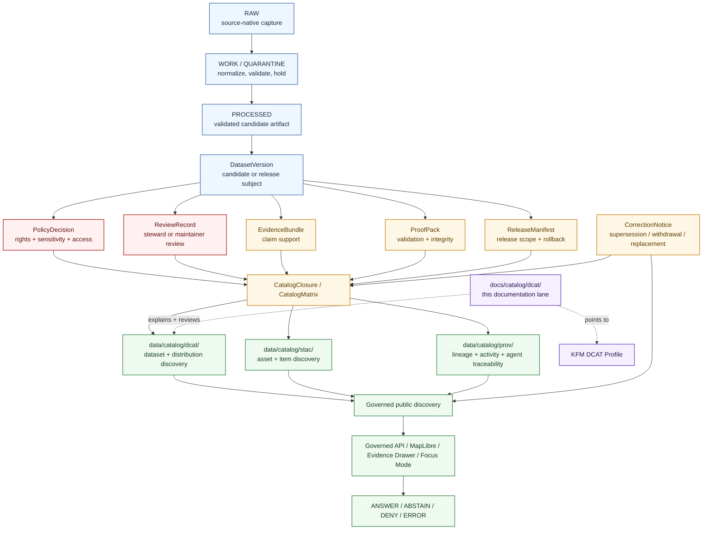

<!-- [KFM_META_BLOCK_V2]
doc_id: kfm://doc/NEEDS-VERIFICATION
title: DCAT Catalog Documentation
type: standard
version: v1
status: draft
owners: NEEDS_VERIFICATION
created: 2026-04-27
updated: 2026-05-06
policy_label: NEEDS_VERIFICATION
related: [../README.md, ../stac/README.md, ../../standards/KFM_DCAT_PROFILE.md, ../../standards/KFM_STAC_PROFILE.md, ../../standards/KFM_PROV_PROFILE.md, ../../adr/ADR-0001-schema-home.md, ../../../data/catalog/README.md, ../../../data/catalog/dcat/README.md, ../../../data/catalog/stac/README.md, ../../../data/catalog/prov/README.md, ../../../README.md]
tags: [kfm, catalog, dcat, metadata, catalog-closure, discovery]
notes: [Target file confirmed through repository connector at docs/catalog/dcat/README.md. Mounted local checkout was not available during this revision. doc_id, owners, policy label, CODEOWNERS routing, branch protections, validator run status, workflow enforcement, emitted DCAT inventory, and public conformance remain NEEDS VERIFICATION. updated reflects this proposed revision date, not commit evidence.]
[/KFM_META_BLOCK_V2] -->

<a id="top"></a>

# DCAT Catalog Documentation

Documentation guide for KFM’s DCAT-facing dataset and distribution discovery posture, keeping catalog metadata downstream of evidence, policy, review, release, and correction state.

> [!IMPORTANT]
> **Status:** experimental · **Document state:** draft · **Owners:** `NEEDS_VERIFICATION`  
> **Path:** `docs/catalog/dcat/README.md`  
> **Repo evidence:** `CONFIRMED` file path via repository connector · `UNKNOWN` local mounted checkout, validator execution, workflow enforcement, emitted DCAT payload inventory, and branch-protection status  
> **Repo fit:** documentation surface for the DCAT side of KFM catalog closure. Payload-bearing DCAT records belong in [`../../../data/catalog/dcat/`](../../../data/catalog/dcat/), not in this documentation lane.  
> **Quick jumps:** [Scope](#scope) · [Evidence posture](#evidence-posture) · [Repo fit](#repo-fit) · [Accepted inputs](#accepted-inputs) · [Exclusions](#exclusions) · [Directory tree](#directory-tree) · [Quickstart](#quickstart) · [Usage](#usage) · [Diagram](#diagram) · [Reference tables](#reference-tables) · [Review gates](#review-gates) · [FAQ](#faq) · [Appendix](#appendix)

<p align="center">
  
  
  
  
  
  
  
</p>

> [!NOTE]
> This README is **documentation-facing**. It explains DCAT operating posture, review expectations, profile alignment, and directory boundaries. Actual DCAT JSON-LD payloads, release-candidate records, emitted catalog records, fixtures, manifests, receipts, proofs, and validator outputs belong in their verified data, schema, policy, test, release, proof, or tooling homes.

> [!CAUTION]
> Use **profile-fit** language by default. Do **not** claim DCAT conformance, emitted catalog coverage, validator enforcement, CI enforcement, public release, or promotion-gate adoption unless the active branch contains reviewable records, fixtures, validators, workflow evidence, emitted artifacts, and release proof.

---

## Scope

`docs/catalog/dcat/` explains how KFM documents and reviews the **DCAT side of catalog closure**.

In KFM terms, DCAT is the outward-facing dataset and distribution discovery vocabulary. It helps people and systems understand what a released or release-candidate dataset is, how it can be accessed, which rights and access posture apply, and how the record relates to STAC, PROV, release, proof, review, policy, evidence, and correction surfaces.

This lane exists to keep DCAT practice:

- downstream of `PROCESSED`,
- connected to `CatalogClosure`, `CatalogMatrix`, `ReleaseManifest`, and proof expectations,
- cross-linked with STAC and PROV instead of competing with them,
- explicit about rights, access, spatial scope, temporal scope, source role, and public-safety posture,
- clear about correction, supersession, withdrawal, replacement, and rollback lineage,
- and honest about what is **CONFIRMED**, **INFERRED**, **PROPOSED**, **UNKNOWN**, or **NEEDS VERIFICATION**.

### What this README is for

Use this file to answer five questions quickly:

1. What does KFM mean by DCAT inside the catalog-closure layer?
2. What belongs in this documentation lane versus the DCAT data-catalog lane?
3. What must be checked before a DCAT record can support public discovery?
4. How should DCAT stay aligned with STAC, PROV, release state, policy state, proof state, and correction lineage?
5. What should reviewers deny, abstain from, or send back to review/quarantine?

### What this README is not

This README is not:

- the full KFM DCAT profile,
- a DCAT JSON-LD fixture,
- an emitted catalog record,
- a release manifest,
- a proof pack,
- a policy file,
- a schema,
- an EvidenceBundle,
- a runtime envelope,
- or implementation evidence that public DCAT conformance is enforced.

[Back to top](#top)

---

## Evidence posture

This file separates **repository path evidence**, **KFM doctrine**, **external standards fit**, and **implementation maturity**.

| Claim | Label | Basis / handling |
| --- | --- | --- |
| `docs/catalog/dcat/README.md` exists in the repository. | **CONFIRMED** | Repository connector surfaced and fetched the file. |
| `docs/catalog/README.md` and `docs/catalog/stac/README.md` exist as adjacent documentation surfaces. | **CONFIRMED** | Repository connector surfaced and fetched both files. |
| `docs/standards/KFM_DCAT_PROFILE.md` exists and frames DCAT as outward dataset/distribution discovery. | **CONFIRMED** | Repository connector fetched the profile. |
| `data/catalog/dcat/README.md`, `data/catalog/stac/README.md`, and `data/catalog/prov/README.md` exist as data-catalog sibling lanes. | **CONFIRMED** | Repository connector fetched these data-lane READMEs. |
| Owner routing for this file is settled. | **NEEDS VERIFICATION** | `.github/CODEOWNERS` was accessible but did not provide path-specific routing in the inspected content. |
| DCAT validators, emitted payloads, CI gates, release proof, public conformance, and branch protections are active. | **UNKNOWN** | They were not proven by a mounted checkout, workflow run, emitted artifact, or validator output in this revision. |
| `schemas/contracts/v1/` is the accepted machine-contract home. | **PROPOSED / NEEDS VERIFICATION** | ADR-0001 proposes it, but acceptance and enforcement remain gated. |
| DCAT is appropriate for dataset and distribution discovery. | **CONFIRMED doctrine / standards fit** | KFM profile and W3C DCAT guidance align on catalog/dataset/distribution use. |

> [!IMPORTANT]
> Strong documentation and confirmed file paths are useful evidence. They do **not** prove runtime maturity, public conformance, emitted payload inventory, validator coverage, CI enforcement, release gating, or branch protection.

[Back to top](#top)

---

## Repo fit

### Path and adjacency

| Relationship | Surface | Status | Why it matters |
| --- | --- | --- | --- |
| This documentation lane | `docs/catalog/dcat/README.md` | **CONFIRMED path** | Explains DCAT operating posture, review checks, profile alignment, and documentation boundaries. |
| Parent catalog docs | [`../README.md`](../README.md) | **CONFIRMED path** | Explains the wider catalog documentation hub. |
| STAC documentation sibling | [`../stac/README.md`](../stac/README.md) | **CONFIRMED path** | Keeps asset/item/collection discovery distinct from DCAT dataset/distribution discovery. |
| KFM DCAT profile | [`../../standards/KFM_DCAT_PROFILE.md`](../../standards/KFM_DCAT_PROFILE.md) | **CONFIRMED path** | Expected standards/profile authority for DCAT field posture and conformance language. |
| KFM STAC profile | [`../../standards/KFM_STAC_PROFILE.md`](../../standards/KFM_STAC_PROFILE.md) | **CONFIRMED path** | Companion profile for STAC closure. |
| KFM PROV profile | [`../../standards/KFM_PROV_PROFILE.md`](../../standards/KFM_PROV_PROFILE.md) | **CONFIRMED path by repository search / content review recommended** | Companion profile for lineage and activity/agent closure. |
| Schema-home ADR | [`../../adr/ADR-0001-schema-home.md`](../../adr/ADR-0001-schema-home.md) | **CONFIRMED path / PROPOSED decision** | Records the proposed `contracts/` versus `schemas/` split; not accepted enforcement by itself. |
| Catalog data parent | [`../../../data/catalog/README.md`](../../../data/catalog/README.md) | **CONFIRMED path** | Defines the data-side catalog seam. |
| DCAT data lane | [`../../../data/catalog/dcat/README.md`](../../../data/catalog/dcat/README.md) | **CONFIRMED path** | Expected home for payload-bearing DCAT records and lane-specific data-catalog guidance. |
| STAC data lane | [`../../../data/catalog/stac/README.md`](../../../data/catalog/stac/README.md) | **CONFIRMED path** | Holds or describes STAC catalog-surface material. |
| PROV data lane | [`../../../data/catalog/prov/README.md`](../../../data/catalog/prov/README.md) | **CONFIRMED path** | Holds or describes catalog-facing provenance bundles. |
| Root project README | [`../../../README.md`](../../../README.md) | **CONFIRMED path** | Defines the project-wide trust posture and lifecycle law. |
| Contract / schema authority | [`../../../contracts/README.md`](../../../contracts/README.md), [`../../../schemas/README.md`](../../../schemas/README.md) | **CONFIRMED paths / authority still review-gated** | DCAT docs may reference declared shapes but must not silently define machine-contract authority. |
| Policy authority | [`../../../policy/README.md`](../../../policy/README.md) | **CONFIRMED path** | Rights, sensitivity, denial, access, and release rules belong in policy, even when DCAT exposes their consequences. |

### Operating boundary

DCAT in KFM should describe **released or release-candidate discovery scope**. It should not become:

- the canonical payload store,
- a source registry,
- a policy engine,
- a proof pack,
- a runtime API envelope,
- an AI evidence bundle,
- a release approval record,
- a shortcut around review,
- or a workaround for unresolved rights or sensitivity.

> [!TIP]
> Keep the KFM trust split visible:
>
> **catalog metadata ≠ canonical payload ≠ evidence bundle ≠ proof ≠ policy ≠ publication**

[Back to top](#top)

---

## Accepted inputs

The following belong in `docs/catalog/dcat/` only when they remain documentation, guidance, examples, or review scaffolding.

| Accepted input | Belongs here when… | Status |
| --- | --- | --- |
| `README.md` orientation | it explains the lane, boundaries, links, review checks, and uncertainty clearly | **CONFIRMED for this file** |
| DCAT profile guidance | it summarizes or links to the project’s DCAT profile without replacing the profile | **CONFIRMED / PROFILE-LINKED** |
| Field mapping notes | they explain how KFM release, rights, provenance, access, correction, and temporal concepts map into DCAT-facing records | **PROPOSED** |
| Review checklists | they help reviewers verify release linkage, rights posture, access posture, spatial/temporal scope, and sibling catalog closure | **PROPOSED** |
| Illustrative JSON-LD snippets | they are labeled as examples or pseudocode and do not claim emitted fixture status | **PROPOSED** |
| Crosswalk tables | they clarify relationships among DCAT, STAC, PROV, `ReleaseManifest`, `CatalogMatrix`, `ProofPack`, and `EvidenceBundle` | **PROPOSED** |
| Open verification notes | they identify what must be checked in the active branch before publication or conformance claims are made | **CONFIRMED documentation pattern** |

### What “accepted” means in KFM terms

Accepted documentation here should make discovery safer and easier to review. It should never downgrade proof, policy, provenance, validation, release state, or correction lineage into prose-only advice.

[Back to top](#top)

---

## Exclusions

| Not here | Goes instead | Why |
| --- | --- | --- |
| Actual DCAT JSON-LD dataset/distribution records | [`../../../data/catalog/dcat/`](../../../data/catalog/dcat/) | This docs lane explains; the data lane emits and stores catalog records when branch conventions support it. |
| STAC Catalogs, Collections, or Items | [`../../../data/catalog/stac/`](../../../data/catalog/stac/) | STAC remains the asset and spatiotemporal discovery carrier. |
| PROV bundles | [`../../../data/catalog/prov/`](../../../data/catalog/prov/) | PROV remains the lineage/activity/agent carrier. |
| Raw acquisitions or source-native dumps | `../../../data/raw/` | Discovery is not intake. |
| Intermediate transforms, scratch QA, or unresolved candidates | `../../../data/work/` or `../../../data/quarantine/` | Validation and experimentation are not publication. |
| Canonical processed payloads | `../../../data/processed/` | DCAT describes discoverable scope; it does not replace the payload. |
| Public publication packages | `../../../data/published/` | Publication is governed state, not just catalog presence. |
| Run receipts and process memory | `../../../data/receipts/` | Receipts may be linked but are not DCAT records. |
| Release proofs, attestations, and proof packs | `../../../data/proofs/` | Proof artifacts remain first-class and reviewable. |
| Policy rules or reason registries | [`../../../policy/`](../../../policy/) | Policy should be executable and independently reviewable. |
| JSON Schema / OpenAPI / machine contracts | [`../../../contracts/`](../../../contracts/) or [`../../../schemas/`](../../../schemas/) | Documentation can reference contracts but must not become contract authority. |
| Runtime API envelopes, Evidence Drawer payloads, or Focus Mode answers | governed API / app surfaces | Runtime trust objects are not catalog metadata. |
| AI summaries or generated prose | governed AI surfaces with EvidenceBundle references | AI is interpretive only and must not become source truth. |

> [!WARNING]
> If a proposed DCAT record would expose unresolved rights, unreleased scope, exact-location-sensitive detail, living-person sensitivity, cultural sensitivity, ecological sensitivity, archaeological sensitivity, critical infrastructure sensitivity, or an access point that is not public-safe, it should fail closed and stay out of public discovery.

[Back to top](#top)

---

## Directory tree

### Confirmed documentation shape

```text
docs/
└── catalog/
    ├── README.md
    ├── dcat/
    │   └── README.md
    └── stac/
        └── README.md
```

### Confirmed adjacent data-catalog shape

```text
data/
└── catalog/
    ├── README.md
    ├── dcat/
    │   └── README.md
    ├── stac/
    │   └── README.md
    └── prov/
        └── README.md
```

### Possible payload-bearing shape

```text
data/
└── catalog/
    └── dcat/
        ├── README.md
        └── datasets/
            └── <dataset-id>__<version>.jsonld
```

> [!NOTE]
> The payload-bearing shape is **PROPOSED** until verified in the active branch. Do not create it merely because this README names it.

[Back to top](#top)

---

## Quickstart

Run these checks before revising this file or adding DCAT-related catalog records.

### 1. Verify the active checkout

```bash
pwd
git status --short
git branch --show-current || true

git ls-files \
  'docs/catalog/**' \
  'data/catalog/**' \
  'docs/standards/**' \
  'docs/adr/ADR-0001-schema-home.md' \
  'contracts/README.md' \
  'schemas/README.md' \
  'policy/README.md' \
  '.github/CODEOWNERS' \
  | sort
```

### 2. Inspect nearby documentation and data lanes

```bash
sed -n '1,220p' docs/catalog/README.md
sed -n '1,260p' docs/catalog/dcat/README.md
sed -n '1,260p' docs/catalog/stac/README.md

sed -n '1,300p' docs/standards/KFM_DCAT_PROFILE.md
sed -n '1,260p' docs/standards/KFM_STAC_PROFILE.md
sed -n '1,260p' docs/standards/KFM_PROV_PROFILE.md

sed -n '1,260p' data/catalog/README.md
sed -n '1,260p' data/catalog/dcat/README.md
sed -n '1,260p' data/catalog/stac/README.md
sed -n '1,260p' data/catalog/prov/README.md
```

### 3. Search before inventing names

```bash
git grep -nE \
  'DCAT|dcat:Dataset|dcat:Distribution|CatalogClosure|CatalogMatrix|ReleaseManifest|ProofPack|EvidenceBundle|PROV|STAC|dct:conformsTo|dcat:downloadURL|dcat:accessURL' \
  -- docs data contracts schemas policy tools scripts tests .github 2>/dev/null || true
```

### 4. Confirm validator and fixture reality

```bash
find tools scripts tests contracts schemas -maxdepth 5 -type f 2>/dev/null | sort

git grep -nE \
  'validate.*dcat|dcat.*validate|catalog.*crosslink|CatalogMatrix|catalog closure|dcat:Dataset|dcat:Distribution' \
  -- tools scripts tests contracts schemas .github 2>/dev/null || true
```

### 5. Add records only after gate checks

```bash
# PROPOSED only:
# Verify active branch conventions, profile authority, release linkage,
# rights posture, proof objects, fixtures, validators, and tests before
# creating any payload-bearing catalog record.
```

> [!TIP]
> The safest first DCAT change is usually **docs + profile + fixtures + tests**, not a standalone JSON-LD record with no release, proof, policy, or cross-link evidence.

[Back to top](#top)

---

## Usage

### How DCAT should behave in KFM

DCAT-facing material should remain:

- **discovery-oriented**, not payload-heavy,
- **release-linked**, not free-floating,
- **profile-aware**, not ad hoc,
- **rights-visible**, not silent on access posture,
- **public-safe**, not accidentally precise or sensitive,
- **cross-linked**, not isolated from STAC and PROV,
- **correction-friendly**, not lineage-erasing,
- and **evidence-subordinate**, not a source of truth by itself.

### Profile-aligned example shape

The following is an **illustrative JSON-LD sketch**, not proof of an emitted fixture.

```jsonc
{
  "@context": {
    "dcat": "http://www.w3.org/ns/dcat#",
    "dct": "http://purl.org/dc/terms/",
    "spdx": "http://spdx.org/rdf/terms#",
    "time": "http://www.w3.org/2006/time#",
    "kfm": "https://example.invalid/kfm/ns#"
  },
  "@type": "dcat:Dataset",
  "dct:identifier": "TODO(stable-dataset-id)",
  "dct:title": "TODO(human-readable title)",
  "dct:description": "TODO(release-linked description)",
  "dct:license": { "@id": "TODO(resolvable-license-iri)" },
  "dct:rights": "TODO(rights/access posture)",
  "dct:accessRights": "TODO(public|restricted|staged|denied)",
  "dct:spatial": {
    "@type": "dct:Location",
    "dcat:bbox": "TODO(public-safe bbox or profile-approved geometry)"
  },
  "dct:temporal": {
    "@type": "dct:PeriodOfTime",
    "time:hasBeginning": {
      "@type": "time:Instant",
      "time:inXSDDateTime": "TODO(ISO-8601 start)"
    },
    "time:hasEnd": {
      "@type": "time:Instant",
      "time:inXSDDateTime": "TODO(ISO-8601 end)"
    }
  },
  "dct:conformsTo": [
    { "@id": "https://www.w3.org/TR/vocab-dcat-3/" },
    { "@id": "TODO(kfm-dcat-profile-ref)" }
  ],
  "dct:relation": [
    { "@id": "TODO(release-manifest-ref)" },
    { "@id": "TODO(stac-record-ref)" },
    { "@id": "TODO(prov-bundle-ref)" },
    { "@id": "TODO(catalog-matrix-ref)" },
    { "@id": "TODO(correction-or-supersession-ref-if-any)" }
  ],
  "dct:provenance": { "@id": "TODO(prov-bundle-ref)" },
  "dcat:distribution": [
    {
      "@type": "dcat:Distribution",
      "dct:identifier": "TODO(distribution-id)",
      "dct:title": "TODO(downloadable artifact distribution)",
      "dcat:mediaType": "TODO(media type)",
      "dcat:downloadURL": { "@id": "TODO(actual-downloadable-artifact-url)" },
      "spdx:checksum": {
        "@type": "spdx:Checksum",
        "spdx:algorithm": "spdx:checksumAlgorithm_sha256",
        "spdx:checksumValue": "TODO(sha256 digest)"
      }
    },
    {
      "@type": "dcat:Distribution",
      "dct:identifier": "TODO(service-distribution-id)",
      "dct:title": "TODO(mediated service or viewer access)",
      "dcat:accessURL": { "@id": "TODO(mediated-access-url)" }
    }
  ]
}
```

Use `dcat:downloadURL` only for an actual downloadable artifact. Use `dcat:accessURL` when the outward object is a service, viewer, mediated access point, or other non-downloadable discovery surface.

[Back to top](#top)

---

## Diagram



[Back to top](#top)

---

## Reference tables

### DCAT in the catalog triplet

| Surface | Primary job | KFM expectation |
| --- | --- | --- |
| DCAT | Dataset, distribution, access, rights, and catalog interoperability | Present or planned for outward dataset/distribution discovery. |
| STAC | Spatiotemporal asset, item, collection, and asset-link discovery | Used where item/asset/time discovery is the stronger carrier. |
| PROV | Lineage, activity, agent, derivation, and provenance interchange | Present or resolvable for release-bearing artifacts. |
| KFM governance objects | Policy, review, release, proof, runtime, correction, and rollback | Must remain first-class; DCAT may link to them but must not absorb them. |

### Minimum dataset / distribution expectations

| Concern | DCAT-facing carrier | KFM consequence |
| --- | --- | --- |
| Stable dataset identity | `dct:identifier`, title, description | Identity drift breaks discovery, lineage, and correction. |
| Release linkage | `dct:relation` or profile-defined relation fields | Public discovery must not outrun release state. |
| Profile reference | `dct:conformsTo` | Validators and reviewers need explicit profile pins. |
| Rights posture | `dct:license`, `dct:rights`, `dct:accessRights` | Unknown or restricted rights should block public discovery. |
| Public-safe spatial scope | `dct:spatial`, profile-approved geometry/bounds | Discovery should communicate scope without leaking unsafe precision. |
| Time basis | `dct:temporal`, profile-approved temporal fields | KFM is time-aware; catalog records should not hide observation, validity, access, or publication time. |
| Distribution class | `dcat:distribution` | Different artifact classes should not be flattened into one ambiguous distribution. |
| Download vs access | `dcat:downloadURL` / `dcat:accessURL` | URL type must match the actual outward surface. |
| Provenance continuation | `dct:provenance` and sibling PROV links | Discovery should continue into lineage instead of stopping at a catalog title. |
| Correction visibility | relation to correction/supersession/withdrawal records | Public discovery must preserve visible change lineage. |

### Gate outcomes

| Outcome | Use when | DCAT consequence |
| --- | --- | --- |
| **ANSWER** | release, proof, rights, review, policy, and catalog closure support discovery | DCAT record may participate in public discovery. |
| **ABSTAIN** | support is insufficient or identifiers/cross-links are ambiguous | Do not publish a stronger claim; keep review note visible. |
| **DENY** | rights, sensitivity, source role, review state, or policy blocks public discovery | Keep the record unpublished, restricted, generalized, or quarantined. |
| **ERROR** | validation, parsing, resolver, manifest, or workflow failure occurs | Do not publish; emit or update process evidence according to repo convention. |

### Avoid patterns

| Avoid | Why |
| --- | --- |
| Treating DCAT as canonical truth | KFM keeps catalog metadata downstream of evidence, proof, policy, and release state. |
| Claiming conformance because DCAT is a good fit | KFM separates profile fit from implemented, validated adoption. |
| Publishing discovery before rights/review closure | Fail-closed publication posture must remain real. |
| Letting DCAT, STAC, and PROV disagree on identifiers or release scope | Catalog closure stops being trustworthy when the triplet drifts. |
| Minting ad hoc extension terms in README prose | Extension drift becomes catalog drift. |
| Hiding services behind `downloadURL` | Consumers need to know whether a distribution is a downloadable artifact or mediated access point. |
| Treating AI summaries as DCAT support | AI can interpret released evidence; it cannot replace EvidenceBundle resolution. |

[Back to top](#top)

---

## Review gates

Use this checklist for changes to this documentation lane or the downstream DCAT data lane.

- [ ] Active checkout confirms whether this README is being revised in place.
- [ ] KFM Meta Block V2 remains present and synchronized with the visible title.
- [ ] Owner, policy label, created date, updated date, and related links have been verified or explicitly left as placeholders.
- [ ] This documentation lane remains separate from `data/catalog/dcat/`.
- [ ] Any example is labeled as illustrative unless emitted fixture evidence exists.
- [ ] Any referenced profile path is checked in and linked correctly from this file.
- [ ] Any new DCAT record links to release state or release-candidate state.
- [ ] STAC, DCAT, PROV, `ReleaseManifest`, `ProofPack`, `EvidenceBundle`, and `CatalogMatrix` identifiers are aligned where catalog closure is claimed.
- [ ] Rights, access, sensitivity, and public-safe spatial scope are visible.
- [ ] `downloadURL` and `accessURL` are used according to actual distribution type.
- [ ] Correction, supersession, withdrawal, replacement, or rollback references are visible when relevant.
- [ ] Validator, fixture, and CI claims are grounded in active-branch files and execution evidence.
- [ ] No README prose claims public release, publication, conformance, enforcement, or runtime behavior without proof.
- [ ] Rollback path is documented for any public-facing catalog change.

### Rollback triggers

Rollback or withdrawal review is required when a DCAT-facing change:

- exposes unreleased or rights-uncertain material,
- points public users to an access surface that policy has not allowed,
- presents sensitive geometry more precisely than release policy permits,
- breaks STAC/DCAT/PROV identity closure,
- loses correction, supersession, withdrawal, or replacement lineage,
- claims validator, profile, CI, or release-gate behavior not backed by current evidence,
- or causes public discovery to bypass governed APIs or released artifacts.

Rollback target: `ROLLBACK_TARGET_NEEDS_VERIFICATION`

[Back to top](#top)

---

## FAQ

### Is this the home for DCAT JSON-LD files?

No. This is the documentation guide at `docs/catalog/dcat/`. DCAT JSON-LD payloads should live in the data catalog lane, currently documented at [`../../../data/catalog/dcat/`](../../../data/catalog/dcat/).

### Does a DCAT record make a dataset published?

No. Publication is a governed state transition. A DCAT record may participate in discovery after release gates pass, but it does not replace release approval, proof objects, policy decisions, review records, or rollback records.

### Can DCAT replace STAC or PROV?

No. KFM uses the catalog triplet because each standard carries a different burden: DCAT for dataset/distribution discovery, STAC for spatiotemporal asset discovery, and PROV for lineage and activity traceability.

### Can Focus Mode answer from DCAT alone?

No. Focus Mode must resolve admissible evidence through governed backend flow. DCAT can help point to released scope, but `EvidenceBundle`, policy state, review state, and release state outrank catalog prose.

### What should happen when rights or sensitivity are unclear?

The record should stay out of public discovery or be redacted, generalized, delayed, staged, restricted, denied, or held for review until rights, review, and sensitivity posture are resolved.

### When should the README say “conforms to DCAT”?

Only after the active checkout contains the profile, fixtures, validator evidence, release or catalog records, and review evidence needed to support that claim. Until then, use **profile fit**, **profile-aligned**, or **PROPOSED** language.

[Back to top](#top)

---

## Appendix

<details>
<summary><strong>Evidence markers used in this README</strong></summary>

| Marker | Meaning |
| --- | --- |
| **CONFIRMED** | Verified from active checkout, supplied project source, visible generated artifact, current repository connector evidence, or direct command evidence. |
| **INFERRED** | Strongly suggested by project doctrine or adjacent docs, but not proven as current implementation. |
| **PROPOSED** | Recommended target behavior or structure that still needs implementation evidence. |
| **UNKNOWN** | Not verified strongly enough to claim. |
| **NEEDS VERIFICATION** | Specific branch, owner, path, policy, tool, validator, rights, source, runtime, or workflow detail that should be checked before merge. |
| **DENY** | Output, discovery, publication, source activation, or access should not proceed under current evidence/policy conditions. |
| **ABSTAIN** | A stronger claim cannot be answered or published because support is insufficient. |

</details>

<details>
<summary><strong>Review prompts for maintainers</strong></summary>

- Does this README describe the active branch, or only the desired design?
- Are DCAT examples clearly labeled as examples unless fixtures exist?
- Are rights, access posture, and public-safe geometry visible?
- Are STAC and PROV cross-links present where catalog closure is claimed?
- Are `ReleaseManifest`, `ProofPack`, `EvidenceBundle`, and `CatalogMatrix` still first-class?
- Are policy and validation claims backed by files, tests, workflow evidence, or emitted artifacts?
- Would a public user understand whether a URL is a direct download, a service, or a mediated access point?
- Is correction lineage visible if a release was replaced, withdrawn, superseded, or narrowed?
- Does any public-facing path bypass the governed interface or released-artifact boundary?

</details>

<details>
<summary><strong>External standard anchors</strong></summary>

- [W3C DCAT Version 3][w3c-dcat-v3]
- [OGC STAC standards page][ogc-stac]
- [OGC STAC Community Standard 1.1.0][ogc-stac-core]
- [W3C PROV-O][w3c-prov-o]

These anchors support vocabulary alignment only. KFM publication readiness still depends on KFM evidence, policy, review, release, proof, and catalog-closure gates.

NEEDS VERIFICATION before claiming implementation conformance: exact profile version, validator behavior, fixture coverage, release records, and active-branch file paths.

</details>

[w3c-dcat-v3]: https://www.w3.org/TR/vocab-dcat-3/
[ogc-stac]: https://www.ogc.org/standards/stac/
[ogc-stac-core]: https://docs.ogc.org/cs/25-004/25-004.html
[w3c-prov-o]: https://www.w3.org/TR/prov-o/

[Back to top](#top)
