<!-- [KFM_META_BLOCK_V2]
doc_id: kfm://doc/NEEDS_VERIFICATION
title: KFM STAC Catalog Documentation
type: standard
version: v1
status: draft
owners: NEEDS_VERIFICATION
created: 2026-04-27
updated: 2026-04-27
policy_label: NEEDS_VERIFICATION
related: [NEEDS_VERIFICATION: docs/catalog/README.md, NEEDS_VERIFICATION: data/catalog/stac/README.md, NEEDS_VERIFICATION: docs/catalog/dcat/README.md, NEEDS_VERIFICATION: docs/catalog/prov/README.md, NEEDS_VERIFICATION: CatalogClosure schema, NEEDS_VERIFICATION: ReleaseManifest schema, NEEDS_VERIFICATION: EvidenceBundle schema]
tags: [kfm, catalog, stac, metadata, publication, evidence]
notes: [Target repo was not mounted in the current workspace; doc_id, owners, policy label, adjacent paths, schema homes, validator commands, and emitted artifact paths require branch-local verification.]
[/KFM_META_BLOCK_V2] -->

# KFM STAC Catalog Documentation

Defines how Kansas Frontier Matrix documents STAC as a governed outward catalog surface—not canonical truth, release approval, or evidence proof by itself.

<div align="center">


</div>

> **Status:** experimental / draft  
> **Owners:** `NEEDS_VERIFICATION`  
> **Path:** `docs/catalog/stac/README.md`  
> **Authority:** documentation and profile guidance for KFM STAC usage  
> **Quick jumps:** [Scope](#scope) · [Repo fit](#repo-fit) · [Inputs](#inputs) · [Exclusions](#exclusions) · [Directory tree](#directory-tree) · [Lifecycle](#lifecycle) · [Validation gates](#validation-gates) · [FAQ](#faq) · [Appendix](#appendix)

> [!IMPORTANT]
> STAC helps KFM expose **spatiotemporal assets for discovery**. It does not approve a release, settle rights, prove evidence support, replace `EvidenceBundle`, or make a derived layer authoritative.

---

## Scope

This directory documents the **KFM STAC profile and operating rules** for catalog-facing spatiotemporal assets.

Use this README when you need to answer:

- which STAC surfaces KFM can expose,
- what KFM governance objects must exist before STAC publication,
- how STAC relates to `CatalogClosure`, DCAT, PROV, `ReleaseManifest`, and `EvidenceBundle`,
- what fields and links are expected for KFM-specific trust traceability,
- what must fail closed before any STAC object becomes public.

### What this README is authoritative for

| Area | Posture | Rule |
|---|---:|---|
| STAC documentation role | **CONFIRMED doctrine / PROPOSED local doc home** | STAC is outward catalog metadata for spatiotemporal assets. |
| KFM catalog closure | **CONFIRMED doctrine** | STAC belongs beside DCAT and PROV inside `CatalogClosure`. |
| Release eligibility | **CONFIRMED doctrine** | STAC visibility requires release, policy, sensitivity, evidence, and review closure. |
| Exact repo implementation | **UNKNOWN** | No mounted checkout was available to prove current validators, routes, schemas, or emitted files. |

---

## Repo fit

### Path role

`docs/catalog/stac/` is the **human-readable documentation home** for the STAC profile.

It should not become the emitted STAC catalog itself. Generated or released STAC JSON belongs in the repo’s catalog artifact lane after branch-local verification.

### Upstream and downstream links

| Direction | Candidate surface | Status | Why it matters |
|---|---|---:|---|
| Parent docs | [`../README.md`](../README.md) | **NEEDS VERIFICATION** | Catalog documentation index, if present. |
| Docs index | [`../../README.md`](../../README.md) | **NEEDS VERIFICATION** | Repo-wide documentation entry point, if present. |
| Emitted STAC artifacts | [`../../../data/catalog/stac/`](../../../data/catalog/stac/) | **NEEDS VERIFICATION** | Likely generated/released catalog home, not a docs home. |
| DCAT companion | [`../dcat/README.md`](../dcat/README.md) | **NEEDS VERIFICATION** | Dataset/distribution discovery companion. |
| PROV companion | [`../prov/README.md`](../prov/README.md) | **NEEDS VERIFICATION** | Provenance and lineage companion. |
| Release proofs | [`../../../data/proofs/`](../../../data/proofs/) | **NEEDS VERIFICATION** | Release-significant proof, not ordinary catalog metadata. |
| Receipts | [`../../../data/receipts/`](../../../data/receipts/) | **NEEDS VERIFICATION** | Process memory and validation reports. |

> [!NOTE]
> These links are intentionally marked review-pending because the current workspace exposed the PDF source corpus, not the active KFM repository tree.

[Back to top](#kfm-stac-catalog-documentation)

---

## Inputs

Accepted material for this directory:

| Input | Belongs here? | Notes |
|---|---:|---|
| STAC profile guidance | Yes | Version pinning, required fields, extension stance, and KFM-specific linkage rules. |
| STAC validation checklist | Yes | Human-readable checklist for release reviewers and maintainers. |
| Profile examples | Yes, if labeled | Examples must be clearly marked `illustrative` unless generated from a real release. |
| STAC/DCAT/PROV crosswalk notes | Yes | Keep closure semantics readable and stable. |
| ADRs for catalog-profile choices | Yes | Version pins, extension choices, and namespace decisions should be reviewable. |
| Validator command documentation | Yes, if verified | Use placeholders until the real validator entrypoint is inspected. |

### Minimum example posture

Any checked-in example under this docs path should declare its status:

```json
{
  "example_status": "illustrative",
  "not_a_release_artifact": true,
  "requires_verification_against": [
    "active schema registry",
    "active validator command",
    "release manifest",
    "catalog closure policy"
  ]
}
```

---

## Exclusions

Do **not** place these in `docs/catalog/stac/`:

| Excluded item | Where it should go instead | Reason |
|---|---|---|
| Generated STAC Catalog / Collection / Item JSON | `data/catalog/stac/` or verified generated-artifact home | Generated catalog output is an artifact, not docs. |
| Raw source data | `data/raw/` or source-edge landing area | RAW must preserve source-native capture and checksums. |
| Work or quarantine files | `data/work/` / `data/quarantine/` | STAC is downstream of validation and hold decisions. |
| Release manifests or proof packs | `data/proofs/`, `release/`, or verified release home | Proofs and releases are separate from catalog metadata. |
| Evidence bundles | Runtime/evidence proof surface | STAC may link to evidence, but does not replace it. |
| Policy code | `policy/` or verified policy home | Policy decisions must remain executable and reviewable. |
| Machine schemas | `schemas/` or `contracts/` after schema-home ADR | This docs path should not become a parallel schema authority. |
| AI summaries or raw model output | Governed runtime envelope / review surface | Generated text is not catalog truth. |
| PMTiles, COGs, GeoParquet, 3D Tiles | Released artifact homes | STAC references assets; it is not the asset store. |
| Credentials, tokens, private source URLs | Never in docs | Publication and source access must stay least-privilege. |

> [!CAUTION]
> A “STAC-looking” document that lacks release, evidence, policy, sensitivity, and correction linkage can make weak claims look publishable. Treat that as a governance defect, not a formatting issue.

---

## Directory tree

Current file requested:

```text
docs/catalog/stac/
└── README.md
```

Proposed documentation expansion, pending repo verification:

```text
docs/catalog/stac/
├── README.md
├── profile.md                         # PROPOSED: KFM STAC profile details
├── validation.md                      # PROPOSED: validator and reviewer checklist
├── extensions.md                      # PROPOSED: approved extension / namespace stance
├── examples/
│   ├── README.md                      # PROPOSED: example status and safety rules
│   ├── collection.example.json         # PROPOSED: illustrative only
│   └── item.example.json               # PROPOSED: illustrative only
└── decisions/
    └── ADR-stac-profile-version.md     # PROPOSED: version pin and toolchain decision
```

Adjacent emitted-artifact structure to verify later:

```text
data/catalog/
├── stac/                              # generated / release-bearing STAC output
├── dcat/                              # generated / release-bearing DCAT output
├── prov/                              # generated / release-bearing PROV output
└── matrix/                            # CatalogMatrix closure checks
```

[Back to top](#kfm-stac-catalog-documentation)

---

## Lifecycle

STAC enters KFM only after upstream governance has done enough work to make outward discovery safe.

```mermaid
flowchart LR
    A[SourceDescriptor<br/>source role + rights + cadence] --> B[RAW<br/>source-native capture]
    B --> C[WORK / QUARANTINE<br/>normalize, validate, hold]
    C --> D[DatasetVersion<br/>candidate or promoted subject set]
    D --> E[CatalogClosure<br/>STAC + DCAT + PROV]
    E --> F[CatalogMatrix<br/>identifier + checksum + release closure]
    F --> G[ReleaseManifest / ProofPack<br/>public-safe release scope]
    G --> H[PUBLISHED<br/>governed surfaces]
    H --> I[Governed API]
    I --> J[Map / story / export / Focus consumer]
    J --> K[EvidenceBundle drill-through]

    C -. ValidationReport / RunReceipt .-> F
    G -. rollback target .-> L[CorrectionNotice]
    L -. visible lineage .-> H

    B -. no public direct path .-> J
    C -. no public direct path .-> J
```



### Reading rule

`CatalogClosure` is the seam.

Upstream of it, KFM is still handling admission, validation, quarantine, source roles, rights, sensitivity, and review. Downstream of it, KFM can expose outward discovery surfaces only if release closure is complete.

---

## STAC role inside KFM

| STAC surface | KFM role | Must not be mistaken for |
|---|---|---|
| `Catalog` | Navigation structure for released or release-candidate STAC resources | Canonical store, policy gate, or evidence bundle |
| `Collection` | Stable grouping for a dataset family or released asset family | Source authority or release approval |
| `Item` | Spatiotemporal asset footprint and metadata | Proof that a claim is true |
| `Asset` | Link to a file or deliverable such as COG, GeoParquet, PMTiles, imagery, vector, or derived artifact | The artifact itself, unless separately resolved and hashed |
| STAC API | Optional dynamic discovery/query surface | Raw/internal query path or governed API replacement |

---

## Required KFM linkage

KFM STAC records should carry or resolve to the following references once the profile is implemented.

| KFM reference | Expected purpose | Status |
|---|---|---:|
| `kfm:catalog_closure_ref` | Connects record to STAC/DCAT/PROV closure set | **PROPOSED** |
| `kfm:dataset_version_ref` | Identifies the candidate or promoted subject set | **PROPOSED** |
| `kfm:release_ref` | Connects catalog visibility to released scope | **PROPOSED** |
| `kfm:evidence_ref` | Allows drill-through to support where appropriate | **PROPOSED** |
| `kfm:decision_ref` | Links policy result and obligations | **PROPOSED** |
| `kfm:review_ref` | Links steward or reviewer decision when required | **PROPOSED** |
| `kfm:projection_build_receipt_ref` | Links derived portrayal or tile build back to release scope | **PROPOSED** |
| `kfm:correction_notice_ref` | Preserves visible correction or withdrawal lineage | **PROPOSED** |
| `kfm:spec_hash` | Stable identity / reproducibility anchor | **PROPOSED** |
| `kfm:sensitivity` | Public, restricted, confidential, or stricter local vocabulary | **PROPOSED** |

> [!IMPORTANT]
> KFM-specific members should be declared through a reviewed profile or extension stance. Do not silently add ad hoc custom fields to released STAC without a validator and profile note.

---

## Illustrative STAC Item fragment

This example is intentionally incomplete and non-release-bearing. It shows the kind of linkage this docs lane should explain, not a current emitted artifact.

```json
{
  "type": "Feature",
  "stac_version": "1.1.0",
  "id": "illustrative-kfm-item",
  "collection": "illustrative-kfm-collection",
  "bbox": [-102.1, 36.9, -94.5, 40.1],
  "geometry": {
    "type": "Polygon",
    "coordinates": [[
      [-102.1, 36.9],
      [-94.5, 36.9],
      [-94.5, 40.1],
      [-102.1, 40.1],
      [-102.1, 36.9]
    ]]
  },
  "properties": {
    "datetime": "2026-04-27T00:00:00Z",
    "kfm:catalog_closure_ref": "kfm://catalog-closure/NEEDS_VERIFICATION",
    "kfm:dataset_version_ref": "kfm://dataset-version/NEEDS_VERIFICATION",
    "kfm:release_ref": "kfm://release/NEEDS_VERIFICATION",
    "kfm:evidence_ref": "kfm://evidence/NEEDS_VERIFICATION",
    "kfm:decision_ref": "kfm://decision/NEEDS_VERIFICATION",
    "kfm:sensitivity": "public",
    "kfm:spec_hash": "NEEDS_VERIFICATION"
  },
  "assets": {
    "data": {
      "href": "NEEDS_VERIFICATION",
      "type": "application/octet-stream",
      "roles": ["data"]
    }
  },
  "links": []
}
```

---

## Validation gates

A STAC record is not public-ready merely because it validates against STAC JSON Schema.

| Gate | Requirement | Fail-closed result |
|---|---|---|
| Source role | SourceDescriptor exists and states role, rights, cadence, sensitivity, and validation plan | Hold in WORK / QUARANTINE |
| Schema validity | STAC Core and declared extensions validate | Block catalog closure |
| Rights | License / redistribution posture is resolved and not overstated | Block release |
| Sensitivity | Public geometry and properties are safe for the intended audience | Redact, generalize, metadata-only, or deny |
| Evidence | EvidenceRef resolves where the STAC object supports a consequential claim | Abstain from claim or block release |
| Policy | DecisionEnvelope allows the intended publication action | Deny publication |
| Review | ReviewRecord exists when lane burden requires steward or human review | Hold release |
| Closure | CatalogMatrix closes STAC/DCAT/PROV/internal IDs and hashes | Block publication |
| Release | ReleaseManifest / ProofPack includes rollback target and correction posture | Block publication |
| Correction | Superseded or withdrawn records remain visibly traceable | Block silent overwrite |

### Pseudocode validation sequence

```bash
# PROPOSED / pseudocode only.
# Replace with the repo-native command once validators are verified.

kfm catalog validate \
  --profile stac \
  --catalog data/catalog/stac \
  --closure data/catalog/matrix \
  --release data/proofs \
  --fail-closed
```

---

## Version and standards posture

| Standard surface | Current working target | Repo posture |
|---|---:|---|
| STAC Core | `1.1.0` | **NEEDS VERIFICATION** against toolchain and schemas |
| STAC API | `1.0.0` | **OPTIONAL / NEEDS VERIFICATION** |
| Extension allowlist | `NEEDS_VERIFICATION` | Must be declared before release use |
| KFM namespace / extension | `NEEDS_VERIFICATION` | Must not drift into informal custom fields |
| JSON Schema profile | `NEEDS_VERIFICATION` | Confirm schema home and draft before merge |

> [!NOTE]
> Static STAC catalogs can fit immutable release bundles well. Dynamic STAC API surfaces should stay behind governed release scope and must not become a route into RAW, WORK, QUARANTINE, or internal canonical stores.

---

## Usage guidance

### When to use STAC

Use STAC when the subject is a **spatiotemporal asset or asset family**, such as:

- imagery scenes,
- rasters such as COGs,
- GeoParquet or vector assets with spatial and temporal meaning,
- PMTiles or release-backed portrayals,
- derived mosaics, indices, model outputs, or public-safe spatial products,
- optional 3D or scene assets when an admitted 3D lane requires them.

### When not to use STAC

Do not use STAC as the primary carrier for:

- a policy decision,
- a reviewer approval,
- a source-intake contract,
- a rights snapshot,
- a runtime answer,
- a correction decision,
- a person/genealogy/DNA assertion,
- sensitive precise locations whose release posture is unresolved,
- any object where discovery would imply authority that KFM has not earned.

---

## Maintainer task list

Before this README is considered healthy in the target repo:

- [ ] Replace `doc_id`, owners, policy label, and related placeholders with repo-confirmed values.
- [ ] Verify whether `docs/catalog/stac/` is the intended documentation home.
- [ ] Verify whether generated STAC artifacts live under `data/catalog/stac/`.
- [ ] Confirm the active schema home: `schemas/`, `contracts/`, or another accepted path.
- [ ] Confirm the repo-native validator command and update the pseudocode block.
- [ ] Pin STAC Core / STAC API versions through an ADR.
- [ ] Create or link a KFM extension / namespace decision for `kfm:*` fields.
- [ ] Add at least one real generated STAC record after a release dry run.
- [ ] Add a closure example showing STAC/DCAT/PROV consistency.
- [ ] Confirm that release, proof, receipt, policy, and evidence lanes stay distinct.
- [ ] Verify all relative links against the active checkout.

### Definition of done

This README is ready for review when it:

- keeps STAC as outward discovery, not sovereign truth,
- makes `CatalogClosure` the visible STAC/DCAT/PROV seam,
- states accepted inputs and exclusions clearly,
- links STAC visibility to rights, sensitivity, evidence, review, and release gates,
- avoids unverified implementation claims,
- names every remaining branch-local verification item.

[Back to top](#kfm-stac-catalog-documentation)

---

## FAQ

### Is STAC a KFM truth source?

No. STAC is a discovery and metadata surface for spatiotemporal assets. KFM truth remains grounded in source descriptors, dataset versions, evidence bundles, policy decisions, review records, release manifests, proof packs, and correction lineage.

### Can a valid STAC Item be published automatically?

No. Schema validity is only one gate. KFM publication also requires rights, sensitivity, evidence, review, catalog closure, release proof, and rollback posture.

### Can STAC link to an EvidenceBundle?

Yes, where appropriate. The link does not make the STAC record the evidence. The `EvidenceBundle` remains the support package that downstream runtime and trust surfaces resolve.

### Should exact sensitive locations appear in STAC?

Only after the intended audience, rights, sensitivity, and steward review posture allow it. Otherwise use redaction, generalization, metadata-only discovery, restricted access, or no publication.

### Does this README define STAC API routes?

No. It describes profile and documentation posture. STAC API routes are optional and must be verified against the governed API boundary before implementation claims are made.

---

## Appendix

<details>
<summary><strong>Review checklist for a STAC-bearing release</strong></summary>

| Check | Expected result |
|---|---|
| STAC Core version pinned | Version and schema source are declared. |
| Extension allowlist declared | Every extension is named and validated. |
| `CatalogClosure` exists | STAC/DCAT/PROV refs agree. |
| `CatalogMatrix` passes | IDs, hashes, release refs, and provenance refs close. |
| `ReleaseManifest` exists | Release scope, rollback target, and correction posture are visible. |
| `DecisionEnvelope` allows release | Rights and sensitivity are machine-readable. |
| `ReviewRecord` exists if required | Steward/human review burden is met. |
| Geometry is public-safe | Exact, generalized, or metadata-only posture is explicit. |
| Evidence refs resolve | Consequential claims can drill through to support. |
| Corrections are visible | Supersession and withdrawal do not silently overwrite. |

</details>

<details>
<summary><strong>External standard links</strong></summary>

- [OGC STAC standards page][ogc-stac]
- [OGC STAC Community Standard 1.1.0][ogc-stac-core]
- [OGC STAC API Community Standard 1.0.0][ogc-stac-api]
- [STAC overview and tutorials][stac-overview]
- [STAC specification repository][stac-spec-repo]

</details>

[ogc-stac]: https://www.ogc.org/standards/stac/
[ogc-stac-core]: https://docs.ogc.org/cs/25-004/25-004.html
[ogc-stac-api]: https://docs.ogc.org/cs/25-005/25-005.html
[stac-overview]: https://stacspec.org/en/tutorials/intro-to-stac/
[stac-spec-repo]: https://github.com/radiantearth/stac-spec

[Back to top](#kfm-stac-catalog-documentation)
