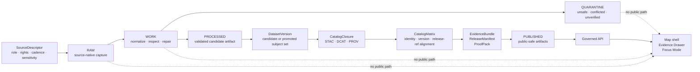

<!-- [KFM_META_BLOCK_V2]
doc_id: kfm://doc/NEEDS_VERIFICATION__docs_catalog_stac_readme
title: KFM STAC Catalog Documentation
type: standard
version: v1
status: draft
owners: @bartytime4life NEEDS_VERIFICATION: confirm CODEOWNERS / catalog steward
created: 2026-04-27
updated: 2026-05-06
policy_label: NEEDS_VERIFICATION
related: [../README.md, ../dcat/README.md, ../../standards/KFM_STAC_PROFILE.md, ../../../data/catalog/README.md, ../../../data/catalog/stac/README.md, ../../../data/catalog/dcat/README.md, ../../../contracts/v1/catalog/stac/kfm_stac_item.schema.json, ../../../schemas/catalog/stac_collection.schema.json, ../../../policy/catalog/stac/README.md, ../../../policy/catalog/stac/stac_item_gate.rego, ../../../tools/validators/catalog/validate_stac_item.py, ../../../tools/catalog/catalog_crosslink.py, ../../../scripts/catalog_validate.py, ../../../apps/api/server.py, ../../../apps/web/src/ecology/stac.ts, ../../adr/ADR-0018-prov-stac-dcat-catalog-mapping.md, ../../adr/ADR-0001-schema-home.md]
tags: [kfm, catalog, stac, metadata, publication, evidence, release, docs]
notes: [Target path was inspected through the GitHub connector on main. Local mounted repository checkout was not available in this session. The docs/catalog/stac role is documentation/profile guidance; generated STAC payloads belong under data/catalog/stac. docs/catalog/prov/README.md was not found during connector inspection and remains NEEDS VERIFICATION. Schema-home authority remains in transition: ADR-0001 proposes schemas/contracts/v1, while current STAC item and collection schema files are split across contracts/v1 and schemas/catalog. Owner, policy label, doc_id, link health, workflow execution, and branch protection status require repo-local verification before publication.]
[/KFM_META_BLOCK_V2] -->

<a id="top"></a>

# KFM STAC Catalog Documentation

Human-facing guidance for KFM’s STAC documentation lane: profile, review, validation, and catalog-closure rules for release-linked spatiotemporal asset discovery.

<p align="center">
  
  
  
  
  
  
</p>

> [!IMPORTANT]
> **Status:** `experimental` · **Document state:** `draft` · **Owners:** `@bartytime4life` + `NEEDS_VERIFICATION`  
> **Path:** `docs/catalog/stac/README.md`  
> **Repo fit:** human-readable STAC documentation and profile guidance. Generated STAC Catalog, Collection, and Item payloads belong under `data/catalog/stac/`.  
> **Truth posture:** `CONFIRMED` repo/documentation surfaces · `PROPOSED` guidance and workflow expansions · `NEEDS VERIFICATION` for owner routing, workflow enforcement, profile namespace, branch protection, and release maturity.

<p align="center">
  <a href="#scope">Scope</a> ·
  <a href="#repo-fit">Repo fit</a> ·
  <a href="#accepted-inputs">Inputs</a> ·
  <a href="#exclusions">Exclusions</a> ·
  <a href="#directory-tree">Tree</a> ·
  <a href="#quickstart">Quickstart</a> ·
  <a href="#lifecycle">Lifecycle</a> ·
  <a href="#stac-role-inside-kfm">STAC role</a> ·
  <a href="#required-kfm-linkage">Linkage</a> ·
  <a href="#validation-gates">Validation</a> ·
  <a href="#example-item-fragment">Example</a> ·
  <a href="#definition-of-done">Done</a> ·
  <a href="#faq">FAQ</a>
</p>

> [!CAUTION]
> A valid STAC record is not automatically publishable KFM output. KFM requires evidence, provenance, rights, sensitivity, review, release, correction, and rollback closure before public or semi-public discovery can carry consequential meaning.

---

## Scope

`docs/catalog/stac/` documents how KFM uses STAC as an outward discovery profile for spatiotemporal assets.

This lane is responsible for reviewer-facing and maintainer-facing guidance:

- what STAC is allowed to describe in KFM,
- how STAC relates to DCAT, PROV, `CatalogClosure`, `CatalogMatrix`, `EvidenceBundle`, and `ReleaseManifest`,
- which KFM-specific fields and links are expected by profile or validator,
- what must fail closed before public discovery,
- which examples are illustrative rather than release artifacts,
- how maintainers avoid drift between docs, generated catalog records, schemas, policy, and API/UI behavior.

### This README is authoritative for

| Area | Status | Rule |
|---|---:|---|
| Documentation lane role | **CONFIRMED** | `docs/catalog/stac/` explains STAC posture; it is not the payload lane. |
| STAC as discovery surface | **CONFIRMED doctrine** | STAC helps users discover release-linked spatiotemporal assets; it is not canonical truth. |
| Catalog closure posture | **CONFIRMED doctrine / repo-supported** | STAC should close with DCAT, PROV, release, evidence, and proof surfaces before public use. |
| Local implementation status | **NEEDS VERIFICATION** | This session inspected remote repo files through GitHub, not a mounted local checkout or CI run. |
| Future docs expansion | **PROPOSED** | Add profile, validation, and decision docs only when they reduce ambiguity. |

### This README is not

- a STAC payload,
- a STAC API route,
- a machine schema,
- a policy gate,
- a proof pack,
- a release approval,
- a catalog generator,
- an EvidenceBundle,
- a replacement for `docs/standards/KFM_STAC_PROFILE.md`,
- proof that a workflow passed.

[Back to top](#top)

---

## Repo fit

### Path role

```text
docs/catalog/stac/README.md
```

This file belongs under `docs/` because it is human-facing catalog documentation. It should guide maintainers and reviewers, not carry release artifacts.

### Confirmed and adjacent surfaces

| Surface | Role | Status |
|---|---|---:|
| `docs/catalog/stac/README.md` | This documentation lane | **CONFIRMED on inspected `main`** |
| `docs/catalog/README.md` | Parent catalog documentation hub | **CONFIRMED** |
| `docs/catalog/dcat/README.md` | Sibling DCAT documentation lane | **CONFIRMED** |
| `docs/catalog/prov/README.md` | Possible sibling PROV documentation lane | **NEEDS VERIFICATION / not found during inspection** |
| `data/catalog/README.md` | Catalog metadata seam | **CONFIRMED** |
| `data/catalog/stac/README.md` | Generated or release-bearing STAC catalog surface | **CONFIRMED** |
| `data/catalog/dcat/README.md` | Generated or release-bearing DCAT surface | **CONFIRMED** |
| `docs/standards/KFM_STAC_PROFILE.md` | KFM STAC profile standard | **CONFIRMED** |
| `docs/adr/ADR-0018-prov-stac-dcat-catalog-mapping.md` | Catalog mapping ADR | **CONFIRMED** |
| `docs/adr/ADR-0001-schema-home.md` | Schema-home decision record | **CONFIRMED / proposed decision** |

### Implementation-adjacent surfaces

| Surface | Role | Status |
|---|---|---:|
| `contracts/v1/catalog/stac/kfm_stac_item.schema.json` | Current KFM STAC Item schema used by validator | **CONFIRMED** |
| `schemas/catalog/stac_collection.schema.json` | Current KFM STAC Collection schema | **CONFIRMED** |
| `tools/validators/catalog/validate_stac_item.py` | STAC Item validator | **CONFIRMED** |
| `policy/catalog/stac/README.md` | STAC policy lane overview | **CONFIRMED** |
| `policy/catalog/stac/stac_item_gate.rego` | STAC Item deny-by-default policy gate | **CONFIRMED** |
| `scripts/catalog_validate.py` | Catalog README scaffold checker | **CONFIRMED** |
| `tools/catalog/catalog_crosslink.py` | STAC/DCAT/PROV triplet cross-link checker | **CONFIRMED** |
| `apps/api/server.py` | Ecology API includes STAC catalog endpoint | **CONFIRMED for ecology dry-run slice** |
| `apps/web/src/ecology/stac.ts` | Web client adapter for ecology STAC catalog | **CONFIRMED for ecology dry-run slice** |

> [!NOTE]
> The repo currently shows an active schema-placement split: STAC Item validation uses `contracts/v1/catalog/stac/kfm_stac_item.schema.json`, while STAC Collection schema material exists under `schemas/catalog/`. ADR-0001 proposes `schemas/contracts/v1/` as the future canonical machine-schema home. Do not silently move, duplicate, or rename these surfaces without an ADR-backed migration.

### Safe responsibility split

| Path family | Safe role |
|---|---|
| `docs/catalog/stac/` | Human-readable STAC documentation, profile explanation, review notes, and non-production examples. |
| `docs/standards/KFM_STAC_PROFILE.md` | KFM STAC profile standard and profile vocabulary. |
| `data/catalog/stac/` | Generated or release-bearing STAC Catalog, Collection, and Item records. |
| `contracts/` / `schemas/` | Machine-readable schema surfaces, pending accepted schema-home policy. |
| `policy/catalog/stac/` | Deny-by-default catalog-publication policy. |
| `tools/validators/catalog/` | Validator implementation. |
| `tools/catalog/` | Cross-link and closure helpers. |
| `apps/api/` and `apps/web/` | Governed runtime and client consumers, not catalog authority. |

[Back to top](#top)

---

## Accepted inputs

Put material here when it helps maintainers understand, review, or safely evolve the STAC documentation and profile relationship.

| Accepted input | Belongs here when… | Status |
|---|---|---:|
| STAC documentation guidance | It explains KFM’s STAC role without becoming payload authority. | **CONFIRMED** |
| KFM STAC profile notes | It summarizes or links to `docs/standards/KFM_STAC_PROFILE.md`. | **CONFIRMED / link verified** |
| Review checklists | It helps reviewers check release, evidence, rights, sensitivity, and closure. | **PROPOSED** |
| STAC/DCAT/PROV crosswalk notes | It clarifies catalog triplet responsibilities and links to ADR-0018. | **PROPOSED** |
| Validator usage notes | It references repo-confirmed validator entrypoints without inventing CI status. | **CONFIRMED entrypoints / NEEDS VERIFICATION execution** |
| Illustrative STAC snippets | They are clearly labeled as examples, not emitted release artifacts. | **PROPOSED** |
| Catalog failure-mode notes | They help contributors identify deny, abstain, error, and hold conditions. | **CONFIRMED doctrine / PROPOSED examples** |
| Verification backlog | It captures owner, schema-home, profile-namespace, workflow, and release gaps. | **CONFIRMED need** |

### Example-status rule

Any example checked in under this docs lane must state whether it is:

| Example status | Meaning |
|---|---|
| `illustrative` | Shows intent only; not a validator fixture or release artifact. |
| `fixture` | Used by tests; must name validator and expected outcome. |
| `generated` | Produced by a repo tool; must name generator, inputs, and receipt. |
| `release-bearing` | Part of a release; should not live primarily under this docs path. |

[Back to top](#top)

---

## Exclusions

Do **not** place these in `docs/catalog/stac/`.

| Excluded material | Correct home | Why |
|---|---|---|
| Generated STAC Catalog / Collection / Item JSON | `data/catalog/stac/` | Generated catalog records are catalog artifacts, not docs. |
| RAW source downloads | `data/raw/` | RAW preserves source-native capture and checksums. |
| WORK or QUARANTINE artifacts | `data/work/` or `data/quarantine/` | Unresolved material must not become discoverable. |
| Processed payloads | `data/processed/` | STAC describes assets; it does not store canonical processed data. |
| Published binaries, tiles, COGs, PMTiles, GeoParquet | `data/published/` or verified release artifact lane | STAC links to assets; it is not the asset store. |
| EvidenceBundle or proof packs | `data/proofs/` or verified proof lane | Evidence and proof stay first-class. |
| Run receipts or transform receipts | `data/receipts/` | Receipts are process memory, not docs. |
| Policy code | `policy/catalog/stac/` | Publication policy must remain executable and reviewable. |
| JSON Schemas | `contracts/`, `schemas/`, or accepted schema home | Docs must not become machine-schema authority. |
| Raw model output or AI summaries | Governed runtime envelope / AI receipt surfaces | AI is interpretive, not catalog truth. |
| Credentials, private source URLs, tokens | Never commit | Catalog docs must be public-review safe unless explicitly restricted. |
| Sensitive exact locations | Restricted release lane or generalized public derivative | Discovery metadata can leak sensitive places. |

> [!WARNING]
> A “metadata-only” STAC object can still expose sensitive location, rights, source, or release information. Treat public catalog metadata as publication-relevant.

[Back to top](#top)

---

## Directory tree

### Confirmed documentation lane

```text
docs/catalog/
├── README.md
├── dcat/
│   └── README.md
└── stac/
    └── README.md
```

`docs/catalog/prov/README.md` was not found during inspection. Add it only through a reviewed follow-up if the documentation control plane needs a PROV-specific docs lane.

### Confirmed adjacent artifact lane

```text
data/catalog/
├── README.md
├── dcat/
│   └── README.md
└── stac/
    └── README.md
```

### Proposed documentation expansion

Add these only if they reduce review friction and do not duplicate the standards/profile lane.

```text
docs/catalog/stac/
├── README.md
├── validation.md                  # PROPOSED: validator and review procedure
├── crosswalk.md                   # PROPOSED: STAC/DCAT/PROV/KFM object mapping
├── examples/
│   ├── README.md                  # PROPOSED: example status rules
│   └── item.illustrative.json      # PROPOSED: non-production snippet
└── decisions/
    └── ADR-stac-doc-vs-artifact-home.md # PROPOSED only if placement conflict returns
```

> [!TIP]
> Prefer fewer durable docs over many thin, overlapping files. KFM documentation should reduce uncertainty, not multiply places where truth can drift.

[Back to top](#top)

---

## Quickstart

Run these checks from the repository root after mounting a real checkout.

### 1. Inspect the documentation and catalog lanes

```bash
git status --short
git branch --show-current || true

find docs/catalog data/catalog -maxdepth 4 -type f | sort
```

### 2. Verify the README scaffold expected by current repo tooling

```bash
python scripts/catalog_validate.py
```

`catalog_validate.py` currently checks required catalog README scaffold paths. It is not a STAC payload validator.

### 3. Validate a KFM STAC Item candidate

```bash
python tools/validators/catalog/validate_stac_item.py \
  data/catalog/stac/<collection>/<release>/<item>.json
```

The validator expects the current item schema at:

```text
contracts/v1/catalog/stac/kfm_stac_item.schema.json
```

### 4. Cross-link catalog triplet references

```bash
python tools/catalog/catalog_crosslink.py \
  --decision data/proofs/<domain>/<release>/promotion_decision.json \
  --record data/proofs/<domain>/<release>/promotion_record.json \
  --output data/proofs/<domain>/<release>/catalog_crosslink_report.json
```

### 5. Inspect STAC policy posture

```bash
sed -n '1,220p' policy/catalog/stac/README.md
sed -n '1,260p' policy/catalog/stac/stac_item_gate.rego
```

> [!NOTE]
> Policy runner integration, CI workflow enforcement, and branch protection status were not verified in this documentation revision. Treat command availability as repository file evidence, not proof of passing gates.

[Back to top](#top)

---

## Lifecycle

STAC lives at the `CATALOG / TRIPLET` seam. It is downstream of source intake and processing, and upstream of governed discovery.



### Lifecycle rules

| Stage | STAC posture |
|---|---|
| `RAW` | No public STAC. Do not expose raw paths, source tokens, private service URLs, or source-native sensitive geometry. |
| `WORK` | No public STAC. Work products may inform candidate metadata only after validation. |
| `QUARANTINE` | No public STAC except restricted review notes, if policy allows. |
| `PROCESSED` | Candidate inputs for catalog closure may be generated. |
| `CATALOG / TRIPLET` | STAC/DCAT/PROV records can be cross-linked and validated. |
| `PUBLISHED` | Public STAC is allowed only when release, proof, evidence, rights, sensitivity, review, and rollback posture close. |

[Back to top](#top)

---

## STAC role inside KFM

STAC is the outward discovery carrier for spatiotemporal assets. It is useful because it gives map, API, catalog, and export consumers a predictable way to find spatial-temporal assets and their metadata.

It is dangerous when treated as proof.

| STAC surface | KFM role | Must not become |
|---|---|---|
| `Catalog` | Navigation root for release-safe STAC resources | Canonical store, policy gate, or release authority |
| `Collection` | Stable asset or dataset-family grouping | Source authority, steward approval, or proof of publishability |
| `Item` | Spatiotemporal asset metadata and footprint | Proof that a claim is true |
| `Asset` | Link to a released or release-candidate file/service | The artifact’s integrity proof unless digest/release closure resolves |
| STAC API | Optional discovery endpoint | RAW/WORK/QUARANTINE query path or governed API replacement |

### KFM catalog triplet

| Surface | Primary job | KFM expectation |
|---|---|---|
| STAC | Spatiotemporal asset, item, collection, and asset-link discovery | Describes release-safe spatial/temporal assets. |
| DCAT | Dataset, distribution, access, rights, and publisher-facing discovery | Describes outward dataset/distribution scope. |
| PROV | Lineage, activities, agents, and derivation | Explains how released material was generated or corrected. |
| KFM governance objects | Policy, review, release, evidence, correction, rollback | Stay first-class; linked but not flattened into STAC. |

[Back to top](#top)

---

## Required KFM linkage

A KFM STAC Item should resolve to the following support when it is release-bearing or public-facing.

| Link or field | Current repo evidence | Purpose |
|---|---:|---|
| `kfm:spec_hash` | **CONFIRMED in item schema and validator** | Stable profile/spec identity anchor. |
| `kfm:evidence_ref` | **CONFIRMED in item schema, validator, and policy** | Points toward EvidenceBundle support. |
| `kfm:run_receipt_url` | **CONFIRMED in item schema and validator** | Connects generated output to process memory. |
| `kfm:release_manifest_ref` | **CONFIRMED in item schema, validator, and policy** | Connects discovery to release scope. |
| `kfm:policy_label` | **CONFIRMED in item schema, validator, and policy** | Must be `public` for public STAC Item export. |
| `kfm:review_state` | **CONFIRMED in item schema, validator, and policy** | Must be `reviewed` or `published` for public STAC Item export. |
| `kfm:source_role` | **CONFIRMED in item schema, validator, and policy** | Makes support role visible. |
| `kfm:sensitivity` | **CONFIRMED optional field with public-only gate** | Prevents restricted sensitivity from leaking into public export. |
| `provenance` link | **CONFIRMED validator requirement** | Resolves lineage sidecar or provenance object. |
| `evidence` link | **CONFIRMED validator requirement** | Resolves evidence support. |
| `release-manifest` link | **CONFIRMED validator requirement** | Resolves release manifest. |
| `assets.data` | **CONFIRMED validator requirement** | Points to release-safe data asset. |
| `assets.provenance` | **CONFIRMED validator and policy requirement** | Points to provenance asset. |

### Profile namespace caution

The STAC profile document defines `kfm:*` starter-field intent, but the final extension namespace / schema URI remains **NEEDS VERIFICATION**. Do not claim a formal deployed KFM STAC extension unless the namespace, schema, fixtures, and validator behavior are reviewed together.

[Back to top](#top)

---

## Validation gates

STAC validity is necessary but insufficient. KFM publication requires STAC validity plus evidence, provenance, policy, release, and correction closure.

| Gate | Repo evidence | Pass condition | Fail-closed posture |
|---|---:|---|---|
| README scaffold | **CONFIRMED script** | Required `data/catalog/*/README.md` scaffold exists. | `ERROR` / scaffold repair required. |
| STAC Item schema | **CONFIRMED validator + schema** | Item validates against current KFM item schema. | `DENY` with schema error. |
| Public policy label | **CONFIRMED validator + Rego** | `kfm:policy_label` is `public`. | `DENY`. |
| Review state | **CONFIRMED validator + Rego** | `kfm:review_state` is `reviewed` or `published`. | `DENY`. |
| Sensitivity | **CONFIRMED validator + Rego** | `kfm:sensitivity` is absent or `public`. | `DENY`. |
| Evidence link | **CONFIRMED validator + Rego** | `kfm:evidence_ref` and `rel=evidence` are present. | `ABSTAIN` or `DENY`, depending on release context. |
| Provenance link | **CONFIRMED validator + Rego** | `rel=provenance` and `assets.provenance` are present. | `DENY`. |
| Release link | **CONFIRMED validator + Rego** | `kfm:release_manifest_ref` and `rel=release-manifest` are present. | `DENY`. |
| Lifecycle-path safety | **CONFIRMED validator + Rego** | No RAW / WORK / QUARANTINE references in public export. | `DENY`. |
| Catalog triplet closure | **CONFIRMED helper** | STAC, DCAT, and PROV refs align on subject, version, and release ref. | `FAIL` / block publication. |
| Workflow enforcement | **NEEDS VERIFICATION** | CI or local validation report proves the gates ran. | Keep status draft/review; do not claim enforcement. |

### Negative-path checks

At minimum, STAC review should reject or hold objects where:

- public Item points to `data/raw/`, `data/work/`, or `data/quarantine/`,
- `kfm:evidence_ref` is missing,
- `kfm:release_manifest_ref` is missing,
- `assets.provenance` is missing,
- review state is not `reviewed` or `published`,
- sensitivity is not public for a public export,
- `STAC`, `DCAT`, and `PROV` refs disagree on subject, version, or release,
- correction or supersession silently overwrites prior release state,
- generated AI language is presented as evidence.

[Back to top](#top)

---

## API and UI consumers

KFM has an ecology dry-run slice that consumes STAC through governed runtime surfaces.

| Consumer | Confirmed behavior | Boundary |
|---|---|---|
| `apps/api/server.py` | Exposes `/api/ecology/catalog/stac` and legacy `/ecology/catalog/stac`. | Loads `stac_catalog.json` only after public-release checks pass. |
| `apps/web/src/ecology/stac.ts` | Fetches `${apiBase}/ecology/catalog/stac`. | Client consumes governed API output, not raw catalog internals. |

> [!IMPORTANT]
> The ecology endpoint is implementation evidence for an ecology dry-run path. It does not prove every domain has a STAC endpoint, that public deployment is active, or that all workflow gates have passed.

[Back to top](#top)

---

## Example Item fragment

This fragment is illustrative. It mirrors the current KFM STAC Item validator expectations, but it is **not** a release artifact and should not be committed as production data without validator output and release closure.

```json
{
  "type": "Feature",
  "stac_version": "1.1.0",
  "id": "illustrative-kfm-stac-item",
  "collection": "illustrative-kfm-collection",
  "bbox": [-102.1, 36.9, -94.5, 40.1],
  "geometry": {
    "type": "Polygon",
    "coordinates": [[
      [-102.1, 36.9],
      [-94.5, 36.9],
      [-94.5, 40.1],
      [-102.1, 40.1],
      [-102.1, 36.9]
    ]]
  },
  "properties": {
    "datetime": "2026-05-06T00:00:00Z",
    "kfm:spec_hash": "sha256:0000000000000000000000000000000000000000000000000000000000000000",
    "kfm:evidence_ref": "kfm://evidence/illustrative",
    "kfm:run_receipt_url": "https://example.invalid/kfm/receipts/illustrative-run-receipt.json",
    "kfm:release_manifest_ref": "kfm://release-manifest/illustrative",
    "kfm:policy_label": "public",
    "kfm:review_state": "reviewed",
    "kfm:source_role": "illustrative_source_role",
    "kfm:sensitivity": "public",
    "processing:software": "kfm-illustrative-generator",
    "processing:version": "v0",
    "processing:datetime": "2026-05-06T00:00:00Z"
  },
  "links": [
    {
      "rel": "provenance",
      "href": "https://example.invalid/kfm/prov/illustrative.prov.jsonld",
      "type": "application/ld+json"
    },
    {
      "rel": "evidence",
      "href": "https://example.invalid/kfm/proofs/illustrative/evidence_bundle.json",
      "type": "application/json"
    },
    {
      "rel": "release-manifest",
      "href": "https://example.invalid/kfm/proofs/illustrative/release_manifest.json",
      "type": "application/json"
    }
  ],
  "assets": {
    "data": {
      "href": "https://example.invalid/kfm/published/illustrative/data.geojson",
      "type": "application/geo+json",
      "roles": ["data"],
      "title": "Illustrative public-safe data asset"
    },
    "provenance": {
      "href": "https://example.invalid/kfm/prov/illustrative.prov.jsonld",
      "type": "application/ld+json",
      "roles": ["metadata", "provenance"],
      "title": "Illustrative PROV sidecar"
    }
  }
}
```

> [!WARNING]
> The `sha256:000...` value above is a syntactic placeholder, not an integrity claim. Replace illustrative hashes with real digest evidence before fixture or release use.

[Back to top](#top)

---

## Usage guidance

### Use STAC when

| Case | Fit |
|---|---|
| Asset has spatial and temporal footprint | Strong fit. |
| Asset is a released COG, GeoParquet, PMTiles, raster, vector, or derived package | Strong fit if release-linked. |
| Dataset needs item/collection discovery | Strong fit when Collection/Item semantics are useful. |
| Map UI needs discoverable asset metadata | Good fit through governed API. |
| Public user needs evidence drill-through | Fit only when STAC links to EvidenceBundle / release / provenance. |

### Do not use STAC when

| Case | Why not |
|---|---|
| You need to prove a claim | Use EvidenceBundle and proof objects. |
| You need to decide rights or sensitivity | Use policy and review records. |
| You need to publish a release | Use release manifest / promotion decision. |
| You need to expose raw source data | Public STAC must not expose RAW. |
| You need direct model context for AI | Use governed AI envelope after evidence resolution. |
| You need canonical entity storage | Use canonical internal stores and governed interfaces. |

### Sensitive discovery posture

| Condition | Default posture |
|---|---|
| Unknown rights | Hold or deny public discovery. |
| Restricted sensitivity | Withhold, generalize, restrict, or metadata-only publish after review. |
| Exact sensitive geometry | Deny public export unless explicitly released through policy/review. |
| Missing evidence | Abstain from consequential claims or block release. |
| Missing provenance | Block public release. |
| Missing rollback/correction posture | Hold release-bearing catalog change. |

[Back to top](#top)

---

## Definition of done

A revision to this README is ready for review when:

- [ ] KFM Meta Block V2 remains present and synchronized with the visible title.
- [ ] Owner and policy label placeholders are either verified or explicitly preserved as `NEEDS VERIFICATION`.
- [ ] Relative links are verified from `docs/catalog/stac/README.md`.
- [ ] The distinction between `docs/catalog/stac/` and `data/catalog/stac/` remains clear.
- [ ] Any implementation claims are backed by inspected repo files, commands, tests, workflow output, or generated artifacts.
- [ ] `docs/catalog/prov/README.md` is not linked as existing unless it is added or verified.
- [ ] Schema-home language respects ADR-0001’s proposed status and the current repo split.
- [ ] Validator commands match current file signatures.
- [ ] Any example is labeled `illustrative`, `fixture`, `generated`, or `release-bearing`.
- [ ] No text implies STAC validity alone equals publication readiness.
- [ ] Public-facing posture preserves evidence, provenance, policy, review, release, correction, and rollback gates.

A STAC payload is closer to done when:

- [ ] STAC Item schema validation passes.
- [ ] STAC policy gate allows the intended audience.
- [ ] `kfm:evidence_ref` resolves to an EvidenceBundle or the release explicitly abstains from consequential claims.
- [ ] Provenance link and `assets.provenance` exist.
- [ ] `kfm:release_manifest_ref` resolves to release closure.
- [ ] STAC/DCAT/PROV subject, version, and release refs align.
- [ ] No RAW, WORK, QUARANTINE, private, restricted, or sensitive exact-location paths leak.
- [ ] Correction, supersession, withdrawal, and rollback posture is visible when applicable.

[Back to top](#top)

---

## Rollback

Rollback this README change if it:

- creates a competing docs/schema/profile authority,
- blurs docs payloads with generated catalog artifacts,
- implies workflow enforcement that was not verified,
- weakens public-safe catalog posture,
- normalizes public access to RAW / WORK / QUARANTINE,
- claims schema-home acceptance when ADR-0001 remains proposed,
- hides the current `contracts/v1` versus `schemas/catalog` split,
- removes visible uncertainty around owners, policy label, profile namespace, or release maturity.

Rollback target:

```text
ROLLBACK_TARGET_NEEDS_VERIFICATION_AFTER_BRANCH_CHECK
```

Suggested rollback behavior:

| Trigger | Action |
|---|---|
| Link targets fail | Mark as `NEEDS VERIFICATION` or update after branch-local check. |
| Schema-home ADR changes | Update this README and validator references together. |
| STAC profile field names change | Add a migration note and update examples. |
| Policy gate changes | Update validation table and negative-path checklist. |
| API route changes | Update API/UI consumer table only after code inspection. |

[Back to top](#top)

---

## FAQ

### Is STAC a KFM truth source?

No. STAC is a discovery surface. KFM truth depends on source roles, evidence bundles, validation, policy, review, release state, correction lineage, and rollback.

### Does this README prove STAC payloads are published?

No. It documents the STAC docs lane. Payload publication requires validated catalog records, proof objects, release manifests, and policy/review closure.

### Where do STAC JSON records belong?

Generated or release-bearing STAC JSON belongs under `data/catalog/stac/` or another verified catalog artifact lane, not under `docs/catalog/stac/`.

### Can Focus Mode answer from STAC alone?

No. STAC can provide catalog context. Focus Mode must use governed backend flow with EvidenceBundle resolution, citation validation, policy checks, and finite outcomes.

### Why does this README mention both `contracts/` and `schemas/`?

The active repo contains STAC schema surfaces in both areas, while ADR-0001 proposes `schemas/contracts/v1/` as the future canonical machine-schema home. This README preserves that uncertainty instead of pretending it is resolved.

### What if a STAC Item is useful but rights are unclear?

Fail closed. Hold, quarantine, restrict, redact, generalize, or abstain until rights and release posture are resolved.

### What if STAC, DCAT, and PROV disagree?

Treat it as a catalog closure failure. Do not paper over disagreement with prose. Hold release until subject, version, release refs, and digests align or a reviewed exception exists.

[Back to top](#top)

---

## Appendix

<details>
<summary><strong>Appendix A — STAC review checklist</strong></summary>

| Check | Expected result |
|---|---|
| STAC object class is correct | Catalog, Collection, Item, Asset, and Link roles are not collapsed. |
| `stac_version` is present | Use current profile target unless a release-specific exception exists. |
| `kfm:spec_hash` is present | Hash is real for release/fixture use. |
| `kfm:evidence_ref` is present | Evidence can resolve or release abstains from consequential claims. |
| `kfm:run_receipt_url` is present | Process memory is linkable. |
| `kfm:release_manifest_ref` is present | Release closure is linkable. |
| Policy label is public for public export | No hidden restricted state. |
| Review state is `reviewed` or `published` | Public export does not outrun review. |
| `assets.data` exists | Asset is discoverable. |
| `assets.provenance` exists | Lineage is discoverable. |
| Required links exist | `provenance`, `evidence`, and `release-manifest`. |
| No internal lifecycle path leaks | No `data/raw/`, `data/work/`, or `data/quarantine/`. |
| STAC/DCAT/PROV closure aligns | Subject, version, and release refs agree. |
| Correction lineage exists where needed | No silent overwrite of public meaning. |

</details>

<details>
<summary><strong>Appendix B — common anti-patterns</strong></summary>

| Anti-pattern | Required disposition |
|---|---|
| Valid STAC Item with no EvidenceBundle link | `ABSTAIN` or block release. |
| Public STAC Item with restricted sensitivity | `DENY`. |
| STAC asset points to RAW / WORK / QUARANTINE | `DENY`. |
| Missing provenance asset | `DENY`. |
| Missing release manifest ref | `DENY`. |
| Unknown rights hidden behind vague metadata | Hold or deny. |
| DCAT says one subject while STAC says another | Catalog closure failure. |
| PROV sidecar absent after release | Suppress current discovery until repaired. |
| AI summary embedded as STAC truth | Remove; route through governed AI envelope. |
| Corrected item deleted instead of superseded | Restore lineage and add correction notice. |

</details>

<details>
<summary><strong>Appendix C — external standards anchors</strong></summary>

These links support vocabulary and profile alignment only. KFM release readiness still depends on KFM evidence, policy, review, release, proof, and catalog-closure gates.

- [OGC STAC standards page][ogc-stac]
- [OGC STAC Community Standard 1.1.0][ogc-stac-core]
- [OGC STAC API Community Standard 1.0.0][ogc-stac-api]
- [STAC Extensions index][stac-extensions]
- [W3C DCAT Version 3][w3c-dcat]
- [W3C PROV-O][w3c-prov-o]

</details>

[ogc-stac]: https://www.ogc.org/standards/stac/
[ogc-stac-core]: https://docs.ogc.org/cs/25-004/25-004.html
[ogc-stac-api]: https://docs.ogc.org/cs/25-005/25-005.html
[stac-extensions]: https://stac-extensions.github.io/
[w3c-dcat]: https://www.w3.org/TR/vocab-dcat-3/
[w3c-prov-o]: https://www.w3.org/TR/prov-o/

[Back to top](#top)
