<!-- [KFM_META_BLOCK_V2]
doc_id: kfm://doc/NEEDS_VERIFICATION
title: KFM STAC Catalog Documentation
type: standard
version: v1
status: draft
owners: NEEDS_VERIFICATION
created: 2026-04-27
updated: 2026-05-03
policy_label: NEEDS_VERIFICATION
related: [NEEDS_VERIFICATION: docs/catalog/README.md, NEEDS_VERIFICATION: docs/catalog/stac/README.md, NEEDS_VERIFICATION: data/catalog/stac/README.md, NEEDS_VERIFICATION: docs/catalog/dcat/README.md, NEEDS_VERIFICATION: docs/catalog/prov/README.md, NEEDS_VERIFICATION: CatalogClosure schema, NEEDS_VERIFICATION: CatalogMatrix schema, NEEDS_VERIFICATION: ReleaseManifest schema, NEEDS_VERIFICATION: EvidenceBundle schema]
tags: [kfm, catalog, stac, metadata, publication, evidence, release]
notes: [Bounded revision of an attached Markdown draft. Target repo was not mounted in the current workspace; doc_id, owners, policy label, adjacent paths, schema homes, validator commands, emitted artifact paths, and public-main placement require branch-local verification. The updated date reflects this revision run, not a verified commit date.]
[/KFM_META_BLOCK_V2] -->

# KFM STAC Catalog Documentation

Defines STAC as a governed outward catalog surface for KFM spatiotemporal assets—not canonical truth, release approval, policy authority, or evidence proof by itself.

<div align="center">


</div>

> [!IMPORTANT]
> **Status:** `draft / NEEDS_VERIFICATION`  
> **Owners:** `OWNER_TBD`  
> **Proposed path:** `docs/catalog/stac/README.md`  
> **Path conflict to resolve:** `data/catalog/stac/README.md` may be the emitted catalog-lane README if the active repo confirms that layout.  
> **Authority:** human-readable STAC profile guidance and release-gate documentation.  
> **Truth posture:** CONFIRMED KFM doctrine / PROPOSED path and implementation details / UNKNOWN mounted repo implementation depth.

**Quick jumps:** [Scope](#scope) · [Repo fit](#repo-fit) · [Inputs](#inputs) · [Exclusions](#exclusions) · [Directory tree](#directory-tree) · [Lifecycle](#lifecycle) · [STAC role inside KFM](#stac-role-inside-kfm) · [Required KFM linkage](#required-kfm-linkage) · [Validation gates](#validation-gates) · [Usage guidance](#usage-guidance) · [Maintainer checklist](#maintainer-checklist) · [FAQ](#faq) · [Appendix](#appendix)

> [!NOTE]
> This document states KFM doctrine where supported by the project corpus. Current implementation depth remains **UNKNOWN** where repo files, tests, workflows, dashboards, logs, emitted STAC records, validator outputs, or proof artifacts were not inspected.

---

## Scope

This README documents the **KFM STAC profile and operating rules** for catalog-facing spatiotemporal assets.

Use this document to answer:

- which STAC surfaces KFM may expose,
- what KFM governance objects must exist before STAC publication,
- how STAC relates to `CatalogClosure`, `CatalogMatrix`, DCAT, PROV, `ReleaseManifest`, and `EvidenceBundle`,
- which KFM references and review states should be available for trust drill-through,
- what fails closed before any STAC object becomes public or semi-public.

### What this README is authoritative for

| Area | Posture | Rule |
|---|---:|---|
| STAC documentation role | **CONFIRMED doctrine / PROPOSED local doc home** | STAC is outward catalog metadata for spatiotemporal assets. |
| Catalog closure | **CONFIRMED doctrine** | STAC belongs beside DCAT and PROV inside catalog closure, not as an isolated metadata island. |
| Release eligibility | **CONFIRMED doctrine** | STAC visibility requires rights, sensitivity, evidence, policy, review, release, and rollback support appropriate to significance. |
| Exact repo implementation | **UNKNOWN** | Mounted checkout evidence was unavailable; validators, routes, schema homes, and emitted artifacts require repo-side verification. |

### Non-goals

This README does not:

- define a live STAC API route,
- prove that STAC artifacts are emitted by the current repo,
- settle `schemas/` versus `contracts/` authority,
- approve any source or asset for publication,
- create a KFM STAC extension by itself,
- make generated catalog metadata authoritative truth.

[Back to top](#kfm-stac-catalog-documentation)

---

## Repo fit

### Proposed path role

`docs/catalog/stac/README.md` is the **PROPOSED human-readable documentation home** for KFM STAC profile guidance.

It should not become the emitted STAC catalog itself. Generated or released STAC JSON belongs in the catalog artifact lane after branch-local verification.

> [!WARNING]
> Do not maintain two competing STAC authorities. If the active repo already uses `data/catalog/stac/README.md` as the catalog-lane README, keep this file as documentation/profile guidance only, or merge the content through an ADR-backed placement decision.

### Upstream and downstream links

| Direction | Candidate surface | Status | Why it matters |
|---|---|---:|---|
| Parent catalog docs | [`../README.md`](../README.md) | **NEEDS_VERIFICATION** | Catalog documentation index, if present. |
| Docs index | [`../../README.md`](../../README.md) | **NEEDS_VERIFICATION** | Repo-wide documentation entry point, if present. |
| Emitted STAC artifacts | [`../../../data/catalog/stac/`](../../../data/catalog/stac/) | **NEEDS_VERIFICATION** | Likely generated/released STAC artifact home, not a docs home. |
| DCAT companion | [`../dcat/README.md`](../dcat/README.md) | **NEEDS_VERIFICATION** | Dataset/distribution discovery companion. |
| PROV companion | [`../prov/README.md`](../prov/README.md) | **NEEDS_VERIFICATION** | Provenance and lineage companion. |
| Release proofs | [`../../../data/proofs/`](../../../data/proofs/) | **NEEDS_VERIFICATION** | Release-significant proof objects, not ordinary catalog metadata. |
| Receipts | [`../../../data/receipts/`](../../../data/receipts/) | **NEEDS_VERIFICATION** | Process memory, validation reports, and run records. |
| Policy home | [`../../../policy/`](../../../policy/) | **NEEDS_VERIFICATION** | Publication decisions must stay executable and reviewable. |
| Schema / contract home | [`../../../schemas/`](../../../schemas/) or [`../../../contracts/`](../../../contracts/) | **CONFLICTED / NEEDS_VERIFICATION** | Avoid parallel machine-contract authority. |

---

## Inputs

Accepted material for this directory:

| Input | Belongs here? | Notes |
|---|---:|---|
| STAC profile guidance | Yes | Version pinning, required fields, extension stance, and KFM-specific linkage rules. |
| STAC validation checklist | Yes | Human-readable checklist for release reviewers and maintainers. |
| Profile examples | Yes, if labeled | Examples must be clearly marked `illustrative` unless generated from a real release. |
| STAC/DCAT/PROV crosswalk notes | Yes | Keep catalog closure semantics readable and stable. |
| ADRs for catalog-profile choices | Yes | Version pins, extension choices, and namespace decisions should be reviewable. |
| Validator command documentation | Yes, if verified | Use placeholders until the real validator entrypoint is inspected. |
| Catalog release review notes | Yes, if non-sensitive | Notes must not expose private source URLs, credentials, restricted locations, or unreleased records. |

### Minimum example posture

Any checked-in example under this docs path should declare its status:

```json
{
  "example_status": "illustrative",
  "not_a_release_artifact": true,
  "requires_verification_against": [
    "active schema registry",
    "active validator command",
    "release manifest",
    "catalog closure policy",
    "rights and sensitivity review"
  ]
}
```

---

## Exclusions

Do **not** place these in `docs/catalog/stac/`:

| Excluded item | Where it should go instead | Reason |
|---|---|---|
| Generated STAC Catalog / Collection / Item JSON | `data/catalog/stac/` or verified generated-artifact home | Generated catalog output is an artifact, not docs. |
| Raw source data | `data/raw/` or source-edge landing area | RAW must preserve source-native capture and checksums. |
| Work or quarantine files | `data/work/` / `data/quarantine/` | STAC is downstream of validation and hold decisions. |
| Release manifests or proof packs | `data/proofs/`, `release/`, or verified release home | Proofs and releases are separate from catalog metadata. |
| Evidence bundles | Runtime/evidence proof surface | STAC may link to evidence, but does not replace it. |
| Policy code | `policy/` or verified policy home | Policy decisions must remain executable and reviewable. |
| Machine schemas | `schemas/` or `contracts/` after schema-home ADR | This docs path should not become a parallel schema authority. |
| AI summaries or raw model output | Governed runtime envelope / review surface | Generated text is not catalog truth. |
| PMTiles, COGs, GeoParquet, 3D Tiles | Released artifact homes | STAC references assets; it is not the asset store. |
| Credentials, tokens, private source URLs | Never in docs | Publication and source access must stay least-privilege. |
| Sensitive exact locations | Restricted release or generalized public-safe derivative lane | Discovery must not create exposure risk. |

> [!CAUTION]
> A “STAC-looking” document that lacks release, evidence, policy, sensitivity, correction, and rollback linkage can make weak claims look publishable. Treat that as a governance defect, not a formatting issue.

[Back to top](#kfm-stac-catalog-documentation)

---

## Directory tree

Current requested file:

```text
docs/catalog/stac/
└── README.md
```

Proposed documentation expansion, pending repo verification:

```text
docs/catalog/stac/
├── README.md
├── profile.md                         # PROPOSED: KFM STAC profile details
├── validation.md                      # PROPOSED: validator and reviewer checklist
├── extensions.md                      # PROPOSED: approved extension / namespace stance
├── crosswalk.md                       # PROPOSED: STAC/DCAT/PROV/KFM object mapping
├── examples/
│   ├── README.md                      # PROPOSED: example status and safety rules
│   ├── collection.example.json         # PROPOSED: illustrative only
│   └── item.example.json               # PROPOSED: illustrative only
└── decisions/
    ├── ADR-stac-profile-version.md     # PROPOSED: version pin and toolchain decision
    └── ADR-stac-doc-vs-artifact-home.md # PROPOSED: resolve docs/catalog/stac vs data/catalog/stac
```

Adjacent emitted-artifact structure to verify later:

```text
data/catalog/
├── stac/                              # generated / release-bearing STAC output
├── dcat/                              # generated / release-bearing DCAT output
├── prov/                              # generated / release-bearing PROV output
└── matrix/                            # CatalogMatrix closure checks
```

---

## Lifecycle

STAC enters KFM only after upstream governance has done enough work to make outward discovery safe.

```mermaid
flowchart LR
    A[SourceDescriptor<br/>role + rights + cadence + sensitivity] --> B[RAW<br/>source-native capture]
    B --> C[WORK / QUARANTINE<br/>normalize, validate, hold]
    C --> D[PROCESSED<br/>validated candidate outputs]
    D --> E[DatasetVersion<br/>candidate or promoted subject set]
    E --> F[CATALOG / TRIPLET<br/>STAC + DCAT + PROV]
    F --> G[CatalogClosure<br/>cross-catalog consistency]
    G --> H[CatalogMatrix<br/>IDs + checksums + release refs]
    H --> I[ReleaseManifest / ProofPack<br/>public-safe release scope]
    I --> J[PUBLISHED<br/>governed surfaces]
    J --> K[Governed API]
    K --> L[Map / story / export / Focus consumer]
    L --> M[EvidenceBundle drill-through]

    C -. ValidationReport / RunReceipt .-> H
    I -. rollback target .-> N[CorrectionNotice]
    N -. visible lineage .-> J

    B -. no public direct path .-> L
    C -. no public direct path .-> L
    D -. no silent authority .-> L
```



### Reading rule

`CatalogClosure` is the seam.

Upstream of it, KFM is still handling admission, validation, quarantine, source roles, rights, sensitivity, and review. Downstream of it, KFM can expose outward discovery surfaces only if release closure is complete.

[Back to top](#kfm-stac-catalog-documentation)

---

## STAC role inside KFM

| STAC surface | KFM role | Must not be mistaken for |
|---|---|---|
| `Catalog` | Navigation structure for released or release-candidate STAC resources | Canonical store, policy gate, release approval, or evidence bundle |
| `Collection` | Stable grouping for a dataset family or released asset family | Source authority, steward approval, or proof that all assets are publishable |
| `Item` | Spatiotemporal asset footprint and metadata | Proof that a claim is true |
| `Asset` | Link to a file or deliverable such as COG, GeoParquet, PMTiles, imagery, vector, or derived artifact | The artifact itself, unless separately resolved and hashed |
| STAC API | Optional dynamic discovery/query surface | Raw/internal query path or governed API replacement |

### Static catalog first

KFM should prefer **static, release-bundled STAC** for early catalog slices because it is easier to hash, review, sign, publish, mirror, and roll back.

Dynamic STAC API behavior is **OPTIONAL / NEEDS_VERIFICATION** and must not route users into RAW, WORK, QUARANTINE, unpublished canonical stores, or private source material.

---

## Required KFM linkage

KFM STAC records should carry or resolve to the following references once the profile is implemented.

| KFM reference | Expected purpose | Status |
|---|---|---:|
| `kfm:catalog_closure_ref` | Connects record to STAC/DCAT/PROV closure set | **PROPOSED** |
| `kfm:catalog_matrix_ref` | Connects IDs, hashes, release refs, and provenance refs | **PROPOSED** |
| `kfm:dataset_version_ref` | Identifies the candidate or promoted subject set | **PROPOSED** |
| `kfm:release_ref` | Connects catalog visibility to released scope | **PROPOSED** |
| `kfm:evidence_ref` | Allows drill-through to support where appropriate | **PROPOSED** |
| `kfm:decision_ref` | Links policy result and obligations | **PROPOSED** |
| `kfm:review_ref` | Links steward or reviewer decision when required | **PROPOSED** |
| `kfm:projection_build_receipt_ref` | Links derived portrayal or tile build back to release scope | **PROPOSED** |
| `kfm:correction_notice_ref` | Preserves visible correction or withdrawal lineage | **PROPOSED** |
| `kfm:spec_hash` | Stable identity / reproducibility anchor | **PROPOSED** |
| `kfm:sensitivity` | Public, restricted, confidential, or stricter local vocabulary | **PROPOSED** |

> [!IMPORTANT]
> KFM-specific members should be declared through a reviewed profile or extension stance. Do not silently add ad hoc custom fields to released STAC without a validator and profile note.

### Minimum profile constraints

| Constraint | Requirement | Status |
|---|---|---:|
| STAC Core version | Pin before release and validate against that version | **NEEDS_VERIFICATION** |
| Extension allowlist | Declare every extension used by released records | **NEEDS_VERIFICATION** |
| Stable IDs | Item and Collection IDs must be deterministic or documented | **PROPOSED** |
| Asset roles | Asset keys and roles should be stable enough for automation | **PROPOSED** |
| Media types | Asset `type` values must be explicit when known | **PROPOSED** |
| Geometry safety | Geometry must match release audience and sensitivity policy | **CONFIRMED doctrine / PROPOSED implementation** |
| Cross-catalog closure | STAC/DCAT/PROV references must agree before publication | **CONFIRMED doctrine / PROPOSED implementation** |

---

## Illustrative STAC Item fragment

This example is intentionally incomplete and non-release-bearing. It shows the kind of linkage this docs lane should explain, not a current emitted artifact.

```json
{
  "type": "Feature",
  "stac_version": "1.1.0",
  "stac_extensions": [
    "NEEDS_VERIFICATION_KFM_EXTENSION_URI"
  ],
  "id": "illustrative-kfm-item",
  "collection": "illustrative-kfm-collection",
  "bbox": [-102.1, 36.9, -94.5, 40.1],
  "geometry": {
    "type": "Polygon",
    "coordinates": [[
      [-102.1, 36.9],
      [-94.5, 36.9],
      [-94.5, 40.1],
      [-102.1, 40.1],
      [-102.1, 36.9]
    ]]
  },
  "properties": {
    "datetime": "2026-05-03T00:00:00Z",
    "kfm:catalog_closure_ref": "kfm://catalog-closure/NEEDS_VERIFICATION",
    "kfm:catalog_matrix_ref": "kfm://catalog-matrix/NEEDS_VERIFICATION",
    "kfm:dataset_version_ref": "kfm://dataset-version/NEEDS_VERIFICATION",
    "kfm:release_ref": "kfm://release/NEEDS_VERIFICATION",
    "kfm:evidence_ref": "kfm://evidence/NEEDS_VERIFICATION",
    "kfm:decision_ref": "kfm://decision/NEEDS_VERIFICATION",
    "kfm:review_ref": "kfm://review/NEEDS_VERIFICATION",
    "kfm:sensitivity": "public",
    "kfm:spec_hash": "NEEDS_VERIFICATION"
  },
  "assets": {
    "data": {
      "href": "NEEDS_VERIFICATION_RELEASED_ASSET_URI",
      "type": "NEEDS_VERIFICATION_MEDIA_TYPE",
      "roles": ["data"]
    }
  },
  "links": []
}
```

> [!WARNING]
> Do not copy this fragment into a release bundle. It contains review placeholders and a placeholder extension URI.

---

## Validation gates

A STAC record is not public-ready merely because it validates against STAC JSON Schema.

| Gate | Requirement | Fail-closed result |
|---|---|---|
| Source role | `SourceDescriptor` exists and states role, rights, cadence, sensitivity, and validation plan | Hold in WORK / QUARANTINE |
| Schema validity | STAC Core and declared extensions validate | Block catalog closure |
| Rights | License / redistribution posture is resolved and not overstated | Block release |
| Sensitivity | Public geometry and properties are safe for the intended audience | Redact, generalize, metadata-only, restrict, or deny |
| Evidence | `EvidenceRef` resolves where the STAC object supports a consequential claim | Abstain from claim or block release |
| Policy | `DecisionEnvelope` allows the intended publication action | Deny publication |
| Review | `ReviewRecord` exists when lane burden requires steward or human review | Hold release |
| Closure | `CatalogMatrix` closes STAC/DCAT/PROV/internal IDs and hashes | Block publication |
| Release | `ReleaseManifest` / `ProofPack` includes rollback target and correction posture | Block publication |
| Correction | Superseded or withdrawn records remain visibly traceable | Block silent overwrite |

### Pseudocode validation sequence

```bash
# PROPOSED / pseudocode only.
# Replace with the repo-native command once validators are verified.

kfm catalog validate \
  --profile stac \
  --catalog data/catalog/stac \
  --closure data/catalog/matrix \
  --release data/proofs \
  --fail-closed
```

### Negative-path checks

At minimum, validators should reject or hold examples where:

- `stac_extensions` references are undeclared or missing for KFM-specific profile material,
- an asset has no resolvable release or checksum reference,
- a public item points to restricted exact geometry,
- `kfm:evidence_ref` is required but unresolved,
- STAC/DCAT/PROV identifiers disagree,
- a prior item is silently replaced without a `CorrectionNotice`,
- a dynamic STAC endpoint exposes non-published lifecycle states.

---

## Version and standards posture

| Standard surface | Current working target | Repo posture |
|---|---:|---|
| STAC Core | `1.1.0` | **NEEDS_VERIFICATION** against active toolchain and schemas |
| STAC API | `1.0.0` | **OPTIONAL / NEEDS_VERIFICATION** |
| DCAT companion | DCAT Version 3 | **NEEDS_VERIFICATION** against emitted records |
| PROV companion | PROV-O / PROV JSON-LD profile | **NEEDS_VERIFICATION** against emitted records |
| Extension allowlist | `NEEDS_VERIFICATION` | Must be declared before release use |
| KFM namespace / extension | `NEEDS_VERIFICATION` | Must not drift into informal custom fields |
| JSON Schema profile | `NEEDS_VERIFICATION` | Confirm schema home and draft before merge |

> [!NOTE]
> Static STAC catalogs can fit immutable release bundles well. Dynamic STAC API surfaces should stay behind governed release scope and must not become a route into RAW, WORK, QUARANTINE, or internal canonical stores.

---

## Usage guidance

### When to use STAC

Use STAC when the subject is a **spatiotemporal asset or asset family**, such as:

- imagery scenes,
- rasters such as COGs,
- GeoParquet or vector assets with spatial and temporal meaning,
- PMTiles or release-backed portrayals,
- derived mosaics, indices, model outputs, or public-safe spatial products,
- optional 3D or scene assets when an admitted 3D lane requires them.

### When not to use STAC

Do not use STAC as the primary carrier for:

- a policy decision,
- a reviewer approval,
- a source-intake contract,
- a rights snapshot,
- a runtime answer,
- a correction decision,
- a person/genealogy/DNA assertion,
- restricted archaeological, ecological, cultural, sovereignty-related, title, living-person, or precise-location records,
- any object where discovery would imply authority that KFM has not earned.

### Sensitive discovery posture

| Case | Default STAC behavior |
|---|---|
| Public-safe released asset | Include with released asset links and closure refs. |
| Restricted precise location | Generalize, metadata-only, restricted access, or deny. |
| Rights unresolved | Hold; do not publish. |
| Evidence unresolved | Do not support a consequential claim; abstain or block release. |
| Steward review required | Hold until review state is recorded. |
| Withdrawal or correction | Preserve visible correction lineage; no silent overwrite. |

[Back to top](#kfm-stac-catalog-documentation)

---

## Maintainer checklist

Before this README is considered healthy in the target repo:

- [ ] Replace `doc_id`, owners, policy label, and related placeholders with repo-confirmed values.
- [ ] Verify whether `docs/catalog/stac/` is the intended documentation home.
- [ ] Verify whether `data/catalog/stac/README.md` already exists and should be the artifact-lane README.
- [ ] Confirm whether generated STAC artifacts live under `data/catalog/stac/`.
- [ ] Confirm the active schema home: `schemas/`, `contracts/`, `jsonschema/`, or another accepted path.
- [ ] Confirm the repo-native validator command and update the pseudocode block.
- [ ] Pin STAC Core / STAC API versions through an ADR.
- [ ] Create or link a KFM extension / namespace decision for `kfm:*` fields.
- [ ] Add at least one real generated STAC record after a release dry run.
- [ ] Add a closure example showing STAC/DCAT/PROV consistency.
- [ ] Confirm that release, proof, receipt, policy, review, correction, and evidence lanes stay distinct.
- [ ] Verify all relative links against the active checkout.

### Definition of done

This README is ready for review when it:

- keeps STAC as outward discovery, not sovereign truth,
- makes `CatalogClosure` and `CatalogMatrix` visible seams,
- states accepted inputs and exclusions clearly,
- links STAC visibility to rights, sensitivity, evidence, review, policy, release, and rollback gates,
- avoids unverified implementation claims,
- names every remaining branch-local verification item.

---

## Rollback

Rollback is required if this document:

- creates a parallel schema or catalog authority,
- causes docs and emitted artifact homes to conflict,
- implies public readiness from STAC schema validity alone,
- weakens RAW / WORK / QUARANTINE / PROCESSED / CATALOG / PUBLISHED separation,
- normalizes direct public access to internal stores,
- publishes sensitive discovery metadata without policy and review support,
- breaks existing adjacent README anchors without migration notes.

Rollback target: `ROLLBACK_TARGET_TBD_AFTER_REPO_INSPECTION`

---

## FAQ

### Is STAC a KFM truth source?

No. STAC is a discovery and metadata surface for spatiotemporal assets. KFM truth remains grounded in source descriptors, dataset versions, evidence bundles, policy decisions, review records, release manifests, proof packs, and correction lineage.

### Can a valid STAC Item be published automatically?

No. Schema validity is only one gate. KFM publication also requires rights, sensitivity, evidence, review, catalog closure, release proof, and rollback posture.

### Can STAC link to an EvidenceBundle?

Yes, where appropriate. The link does not make the STAC record the evidence. The `EvidenceBundle` remains the support package that downstream runtime and trust surfaces resolve.

### Should exact sensitive locations appear in STAC?

Only after the intended audience, rights, sensitivity, and steward review posture allow it. Otherwise use redaction, generalization, metadata-only discovery, restricted access, or no publication.

### Does this README define STAC API routes?

No. It describes profile and documentation posture. STAC API routes are optional and must be verified against the governed API boundary before implementation claims are made.

### What should happen if `docs/catalog/stac/` and `data/catalog/stac/` both exist?

Use an ADR to separate roles. A safe split is:

| Path | Safe role |
|---|---|
| `docs/catalog/stac/` | Human-readable profile and guidance. |
| `data/catalog/stac/` | Generated or release-bearing STAC artifacts, plus artifact-lane README if repo convention uses one. |

Do not let both paths define competing profile rules.

[Back to top](#kfm-stac-catalog-documentation)

---

## Appendix

<details>
<summary><strong>Review checklist for a STAC-bearing release</strong></summary>

| Check | Expected result |
|---|---|
| STAC Core version pinned | Version and schema source are declared. |
| Extension allowlist declared | Every extension is named and validated. |
| KFM profile / extension stance declared | `kfm:*` members are not ad hoc. |
| `CatalogClosure` exists | STAC/DCAT/PROV refs agree. |
| `CatalogMatrix` passes | IDs, hashes, release refs, and provenance refs close. |
| `ReleaseManifest` exists | Release scope, rollback target, and correction posture are visible. |
| `DecisionEnvelope` allows release | Rights and sensitivity are machine-readable. |
| `ReviewRecord` exists if required | Steward/human review burden is met. |
| Geometry is public-safe | Exact, generalized, restricted, or metadata-only posture is explicit. |
| Evidence refs resolve | Consequential claims can drill through to support. |
| Corrections are visible | Supersession and withdrawal do not silently overwrite. |

</details>

<details>
<summary><strong>Evidence boundary for this revision</strong></summary>

| Source | Status | Supports | Does not prove |
|---|---|---|---|
| Attached Markdown baseline | **CONFIRMED** | Existing structure, meta block, title, scope, repo-fit assumptions, STAC/KFM linkage draft, validation gates. | Current repo path, owners, validators, emitted artifacts, or release maturity. |
| Current workspace scan | **CONFIRMED** | `/mnt/data` is not a mounted Git repo in this session. | Public repo branch state or current remote implementation. |
| KFM doctrine corpus | **CONFIRMED doctrine / LINEAGE implementation** | STAC/DCAT/PROV closure, inspectable-claim posture, proof/receipt/release separation, fail-closed governance. | Active file presence unless repo files are inspected. |
| External standards pages | **CONFIRMED external / NEEDS_VERIFICATION for toolchain pins** | Current public standard anchors for STAC, DCAT, and PROV. | KFM’s active package versions, validators, or emitted conformance. |

</details>

<details>
<summary><strong>External standard links</strong></summary>

- [OGC STAC standards page][ogc-stac]
- [OGC STAC Community Standard 1.1.0][ogc-stac-core]
- [OGC STAC API Community Standard 1.0.0][ogc-stac-api]
- [STAC overview and tutorials][stac-overview]
- [STAC specification repository][stac-spec-repo]
- [W3C DCAT Version 3][w3c-dcat]
- [W3C PROV-O][w3c-prov-o]

</details>

[ogc-stac]: https://www.ogc.org/standards/stac/
[ogc-stac-core]: https://docs.ogc.org/cs/25-004/25-004.html
[ogc-stac-api]: https://docs.ogc.org/cs/25-005/25-005.html
[stac-overview]: https://stacspec.org/en/tutorials/intro-to-stac/
[stac-spec-repo]: https://github.com/radiantearth/stac-spec
[w3c-dcat]: https://www.w3.org/TR/vocab-dcat-3/
[w3c-prov-o]: https://www.w3.org/TR/prov-o/

[Back to top](#kfm-stac-catalog-documentation)
