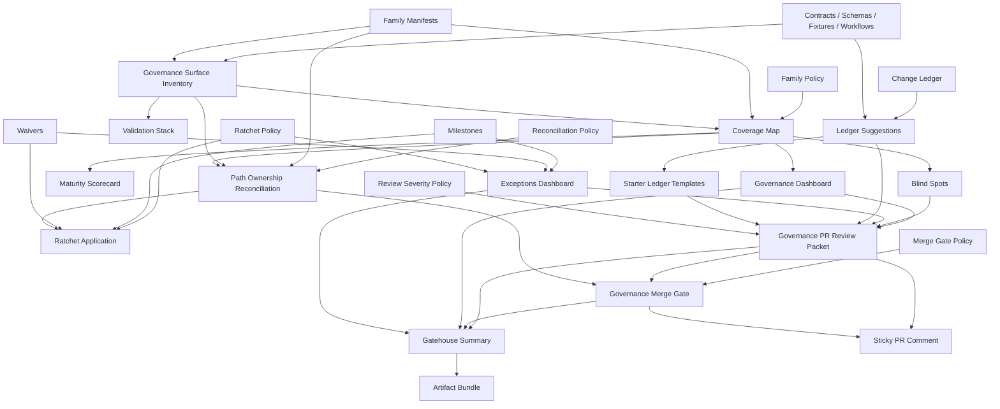

<!-- [KFM_META_BLOCK_V2]
doc_id: kfm://doc/NEEDS-VERIFICATION
title: Governance Gatehouse Lane
type: standard
version: v1
status: draft
owners: @bartytime4life
created: 2026-04-12
updated: 2026-04-12
policy_label: governed
related: [../../.github/workflows/governance-gatehouse.yml, ../../docs/reports/governance-gatehouse.md, ../../docs/reports/governance-dashboard.md, ../../docs/reports/governance-pr-review-packet.md, ../../docs/reports/governance-merge-gate.md, ../../tools/ci/README.md]
tags: [kfm, governance, gatehouse, ci, workflow, review, architecture]
notes: [PROPOSED lane README for the top-level governance gatehouse workflow and its derived review artifacts.]
[/KFM_META_BLOCK_V2] -->

# Governance Gatehouse Lane

Top-level governance review lane for KFM’s derived validation, reconciliation, reviewer packet, and merge recommendation surfaces.

> [!NOTE]
> Governance reports and CI summaries are derived reviewer artifacts: they improve discoverability and review, but authority remains in contracts, schemas, policy, validators, and tests.

**Status:** `draft`  
**Owners:** `@bartytime4life`  
**Primary workflow:** [`../../.github/workflows/governance-gatehouse.yml`](../../.github/workflows/governance-gatehouse.yml)

## Quick jumps

[Purpose](#purpose) · [Repo fit](#repo-fit) · [Inputs](#inputs) · [Outputs](#outputs) · [Phases](#phases) · [Architecture](#architecture) · [Failure semantics](#failure-semantics) · [Reviewer flow](#reviewer-flow)

## Purpose

Run the governance review stack in one coherent order so reviewers receive:

- one compact governance packet
- one merge recommendation
- one artifact bundle
- one visible governance review lane

## Repo fit

This lane sits above individual validators and report generators.

### Upstream sources

- contracts and schemas
- tests and fixtures
- family policy and family manifests
- reconciliation policy and ratchet policy
- milestone and waiver registries
- reviewer-action registry
- change ledger
- golden-pack outputs

### Downstream outputs

- governance dashboard summary
- governance exceptions dashboard
- governance PR review packet
- governance merge-gate summary
- governance gatehouse summary
- sticky PR comments when enabled

## Inputs

### Machine inputs

| Surface | Role |
|---|---|
| `configs/governance/family-policy.json` | family expectations |
| `configs/governance/families/*.json` | family identity and owned path surfaces |
| `configs/governance/reconciliation-policy.json` | reconciliation severity |
| `configs/governance/reconciliation-ratchet.json` | staged escalation rules |
| `configs/governance/milestones.json` | milestone registry |
| `configs/governance/waivers.json` | waiver registry |
| `configs/governance/reviewer-actions.json` | normalized reviewer action vocabulary |
| `configs/governance/review-severity-policy.json` | packet severity rollup |
| `configs/governance/merge-gate-policy.json` | merge recommendation policy |
| `configs/governance/change-ledger.json` | governance change history |
| `docs/reports/governance-surface-inventory.json` | observed governance-facing repo surfaces |
| `tools/validators/golden/output/governed-run-chain-summary.json` | scenario outcomes |

### Foundational evidence

- contracts remain the narrative family boundaries
- schemas remain machine contract authority
- validators remain enforcement surfaces
- tests and golden packs remain proof surfaces

## Outputs

| Output | Path |
|---|---|
| Gatehouse summary | `tools/ci/output/governance-gatehouse-summary.md` |
| Dashboard summary | `tools/ci/output/governance-dashboard-summary.md` |
| Blind spots summary | `tools/ci/output/governance-blind-spots-summary.md` |
| Maturity summary | `tools/ci/output/governance-maturity-scorecard-summary.md` |
| Exceptions summary | `tools/ci/output/governance-exceptions-dashboard-summary.md` |
| PR review packet | `tools/ci/output/governance-pr-review-packet-summary.md` |
| Merge gate summary | `tools/ci/output/governance-merge-gate-summary.md` |
| Ledger suggestions | `tools/ci/output/governance-ledger-suggestions-summary.md` |
| Ledger starter templates | `tools/ci/output/governance-ledger-entry-templates.md` |

## Phases

### 1. Config and registry validation

Checks the machine-readable governance config surfaces before derivation begins.

Typical checks:
- family policy
- family manifests
- reconciliation policy
- ratchet policy
- milestones
- waivers
- reviewer actions
- review severity
- merge gate
- change ledger

### 2. Inventory and family derivation

Builds the machine-readable map of governance-facing repo surfaces and aligns them to family manifests.

Typical outputs:
- governance surface inventory
- governance family index
- governance coverage map

### 3. Coverage and posture derivation

Builds reviewer-facing posture surfaces from inventory plus policy.

Typical outputs:
- blind spots
- maturity scorecard
- validation stack
- dashboard

### 4. Reconciliation and staged enforcement

Checks ownership alignment and staged enforcement posture.

Typical outputs:
- path ownership reconciliation
- ratchet application result
- exceptions dashboard

### 5. Review packet and merge stance

Builds the reviewer-facing packet and compact merge recommendation.

Typical outputs:
- ledger suggestions
- ledger starter templates
- PR review packet
- merge gate summary
- gatehouse summary

### 6. Artifact and comment publication

Publishes generated artifacts and optional sticky PR comments.

## Architecture

## Failure semantics

The gatehouse lane should be readable even when it fails.

### Fail-hard surfaces

These should normally block immediately:

- invalid governance config registries
- invalid family manifests
- fail-level reconciliation findings
- ratchet-promoted fail conditions
- machine-invalid ledger/config artifacts

### Warn-first surfaces

These should remain visible without necessarily blocking on day one:

- unowned governance surfaces during staged rollout
- manifest/coverage drift during staged migration
- ledger-needed suggestions
- expiring waivers
- non-blocking blind spots

### Artifact posture

When possible:
- generate reviewer-facing artifacts even on partial failure
- upload artifacts with `if: always()`
- preserve sticky comment continuity on PRs

## Reviewer flow

1. Read the **PR review packet** first.
2. Check the **merge recommendation**.
3. Inspect **blind spots** and **exceptions** if posture is not `clear`.
4. Review **ledger suggestions** and **starter templates** if governance-significant surfaces changed.
5. Trace any serious issue back to:
   - the owning contract family
   - the schema or validator
   - the policy/config registry
   - the relevant golden-pack or reconciliation result

## Reviewer action vocabulary

This lane should emit normalized reviewer actions from:

- `configs/governance/reviewer-actions.json`

Common examples:
- `review_blind_spots`
- `review_expiring_waivers`
- `review_triggered_milestones`
- `review_ratchet_escalations`
- `review_ledger_need`
- `apply_starter_template_if_needed`

## Boundaries

This lane does **not**:
- redefine contracts
- redefine policy
- replace validators
- replace golden-pack evidence
- invent authority above machine contracts and tests

It exists to make the governance story reviewable in one place.

## Canonical summary lines

> The governance gatehouse workflow is the orchestrating review lane: it runs the derived governance stack in one coherent order so reviewers receive one compact, evidence-backed governance packet rather than many disconnected signals.

> Gatehouse outputs should make the governance review lane readable in one place: posture, exceptions, packet, and merge stance.
