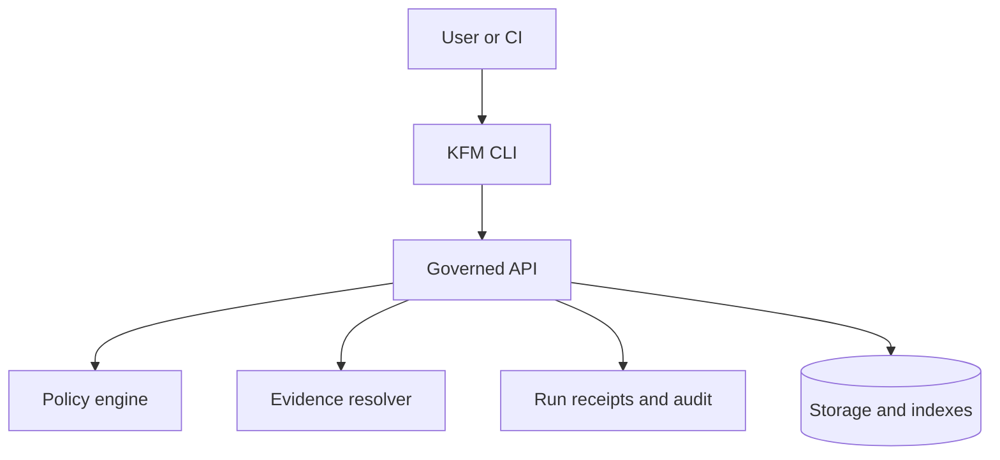

<!-- [KFM_META_BLOCK_V2]
doc_id: kfm://doc/9a346fb5-1c34-491b-86d9-0d28155e76a5
title: KFM CLI
type: standard
version: v1
status: draft
owners: KFM Maintainers (TBD)
created: 2026-02-24
updated: 2026-02-24
policy_label: public
related:
  - ../../README.md # TODO: confirm repo root readme path
  - ../README.md    # TODO: confirm docs landing page path
tags: [kfm, cli, docs]
notes:
  - Directory README for KFM command-line tools (operator + developer oriented).
[/KFM_META_BLOCK_V2] -->

# KFM CLI
Command-line tools for operating and maintaining the Kansas Frontier Matrix (KFM) system.


> **WARNING**
> This document is written to be **safe-by-default** and **repo-agnostic** until wired to the actual CLI entrypoint(s).
> Anything marked **TODO** requires verification against the repository code before treating it as truth.

---

## Navigation
- [Quickstart](#quickstart)
- [What belongs in `docs/cli/`](#what-belongs-in-docscli)
- [How the CLI fits the KFM architecture](#how-the-cli-fits-the-kfm-architecture)
- [Running the CLI](#running-the-cli)
- [Command registry](#command-registry)
- [Configuration](#configuration)
- [Safety, policy, and audit](#safety-policy-and-audit)
- [Adding or changing commands](#adding-or-changing-commands)
- [Troubleshooting](#troubleshooting)
- [Appendix: Command doc template](#appendix-command-doc-template)

---

## Quickstart

### 1) Discover the CLI entrypoint (no guessing)
KFM projects often expose CLI utilities in one (or more) of these patterns:

- **Installed binary** (Python console script, Node bin, etc.):  
  `kfm --help` *(example name — TODO: confirm actual binary name)*

- **Repo-local script** (e.g., `manage.py`, `scripts/*`, `bin/*`):  
  `python manage.py --help` *(TODO: confirm path/name)*

- **Module entrypoint** (Python):  
  `python -m <package>.cli --help` *(TODO: confirm module)*

If you are unsure which applies, search the repo for likely entrypoints:

```bash
# ripgrep examples (choose what exists in your environment)
rg -n "console_scripts|entry_points|argparse|click|typer" .
rg -n "if __name__ == \"__main__\"" .
rg -n "\"bin\"\\s*:\\s*\\{" package.json pyproject.toml setup.cfg setup.py
ls -la bin scripts api/scripts 2>/dev/null || true
```

### 2) Run `--help` and capture the output into docs
Once you find the entrypoint, capture the canonical help output and commit it into this folder:

```bash
<CLI_ENTRYPOINT> --help > docs/cli/help.txt
<CLI_ENTRYPOINT> <SUBCOMMAND> --help > docs/cli/help-<SUBCOMMAND>.txt
```

> TIP: Prefer capturing help output as part of CI so docs don't drift.

---

## What belongs in `docs/cli/`
This directory documents the **human-facing operational interface** for KFM.

### Fits in the repo
- **Purpose:** Operator and developer documentation for KFM command-line tools.
- **Location:** `docs/cli/` *(this file)*

### Acceptable inputs
- Command reference pages (one per command/subcommand)
- Help output snapshots (`--help` text, `--version`, etc.)
- Environment variable + config file reference (only for CLI-relevant settings)
- Examples (safe, reproducible; include expected output when stable)
- Exit code conventions and error model mapping
- Shell completion instructions (if supported)
- “How to add a command” guidelines, with tests + docs gates

### Exclusions
- UI screenshots / UI walkthroughs (belongs in UI docs)
- API contract specs (belongs in API docs — link to them instead)
- Pipeline implementation details (belongs in pipeline docs — link to them instead)
- Secrets, tokens, private URLs, or anything that violates policy labels

---

## How the CLI fits the KFM architecture

The CLI is an **operator surface**. To preserve the *trust membrane*, it should not bypass governance.



### Invariants (must hold)
- **No direct DB access from CLI** for governed operations. Prefer calling the governed API so policy, redaction, versioning, and audit are enforced uniformly.
- **Every mutating command is auditable** (emits/returns an `audit_ref` or equivalent).
- **Every user-facing claim is traceable** (prints evidence references or points to evidence resolution).

---

## Running the CLI

### Local (host) execution
> TODO: replace these with the real entrypoint + install method once confirmed.

```bash
# Example patterns:
kfm --version
kfm --help
kfm <command> --help
```

### Docker Compose execution (common for KFM stacks)
If KFM is containerized, running the CLI inside the API container keeps dependencies (GDAL, DB drivers, mounted volumes) consistent with prod-like behavior:

```bash
# Compose v2
docker compose exec <service> <CLI_ENTRYPOINT> --help

# Legacy compose
docker-compose exec <service> <CLI_ENTRYPOINT> --help
```

Where:
- `<service>` is the service name in your compose file *(often `api`, but confirm)*.
- `<CLI_ENTRYPOINT>` is one of the entrypoint patterns described in [Quickstart](#quickstart).

---

## Command registry

> **Goal:** A single table that answers “what commands exist, what do they do, and how risky are they?”

Fill this table by discovering the real commands, then replace placeholders.

| Area | Command | Purpose | Risk level | Notes |
|---|---|---|---:|---|
| Health | `<CLI> doctor` | Verify stack health + dependencies | Low | Should be read-only |
| Auth | `<CLI> auth login` | Obtain/refresh credentials | Medium | Never print tokens |
| Catalog | `<CLI> catalog list` | List datasets (policy-filtered) | Low | Should match governed API |
| Evidence | `<CLI> evidence resolve <ref>` | Resolve an EvidenceRef to a bundle | Low | Must fail closed |
| Pipelines | `<CLI> pipeline run <id>` | Run or trigger a pipeline | High | Must be auditable |
| Indexing | `<CLI> reindex` | Rebuild search/graph indexes | High | Prefer dry-run + confirmation |
| Focus | `<CLI> focus ask "<question>"` | Run governed Q&A | Medium | Must cite or abstain |

> NOTE: Command names above are **templates**, not claims. Replace with actual names once confirmed.

### Per-command pages (recommended)
Proposed structure (create files as commands are confirmed):

```text
docs/cli/
  README.md
  commands/
    doctor.md
    auth.md
    catalog.md
    evidence.md
    pipeline.md
    reindex.md
    focus.md
```

---

## Configuration

### Environment variables
Document only variables the CLI reads directly.

Common patterns you may encounter (verify in repo):
- `KFM_BASE_URL` or `API_BASE_URL` — where CLI points for API calls
- `KFM_PROFILE` — selects a config profile (dev/stage/prod)
- `KFM_AUTH_TOKEN` — optional token source (avoid if possible; prefer login flows)

### Config files
If the CLI supports config files, document:
- Default search paths (e.g., `~/.config/kfm/config.yaml`)
- Precedence (env > config > defaults)
- Safe examples (no secrets committed)

---

## Safety, policy, and audit

### Default-deny behavior
For any operation that could expose restricted data:
- Fail closed.
- Explain “why” in policy-safe terms.
- Provide an `audit_ref` so stewards can review.

### Mutations require intent
For any command that changes state (pipelines, reindex, publish, delete):
- Support `--dry-run` (default preferred)
- Require a confirmation flag (e.g., `--yes`) or interactive confirmation
- Emit or return an audit reference

### Output hygiene
- Provide `--json` for machine use (CI)
- Avoid printing secrets
- Keep error messages policy-safe and stable

---

## Adding or changing commands

### Definition of done
- [ ] Command is discoverable via top-level `--help`
- [ ] Has `--help` with examples + exit codes
- [ ] Has unit tests
- [ ] Has docs page in `docs/cli/commands/`
- [ ] If it mutates state: supports `--dry-run` and emits audit info
- [ ] CI gate ensures docs/help output are updated (if using snapshots)

### Recommended conventions
- Prefer subcommands over many top-level binaries
- Keep flag naming consistent (`--dataset-id`, `--dataset-version-id`, `--bbox`, `--time-start`, `--time-end`)
- Provide stable exit codes (see template below)

---

## Troubleshooting

### “Command not found”
- Confirm whether CLI is installed (`pip install -e .`, `npm i`, etc.) *(TODO: fill in real steps)*
- If running in Docker, ensure you are executing inside the correct service container.

### “Permission denied” / “unauthorized”
- Verify you are authenticated.
- Confirm you are targeting the correct environment (dev vs prod).
- Check that your role has access to the requested dataset/evidence.

### “API unreachable”
- Check compose stack is up:
  ```bash
  docker compose ps
  docker compose logs <service>
  ```
- Confirm the base URL/port.

---

## Appendix: Command doc template

Create one `docs/cli/commands/<name>.md` per command.

<details>
<summary><strong>Template</strong> (copy/paste)</summary>

### `<CLI> <command>`

**Purpose:** One sentence.

**Usage:**
```bash
<CLI> <command> [flags] <args>
```

**Examples:**
```bash
# Example 1 (safe)
<CLI> <command> --help
```

**Flags:**
| Flag | Type | Default | Description |
|---|---:|---:|---|
| `--dry-run` | bool | `true` | Compute actions without applying them |

**Exit codes:**
- `0` success
- `2` invalid arguments
- `10` policy denied (or redacted)
- `1` unexpected error

**Notes:**
- Any policy/audit obligations.
- Links to API endpoints or governance docs (relative links).
</details>

---

<p align="right"><a href="#kfm-cli">Back to top</a></p>
