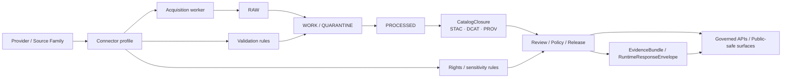

<!-- [KFM_META_BLOCK_V2]
doc_id: kfm://doc/TODO-doc-id-needs-verification
title: Connectors
type: standard
version: v1
status: draft
owners: TODO(owners-needs-verification)
created: TODO(YYYY-MM-DD-needs-verification)
updated: TODO(YYYY-MM-DD-needs-verification)
policy_label: TODO(policy-label-needs-verification)
related: [TODO(verify-related-paths-for-contracts-policy-tests-runbooks)]
tags: [kfm, connectors, ingestion, source-onboarding]
notes: [Current-session evidence was PDF-only; adjacent repo paths, owners, dates, and mounted implementation depth require direct repo verification.]
[/KFM_META_BLOCK_V2] -->

# Connectors
Governed source-onboarding and ingestion guidance for KFM connector work.

| Status | Owners | Repo path | Evidence posture |
| --- | --- | --- | --- |
| `draft` | `TODO(owners-needs-verification)` | `docs/connectors/README.md` | **CONFIRMED doctrine** · **PROPOSED local structure** · **UNKNOWN mounted repo depth** |


**Quick jumps:** [Scope](#scope) · [Repo fit](#repo-fit) · [Inputs](#inputs) · [Exclusions](#exclusions) · [Directory tree](#directory-tree-proposed) · [Quickstart](#quickstart) · [Usage](#usage) · [Diagram](#diagram) · [Tables](#reference-tables) · [Definition of done](#definition-of-done) · [FAQ](#faq)

> [!IMPORTANT]
> This README is grounded in attached KFM doctrine and source-integration manuals. The current-session workspace evidence was PDF-only, not a mounted repo checkout. Treat exact neighboring file paths, owners, dates, and existing local folder shape as **NEEDS VERIFICATION** until directly confirmed in the repository.

> [!NOTE]
> In KFM, a connector is not just code that fetches data. It is a governed intake boundary with declared identity, access pattern, semantics, rights posture, validation rules, lineage expectations, and publication burden.

## Scope

This directory exists to make connector work reviewable before it becomes operational.

For KFM, connector documentation should explain how a source enters the governed truth path:

`Source edge -> RAW -> WORK / QUARANTINE -> PROCESSED -> CATALOG -> PUBLISHED`

That means this directory should help maintainers answer five questions quickly:

1. **What is the source?**
2. **How is it acquired?**
3. **What checks gate it?**
4. **What proofs and metadata must it emit?**
5. **What must never be published directly?**

### What belongs here

Connector-facing documentation for:

- source onboarding
- source-family profiles
- acquisition patterns
- normalization expectations
- validation and quarantine rules
- redaction and sensitivity notes
- proof-object expectations
- connector-specific definition-of-done guidance

### Truth legend used in this README

| Label | Meaning |
| --- | --- |
| **CONFIRMED** | Supported by attached KFM doctrine or source-integration manuals |
| **PROPOSED** | Recommended README structure, folder shape, or documentation pattern that fits the doctrine |
| **UNKNOWN** | Not directly verified from the mounted repository in this session |
| **NEEDS VERIFICATION** | A value that should be filled from the real repo once directly inspected |

[Back to top](#connectors)

## Repo fit

This README should act as the documentation entry point for the connector layer, not as a substitute for schemas, tests, or runtime code.

| Aspect | Guidance |
| --- | --- |
| **Path** | `docs/connectors/README.md` |
| **Primary role** | README for connector doctrine, onboarding rules, intake expectations, and review discipline |
| **Upstream dependencies** | Source atlas, provider/source documentation, source-registration inputs, lane publication burdens, contracts, and policy rules |
| **Downstream consequences** | SourceDescriptor, IngestReceipt, ValidationReport, DatasetVersion, CatalogClosure, review artifacts, release-safe exports, and runtime EvidenceBundle behavior |
| **Boundary rule** | This directory documents connector behavior and obligations; it should not become the hidden home of live secrets, raw landed data, or public release proofs |
| **Link status** | Exact adjacent relative links are **NEEDS VERIFICATION** until the mounted repo tree is inspected |

### Upstream / downstream map

| Direction | What this README should point toward | Status |
| --- | --- | --- |
| Upstream | Source registry, provider notes, rights/sensitivity rules, lane publication guidance | **NEEDS VERIFICATION** |
| Downstream | Contracts, fixtures, tests, runbooks, release/correction docs, governed APIs | **NEEDS VERIFICATION** |
| Cross-cutting | Policy reason/obligation registries, standards profile, observability join keys | **NEEDS VERIFICATION** |

> [!TIP]
> Keep this README narrow and connective. It should orient readers to the connector layer and its obligations, then hand off to the more specific contract, policy, and test surfaces once those paths are verified.

[Back to top](#connectors)

## Inputs

Accepted inputs are the materials needed to describe and review a connector before promotion.

| Input class | What belongs here | Why it matters |
| --- | --- | --- |
| Source identity | source name, provider, steward/contact, canonical endpoint family, source IDs | Prevents ambiguous intake |
| Access model | auth pattern, fetch pattern, cadence, checkpoint/retry approach, rate/size assumptions | Makes acquisition repeatable |
| Semantics | grain/support, CRS/spatial frame, time semantics, units, modeled-vs-observed tag, publication intent | Prevents silent meaning drift |
| Rights & sensitivity | license/terms, attribution, redistribution posture, location-precision limits, privacy/care obligations, steward review requirements | Prevents unsafe or unauthorized publication |
| Validation | schema/shape checks, temporal checks, identifier checks, unit checks, quarantine triggers, stale-source policy | Makes failure modes explicit |
| Lineage expectations | raw landing family, transform family, outbound catalog closure expectations, proof artifacts emitted | Keeps evidence reconstructible |
| Backfill and change handling | historical window strategy, snapshot-vs-incremental rule, source change notes | Prevents accidental rework or undocumented drift |
| Test expectations | unit, integration, contract, regression checks | Connects docs to verification |

### Accepted artifact examples

- connector profiles
- source onboarding checklists
- field mapping tables
- cadence and rate-limit notes
- redaction rules
- sample safe payloads
- backfill notes
- validation matrices
- proof-object expectations
- review prompts for lane-specific burdens

## Exclusions

This directory should **not** become a catch-all for everything adjacent to ingestion.

| Excluded material | Why it does not belong here | Put it in instead |
| --- | --- | --- |
| Secrets, tokens, credentials | Documentation must never become a secrets surface | Verified secret-management path or runtime secret store |
| Raw landed data | RAW is a governed storage zone, not a docs directory | RAW storage / intake plane |
| Processed or published datasets | This directory documents connectors; it does not hold release artifacts | PROCESSED / CATALOG / PUBLISHED surfaces |
| Public API contracts | Connector docs should not replace outward route contracts | Verified API contract path |
| Runtime proof packs | Release and runtime proof objects need their own governed lifecycle | Verified release/runtime proof path |
| UI shell behavior docs | Connector docs should not absorb Evidence Drawer / Focus shell design | Verified UI / shell docs path |
| Ad hoc notebooks and one-off experiments | They age badly and blur the intake contract | Sandbox or experiment lane with explicit review status |

> [!WARNING]
> Do not store precise sensitive locations, unpublished review notes, or quasi-secret operational workarounds here. Connector docs should describe the rule, not leak the risky payload.

[Back to top](#connectors)

## Directory tree (PROPOSED)

The exact local shape is **UNKNOWN** in this session. The tree below is a **PROPOSED** working layout for a documentation-first connector directory that stays small and reviewable.

```text
docs/connectors/
├── README.md
├── _templates/
│   └── connector-profile.md
├── provider-profiles/
│   ├── hydrology/
│   ├── hazards/
│   ├── soils/
│   ├── air-climate/
│   ├── transport/
│   └── heritage/
├── patterns/
│   ├── incremental-polling.md
│   ├── snapshot-diff.md
│   ├── stac-api-ingest.md
│   ├── feed-listener.md
│   └── governed-upload-path.md
└── checklists/
    ├── connector-definition-of-done.md
    └── connector-review-gates.md
```

### Interpretation rule

- Keep this directory **documentation-heavy, code-light**.
- Add a new subpage only when it reduces ambiguity for multiple connectors.
- Do not mirror the entire source atlas here.
- If the repo already has a stronger local structure, preserve that structure and adapt this README to it.

## Quickstart

Use this path when adding or revising connector documentation.

1. Create or update the connector profile for the source family.
2. Declare the source identity, access pattern, cadence, and checkpointing approach.
3. Record semantics explicitly: support/grain, CRS, time semantics, units, modeled-vs-observed status.
4. Document rights, redistribution posture, precision limits, and review requirements.
5. Define validation gates and quarantine triggers.
6. State what proof objects must exist before promotion.
7. Record backfill strategy and source-change handling.
8. Link the connector profile to tests, fixtures, and runbooks once verified.

### Minimal starter stub

```yaml
source_id: TODO
title: TODO
provider: TODO
steward_contact: TODO

access:
  mode: TODO
  auth_model: TODO
  fetch_pattern: incremental | snapshot-diff | listener | governed-upload
  cadence: TODO
  rate_size_assumptions: TODO
  retry_checkpoint_policy: TODO

semantics:
  grain_support: TODO
  spatial_frame: TODO
  time_semantics: TODO
  units: TODO
  modeled_vs_observed: observed | modeled | mixed
  publication_intent: TODO

rights_and_sensitivity:
  license_terms: TODO
  attribution: TODO
  redistribution_posture: TODO
  precision_constraints: TODO
  care_privacy_obligations: TODO
  steward_review_required: true

validation:
  schema_checks: []
  identity_checks: []
  temporal_checks: []
  unit_checks: []
  quarantine_triggers: []
  stale_source_policy: TODO

lineage:
  raw_landing_family: TODO
  transform_family: TODO
  outbound_catalog_expectations: [DCAT]
  additional_catalogs: [STAC, PROV]
  proof_artifacts_emitted: []

backfill:
  strategy: TODO
  expected_runtime: TODO
  historical_window: TODO
```

## Usage

### When to create a new connector page

Create a new page when a source family changes any of these materially:

- authentication model
- fetch pattern
- support/grain
- units or CRS discipline
- rights or precision burden
- quarantine logic
- proof-object expectations

### When to revise an existing page

Revise instead of branching when the source is materially the same but needs:

- updated cadence or rate-limit guidance
- new validation rules
- new redaction notes
- clarified field mappings
- revised backfill or deprecation notes

### When to retire a connector page

Retire when the source is no longer admissible, no longer available, or superseded by a new governed source. Retired pages should remain discoverable with an explicit state, reason, and successor pointer.

### Connector writing rule

Prefer **reviewable specificity** over prose volume.

Good connector docs answer:

- what enters,
- what gets rejected,
- what gets generalized,
- what gets emitted,
- and what downstream surfaces may safely depend on.

[Back to top](#connectors)

## Diagram



### Reading the diagram

The connector boundary is upstream of publication. It does **not** publish directly. It feeds the governed path that later supports catalog closure, review, release, and runtime evidence resolution.

## Reference tables

### Connector contract reference

| Contract / artifact | Connector-facing role | Minimum expectation |
| --- | --- | --- |
| **SourceDescriptor** | Intake contract for a source or endpoint | Identity, access, semantics, rights, validation, lineage |
| **IngestReceipt** | Proof that a fetch and landing event occurred | Source reference, fetch time, integrity checks, result, output pointers |
| **ValidationReport** | Record of checks passed, failed, or quarantined | Check list, severity, subject refs, reason codes |
| **DatasetVersion** | Authoritative candidate or promoted subject set | Stable ID, version ID, support, time semantics, provenance |
| **CatalogClosure** | Outward metadata closure | STAC / DCAT / PROV refs, identifiers, release linkage |
| **EvidenceBundle** | Runtime support object | Scope echo, evidence members, rights/sensitivity state, lineage summary |
| **RuntimeResponseEnvelope** | Accountable runtime outcome | Surface class/state, result, citation check, decision ref |
| **CorrectionNotice** | Visible lineage under change | Affected releases/surfaces, rebuild refs, cause, public note |

### Required validation and test gates

| Gate family | What it should prove |
| --- | --- |
| Schema validation | Required fields exist and types are documented |
| Geometry / spatial validation | Geometry is valid and inside expected extent when relevant |
| Temporal validation | Timestamps are sane and support the intended interpretation |
| Rights / policy validation | License, attribution, and restrictions are captured and enforced |
| Provenance validation | Deterministic checksums and lineage chains exist |
| Integration validation | Fixed slices produce stable counts and checksums |
| Contract validation | API/runtime surfaces respect provenance and redaction behavior |
| Regression validation | Profile metrics stay stable or change explainably |

### Connector output expectation matrix

| Stage | Connector obligation | Public consequence if missing |
| --- | --- | --- |
| RAW | Deterministic capture + checksum | Hold intake |
| WORK / QUARANTINE | Validation outcome + quarantine rule | No canonical write |
| PROCESSED | Canonical mapping + stable versioning | No authoritative candidate |
| CATALOG | DCAT always; STAC/PROV as applicable | No clean discovery or evidence linkage |
| RELEASE | Policy-safe review and proof continuity | No public-safe publication |
| RUNTIME | EvidenceBundle-ready support path | No trustworthy outward answer |

[Back to top](#connectors)

## Definition of done

A connector profile is ready for review when all boxes below can be checked without hand-waving.

- [ ] Stable `source_id` and source title documented
- [ ] Provider and steward/contact identified
- [ ] Auth model documented without storing secrets
- [ ] Fetch pattern, cadence, and checkpoint strategy defined
- [ ] Grain/support, CRS, time semantics, and units made explicit
- [ ] Modeled-vs-observed status declared
- [ ] License, attribution, redistribution posture, and precision constraints documented
- [ ] Validation gates and quarantine triggers listed
- [ ] Deterministic manifest/checksum expectation recorded
- [ ] Outbound catalog expectations stated (`DCAT` always; `STAC`/`PROV` as applicable)
- [ ] Backfill strategy documented
- [ ] Contract, integration, and regression test expectations named
- [ ] Lane-specific publication burden reviewed
- [ ] Retirement/supersession path defined if the source is replaced

> [!NOTE]
> The smallest KFM-real move is still a contract-first thin slice. This directory should help prove one connector cleanly, not accumulate decorative source notes faster than the governed path can absorb them.

## FAQ

### Why is this README in `docs/` instead of beside runtime code?

Because connector work in KFM is not only code. It is source admission, semantics, rights handling, validation, and publication burden. This README should orient maintainers before they touch runtime implementation.

### Does every connector need STAC?

No. The strongest recurring rule in the source corpus is **DCAT always; STAC and PROV as applicable**. Spatial assets usually need STAC. Lineage-bearing publication and runtime support should still preserve PROV where applicable.

### Can modeled sources live under connectors?

Yes, but only if they are labeled clearly as modeled/assimilated and never flattened into direct observation. The connector page should state that burden explicitly.

### Are the subfolders in this README final?

No. They are **PROPOSED** starter structure only. Preserve the actual repo shape once directly verified.

### Do secrets or tokens belong here?

No. Document the auth model here; store secrets only in the verified secret-management surface for the repo/runtime.

[Back to top](#connectors)

## Appendix

<details>
<summary><strong>Starter review prompts</strong></summary>

### Reviewer prompts

Before approving a new or revised connector profile, ask:

1. Is the source identity stable enough to cite later?
2. Are support/grain and time semantics explicit enough to prevent misuse?
3. Does the page distinguish observation from model output?
4. Are rights, attribution, and precision burdens visible?
5. Would quarantine triggers catch the most damaging bad data?
6. Is the backfill strategy plausible and reviewable?
7. Could a downstream maintainer identify the expected proof objects from this page alone?
8. Does the page avoid implying that publication is automatic after fetch?

### Lane-specific prompts

| Lane | Extra question to ask |
| --- | --- |
| Hydrology | Are station IDs, units, qualifiers, and watershed joins explicit? |
| Hazards | Are event-time semantics and status transitions explicit? |
| Soils / land cover | Are raster class/version semantics explicit? |
| Heritage / archives | Are sensitivity and reuse constraints visible at the point of description? |
| Parcels / land tenure | Are legal identity and public-safe summarization boundaries explicit? |
| Air / climate | Are modeled fields clearly separated from direct observations? |
| Transport | Are network/topology assumptions and update cadence visible? |

</details>

<details>
<summary><strong>What this README should eventually link to once the repo tree is verified</strong></summary>

Add verified relative links for:

- contract schemas
- valid/invalid fixtures
- policy reason/obligation registries
- connector tests
- ingestion runbooks
- release/correction docs
- source registry or atlas pages
- lane-specific provider profiles

Until then, keep placeholders explicit rather than linking to guessed paths.

</details>