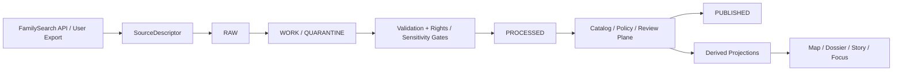

<!-- [KFM_META_BLOCK_V2]
doc_id: kfm://doc/PLACEHOLDER-GENEALOGY-CONNECTORS
title: Genealogy Connectors (FamilySearch + Ancestry Intake)
type: standard
version: v1
status: draft
owners: NEEDS VERIFICATION
created: 2026-03-29
updated: 2026-03-29
policy_label: restricted
related: [docs/architecture/TRUTH_PATH_LIFECYCLE.md, docs/governance/README.md, docs/security/README.md]
tags: [kfm, genealogy, connectors]
notes: [Source-bounded to attached PDF corpus in this session; no mounted repo tree, schemas, workflows, or runtime code were directly verified.]
[/KFM_META_BLOCK_V2] -->

# Genealogy Connectors

Governed intake for FamilySearch tree sync and Ancestry user-export uploads inside KFM’s truth path.

> [!IMPORTANT]
> **Current-session evidence boundary:** this document is grounded in the attached PDF corpus only. Exact repo topology, mounted connector code, schema files, workflow YAML, and deployment state remain **UNKNOWN** unless directly reverified in a later session.

---

## Status at a glance

**Status:** draft  
**Owners:** NEEDS VERIFICATION  
**Evidence posture:** PDF corpus only  
**Publication posture:** restricted


**Quick jump:** [Scope](#scope) · [Repo fit](#repo-fit) · [Connector modes](#connector-modes) · [Policy gates](#policy-gates) · [Contracts](#contracts-and-proof-objects) · [Validation](#validation-and-test-requirements) · [Status matrix](#status-matrix)

---

## Scope

This document defines a **PROPOSED** KFM surface for controlled genealogy intake, centered on two source families:

| Source | Intake mode | Current posture |
|---|---|---|
| **FamilySearch** | OAuth2/API sync + GEDCOM/GEDZip-aligned interchange | **PROPOSED** |
| **Ancestry** | User-initiated export upload (GEDCOM; raw DNA where user-supplied) | **PROPOSED** |

The goal is not a generic “family tree importer.” The goal is a KFM-governed intake path that keeps genealogy material subordinate to:

- the canonical truth path
- the trust membrane
- rights and sensitivity review
- public-safe publication rules
- visible correction lineage

### Why this belongs in KFM

**INFERRED** from current KFM doctrine, this surface spans several existing Kansas operating lanes rather than introducing a separately confirmed “genealogy lane”:

| KFM lane fit | Why it matters here |
|---|---|
| Historical boundaries, census, settlement geography, migration/mobility | Birth, death, residence, migration, nativity, and place strings are time-aware and support-sensitive. |
| Land tenure, cadastral history, parcels, plats, deeds | Genealogy often crosses into title chains, homestead context, and family-property relations. |
| Archives, newspapers, oral histories, public memory, heritage | Family narratives and sourced records are documentary evidence, not automatic fact. |

---

## Repo fit

| Item | Status |
|---|---|
| **Target path in repo** | **NEEDS VERIFICATION** |
| **Likely doc role** | Standard architecture/governance doc for a connector/intake surface |
| **PROPOSED starter fit** | `docs/connectors/genealogy/GENEALOGY_CONNECTORS.md` or adjacent connector/governance directory |
| **Mounted repo verification** | **UNKNOWN** |

### Upstream inputs

- FamilySearch authenticated API payloads
- FamilySearch place-normalization lookups
- User-supplied GEDCOM / GEDZip exports
- User-supplied raw DNA / genotype files
- User-supplied DNA CSV / segment exports where officially obtainable

### Downstream obligations

- `RAW`
- `WORK / QUARANTINE`
- `PROCESSED`
- `CATALOG`
- `PUBLISHED`

### Required proof objects along the way

- `SourceDescriptor`
- `IngestReceipt`
- `ValidationReport`
- `DatasetVersion`
- `DecisionEnvelope`
- `ReviewRecord`
- `CatalogClosure`
- `ReleaseManifest`
- `EvidenceBundle`
- `CorrectionNotice`

---

## Accepted inputs

| Input family | Typical format | Status | Notes |
|---|---|---:|---|
| Tree export | GEDCOM 5.5.1 / GEDCOM 7 | **PROPOSED** | Primary portable tree interchange path. |
| Tree bundle | GEDZip / GEDCOM 7 bundle | **PROPOSED** | Especially relevant for FamilySearch-aligned workflows. |
| Programmatic tree/person/place data | FamilySearch API payloads | **PROPOSED** | Requires OAuth2 and approved app flow. |
| Raw DNA / genotype export | vendor TXT/ZIP | **PROPOSED** | Restricted; not public-safe by default. |
| Match / segment export | vendor CSV / tool export | **PROPOSED / NEEDS VERIFICATION** | Availability differs sharply by vendor. |
| Place strings for normalization | free text + event date | **PROPOSED** | Must remain time-aware and source-linked. |

---

## Exclusions

This surface does **not** authorize or normalize the following:

- UI scraping of vendor sites
- unsupported DNA match-list downloaders
- unofficial API use that violates vendor terms
- direct publication of living persons
- direct publication of raw genotype data
- outward exposure of exact private-family or sensitive exact locations without review
- treating summaries, inferred kinship graphs, or embeddings as authoritative truth

> [!WARNING]
> **Derived genealogical graphs are not authoritative by default.** They are rebuildable projections unless explicitly promoted through KFM’s review and release path.

---

## Connector modes

### FamilySearch connector

**PROPOSED realization**

FamilySearch is the strongest candidate for an authenticated connector because recent project notes describe it as having:

- an OAuth2-based developer flow
- an API built around GEDCOM X
- programmatic access to tree data
- a place-normalization surface useful for historical place resolution

**Recommended KFM posture**

- use official OAuth2 + approved app flow
- keep sync scoped and auditable
- prefer API-based retrieval over manual scraping
- use FamilySearch Places as a first resolver where appropriate
- treat webhook/push or change-history integration as **PROPOSED**, not mounted fact

### Ancestry intake

**PROPOSED realization**

Ancestry should be treated as a **user-export intake lane**, not as a general-purpose sync connector.

**Allowed path shape**

- user downloads GEDCOM from the Ancestry UI
- user optionally downloads raw DNA/genotype data from account settings
- user uploads those artifacts into governed intake

**Not assumed**

- no broad public tree-sync API
- no sanctioned DNA match export API
- no scraping-based sync
- no third-party match-list extraction workflows

---

## Architecture



### Operating rule

This connector surface must preserve the KFM canonical path:

`Source edge -> RAW -> WORK / QUARANTINE -> PROCESSED -> CATALOG -> PUBLISHED`

It must also preserve the trust membrane:

- no direct public-client path to raw exports
- no direct client path to canonical stores
- no connector bypass of policy or review planes
- no derived projection silently replacing authoritative records

---

## Trust posture and handling model

### Source-role stance

Genealogy material can arrive through multiple source roles, each with different burden:

| Source role | Typical genealogy examples | Main caution |
|---|---|---|
| Documentary / archival | certificates, scans, newspapers, oral histories, tree citations | preserve context; do not flatten interpretation into fact |
| Community-contributed | user trees, family notes, local submissions | governed input, not automatic truth |
| Statutory / administrative | vital records, deeds, censuses | legal record class does not erase support/time complexity |
| Mirror / discovery service | search indexes, discovery portals | provenance anchors, not replacements for origin authorities |

### Object separation

A connector implementation should keep these object families distinct:

| Object family | Why separation matters |
|---|---|
| Person / relationship records | pedigree assertions and identities are not the same thing as evidence. |
| Event records | birth, death, marriage, migration, military service, etc. need explicit time and place semantics. |
| Place normalization outputs | resolved place IDs and geocodes are derived assists, not proof of event truth. |
| DNA match records | shared-cM and segment evidence must stay distinct from tree assertions. |
| Governance objects | receipts, decisions, reviews, releases, and corrections are first-class. |

---

## Consent, rights, and sensitivity

### Mandatory fail-closed rules

| Condition | Default result | Typical obligation |
|---|---|---|
| Rights unknown | **DENY / QUARANTINE** | `review_required` |
| Living person detected | **WITHHOLD** | `withhold` |
| Exact private location risk | **GENERALIZE or WITHHOLD** | `generalize` / `withhold` |
| Consent revoked | **DEACTIVATE outward overlays** | `log_audit`, `correction_notice` |
| Schema or semantic failure | **QUARANTINE** | `review_required` |
| Missing evidence path for outward claim | **ABSTAIN / DENY** | `cite` |

### Genealogy-specific public-safe defaults

**PROPOSED default posture**

- living-person data is **not public-safe** by default
- raw DNA/genotype files are **restricted** by default
- relationship hints from DNA tools are **derived** and must stay visibly derived
- exact-home, grave, and family-sensitive coordinates should default to generalized or withheld treatment
- revocation must emit a signed or otherwise auditable `revocation_receipt` equivalent

### Illustrative consent token (PROPOSED)

```json
{
  "consent_id": "uuid",
  "source_family": "genealogy",
  "vendor": "ancestry",
  "subject_scope": ["tree_export", "raw_dna_upload"],
  "permissions": {
    "public_release": false,
    "research_only": true,
    "living_person_exposure": false
  },
  "issued_at": "timestamp",
  "revocable": true
}
```

---

## Policy gates

| Gate | Why it exists | Default behavior |
|---|---|---|
| Consent / rights gate | export permission and redistribution posture vary by source | fail closed |
| Living-person gate | outward exposure of living persons is high-risk | withhold / review |
| Exact-location gate | genealogy can expose private-family or culturally sensitive locations | generalize / withhold |
| Schema / semantic gate | GEDCOM and DNA exports vary and drift | quarantine on failure |
| Provenance completeness gate | KFM requires reconstructible lineage | block promotion |
| Public-safe release gate | not every processed object is publishable | review or deny |
| Correction / revocation gate | post-release narrowing must remain visible | correction workflow |

### Example reason codes (KFM-aligned)

| Reason code | Typical meaning |
|---|---|
| `rights.unknown` | rights or redistribution posture unresolved |
| `sensitivity.exact_location` | exact location too sensitive for requested audience |
| `validation.schema_failed` | required schema or semantic validation failed |
| `runtime.evidence_missing` | no reconstructible evidence path exists |
| `policy.denied` | policy blocks requested surface or action |

### Example obligation codes (KFM-aligned)

| Obligation | Typical consequence |
|---|---|
| `generalize` | serve only generalized representation |
| `withhold` | do not render/publish on requested surface |
| `review_required` | escalate to steward/reviewer lane |
| `cite` | attach inspectable evidence or fail closed |
| `log_audit` | emit audit linkage and decision trace |
| `correction_notice` | publish visible correction state |

---

## Contracts and proof objects

This surface should use the same contract families already defined by KFM doctrine.

| Contract family | Connector use in genealogy intake |
|---|---|
| `SourceDescriptor` | declare vendor/source, access mode, rights posture, support, cadence, validation plan |
| `IngestReceipt` | prove upload or API fetch occurred |
| `ValidationReport` | record parser checks, living-person detection, location sensitivity, rights checks |
| `DatasetVersion` | carry canonical candidate or promoted genealogy subject set |
| `DecisionEnvelope` | machine-readable release / deny / withhold / generalize decision |
| `ReviewRecord` | human approval, denial, escalation, or note |
| `CatalogClosure` | STAC/DCAT/PROV-style outward closure where publishable |
| `ReleaseManifest` | assemble public-safe release scope and linked proof |
| `EvidenceBundle` | support outward claims, story excerpts, exports, or Focus responses |
| `CorrectionNotice` | preserve visible lineage when records are narrowed, withdrawn, or generalized |

### Minimum `SourceDescriptor` concerns for genealogy

- identity of source family and steward
- access mode and auth model
- support and grain
- time semantics
- modeled-vs-observed-vs-documentary status
- rights and sensitivity posture
- validation checks
- raw landing and lineage expectations

---

## Normalization boundaries

### Recommended normalized object split (PROPOSED)

| Object | Examples | Notes |
|---|---|---|
| `person` | names, sex, identifiers, status flags | identity is not proof |
| `event` | birth, death, marriage, residence, migration | date + place + source link required |
| `relationship` | parent-child, spouse, household | preserve provenance to tree/source |
| `place_resolution` | FamilySearch place ID, fallback gazetteer match | derived aid; must carry confidence |
| `dna_match` | shared cM, segment count, longest segment | keep separate from pedigree claims |
| `evidence_ref` | source citation hash, file hash, record pointer | required for outward use |

### Place handling rule

Place resolution should remain **date-aware** and **source-aware**.

**Recommended order (PROPOSED):**

1. FamilySearch Places where available
2. fallback gazetteer / recognized place service
3. unresolved-but-preserved original place string

Do not overwrite the original place expression with only a normalized form.

---

## Sync and change handling

### Preferred sync shape

| Source | Sync style | Status |
|---|---|---:|
| FamilySearch | OAuth/API sync, possible push/change-history where officially available | **PROPOSED** |
| Ancestry | user upload; scheduled poll only where official API surface actually exists | **PROPOSED** |
| DNA tools / exports | user upload only unless official API permission exists | **PROPOSED** |

### Revocation and correction

If consent is revoked or a source must be narrowed after publication:

1. mark affected outward overlays inactive
2. remove or generalize public PII-bearing projections
3. emit correction / revocation artifact
4. preserve audit linkage
5. rebuild affected projections from corrected release scope

---

## Validation and test requirements

This connector surface should not be considered credible without negative-path tests.

| Test family | Example genealogy case |
|---|---|
| Schema validation | malformed GEDCOM quarantines cleanly |
| Rights / consent gate | upload without valid consent token is denied |
| Living-person gate | outward rendering of living person is blocked |
| Exact-location gate | precise private-family location becomes generalized or withheld |
| Provenance completeness | every outward object resolves to inspectable support |
| Deterministic identity | same input yields same canonical candidate identifiers where appropriate |
| Revocation / correction drill | revoked consent triggers overlay removal + visible correction state |
| Runtime citation-negative test | Focus/guided response cannot emit unsupported family claim |
| Public-safe export test | restricted DNA or living-person content cannot leak via export |

### Definition of done for an initial thin slice

- [ ] one `SourceDescriptor` for FamilySearch
- [ ] one `SourceDescriptor` for Ancestry upload intake
- [ ] one valid redacted GEDCOM fixture
- [ ] one invalid GEDCOM fixture
- [ ] one consent / revocation example flow
- [ ] one living-person deny/generalize test
- [ ] one `EvidenceBundle` example for a non-living historical record
- [ ] one correction / revocation example with visible surface-state change

---

## Operational notes

| Concern | Implication |
|---|---|
| GEDCOM structure varies | parser needs robust validation + normalization boundaries |
| Vendor rights differ sharply | source-by-source `SourceDescriptor` is mandatory |
| DNA exports are especially sensitive | restricted by default; no public-safe assumption |
| Place strings are historically unstable | preserve original expression + normalized result + confidence |
| Genealogy often blends archival and user-contributed material | documentary context must survive normalization |

---

## Status matrix

| Area | Status | Notes |
|---|---|---|
| KFM truth path requirement | **CONFIRMED** | doctrine strongly visible in current corpus |
| Trust membrane requirement | **CONFIRMED** | no connector bypass of governed interfaces |
| Contract families | **CONFIRMED** | doctrine defines required object families |
| Genealogy connector implementation | **UNKNOWN** | no mounted repo code verified |
| FamilySearch API use as connector basis | **PROPOSED / INFERRED** | recent attached notes support this direction |
| Ancestry as user-export intake lane | **PROPOSED / INFERRED** | recent attached notes support this direction |
| Rights / sensitivity workflow | **PROPOSED** | doctrine exists; genealogy-specific operational proof absent |
| DNA match normalization | **PROPOSED** | recent idea docs outline direction, not mounted implementation |
| Public-safe publication for genealogy | **PROPOSED** | must remain restricted and review-bearing |
| Repo paths shown in this document | **PROPOSED / NEEDS VERIFICATION** | no mounted repo tree in this session |

---

## Recommended next slice

1. Author two source descriptors:
   - `FamilySearch API`
   - `Ancestry GEDCOM upload`

2. Add one redacted historical GEDCOM fixture and one invalid fixture.

3. Define living-person detection and outward-deny behavior.

4. Add a consent/revocation receipt pattern for genealogy uploads.

5. Surface one example `EvidenceBundle` that supports a historical person/event without exposing restricted records.

---

<details>
<summary><strong>Appendix A — PROPOSED starter topology (not repo-verified)</strong></summary>

```text
docs/
  connectors/
    genealogy/
      GENEALOGY_CONNECTORS.md

contracts/
  source/
    source_descriptor.schema.json
  core/
    dataset_version.schema.json
  policy/
    decision_envelope.schema.json
  runtime/
    evidence_bundle.schema.json
    runtime_response_envelope.schema.json
  correction/
    correction_notice.schema.json

fixtures/
  genealogy/
    valid/
      redacted_historical_tree.ged
    invalid/
      malformed_tree.ged
```

</details>

<details>
<summary><strong>Appendix B — Illustrative normalized record shape (PROPOSED)</strong></summary>

```json
{
  "person": {
    "urn": "kfm:person:familysearch:123",
    "names": ["Jane Marie Doe"]
  },
  "events": [
    {
      "type": "BIRT",
      "date": "1889-03-14",
      "place_string": "Springfield, Clark, Ohio",
      "place_resolver_id": "fs:12345",
      "geocode_confidence": 0.94
    }
  ],
  "evidence_refs": [
    {
      "kind": "SOUR",
      "hash": "sha256:abc...",
      "spec_hash": "sha256:gedcomfile..."
    }
  ]
}
```

</details>

<details>
<summary><strong>Appendix C — Review questions</strong></summary>

- Does this connector distinguish documentary evidence, user-contributed tree assertions, and DNA-derived hints?
- Can every outward historical claim resolve to an inspectable support path?
- Are living persons and exact-location risks fail-closed?
- Does revocation remove outward exposure without erasing audit lineage?
- Are vendor-specific access and rights constraints modeled separately rather than flattened into a generic “genealogy source” abstraction?

</details>

[Back to top](#genealogy-connectors)
